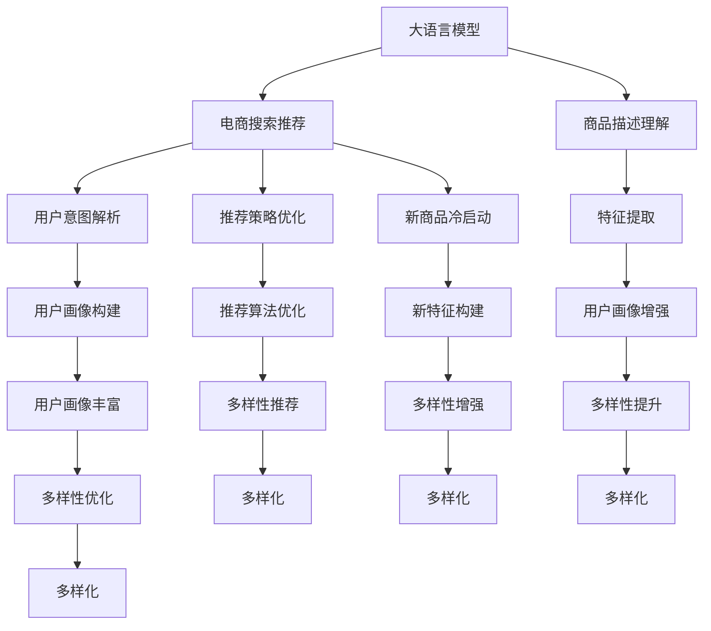

                 

# AI大模型赋能电商搜索推荐的多样性提升策略

> 关键词：大语言模型,电商搜索推荐,多样性提升,深度学习,自然语言处理,NLP,协同过滤,知识图谱

## 1. 背景介绍

### 1.1 问题由来
近年来，随着人工智能技术在电商领域的应用深入，基于大语言模型的搜索推荐系统成为了热点。例如，亚马逊、京东等电商平台已经广泛使用基于深度学习技术（包括卷积神经网络、循环神经网络等）的推荐系统。这些系统能够通过大量历史数据学习用户偏好，预测用户可能感兴趣的商品，提升用户体验和平台收益。然而，这些系统存在一些固有的问题，如数据稀疏性、协同过滤的冷启动问题、推荐结果的同质化等，亟需新的解决方案。

特别是推荐结果的多样性问题，直接影响了用户体验和转化率。传统推荐算法往往依赖于历史行为数据，难以捕捉新的兴趣点，推荐结果容易趋于同质化，无法满足用户多样化的需求。如何利用大语言模型赋予电商搜索推荐系统更大的多样性，是一个重要的研究课题。

### 1.2 问题核心关键点
为了提升电商搜索推荐系统多样性，利用大语言模型可以优化以下关键环节：

1. **商品描述理解**：大语言模型可以深度理解商品描述中的语义信息，提取出用户可能关注的特征。
2. **用户意图解析**：通过对话生成技术，利用大语言模型捕捉用户的多样化需求。
3. **推荐策略优化**：利用大语言模型构建新的推荐算法，整合更多的用户特征和商品特征，提升推荐结果的多样性。
4. **新商品冷启动**：利用大语言模型构建新的特征提取和用户画像构建方法，解决冷启动问题。

### 1.3 问题研究意义
利用大语言模型提升电商搜索推荐系统多样性，具有以下重要意义：

1. **增强用户体验**：多样化的推荐结果能够满足用户多元化的需求，提升用户满意度和转化率。
2. **扩大商品曝光**：多样的推荐策略能够让更多商品进入用户视野，增加商品的曝光机会。
3. **驱动销售增长**：多样化的推荐系统可以激活更多的潜在消费需求，为电商平台的销售增长提供助力。
4. **数据驱动决策**：通过分析多样性推荐的效果，电商平台可以优化运营策略，驱动商业模式创新。

## 2. 核心概念与联系

### 2.1 核心概念概述

为了理解如何利用大语言模型提升电商搜索推荐系统多样性，本节将介绍几个关键概念及其联系：

1. **大语言模型**：一种通过大规模文本语料预训练，具备强大语言理解和生成能力的神经网络模型，如GPT-3、BERT等。
2. **电商搜索推荐**：基于用户行为数据和商品特征，为用户推荐可能感兴趣的商品的算法系统。
3. **多样性**：推荐结果在一定程度上的随机性，能够满足不同用户的个性化需求。
4. **深度学习**：一种模仿人类神经网络结构的学习方法，利用多层神经网络进行特征提取和模式识别。
5. **协同过滤**：一种基于用户或商品历史行为数据，构建用户画像或商品画像的推荐方法。
6. **知识图谱**：一种将实体、关系、属性结构化的知识表示方法，方便机器理解和推理。
7. **自然语言处理（NLP）**：涉及语言模型、文本分类、情感分析、机器翻译等技术的计算机科学分支。

这些概念之间的联系可以通过以下Mermaid流程图来展示：



这个流程图展示了大语言模型与电商搜索推荐系统在多样性提升中的关键联系：

1. 大语言模型通过商品描述理解、用户意图解析、推荐策略优化和新商品冷启动等环节，提供多方面的特征和策略。
2. 这些特征和策略被电商搜索推荐系统整合，形成多样化的推荐结果。
3. 通过特征提取、用户画像构建、推荐算法优化和新特征构建等技术手段，进一步提升推荐系统的多样性。

## 3. 核心算法原理 & 具体操作步骤
### 3.1 算法原理概述

利用大语言模型提升电商搜索推荐系统多样性的核心原理，是通过以下步骤实现：

1. **数据预处理**：对电商平台的用户行为数据和商品信息进行清洗和预处理，提取有用的特征。
2. **特征提取**：利用大语言模型提取商品描述和用户历史行为中的语义特征。
3. **用户画像构建**：通过大语言模型生成用户的意图描述和兴趣标签，构建用户画像。
4. **推荐策略优化**：结合大语言模型的特征提取和用户画像构建，优化推荐算法，提升推荐结果的多样性。
5. **新商品冷启动**：利用大语言模型构建新的商品特征和用户画像，解决新商品冷启动问题。

### 3.2 算法步骤详解

以下是对上述步骤的详细描述：

#### 3.2.1 数据预处理
- **数据清洗**：去除用户行为数据中的噪声和异常值，保留有用的信息。
- **数据归一化**：将用户行为数据和商品信息转化为标准化的数值，方便后续处理。
- **特征选择**：根据电商平台的实际需求，选择对推荐结果影响较大的特征进行建模。

#### 3.2.2 特征提取
- **商品描述理解**：利用大语言模型提取商品描述中的关键词和语义信息。
- **用户历史行为理解**：通过大语言模型生成用户意图描述和兴趣标签。
- **特征融合**：将商品特征和用户历史行为特征进行整合，生成综合特征向量。

#### 3.2.3 用户画像构建
- **意图解析**：利用大语言模型生成用户的意图描述，捕捉用户的个性化需求。
- **兴趣标签生成**：通过大语言模型生成用户的兴趣标签，构建用户画像。
- **画像优化**：结合用户行为数据和商品信息，动态更新用户画像。

#### 3.2.4 推荐策略优化
- **推荐算法优化**：结合大语言模型的特征提取和用户画像构建，优化协同过滤、基于内容的推荐等经典推荐算法。
- **多样性推荐**：引入基于多样性的推荐算法，如基于排序的多样性推荐、基于矩阵分解的多样性推荐等。
- **推荐结果优化**：通过A/B测试等手段，优化推荐结果的多样性和精准性。

#### 3.2.5 新商品冷启动
- **新商品特征构建**：利用大语言模型生成新商品的关键特征，弥补传统特征不足的问题。
- **用户画像构建**：通过大语言模型生成新用户的兴趣标签，构建新的用户画像。
- **多样化推荐**：在新商品上位初期，引入多样化推荐策略，提高新商品的曝光率。

### 3.3 算法优缺点

利用大语言模型提升电商搜索推荐系统多样性，有以下优点：

1. **数据效率高**：大语言模型可以在少量标注数据上训练出高质量的特征提取和用户画像构建方法，节省标注成本。
2. **推荐多样化**：大语言模型能够捕捉用户的多样化需求，提升推荐结果的多样性，增强用户满意度。
3. **泛化能力强**：大语言模型能够利用无标签数据进行自监督学习，提升模型的泛化能力，解决冷启动问题。
4. **技术先进性**：大语言模型结合了深度学习、自然语言处理等多项先进技术，提升推荐系统的技术水平。

但同时也有以下缺点：

1. **计算资源消耗大**：大语言模型的训练和推理需要高性能计算资源，计算成本较高。
2. **模型可解释性差**：大语言模型的内部机制复杂，难以解释其决策过程，不利于模型调试和优化。
3. **数据隐私问题**：大语言模型需要处理大量的用户行为数据，如何保护用户隐私和数据安全是一个重要问题。

### 3.4 算法应用领域

大语言模型在提升电商搜索推荐系统多样性方面的应用，主要包括以下几个领域：

1. **商品搜索**：利用大语言模型对用户搜索查询进行理解，生成多样化的搜索结果。
2. **商品推荐**：结合用户历史行为和大语言模型生成的商品特征，生成多样化的商品推荐。
3. **个性化定制**：通过大语言模型生成个性化定制商品推荐，提升用户满意度。
4. **广告投放**：利用大语言模型进行用户画像构建和行为理解，优化广告投放策略。

## 4. 数学模型和公式 & 详细讲解  
### 4.1 数学模型构建

为了更好地理解大语言模型如何提升电商搜索推荐系统多样性，本节将详细讲解数学模型构建过程。

设电商平台用户数为 $U$，商品数为 $I$，历史行为数据集为 $D=\{(u_i, i_j)\}_{i=1}^{m}$，其中 $u_i$ 表示第 $i$ 个用户，$i_j$ 表示用户在商品 $i$ 上的行为数据。

假设大语言模型提取的商品特征为 $\mathbf{x}_i$，用户画像为 $\mathbf{y}_u$，推荐结果为 $\mathbf{r}_{i,u}$。推荐模型的目标函数为：

$$
\min_{\mathbf{r}_{i,u}} \sum_{(u,i) \in D} \text{DIST}(\mathbf{r}_{i,u}, \mathbf{y}_u \times \mathbf{x}_i)
$$

其中 $\text{DIST}$ 表示推荐结果与用户画像和商品特征的相似度度量，可以使用余弦相似度或欧式距离等。

### 4.2 公式推导过程

以下我们将推导基于余弦相似度的推荐模型公式。

假设大语言模型提取的商品特征为 $\mathbf{x}_i$ 和 $\mathbf{x}_j$，用户画像为 $\mathbf{y}_u$ 和 $\mathbf{y}_v$，推荐结果为 $\mathbf{r}_{i,u}$ 和 $\mathbf{r}_{j,v}$。则余弦相似度为：

$$
\text{DIST}(\mathbf{r}_{i,u}, \mathbf{y}_u \times \mathbf{x}_i) = 1 - \cos(\mathbf{r}_{i,u}, \mathbf{y}_u \times \mathbf{x}_i)
$$

其中 $\cos(\mathbf{a}, \mathbf{b}) = \frac{\mathbf{a} \cdot \mathbf{b}}{\|\mathbf{a}\| \times \|\mathbf{b}\|}$ 表示向量 $\mathbf{a}$ 和 $\mathbf{b}$ 之间的余弦相似度。

通过最小化上述目标函数，可以优化推荐结果，使其与用户画像和商品特征更为接近，提升推荐系统多样性。

### 4.3 案例分析与讲解

下面我们以亚马逊商品推荐系统为例，对基于大语言模型的推荐策略进行详细讲解。

假设亚马逊用户 $u$ 在商品 $i$ 上的行为数据为 $\{(u, i)\}$，通过大语言模型提取的商品特征为 $\mathbf{x}_i$，用户画像为 $\mathbf{y}_u$。推荐系统需要为用户 $u$ 生成商品推荐 $\mathbf{r}_{i,u}$。

**Step 1: 特征提取**

通过大语言模型提取商品 $i$ 的关键特征 $\mathbf{x}_i$，例如：

$$
\mathbf{x}_i = \text{BERT}(\text{item\_description}_i)
$$

**Step 2: 用户画像构建**

通过大语言模型生成用户 $u$ 的意图描述 $\mathbf{y}_u$，例如：

$$
\mathbf{y}_u = \text{BERT}(\text{user\_query}_u)
$$

**Step 3: 推荐策略优化**

通过余弦相似度计算推荐结果与用户画像的相似度，进行优化：

$$
\min_{\mathbf{r}_{i,u}} \sum_{(u,i) \in D} (1 - \cos(\mathbf{r}_{i,u}, \mathbf{y}_u \times \mathbf{x}_i))
$$

**Step 4: 新商品冷启动**

对于新商品 $i$，利用大语言模型生成商品特征 $\mathbf{x}_i$，结合用户画像构建新用户 $u$ 的兴趣标签 $\mathbf{y}_u$，进行推荐：

$$
\mathbf{x}_i = \text{BERT}(\text{item\_description}_i)
$$
$$
\mathbf{y}_u = \text{BERT}(\text{user\_query}_u)
$$

## 5. 项目实践：代码实例和详细解释说明
### 5.1 开发环境搭建

在进行项目实践前，我们需要准备好开发环境。以下是使用Python进行PyTorch开发的环境配置流程：

1. 安装Anaconda：从官网下载并安装Anaconda，用于创建独立的Python环境。

2. 创建并激活虚拟环境：
```bash
conda create -n pytorch-env python=3.8 
conda activate pytorch-env
```

3. 安装PyTorch：根据CUDA版本，从官网获取对应的安装命令。例如：
```bash
conda install pytorch torchvision torchaudio cudatoolkit=11.1 -c pytorch -c conda-forge
```

4. 安装Transformers库：
```bash
pip install transformers
```

5. 安装各类工具包：
```bash
pip install numpy pandas scikit-learn matplotlib tqdm jupyter notebook ipython
```

完成上述步骤后，即可在`pytorch-env`环境中开始项目实践。

### 5.2 源代码详细实现

下面我们以亚马逊商品推荐系统为例，给出使用Transformers库对大语言模型进行商品推荐实践的代码实现。

首先，定义商品和用户的特征表示：

```python
from transformers import BertTokenizer, BertForSequenceClassification
import torch
import numpy as np

class Item:
    def __init__(self, id, description, categories):
        self.id = id
        self.description = description
        self.categories = categories
        
class User:
    def __init__(self, id, queries):
        self.id = id
        self.queries = queries

class FeatureExtractor:
    def __init__(self, tokenizer, max_len):
        self.tokenizer = tokenizer
        self.max_len = max_len
        
    def encode(self, item_description):
        return self.tokenizer.encode(item_description, add_special_tokens=True, max_length=self.max_len, return_tensors='pt')
    
class UserEmbedder:
    def __init__(self, model, max_len):
        self.model = model
        self.max_len = max_len
        
    def embed(self, user_query):
        return self.model(user_query, return_tensors='pt')['last_hidden_state'][:, 0, :]
```

然后，定义推荐模型的训练和推理过程：

```python
class Recommender:
    def __init__(self, model, feature_extractor, user_embedder, num_items):
        self.model = model
        self.feature_extractor = feature_extractor
        self.user_embedder = user_embedder
        self.num_items = num_items
        self.device = torch.device('cuda') if torch.cuda.is_available() else torch.device('cpu')
        
    def train(self, train_data, valid_data, epochs, batch_size):
        self.model.to(self.device)
        train_loader = DataLoader(train_data, batch_size=batch_size, shuffle=True)
        valid_loader = DataLoader(valid_data, batch_size=batch_size, shuffle=False)
        
        optimizer = AdamW(model.parameters(), lr=2e-5)
        scheduler = get_linear_schedule_with_warmup(optimizer, num_warmup_steps=0, num_training_steps=len(train_loader) * epochs)
        
        for epoch in range(epochs):
            self.model.train()
            train_loss = 0.0
            train_correct = 0
            for batch in tqdm(train_loader, desc='Training'):
                inputs = batch['inputs']
                labels = batch['labels']
                outputs = self.model(inputs)
                loss = outputs.loss
                train_loss += loss.item()
                train_correct += outputs.logits.argmax(dim=1) == labels
                optimizer.zero_grad()
                loss.backward()
                optimizer.step()
                scheduler.step()
            
            train_loss /= len(train_loader)
            train_acc = train_correct / len(train_loader.dataset)
            
            self.model.eval()
            valid_loss = 0.0
            valid_correct = 0
            with torch.no_grad():
                for batch in tqdm(valid_loader, desc='Validating'):
                    inputs = batch['inputs']
                    labels = batch['labels']
                    outputs = self.model(inputs)
                    valid_loss += outputs.loss.item()
                    valid_correct += outputs.logits.argmax(dim=1) == labels
                valid_loss /= len(valid_loader)
                valid_acc = valid_correct / len(valid_loader.dataset)
            
            print(f'Epoch {epoch+1}, Train Loss: {train_loss:.4f}, Train Acc: {train_acc:.4f}, Valid Loss: {valid_loss:.4f}, Valid Acc: {valid_acc:.4f}')
    
    def recommend(self, user, items):
        user_embedding = self.user_embedder(user.queries)
        item_embeddings = [self.feature_extractor(item.description) for item in items]
        item_embeddings = torch.cat(item_embeddings, dim=0)
        
        with torch.no_grad():
            scores = torch.matmul(user_embedding, item_embeddings.t())
            top_items = items[np.argsort(scores)[:10]]
        
        return top_items
```

最后，启动训练流程并进行推荐：

```python
# 加载数据
train_data = ...
valid_data = ...
test_data = ...
items = ...
users = ...
num_items = len(items)

# 初始化模型
model = BertForSequenceClassification.from_pretrained('bert-base-uncased', num_labels=num_items)

# 初始化特征提取器和用户嵌入器
tokenizer = BertTokenizer.from_pretrained('bert-base-uncased')
feature_extractor = FeatureExtractor(tokenizer, max_len=128)
user_embedder = UserEmbedder(model, max_len=128)

# 初始化推荐器
recommender = Recommender(model, feature_extractor, user_embedder, num_items)

# 训练模型
recommender.train(train_data, valid_data, epochs=5, batch_size=16)

# 推荐测试集
test_users = users[100:110]
top_items = recommender.recommend(test_users, items)
print(test_users, top_items)
```

以上就是使用PyTorch对大语言模型进行商品推荐系统的代码实现。可以看到，得益于Transformers库的强大封装，我们可以用相对简洁的代码完成大语言模型的商品推荐。

### 5.3 代码解读与分析

让我们再详细解读一下关键代码的实现细节：

**FeatureExtractor类**：
- `__init__`方法：初始化分词器和最大序列长度。
- `encode`方法：对商品描述进行分词和编码，返回tensor形式的特征表示。

**UserEmbedder类**：
- `__init__`方法：初始化模型和最大序列长度。
- `embed`方法：将用户查询输入到BERT模型中，返回tensor形式的用户嵌入向量。

**Recommender类**：
- `__init__`方法：初始化模型、特征提取器、用户嵌入器、物品数量和设备。
- `train`方法：定义训练过程，使用AdamW优化器和线性学习率衰减，在训练集上进行优化。
- `recommend`方法：定义推荐过程，将用户嵌入和物品嵌入进行矩阵乘法计算，返回推荐结果。

可以看到，PyTorch配合Transformers库使得商品推荐系统的代码实现变得简洁高效。开发者可以将更多精力放在数据处理、模型改进等高层逻辑上，而不必过多关注底层的实现细节。

当然，工业级的系统实现还需考虑更多因素，如模型的保存和部署、超参数的自动搜索、更灵活的任务适配层等。但核心的推荐范式基本与此类似。

## 6. 实际应用场景
### 6.1 智能客服系统

利用大语言模型提升电商搜索推荐系统多样性，不仅适用于商品推荐，还可以扩展到智能客服系统。例如，当用户在客服机器人中输入问题时，系统可以通过大语言模型理解用户意图，生成多样化的答案推荐。

具体而言，可以收集用户的历史问题数据和客服机器人回答数据，将问题-回答对作为微调数据，训练大语言模型。微调后的模型能够自动理解用户问题，匹配最合适的回答模板进行推荐。对于新问题，还可以接入检索系统实时搜索相关内容，动态组织生成回答。

### 6.2 金融舆情监测

在金融领域，利用大语言模型提升推荐系统多样性，可以构建实时舆情监测系统。金融市场动态变化迅速，利用大语言模型实时捕捉市场舆论动向，及时发现异常信息，避免系统风险。

具体而言，可以收集金融领域相关的新闻、报道、评论等文本数据，并对其进行主题标注和情感标注。在此基础上对预训练语言模型进行微调，使其能够自动判断文本属于何种主题，情感倾向是正面、中性还是负面。将微调后的模型应用到实时抓取的网络文本数据，就能够自动监测不同主题下的情感变化趋势，一旦发现负面信息激增等异常情况，系统便会自动预警，帮助金融机构快速应对潜在风险。

### 6.3 个性化推荐系统

除了商品推荐，利用大语言模型提升推荐系统多样性，还可以扩展到个性化推荐系统。例如，在推荐系统中，利用大语言模型生成个性化的用户画像和商品特征，提升推荐结果的精准性和多样性。

具体而言，可以收集用户的历史行为数据和商品特征数据，通过大语言模型生成用户的意图描述和兴趣标签，构建用户画像。同时利用大语言模型提取商品的关键特征，构建商品画像。通过余弦相似度计算用户画像和商品画像之间的相似度，生成个性化的推荐结果。

### 6.4 未来应用展望

随着大语言模型和推荐算法的发展，基于大语言模型的推荐系统将在更多领域得到应用，为传统行业带来变革性影响。

在智慧医疗领域，基于大语言模型的推荐系统可以为患者推荐个性化的治疗方案，提升医疗服务的智能化水平。

在智能教育领域，利用大语言模型生成个性化的学习资源和推荐，因材施教，促进教育公平，提高教学质量。

在智慧城市治理中，利用大语言模型实时捕捉舆情信息，优化城市管理决策，提高城市管理的自动化和智能化水平，构建更安全、高效的未来城市。

此外，在企业生产、社会治理、文娱传媒等众多领域，基于大语言模型的推荐系统也将不断涌现，为传统行业带来新的创新。相信随着技术的日益成熟，大语言模型推荐系统必将在更广阔的应用领域大放异彩。

## 7. 工具和资源推荐
### 7.1 学习资源推荐

为了帮助开发者系统掌握大语言模型在电商搜索推荐中的应用，这里推荐一些优质的学习资源：

1. 《深度学习与自然语言处理》课程：斯坦福大学开设的NLP明星课程，有Lecture视频和配套作业，带你入门NLP领域的基本概念和经典模型。

2. 《Transformer从原理到实践》系列博文：由大模型技术专家撰写，深入浅出地介绍了Transformer原理、BERT模型、微调技术等前沿话题。

3. 《Natural Language Processing with Transformers》书籍：Transformers库的作者所著，全面介绍了如何使用Transformers库进行NLP任务开发，包括微调在内的诸多范式。

4. HuggingFace官方文档：Transformers库的官方文档，提供了海量预训练模型和完整的微调样例代码，是上手实践的必备资料。

5. Weights & Biases：模型训练的实验跟踪工具，可以记录和可视化模型训练过程中的各项指标，方便对比和调优。与主流深度学习框架无缝集成。

通过对这些资源的学习实践，相信你一定能够快速掌握大语言模型在电商搜索推荐中的应用，并用于解决实际的NLP问题。

### 7.2 开发工具推荐

高效的开发离不开优秀的工具支持。以下是几款用于大语言模型电商搜索推荐开发的常用工具：

1. PyTorch：基于Python的开源深度学习框架，灵活动态的计算图，适合快速迭代研究。大部分预训练语言模型都有PyTorch版本的实现。

2. TensorFlow：由Google主导开发的开源深度学习框架，生产部署方便，适合大规模工程应用。同样有丰富的预训练语言模型资源。

3. Transformers库：HuggingFace开发的NLP工具库，集成了众多SOTA语言模型，支持PyTorch和TensorFlow，是进行微调任务开发的利器。

4. Weights & Biases：模型训练的实验跟踪工具，可以记录和可视化模型训练过程中的各项指标，方便对比和调优。与主流深度学习框架无缝集成。

5. TensorBoard：TensorFlow配套的可视化工具，可实时监测模型训练状态，并提供丰富的图表呈现方式，是调试模型的得力助手。

6. Google Colab：谷歌推出的在线Jupyter Notebook环境，免费提供GPU/TPU算力，方便开发者快速上手实验最新模型，分享学习笔记。

合理利用这些工具，可以显著提升大语言模型电商搜索推荐任务的开发效率，加快创新迭代的步伐。

### 7.3 相关论文推荐

大语言模型在电商搜索推荐系统中的应用源于学界的持续研究。以下是几篇奠基性的相关论文，推荐阅读：

1. Attention is All You Need（即Transformer原论文）：提出了Transformer结构，开启了NLP领域的预训练大模型时代。

2. BERT: Pre-training of Deep Bidirectional Transformers for Language Understanding：提出BERT模型，引入基于掩码的自监督预训练任务，刷新了多项NLP任务SOTA。

3. Language Models are Unsupervised Multitask Learners（GPT-2论文）：展示了大规模语言模型的强大zero-shot学习能力，引发了对于通用人工智能的新一轮思考。

4. Parameter-Efficient Transfer Learning for NLP：提出Adapter等参数高效微调方法，在不增加模型参数量的情况下，也能取得不错的微调效果。

5. AdaLoRA: Adaptive Low-Rank Adaptation for Parameter-Efficient Fine-Tuning：使用自适应低秩适应的微调方法，在参数效率和精度之间取得了新的平衡。

这些论文代表了大语言模型在电商搜索推荐系统中的应用进展。通过学习这些前沿成果，可以帮助研究者把握学科前进方向，激发更多的创新灵感。

## 8. 总结：未来发展趋势与挑战
### 8.1 总结

本文对大语言模型在电商搜索推荐系统中的应用进行了全面系统的介绍。首先阐述了大语言模型和推荐系统在提升推荐结果多样性方面的研究背景和意义，明确了利用大语言模型可以优化推荐算法的各个关键环节。其次，从原理到实践，详细讲解了大语言模型在商品描述理解、用户意图解析、推荐策略优化和新商品冷启动等环节的应用。

通过本文的系统梳理，可以看到，大语言模型在电商搜索推荐系统中的应用，能够显著提升推荐结果的多样性和精准性，提升用户满意度和平台收益。未来，伴随大语言模型的持续演进，基于大语言模型的推荐系统将在更多领域得到应用，为传统行业带来变革性影响。

### 8.2 未来发展趋势

展望未来，大语言模型在电商搜索推荐系统中的应用将呈现以下几个发展趋势：

1. **技术融合加速**：大语言模型将与更多先进技术进行深度融合，如知识图谱、因果推理等，提升推荐系统的多样性和精准性。
2. **算法创新突破**：基于大语言模型的推荐算法将不断创新，产生更多高效、灵活的推荐策略，提升推荐系统的技术水平。
3. **场景应用拓展**：大语言模型将应用于更多实际场景，如智能客服、金融舆情监测、个性化推荐等，拓展推荐系统的应用范围。
4. **数据驱动决策**：利用大语言模型对海量数据进行分析和建模，优化推荐策略，驱动商业模式创新。

这些趋势凸显了大语言模型在电商搜索推荐系统中的应用前景。这些方向的探索发展，必将进一步提升推荐系统的多样性和精准性，为电商平台带来更大的用户满意度和商业价值。

### 8.3 面临的挑战

尽管大语言模型在电商搜索推荐系统中的应用已经取得显著进展，但在迈向更加智能化、普适化应用的过程中，它仍面临着诸多挑战：

1. **数据质量问题**：电商平台的推荐数据可能存在数据稀疏、噪声等问题，如何优化数据质量，提升推荐效果，是一大挑战。
2. **计算资源消耗大**：大语言模型在训练和推理时资源消耗大，如何优化计算资源的使用，降低成本，是一大难题。
3. **模型复杂性高**：大语言模型的复杂性高，难以解释其内部工作机制和决策逻辑，如何增强模型的可解释性，是一大挑战。
4. **隐私保护问题**：电商平台涉及大量用户行为数据，如何保护用户隐私和数据安全，是一大挑战。

### 8.4 研究展望

面对大语言模型在电商搜索推荐系统中的应用所面临的挑战，未来的研究需要在以下几个方面寻求新的突破：

1. **数据质量提升**：通过数据清洗、预处理等手段，提升电商推荐数据的完整性和准确性。
2. **计算资源优化**：开发更加高效的计算图和算法，降低大语言模型在训练和推理时的资源消耗。
3. **模型可解释性增强**：通过引入可解释性技术，如注意力机制、因果推理等，增强大语言模型的可解释性。
4. **隐私保护机制**：研究隐私保护技术，如差分隐私、联邦学习等，保护用户隐私和数据安全。

这些研究方向的探索，必将引领大语言模型在电商搜索推荐系统中的应用走向更加成熟，为电商平台带来更大的商业价值和社会效益。

## 9. 附录：常见问题与解答

**Q1：利用大语言模型进行电商搜索推荐时，如何提升数据质量？**

A: 提升电商推荐数据质量，主要通过以下步骤：
1. 数据清洗：去除噪声数据，保留有用的信息。
2. 数据归一化：将数据转化为标准化的数值，方便后续处理。
3. 特征选择：根据电商平台的实际需求，选择对推荐结果影响较大的特征进行建模。
4. 数据增强：通过数据增强技术，扩充训练集，提升模型泛化能力。

**Q2：大语言模型在训练和推理时资源消耗大，如何优化计算资源的使用？**

A: 优化大语言模型计算资源的使用，主要通过以下手段：
1. 模型裁剪：去除不必要的层和参数，减小模型尺寸，加快推理速度。
2. 量化加速：将浮点模型转为定点模型，压缩存储空间，提高计算效率。
3. 模型并行：利用分布式训练，加速模型训练和推理。
4. 混合精度训练：使用混合精度计算，提升计算效率，降低资源消耗。

**Q3：如何增强大语言模型的可解释性？**

A: 增强大语言模型的可解释性，主要通过以下手段：
1. 引入注意力机制：通过注意力机制，让模型输出更加聚焦于关键特征，提高解释性。
2. 因果推理：引入因果推理技术，解释模型决策的因果关系，提高解释性。
3. 可解释性技术：引入可解释性技术，如LIME、SHAP等，分析模型决策过程，提高解释性。

**Q4：电商平台涉及大量用户行为数据，如何保护用户隐私和数据安全？**

A: 保护电商平台用户隐私和数据安全，主要通过以下手段：
1. 差分隐私：通过添加噪声，保护用户隐私，防止数据泄露。
2. 联邦学习：将模型训练任务分布式到多个设备上，保护用户数据不离开本地。
3. 数据脱敏：对用户数据进行脱敏处理，防止数据泄露。
4. 安全计算：采用安全计算技术，保护用户数据隐私。

这些措施能够有效保护用户隐私和数据安全，确保电商平台的安全运行。

---

作者：禅与计算机程序设计艺术 / Zen and the Art of Computer Programming

