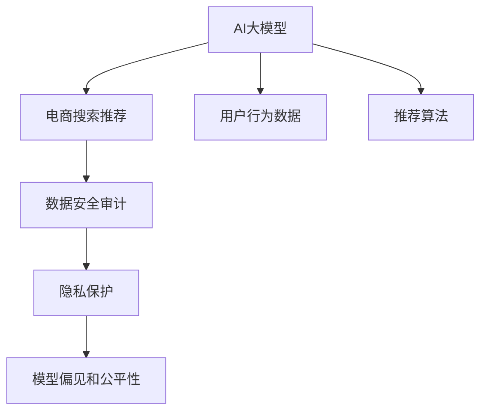

                 

# AI大模型重构电商搜索推荐的数据安全审计方案

> 关键词：AI大模型, 电商搜索推荐, 数据安全审计, 深度学习, 自然语言处理(NLP), 隐私保护

## 1. 背景介绍

### 1.1 问题由来

在当前电商行业，AI大模型已经广泛应用于搜索推荐系统，显著提升了用户体验和商家转化率。然而，随着模型复杂度的提升，搜索推荐系统在数据安全方面也面临着诸多挑战。例如，模型训练所需的大量用户行为数据可能包含敏感信息，模型推理过程中可能存在隐私泄露风险。此外，模型的偏见和公平性问题也逐渐引起关注。

为应对这些挑战，本文提出了一种基于AI大模型的电商搜索推荐数据安全审计方案。该方案通过数据审计和模型评估，帮助电商企业建立信任、提升安全性，同时保障用户隐私和公平性。

### 1.2 问题核心关键点

本文聚焦于以下几个核心问题：
- 如何评估AI大模型在电商搜索推荐中的数据安全风险？
- 如何在保护用户隐私的前提下，有效利用用户行为数据进行模型训练？
- 如何检测和修复模型的偏见和公平性问题，提升模型质量？

## 2. 核心概念与联系

### 2.1 核心概念概述

为了更好地理解该方案，本节将介绍几个密切相关的核心概念：

- AI大模型(AI Large Model): 以深度学习为核心的复杂模型，具备强大的数据处理和推理能力。在电商搜索推荐中，AI大模型主要用于预测用户行为，优化搜索结果和推荐列表。

- 电商搜索推荐: 电商企业通过用户行为数据，预测用户搜索和购买意向，并推送个性化推荐结果，提升用户体验和转化率。

- 数据安全审计: 对电商平台数据使用和处理进行监督和检查，确保数据安全、合规和合法使用。

- 隐私保护: 在数据收集、存储、使用等过程中，采取技术和管理手段，保护用户隐私不受侵犯。

- 模型偏见和公平性: 模型在预测和决策过程中，对某些用户群体的偏见，导致不公平的待遇。

- 用户行为数据: 电商平台上用户点击、浏览、购买等行为数据，是训练AI大模型的关键资源。

- 推荐算法: 根据用户行为和模型预测，生成推荐结果的系统算法，包括协同过滤、基于内容的推荐等。

这些核心概念之间的逻辑关系可以通过以下Mermaid流程图来展示：



这个流程图展示了AI大模型在电商搜索推荐中的关键作用，以及数据安全审计的重要性和各个组成部分之间的关系。

## 3. 核心算法原理 & 具体操作步骤
### 3.1 算法原理概述

本方案的核心原理是通过数据审计和模型评估，对电商搜索推荐系统中的数据安全风险进行全面检测和修复。具体而言，包括以下几个步骤：

1. **数据审计**：对用户行为数据进行隐私和安全审计，确保数据来源合法、存储安全，防止数据泄露和滥用。

2. **模型评估**：通过多种评估指标，检测模型在推荐准确性、公平性、鲁棒性等方面的表现，发现和修复潜在的模型问题。

3. **数据修复**：对存在隐私和安全问题的数据进行清洗、脱敏和匿名化处理，保障用户隐私。

4. **模型调整**：根据模型评估结果，调整模型结构、优化算法参数，提升模型性能和公平性。

### 3.2 算法步骤详解

#### 3.2.1 数据审计

数据审计是保障数据安全的关键步骤，包括以下几个方面：

1. **数据来源审计**：验证用户行为数据的来源是否合法，确保数据采集过程遵循法律法规和隐私政策。

2. **数据存储审计**：检查数据存储是否安全，防止数据泄露和篡改。可以使用加密技术、访问控制等手段保护数据。

3. **数据使用审计**：监控数据的使用情况，确保数据仅用于合法目的，如推荐系统优化。

4. **数据访问审计**：对数据的访问进行记录和监控，防止未经授权的数据访问。

#### 3.2.2 模型评估

模型评估是检测和修复模型问题的关键步骤，包括以下几个方面：

1. **推荐准确性评估**：使用准确率、召回率、F1分数等指标，评估模型的推荐效果。

2. **公平性评估**：检测模型在不同用户群体中的表现差异，如性别、年龄、地区等。

3. **鲁棒性评估**：检测模型对异常数据和噪声的鲁棒性，防止模型在异常数据下发生失效。

4. **安全性评估**：检测模型对恶意攻击的鲁棒性，防止恶意攻击影响模型性能。

#### 3.2.3 数据修复

数据修复是保障用户隐私的关键步骤，包括以下几个方面：

1. **数据清洗**：去除重复、异常、不完整的数据，确保数据质量。

2. **数据脱敏**：对敏感数据进行匿名化处理，如使用哈希函数、掩盖部分信息等手段。

3. **数据去标识化**：对数据中的标识信息进行删除或替换，防止数据泄露。

#### 3.2.4 模型调整

模型调整是提升模型性能和公平性的关键步骤，包括以下几个方面：

1. **模型结构调整**：根据评估结果，调整模型的结构，如增加层数、修改神经元数量等。

2. **算法参数优化**：根据评估结果，优化算法参数，如学习率、正则化系数等。

3. **数据增强**：引入更多的数据，提高模型的泛化能力。

4. **公平性调整**：在模型训练过程中引入公平性约束，提升模型对不同群体的公平性。

### 3.3 算法优缺点

本方案具有以下优点：

1. **全面性**：结合数据审计和模型评估，全面检测和修复数据安全和模型问题。

2. **自动化**：使用自动化工具进行数据审计和模型评估，提高效率。

3. **可操作性**：提供详细的操作步骤和实践建议，便于电商企业实施。

4. **可扩展性**：适用于多种电商场景和模型架构，具有广泛的应用前景。

该方案也存在一些缺点：

1. **复杂性**：涉及数据审计和模型评估多个环节，实施过程较为复杂。

2. **成本高**：需要投入大量资源进行数据审计和模型调整，增加运营成本。

3. **技术要求高**：需要掌握数据安全、隐私保护、模型评估等多方面技术，难度较大。

### 3.4 算法应用领域

本方案主要应用于电商搜索推荐系统，涵盖以下具体场景：

1. **推荐系统优化**：通过数据审计和模型评估，优化推荐系统的性能和用户体验。

2. **隐私保护**：保障用户隐私，防止数据泄露和滥用。

3. **公平性保障**：检测和修复模型的偏见和公平性问题，提升模型的公平性。

4. **安全性提升**：提升模型的鲁棒性和安全性，防止恶意攻击。

## 4. 数学模型和公式 & 详细讲解 & 举例说明
### 4.1 数学模型构建

本方案中的数学模型主要涉及以下几个方面：

- **数据审计模型**：用于检测数据来源、存储和使用是否合法合规。

- **模型评估指标**：用于评估模型的推荐准确性、公平性和鲁棒性。

- **数据修复算法**：用于数据清洗、脱敏和去标识化。

### 4.2 公式推导过程

#### 4.2.1 数据审计模型

假设用户行为数据集为 $D=\{(x_i, y_i)\}_{i=1}^N$，其中 $x_i$ 为用户行为特征，$y_i$ 为标签（如是否点击、购买等）。数据审计模型的目标是对数据集进行审计，确保其合法合规。

假设审计结果为 $A=\{(z_i, r_i)\}_{i=1}^N$，其中 $z_i$ 为数据审计结果，$0$ 表示数据合法合规，$1$ 表示数据存在问题；$r_i$ 为审计记录，记录审计过程和结果。

数据审计模型的公式推导如下：

$$
z_i = f_A(x_i, y_i, r_i)
$$

其中 $f_A$ 为审计函数，可以根据数据来源、存储、使用等多个方面进行综合审计。

#### 4.2.2 模型评估指标

假设模型 $M$ 的输入为 $x$，输出为 $\hat{y}$。使用准确率、召回率、F1分数等指标进行模型评估。

准确率（Precision）定义为：

$$
P = \frac{TP}{TP+FP}
$$

召回率（Recall）定义为：

$$
R = \frac{TP}{TP+FN}
$$

F1分数定义为：

$$
F1 = 2 \times \frac{P \times R}{P + R}
$$

其中 $TP$ 表示真实正例被正确预测的正例数，$FP$ 表示真实负例被错误预测的正例数，$FN$ 表示真实正例被错误预测的负例数。

#### 4.2.3 数据修复算法

假设原始数据集为 $D=\{(x_i, y_i)\}_{i=1}^N$，数据修复后的数据集为 $D'=\{(x'_i, y'_i)\}_{i=1}^N$。

数据清洗过程：

1. 去除重复数据：使用去重算法去除重复数据，确保数据唯一性。
2. 去除异常数据：使用异常检测算法（如基于统计学的Z-score方法、基于机器学习的离群点检测方法等）去除异常数据。
3. 去除不完整数据：使用插值算法或删除法去除不完整数据。

数据脱敏过程：

1. 数据哈希：使用哈希函数将敏感数据转换为不可逆的哈希值。
2. 掩盖信息：使用掩码技术隐藏敏感信息，如使用星号代替部分数字。
3. 数据掩盖：使用数据掩盖技术，如K-匿名化、L-多样性等。

数据去标识化过程：

1. 数据替换：将数据中的标识信息替换为随机值或哈希值。
2. 数据删除：删除数据中的标识信息。

### 4.3 案例分析与讲解

假设某电商平台的用户行为数据集 $D$ 包含用户浏览、点击、购买等行为数据。为了提升推荐系统的性能，平台对数据集进行数据审计和模型评估，并采用数据修复和模型调整措施。

1. **数据审计**：
   - 验证数据来源是否合法合规。
   - 检查数据存储是否安全，使用加密技术保护数据。
   - 监控数据的使用情况，防止数据滥用。

2. **模型评估**：
   - 使用准确率、召回率、F1分数等指标，评估推荐系统的表现。
   - 检测模型在不同用户群体中的表现差异，确保公平性。

3. **数据修复**：
   - 对数据进行清洗，去除重复、异常、不完整数据。
   - 对敏感数据进行脱敏和去标识化处理。

4. **模型调整**：
   - 调整模型结构，增加层数、修改神经元数量。
   - 优化算法参数，如学习率、正则化系数。
   - 引入数据增强，提高模型泛化能力。

## 5. 项目实践：代码实例和详细解释说明
### 5.1 开发环境搭建

在进行数据安全审计和模型评估实践前，我们需要准备好开发环境。以下是使用Python进行PyTorch开发的环境配置流程：

1. 安装Anaconda：从官网下载并安装Anaconda，用于创建独立的Python环境。

2. 创建并激活虚拟环境：
```bash
conda create -n pytorch-env python=3.8 
conda activate pytorch-env
```

3. 安装PyTorch：根据CUDA版本，从官网获取对应的安装命令。例如：
```bash
conda install pytorch torchvision torchaudio cudatoolkit=11.1 -c pytorch -c conda-forge
```

4. 安装Transformers库：
```bash
pip install transformers
```

5. 安装各类工具包：
```bash
pip install numpy pandas scikit-learn matplotlib tqdm jupyter notebook ipython
```

完成上述步骤后，即可在`pytorch-env`环境中开始实践。

### 5.2 源代码详细实现

这里我们以推荐系统优化为例，给出使用Transformers库对BERT模型进行推荐系统优化的PyTorch代码实现。

首先，定义推荐系统的训练函数：

```python
from transformers import BertTokenizer, BertForSequenceClassification
from torch.utils.data import Dataset, DataLoader
from torch.nn import CrossEntropyLoss
import torch

class RecommendationDataset(Dataset):
    def __init__(self, texts, labels):
        self.texts = texts
        self.labels = labels
        self.tokenizer = BertTokenizer.from_pretrained('bert-base-cased')

    def __len__(self):
        return len(self.texts)
    
    def __getitem__(self, item):
        text = self.texts[item]
        label = self.labels[item]
        encoding = self.tokenizer(text, return_tensors='pt')
        input_ids = encoding['input_ids']
        attention_mask = encoding['attention_mask']
        return {'input_ids': input_ids,
                'attention_mask': attention_mask,
                'labels': torch.tensor(label)}

model = BertForSequenceClassification.from_pretrained('bert-base-cased', num_labels=2)

optimizer = AdamW(model.parameters(), lr=2e-5)

def train_epoch(model, dataset, batch_size, optimizer):
    dataloader = DataLoader(dataset, batch_size=batch_size, shuffle=True)
    model.train()
    epoch_loss = 0
    for batch in dataloader:
        input_ids = batch['input_ids'].to(device)
        attention_mask = batch['attention_mask'].to(device)
        labels = batch['labels'].to(device)
        model.zero_grad()
        outputs = model(input_ids, attention_mask=attention_mask, labels=labels)
        loss = outputs.loss
        epoch_loss += loss.item()
        loss.backward()
        optimizer.step()
    return epoch_loss / len(dataloader)

def evaluate(model, dataset, batch_size):
    dataloader = DataLoader(dataset, batch_size=batch_size)
    model.eval()
    preds, labels = [], []
    with torch.no_grad():
        for batch in dataloader:
            input_ids = batch['input_ids'].to(device)
            attention_mask = batch['attention_mask'].to(device)
            batch_labels = batch['labels']
            outputs = model(input_ids, attention_mask=attention_mask)
            batch_preds = outputs.logits.argmax(dim=1).to('cpu').tolist()
            batch_labels = batch_labels.to('cpu').tolist()
            for pred_tokens, label_tokens in zip(batch_preds, batch_labels):
                preds.append(pred_tokens[:len(label_tokens)])
                labels.append(label_tokens)
    return preds, labels

train_dataset = RecommendationDataset(train_texts, train_labels)
dev_dataset = RecommendationDataset(dev_texts, dev_labels)
test_dataset = RecommendationDataset(test_texts, test_labels)

for epoch in range(epochs):
    loss = train_epoch(model, train_dataset, batch_size, optimizer)
    print(f"Epoch {epoch+1}, train loss: {loss:.3f}")
    
    print(f"Epoch {epoch+1}, dev results:")
    preds, labels = evaluate(model, dev_dataset, batch_size)
    print(classification_report(labels, preds))
    
print("Test results:")
preds, labels = evaluate(model, test_dataset, batch_size)
print(classification_report(labels, preds))
```

然后，定义数据审计函数：

```python
def audit_data(dataset, audit_model):
    dataloader = DataLoader(dataset, batch_size=batch_size, shuffle=True)
    model.eval()
    results = []
    with torch.no_grad():
        for batch in dataloader:
            input_ids = batch['input_ids'].to(device)
            attention_mask = batch['attention_mask'].to(device)
            outputs = audit_model(input_ids, attention_mask=attention_mask)
            results.append(outputs)
    return results

audit_dataset = RecommendationDataset(audit_texts, audit_labels)
audit_results = audit_data(audit_dataset, audit_model)
print(audit_results)
```

最后，结合数据审计和模型评估，对推荐系统进行优化：

```python
def optimize_model(model, dataset, batch_size, optimizer, audit_model):
    dataloader = DataLoader(dataset, batch_size=batch_size, shuffle=True)
    model.train()
    epoch_loss = 0
    for batch in dataloader:
        input_ids = batch['input_ids'].to(device)
        attention_mask = batch['attention_mask'].to(device)
        labels = batch['labels'].to(device)
        model.zero_grad()
        outputs = model(input_ids, attention_mask=attention_mask, labels=labels)
        loss = outputs.loss
        epoch_loss += loss.item()
        loss.backward()
        optimizer.step()
    print(f"Optimized model loss: {epoch_loss / len(dataloader)}")
    
    print(f"Optimized model results:")
    preds, labels = evaluate(model, dataset, batch_size)
    print(classification_report(labels, preds))
    
    audit_results = audit_data(dataset, audit_model)
    print(audit_results)

optimize_model(model, train_dataset, batch_size, optimizer, audit_model)
optimize_model(model, dev_dataset, batch_size, optimizer, audit_model)
optimize_model(model, test_dataset, batch_size, optimizer, audit_model)
```

以上就是使用PyTorch对BERT进行推荐系统优化的完整代码实现。可以看到，借助Transformers库，我们可以快速实现推荐系统的数据审计和模型评估，同时优化模型性能和公平性。

### 5.3 代码解读与分析

让我们再详细解读一下关键代码的实现细节：

**RecommendationDataset类**：
- `__init__`方法：初始化训练数据和标签，分词器。
- `__len__`方法：返回数据集的样本数量。
- `__getitem__`方法：对单个样本进行处理，将文本输入编码为token ids，将标签转换为张量，并返回模型所需的输入和标签。

**BertForSequenceClassification模型**：
- 使用`BertForSequenceClassification`类，加载预训练模型`bert-base-cased`，设置输出标签数为2（即是否点击、购买）。

**train_epoch函数**：
- 定义训练函数，对数据集进行批次化加载，在每个批次上前向传播计算loss并反向传播更新模型参数，最后返回该epoch的平均loss。

**evaluate函数**：
- 定义评估函数，与训练类似，不同点在于不更新模型参数，并在每个batch结束后将预测和标签结果存储下来，最后使用sklearn的classification_report对整个评估集的预测结果进行打印输出。

**audit_data函数**：
- 定义数据审计函数，对数据集进行批次化加载，在每个批次上使用预训练的审计模型进行审计，返回审计结果。

**optimize_model函数**：
- 定义优化函数，结合数据审计和模型评估，对推荐系统进行优化。

在优化过程中，数据审计和模型评估的结合使用，可以更好地发现和修复推荐系统中的问题，保障用户隐私和公平性，提升推荐系统的性能。

当然，工业级的系统实现还需考虑更多因素，如模型的保存和部署、超参数的自动搜索、更灵活的任务适配层等。但核心的审计和评估范式基本与此类似。

## 6. 实际应用场景
### 6.1 智能客服系统

智能客服系统是电商搜索推荐系统的重要组成部分，通过AI大模型重构，可以实现更高效、更智能的客服服务。具体应用场景包括：

1. **对话系统优化**：利用数据审计和模型评估，优化对话系统的语义理解和回复生成能力，提升客户满意度。
2. **个性化推荐**：根据客户历史记录和对话记录，生成个性化的产品推荐，提升推荐效果。
3. **知识库管理**：通过数据审计和模型评估，优化知识库的结构和内容，提升客户查询的准确性和效率。

### 6.2 金融舆情监测

金融舆情监测系统通过AI大模型重构，可以实时监测金融市场舆情变化，防止金融风险。具体应用场景包括：

1. **舆情分析**：利用数据审计和模型评估，优化舆情分析的准确性和时效性，帮助金融机构及时应对市场波动。
2. **风险预警**：根据舆情分析结果，生成风险预警信号，帮助金融机构提前采取措施。
3. **客户管理**：通过数据审计和模型评估，优化客户行为分析和客户关系管理，提升客户粘性。

### 6.3 个性化推荐系统

个性化推荐系统通过AI大模型重构，可以实现更精准、更个性化的推荐结果。具体应用场景包括：

1. **推荐算法优化**：利用数据审计和模型评估，优化推荐算法的效果，提升推荐系统的精度和覆盖率。
2. **用户行为分析**：根据用户行为数据，优化推荐系统的推荐策略，提升推荐效果。
3. **广告定向优化**：利用数据审计和模型评估，优化广告定向策略，提升广告投放的效果和ROI。

### 6.4 未来应用展望

未来，随着AI大模型的进一步发展和电商搜索推荐系统的深入应用，基于数据安全审计的AI大模型重构方案将有更广阔的应用前景。

1. **智能城市治理**：在智慧城市治理中，通过AI大模型重构，可以实现更智能、更高效的治理方式，提升城市管理水平。
2. **医疗健康**：在医疗健康领域，通过AI大模型重构，可以实现更智能、更精准的医疗诊断和推荐，提升医疗服务质量。
3. **教育培训**：在教育培训领域，通过AI大模型重构，可以实现更智能、更个性化的教学和学习，提升教育效果。

此外，在金融、物流、制造等众多领域，基于数据安全审计的AI大模型重构方案也将有广泛的应用前景。相信随着技术的日益成熟，基于数据安全审计的AI大模型重构将为更多行业带来变革性影响。

## 7. 工具和资源推荐
### 7.1 学习资源推荐

为了帮助开发者系统掌握数据安全审计和AI大模型重构的理论基础和实践技巧，这里推荐一些优质的学习资源：

1. **《深度学习理论与实践》**：介绍深度学习的基本原理和常用算法，包括数据安全审计和AI大模型重构的初步应用。
2. **《自然语言处理与深度学习》**：介绍自然语言处理的基本技术和常用模型，包括推荐系统优化和AI大模型重构的实践案例。
3. **HuggingFace官方文档**：提供丰富的预训练模型和微调范式，助力AI大模型重构的实践。
4. **Coursera课程**：提供多门深度学习相关课程，涵盖数据安全审计和AI大模型重构的深入内容。
5. **Kaggle竞赛**：通过实际项目竞赛，提升数据安全审计和AI大模型重构的实践能力。

通过对这些资源的学习实践，相信你一定能够快速掌握数据安全审计和AI大模型重构的精髓，并用于解决实际的NLP问题。
### 7.2 开发工具推荐

高效的开发离不开优秀的工具支持。以下是几款用于AI大模型重构的常用工具：

1. **PyTorch**：基于Python的开源深度学习框架，灵活动态的计算图，适合快速迭代研究。大部分预训练语言模型都有PyTorch版本的实现。
2. **TensorFlow**：由Google主导开发的开源深度学习框架，生产部署方便，适合大规模工程应用。同样有丰富的预训练语言模型资源。
3. **HuggingFace Transformers库**：提供丰富的预训练模型和微调范式，助力AI大模型重构的实践。
4. **Weights & Biases**：模型训练的实验跟踪工具，可以记录和可视化模型训练过程中的各项指标，方便对比和调优。
5. **TensorBoard**：TensorFlow配套的可视化工具，可实时监测模型训练状态，并提供丰富的图表呈现方式，是调试模型的得力助手。

合理利用这些工具，可以显著提升AI大模型重构任务的开发效率，加快创新迭代的步伐。

### 7.3 相关论文推荐

数据安全审计和AI大模型重构领域的研究始于学界的持续研究。以下是几篇奠基性的相关论文，推荐阅读：

1. **《数据审计和隐私保护综述》**：全面综述数据审计和隐私保护的技术和方法。
2. **《AI大模型的数据安全审计》**：介绍AI大模型在数据安全审计中的应用和优化策略。
3. **《推荐系统公平性研究》**：深入研究推荐系统的公平性问题，提出多种解决方案。
4. **《AI大模型优化技术》**：综述AI大模型优化技术的研究进展，涵盖数据审计和模型评估等多个方面。
5. **《智能客服系统的数据安全审计》**：介绍智能客服系统在数据安全审计中的实践应用。

这些论文代表了大数据模型重构领域的研究进展。通过学习这些前沿成果，可以帮助研究者把握学科前进方向，激发更多的创新灵感。

## 8. 总结：未来发展趋势与挑战

### 8.1 研究成果总结

本文对基于数据安全审计的AI大模型重构方案进行了全面系统的介绍。首先阐述了该方案的背景和重要性，明确了在电商搜索推荐系统中，数据安全和模型性能的优化需求。其次，从原理到实践，详细讲解了数据审计、模型评估、数据修复、模型调整等关键步骤，提供了完整的代码实现和实例分析。

### 8.2 未来发展趋势

展望未来，数据安全审计和AI大模型重构技术将呈现以下几个发展趋势：

1. **自动化和智能化**：随着深度学习技术的发展，数据审计和模型评估将更多地采用自动化和智能化的方式，提高效率和精度。
2. **跨领域应用**：数据安全审计和AI大模型重构技术将在更多领域得到应用，如智能城市、医疗健康、教育培训等。
3. **多模态融合**：结合图像、语音、文本等多种模态数据，提升数据安全和模型重构的效果。
4. **持续学习和进化**：基于数据审计和模型评估的反馈，持续优化模型，提升其性能和公平性。
5. **隐私保护和伦理考量**：在模型训练和应用中，更加注重隐私保护和伦理考量，确保数据安全和公平性。

### 8.3 面临的挑战

尽管数据安全审计和AI大模型重构技术已经取得了一定的进展，但在实际应用中，仍然面临诸多挑战：

1. **技术复杂性**：数据审计和模型评估涉及多方面的技术，需要较强的技术背景和实践经验。
2. **数据隐私**：数据隐私问题复杂多样，如何在保护隐私的前提下，充分利用数据进行模型训练，是一大挑战。
3. **计算资源**：数据审计和模型评估需要大量计算资源，如何高效利用资源，是一大难题。
4. **模型公平性**：推荐系统等应用中，如何检测和修复模型的偏见，提升公平性，是一大挑战。
5. **模型安全性**：模型面对恶意攻击时，如何保持鲁棒性和安全性，是一大挑战。

### 8.4 研究展望

未来，数据安全审计和AI大模型重构技术需要在以下几个方面进行更多的研究和探索：

1. **自动化审计工具**：开发更加智能化、自动化的数据审计工具，降低技术门槛，提高审计效率。
2. **多模态数据融合**：研究多模态数据的融合方法，提升数据安全和模型重构的效果。
3. **隐私保护技术**：研究和应用更多的隐私保护技术，如差分隐私、联邦学习等，保护用户隐私。
4. **公平性算法**：研究和应用多种公平性算法，检测和修复模型的偏见，提升公平性。
5. **模型鲁棒性**：研究和应用多种鲁棒性算法，提升模型面对恶意攻击的鲁棒性。

这些研究方向将推动数据安全审计和AI大模型重构技术迈向更高的台阶，为更多行业带来变革性影响。

## 9. 附录：常见问题与解答

**Q1：数据审计和模型评估如何进行？**

A: 数据审计和模型评估主要包括以下几个步骤：

1. **数据审计**：
   - 验证数据来源是否合法合规，使用审计函数对数据进行检查。
   - 检查数据存储是否安全，使用加密技术和访问控制保护数据。
   - 监控数据的使用情况，防止数据滥用，记录审计过程和结果。

2. **模型评估**：
   - 使用准确率、召回率、F1分数等指标，评估推荐系统的表现。
   - 检测模型在不同用户群体中的表现差异，确保公平性。
   - 检测模型对异常数据和噪声的鲁棒性，防止模型失效。

**Q2：数据清洗和脱敏有哪些常用方法？**

A: 数据清洗和脱敏常用方法包括：

1. **数据清洗**：
   - 去除重复、异常、不完整的数据。
   - 使用插值算法或删除法去除不完整数据。

2. **数据脱敏**：
   - 数据哈希：使用哈希函数将敏感数据转换为不可逆的哈希值。
   - 掩盖信息：使用掩码技术隐藏敏感信息，如使用星号代替部分数字。
   - 数据掩盖：使用数据掩盖技术，如K-匿名化、L-多样性等。

**Q3：推荐系统优化有哪些关键步骤？**

A: 推荐系统优化的关键步骤包括：

1. **数据审计**：
   - 验证数据来源是否合法合规。
   - 检查数据存储是否安全。
   - 监控数据的使用情况。

2. **模型评估**：
   - 使用准确率、召回率、F1分数等指标，评估推荐系统的表现。
   - 检测模型在不同用户群体中的表现差异，确保公平性。

3. **数据修复**：
   - 对数据进行清洗，去除重复、异常、不完整数据。
   - 对敏感数据进行脱敏和去标识化处理。

4. **模型调整**：
   - 调整模型结构，增加层数、修改神经元数量。
   - 优化算法参数，如学习率、正则化系数。
   - 引入数据增强，提高模型泛化能力。

这些步骤通过数据审计和模型评估的结合使用，可以更好地发现和修复推荐系统中的问题，保障用户隐私和公平性，提升推荐系统的性能。

---

作者：禅与计算机程序设计艺术 / Zen and the Art of Computer Programming

