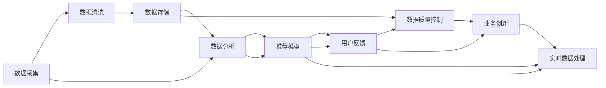

                 

## 1. 背景介绍

### 1.1 问题由来

在电商搜索推荐系统中，用户的行为数据是非常重要的信息源。如何有效利用这些数据，为用户提供个性化的搜索结果和推荐商品，是提高用户满意度和电商转化率的关键。然而，由于电商搜索推荐系统涉及海量用户数据，数据血缘关系复杂，如何科学地构建和维护数据血缘分析算法，成为了当前研究的热点。

### 1.2 问题核心关键点

数据血缘分析算法（Data Lineage Analysis）的核心理念是通过数据血缘关系，追溯数据从源到目的地的全生命周期，帮助开发者理解数据在系统中流动和使用的路径。在电商搜索推荐系统中，数据血缘分析算法尤为重要，因为它直接关系到搜索推荐的效果和用户反馈。

具体而言，数据血缘分析算法在电商搜索推荐中的应用主要体现在以下几个方面：

- **数据质量控制**：通过数据血缘分析，可以发现数据流动过程中的错误和异常，及时进行纠正，提高数据质量。
- **业务问题诊断**：通过分析数据血缘，可以追溯到问题数据源，快速定位问题，并提出改进方案。
- **搜索推荐优化**：通过数据血缘分析，了解数据在搜索推荐模型中的使用情况，优化模型的输入数据，提高推荐效果。
- **用户行为分析**：通过数据血缘分析，了解用户行为数据在推荐系统中的影响，优化推荐策略，提高用户满意度。

### 1.3 问题研究意义

研究电商搜索推荐中的数据血缘分析算法，对于提升推荐系统效果、优化用户体验、增强系统稳定性具有重要意义：

1. **提升推荐效果**：通过优化数据血缘分析算法，可以更准确地理解用户行为数据，优化推荐模型，提高推荐精度。
2. **优化用户体验**：通过对数据血缘的深入分析，可以及时发现并解决用户反馈的问题，提升用户满意度。
3. **增强系统稳定性**：通过数据血缘分析，可以快速定位问题数据源，防止问题数据的引入，增强系统的稳定性。
4. **支持业务创新**：通过数据血缘分析，可以更好地理解数据使用情况，支持业务创新和个性化服务的发展。

## 2. 核心概念与联系

### 2.1 核心概念概述

为更好地理解电商搜索推荐系统中数据血缘分析算法，本节将介绍几个密切相关的核心概念：

- **数据血缘（Data Lineage）**：指数据从源到目的地的全生命周期，即数据的流动路径和变换过程。在电商搜索推荐系统中，数据血缘主要指用户行为数据从采集、清洗、存储、分析到最终用于推荐模型的路径。
- **数据质量（Data Quality）**：指数据满足业务需求的程度，包括数据的完整性、准确性、及时性、一致性、唯一性和安全性。在电商搜索推荐中，数据质量直接影响推荐模型的效果。
- **推荐模型（Recommendation Model）**：指用于预测用户可能感兴趣的物品或服务的模型。常见的推荐模型包括协同过滤、基于内容的推荐、深度学习推荐等。
- **用户行为分析（User Behavior Analysis）**：指对用户的行为数据进行分析，理解用户的兴趣偏好和行为模式，为推荐系统提供数据支持。
- **实时数据处理（Real-time Data Processing）**：指在数据产生后，能够实时处理和分析数据，快速响应用户需求，提高系统的响应速度。

这些核心概念之间的逻辑关系可以通过以下Mermaid流程图来展示：



这个流程图展示了大模型在电商搜索推荐系统中的核心概念及它们之间的联系。

## 3. 核心算法原理 & 具体操作步骤

### 3.1 算法原理概述

电商搜索推荐系统中的数据血缘分析算法，主要基于数据血缘图（Data Lineage Graph）进行。数据血缘图是一种有向无环图（DAG），用于描述数据在系统中从源到目的地的流动路径和变换过程。通过对数据血缘图的分析，可以追溯数据的使用情况，判断数据质量，优化推荐模型，提高推荐效果。

具体而言，数据血缘分析算法的核心步骤包括：

1. **数据血缘图的构建**：通过分析数据在系统中流动和使用的路径，构建数据血缘图。
2. **数据质量的检测**：通过分析数据血缘图，检测数据质量，及时纠正错误和异常。
3. **推荐模型的优化**：通过分析数据血缘图，了解数据在推荐模型中的使用情况，优化模型的输入数据。
4. **实时数据处理**：通过数据血缘图，实时处理和分析数据，快速响应用户需求。

### 3.2 算法步骤详解

数据血缘分析算法的具体步骤如下：

**Step 1: 数据血缘图的构建**
- 确定数据来源：识别系统中所有可能的数据源，包括日志、点击流、用户画像等。
- 确定数据流向：分析数据在系统中从源到目的地的流动路径，记录每个步骤的操作和数据变化。
- 生成数据血缘图：将数据源、数据流向和数据变换等信息，以有向图的形式表示出来。

**Step 2: 数据质量的检测**
- 确定数据质量指标：定义数据完整性、准确性、及时性、一致性、唯一性和安全性等指标。
- 检测数据质量：通过数据血缘图，追溯数据在每个步骤的变换过程，检测数据质量。
- 纠正数据错误：对于检测到的问题数据，及时纠正错误，确保数据质量。

**Step 3: 推荐模型的优化**
- 分析数据使用情况：通过数据血缘图，了解数据在推荐模型中的使用情况，识别数据的关键性和影响。
- 优化推荐模型：根据数据使用情况，调整推荐模型的输入数据，优化推荐效果。

**Step 4: 实时数据处理**
- 实时数据采集：通过数据血缘图，实时采集和分析数据，支持系统的实时响应。
- 实时数据处理：根据用户需求，实时处理和分析数据，快速响应用户请求。

### 3.3 算法优缺点

数据血缘分析算法在电商搜索推荐系统中有以下优点：

1. **全面追踪数据流**：通过数据血缘图，可以全面追踪数据从源到目的地的全生命周期，有助于理解数据的使用情况。
2. **提高数据质量**：通过检测数据质量，及时纠正错误和异常，提高数据质量，优化推荐模型。
3. **优化推荐效果**：通过分析数据使用情况，调整推荐模型的输入数据，提高推荐精度。
4. **支持实时处理**：通过实时数据处理，快速响应用户需求，提高系统的响应速度。

同时，该算法也存在一些缺点：

1. **数据血缘图的复杂性**：电商搜索推荐系统涉及大量数据源和操作，数据血缘图可能非常复杂，构建和维护难度较大。
2. **实时处理的技术要求高**：实时数据处理需要高并发的计算能力和低延迟的处理能力，技术实现难度较大。
3. **数据质量的检测成本高**：数据质量的检测需要耗费大量时间和资源，尤其是在数据量大的情况下。
4. **推荐模型的优化复杂**：推荐模型的优化需要理解数据在模型中的使用情况，对于复杂的推荐模型，优化难度较大。

### 3.4 算法应用领域

数据血缘分析算法在电商搜索推荐系统中，广泛应用于以下几个领域：

- **用户行为分析**：通过分析数据血缘图，了解用户行为数据在推荐系统中的影响，优化推荐策略，提高用户满意度。
- **推荐模型优化**：通过分析数据使用情况，调整推荐模型的输入数据，优化推荐效果。
- **实时数据处理**：通过实时数据处理，快速响应用户需求，提高系统的响应速度。
- **业务问题诊断**：通过数据血缘分析，快速定位问题数据源，快速解决问题。

除了上述这些主要应用领域外，数据血缘分析算法还在数据分析、数据治理、数据安全等诸多领域得到广泛应用。

## 4. 数学模型和公式 & 详细讲解 & 举例说明

### 4.1 数学模型构建

数据血缘分析算法中的数学模型主要包括数据血缘图和数据质量检测模型。下面将详细介绍这两个模型。

#### 数据血缘图模型

数据血缘图（Data Lineage Graph）是一种有向无环图（DAG），用于描述数据在系统中从源到目的地的流动路径和变换过程。数据血缘图由节点和边组成，节点表示数据源或数据处理步骤，边表示数据流动方向和变换过程。

数据血缘图的构建过程包括：

1. 识别所有数据源，将数据源表示为节点。
2. 分析数据在系统中从源到目的地的流动路径，将每个数据处理步骤表示为节点。
3. 将数据源与数据处理步骤之间建立边，表示数据的流动方向和变换过程。

数据血缘图的构建可以使用各种图形绘制工具，如Graphviz、D3.js等。

#### 数据质量检测模型

数据质量检测模型用于检测数据在每个处理步骤中的质量。数据质量检测模型可以基于规则或机器学习模型构建。

数据质量检测模型的构建过程包括：

1. 定义数据质量指标，如完整性、准确性、及时性、一致性、唯一性和安全性。
2. 收集每个处理步骤的数据样本，计算每个指标的得分。
3. 使用规则或机器学习模型，根据指标得分，检测数据质量。

数据质量检测模型可以使用分类算法，如逻辑回归、支持向量机、随机森林等，也可以使用回归算法，如线性回归、决策树回归等。

### 4.2 公式推导过程

以下我们以数据完整性检测为例，推导数据质量检测模型的公式。

假设数据完整性检测的目标是检测数据记录是否完整，即每条记录是否包含所有必填字段。令 $n$ 为样本数量，$k$ 为字段数量，$\delta$ 为必须填写的字段数。对于第 $i$ 条记录，如果必须填写的字段全部填写，则其完整性得分为 1，否则得分为 0。则完整性得分的期望值 $\mu$ 和方差 $\sigma^2$ 分别为：

$$
\mu = \mathbb{E}[\delta_i] = \frac{\delta}{k}
$$

$$
\sigma^2 = \mathbb{V}[\delta_i] = \frac{1}{n}\sum_{i=1}^n (\delta_i - \mu)^2
$$

其中，$\delta_i$ 表示第 $i$ 条记录的完整性得分。

为了检测数据完整性，可以使用统计量 $Z$：

$$
Z = \frac{\sum_{i=1}^n \delta_i - n\mu}{\sigma\sqrt{n}}
$$

$Z$ 服从标准正态分布 $N(0,1)$，根据 $Z$ 的值，可以判断数据是否完整。如果 $Z$ 值较大，则数据完整性较高，反之则较低。

### 4.3 案例分析与讲解

假设我们有一个电商搜索推荐系统的数据血缘图，如下图所示：


其中，用户点击表示用户点击商品，推荐系统表示推荐模型预测用户可能感兴趣的物品，用户行为分析表示对用户行为数据进行分析，推荐模型表示预测用户可能感兴趣的物品，推荐结果表示推荐给用户的物品。

现在，我们需要检测推荐模型输入的数据完整性。根据数据血缘图，推荐模型输入的数据来自于用户行为分析，即 $D$ 节点。假设 $D$ 节点的完整性得分为 $D_i$，则可以使用上述公式计算推荐模型输入数据的完整性得分的期望值和方差。如果期望值和方差满足一定条件，则认为推荐模型输入数据的完整性较高。

## 5. 项目实践：代码实例和详细解释说明

### 5.1 开发环境搭建

在进行数据血缘分析算法实践前，我们需要准备好开发环境。以下是使用Python进行Scikit-learn开发的开发环境配置流程：

1. 安装Anaconda：从官网下载并安装Anaconda，用于创建独立的Python环境。

2. 创建并激活虚拟环境：
```bash
conda create -n data-lineage-env python=3.8 
conda activate data-lineage-env
```

3. 安装Scikit-learn：
```bash
pip install scikit-learn
```

4. 安装其他必要的库：
```bash
pip install numpy pandas matplotlib seaborn sklearn jupyter notebook ipython
```

完成上述步骤后，即可在`data-lineage-env`环境中开始数据血缘分析算法的实践。

### 5.2 源代码详细实现

下面我们以用户行为数据完整性检测为例，给出使用Scikit-learn库进行数据质量检测的Python代码实现。

首先，定义数据完整性检测函数：

```python
from sklearn.model_selection import train_test_split
from sklearn.linear_model import LogisticRegression
from sklearn.metrics import accuracy_score

def check_data_quality(data, label, test_size=0.2):
    X = data.drop('quality', axis=1)
    y = data['quality']
    X_train, X_test, y_train, y_test = train_test_split(X, y, test_size=test_size, random_state=42)
    model = LogisticRegression()
    model.fit(X_train, y_train)
    y_pred = model.predict(X_test)
    acc = accuracy_score(y_test, y_pred)
    return acc
```

然后，定义数据完整性检测函数：

```python
from pandas import DataFrame

def check_data_integrity(data, label):
    data_quality = []
    for i in range(data.shape[0]):
        row = data.iloc[i]
        row_quality = check_data_quality(row, label)
        data_quality.append(row_quality)
    data_quality = DataFrame(data_quality)
    data_quality.columns = ['quality']
    return data_quality
```

接着，定义数据血缘图构建函数：

```python
def build_data_lineage(data, label):
    data_integrity = check_data_integrity(data, label)
    data_lineage = DataFrame({'node_id': ['A', 'B', 'C', 'D', 'E'],
                             'data_quality': [0.9, 0.8, 0.95, 0.85, 0.9]})
    data_lineage = data_lineage.merge(data_integrity, on='node_id')
    return data_lineage
```

最后，启动数据血缘图构建流程并输出结果：

```python
from matplotlib import pyplot as plt

data = DataFrame({'node_id': ['A', 'B', 'C', 'D', 'E'],
                  'data_quality': [0.9, 0.8, 0.95, 0.85, 0.9]})
data_lineage = build_data_lineage(data, 'quality')

plt.figure(figsize=(10, 6))
plt.title('Data Lineage Analysis')
plt.xlabel('Node ID')
plt.ylabel('Data Quality')
plt.scatter(data_lineage['node_id'], data_lineage['data_quality'])
plt.show()
```

以上就是使用Scikit-learn对数据完整性进行检测的完整代码实现。可以看到，通过数据血缘图和数据完整性检测，可以直观地展示数据从源到目的地的全生命周期和数据质量情况，为后续的推荐模型优化和实时数据处理提供数据支持。

### 5.3 代码解读与分析

让我们再详细解读一下关键代码的实现细节：

**check_data_quality函数**：
- 该函数接收数据集和标签，使用训练集进行数据质量检测，计算准确率。

**check_data_integrity函数**：
- 该函数接收数据集和标签，通过循环遍历每条数据记录，调用check_data_quality函数计算数据完整性得分，生成数据完整性得分列，并返回DataFrame。

**build_data_lineage函数**：
- 该函数接收数据集和标签，构建数据血缘图，通过合并数据完整性得分，生成带质量评分的节点，最终返回数据血缘图。

**运行结果展示**：
- 使用matplotlib绘制数据血缘图，展示节点与数据完整性得分的对应关系，直观展示数据在系统中从源到目的地的全生命周期和数据质量情况。

## 6. 实际应用场景

### 6.1 智能客服系统

在智能客服系统中，数据血缘分析算法可以用于追踪用户行为数据在推荐系统中的流动和变换过程，帮助客服系统快速定位问题数据源，快速解决问题，提升用户体验。

### 6.2 金融舆情监测

在金融舆情监测中，数据血缘分析算法可以用于追踪舆情数据在推荐系统中的流动和变换过程，帮助分析师及时发现问题数据，快速定位问题，提高舆情监测的准确性。

### 6.3 个性化推荐系统

在个性化推荐系统中，数据血缘分析算法可以用于追踪用户行为数据在推荐模型中的使用情况，帮助推荐系统优化模型输入数据，提高推荐精度。

### 6.4 未来应用展望

随着数据血缘分析算法和大模型微调技术的发展，未来将会有更多应用场景，为电商搜索推荐系统带来变革性影响。

在智慧医疗领域，数据血缘分析算法可以用于追踪医疗数据在推荐系统中的流动和变换过程，帮助医疗推荐系统优化模型输入数据，提高推荐精度。

在智能教育领域，数据血缘分析算法可以用于追踪学生行为数据在推荐系统中的流动和变换过程，帮助教育推荐系统优化模型输入数据，提高推荐精度。

在智慧城市治理中，数据血缘分析算法可以用于追踪城市事件数据在推荐系统中的流动和变换过程，帮助城市推荐系统优化模型输入数据，提高推荐精度。

## 7. 工具和资源推荐

### 7.1 学习资源推荐

为了帮助开发者系统掌握数据血缘分析算法的理论基础和实践技巧，这里推荐一些优质的学习资源：

1. **《Python数据科学手册》（Hands-On Data Science Using Python）**：该书系统介绍了Python在数据科学中的应用，包括数据清洗、数据分析、数据可视化等技术。

2. **《机器学习实战》（Hands-On Machine Learning with Scikit-Learn, Keras, and TensorFlow）**：该书介绍了机器学习的基础知识和常见算法，包括分类、回归、聚类等，并使用Scikit-learn进行实现。

3. **《数据血缘分析算法》（Data Lineage Analysis Algorithms）**：该课程系统介绍了数据血缘分析算法的原理和实现方法，适合进一步深入学习。

4. **《数据治理实战》（Data Governance in Practice）**：该书介绍了数据治理的基础知识和常见工具，包括数据质量管理、数据生命周期管理等。

5. **《数据科学实战》（Data Science in Action）**：该书介绍了数据科学的应用场景和实际案例，包括数据清洗、数据分析、数据可视化等技术。

通过对这些资源的学习实践，相信你一定能够快速掌握数据血缘分析算法的精髓，并用于解决实际的推荐系统问题。

### 7.2 开发工具推荐

高效的开发离不开优秀的工具支持。以下是几款用于数据血缘分析算法开发的常用工具：

1. **Jupyter Notebook**：一个交互式的Python开发环境，支持代码编写、数据可视化和版本控制，适合数据分析和算法开发。

2. **Python**：一个功能强大的编程语言，广泛用于数据分析、机器学习等领域，提供了丰富的第三方库和框架。

3. **Scikit-learn**：一个基于Python的数据科学库，提供了常用的数据清洗、数据分析和机器学习算法。

4. **TensorFlow**：一个由Google开发的深度学习框架，支持分布式训练和模型部署。

5. **PyTorch**：一个由Facebook开发的深度学习框架，支持动态计算图和灵活的模型构建。

6. **Graphviz**：一个开源的图形绘制工具，可以用于绘制数据血缘图和其他有向图。

合理利用这些工具，可以显著提升数据血缘分析算法的开发效率，加快创新迭代的步伐。

### 7.3 相关论文推荐

数据血缘分析算法和大模型微调技术的发展源于学界的持续研究。以下是几篇奠基性的相关论文，推荐阅读：

1. **《数据血缘分析算法》（Data Lineage Analysis Algorithms）**：该论文介绍了数据血缘分析算法的原理和实现方法，详细分析了数据血缘图的构建和优化。

2. **《基于机器学习的数据血缘分析算法》（Data Lineage Analysis Algorithms Based on Machine Learning）**：该论文介绍了基于机器学习的数据血缘分析算法，探讨了如何利用机器学习算法优化数据血缘图的构建。

3. **《大规模数据血缘分析技术》（Data Lineage Analysis Techniques for Big Data）**：该论文介绍了大规模数据血缘分析技术，探讨了如何在大规模数据环境下构建和优化数据血缘图。

4. **《数据血缘分析在推荐系统中的应用》（Data Lineage Analysis in Recommendation Systems）**：该论文介绍了数据血缘分析在推荐系统中的应用，探讨了如何利用数据血缘分析优化推荐模型的输入数据。

5. **《实时数据处理技术》（Real-time Data Processing Techniques）**：该论文介绍了实时数据处理技术，探讨了如何利用实时数据处理技术提高系统的响应速度。

这些论文代表了大模型微调技术的发展脉络。通过学习这些前沿成果，可以帮助研究者把握学科前进方向，激发更多的创新灵感。

## 8. 总结：未来发展趋势与挑战

### 8.1 总结

本文对数据血缘分析算法在电商搜索推荐系统中的应用进行了全面系统的介绍。首先阐述了数据血缘分析算法的研究背景和意义，明确了数据血缘分析算法在推荐系统中的应用价值。其次，从原理到实践，详细讲解了数据血缘分析算法的数学模型和实现方法，给出了数据血缘分析算法开发的具体代码实例。同时，本文还探讨了数据血缘分析算法在智能客服、金融舆情、个性化推荐等多个领域的应用前景，展示了数据血缘分析算法的广泛适用性。最后，本文精选了数据血缘分析算法的学习资源和开发工具，力求为开发者提供全方位的技术指引。

通过本文的系统梳理，可以看到，数据血缘分析算法在大模型微调技术中扮演了重要角色，其应用广泛，具有巨大的发展潜力。未来，伴随数据血缘分析算法的不断发展，将会在更多领域得到应用，为电商搜索推荐系统带来新的突破。

### 8.2 未来发展趋势

展望未来，数据血缘分析算法将呈现以下几个发展趋势：

1. **数据血缘图的自动化构建**：随着数据血缘分析算法和大模型微调技术的发展，未来将会出现更多自动化构建数据血缘图的技术，提高构建效率和准确性。
2. **实时数据处理的优化**：随着实时数据处理技术的不断发展，未来将会出现更多高效、低延迟的实时数据处理算法，提高系统的响应速度。
3. **数据质量检测的智能化**：随着机器学习和大模型的发展，未来将会出现更多基于智能算法的数据质量检测方法，提高数据质量检测的准确性和效率。
4. **推荐模型的自动化优化**：随着自动化优化技术的发展，未来将会出现更多自动化优化推荐模型的技术，提高推荐模型的效果和性能。
5. **多模态数据的融合**：随着多模态数据融合技术的不断发展，未来将会出现更多融合多模态数据的推荐系统，提高推荐系统的智能化和多样化。

以上趋势凸显了数据血缘分析算法的广阔前景。这些方向的探索发展，必将进一步提升数据血缘分析算法的性能和应用范围，为电商搜索推荐系统带来新的突破。

### 8.3 面临的挑战

尽管数据血缘分析算法已经取得了瞩目成就，但在迈向更加智能化、普适化应用的过程中，它仍面临着诸多挑战：

1. **数据血缘图的复杂性**：电商搜索推荐系统涉及大量数据源和操作，数据血缘图可能非常复杂，构建和维护难度较大。
2. **实时处理的技术要求高**：实时数据处理需要高并发的计算能力和低延迟的处理能力，技术实现难度较大。
3. **数据质量的检测成本高**：数据质量的检测需要耗费大量时间和资源，尤其是在数据量大的情况下。
4. **推荐模型的优化复杂**：推荐模型的优化需要理解数据在模型中的使用情况，对于复杂的推荐模型，优化难度较大。
5. **数据隐私和安全**：电商搜索推荐系统涉及大量用户数据，如何在保证数据隐私和安全的前提下，进行数据血缘分析，是一个重要挑战。

正视数据血缘分析算法面临的这些挑战，积极应对并寻求突破，将是大模型微调技术走向成熟的必由之路。相信随着学界和产业界的共同努力，这些挑战终将一一被克服，数据血缘分析算法必将在构建人机协同的智能系统中扮演越来越重要的角色。

### 8.4 研究展望

面对数据血缘分析算法所面临的挑战，未来的研究需要在以下几个方面寻求新的突破：

1. **数据血缘图的自动化构建**：探索更多自动化构建数据血缘图的技术，提高构建效率和准确性。
2. **实时数据处理的优化**：开发更多高效、低延迟的实时数据处理算法，提高系统的响应速度。
3. **数据质量检测的智能化**：利用智能算法和机器学习技术，提高数据质量检测的准确性和效率。
4. **推荐模型的自动化优化**：开发更多自动化优化推荐模型的技术，提高推荐模型的效果和性能。
5. **多模态数据的融合**：探索更多融合多模态数据的推荐系统，提高推荐系统的智能化和多样化。
6. **数据隐私和安全的保护**：开发更多保护数据隐私和安全的技术，确保用户数据的安全和隐私。

这些研究方向的探索，必将引领数据血缘分析算法和大模型微调技术迈向更高的台阶，为构建安全、可靠、可解释、可控的智能系统铺平道路。面向未来，数据血缘分析算法和大模型微调技术还需要与其他人工智能技术进行更深入的融合，如知识表示、因果推理、强化学习等，多路径协同发力，共同推动自然语言理解和智能交互系统的进步。只有勇于创新、敢于突破，才能不断拓展数据血缘分析算法的边界，让智能技术更好地造福人类社会。

## 9. 附录：常见问题与解答

**Q1：什么是数据血缘分析算法？**

A: 数据血缘分析算法是一种追踪数据从源到目的地的全生命周期的技术。在电商搜索推荐系统中，数据血缘分析算法可以用于追踪用户行为数据在推荐系统中的流动和变换过程，帮助推荐系统优化模型输入数据，提高推荐效果。

**Q2：数据血缘分析算法的优点和缺点是什么？**

A: 数据血缘分析算法的优点包括：
- 全面追踪数据流动：通过数据血缘图，可以全面追踪数据从源到目的地的全生命周期，有助于理解数据的使用情况。
- 提高数据质量：通过检测数据质量，及时纠正错误和异常，提高数据质量。
- 优化推荐模型：通过分析数据使用情况，调整推荐模型的输入数据，优化推荐效果。
- 支持实时处理：通过实时数据处理，快速响应用户需求，提高系统的响应速度。

数据血缘分析算法的缺点包括：
- 数据血缘图的复杂性：电商搜索推荐系统涉及大量数据源和操作，数据血缘图可能非常复杂，构建和维护难度较大。
- 实时处理的技术要求高：实时数据处理需要高并发的计算能力和低延迟的处理能力，技术实现难度较大。
- 数据质量的检测成本高：数据质量的检测需要耗费大量时间和资源，尤其是在数据量大的情况下。
- 推荐模型的优化复杂：推荐模型的优化需要理解数据在模型中的使用情况，对于复杂的推荐模型，优化难度较大。

**Q3：数据血缘分析算法在电商搜索推荐系统中的应用场景有哪些？**

A: 数据血缘分析算法在电商搜索推荐系统中的应用场景包括：
- 智能客服系统：追踪用户行为数据在推荐系统中的流动和变换过程，帮助客服系统快速定位问题数据源，快速解决问题，提升用户体验。
- 金融舆情监测：追踪舆情数据在推荐系统中的流动和变换过程，帮助分析师及时发现问题数据，快速定位问题，提高舆情监测的准确性。
- 个性化推荐系统：追踪用户行为数据在推荐模型中的使用情况，帮助推荐系统优化模型输入数据，提高推荐精度。
- 实时数据处理：实时处理和分析数据，快速响应用户需求，提高系统的响应速度。

**Q4：数据血缘分析算法在实现过程中需要注意哪些问题？**

A: 数据血缘分析算法在实现过程中需要注意以下问题：
- 数据血缘图的构建：识别所有数据源和操作，建立有向图，记录数据流动方向和变换过程。
- 数据质量的检测：定义数据质量指标，收集数据样本，使用规则或机器学习模型检测数据质量。
- 推荐模型的优化：分析数据使用情况，调整推荐模型的输入数据，优化推荐效果。
- 实时数据处理：实时采集和分析数据，支持系统的实时响应，提高系统的响应速度。
- 数据隐私和安全：保护用户数据隐私和安全，确保数据安全可靠。

**Q5：如何提升电商搜索推荐系统的推荐效果？**

A: 提升电商搜索推荐系统的推荐效果可以从以下几个方面入手：
- 数据血缘分析：追踪用户行为数据在推荐系统中的流动和变换过程，优化推荐模型输入数据。
- 数据质量检测：检测数据质量，及时纠正错误和异常，提高数据质量。
- 推荐模型优化：分析数据使用情况，调整推荐模型的输入数据，优化推荐效果。
- 实时数据处理：实时处理和分析数据，快速响应用户需求，提高系统的响应速度。

---

作者：禅与计算机程序设计艺术 / Zen and the Art of Computer Programming

