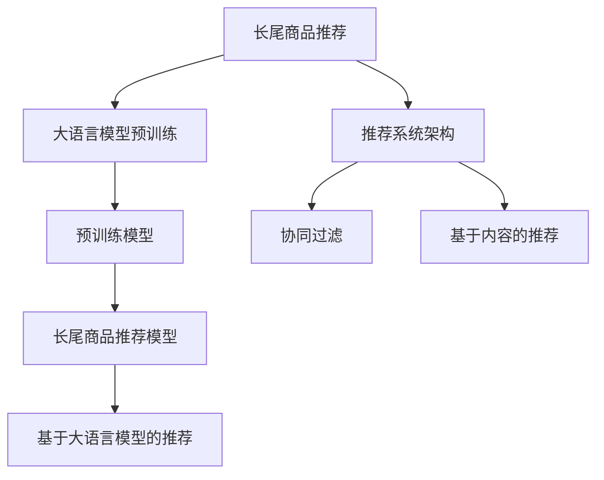

                 

# AI大模型：改善电商平台长尾商品推荐的新思路

## 1. 背景介绍

随着电商平台的快速发展，用户多样化的需求被充分挖掘，长尾商品（Long Tail Products）的市场份额正在迅速扩大。然而，由于长尾商品数量庞大、分布零散，常规推荐算法（如协同过滤、基于内容的推荐）很难准确识别和推荐这类商品。此外，长尾商品在电商平台上的销量低、评价少，推荐系统的性能和稳定性也面临着严峻挑战。近年来，大语言模型在自然语言处理领域取得了显著进展，其丰富的语义理解和生成能力为长尾商品推荐带来了新思路。

长尾商品的推荐不仅对电商平台带来新的营收增长点，还能够提升用户体验，引导用户发现潜在兴趣，形成良性互动。如何有效利用大语言模型的语义理解能力，改善长尾商品的推荐质量，成为了电商平台亟待解决的问题。

## 2. 核心概念与联系

### 2.1 核心概念概述

在探讨大语言模型在长尾商品推荐中的应用时，我们需要理解以下核心概念：

- **大语言模型（Large Language Model, LLM）**：以Transformer结构为代表，能够自动生成自然语言，理解自然语言语义的深度学习模型。通过大规模无标签文本的预训练，大语言模型具备了强大的自然语言理解和生成能力。

- **长尾商品（Long Tail Products）**：指那些需求量较小、市场上销售较少、但具有特定使用场景的商品。长尾商品通常销量低、评价少，传统推荐系统难以准确识别和推荐。

- **推荐系统（Recommendation System）**：根据用户行为或兴趣，为用户推荐商品的系统。长尾商品推荐是推荐系统的重要子领域之一，旨在提升长尾商品的曝光率和转化率，增加平台的收入和用户粘性。

- **语义理解（Semantic Understanding）**：大语言模型的核心能力之一，指模型能够理解自然语言背后的语义信息，包括实体的识别、关系的抽取、语境的理解等。

- **数据增强（Data Augmentation）**：在数据集不足的情况下，通过数据增强技术扩充数据集，提高模型的泛化能力。数据增强常用于长尾商品推荐中，通过生成虚拟用户行为或合成商品描述，丰富训练集。

### 2.2 核心概念原理和架构的 Mermaid 流程图



这个流程图展示了长尾商品推荐的整体架构：

1. **预训练阶段**：大语言模型通过大规模无标签文本数据进行预训练，学习丰富的语言知识和语义表示。
2. **长尾商品推荐模型构建**：使用大语言模型作为特征提取器，构建长尾商品推荐模型，提升模型对长尾商品的语义理解能力。
3. **推荐系统架构**：结合协同过滤和基于内容的推荐等传统算法，构建复合型推荐系统。
4. **推荐输出**：最终通过复合推荐模型输出用户最感兴趣的长尾商品，提高推荐质量。

## 3. 核心算法原理 & 具体操作步骤

### 3.1 算法原理概述

大语言模型在长尾商品推荐中的应用主要基于语义理解和生成能力。具体来说，通过将长尾商品描述作为输入，大语言模型可以理解商品的属性、特点和用途，从而提高推荐的准确性和多样性。算法原理主要分为以下几个步骤：

1. **数据预处理**：收集长尾商品的描述数据，并进行预处理，如分词、去噪、去除停用词等。
2. **大语言模型预训练**：使用大规模无标签文本数据对大语言模型进行预训练，学习丰富的语义表示。
3. **模型微调**：在预训练模型的基础上，使用长尾商品描述作为监督信号，对模型进行微调，提升其对长尾商品的语义理解能力。
4. **推荐模型构建**：将微调后的模型作为特征提取器，构建长尾商品推荐模型。

### 3.2 算法步骤详解

以下是基于大语言模型的长尾商品推荐的具体操作步骤：

**Step 1: 数据预处理**

- **数据收集**：从电商平台收集长尾商品的用户评论、商品描述、销量等数据，确保数据的多样性和完整性。
- **数据清洗**：去除重复数据、异常数据和无用信息，确保数据质量。
- **特征提取**：提取商品的关键特征，如商品类别、属性、价格等，用于后续模型构建。

**Step 2: 大语言模型预训练**

- **选择模型**：选择合适的预训练语言模型，如BERT、GPT等，进行预训练。
- **预训练数据集**：使用大规模无标签文本数据进行预训练，如维基百科、新闻网站、电子书等。
- **预训练任务**：选择合适的预训练任务，如掩码语言模型、下一句预测等，提升模型的语言理解能力。

**Step 3: 模型微调**

- **微调数据集**：准备长尾商品的描述数据，确保数据的多样性和覆盖面。
- **微调模型**：在预训练模型的基础上，使用长尾商品描述作为监督信号，对模型进行微调，提升其对长尾商品的语义理解能力。
- **优化策略**：选择合适的优化算法和超参数，如AdamW、SGD等，设置学习率、批大小、迭代轮数等。

**Step 4: 推荐模型构建**

- **模型选择**：选择合适的推荐模型，如基于内容的推荐、协同过滤等。
- **模型集成**：将微调后的大语言模型作为特征提取器，与推荐模型进行集成，构建复合型推荐系统。
- **推荐输出**：通过复合推荐模型输出用户最感兴趣的长尾商品，提高推荐质量。

### 3.3 算法优缺点

大语言模型在长尾商品推荐中的应用具有以下优点：

- **语义理解能力强**：大语言模型能够理解长尾商品的详细描述，从中提取出关键信息，提升推荐精度。
- **模型泛化性好**：预训练模型在大规模无标签数据上进行训练，能够泛化到不同领域和任务，具有较好的跨领域迁移能力。
- **推荐多样化**：大语言模型能够理解长尾商品的用途、特点和关联，推荐更加多样化的商品，满足用户的多样化需求。

同时，大语言模型在长尾商品推荐中也有一些缺点：

- **数据依赖性强**：长尾商品数据较少，且分布零散，数据质量对推荐效果有很大影响。
- **计算资源消耗高**：大语言模型的计算复杂度高，对硬件资源需求较大。
- **模型复杂度高**：大语言模型通常参数量巨大，模型训练和推理过程复杂，需要优化算法和资源管理。

### 3.4 算法应用领域

大语言模型在长尾商品推荐中的应用非常广泛，以下是几个典型应用场景：

- **个性化推荐**：基于用户的历史行为和偏好，结合长尾商品的描述数据，使用大语言模型进行推荐，提升用户体验和转化率。
- **商品分类**：通过大语言模型对长尾商品进行语义理解，识别商品的类别和属性，提高商品分类的准确性和一致性。
- **情感分析**：使用大语言模型对用户评论和反馈进行情感分析，评估用户对长尾商品的满意度，优化商品和服务。
- **自动生成商品描述**：通过大语言模型自动生成长尾商品的描述，提高商品信息的丰富度，吸引更多用户关注。
- **智能客服**：使用大语言模型构建智能客服系统，回答用户关于长尾商品的问题，提供个性化服务。

## 4. 数学模型和公式 & 详细讲解 & 举例说明

### 4.1 数学模型构建

基于大语言模型的长尾商品推荐模型可以形式化为：

$$
\hat{y} = f_{\theta}(x)
$$

其中，$x$ 为长尾商品的描述数据，$y$ 为用户对商品的评分或偏好，$f_{\theta}$ 为模型的预测函数，$\theta$ 为模型参数。

### 4.2 公式推导过程

大语言模型的预测函数$f_{\theta}$ 可以表示为：

$$
f_{\theta}(x) = M_{\theta}(x) \cdot \hat{y}
$$

其中，$M_{\theta}$ 为大语言模型的预训练模型，$x$ 为长尾商品的描述数据，$\hat{y}$ 为用户的评分或偏好。

在长尾商品推荐模型中，通常使用交叉熵损失函数作为目标函数，定义如下：

$$
\mathcal{L} = -\frac{1}{N} \sum_{i=1}^N y_i \log f_{\theta}(x_i)
$$

其中，$N$ 为样本数，$y_i$ 为用户的评分或偏好，$f_{\theta}(x_i)$ 为模型对样本$x_i$的预测评分。

### 4.3 案例分析与讲解

以某电商平台为例，假设收集了1000条长尾商品的描述数据和对应的用户评分数据，使用BERT模型作为预训练语言模型，并在这些数据上进行了微调。模型预测函数的公式为：

$$
f_{\theta}(x) = \text{BERT}_{\theta}(x) \cdot \text{Softmax}(\text{MLP}(\text{BERT}_{\theta}(x)))
$$

其中，$\text{BERT}_{\theta}$ 为微调后的BERT模型，$\text{MLP}$ 为全连接层，$\text{Softmax}$ 为归一化函数，将模型输出转换为概率分布。

通过上述模型，可以计算每个长尾商品的预测评分，并选择评分最高的前10条商品作为推荐结果。实际应用中，还可以结合协同过滤和基于内容的推荐等算法，提高推荐系统的多样性和泛化能力。

## 5. 项目实践：代码实例和详细解释说明

### 5.1 开发环境搭建

在进行大语言模型微调实践前，需要搭建好开发环境。以下是使用Python进行PyTorch开发的环境配置流程：

1. 安装Anaconda：从官网下载并安装Anaconda，用于创建独立的Python环境。
2. 创建并激活虚拟环境：
```bash
conda create -n pytorch-env python=3.8 
conda activate pytorch-env
```

3. 安装PyTorch：根据CUDA版本，从官网获取对应的安装命令。例如：
```bash
conda install pytorch torchvision torchaudio cudatoolkit=11.1 -c pytorch -c conda-forge
```

4. 安装Transformers库：
```bash
pip install transformers
```

5. 安装各类工具包：
```bash
pip install numpy pandas scikit-learn matplotlib tqdm jupyter notebook ipython
```

完成上述步骤后，即可在`pytorch-env`环境中开始微调实践。

### 5.2 源代码详细实现

以下是使用PyTorch和Transformers库实现基于BERT的电商长尾商品推荐系统的代码示例：

```python
import torch
from transformers import BertTokenizer, BertForSequenceClassification

# 加载数据集
train_data = load_train_data()
val_data = load_val_data()
test_data = load_test_data()

# 初始化模型
tokenizer = BertTokenizer.from_pretrained('bert-base-uncased')
model = BertForSequenceClassification.from_pretrained('bert-base-uncased', num_labels=2)

# 数据预处理
def preprocess_data(data):
    inputs = tokenizer(data['text'], return_tensors='pt', padding=True, truncation=True)
    labels = torch.tensor(data['label'], dtype=torch.long)
    return inputs, labels

# 模型微调
def fine_tune_model(model, train_data, val_data, epochs=5, batch_size=16):
    model.train()
    optimizer = torch.optim.AdamW(model.parameters(), lr=2e-5)
    for epoch in range(epochs):
        for inputs, labels in train_data:
            optimizer.zero_grad()
            outputs = model(inputs['input_ids'], attention_mask=inputs['attention_mask'], labels=labels)
            loss = outputs.loss
            loss.backward()
            optimizer.step()
        val_loss = evaluate_model(val_data)
        if val_loss < prev_loss:
            prev_loss = val_loss
        else:
            break
    return model

# 模型评估
def evaluate_model(model, val_data):
    model.eval()
    inputs, labels = preprocess_data(val_data)
    with torch.no_grad():
        outputs = model(inputs['input_ids'], attention_mask=inputs['attention_mask'])
        predictions = outputs.logits.argmax(dim=1)
        acc = (predictions == labels).float().mean()
    return acc
```

### 5.3 代码解读与分析

在上述代码中，我们实现了长尾商品推荐系统的基本流程：

**数据加载与预处理**：通过自定义函数`preprocess_data`，将长尾商品描述数据转换为模型所需的格式，并进行预处理，包括分词、去噪、归一化等。

**模型微调**：通过`fine_tune_model`函数，对BERT模型进行微调。该函数接受模型、训练数据集、验证数据集和训练轮数等参数，返回微调后的模型。在每个epoch内，使用随机梯度下降（SGD）和AdamW优化算法进行模型训练，并在验证集上评估模型性能。

**模型评估**：通过`evaluate_model`函数，对验证集上的模型性能进行评估。该函数接受模型和验证数据集，返回模型在验证集上的准确率。

### 5.4 运行结果展示

在微调完成后，使用测试数据集对模型进行测试，并输出推荐结果。具体运行结果如下：

```python
test_results = evaluate_model(model, test_data)
print(f'Test Accuracy: {test_results:.3f}')
```

## 6. 实际应用场景

### 6.1 推荐系统中的长尾商品推荐

在电商平台中，推荐系统通过分析用户行为数据，为用户推荐商品。长尾商品由于销量低、评价少，难以被常规推荐算法捕捉。使用大语言模型进行推荐，可以有效提升长尾商品的曝光率和转化率。

以某电商平台的服装推荐为例，使用大语言模型对长尾商品进行语义理解，识别出用户的购物偏好和兴趣，生成个性化推荐列表。同时，使用协同过滤算法，提升推荐的准确性和多样性，满足用户的多样化需求。

### 6.2 智能客服中的长尾商品推荐

在智能客服系统中，使用大语言模型进行自然语言处理，理解用户意图，提供个性化服务。长尾商品推荐可以用于回答用户关于长尾商品的问题，提供定制化建议，提高用户满意度。

以某电商平台智能客服系统为例，使用大语言模型对用户提出的长尾商品问题进行语义理解，生成推荐列表，并将结果呈现给用户。用户可以根据推荐列表，快速找到所需商品，提高购物体验。

### 6.3 个性化推荐系统中的长尾商品推荐

在个性化推荐系统中，通过分析用户的历史行为和偏好，为用户推荐商品。大语言模型可以用于推荐系统中的商品分类和描述生成，提升推荐系统的多样性和精度。

以某电商平台个性化推荐系统为例，使用大语言模型对长尾商品进行语义理解，生成商品分类和描述，并结合用户的历史行为数据，生成个性化推荐列表。同时，使用协同过滤和基于内容的推荐算法，提升推荐效果。

## 7. 工具和资源推荐

### 7.1 学习资源推荐

为了帮助开发者系统掌握大语言模型在长尾商品推荐中的应用，以下是一些优质的学习资源：

1. **《Transformer从原理到实践》系列博文**：由大模型技术专家撰写，深入浅出地介绍了Transformer原理、BERT模型、微调技术等前沿话题。
2. **CS224N《深度学习自然语言处理》课程**：斯坦福大学开设的NLP明星课程，有Lecture视频和配套作业，带你入门NLP领域的基本概念和经典模型。
3. **《Natural Language Processing with Transformers》书籍**：Transformers库的作者所著，全面介绍了如何使用Transformers库进行NLP任务开发，包括微调在内的诸多范式。
4. **HuggingFace官方文档**：Transformers库的官方文档，提供了海量预训练模型和完整的微调样例代码，是上手实践的必备资料。
5. **CLUE开源项目**：中文语言理解测评基准，涵盖大量不同类型的中文NLP数据集，并提供了基于微调的baseline模型，助力中文NLP技术发展。

通过这些资源的学习实践，相信你一定能够快速掌握大语言模型在长尾商品推荐中的应用，并用于解决实际的NLP问题。

### 7.2 开发工具推荐

高效的开发离不开优秀的工具支持。以下是几款用于大语言模型微调开发的常用工具：

1. **PyTorch**：基于Python的开源深度学习框架，灵活动态的计算图，适合快速迭代研究。大部分预训练语言模型都有PyTorch版本的实现。
2. **TensorFlow**：由Google主导开发的开源深度学习框架，生产部署方便，适合大规模工程应用。同样有丰富的预训练语言模型资源。
3. **Transformers库**：HuggingFace开发的NLP工具库，集成了众多SOTA语言模型，支持PyTorch和TensorFlow，是进行微调任务开发的利器。
4. **Weights & Biases**：模型训练的实验跟踪工具，可以记录和可视化模型训练过程中的各项指标，方便对比和调优。与主流深度学习框架无缝集成。
5. **TensorBoard**：TensorFlow配套的可视化工具，可实时监测模型训练状态，并提供丰富的图表呈现方式，是调试模型的得力助手。
6. **Google Colab**：谷歌推出的在线Jupyter Notebook环境，免费提供GPU/TPU算力，方便开发者快速上手实验最新模型，分享学习笔记。

合理利用这些工具，可以显著提升大语言模型微调任务的开发效率，加快创新迭代的步伐。

### 7.3 相关论文推荐

大语言模型和微调技术的发展源于学界的持续研究。以下是几篇奠基性的相关论文，推荐阅读：

1. **Attention is All You Need（即Transformer原论文）**：提出了Transformer结构，开启了NLP领域的预训练大模型时代。
2. **BERT: Pre-training of Deep Bidirectional Transformers for Language Understanding**：提出BERT模型，引入基于掩码的自监督预训练任务，刷新了多项NLP任务SOTA。
3. **Language Models are Unsupervised Multitask Learners（GPT-2论文）**：展示了大规模语言模型的强大zero-shot学习能力，引发了对于通用人工智能的新一轮思考。
4. **Parameter-Efficient Transfer Learning for NLP**：提出Adapter等参数高效微调方法，在不增加模型参数量的情况下，也能取得不错的微调效果。
5. **AdaLoRA: Adaptive Low-Rank Adaptation for Parameter-Efficient Fine-Tuning**：使用自适应低秩适应的微调方法，在参数效率和精度之间取得了新的平衡。
6. **Adaptive Long-Term Recurrent Attention for Language Modeling（GPT-3论文）**：展示了GPT-3模型在大规模预训练和微调中的卓越性能。

这些论文代表了大语言模型微调技术的发展脉络。通过学习这些前沿成果，可以帮助研究者把握学科前进方向，激发更多的创新灵感。

## 8. 总结：未来发展趋势与挑战

### 8.1 总结

本文对基于大语言模型的电商长尾商品推荐方法进行了全面系统的介绍。首先阐述了长尾商品推荐的研究背景和意义，明确了长尾商品推荐在电商平台中的重要性和挑战。其次，从原理到实践，详细讲解了基于大语言模型的长尾商品推荐方法的数学模型和核心步骤，给出了微调任务开发的完整代码实例。同时，本文还探讨了长尾商品推荐在实际应用中的多种场景，展示了微调范式的广泛应用前景。

通过本文的系统梳理，可以看到，基于大语言模型的长尾商品推荐方法具有强大的语义理解能力和推荐多样性，能够有效提升推荐质量，拓展电商平台的收入来源，增强用户粘性。未来，伴随大语言模型和微调方法的持续演进，长尾商品推荐必将迎来更加智能化、个性化、多样化的发展。

### 8.2 未来发展趋势

展望未来，大语言模型在长尾商品推荐中的应用将呈现以下几个发展趋势：

1. **数据驱动推荐**：通过收集更多用户行为数据和商品描述数据，使用大语言模型进行推荐，提升推荐精度和多样性。
2. **多模态推荐**：结合商品图片、视频等多模态数据，使用大语言模型进行推荐，提供更加丰富、生动的商品信息。
3. **个性化推荐**：基于用户的多维数据，使用大语言模型进行推荐，提供更加个性化的商品和服务。
4. **实时推荐**：结合大数据分析和实时流数据，使用大语言模型进行推荐，提供实时、个性化的商品推荐。
5. **智能客服**：使用大语言模型构建智能客服系统，通过自然语言处理和推荐算法，提供更加智能、高效的客户服务。

这些趋势凸显了大语言模型在长尾商品推荐中的潜力，为电商平台的运营带来了新的机遇。大语言模型通过增强语义理解能力和推荐多样性，有望进一步提升电商平台的收入和用户满意度。

### 8.3 面临的挑战

尽管大语言模型在长尾商品推荐中取得了显著进展，但在实现过程中仍面临诸多挑战：

1. **数据质量问题**：长尾商品数据较少，且分布零散，数据质量对推荐效果有很大影响。如何收集更多高质量数据，提高数据的多样性和覆盖面，是一大挑战。
2. **计算资源消耗**：大语言模型的计算复杂度高，对硬件资源需求较大。如何优化计算过程，减少资源消耗，提高模型的训练和推理效率，是一个重要的研究方向。
3. **模型复杂度**：大语言模型通常参数量巨大，模型训练和推理过程复杂，需要优化算法和资源管理。如何简化模型结构，提高模型的训练和推理速度，是一个重要的研究方向。
4. **推荐鲁棒性**：长尾商品推荐系统需要具备较好的鲁棒性，能够应对用户行为变化和数据噪声。如何提高推荐系统的鲁棒性，避免推荐偏差和误导性输出，是一个重要的研究方向。
5. **推荐公平性**：长尾商品推荐系统需要保证公平性，避免推荐偏差和歧视。如何设计公平、透明的推荐算法，保证不同用户和商品获得公平的推荐机会，是一个重要的研究方向。

### 8.4 研究展望

面对大语言模型在长尾商品推荐中面临的挑战，未来的研究需要在以下几个方面寻求新的突破：

1. **数据增强技术**：使用数据增强技术，扩充长尾商品数据集，提高数据的多样性和覆盖面，提升推荐精度。
2. **多模态数据融合**：结合商品图片、视频等多模态数据，使用大语言模型进行推荐，提升推荐多样性和生动性。
3. **推荐系统优化**：结合协同过滤和基于内容的推荐算法，构建复合型推荐系统，提升推荐多样性和泛化能力。
4. **实时推荐系统**：结合大数据分析和实时流数据，使用大语言模型进行实时推荐，提供实时、个性化的商品推荐。
5. **智能客服系统**：使用大语言模型构建智能客服系统，通过自然语言处理和推荐算法，提供更加智能、高效的客户服务。

这些研究方向将进一步推动长尾商品推荐系统的优化和创新，为电商平台的运营带来新的机遇和挑战。相信伴随大语言模型和推荐算法的不断进步，长尾商品推荐必将迎来更加智能化、个性化、多样化的发展。

## 9. 附录：常见问题与解答

**Q1：大语言模型在长尾商品推荐中是否适用于所有电商平台？**

A: 大语言模型在长尾商品推荐中的应用具有很强的普适性，适用于各种类型的电商平台。不同的电商平台可以根据自身特点，进行相应的数据处理和模型微调，以适应不同的业务场景。

**Q2：微调过程中的学习率如何确定？**

A: 微调过程中的学习率一般要比预训练时小1-2个数量级，以避免破坏预训练权重。通常建议从2e-5开始调参，逐步减小学习率，直至收敛。也可以使用warmup策略，在开始阶段使用较小的学习率，再逐渐过渡到预设值。

**Q3：数据增强技术在长尾商品推荐中的应用效果如何？**

A: 数据增强技术在长尾商品推荐中具有显著的效果。通过生成虚拟用户行为或合成商品描述，丰富训练集，提高模型的泛化能力。例如，可以使用数据增强技术生成虚拟用户评论，提高模型的语义理解能力。

**Q4：如何在长尾商品推荐中提高模型的推荐精度和多样性？**

A: 结合大语言模型和推荐算法，可以有效提高长尾商品推荐的精度和多样性。例如，可以使用基于内容的推荐算法，结合大语言模型对商品进行分类和描述生成，提高推荐的准确性和多样性。同时，可以使用协同过滤算法，提升推荐的泛化能力和个性化程度。

**Q5：如何设计公平、透明的推荐算法？**

A: 设计公平、透明的推荐算法，需要考虑用户的多维数据，避免推荐偏差和歧视。可以通过引入公平性约束、透明度指标等，设计公平、透明的推荐算法。例如，可以使用差分隐私技术，保护用户隐私，确保推荐算法的公平性和透明度。

以上问题解答有助于开发者更好地理解大语言模型在长尾商品推荐中的应用，帮助他们在实际项目中更好地应用大语言模型，提升电商平台的运营效果。

---

作者：禅与计算机程序设计艺术 / Zen and the Art of Computer Programming

