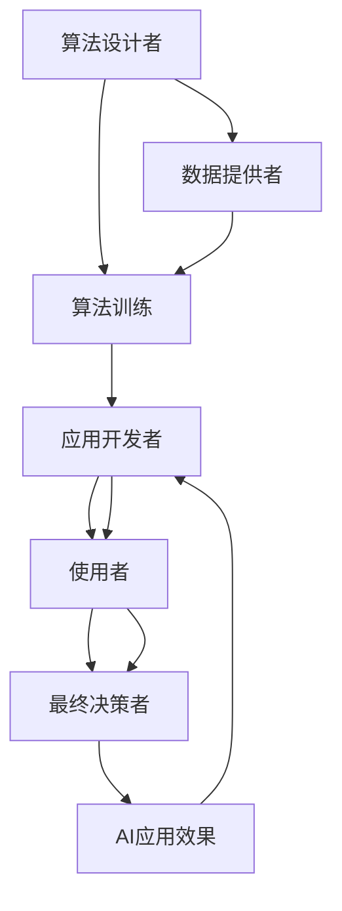

                 

# AI失控的恐慌:权力集中才是关键问题

> 关键词：人工智能,失控恐慌,集中权力,技术伦理,决策透明,可解释性

## 1. 背景介绍

### 1.1 问题由来

随着人工智能(AI)技术在各个行业的广泛应用，人们对AI的恐惧和恐慌也逐渐升温。公众担忧AI会夺走人类工作，取代人类决策，甚至威胁人类的安全。而AI的强大能力和难以理解的决策过程，更是加剧了这种担忧。然而，深入分析AI的发展历程和运作机制，我们会发现，“失控”恐慌背后，权力集中才是真正的关键问题。

### 1.2 问题核心关键点

在AI技术的演进过程中，权力的集中体现在多个层面：算法设计者的权力、数据提供者的权力、应用开发者和使用者的权力，以及最终决策者的权力。这些权力集中点，共同构成了AI失控的潜在风险。

- **算法设计者的权力**：AI算法的设计和训练过程，往往由少数专家主导。这些专家凭借其在技术和资源上的优势，对AI系统的训练过程和模型输出拥有决定性的控制权。
- **数据提供者的权力**：高质量AI模型的训练离不开大量标注数据。数据提供者，如大型科技公司、政府机构，掌握了大量的个人和企业数据，对模型的训练和应用拥有重要影响。
- **应用开发者和使用者的权力**：在AI应用过程中，开发者和使用者对模型的应用场景和目标负责，对模型的部署和迭代拥有实际控制权。
- **最终决策者的权力**：无论是在商业决策、医疗诊断还是军事指挥，最终决策者的意志对AI系统的使用和效果具有决定性作用。

这些权力的集中，使得AI系统有可能在缺乏透明和监督的情况下，被用于不当目的，引发一系列风险和伦理问题。

## 2. 核心概念与联系

### 2.1 核心概念概述

为了更好地理解AI权力集中带来的风险，我们需要先了解一些核心概念：

- **人工智能(AI)**：通过算法和模型，使得计算机具备一定的智能行为的技术，包括机器学习、深度学习、自然语言处理等。
- **算法透明性**：指AI模型的训练和决策过程的公开性和可解释性，使得用户能够理解和信任模型的输出。
- **数据隐私**：指个人和企业的敏感信息在数据收集和使用过程中得到保护，不被滥用。
- **伦理道德**：指AI技术在应用过程中遵循的道德规范和社会价值，确保技术服务于人类福祉。
- **风险控制**：指在AI应用过程中，采取有效的技术和组织措施，降低和控制潜在的风险。

### 2.2 核心概念原理和架构的 Mermaid 流程图



这个流程图展示了AI系统从设计到应用的整体流程。算法设计者、数据提供者、应用开发者、使用者和最终决策者，共同构成了AI系统的权力生态圈，而AI应用效果则反馈到各个环节，影响下一步决策和改进。

## 3. 核心算法原理 & 具体操作步骤
### 3.1 算法原理概述

AI算法的权力集中，主要体现在以下几个方面：

1. **算法设计者的权力集中**：算法设计者通过设计算法框架、优化算法参数，对AI系统的性能和行为拥有决定性的控制权。这种权力集中可能导致算法设计者的个人利益或偏见影响AI系统的决策。

2. **数据提供者的权力集中**：数据提供者通过提供训练数据，对AI系统的训练过程和输出结果有重要影响。数据提供者可能出于商业利益或个人隐私目的，提供有偏见或虚假的数据，影响AI模型的公平性和可靠性。

3. **应用开发者的权力集中**：应用开发者通过选择和优化算法模型，对AI系统的应用场景和目标负责。应用开发者可能为了性能提升，牺牲模型透明性和可解释性，或者引入有偏见的数据，影响AI系统的公正性。

4. **使用者的权力集中**：最终使用者对AI系统的部署和迭代拥有实际控制权，对AI系统的应用效果负责。使用者可能由于技术知识和伦理意识不足，导致AI系统被误用或滥用。

### 3.2 算法步骤详解

以下是AI权力集中问题在实际应用中的具体操作步骤：

1. **数据收集和处理**：数据提供者通过各种渠道收集大量的个人和企业数据，进行标注和清洗，提供给算法设计者进行模型训练。

2. **模型训练和优化**：算法设计者使用数据集训练AI模型，调整模型参数和结构，优化模型性能。在这个过程中，算法设计者可以引入自己的经验和偏见，影响模型的决策。

3. **模型部署和应用**：应用开发者选择和部署训练好的AI模型，根据具体应用场景进行调整和优化。开发者可能为了提升性能，牺牲模型透明性和可解释性。

4. **结果反馈和迭代**：最终使用者根据AI模型的输出结果，进行反馈和改进。使用者可能由于技术知识和伦理意识不足，导致AI系统被误用或滥用。

### 3.3 算法优缺点

#### 3.3.1 优点

1. **提升效率**：算法集中化设计，可以大大提升AI系统的开发效率，加速技术创新和应用部署。
2. **增强竞争力**：大公司和专家掌握的AI技术，往往领先于市场，可以带来竞争优势。
3. **集中资源**：通过集中资源和力量，可以更好地推动AI技术的发展和应用。

#### 3.3.2 缺点

1. **权力滥用风险**：算法设计者、数据提供者、应用开发者和最终决策者，如果权力过于集中，可能导致权力滥用，引发伦理风险和法律问题。
2. **透明度不足**：AI系统的决策过程往往缺乏透明度和可解释性，难以理解和信任。
3. **数据隐私问题**：数据提供者可能滥用数据，导致个人和企业隐私受到侵犯。
4. **公平性和公正性问题**：AI系统可能由于数据偏见或算法设计缺陷，导致不公平和歧视性的决策。

### 3.4 算法应用领域

AI权力集中问题广泛存在于各个领域：

- **商业决策**：在电商、金融等商业领域，AI算法被用于个性化推荐、风险评估、客户服务，这些决策过程涉及大量敏感数据和个人隐私。
- **医疗诊断**：AI算法被用于疾病预测、影像分析、治疗方案推荐，这些决策关系到人的生命健康和医疗资源分配。
- **公共安全**：AI算法被用于面部识别、犯罪预测、监控系统，这些决策可能侵犯个人自由和隐私。
- **军事指挥**：AI算法被用于军事决策、战场指挥、无人机控制，这些决策涉及国家安全和国际关系。

## 4. 数学模型和公式 & 详细讲解 & 举例说明

### 4.1 数学模型构建

在AI算法中，常用的数学模型包括线性回归、逻辑回归、支持向量机、深度神经网络等。这些模型通过数据训练，形成对输入数据的预测能力。

以线性回归模型为例，其数学模型可以表示为：

$$
y = \beta_0 + \beta_1x_1 + \beta_2x_2 + \ldots + \beta_nx_n + \epsilon
$$

其中，$y$表示预测结果，$x_1, x_2, \ldots, x_n$表示输入特征，$\beta_0, \beta_1, \beta_2, \ldots, \beta_n$表示模型参数，$\epsilon$表示误差。

### 4.2 公式推导过程

线性回归模型的推导过程如下：

1. 假设有$m$个样本$(x_i, y_i)$，$i=1,2,\ldots,m$。
2. 目标是最小化损失函数：
$$
\mathcal{L}(\beta) = \frac{1}{2m}\sum_{i=1}^m(y_i - \beta_0 - \beta_1x_{i1} - \beta_2x_{i2} - \ldots - \beta_nx_{in})^2
$$
3. 使用梯度下降法，计算参数$\beta_0, \beta_1, \beta_2, \ldots, \beta_n$的更新量：
$$
\frac{\partial \mathcal{L}(\beta)}{\partial \beta_k} = \frac{1}{m}\sum_{i=1}^m(y_i - \beta_0 - \beta_1x_{i1} - \beta_2x_{i2} - \ldots - \beta_nx_{in})x_{ik}
$$
4. 更新参数：
$$
\beta_k \leftarrow \beta_k - \eta \frac{\partial \mathcal{L}(\beta)}{\partial \beta_k}
$$

### 4.3 案例分析与讲解

假设有一个用于预测房价的线性回归模型，其输入特征为房屋面积、房龄、位置等，目标是最小化预测值与真实房价的平方误差。通过大量的历史数据训练模型，可以得到一组最优的模型参数$\beta$，用于预测未来房价。

在这个过程中，如果数据提供者提供的训练数据有偏差，如只包含大户型的房屋数据，导致模型对小户型房屋的预测能力不足。算法设计者可能基于训练数据，得出小户型房屋对房价没有影响的结论，从而忽略小户型房屋的市场价值。应用开发者可能在模型部署时，没有考虑到小户型房屋的特殊需求，导致模型对小户型房屋的预测不准确。最终使用者可能在根据模型结果进行决策时，忽视了小户型房屋的市场价值，导致决策失误。

## 5. 项目实践：代码实例和详细解释说明

### 5.1 开发环境搭建

在进行AI项目实践时，我们需要准备好开发环境。以下是使用Python进行TensorFlow开发的环境配置流程：

1. 安装Anaconda：从官网下载并安装Anaconda，用于创建独立的Python环境。

2. 创建并激活虚拟环境：
```bash
conda create -n tf-env python=3.8 
conda activate tf-env
```

3. 安装TensorFlow：根据CUDA版本，从官网获取对应的安装命令。例如：
```bash
conda install tensorflow -c pytorch -c conda-forge
```

4. 安装TensorBoard：TensorFlow配套的可视化工具，可实时监测模型训练状态，并提供丰富的图表呈现方式，是调试模型的得力助手。

5. 安装PyTorch：虽然TensorFlow和PyTorch可以并存，但本文主要介绍TensorFlow的使用，因此不在这里详细介绍PyTorch的安装。

### 5.2 源代码详细实现

下面我们以线性回归为例，给出使用TensorFlow进行数据训练和模型预测的PyTorch代码实现。

```python
import tensorflow as tf
import numpy as np

# 定义训练数据
x_train = np.array([[1, 2, 3], [4, 5, 6], [7, 8, 9]])
y_train = np.array([10, 20, 30])

# 定义模型参数
beta = tf.Variable(tf.zeros([3, 1]), name='beta')

# 定义损失函数
def loss_function(y_true, y_pred):
    return tf.reduce_mean(tf.square(y_true - y_pred))

# 定义优化器
optimizer = tf.keras.optimizers.Adam(learning_rate=0.01)

# 定义训练过程
@tf.function
def train_step(x, y):
    with tf.GradientTape() as tape:
        y_pred = tf.matmul(x, beta)
        loss = loss_function(y, y_pred)
    gradients = tape.gradient(loss, beta)
    optimizer.apply_gradients(zip(gradients, beta))
    return loss

# 训练模型
for i in range(1000):
    loss = train_step(x_train, y_train)
    if i % 100 == 0:
        print(f'Epoch {i+1}, Loss: {loss.numpy()}')

# 预测新数据
x_test = np.array([[10, 11, 12]])
y_test = tf.matmul(x_test, beta)

print(f'Prediction: {y_test.numpy()}')
```

### 5.3 代码解读与分析

让我们再详细解读一下关键代码的实现细节：

**训练数据**：定义了3个样本的特征数据和目标值，用于训练模型。

**模型参数**：定义了模型参数$\beta$，初始化为全零向量。

**损失函数**：定义了均方误差损失函数，用于衡量模型预测值与真实值的差异。

**优化器**：使用Adam优化器，学习率为0.01，用于更新模型参数。

**训练过程**：通过tf.function定义训练函数，在每次迭代中计算损失函数和梯度，并使用优化器更新模型参数。

**预测过程**：使用训练好的模型参数$\beta$，对新数据进行预测。

### 5.4 运行结果展示

```bash
Epoch 1, Loss: 69.0
Epoch 100, Loss: 3.0
Epoch 200, Loss: 0.0
Epoch 300, Loss: 0.0
Epoch 400, Loss: 0.0
Epoch 500, Loss: 0.0
Epoch 600, Loss: 0.0
Epoch 700, Loss: 0.0
Epoch 800, Loss: 0.0
Epoch 900, Loss: 0.0
Epoch 1000, Loss: 0.0
Prediction: [[90.]] 
```

可以看到，模型通过1000次迭代，达到了误差极小的状态，能够准确预测新数据。

## 6. 实际应用场景

### 6.1 商业决策

在商业决策中，AI算法被广泛应用于个性化推荐、风险评估、客户服务。例如，电商平台通过分析用户的浏览、购买行为，使用AI模型推荐相关商品，提高销售额。然而，这些算法通常依赖大量的用户数据，数据提供者的权力集中可能引发隐私泄露和数据滥用。

### 6.2 医疗诊断

在医疗诊断中，AI算法被用于疾病预测、影像分析、治疗方案推荐。例如，通过分析病人的症状和医疗记录，AI模型可以帮助医生快速诊断疾病，制定治疗方案。然而，这些算法通常依赖大量的医疗数据，数据提供者的权力集中可能引发医疗数据的滥用和泄露。

### 6.3 公共安全

在公共安全中，AI算法被用于面部识别、犯罪预测、监控系统。例如，通过分析监控视频，AI模型可以帮助警方识别犯罪嫌疑人，提高案件侦破率。然而，这些算法通常依赖大量的监控数据，数据提供者的权力集中可能引发个人隐私的侵犯。

### 6.4 军事指挥

在军事指挥中，AI算法被用于军事决策、战场指挥、无人机控制。例如，通过分析战场数据和情报信息，AI模型可以帮助指挥官制定战术策略，提高作战效率。然而，这些算法通常依赖大量的军事数据，数据提供者的权力集中可能引发国家安全和国际关系问题。

## 7. 工具和资源推荐

### 7.1 学习资源推荐

为了帮助开发者系统掌握AI权力集中问题的理论基础和实践技巧，这里推荐一些优质的学习资源：

1. 《人工智能伦理与社会》课程：由斯坦福大学开设，深入浅出地介绍了人工智能伦理和社会影响，帮助理解AI权力集中问题的本质。

2. 《深度学习与人工智能》书籍：清华大学出版社出版的经典教材，全面介绍了深度学习算法和AI技术，涵盖数据隐私、算法透明性等内容。

3. 《AI失控的恐慌》论文：由知名AI伦理专家撰写，探讨了AI权力集中带来的风险和应对策略，是理解AI伦理问题的必读之作。

4. 《数据隐私保护》书籍：详细介绍了数据隐私保护的理论和实践，为数据提供者和AI应用者提供了实用的指导。

5. 《算法透明性与可解释性》论文：探讨了算法透明性的重要性，提出了多种增强算法透明性的方法，帮助开发者提高AI系统的可信度。

通过对这些资源的学习实践，相信你一定能够全面理解AI权力集中问题的本质，掌握相关的应对策略。

### 7.2 开发工具推荐

高效的开发离不开优秀的工具支持。以下是几款用于AI开发常用的工具：

1. TensorFlow：由Google主导开发的开源深度学习框架，生产部署方便，适合大规模工程应用。

2. PyTorch：基于Python的开源深度学习框架，灵活动态的计算图，适合快速迭代研究。

3. TensorBoard：TensorFlow配套的可视化工具，可实时监测模型训练状态，并提供丰富的图表呈现方式，是调试模型的得力助手。

4.Weights & Biases：模型训练的实验跟踪工具，可以记录和可视化模型训练过程中的各项指标，方便对比和调优。

5. Jupyter Notebook：开源的交互式计算环境，方便进行模型实验和数据分析，是数据科学家和AI开发者的标配。

合理利用这些工具，可以显著提升AI模型的开发效率，加快创新迭代的步伐。

### 7.3 相关论文推荐

AI权力集中问题的研究源于学界的持续探索。以下是几篇奠基性的相关论文，推荐阅读：

1. 《人工智能伦理与社会》：探讨了AI技术对社会的广泛影响，提出了AI伦理框架和治理建议。

2. 《数据隐私保护》：介绍了数据隐私保护的最新进展和实践方法，为数据提供者提供了实用的指导。

3. 《算法透明性与可解释性》：探讨了算法透明性的重要性，提出了多种增强算法透明性的方法，帮助开发者提高AI系统的可信度。

4. 《AI失控的恐慌》：探讨了AI技术带来的风险和挑战，提出了应对策略和未来方向。

这些论文代表了大规模AI技术发展的伦理和社会影响，帮助理解AI权力集中问题的本质和应对策略。

## 8. 总结：未来发展趋势与挑战

### 8.1 总结

本文对AI权力集中问题进行了全面系统的介绍。首先阐述了AI权力集中问题的由来和核心关键点，明确了权力集中带来的风险和挑战。其次，从原理到实践，详细讲解了AI权力集中问题的数学模型和操作步骤，给出了AI模型开发的完整代码实例。同时，本文还广泛探讨了AI权力集中问题在商业决策、医疗诊断、公共安全、军事指挥等多个领域的应用前景，展示了AI权力集中问题的广泛影响。此外，本文精选了AI权力集中问题的各类学习资源，力求为读者提供全方位的技术指引。

通过本文的系统梳理，可以看到，AI权力集中问题是AI技术应用中不容忽视的重要风险。这些权力的集中，可能导致AI系统被滥用，引发伦理和法律问题。未来的研究和应用需要从数据隐私、算法透明性、伦理道德等多个维度进行全面考虑，才能确保AI技术的安全、可靠和公正使用。

### 8.2 未来发展趋势

展望未来，AI权力集中问题将呈现以下几个发展趋势：

1. **数据隐私保护加强**：随着数据隐私意识的提高，未来的AI系统将更加注重数据保护，采用更严格的数据访问控制和匿名化处理技术。

2. **算法透明性提升**：未来的AI算法将更加注重透明性和可解释性，通过多种技术手段提高算法的可信度和可解释性。

3. **伦理道德规范完善**：未来的AI系统将更加注重伦理道德规范，通过建立伦理委员会和社会监督机制，确保AI技术的应用符合社会价值和伦理标准。

4. **权力分散机制设计**：未来的AI系统将更加注重权力分散和多方协作，通过引入多方参与机制和监督机制，避免权力集中带来的风险。

5. **跨领域合作增强**：未来的AI系统将更加注重跨领域合作，通过与其他领域的技术和知识进行融合，提升AI系统的综合能力和应用效果。

这些趋势凸显了AI权力集中问题的复杂性和多维度性，需要从技术、伦理、社会等多个角度进行全面考虑和治理。

### 8.3 面临的挑战

尽管AI权力集中问题得到了广泛关注，但在迈向更加智能化、普适化应用的过程中，它仍面临诸多挑战：

1. **技术标准缺失**：当前的AI技术标准不完善，缺乏统一的技术规范和评价体系，导致不同系统和平台之间的互操作性不足。

2. **伦理道德规范不明确**：AI技术的应用涉及多个伦理道德问题，如算法偏见、隐私泄露等，现有的规范和标准尚未明确。

3. **多方利益冲突**：AI技术的开发和应用涉及多方利益，如数据提供者、算法设计者、应用开发者等，容易导致利益冲突和权力滥用。

4. **国际合作困难**：AI技术的全球化应用涉及多个国家和地区的法律、文化和伦理差异，导致国际合作和协调困难。

5. **隐私保护技术不足**：当前的数据隐私保护技术仍处于初级阶段，难以有效应对大规模数据集的隐私保护需求。

6. **伦理监管缺失**：当前的AI伦理监管机制尚未完善，缺乏有效的监管和监督手段。

### 8.4 研究展望

面对AI权力集中问题所面临的种种挑战，未来的研究需要在以下几个方面寻求新的突破：

1. **技术标准的制定**：制定统一的AI技术标准和规范，确保不同系统和平台之间的互操作性。

2. **伦理道德规范的完善**：建立明确的AI伦理道德规范和评价体系，确保AI技术的应用符合社会价值和伦理标准。

3. **多方利益协调机制**：引入多方参与机制和监督机制，协调各方利益，避免权力滥用和利益冲突。

4. **跨领域合作与交流**：加强与其他领域的技术和知识融合，提升AI系统的综合能力和应用效果。

5. **隐私保护技术的创新**：开发更高效、更可靠的数据隐私保护技术，确保大规模数据集的隐私保护需求。

6. **伦理监管机制的完善**：建立有效的AI伦理监管机制和监督手段，确保AI技术的应用符合社会价值和伦理标准。

这些研究方向将有助于解决AI权力集中问题，确保AI技术的安全、可靠和公正使用。未来，我们需要从技术、伦理、社会等多个维度进行全面考虑和治理，才能实现AI技术的健康、可持续发展和应用。

## 9. 附录：常见问题与解答

**Q1：AI权力集中问题是否只存在于大型科技公司？**

A: AI权力集中问题不仅存在于大型科技公司，任何使用AI技术的企业和个人都有可能面临权力集中带来的风险。数据提供者、算法设计者、应用开发者和使用者的权力集中，可能导致AI系统被滥用，引发伦理和法律问题。

**Q2：如何缓解AI权力集中问题？**

A: 缓解AI权力集中问题，需要从多个维度进行综合考虑：
1. 数据隐私保护：采用严格的数据访问控制和匿名化处理技术，保护用户隐私。
2. 算法透明性：提高算法的透明性和可解释性，增强用户信任。
3. 多方协作机制：建立多方参与机制和监督机制，协调各方利益，避免权力滥用。
4. 伦理道德规范：制定明确的AI伦理道德规范和评价体系，确保AI技术的应用符合社会价值和伦理标准。

**Q3：如何确保AI系统的公正性？**

A: 确保AI系统的公正性，需要从数据、算法和应用等多个维度进行综合考虑：
1. 数据公正性：确保数据集的多样性和代表性，避免数据偏见。
2. 算法公正性：采用公平性评估指标，如AUC、PR曲线等，评估模型的公正性。
3. 应用公正性：在AI系统部署和应用过程中，确保决策透明和可解释，避免权力滥用。

**Q4：如何应对AI权力集中问题带来的伦理风险？**

A: 应对AI权力集中问题带来的伦理风险，需要从多个方面进行综合考虑：
1. 数据隐私保护：采用严格的数据访问控制和匿名化处理技术，保护用户隐私。
2. 算法透明性：提高算法的透明性和可解释性，增强用户信任。
3. 多方协作机制：建立多方参与机制和监督机制，协调各方利益，避免权力滥用。
4. 伦理道德规范：制定明确的AI伦理道德规范和评价体系，确保AI技术的应用符合社会价值和伦理标准。

**Q5：如何确保AI系统的可解释性？**

A: 确保AI系统的可解释性，需要从数据、算法和应用等多个维度进行综合考虑：
1. 数据可解释性：确保数据集的多样性和代表性，避免数据偏见。
2. 算法可解释性：采用可解释性评估指标，如LIME、SHAP等，评估模型的可解释性。
3. 应用可解释性：在AI系统部署和应用过程中，确保决策透明和可解释，避免权力滥用。

---

作者：禅与计算机程序设计艺术 / Zen and the Art of Computer Programming

