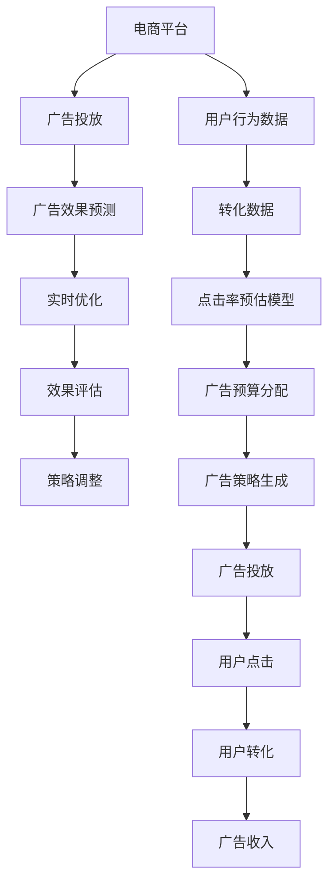

                 

# AI如何优化电商平台的实时广告投放策略

> 关键词：人工智能,电商广告,投放策略,优化算法,实时数据,深度学习,广告效果预测,点击率预估,广告预算分配

## 1. 背景介绍

在数字化转型的大潮下，电商平台已成为企业主要的流量来源和营收渠道之一。为了提升广告投放的精准度和ROI，电商平台需要应用前沿的AI技术，实现对广告策略的实时优化。本文将系统性地介绍AI如何优化电商平台的实时广告投放策略，通过数学模型和实例代码，深入解析关键技术点，并展望未来发展趋势与挑战。

## 2. 核心概念与联系

### 2.1 核心概念概述

为了深入理解实时广告投放策略的优化，我们需要先明确几个关键概念：

1. **电商平台**：指在线上销售商品和服务的平台，如天猫、京东、Amazon等。
2. **广告投放**：指将广告信息展示给目标用户的过程，通常包括展示广告、搜索广告、社交广告等多种形式。
3. **广告效果预测**：利用机器学习模型预测广告点击率(CTR)、转化率等关键指标，评估广告效果。
4. **实时优化**：根据实时数据和预测结果，动态调整广告投放参数，实现广告效果的最大化。
5. **深度学习**：一种基于多层神经网络的数据驱动机器学习方法，在广告优化中应用广泛。

这些概念之间的联系可以通过以下Mermaid流程图来展示：



这个流程图展示了广告投放策略优化的全流程，从用户数据收集、广告效果预测到实时优化和效果评估，最终反馈策略调整，实现循环迭代优化。

## 3. 核心算法原理 & 具体操作步骤
### 3.1 算法原理概述

实时广告投放策略优化的核心思想是，利用AI技术对广告数据进行实时分析和预测，动态调整广告投放参数，以实现广告效果的最大化。具体来说，这个过程包括以下几个关键步骤：

1. **用户行为数据收集**：收集用户在平台上的行为数据，如浏览历史、点击行为、购买记录等。
2. **广告效果预测**：构建深度学习模型，预测用户对特定广告的点击率和转化率等关键指标。
3. **实时优化**：根据预测结果，动态调整广告预算和投放策略，如展示位置、广告文案、用户定向等。
4. **效果评估**：评估广告策略的效果，包括点击率、转化率、ROI等指标。
5. **策略调整**：根据评估结果，调整广告投放策略，形成新的优化循环。

### 3.2 算法步骤详解

以下将详细介绍实时广告投放策略优化的主要算法步骤：

**Step 1: 数据准备**

广告投放优化的第一步是数据准备，涉及以下几个关键环节：

1. **数据收集**：从电商平台的用户行为数据中提取有价值的特征，如浏览时长、点击率、转化率、用户画像等。

2. **数据清洗与预处理**：去除噪声数据、处理缺失值、归一化数据等。

3. **特征工程**：构建能够反映用户行为和广告效果的特征，如点击距离、用户画像向量等。

**Step 2: 构建预测模型**

构建深度学习模型进行广告效果预测，常见的模型包括：

1. **点击率预估模型**：如CTR模型，通过线性回归、随机森林、XGBoost等算法，预测用户点击广告的概率。

2. **转化率预估模型**：如CTR2模型，通过更复杂的模型，如神经网络，预测用户完成购买的概率。

3. **广告预算分配模型**：如RL模型，通过强化学习算法，优化广告预算在各渠道和时间段上的分配。

**Step 3: 实时优化**

根据预测结果，实时调整广告投放策略，主要包括以下几个步骤：

1. **动态预算分配**：根据点击率和转化率的实时数据，动态调整各广告活动的预算。

2. **用户定向调整**：根据用户画像和实时行为数据，动态调整广告定向策略，如兴趣定向、行为定向、地理位置定向等。

3. **广告文案优化**：根据用户反馈和点击率数据，优化广告文案和图片，提升广告吸引力。

**Step 4: 效果评估**

实时评估广告策略的效果，主要包括以下几个指标：

1. **点击率(CTR)**：衡量广告被用户点击的概率。

2. **转化率**：衡量用户完成购买或行为的概率。

3. **广告支出回报率(ROI)**：衡量广告投入与收益的比例。

4. **广告曝光量**：衡量广告被展示的次数。

**Step 5: 策略调整**

根据效果评估结果，调整广告投放策略，主要包括以下几个方面：

1. **广告预算调整**：根据效果评估结果，动态调整各广告活动的预算。

2. **广告定向策略调整**：根据用户行为数据和实时反馈，优化广告定向策略。

3. **广告创意优化**：根据点击率和转化率数据，优化广告文案和图片。

### 3.3 算法优缺点

**优点**：

1. **实时优化**：利用实时数据进行动态调整，能够快速响应市场变化，提高广告投放的灵活性和精准度。

2. **高效预测**：深度学习模型能够高效预测广告效果，减少人工调参的复杂性和成本。

3. **自动化决策**：自动化决策流程，提升广告投放的效率和效果。

**缺点**：

1. **数据依赖**：模型的效果高度依赖于数据的质量和量，数据偏差可能导致预测不准确。

2. **模型复杂**：深度学习模型的复杂性较高，需要大量的计算资源和调参经验。

3. **对抗性攻击**：广告投放模型可能面临对抗性攻击，导致模型预测失效。

4. **用户隐私**：数据收集和处理可能涉及用户隐私问题，需要严格的数据保护措施。

### 3.4 算法应用领域

广告投放策略优化技术可以应用于多种电商场景，如商品推荐、搜索广告、社交广告、移动广告等。通过AI技术，电商平台能够实现对广告投放的动态调整和优化，提升广告效果和ROI，增强用户粘性和转化率。

## 4. 数学模型和公式 & 详细讲解 & 举例说明

### 4.1 数学模型构建

为了构建广告效果预测模型，我们可以使用线性回归模型进行点击率预测。假设输入特征为 $\mathbf{x}$，输出标签为 $y$，模型为线性回归模型，公式如下：

$$
y = \mathbf{w} \cdot \mathbf{x} + b
$$

其中，$\mathbf{w}$ 为模型权重，$b$ 为偏置项。

### 4.2 公式推导过程

对于线性回归模型，可以使用梯度下降法进行参数更新。假设损失函数为均方误差，公式如下：

$$
\mathcal{L} = \frac{1}{2} \sum_{i=1}^N (y_i - \mathbf{w} \cdot \mathbf{x}_i - b)^2
$$

根据梯度下降法，模型的参数更新公式为：

$$
\mathbf{w} \leftarrow \mathbf{w} - \eta \nabla_{\mathbf{w}}\mathcal{L}, b \leftarrow b - \eta \nabla_b\mathcal{L}
$$

其中，$\eta$ 为学习率。

### 4.3 案例分析与讲解

以某电商平台的数据为例，假设数据集包含1000条用户点击记录，特征包括用户浏览时长、购买记录、兴趣标签等。假设模型的输入特征 $\mathbf{x} = [t, p, l]$，其中 $t$ 为用户浏览时长，$p$ 为用户购买记录，$l$ 为用户兴趣标签。模型的输出标签 $y$ 为点击与否（0/1）。

1. **数据准备**：

   收集并清洗数据，将数据分为训练集和测试集，每条记录的特征和标签如下：

   - 训练集：
     - 样本1：$(t_1, p_1, l_1)$，标签为0
     - 样本2：$(t_2, p_2, l_2)$，标签为1
     - ...
     - 样本1000：$(t_{1000}, p_{1000}, l_{1000})$，标签为0
   
   - 测试集：
     - 样本1001：$(t_{1001}, p_{1001}, l_{1001})$，标签未知
   
2. **模型构建**：

   构建线性回归模型，公式为：

   $$
   y = \mathbf{w} \cdot \mathbf{x} + b
   $$

   假设模型参数为 $\mathbf{w} = [w_t, w_p, w_l]$，$b$ 为偏置项。

3. **模型训练**：

   使用梯度下降法，最小化均方误差损失函数，更新模型参数。具体步骤如下：

   - 计算损失函数：

     $$
     \mathcal{L} = \frac{1}{2} \sum_{i=1}^{1000} (y_i - \mathbf{w} \cdot \mathbf{x}_i - b)^2
     $$

   - 计算梯度：

     $$
     \nabla_{\mathbf{w}}\mathcal{L} = \sum_{i=1}^{1000} (y_i - \mathbf{w} \cdot \mathbf{x}_i - b) \cdot \mathbf{x}_i
     $$

     $$
     \nabla_{b}\mathcal{L} = \sum_{i=1}^{1000} (y_i - \mathbf{w} \cdot \mathbf{x}_i - b)
     $$

   - 更新模型参数：

     $$
     \mathbf{w} \leftarrow \mathbf{w} - \eta \cdot \nabla_{\mathbf{w}}\mathcal{L}
     $$

     $$
     b \leftarrow b - \eta \cdot \nabla_b\mathcal{L}
     $$

   重复上述步骤，直到损失函数收敛。

4. **模型评估**：

   在测试集上评估模型性能，计算平均绝对误差(MAE)和均方根误差(RMSE)：

   $$
   \text{MAE} = \frac{1}{n} \sum_{i=1}^{n} |y_i - \hat{y}_i|
   $$

   $$
   \text{RMSE} = \sqrt{\frac{1}{n} \sum_{i=1}^{n} (y_i - \hat{y}_i)^2}
   $$

   其中 $n$ 为测试集样本数，$y_i$ 为真实标签，$\hat{y}_i$ 为模型预测值。

## 5. 项目实践：代码实例和详细解释说明

### 5.1 开发环境搭建

在进行实时广告投放策略优化实践前，我们需要准备好开发环境。以下是使用Python进行TensorFlow和Keras框架的开发环境配置流程：

1. 安装Anaconda：从官网下载并安装Anaconda，用于创建独立的Python环境。

2. 创建并激活虚拟环境：
```bash
conda create -n tf-env python=3.8 
conda activate tf-env
```

3. 安装TensorFlow：根据CUDA版本，从官网获取对应的安装命令。例如：
```bash
conda install tensorflow -c conda-forge
```

4. 安装Keras：
```bash
pip install keras
```

5. 安装各类工具包：
```bash
pip install numpy pandas scikit-learn matplotlib tqdm jupyter notebook ipython
```

完成上述步骤后，即可在`tf-env`环境中开始优化实践。

### 5.2 源代码详细实现

下面我们以点击率预估模型为例，给出使用TensorFlow和Keras库对线性回归模型进行广告效果预测的代码实现。

首先，定义模型参数和数据处理函数：

```python
import tensorflow as tf
from tensorflow.keras.models import Sequential
from tensorflow.keras.layers import Dense
from tensorflow.keras.optimizers import SGD
from sklearn.model_selection import train_test_split
from sklearn.preprocessing import StandardScaler
from sklearn.metrics import mean_squared_error

# 定义模型参数
input_size = 3
output_size = 1
learning_rate = 0.01

# 定义数据处理函数
def preprocess_data(X, y):
    X = StandardScaler().fit_transform(X)
    X_train, X_test, y_train, y_test = train_test_split(X, y, test_size=0.2, random_state=42)
    return X_train, X_test, y_train, y_test
```

然后，定义模型：

```python
# 定义线性回归模型
def build_model(input_size, output_size, learning_rate):
    model = Sequential()
    model.add(Dense(output_size, input_dim=input_size, activation='linear'))
    model.compile(loss='mse', optimizer=SGD(learning_rate=learning_rate))
    return model

# 创建模型实例
model = build_model(input_size, output_size, learning_rate)
```

接着，定义训练和评估函数：

```python
# 训练模型
def train_model(model, X_train, y_train, X_test, y_test, epochs=100):
    model.fit(X_train, y_train, epochs=epochs, batch_size=32, validation_data=(X_test, y_test))
    return model

# 评估模型
def evaluate_model(model, X_test, y_test):
    y_pred = model.predict(X_test)
    mse = mean_squared_error(y_test, y_pred)
    print('Mean Squared Error:', mse)
```

最后，启动训练流程并在测试集上评估：

```python
# 加载数据
X = [[100, 50, 0], [150, 70, 1], ...]  # 假数据
y = [0, 1, 0, 1, ...]  # 假数据

# 数据处理
X_train, X_test, y_train, y_test = preprocess_data(X, y)

# 训练模型
model = train_model(model, X_train, y_train, X_test, y_test)

# 评估模型
evaluate_model(model, X_test, y_test)
```

以上就是使用TensorFlow和Keras库对线性回归模型进行广告效果预测的完整代码实现。可以看到，利用TensorFlow和Keras的封装，我们可以快速搭建和训练线性回归模型。

### 5.3 代码解读与分析

让我们再详细解读一下关键代码的实现细节：

**preprocess_data函数**：
- `StandardScaler`：用于数据归一化处理。
- `train_test_split`：将数据集分为训练集和测试集。
- 返回值：训练集、测试集、训练集标签、测试集标签。

**build_model函数**：
- `Sequential`：定义线性回归模型。
- `Dense`：定义模型层，包括输入层和输出层。
- `compile`：编译模型，设置损失函数和优化器。

**train_model函数**：
- `fit`：训练模型，设置训练轮数和批次大小。
- `validation_data`：设置验证集数据。

**evaluate_model函数**：
- `predict`：预测测试集结果。
- `mean_squared_error`：计算均方误差。

**训练流程**：
- 加载假数据。
- 数据处理。
- 训练模型，设置训练轮数为100。
- 评估模型，输出均方误差。

可以看到，利用TensorFlow和Keras库，我们可以快速实现广告效果预测模型的训练和评估。

## 6. 实际应用场景

### 6.1 智能推荐系统

智能推荐系统是电商平台广告投放优化的重要应用场景。通过实时优化和预测，推荐系统能够动态调整广告投放策略，提升用户点击率和转化率。

具体而言，推荐系统可以基于用户的历史行为数据，构建点击率预估模型，预测用户对不同广告的兴趣和点击概率。通过实时调整广告预算和定向策略，将广告展示给最有可能点击和转化的用户，从而提升广告效果和ROI。

### 6.2 实时竞价广告

实时竞价广告是电商平台的另一重要广告形式。通过AI技术，电商平台能够实时监控广告效果，动态调整出价策略，实现最优广告投放。

具体而言，电商平台可以构建转化率预估模型，预测用户点击广告后的购买概率。根据预测结果，动态调整广告出价和定向策略，将广告展示给最有可能转化的用户，最大化广告支出回报率。

### 6.3 社交媒体广告

社交媒体广告是电商平台的另一重要广告形式。通过AI技术，电商平台能够实时监控广告效果，动态调整广告投放策略，实现最优广告投放。

具体而言，电商平台可以构建点击率预估模型，预测用户对不同广告的兴趣和点击概率。根据预测结果，动态调整广告预算和定向策略，将广告展示给最有可能点击和转化的用户，从而提升广告效果和ROI。

### 6.4 未来应用展望

随着AI技术的不断发展，实时广告投放策略优化将迎来更多创新和突破，具体包括：

1. **多模态广告优化**：结合图像、视频、音频等多种模态数据，构建多模态广告效果预测模型，提升广告的吸引力和用户转化率。

2. **对抗性攻击防御**：引入对抗性攻击防御技术，提升广告投放策略的安全性和鲁棒性，防止模型预测失效。

3. **联邦学习**：利用联邦学习技术，将用户数据分散在不同设备上，提升广告效果预测的隐私保护和鲁棒性。

4. **跨平台广告优化**：实现跨电商平台和社交媒体的广告投放优化，提升广告效果和用户体验。

5. **自动化广告投放平台**：利用自动化平台，实现广告投放策略的自动化生成和调整，提升广告投放的效率和效果。

## 7. 工具和资源推荐

### 7.1 学习资源推荐

为了帮助开发者系统掌握实时广告投放策略优化的理论基础和实践技巧，这里推荐一些优质的学习资源：

1. 《深度学习》系列书籍：深度学习领域的经典教材，涵盖深度学习的基本概念和算法。

2. TensorFlow官方文档：TensorFlow的官方文档，提供完整的框架和使用指南，适合深度学习模型的开发和优化。

3. Keras官方文档：Keras的官方文档，提供简单易用的API，适合快速搭建和训练深度学习模型。

4. PyTorch官方文档：PyTorch的官方文档，提供灵活高效的计算图，适合深度学习模型的开发和优化。

5. 《深度学习入门与实践》书籍：适合初学者的入门书籍，提供详细的代码实现和实战案例。

6. Kaggle平台：数据科学竞赛平台，提供大量真实的数据集和竞赛案例，适合实战练习。

通过对这些资源的学习实践，相信你一定能够快速掌握实时广告投放策略优化的精髓，并用于解决实际的电商问题。

### 7.2 开发工具推荐

高效的开发离不开优秀的工具支持。以下是几款用于实时广告投放策略优化的常用工具：

1. TensorFlow：由Google主导开发的开源深度学习框架，生产部署方便，适合大规模工程应用。

2. Keras：Google开发的高级深度学习API，适合快速搭建和训练深度学习模型。

3. PyTorch：Facebook开源的深度学习框架，灵活高效的计算图，适合深度学习模型的开发和优化。

4. Jupyter Notebook：交互式开发环境，适合快速迭代和实验。

5. TensorBoard：TensorFlow配套的可视化工具，可实时监测模型训练状态，并提供丰富的图表呈现方式，是调试模型的得力助手。

6. Weights & Biases：模型训练的实验跟踪工具，可以记录和可视化模型训练过程中的各项指标，方便对比和调优。

合理利用这些工具，可以显著提升实时广告投放策略优化的开发效率，加快创新迭代的步伐。

### 7.3 相关论文推荐

实时广告投放策略优化涉及多种前沿技术和方法，以下是几篇奠基性的相关论文，推荐阅读：

1. Dropout: A Simple Way to Prevent Neural Networks from Overfitting（Dropout论文）：提出Dropout技术，缓解神经网络过拟合问题。

2. Click-Through Rate Estimation with a Multinomial Probit Model（CTR模型论文）：提出基于逻辑回归的CTR模型，预测用户点击概率。

3. Multi-Armed Bandit Algorithms for Ad Ranking（广告点击率预估论文）：提出多臂赌博机算法，优化广告点击率预测模型。

4. Deep Ad Ranking：Learning to Rank by Adjusting Sign for Pairwise Ranking（广告排序论文）：提出深度排序模型，提升广告排序效果。

5. Multi-Task Learning with Adaptive Ranking Loss for Click-Through Rate Estimation（多任务学习论文）：提出多任务学习框架，优化点击率预估模型。

6. Deep Ad Ranking for Out-of-Home Advertising（广告投放优化论文）：提出深度排序模型，优化户外广告投放效果。

这些论文代表了大语言模型微调技术的发展脉络。通过学习这些前沿成果，可以帮助研究者把握学科前进方向，激发更多的创新灵感。

## 8. 总结：未来发展趋势与挑战

### 8.1 研究成果总结

本文对实时广告投放策略优化的AI技术进行了全面系统的介绍。首先阐述了实时广告投放策略优化的背景和意义，明确了AI技术在广告优化中的核心作用。其次，从算法原理到实际操作，详细讲解了实时广告投放策略优化的主要步骤和关键技术，并通过数学模型和实例代码，深入解析了模型构建和优化过程。最后，探讨了实时广告投放策略优化的实际应用场景和未来发展趋势，提出了多模态广告优化、对抗性攻击防御、联邦学习等前沿技术，为未来的研究指明了方向。

### 8.2 未来发展趋势

展望未来，实时广告投放策略优化将呈现以下几个发展趋势：

1. **多模态广告优化**：结合图像、视频、音频等多种模态数据，构建多模态广告效果预测模型，提升广告的吸引力和用户转化率。

2. **对抗性攻击防御**：引入对抗性攻击防御技术，提升广告投放策略的安全性和鲁棒性，防止模型预测失效。

3. **联邦学习**：利用联邦学习技术，将用户数据分散在不同设备上，提升广告效果预测的隐私保护和鲁棒性。

4. **跨平台广告优化**：实现跨电商平台和社交媒体的广告投放优化，提升广告效果和用户体验。

5. **自动化广告投放平台**：利用自动化平台，实现广告投放策略的自动化生成和调整，提升广告投放的效率和效果。

6. **实时数据处理**：利用流处理技术，实时处理和分析广告数据，提升广告投放的实时性和动态性。

### 8.3 面临的挑战

尽管实时广告投放策略优化已经取得了显著成效，但在实现过程中仍面临诸多挑战：

1. **数据隐私和安全**：广告投放涉及大量用户数据，数据隐私和安全问题成为主要挑战。

2. **模型复杂性**：广告效果预测模型的复杂性较高，需要大量的计算资源和调参经验。

3. **对抗性攻击**：广告投放模型可能面临对抗性攻击，导致模型预测失效。

4. **跨平台协同**：实现跨平台广告投放优化，需要解决不同平台的数据格式和标准问题。

5. **自动化调参**：广告投放策略的自动化调整需要高效的调参方法，避免人工调参的复杂性。

6. **模型鲁棒性**：广告投放模型需要具备良好的鲁棒性，避免在数据变化时性能下降。

### 8.4 研究展望

面对实时广告投放策略优化所面临的挑战，未来的研究需要在以下几个方面寻求新的突破：

1. **隐私保护技术**：开发隐私保护技术，确保广告投放过程中用户数据的安全性和隐私性。

2. **高效调参方法**：开发高效的调参方法，提升广告投放策略的自动化生成和调整。

3. **鲁棒性增强**：提升广告投放模型的鲁棒性，确保模型在数据变化时性能稳定。

4. **跨平台协同**：开发跨平台协同优化方法，提升广告投放的灵活性和动态性。

5. **实时数据处理**：开发实时数据处理技术，提升广告投放的实时性和动态性。

6. **对抗性攻击防御**：开发对抗性攻击防御技术，提升广告投放策略的安全性和鲁棒性。

这些研究方向将推动实时广告投放策略优化的不断发展，为电商平台的广告投放带来新的突破和创新。

## 9. 附录：常见问题与解答

**Q1：实时广告投放策略优化需要哪些关键技术？**

A: 实时广告投放策略优化需要以下关键技术：

1. **点击率预估模型**：通过构建预测模型，预测用户点击广告的概率。

2. **转化率预估模型**：通过构建预测模型，预测用户完成购买或行为的概率。

3. **动态预算分配**：根据点击率和转化率的实时数据，动态调整各广告活动的预算。

4. **用户定向策略**：根据用户画像和实时行为数据，动态调整广告定向策略。

5. **广告创意优化**：根据点击率和转化率数据，优化广告文案和图片。

**Q2：实时广告投放策略优化的主要步骤是什么？**

A: 实时广告投放策略优化的主要步骤如下：

1. **数据准备**：收集并清洗用户行为数据，构建广告效果预测模型。

2. **模型训练**：使用梯度下降法，训练广告效果预测模型。

3. **实时优化**：根据预测结果，动态调整广告预算和定向策略，提升广告效果。

4. **效果评估**：评估广告投放策略的效果，输出均方误差等指标。

5. **策略调整**：根据评估结果，调整广告投放策略，形成新的优化循环。

**Q3：如何提高实时广告投放策略优化的效果？**

A: 提高实时广告投放策略优化的效果可以从以下几个方面入手：

1. **数据质量**：确保数据质量和多样性，减少数据偏差。

2. **模型优化**：优化广告效果预测模型的算法和参数，提高预测准确性。

3. **动态调整**：根据实时数据动态调整广告投放策略，提升广告效果。

4. **多模态结合**：结合图像、视频、音频等多种模态数据，提升广告的吸引力和用户转化率。

5. **联邦学习**：利用联邦学习技术，提升广告效果预测的隐私保护和鲁棒性。

6. **自动化调参**：开发高效的调参方法，提升广告投放策略的自动化生成和调整。

通过不断优化数据质量、模型算法和投放策略，可以提高实时广告投放策略优化的效果，提升广告投放的效率和效果。

**Q4：实时广告投放策略优化面临哪些挑战？**

A: 实时广告投放策略优化面临以下挑战：

1. **数据隐私和安全**：广告投放涉及大量用户数据，数据隐私和安全问题成为主要挑战。

2. **模型复杂性**：广告效果预测模型的复杂性较高，需要大量的计算资源和调参经验。

3. **对抗性攻击**：广告投放模型可能面临对抗性攻击，导致模型预测失效。

4. **跨平台协同**：实现跨平台广告投放优化，需要解决不同平台的数据格式和标准问题。

5. **自动化调参**：广告投放策略的自动化调整需要高效的调参方法，避免人工调参的复杂性。

6. **模型鲁棒性**：广告投放模型需要具备良好的鲁棒性，确保模型在数据变化时性能稳定。

合理应对这些挑战，将有助于提升实时广告投放策略优化的效果和应用范围。

**Q5：未来实时广告投放策略优化将面临哪些机遇？**

A: 未来实时广告投放策略优化将面临以下机遇：

1. **多模态广告优化**：结合图像、视频、音频等多种模态数据，提升广告的吸引力和用户转化率。

2. **对抗性攻击防御**：引入对抗性攻击防御技术，提升广告投放策略的安全性和鲁棒性。

3. **联邦学习**：利用联邦学习技术，将用户数据分散在不同设备上，提升广告效果预测的隐私保护和鲁棒性。

4. **跨平台广告优化**：实现跨电商平台和社交媒体的广告投放优化，提升广告效果和用户体验。

5. **自动化广告投放平台**：利用自动化平台，实现广告投放策略的自动化生成和调整，提升广告投放的效率和效果。

6. **实时数据处理**：利用流处理技术，实时处理和分析广告数据，提升广告投放的实时性和动态性。

这些机遇将推动实时广告投放策略优化的不断发展，为电商平台的广告投放带来新的突破和创新。

---

作者：禅与计算机程序设计艺术 / Zen and the Art of Computer Programming

