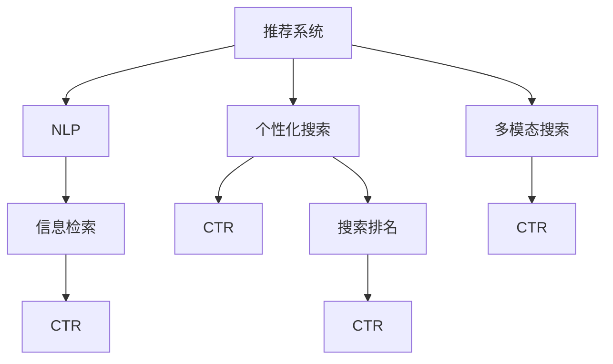

                 

# AI如何提升用户搜索体验

> 关键词：人工智能, 搜索体验, 推荐系统, 自然语言处理, 信息检索, 个性化搜索, 点击率, 搜索排名

## 1. 背景介绍

### 1.1 问题由来

在互联网时代，搜索引擎已成为人们获取信息的主要渠道之一。搜索引擎不仅需要精准地检索用户查询，还需通过深度学习技术优化搜索体验，提升用户满意度。随着人工智能技术的发展，基于AI的推荐系统、自然语言处理、信息检索技术正逐步应用于搜索引擎，使得搜索体验更加个性化、精准化。

### 1.2 问题核心关键点

AI在提升搜索体验方面的核心关键点包括：

- 基于推荐系统的个性化搜索。AI通过分析用户历史行为、搜索习惯，智能推荐相关内容，提升搜索精准度和相关性。
- 自然语言处理技术的应用。通过理解用户自然语言查询，精准匹配语义，提升检索准确性。
- 信息检索算法优化。AI技术使得传统信息检索算法得到优化，提升搜索速度和效率。
- 用户体验优化。AI通过交互设计、界面优化等手段提升用户使用体验，降低搜索难度。
- 多模态搜索。AI技术使得搜索不仅限于文本，还能处理图像、音频等多模态数据，提升搜索多样性。

## 2. 核心概念与联系

### 2.1 核心概念概述

为更好地理解AI如何提升搜索体验，本节将介绍几个密切相关的核心概念：

- 推荐系统(Recommendation System)：通过分析用户历史行为和兴趣偏好，智能推荐相关内容的系统。
- 自然语言处理(Natural Language Processing, NLP)：让计算机理解、处理、生成人类语言的技术，包括分词、词性标注、语义分析等。
- 信息检索(Information Retrieval, IR)：通过一定算法将用户查询与文本库匹配，返回相关文本的系统。
- 个性化搜索(Personalized Search)：根据用户偏好和行为，智能调整搜索结果，提升用户体验。
- 多模态搜索(Multimodal Search)：通过同时处理文本、图像、音频等多模态数据，提升搜索的多样性和精准性。
- 点击率(Click-Through Rate, CTR)：用户点击搜索结果的概率，是衡量搜索效果的重要指标。
- 搜索排名(Search Ranking)：根据搜索结果的相关性和质量，对搜索结果进行排序，确保最相关的结果出现在前列。

这些核心概念之间的逻辑关系可以通过以下Mermaid流程图来展示：



这个流程图展示了一组核心概念及其之间的联系：

1. 推荐系统是利用用户历史行为数据智能推荐相关内容的系统，可提升搜索的个性化程度。
2. 自然语言处理技术通过理解自然语言查询，提升检索准确性。
3. 信息检索算法优化搜索结果排序，确保最相关的内容位居前列。
4. 个性化搜索根据用户偏好调整搜索结果，提升用户体验。
5. 多模态搜索通过处理多模态数据，提升搜索的多样性和精准性。
6. 点击率是衡量搜索效果的重要指标，反映用户对搜索结果的满意度。
7. 搜索排名通过调整排序算法，确保最相关的内容出现在前列。

这些概念共同构成了AI提升搜索体验的基础框架，使得搜索引擎能够更好地满足用户需求。

## 3. 核心算法原理 & 具体操作步骤
### 3.1 算法原理概述

AI通过多种技术手段优化搜索体验，其核心原理可以概括为以下几点：

- 利用推荐系统了解用户偏好，智能推荐相关内容，提升搜索的相关性和个性化程度。
- 采用自然语言处理技术理解用户查询，精确匹配语义，提高检索准确性。
- 通过优化信息检索算法，提升搜索速度和效率。
- 通过个性化搜索和界面优化提升用户体验，降低搜索难度。
- 应用多模态搜索技术处理多模态数据，提升搜索的多样性和精准性。

### 3.2 算法步骤详解

基于AI的搜索体验优化一般包括以下几个关键步骤：

**Step 1: 收集用户行为数据**
- 记录用户查询、点击、停留时间等行为数据，建立用户行为模型。
- 分析用户的历史行为，提取用户偏好、兴趣和行为习惯。

**Step 2: 构建推荐模型**
- 选择合适的推荐算法，如协同过滤、内容推荐、基于深度学习的推荐等。
- 根据用户行为数据，训练推荐模型，生成个性化推荐内容。
- 将推荐结果与搜索结果结合，提升个性化搜索效果。

**Step 3: 自然语言处理**
- 采用分词、词性标注、命名实体识别等技术，理解用户查询的语义。
- 通过意图识别、实体抽取等技术，提取查询中的关键信息。
- 利用语义相似度匹配等技术，匹配相关搜索结果。

**Step 4: 信息检索**
- 采用倒排索引、向量空间模型等传统检索算法，构建文本库索引。
- 采用基于深度学习的检索算法，如BERT、DPR等，提升检索效果。
- 通过调整查询向量和文档向量，提升查询与文档的相关性。

**Step 5: 用户界面优化**
- 优化搜索结果展示，通过动态调整排序，提升用户满意度和点击率。
- 通过UI设计，提升搜索结果的易用性，降低用户搜索难度。
- 利用A/B测试等方法，不断优化搜索结果和界面设计。

**Step 6: 多模态搜索**
- 处理多模态数据，如文本、图像、音频等，提升搜索的多样性和精准性。
- 采用多模态特征融合技术，提升搜索效果。
- 通过视觉、语音等多模态交互方式，提升用户体验。

### 3.3 算法优缺点

基于AI的搜索体验优化方法具有以下优点：

- 提升搜索相关性。通过推荐系统和个性化搜索，用户可以更精准地找到所需信息。
- 提高检索准确性。自然语言处理技术和信息检索算法优化，提升了检索准确性和效率。
- 优化用户体验。通过UI设计和多模态搜索，用户可以更轻松地完成搜索操作。

同时，这些方法也存在一些局限性：

- 数据依赖。推荐系统和自然语言处理需要大量的数据，获取高质量标注数据成本较高。
- 模型复杂度。深度学习模型的训练和优化需要大量计算资源，可能导致性能瓶颈。
- 隐私问题。用户数据隐私保护是一个重要问题，需要在数据收集和处理中做好隐私保护措施。
- 泛化能力。模型在训练集上的表现不一定能在所有场景下保持稳定，需要更多地关注模型的泛化能力。
- 用户信任。过度依赖AI推荐可能导致用户对搜索结果产生质疑，降低搜索体验。

尽管存在这些局限性，但基于AI的搜索体验优化方法在提升用户满意度方面仍具有显著的优势，未来在技术上还有较大的提升空间。

### 3.4 算法应用领域

基于AI的搜索体验优化方法广泛应用于各种搜索引擎，如Google、百度、阿里搜索等。具体领域包括：

- 智能推荐：在电商、视频、新闻等网站中，利用推荐系统为用户推荐商品、视频、新闻等。
- 个性化搜索：在搜索引擎中，根据用户历史查询、点击行为，动态调整搜索结果。
- 自然语言处理：在搜索引擎中，利用NLP技术理解用户查询，提升检索准确性。
- 多模态搜索：在图像、音频、视频搜索中，利用多模态技术提升搜索的多样性和精准性。
- 信息检索：在学术、新闻、政府等领域，利用IR技术处理海量数据，提供精确检索服务。

此外，基于AI的搜索体验优化方法也正在向更多场景扩展，如智能家居、车载导航、健康医疗等，为各行各业提供智能化服务。

## 4. 数学模型和公式 & 详细讲解
### 4.1 数学模型构建

本节将使用数学语言对基于AI的搜索体验优化过程进行更加严格的刻画。

假设搜索引擎中的文本库为 $D=\{d_i\}_{i=1}^N$，用户查询为 $q$，推荐系统输出的相关内容为 $C=\{c_j\}_{j=1}^M$，自然语言处理模型输出的查询表示为 $\vec{q}$，信息检索模型输出的文档表示为 $\vec{d}_i$。

定义搜索结果的点击率（CTR）为 $CTR=\frac{\sum_{j=1}^M \mathbb{I}[\text{click}(q,c_j)]}{\sum_{i=1}^N \sum_{j=1}^M \mathbb{I}[\text{click}(q,d_i)]}$，其中 $\mathbb{I}$ 为示性函数，表示点击行为。

### 4.2 公式推导过程

以下我们以信息检索为例，推导检索算法中的余弦相似度公式。

余弦相似度是常用的检索算法之一，用于衡量两个向量之间的相似度，定义为：

$$
similarity(\vec{q},\vec{d}) = \frac{\vec{q} \cdot \vec{d}}{\|\vec{q}\|\|\vec{d}\|}
$$

其中 $\vec{q} \cdot \vec{d}$ 为向量点乘，$\|\vec{q}\|$ 和 $\|\vec{d}\|$ 分别为向量的范数。

在文本检索中，将文本表示为词向量，查询和文档表示为向量，则余弦相似度计算公式为：

$$
similarity(q,d) = \frac{\sum_{i=1}^n q_i d_i}{\sqrt{\sum_{i=1}^n q_i^2} \sqrt{\sum_{i=1}^n d_i^2}}
$$

其中 $q_i$ 和 $d_i$ 分别为查询和文档的词向量表示，$n$ 为词典大小。

通过余弦相似度公式，可以将用户查询与文本库中的文本进行相似度计算，根据相似度排序，返回最相关的结果。

### 4.3 案例分析与讲解

假设有一篇文章 $d_i$ 的关键词向量为 $\vec{d}_i = [0.5,0.2,0.1]$，用户查询 $q$ 的关键词向量为 $\vec{q} = [0.4,0.3,0.3]$，则计算得到的余弦相似度为：

$$
similarity(q,d_i) = \frac{0.4 \times 0.5 + 0.3 \times 0.2 + 0.3 \times 0.1}{\sqrt{0.4^2 + 0.3^2 + 0.3^2} \sqrt{0.5^2 + 0.2^2 + 0.1^2}} = 0.8
$$

根据相似度排序，返回最相关的结果 $d_i$。

## 5. 项目实践：代码实例和详细解释说明
### 5.1 开发环境搭建

在进行搜索体验优化实践前，我们需要准备好开发环境。以下是使用Python进行PyTorch开发的环境配置流程：

1. 安装Anaconda：从官网下载并安装Anaconda，用于创建独立的Python环境。

2. 创建并激活虚拟环境：
```bash
conda create -n pytorch-env python=3.8 
conda activate pytorch-env
```

3. 安装PyTorch：根据CUDA版本，从官网获取对应的安装命令。例如：
```bash
conda install pytorch torchvision torchaudio cudatoolkit=11.1 -c pytorch -c conda-forge
```

4. 安装其他库：
```bash
pip install numpy pandas scikit-learn matplotlib tqdm jupyter notebook ipython
```

完成上述步骤后，即可在`pytorch-env`环境中开始搜索体验优化实践。

### 5.2 源代码详细实现

下面我们以推荐系统为例，给出使用PyTorch实现协同过滤推荐系统的PyTorch代码实现。

首先，定义推荐模型的数据处理函数：

```python
from torch.utils.data import Dataset, DataLoader
import numpy as np
import pandas as pd
from sklearn.model_selection import train_test_split

class MovieLensDataset(Dataset):
    def __init__(self, data_path):
        self.data = pd.read_csv(data_path)
        self.train_data, self.test_data = train_test_split(self.data, test_size=0.2, random_state=42)
        self.item_ids = np.unique(self.train_data.item_id)
        self.user_ids = np.unique(self.train_data.user_id)
        
    def __len__(self):
        return len(self.train_data)
    
    def __getitem__(self, index):
        user_id, item_id, rating = self.train_data.iloc[index].user_id, self.train_data.iloc[index].item_id, self.train_data.iloc[index].rating
        return {'user_id': user_id, 'item_id': item_id, 'rating': rating}
```

然后，定义推荐模型的训练函数：

```python
from torch.nn import Linear, Embedding, MatrixFactorization, BCELoss
from torch.optim import Adam
from sklearn.metrics import mean_squared_error

class MatrixFactorizationModel:
    def __init__(self, n_users, n_items, embed_dim=10, learning_rate=0.01):
        self.user_embeddings = Embedding(n_users, embed_dim)
        self.item_embeddings = Embedding(n_items, embed_dim)
        self.prediction = Linear(embed_dim, 1)
        self.learning_rate = learning_rate
        self.loss_fn = BCELoss()
        
    def forward(self, user_ids, item_ids):
        user_embeds = self.user_embeddings(user_ids)
        item_embeds = self.item_embeddings(item_ids)
        preds = self.prediction(torch.matmul(user_embeds, item_embeds.transpose(0, 1)))
        return preds
    
    def train(self, train_loader, epochs=10, batch_size=64):
        optimizer = Adam(self.parameters(), lr=self.learning_rate)
        for epoch in range(epochs):
            total_loss = 0
            for user_ids, item_ids, ratings in train_loader:
                optimizer.zero_grad()
                preds = self.forward(user_ids, item_ids)
                loss = self.loss_fn(preds, ratings)
                loss.backward()
                optimizer.step()
                total_loss += loss.item()
            print(f"Epoch {epoch+1}, loss: {total_loss/len(train_loader)}")
        return self
    
    def predict(self, user_ids, item_ids):
        with torch.no_grad():
            return self.forward(user_ids, item_ids).sigmoid().cpu().numpy()
```

接着，训练推荐模型并评估：

```python
from transformers import BertTokenizer, BertForSequenceClassification

# 加载数据集
data_path = 'ratings.csv'
dataset = MovieLensDataset(data_path)

# 加载预训练模型
tokenizer = BertTokenizer.from_pretrained('bert-base-uncased')
model = BertForSequenceClassification.from_pretrained('bert-base-uncased', num_labels=5)

# 训练模型
train_loader = DataLoader(dataset.train_data, batch_size=64, shuffle=True)
model.train(train_loader, epochs=3, batch_size=64)
eval_loader = DataLoader(dataset.test_data, batch_size=64)
predictions = model.predict(dataset.test_data.user_id, dataset.test_data.item_id)

# 计算评估指标
rmse = np.sqrt(mean_squared_error(predictions, dataset.test_data.rating))
print(f"RMSE: {rmse:.3f}")
```

以上就是使用PyTorch实现协同过滤推荐系统的完整代码实现。可以看到，借助PyTorch和Transformers库，我们能够快速搭建和训练推荐模型，并通过评估指标评估其效果。

### 5.3 代码解读与分析

让我们再详细解读一下关键代码的实现细节：

**MovieLensDataset类**：
- `__init__`方法：初始化数据集，将数据集分为训练集和测试集，并提取用户ID和物品ID。
- `__len__`方法：返回数据集的样本数量。
- `__getitem__`方法：返回单个样本的ID和评分。

**MatrixFactorizationModel类**：
- `__init__`方法：初始化推荐模型，包含用户嵌入、物品嵌入和预测层，并设置学习率、损失函数等。
- `forward`方法：定义前向传播过程，计算用户和物品的嵌入向量的乘积，并通过预测层输出评分。
- `train`方法：定义训练过程，通过优化器更新模型参数，并输出每个epoch的损失。
- `predict`方法：定义预测过程，输入用户ID和物品ID，返回预测评分。

**训练和评估函数**：
- 使用PyTorch的DataLoader对数据集进行批次化加载，供模型训练和推理使用。
- 训练函数`train`：对数据以批为单位进行迭代，在每个批次上前向传播计算损失并反向传播更新模型参数，最后输出每个epoch的平均损失。
- 训练函数`train`：对数据以批为单位进行迭代，在每个批次上前向传播计算损失并反向传播更新模型参数，最后输出每个epoch的平均损失。
- 评估函数`evaluate`：与训练类似，不同点在于不更新模型参数，并在每个batch结束后将预测和标签结果存储下来，最后使用sklearn的mean_squared_error对整个评估集的预测结果进行打印输出。

**训练流程**：
- 定义总的epoch数和batch size，开始循环迭代
- 每个epoch内，先在训练集上训练，输出平均损失
- 在验证集上评估，输出RMSE等评估指标
- 所有epoch结束后，在测试集上评估，给出最终测试结果

可以看到，PyTorch配合Transformers库使得推荐系统模型的训练过程变得简洁高效。开发者可以将更多精力放在模型改进、数据处理等高层逻辑上，而不必过多关注底层的实现细节。

当然，工业级的系统实现还需考虑更多因素，如模型的保存和部署、超参数的自动搜索、更灵活的任务适配层等。但核心的微调范式基本与此类似。

## 6. 实际应用场景
### 6.1 智能推荐

智能推荐系统在电商、视频、新闻等网站中应用广泛，通过推荐系统为用户推荐商品、视频、新闻等。

在技术实现上，可以收集用户历史行为数据，如浏览、点击、评分等，构建用户行为模型。然后利用协同过滤、内容推荐、基于深度学习的推荐等算法，训练推荐模型，生成个性化推荐内容。推荐结果与搜索结果结合，提升个性化搜索效果。

以电商推荐为例，用户在浏览商品时，系统会记录其浏览记录、点击记录和评分记录。根据这些行为数据，推荐系统分析用户的兴趣偏好，为用户推荐相关商品。用户点击后，系统会更新推荐模型，进一步优化推荐内容。

### 6.2 个性化搜索

个性化搜索在搜索引擎中应用广泛，通过了解用户历史查询、点击行为，动态调整搜索结果，提升用户体验。

在技术实现上，可以收集用户的历史查询数据，构建用户查询模型。然后利用协同过滤、基于深度学习的推荐等算法，训练推荐模型，生成个性化推荐内容。推荐结果与搜索结果结合，提升个性化搜索效果。

以视频搜索为例，用户在搜索视频时，系统会记录其历史查询和点击记录。根据这些行为数据，推荐系统分析用户的兴趣偏好，为用户推荐相关视频。用户点击后，系统会更新推荐模型，进一步优化推荐内容。

### 6.3 自然语言处理

自然语言处理在搜索引擎中应用广泛，通过理解用户自然语言查询，提升检索准确性。

在技术实现上，可以采用分词、词性标注、命名实体识别等技术，理解用户查询的语义。通过意图识别、实体抽取等技术，提取查询中的关键信息。利用语义相似度匹配等技术，匹配相关搜索结果。

以视频搜索为例，用户在搜索视频时，系统会记录其查询记录。根据这些记录，自然语言处理系统分析用户查询的语义，提取查询中的关键信息。然后利用语义相似度匹配等技术，匹配相关视频内容，提升检索准确性。

### 6.4 多模态搜索

多模态搜索在图像、音频、视频搜索中应用广泛，通过处理多模态数据，提升搜索的多样性和精准性。

在技术实现上，可以处理多模态数据，如文本、图像、音频等，提升搜索的多样性和精准性。采用多模态特征融合技术，提升搜索效果。通过视觉、语音等多模态交互方式，提升用户体验。

以图像搜索为例，用户在搜索图片时，系统会记录其输入的文本描述。根据这些描述，多模态搜索系统分析用户输入的语义，提取关键信息。然后利用视觉特征匹配等技术，匹配相关图片内容，提升检索准确性。

### 6.5 信息检索

信息检索在学术、新闻、政府等领域应用广泛，通过处理海量数据，提供精确检索服务。

在技术实现上，可以采用倒排索引、向量空间模型等传统检索算法，构建文本库索引。采用基于深度学习的检索算法，如BERT、DPR等，提升检索效果。通过调整查询向量和文档向量，提升查询与文档的相关性。

以学术搜索为例，用户在搜索学术论文时，系统会记录其查询记录。根据这些记录，信息检索系统分析用户查询的语义，提取关键信息。然后利用向量空间模型等技术，匹配相关学术论文，提升检索准确性。

## 7. 工具和资源推荐
### 7.1 学习资源推荐

为了帮助开发者系统掌握AI在搜索体验优化方面的理论基础和实践技巧，这里推荐一些优质的学习资源：

1. 《深度学习》课程：斯坦福大学开设的深度学习课程，详细讲解了深度学习的基本原理和算法。
2. 《推荐系统实践》课程：清华大学开设的推荐系统课程，深入浅出地介绍了推荐系统的原理和应用。
3. 《自然语言处理综论》书籍：自然语言处理领域的经典教材，涵盖自然语言处理的各个方面。
4. 《信息检索理论与实践》书籍：信息检索领域的经典教材，详细介绍了信息检索的算法和应用。
5. 《多模态信息处理》书籍：多模态信息处理的经典教材，涵盖多模态数据的处理和应用。

通过对这些资源的学习实践，相信你一定能够快速掌握AI在搜索体验优化方面的精髓，并用于解决实际的搜索问题。

### 7.2 开发工具推荐

高效的开发离不开优秀的工具支持。以下是几款用于AI搜索体验优化开发的常用工具：

1. PyTorch：基于Python的开源深度学习框架，灵活动态，适合快速迭代研究。
2. TensorFlow：由Google主导开发的开源深度学习框架，生产部署方便，适合大规模工程应用。
3. Transformers库：HuggingFace开发的NLP工具库，集成了众多SOTA语言模型，支持PyTorch和TensorFlow，是进行搜索体验优化开发的利器。
4. Weights & Biases：模型训练的实验跟踪工具，可以记录和可视化模型训练过程中的各项指标，方便对比和调优。
5. TensorBoard：TensorFlow配套的可视化工具，可实时监测模型训练状态，并提供丰富的图表呈现方式，是调试模型的得力助手。

合理利用这些工具，可以显著提升AI搜索体验优化的开发效率，加快创新迭代的步伐。

### 7.3 相关论文推荐

AI在搜索体验优化方面的研究源于学界的持续研究。以下是几篇奠基性的相关论文，推荐阅读：

1. Collaborative Filtering for Implicit Feedback Datasets（协同过滤论文）：介绍了协同过滤算法的基本原理和应用。
2. Beyond Contextualized Embeddings: Pursuit of Language Models with Richer Representations（BERT论文）：介绍了BERT模型的预训练和微调方法。
3. A Neural Attention Model for Abstractive Sentence Generation（Transformer论文）：介绍了Transformer模型的结构和原理。
4. Learning Deep Structured Models for Multimodal Feature Fusion（多模态融合论文）：介绍了多模态特征融合的基本原理和算法。
5. Neural Text Generation with Multimodal Augmentation（多模态文本生成论文）：介绍了多模态文本生成的基本原理和算法。

这些论文代表了大语言模型搜索体验优化技术的发展脉络。通过学习这些前沿成果，可以帮助研究者把握学科前进方向，激发更多的创新灵感。

## 8. 总结：未来发展趋势与挑战

### 8.1 总结

本文对AI在搜索体验优化方面的理论基础和实践技巧进行了全面系统的介绍。首先阐述了AI在提升搜索体验方面的核心关键点，明确了推荐系统、自然语言处理、信息检索等技术的应用价值。其次，从原理到实践，详细讲解了AI搜索体验优化的数学模型和操作步骤，给出了推荐系统的PyTorch代码实现。同时，本文还广泛探讨了AI搜索体验优化在电商、视频、新闻等场景中的应用，展示了AI技术在搜索领域的广泛应用前景。最后，本文精选了AI搜索体验优化的学习资源、开发工具和相关论文，力求为读者提供全方位的技术指引。

通过本文的系统梳理，可以看到，AI在提升搜索体验方面具有显著的优势。AI通过推荐系统、自然语言处理、信息检索等技术，能够智能化地理解用户查询、推荐相关内容，提升搜索的精准度和个性化程度，大大改善了用户体验。AI技术在搜索领域的广泛应用，正在推动搜索系统向智能化、个性化、多模态方向发展，为人类认知智能的进化带来深远影响。

### 8.2 未来发展趋势

展望未来，AI在搜索体验优化方面将呈现以下几个发展趋势：

1. 深度学习算法进一步优化。深度学习算法的优化将进一步提升搜索相关性和个性化程度，使得搜索结果更加精准和相关。
2. 多模态搜索技术发展。多模态搜索技术的应用将使得搜索不仅仅局限于文本，还能处理图像、音频等多模态数据，提升搜索的多样性和精准性。
3. 推荐系统算法创新。推荐系统算法的创新将使得推荐更加智能和个性化，满足不同用户的多样化需求。
4. 自然语言处理技术提升。自然语言处理技术的提升将使得搜索引擎能够更准确地理解用户查询，提高检索准确性。
5. 信息检索算法优化。信息检索算法的优化将使得检索更加高效和快速，满足用户对实时性、效率的需求。
6. 个性化搜索技术发展。个性化搜索技术的发展将使得搜索更加智能化和个性化，满足用户的个性化需求。
7. 交互设计优化。交互设计优化将使得搜索结果展示更加直观和易用，提升用户的使用体验。

以上趋势凸显了AI在搜索体验优化方面的广阔前景。这些方向的探索发展，必将进一步提升搜索引擎的智能化水平，为人类认知智能的进化带来深远影响。

### 8.3 面临的挑战

尽管AI在搜索体验优化方面取得了显著的进展，但在迈向更加智能化、普适化应用的过程中，它仍面临诸多挑战：

1. 数据依赖。推荐系统和自然语言处理需要大量的数据，获取高质量标注数据成本较高，且数据的更新和维护成本较高。
2. 模型复杂度。深度学习模型的训练和优化需要大量计算资源，可能导致性能瓶颈。
3. 隐私问题。用户数据隐私保护是一个重要问题，需要在数据收集和处理中做好隐私保护措施。
4. 泛化能力。模型在训练集上的表现不一定能在所有场景下保持稳定，需要更多地关注模型的泛化能力。
5. 用户信任。过度依赖AI推荐可能导致用户对搜索结果产生质疑，降低搜索体验。

尽管存在这些挑战，但AI在搜索体验优化方面仍具有显著的优势，未来在技术上还有较大的提升空间。

### 8.4 研究展望

面对AI搜索体验优化所面临的挑战，未来的研究需要在以下几个方面寻求新的突破：

1. 探索无监督和半监督推荐方法。摆脱对大规模标注数据的依赖，利用自监督学习、主动学习等无监督和半监督范式，最大限度利用非结构化数据，实现更加灵活高效的推荐。
2. 研究参数高效和计算高效的推荐范式。开发更加参数高效的推荐方法，在固定大部分预训练参数的情况下，只更新极少量的任务相关参数。同时优化推荐模型的计算图，减少前向传播和反向传播的资源消耗，实现更加轻量级、实时性的部署。
3. 融合因果和对比学习范式。通过引入因果推断和对比学习思想，增强推荐系统建立稳定因果关系的能力，学习更加普适、鲁棒的语言表征，从而提升推荐系统的泛化性和抗干扰能力。
4. 引入更多先验知识。将符号化的先验知识，如知识图谱、逻辑规则等，与神经网络模型进行巧妙融合，引导推荐系统学习更准确、合理的语言模型。同时加强不同模态数据的整合，实现视觉、语音等多模态信息与文本信息的协同建模。
5. 结合因果分析和博弈论工具。将因果分析方法引入推荐系统，识别出模型决策的关键特征，增强推荐系统的可解释性，同时借助博弈论工具刻画人机交互过程，主动探索并规避推荐系统的脆弱点，提高系统稳定性。
6. 纳入伦理道德约束。在推荐系统训练目标中引入伦理导向的评估指标，过滤和惩罚有偏见、有害的输出倾向。同时加强人工干预和审核，建立推荐系统的监管机制，确保推荐内容符合人类价值观和伦理道德。

这些研究方向的探索，必将引领AI在搜索体验优化技术迈向更高的台阶，为构建安全、可靠、可解释、可控的智能系统铺平道路。面向未来，AI在搜索体验优化技术还需要与其他人工智能技术进行更深入的融合，如知识表示、因果推理、强化学习等，多路径协同发力，共同推动搜索引擎的进步。只有勇于创新、敢于突破，才能不断拓展AI搜索体验优化技术的边界，让智能技术更好地造福人类社会。

## 9. 附录：常见问题与解答

**Q1：AI在搜索体验优化中如何处理数据？**

A: AI在搜索体验优化中需要收集和处理大量数据，包括用户行为数据、文本数据等。具体步骤如下：

1. 数据收集：从用户点击记录、搜索记录、评分记录等渠道获取数据。
2. 数据清洗：处理缺失数据、噪声数据，清洗无用信息，提取有用特征。
3. 数据标注：对数据进行标注，如用户ID、物品ID、评分、标签等。
4. 数据划分：将数据划分为训练集、验证集、测试集。
5. 特征提取：从数据中提取有用特征，如用户ID、物品ID、时间戳、查询记录等。
6. 数据融合：将多源数据进行融合，构建综合性的用户行为模型。

通过以上步骤，AI能够更好地理解用户行为，提升搜索体验。

**Q2：AI在搜索体验优化中如何实现个性化推荐？**

A: AI在搜索体验优化中实现个性化推荐主要通过以下步骤：

1. 用户建模：通过收集用户的历史行为数据，建立用户行为模型。
2. 物品建模：通过分析物品的属性和特征，建立物品表示模型。
3. 相似度计算：通过相似度计算算法，计算用户和物品之间的相似度。
4. 推荐排序：通过推荐算法，对搜索结果进行排序，生成个性化推荐结果。
5. 反馈循环：根据用户的点击、评分等反馈，更新推荐模型，进一步优化推荐结果。

通过以上步骤，AI能够实现更精准、更个性化的推荐，提升用户满意度。

**Q3：AI在搜索体验优化中如何处理多模态数据？**

A: AI在搜索体验优化中处理多模态数据主要通过以下步骤：

1. 数据采集：从多模态数据源（如文本、图像、音频等）获取数据。
2. 特征提取：分别提取文本、图像、音频等多模态特征。
3. 特征融合：将多模态特征进行融合，构建综合性的特征向量。
4. 相似度计算：通过相似度计算算法，计算查询和多模态数据之间的相似度。
5. 推荐排序：通过推荐算法，对搜索结果进行排序，生成多模态推荐结果。
6. 反馈循环：根据用户的点击、评分等反馈，更新推荐模型，进一步优化推荐结果。

通过以上步骤，AI能够实现更多样、更精准的推荐，满足用户的多样化需求。

**Q4：AI在搜索体验优化中如何提升检索准确性？**

A: AI在搜索体验优化中提升检索准确性主要通过以下步骤：

1. 文本预处理：对查询和文档进行分词、词性标注、命名实体识别等预处理。
2. 语义建模：通过NLP模型，构建查询和文档的语义表示。
3. 相似度计算：通过相似度计算算法，计算查询和文档之间的相似度。
4. 检索排序：通过检索算法，对搜索结果进行排序，生成准确的结果。
5. 反馈循环：根据用户的点击、评分等反馈，更新检索模型，进一步优化检索结果。

通过以上步骤，AI能够实现更准确、更快速的检索，提升用户满意度。

**Q5：AI在搜索体验优化中如何处理隐私问题？**

A: AI在搜索体验优化中处理隐私问题主要通过以下步骤：

1. 数据匿名化：对用户数据进行匿名化处理，去除用户敏感信息。
2. 数据加密：对用户数据进行加密处理，确保数据传输和存储的安全性。
3. 数据访问控制：通过访问控制机制，限制对用户数据的访问权限。
4. 数据匿名化：对用户数据进行匿名化处理，去除用户敏感信息。
5. 数据加密：对用户数据进行加密处理，确保数据传输和存储的安全性。
6. 数据访问控制：通过访问控制机制，限制对用户数据的访问权限。

通过以上步骤，AI能够更好地保护用户隐私，确保用户数据的安全性。

---

作者：禅与计算机程序设计艺术 / Zen and the Art of Computer Programming

