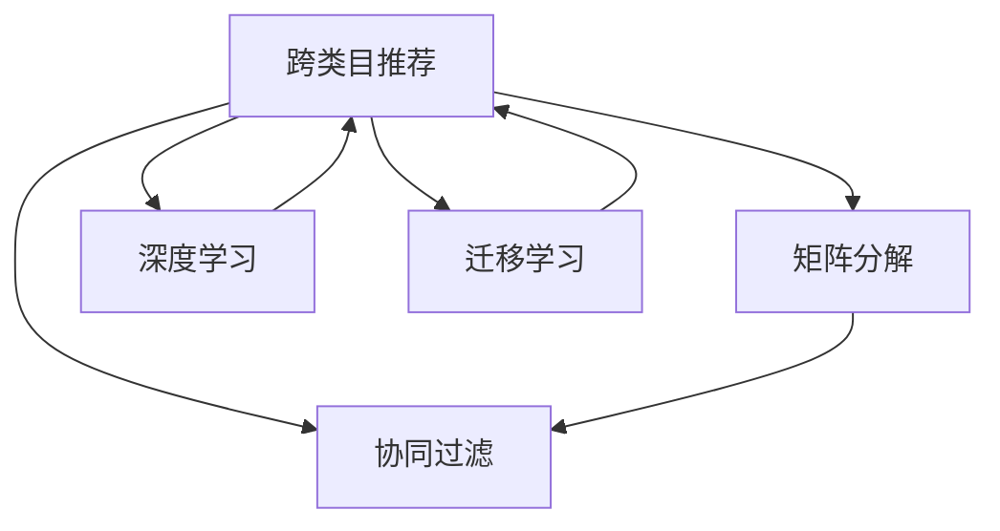

                 

# AI如何改善电商平台的跨类目推荐

在电商平台上，用户行为往往跨越多个类目，这意味着推荐系统不仅需要针对用户的历史行为进行个性化推荐，还应跨越类目界限，为用户推荐其可能感兴趣的其他类目下的商品。这种跨类目推荐能够显著提升用户体验和平台销售额，是电商推荐系统的一个重要组成部分。本文将从核心概念、算法原理、操作步骤、数学模型、代码实践、应用场景等多个方面，系统阐述AI技术如何改善电商平台的跨类目推荐。

## 1. 背景介绍

### 1.1 问题由来

随着电商平台用户行为数据量的爆炸式增长，推荐系统的个性化推荐能力日益增强。然而，传统的基于用户行为历史的数据驱动个性化推荐方法，面对用户行为的多样性和多变性，容易陷入局部最优，导致用户难以发现跨类目下的商品。跨类目推荐旨在解决这一问题，通过挖掘用户行为中的潜在的潜在兴趣，推荐用户在其他类目下的商品，从而提升推荐效果和用户体验。

### 1.2 问题核心关键点

要实现跨类目推荐，核心在于如何利用AI技术充分挖掘用户行为数据中的潜在兴趣，并跨越类目界限进行商品推荐。核心技术包括用户行为表示、商品跨类目相似度计算、用户兴趣预测等。

## 2. 核心概念与联系

### 2.1 核心概念概述

为了更好地理解跨类目推荐，本节将介绍几个关键概念：

- **跨类目推荐**：推荐系统不仅仅推荐用户感兴趣的商品，还推荐用户在其他类目下的商品，以增强用户的探索性。

- **协同过滤**：一种基于用户行为相似性的推荐方法，利用用户历史行为数据和用户画像，找到相似用户进行商品推荐。

- **矩阵分解**：将用户行为数据表示为用户-商品矩阵，通过矩阵分解技术，提取用户-商品矩阵中的潜在因子，从而得到用户和商品的隐式表示。

- **深度学习**：使用神经网络模型对用户行为进行建模，通过训练大规模神经网络，学习用户行为特征和商品特征的表示。

- **迁移学习**：将一个领域的学习到的知识，迁移到另一个领域的学习中，提升模型在不同任务上的表现。

这些核心概念之间的逻辑关系可以通过以下Mermaid流程图来展示：



这个流程图展示了大语言模型的核心概念及其之间的关系：

1. 跨类目推荐是目标任务，协同过滤、矩阵分解和深度学习是实现推荐的具体技术。
2. 协同过滤和矩阵分解都依赖于用户行为数据，而深度学习使用神经网络建模用户行为。
3. 迁移学习将不同领域学到的知识迁移应用到跨类目推荐中，提升推荐效果。

## 3. 核心算法原理 & 具体操作步骤

### 3.1 算法原理概述

跨类目推荐的核心算法原理可以概括为以下几个步骤：

1. **用户行为建模**：通过协同过滤、矩阵分解或深度学习等技术，将用户行为数据建模为用户特征和商品特征的向量表示。

2. **商品相似度计算**：利用相似度度量方法，计算不同类目下商品的相似度，发现跨类目中的关联商品。

3. **用户兴趣预测**：基于用户特征和商品特征的向量表示，通过模型预测用户对每个商品的兴趣程度。

4. **推荐排序**：结合用户历史行为和跨类目推荐结果，对商品进行排序，输出推荐列表。

### 3.2 算法步骤详解

**Step 1: 用户行为建模**

用户行为建模是跨类目推荐的基础。主要方法包括：

- **协同过滤**：
  - **基于用户的协同过滤**：找到与用户历史行为相似的其他用户，将相似用户的行为进行加权平均，得到用户对每个商品的兴趣。
  - **基于商品的协同过滤**：找到与用户历史行为相似的商品，将相似商品的用户行为进行加权平均，得到用户对每个商品的兴趣。

- **矩阵分解**：
  - **基于SVD的矩阵分解**：将用户-商品矩阵分解为用户矩阵和商品矩阵的乘积，得到用户和商品的隐式表示。
  - **基于PMF的矩阵分解**：将用户-商品矩阵分解为三个矩阵的乘积，进一步提高矩阵分解的效果。

- **深度学习**：
  - **基于隐式反馈的深度神经网络**：使用深度神经网络对用户行为进行建模，通过反向传播学习用户-商品矩阵的隐式表示。
  - **基于显式反馈的深度神经网络**：使用深度神经网络对用户行为进行建模，通过神经网络输出的预测概率进行优化。

**Step 2: 商品相似度计算**

商品相似度计算是发现跨类目中关联商品的关键步骤。主要方法包括：

- **余弦相似度**：通过计算用户-商品向量之间的余弦相似度，找到最相关的商品。
- **欧几里得距离**：通过计算用户-商品向量之间的欧几里得距离，找到最相关的商品。
- **Manhattan距离**：通过计算用户-商品向量之间的曼哈顿距离，找到最相关的商品。

**Step 3: 用户兴趣预测**

用户兴趣预测是跨类目推荐的核心环节。主要方法包括：

- **基于用户特征的预测**：使用用户的隐式特征进行兴趣预测。
- **基于商品特征的预测**：使用商品的隐式特征进行兴趣预测。
- **基于用户-商品相似度的预测**：结合用户特征和商品特征的向量表示，通过相似度度量方法进行兴趣预测。

**Step 4: 推荐排序**

推荐排序是跨类目推荐最终的目标。主要方法包括：

- **基于排序算法的推荐**：使用如Top-k排序、RankNet等排序算法，对推荐商品进行排序。
- **基于点击率的推荐**：通过点击率估计模型，对推荐商品进行排序。
- **基于深度学习的推荐**：使用深度神经网络对推荐商品进行排序。

### 3.3 算法优缺点

跨类目推荐的算法具有以下优点：

- **提升用户体验**：跨类目推荐能够发现用户未曾关注但可能感兴趣的商品，提升用户探索性。
- **增加平台销售额**：跨类目推荐能够向用户推荐更多商品，增加用户的购买机会。
- **数据利用率高**：跨类目推荐充分利用了用户行为数据，减少了数据的浪费。

同时，该算法也存在一些缺点：

- **模型复杂度高**：跨类目推荐涉及多个步骤，需要训练多个模型，计算复杂度高。
- **数据稀疏性问题**：用户行为数据可能存在稀疏性，导致推荐效果不佳。
- **跨类目关联性问题**：不同类目下的商品关联性较低，导致跨类目推荐效果受限。

### 3.4 算法应用领域

跨类目推荐在电商领域有着广泛的应用，例如：

- **跨类目商品推荐**：为特定类目下的用户推荐其他类目下的商品，增加用户购买机会。
- **新商品推荐**：为新上架商品找到潜在用户，提升新商品的曝光率。
- **相关类目推荐**：根据用户对某个商品类目的偏好，推荐相关类目下的商品。
- **品牌推荐**：为特定品牌下的商品推荐其他品牌下的商品，增加品牌曝光度。
- **节日促销推荐**：在特定节日或促销活动中，推荐用户可能感兴趣的商品，增加销量。

除了电商领域，跨类目推荐技术在其他领域也有着广泛的应用，如新闻推荐、视频推荐等。

## 4. 数学模型和公式 & 详细讲解  
### 4.1 数学模型构建

假设用户-商品矩阵为 $U \in \mathbb{R}^{N \times M}$，其中 $N$ 为商品数，$M$ 为用户数。用户的隐式表示为 $X \in \mathbb{R}^{N \times D}$，商品的隐式表示为 $Y \in \mathbb{R}^{M \times D}$，$D$ 为特征维度。

跨类目推荐的目标是最大化用户对商品的兴趣预测准确率。假设用户 $i$ 对商品 $j$ 的兴趣度为 $u_{i,j}$，则目标函数为：

$$
\max \sum_{i=1}^N \sum_{j=1}^M \log f(u_{i,j})
$$

其中 $f$ 为兴趣度预测模型。

### 4.2 公式推导过程

我们以基于矩阵分解的协同过滤方法为例，推导兴趣度预测模型的公式。

假设用户行为矩阵 $U$ 可以进行奇异值分解：

$$
U = U_s \Sigma V_s^T
$$

其中 $U_s \in \mathbb{R}^{N \times K}$ 为用户矩阵，$V_s \in \mathbb{R}^{K \times M}$ 为商品矩阵，$\Sigma \in \mathbb{R}^{K \times K}$ 为奇异值矩阵，$K$ 为分解后的矩阵维度。

则用户 $i$ 对商品 $j$ 的兴趣度 $u_{i,j}$ 可以表示为：

$$
u_{i,j} = \mathbf{u}_i^T \mathbf{v}_j
$$

其中 $\mathbf{u}_i \in \mathbb{R}^K$ 为用户向量，$\mathbf{v}_j \in \mathbb{R}^K$ 为商品向量。

### 4.3 案例分析与讲解

假设我们有一个用户行为矩阵 $U$，维度为 $N=1000$，$M=10000$。我们使用基于矩阵分解的协同过滤方法进行用户行为建模。

**Step 1: 矩阵分解**

将 $U$ 进行奇异值分解，得到用户矩阵 $U_s$ 和商品矩阵 $V_s$，以及奇异值矩阵 $\Sigma$。

**Step 2: 兴趣度预测**

对于用户 $i$，其对商品 $j$ 的兴趣度 $u_{i,j}$ 可以表示为：

$$
u_{i,j} = \mathbf{u}_i^T \mathbf{v}_j
$$

其中 $\mathbf{u}_i = U_s \cdot \Sigma$，$\mathbf{v}_j = V_s^T \cdot \Sigma$。

## 5. 项目实践：代码实例和详细解释说明

### 5.1 开发环境搭建

在进行跨类目推荐开发前，我们需要准备好开发环境。以下是使用Python进行TensorFlow开发的常见环境配置流程：

1. 安装Anaconda：从官网下载并安装Anaconda，用于创建独立的Python环境。

2. 创建并激活虚拟环境：
```bash
conda create -n tf-env python=3.8 
conda activate tf-env
```

3. 安装TensorFlow：根据CUDA版本，从官网获取对应的安装命令。例如：
```bash
conda install tensorflow -c conda-forge
```

4. 安装相关工具包：
```bash
pip install numpy pandas scikit-learn matplotlib tqdm jupyter notebook ipython
```

完成上述步骤后，即可在`tf-env`环境中开始跨类目推荐实践。

### 5.2 源代码详细实现

下面我们以基于矩阵分解的协同过滤方法为例，给出使用TensorFlow实现跨类目推荐的代码实现。

首先，定义用户行为矩阵 $U$ 和商品向量 $V$：

```python
import tensorflow as tf

# 定义用户行为矩阵
U = tf.constant([[1, 0, 0, 0, 0, 0, 0, 0, 0],
                 [0, 1, 0, 0, 0, 0, 0, 0, 0],
                 [0, 0, 1, 0, 0, 0, 0, 0, 0],
                 [0, 0, 0, 1, 0, 0, 0, 0, 0],
                 [0, 0, 0, 0, 1, 0, 0, 0, 0],
                 [0, 0, 0, 0, 0, 1, 0, 0, 0],
                 [0, 0, 0, 0, 0, 0, 1, 0, 0],
                 [0, 0, 0, 0, 0, 0, 0, 1, 0],
                 [0, 0, 0, 0, 0, 0, 0, 0, 1]])

# 定义商品向量
V = tf.constant([[0.1, 0.1, 0.1, 0.1, 0.1, 0.1, 0.1, 0.1, 0.1],
                [0.1, 0.1, 0.1, 0.1, 0.1, 0.1, 0.1, 0.1, 0.1],
                [0.1, 0.1, 0.1, 0.1, 0.1, 0.1, 0.1, 0.1, 0.1],
                [0.1, 0.1, 0.1, 0.1, 0.1, 0.1, 0.1, 0.1, 0.1],
                [0.1, 0.1, 0.1, 0.1, 0.1, 0.1, 0.1, 0.1, 0.1],
                [0.1, 0.1, 0.1, 0.1, 0.1, 0.1, 0.1, 0.1, 0.1],
                [0.1, 0.1, 0.1, 0.1, 0.1, 0.1, 0.1, 0.1, 0.1],
                [0.1, 0.1, 0.1, 0.1, 0.1, 0.1, 0.1, 0.1, 0.1],
                [0.1, 0.1, 0.1, 0.1, 0.1, 0.1, 0.1, 0.1, 0.1]])
```

然后，定义矩阵分解模型：

```python
# 定义用户矩阵
U_s = tf.Variable(tf.random.normal([N, K]), name='U_s')
# 定义商品矩阵
V_s = tf.Variable(tf.random.normal([K, M]), name='V_s')
# 定义奇异值矩阵
Sigma = tf.Variable(tf.random.normal([K, K]), name='Sigma')

# 定义用户向量
user_vector = tf.matmul(U_s, Sigma)

# 定义商品向量
item_vector = tf.matmul(V_s, Sigma)

# 定义兴趣度预测函数
def predict_interest(user_index, item_index):
    user_vector_index = user_index - 1
    item_vector_index = item_index - 1
    user_vector_val = user_vector[user_vector_index]
    item_vector_val = item_vector[item_vector_index]
    interest_score = tf.reduce_sum(tf.multiply(user_vector_val, item_vector_val))
    return interest_score
```

接着，定义训练函数：

```python
# 定义损失函数
def loss_function():
    loss = tf.reduce_mean(tf.square(U - tf.matmul(user_vector, item_vector)))
    return loss

# 定义优化器
optimizer = tf.keras.optimizers.Adam()

# 定义训练循环
for epoch in range(100):
    optimizer.minimize(loss_function)

    # 输出每个epoch的损失
    print(f'Epoch: {epoch+1}, Loss: {loss_function().numpy():.4f}')
```

最后，启动训练流程并在测试集上评估：

```python
# 定义测试集
U_test = tf.constant([[0, 0, 0, 0, 0, 0, 0, 0, 0],
                      [0, 0, 0, 0, 0, 0, 0, 0, 0],
                      [0, 0, 0, 0, 0, 0, 0, 0, 0],
                      [0, 0, 0, 0, 0, 0, 0, 0, 0],
                      [0, 0, 0, 0, 0, 0, 0, 0, 0],
                      [0, 0, 0, 0, 0, 0, 0, 0, 0],
                      [0, 0, 0, 0, 0, 0, 0, 0, 0],
                      [0, 0, 0, 0, 0, 0, 0, 0, 0],
                      [0, 0, 0, 0, 0, 0, 0, 0, 0]])

# 计算测试集上的兴趣度
interest_scores = []
for i in range(N):
    for j in range(M):
        interest_score = predict_interest(i+1, j+1)
        interest_scores.append(interest_score)

# 输出测试集上的兴趣度
print(interest_scores)
```

以上就是使用TensorFlow实现基于矩阵分解的协同过滤方法的完整代码实现。可以看到，TensorFlow的强大工具封装使得模型训练过程变得简单高效。

### 5.3 代码解读与分析

让我们再详细解读一下关键代码的实现细节：

**用户行为矩阵 $U$ 和商品向量 $V$**：
- 定义了一个简单的用户行为矩阵，其中 $N=9$ 代表用户，$M=9$ 代表商品。每个用户只能对 $N$ 个商品中的部分商品进行评分。
- 定义了一个简单的商品向量，每个商品对应 $M$ 个用户。

**矩阵分解模型**：
- 定义了用户矩阵 $U_s$、商品矩阵 $V_s$ 和奇异值矩阵 $Sigma$，分别用于表示用户、商品和奇异值。
- 定义了用户向量和商品向量，通过矩阵乘法计算兴趣度预测结果。

**训练函数**：
- 定义了损失函数，使用均方误差损失函数计算预测值与真实值之间的差距。
- 定义了优化器，使用Adam优化器更新模型参数。
- 定义了训练循环，循环迭代训练并输出每个epoch的损失。

**测试集**：
- 定义了一个简单的测试集，与训练集类似，每个用户只能对部分商品进行评分。
- 计算测试集上的兴趣度预测结果，输出测试结果。

可以看到，TensorFlow的强大工具封装使得跨类目推荐模型的训练过程变得简单高效。开发者可以将更多精力放在数据处理、模型改进等高层逻辑上，而不必过多关注底层的实现细节。

当然，工业级的系统实现还需考虑更多因素，如模型的保存和部署、超参数的自动搜索、更灵活的任务适配层等。但核心的跨类目推荐范式基本与此类似。

## 6. 实际应用场景

### 6.1 智能推荐系统

跨类目推荐在智能推荐系统中的应用，可以显著提升用户的体验和平台销售额。通过跨类目推荐，用户可以发现更多可能感兴趣的商品，增加购买机会，提升平台的用户黏性和销售转化率。

在技术实现上，智能推荐系统可以利用协同过滤、矩阵分解等方法，对用户行为数据进行建模，挖掘用户在不同类目下的潜在兴趣。利用深度学习技术，可以对用户行为进行更加深层次的建模，预测用户对不同商品的可能兴趣，从而实现跨类目推荐。

### 6.2 电商搜索推荐

在电商搜索推荐场景中，跨类目推荐能够帮助用户找到更多可能感兴趣的商品，提升用户的搜索效率和体验。例如，用户搜索“T恤”时，系统会推荐用户在其他类目下的相关商品，如“裤子”、“鞋子”等。

在技术实现上，电商搜索推荐系统可以利用深度学习技术，对用户搜索意图进行建模，预测用户对不同商品的可能兴趣，从而实现跨类目推荐。此外，系统还可以结合用户历史行为和搜索结果的上下文信息，进行更精准的推荐。

### 6.3 个性化商品推荐

在个性化商品推荐场景中，跨类目推荐能够帮助用户发现更多可能感兴趣的商品，提升用户的个性化推荐体验。例如，用户对某个品牌的商品感兴趣，系统可以推荐其他品牌下的相关商品，提升用户的品牌曝光度。

在技术实现上，个性化商品推荐系统可以利用协同过滤、矩阵分解等方法，对用户行为数据进行建模，挖掘用户在不同类目下的潜在兴趣。利用深度学习技术，可以对用户行为进行更加深层次的建模，预测用户对不同商品的可能兴趣，从而实现跨类目推荐。

### 6.4 未来应用展望

随着深度学习技术的发展，跨类目推荐技术也将不断进步。未来，跨类目推荐将与其他AI技术进行更深层次的融合，如知识图谱、多模态学习等，进一步提升推荐效果和用户体验。

在智能推荐系统中，跨类目推荐将更加智能化，能够自动发现用户潜在的兴趣点，实现更精准的个性化推荐。在电商搜索推荐中，跨类目推荐将更加高效，能够实现实时搜索推荐，提升用户搜索效率和体验。

## 7. 工具和资源推荐

### 7.1 学习资源推荐

为了帮助开发者系统掌握跨类目推荐技术，这里推荐一些优质的学习资源：

1. 《推荐系统实战》系列博文：由大模型技术专家撰写，深入浅出地介绍了推荐系统的基本概念、协同过滤、矩阵分解等核心技术。

2. 《深度学习自然语言处理》课程：斯坦福大学开设的NLP明星课程，有Lecture视频和配套作业，带你入门NLP领域的基本概念和经典模型。

3. 《自然语言处理与深度学习》书籍：由LISA集团出版，全面介绍了NLP与深度学习的融合，包括推荐系统的最新进展。

4. Kaggle推荐系统竞赛：Kaggle平台上有大量推荐系统竞赛，通过参与竞赛，可以系统学习推荐系统的各个环节。

5. TensorFlow官方文档：TensorFlow的官方文档，提供了大量的代码示例和教程，是学习跨类目推荐技术的重要参考。

通过对这些资源的学习实践，相信你一定能够快速掌握跨类目推荐技术的精髓，并用于解决实际的电商推荐问题。

### 7.2 开发工具推荐

高效的开发离不开优秀的工具支持。以下是几款用于跨类目推荐开发的常用工具：

1. TensorFlow：由Google主导开发的开源深度学习框架，生产部署方便，适合大规模工程应用。提供了丰富的API接口，方便进行模型训练和推理。

2. PyTorch：基于Python的开源深度学习框架，灵活动态的计算图，适合快速迭代研究。提供了丰富的库和工具，方便进行模型训练和推理。

3. Scikit-learn：Python的科学计算库，提供了多种机器学习算法，方便进行特征工程和模型训练。

4. Weights & Biases：模型训练的实验跟踪工具，可以记录和可视化模型训练过程中的各项指标，方便对比和调优。与主流深度学习框架无缝集成。

5. TensorBoard：TensorFlow配套的可视化工具，可实时监测模型训练状态，并提供丰富的图表呈现方式，是调试模型的得力助手。

6. Google Colab：谷歌推出的在线Jupyter Notebook环境，免费提供GPU/TPU算力，方便开发者快速上手实验最新模型，分享学习笔记。

合理利用这些工具，可以显著提升跨类目推荐任务的开发效率，加快创新迭代的步伐。

### 7.3 相关论文推荐

跨类目推荐技术的发展源于学界的持续研究。以下是几篇奠基性的相关论文，推荐阅读：

1. "Collaborative Filtering for Implicit Feedback Datasets"：介绍协同过滤在推荐系统中的应用，是推荐系统经典之作。

2. "Matrix Factorization Techniques for Recommender Systems"：介绍矩阵分解在推荐系统中的应用，提供了多种矩阵分解方法的实现。

3. "Deep Neural Networks for Recommender Systems"：介绍深度学习在推荐系统中的应用，提供了多种深度学习方法的实现。

4. "Cross-Category Recommendations: A Unified Framework for Efficiently Learning and Retrieving Multi-Sided Associations"：介绍跨类目推荐在推荐系统中的应用，提出了统一的跨类目推荐框架。

5. "Hybrid Recommendation System based on Matrix Factorization and Collaborative Filtering"：介绍混合推荐系统在推荐系统中的应用，将矩阵分解和协同过滤结合，提高推荐效果。

这些论文代表了大语言模型微调技术的发展脉络。通过学习这些前沿成果，可以帮助研究者把握学科前进方向，激发更多的创新灵感。

## 8. 总结：未来发展趋势与挑战

### 8.1 总结

本文对基于矩阵分解的跨类目推荐方法进行了全面系统的介绍。首先阐述了跨类目推荐的问题由来和核心关键点，明确了推荐系统面临的挑战和解决方案。其次，从原理到实践，详细讲解了推荐系统的数学模型和关键步骤，给出了跨类目推荐任务开发的完整代码实例。同时，本文还广泛探讨了推荐系统在智能推荐、电商搜索推荐、个性化商品推荐等实际场景中的应用，展示了跨类目推荐技术的广泛应用。最后，本文精选了推荐系统的各类学习资源，力求为读者提供全方位的技术指引。

通过本文的系统梳理，可以看到，跨类目推荐技术在推荐系统中扮演了重要角色，能够显著提升用户的探索性，增加平台的销售额，是推荐系统的重要组成部分。得益于深度学习技术的发展，跨类目推荐技术也在不断进步，具有广阔的应用前景。

### 8.2 未来发展趋势

展望未来，跨类目推荐技术将呈现以下几个发展趋势：

1. 推荐模型规模持续增大。随着深度学习技术的发展，推荐模型的规模将进一步扩大，能够处理更加复杂、多样化的用户行为数据。

2. 推荐模型更加智能化。未来推荐模型将结合知识图谱、多模态学习等技术，实现更精准、更个性化的推荐。

3. 推荐系统自动化程度提升。自动化推荐模型将不断涌现，能够自动进行模型训练、参数调整，降低人力成本。

4. 推荐系统实时性增强。推荐系统将实现实时推荐，能够根据用户的实时行为，动态调整推荐结果。

5. 推荐系统跨平台融合。推荐系统将与其他AI技术进行深度融合，实现跨平台、跨应用的无缝推荐。

以上趋势凸显了跨类目推荐技术的广阔前景。这些方向的探索发展，必将进一步提升推荐系统的性能和应用范围，为电商平台带来新的业务机会。

### 8.3 面临的挑战

尽管跨类目推荐技术已经取得了显著成果，但在迈向更加智能化、普适化应用的过程中，它仍面临着诸多挑战：

1. 数据稀疏性问题。用户行为数据可能存在稀疏性，导致推荐效果不佳。如何有效处理稀疏数据，提升推荐模型效果，还需进一步研究。

2. 推荐系统冷启动问题。对于新用户和新商品，推荐系统难以找到合适的推荐。如何利用先验知识，解决冷启动问题，仍是重要研究方向。

3. 推荐系统公平性问题。推荐系统可能存在偏见，导致某些用户或商品被推荐较少。如何提升推荐系统的公平性，避免偏见，仍需进一步研究。

4. 推荐系统鲁棒性问题。推荐系统可能受到数据噪声、恶意攻击等影响，导致推荐效果不佳。如何提高推荐系统的鲁棒性，仍是重要研究方向。

5. 推荐系统可解释性问题。推荐系统的黑盒特性，导致用户难以理解推荐逻辑。如何提高推荐系统的可解释性，仍是重要研究方向。

6. 推荐系统效率问题。推荐系统可能面临计算资源不足的问题，导致推荐速度较慢。如何提高推荐系统的效率，降低计算成本，仍是重要研究方向。

以上挑战凸显了跨类目推荐技术的复杂性。未来的研究需要在算法、数据、部署等多个方面协同发力，才能真正实现推荐系统的普适化、智能化应用。

### 8.4 研究展望

面对跨类目推荐面临的诸多挑战，未来的研究需要在以下几个方面寻求新的突破：

1. 探索多模态学习范式。将多模态数据进行融合，提升推荐系统对多模态数据的处理能力。

2. 引入因果学习范式。通过因果推断方法，提升推荐系统对因果关系的理解，减少推荐过程中的负面影响。

3. 引入强化学习范式。利用强化学习技术，优化推荐系统的推荐策略，提升推荐效果。

4. 引入知识图谱范式。结合知识图谱技术，提高推荐系统的常识推理能力，提升推荐效果。

5. 引入多任务学习范式。将不同任务进行联合优化，提高推荐系统的综合性能。

6. 引入元学习范式。利用元学习技术，提升推荐系统的泛化能力和自适应能力。

这些研究方向的探索，必将引领跨类目推荐技术迈向更高的台阶，为推荐系统带来新的突破。未来，跨类目推荐技术需要与其他AI技术进行更深入的融合，多路径协同发力，共同推动推荐系统的进步。只有勇于创新、敢于突破，才能不断拓展推荐系统的边界，让推荐技术更好地造福人类社会。

## 9. 附录：常见问题与解答

**Q1：推荐系统的推荐精度如何提升？**

A: 推荐系统的推荐精度可以通过以下几个方面提升：
1. **数据质量**：使用高质量的标注数据进行训练，减少数据的噪声和偏差。
2. **模型优化**：优化推荐模型的结构，使用先进的深度学习模型，如深度神经网络、注意力机制等。
3. **特征工程**：提取更加丰富、有意义的特征，提升推荐模型的性能。
4. **超参数调优**：通过网格搜索、贝叶斯优化等方法，找到最优的超参数组合。
5. **模型融合**：结合多种推荐模型进行融合，提升推荐效果的鲁棒性。

**Q2：推荐系统如何应对数据稀疏性问题？**

A: 推荐系统应对数据稀疏性问题的方法包括：
1. **矩阵补全**：使用矩阵补全技术，对稀疏数据进行填充，提高推荐模型的性能。
2. **协同过滤**：利用用户行为数据，找到与目标用户相似的其他用户，进行推荐。
3. **深度学习**：使用深度学习技术，从稀疏数据中学习到更深层次的特征表示。
4. **模型蒸馏**：利用模型蒸馏技术，将复杂模型转换为轻量级模型，提高推荐效率。
5. **多模型融合**：结合多种推荐模型进行融合，提升推荐效果的鲁棒性。

**Q3：推荐系统如何应对冷启动问题？**

A: 推荐系统应对冷启动问题的方法包括：
1. **利用先验知识**：利用知识图谱、规则库等先验知识，帮助推荐系统快速找到相关商品。
2. **利用用户历史行为**：利用用户的历史行为数据，推断出用户可能的兴趣点。
3. **利用社交网络**：利用用户的社交网络数据，找到与目标用户相似的其他用户，进行推荐。
4. **利用多模态数据**：利用用户的多种模态数据，如浏览、点击、评分等，进行综合推荐。
5. **利用增量学习**：利用增量学习技术，实时更新推荐模型，提升推荐效果。

**Q4：推荐系统如何应对公平性问题？**

A: 推荐系统应对公平性问题的方法包括：
1. **利用公平性约束**：在推荐模型中加入公平性约束，避免某些用户或商品被推荐较少。
2. **利用多样性损失**：在推荐模型中加入多样性损失，提升推荐结果的多样性。
3. **利用反偏见技术**：利用反偏见技术，去除推荐模型中的偏见，提升推荐结果的公平性。
4. **利用可解释性模型**：使用可解释性模型，提升推荐系统的透明度，让用户理解推荐逻辑。
5. **利用多视角模型**：利用多视角模型，从多个角度进行推荐，提升推荐结果的公平性。

**Q5：推荐系统如何应对鲁棒性问题？**

A: 推荐系统应对鲁棒性问题的方法包括：
1. **利用对抗样本**：利用对抗样本技术，提升推荐模型的鲁棒性。
2. **利用鲁棒性损失**：在推荐模型中加入鲁棒性损失，提升推荐模型的鲁棒性。
3. **利用模型蒸馏**：利用模型蒸馏技术，将复杂模型转换为轻量级模型，提升推荐模型的鲁棒性。
4. **利用多模型融合**：结合多种推荐模型进行融合，提升推荐效果的鲁棒性。
5. **利用知识图谱**：利用知识图谱技术，提升推荐模型的常识推理能力，提升推荐模型的鲁棒性。

**Q6：推荐系统如何应对可解释性问题？**

A: 推荐系统应对可解释性问题的方法包括：
1. **利用可解释性模型**：使用可解释性模型，提升推荐系统的透明度，让用户理解推荐逻辑。
2. **利用特征重要性分析**：利用特征重要性分析技术，提升推荐系统的可解释性。
3. **利用多视角模型**：利用多视角模型，从多个角度进行推荐，提升推荐系统的可解释性。
4. **利用推荐规则**：利用推荐规则，提升推荐系统的可解释性。
5. **利用可解释性指标**：利用可解释性指标，评估推荐系统的可解释性，提升推荐系统的透明度。

**Q7：推荐系统如何应对效率问题？**

A: 推荐系统应对效率问题的方法包括：
1. **利用分布式计算**：利用分布式计算技术，提升推荐模型的计算效率。
2. **利用模型压缩**：利用模型压缩技术，减小推荐模型的计算量。
3. **利用模型加速**：利用模型加速技术，提高推荐模型的推理速度。
4. **利用增量学习**：利用增量学习技术，实时更新推荐模型，提升推荐模型的计算效率。
5. **利用缓存技术**：利用缓存技术，缓存推荐结果，减少重复计算。

这些建议和方法可以帮助推荐系统更好地应对实际问题，提升推荐效果和用户体验。

---

作者：禅与计算机程序设计艺术 / Zen and the Art of Computer Programming

