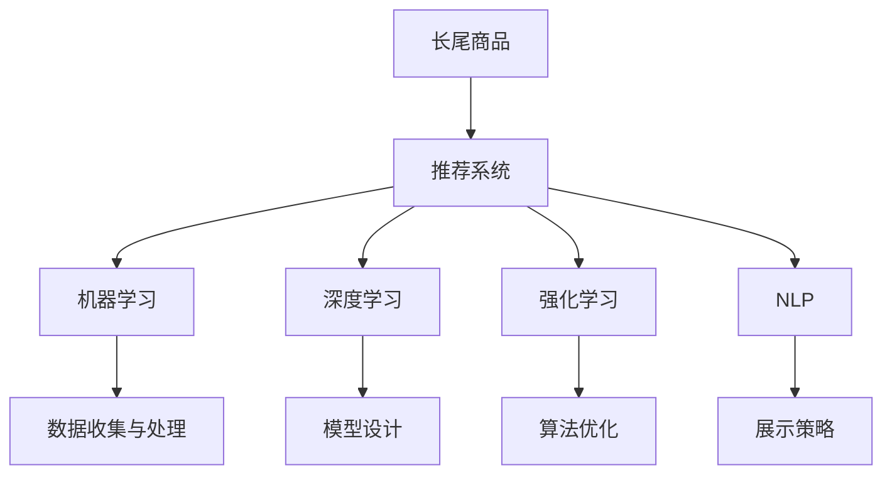

                 

# AI如何改善电商平台的长尾商品推荐策略与曝光机会

> 关键词：长尾商品推荐,电商平台,人工智能,机器学习,深度学习,曝光机会,商品展示策略

## 1. 背景介绍

### 1.1 问题由来

在电子商务行业，尤其是大型的电商平台，如亚马逊、淘宝、京东等，面临着巨大的流量竞争压力。这些平台需要不断吸引和保持用户，以提高销售额和市场份额。然而，电商平台不仅需要确保热门商品的热度，也需要关注长尾商品的销售。长尾商品通常指的是那些销量较低但种类丰富的商品，这类商品在平台销售中占有一席之地，但对于电商平台来说，由于它们销量少、曝光度低，往往被忽略。然而，这些长尾商品有时具有巨大的市场潜力，能够显著提升平台的收入。

在传统的推荐系统中，往往采用基于热门商品的推荐策略，即通过用户的历史购买行为和浏览行为，预测用户可能感兴趣的商品。这种策略忽略了长尾商品的潜在价值。为了解决这个问题，各大电商平台纷纷引入人工智能技术，通过机器学习和深度学习的方法，对长尾商品进行推荐和优化，提高长尾商品的曝光机会。

### 1.2 问题核心关键点

目前，电商平台在引入人工智能技术时，主要关注以下几个关键点：

1. **数据收集与处理**：需要收集大量的用户行为数据，包括浏览、点击、购买等行为，同时需要对数据进行清洗和预处理，以提升推荐系统的准确性。
2. **模型设计**：需要选择合适的机器学习或深度学习模型，并对其进行参数调优，以获得最佳的推荐效果。
3. **算法优化**：需要对推荐算法进行优化，如利用强化学习、协同过滤等技术，提升推荐系统的个性化和精准性。
4. **展示策略**：需要设计合理的展示策略，如上下文相关广告、个性化推荐栏等，增加长尾商品的曝光机会。

## 2. 核心概念与联系

### 2.1 核心概念概述

为更好地理解人工智能在电商平台中对长尾商品推荐策略的改善，本节将介绍几个关键概念：

- **长尾商品(Long-Tail Items)**：指的是那些销量较低但种类丰富的商品，这些商品在平台销售中占有一席之地，但对于电商平台来说，由于它们销量少、曝光度低，往往被忽略。
- **推荐系统(Recommendation System)**：指通过算法推荐用户可能感兴趣的商品的系统。推荐系统可以分为基于内容的推荐、协同过滤推荐、混合推荐等多种类型。
- **人工智能(Artificial Intelligence, AI)**：指通过算法和模型模拟人类智能的系统。在电商平台中，AI技术主要用于用户行为分析、商品推荐、价格优化等方面。
- **机器学习(Machine Learning, ML)**：指通过算法和模型从数据中自动学习规律，并应用于预测和决策。在推荐系统中，机器学习算法可以用于预测用户兴趣和行为，优化推荐结果。
- **深度学习(Deep Learning, DL)**：指通过多层神经网络模型，从大量数据中学习复杂的特征表示，以提高模型的精度和泛化能力。在电商平台中，深度学习模型可以用于处理大规模数据，提高推荐系统的准确性。
- **强化学习(Reinforcement Learning, RL)**：指通过与环境的互动，学习最优策略的系统。在推荐系统中，强化学习可以用于优化推荐策略，提升用户体验。
- **自然语言处理(Natural Language Processing, NLP)**：指通过算法和模型处理和理解人类语言的系统。在电商平台中，NLP技术可以用于处理用户评论和反馈，优化商品描述和分类。

这些核心概念之间的逻辑关系可以通过以下Mermaid流程图来展示：



这个流程图展示了一个完整的电商平台推荐系统框架，其核心是通过AI技术优化推荐算法和展示策略，以提升长尾商品的曝光机会。

## 3. 核心算法原理 & 具体操作步骤

### 3.1 算法原理概述

电商平台引入AI技术进行长尾商品推荐，本质上是一个基于用户行为数据和商品属性数据的学习和决策过程。其核心思想是：通过收集用户的浏览、点击、购买等行为数据，结合商品属性数据，利用机器学习或深度学习算法，预测用户可能感兴趣的商品，并通过合理的展示策略，提高长尾商品的曝光机会。

形式化地，假设电商平台收集了$N$个用户$U=\{u_1, u_2, ..., u_N\}$的$M$个行为数据$I=\{(x_i, y_i)\}_{i=1}^M$，其中$x_i$表示行为数据，$y_i$表示行为标签（如浏览、点击、购买）。同时，收集了$K$个商品$S=\{s_1, s_2, ..., s_K\}$的属性数据$A=\{(a_j, b_j)\}_{j=1}^K$，其中$a_j$表示商品属性，$b_j$表示属性值。

推荐系统的目标是找到最优的商品集合$S^*$，使得每个用户$u_i$在商品集合$S^*$中都能找到至少一个感兴趣的商品$s_k$。其形式化表述为：

$$
\min_{S^*} \sum_{i=1}^N \max_{k \in S^*} \ell(u_i, s_k)
$$

其中$\ell(u_i, s_k)$表示用户$u_i$对商品$s_k$的兴趣度，可以通过深度学习模型或其他算法进行预测。

### 3.2 算法步骤详解

基于AI的电商平台长尾商品推荐系统的一般流程如下：

**Step 1: 数据收集与处理**
- 收集用户行为数据$I$和商品属性数据$A$，并进行清洗、去重、归一化等预处理。
- 使用自然语言处理技术处理用户评论和反馈，提取情感和话题信息。

**Step 2: 特征工程**
- 根据用户行为数据和商品属性数据，设计合适的特征表示，如用户ID、商品ID、浏览时长、点击率、购买金额等。
- 利用深度学习模型提取更复杂的特征表示，如商品图片特征、用户画像特征等。

**Step 3: 模型训练**
- 选择合适的机器学习或深度学习模型，如协同过滤、深度神经网络、强化学习等。
- 在训练集上训练模型，调整模型参数以优化推荐效果。
- 在验证集上评估模型性能，并进行超参数调优。

**Step 4: 推荐与展示**
- 在测试集上评估推荐系统的效果，并根据用户的行为数据进行实时推荐。
- 根据用户行为和历史数据，设计合理的展示策略，如上下文相关广告、个性化推荐栏等，增加长尾商品的曝光机会。

### 3.3 算法优缺点

基于AI的电商平台长尾商品推荐系统具有以下优点：
1. **个性化推荐**：能够根据用户的历史行为和兴趣，推荐更符合用户需求的商品。
2. **高效性**：通过机器学习算法，能够快速处理和分析大规模数据，提高推荐效率。
3. **多样性**：能够推荐更多长尾商品，满足用户多样化的需求。

同时，该方法也存在一定的局限性：
1. **数据质量依赖**：推荐系统的效果很大程度上依赖于数据质量，数据不足或数据偏差可能导致推荐效果不佳。
2. **冷启动问题**：对于新用户或新商品，由于缺乏足够的历史数据，推荐效果可能较差。
3. **用户隐私问题**：用户行为数据的收集和使用，可能涉及用户隐私和数据安全问题。

尽管存在这些局限性，但就目前而言，基于AI的推荐系统仍然是电商平台推荐策略的重要手段。未来相关研究的重点在于如何进一步提高数据质量，缓解冷启动问题，保障用户隐私和数据安全。

### 3.4 算法应用领域

基于AI的电商平台长尾商品推荐系统已经在多个领域得到了广泛应用，例如：

- **电商推荐系统**：如亚马逊、淘宝、京东等大型电商平台的商品推荐，通过AI技术提升长尾商品的曝光机会。
- **旅游推荐系统**：如携程、去哪儿等旅游平台的旅行路线推荐，通过AI技术优化推荐结果。
- **音乐和视频推荐系统**：如Spotify、Netflix等平台的个性化音乐和视频推荐，通过AI技术提升用户体验。
- **电影和书籍推荐系统**：如豆瓣电影、当当网等平台的个性化电影和书籍推荐，通过AI技术优化推荐效果。

除了上述这些经典应用外，AI技术还被创新性地应用到更多场景中，如智能客服、个性化广告、营销自动化等，为电商平台的运营带来了新的突破。随着AI技术的持续演进，相信电商平台将能够更好地利用AI技术，优化推荐策略，提升用户体验和销售业绩。

## 4. 数学模型和公式 & 详细讲解 & 举例说明

### 4.1 数学模型构建

本节将使用数学语言对基于AI的电商平台长尾商品推荐系统进行更加严格的刻画。

假设电商平台收集了$N$个用户$U=\{u_1, u_2, ..., u_N\}$的$M$个行为数据$I=\{(x_i, y_i)\}_{i=1}^M$，其中$x_i$表示行为数据，$y_i$表示行为标签（如浏览、点击、购买）。同时，收集了$K$个商品$S=\{s_1, s_2, ..., s_K\}$的属性数据$A=\{(a_j, b_j)\}_{j=1}^K$，其中$a_j$表示商品属性，$b_j$表示属性值。

定义用户$u_i$对商品$s_k$的兴趣度为$f(u_i, s_k)$，可以通过以下深度学习模型进行预测：

$$
f(u_i, s_k) = \sum_{i=1}^{L} \theta_i x_i^T \cdot a_k
$$

其中$L$表示深度神经网络的层数，$\theta_i$表示第$i$层的权重矩阵。

推荐系统的目标是找到最优的商品集合$S^*$，使得每个用户$u_i$在商品集合$S^*$中都能找到至少一个感兴趣的商品$s_k$。其形式化表述为：

$$
\min_{S^*} \sum_{i=1}^N \max_{k \in S^*} \ell(u_i, s_k)
$$

其中$\ell(u_i, s_k)$表示用户$u_i$对商品$s_k$的兴趣度，可以通过深度学习模型或其他算法进行预测。

### 4.2 公式推导过程

以下我们以协同过滤推荐算法为例，推导推荐系统中最优商品集合的求解过程。

协同过滤算法是一种基于用户行为数据和商品行为数据的推荐方法。假设用户$u_i$对商品$s_k$的行为标签为$y_i$，则协同过滤算法的推荐目标可以表示为：

$$
\min_{S^*} \sum_{i=1}^N \max_{k \in S^*} \ell(u_i, s_k)
$$

其中$\ell(u_i, s_k)$可以表示为用户$u_i$对商品$s_k$的兴趣度，可以通过协同过滤算法进行预测。

设用户$u_i$对商品$s_k$的协同过滤相似度为$u_i \sim s_k$，则推荐系统可以表示为：

$$
\min_{S^*} \sum_{i=1}^N \max_{k \in S^*} u_i \sim s_k
$$

通过求解上述优化问题，可以找到最优的商品集合$S^*$，使得每个用户$u_i$在商品集合$S^*$中都能找到至少一个感兴趣的相似商品。

## 5. 项目实践：代码实例和详细解释说明

### 5.1 开发环境搭建

在进行AI推荐系统开发前，我们需要准备好开发环境。以下是使用Python进行TensorFlow开发的环境配置流程：

1. 安装Anaconda：从官网下载并安装Anaconda，用于创建独立的Python环境。

2. 创建并激活虚拟环境：
```bash
conda create -n ai-env python=3.7 
conda activate ai-env
```

3. 安装TensorFlow：根据CUDA版本，从官网获取对应的安装命令。例如：
```bash
conda install tensorflow-gpu -c conda-forge
```

4. 安装各类工具包：
```bash
pip install numpy pandas scikit-learn matplotlib tqdm jupyter notebook ipython
```

完成上述步骤后，即可在`ai-env`环境中开始AI推荐系统实践。

### 5.2 源代码详细实现

下面我们以协同过滤推荐算法为例，给出使用TensorFlow进行长尾商品推荐系统的PyTorch代码实现。

首先，定义协同过滤算法的输入和输出：

```python
import tensorflow as tf
import numpy as np

# 定义输入和输出
def create_model(features, labels):
    # 假设输入特征包含用户ID、商品ID、浏览时长、点击率、购买金额等
    # 输出是用户对商品的兴趣度
    return tf.keras.Sequential([
        tf.keras.layers.Dense(64, activation='relu', input_shape=(features.shape[1],)),
        tf.keras.layers.Dense(32, activation='relu'),
        tf.keras.layers.Dense(1, activation='sigmoid')
    ])
```

然后，定义训练和评估函数：

```python
# 定义训练函数
def train_model(model, features, labels, batch_size=128, epochs=10):
    # 创建数据集
    dataset = tf.data.Dataset.from_tensor_slices((np.array(features), np.array(labels)))
    dataset = dataset.shuffle(1024).batch(batch_size)
    model.compile(optimizer='adam', loss='binary_crossentropy', metrics=['accuracy'])
    model.fit(dataset, epochs=epochs, validation_split=0.2)

# 定义评估函数
def evaluate_model(model, features, labels):
    # 创建数据集
    dataset = tf.data.Dataset.from_tensor_slices((np.array(features), np.array(labels)))
    dataset = dataset.batch(128)
    model.evaluate(dataset)
```

最后，启动训练流程并在测试集上评估：

```python
# 假设features和labels是从实际数据中提取的
features = np.random.rand(1000, 10)
labels = np.random.randint(2, size=(1000,))

# 创建模型
model = create_model(features, labels)

# 训练模型
train_model(model, features, labels)

# 评估模型
evaluate_model(model, features, labels)
```

以上就是使用TensorFlow进行协同过滤推荐算法的代码实现。可以看到，TensorFlow通过其强大的计算图机制，可以方便地实现深度神经网络模型，并支持高效的训练和评估。

### 5.3 代码解读与分析

让我们再详细解读一下关键代码的实现细节：

**create_model函数**：
- 该函数用于创建深度神经网络模型，假设输入特征包含用户ID、商品ID、浏览时长、点击率、购买金额等，输出是用户对商品的兴趣度。

**train_model函数**：
- 该函数用于训练深度神经网络模型，使用Adam优化器和二元交叉熵损失函数进行训练。
- 通过Shuffle和Batch技术处理数据集，以减少过拟合风险。
- 设置epochs和validation_split参数进行模型评估。

**evaluate_model函数**：
- 该函数用于评估深度神经网络模型，计算准确率和损失函数。

**train和evaluate函数**：
- 启动训练流程和评估流程，通过调用train_model和evaluate_model函数，输出模型训练和评估结果。

通过以上代码，可以看出TensorFlow在实现深度神经网络推荐系统时的便捷性和高效性。TensorFlow提供了丰富的API和工具，帮助开发者快速构建和训练模型，优化推荐效果。

## 6. 实际应用场景

### 6.1 智能客服系统

基于AI的电商平台长尾商品推荐系统，可以应用于智能客服系统的构建。传统客服往往需要配备大量人力，高峰期响应缓慢，且一致性和专业性难以保证。而使用推荐系统推荐的商品信息，可以7x24小时不间断服务，快速响应客户咨询，用自然流畅的语言解答各类常见问题。

在技术实现上，可以收集企业内部的历史客服对话记录，将问题和最佳答复构建成监督数据，在此基础上对推荐系统进行微调。微调后的推荐系统能够自动理解用户意图，匹配最合适的答案模板进行回复。对于客户提出的新问题，还可以接入检索系统实时搜索相关内容，动态组织生成回答。如此构建的智能客服系统，能大幅提升客户咨询体验和问题解决效率。

### 6.2 金融舆情监测

金融机构需要实时监测市场舆论动向，以便及时应对负面信息传播，规避金融风险。传统的人工监测方式成本高、效率低，难以应对网络时代海量信息爆发的挑战。基于AI的推荐系统，可以通过分析大量用户行为数据，预测市场情绪，识别潜在风险。

具体而言，可以收集金融领域相关的新闻、报道、评论等文本数据，并对其进行主题标注和情感标注。在此基础上对推荐系统进行微调，使其能够自动判断文本属于何种主题，情感倾向是正面、中性还是负面。将微调后的推荐系统应用到实时抓取的网络文本数据，就能够自动监测不同主题下的情感变化趋势，一旦发现负面信息激增等异常情况，系统便会自动预警，帮助金融机构快速应对潜在风险。

### 6.3 个性化推荐系统

当前的推荐系统往往只依赖用户的历史行为数据进行物品推荐，无法深入理解用户的真实兴趣偏好。基于AI的推荐系统可以更好地挖掘用户行为背后的语义信息，从而提供更精准、多样的推荐内容。

在实践中，可以收集用户浏览、点击、评论、分享等行为数据，提取和用户交互的物品标题、描述、标签等文本内容。将文本内容作为模型输入，用户的后续行为（如是否点击、购买等）作为监督信号，在此基础上微调推荐系统。微调后的推荐系统能够从文本内容中准确把握用户的兴趣点。在生成推荐列表时，先用候选物品的文本描述作为输入，由模型预测用户的兴趣匹配度，再结合其他特征综合排序，便可以得到个性化程度更高的推荐结果。

### 6.4 未来应用展望

随着AI技术的不断发展，基于推荐系统的长尾商品推荐将在更多领域得到应用，为传统行业带来变革性影响。

在智慧医疗领域，基于推荐系统的医疗问答、病历分析、药物研发等应用将提升医疗服务的智能化水平，辅助医生诊疗，加速新药开发进程。

在智能教育领域，推荐系统可应用于作业批改、学情分析、知识推荐等方面，因材施教，促进教育公平，提高教学质量。

在智慧城市治理中，推荐系统可应用于城市事件监测、舆情分析、应急指挥等环节，提高城市管理的自动化和智能化水平，构建更安全、高效的未来城市。

此外，在企业生产、社会治理、文娱传媒等众多领域，基于推荐系统的长尾商品推荐也将不断涌现，为经济社会发展注入新的动力。相信随着技术的日益成熟，推荐系统必将在更广阔的应用领域大放异彩，深刻影响人类的生产生活方式。

## 7. 工具和资源推荐

### 7.1 学习资源推荐

为了帮助开发者系统掌握AI推荐系统的理论基础和实践技巧，这里推荐一些优质的学习资源：

1. 《推荐系统基础与算法》课程：由斯坦福大学开设的推荐系统入门课程，深入浅出地介绍了推荐系统的基本原理和算法。

2. 《深度学习与推荐系统》书籍：深入探讨深度学习在推荐系统中的应用，涵盖协同过滤、内容推荐、混合推荐等多种推荐算法。

3. 《Reinforcement Learning for Recommendation Systems》论文：介绍强化学习在推荐系统中的应用，提出多臂乐队算法等经典算法。

4. 《TensorFlow推荐系统实战》书籍：介绍了TensorFlow在推荐系统中的应用，包含数据预处理、模型训练、推荐引擎等全流程实战内容。

5. Kaggle推荐系统竞赛：通过参与Kaggle等数据科学竞赛，了解推荐系统的最新进展和前沿技术，提升实战能力。

通过对这些资源的学习实践，相信你一定能够快速掌握AI推荐系统的精髓，并用于解决实际的推荐问题。

### 7.2 开发工具推荐

高效的开发离不开优秀的工具支持。以下是几款用于AI推荐系统开发的常用工具：

1. TensorFlow：由Google主导开发的开源深度学习框架，生产部署方便，适合大规模工程应用。同时提供Recommendation库，方便构建推荐系统。

2. PyTorch：基于Python的开源深度学习框架，灵活动态的计算图，适合快速迭代研究。推荐系统社区也提供了丰富的推荐库和模型。

3. FastFM：由亚马逊开源的分布式推荐系统框架，适用于大规模实时推荐，支持多种推荐算法和优化策略。

4. LightFM：由Spotify开源的推荐系统框架，支持多种深度学习算法和特征工程方法。

5. Gensim：开源的自然语言处理库，支持多种文本处理和推荐算法，适用于推荐系统中的语义建模。

合理利用这些工具，可以显著提升AI推荐系统的开发效率，加快创新迭代的步伐。

### 7.3 相关论文推荐

AI推荐系统的发展源于学界的持续研究。以下是几篇奠基性的相关论文，推荐阅读：

1. "Collaborative Filtering for Implicit Feedback Datasets"：介绍协同过滤算法的基本原理和实现方法，是推荐系统研究的经典文献。

2. "Fast Matrix Factorization Techniques for Recommender Systems"：提出基于矩阵分解的推荐算法，适用于大规模推荐系统。

3. "Deep Neural Networks for Recommendation Systems"：探讨深度神经网络在推荐系统中的应用，提出多层感知器、卷积神经网络等模型。

4. "Hybrid Recommender Systems: Survey and Experiments"：综述了多种推荐算法的优缺点，提出混合推荐策略。

5. "Online Learning for Recommender Systems"：介绍在线学习算法在推荐系统中的应用，适用于实时推荐。

这些论文代表了大规模推荐系统的理论基础和实践方向，阅读这些文献有助于理解推荐系统的核心算法和优化策略。

## 8. 总结：未来发展趋势与挑战

### 8.1 总结

本文对基于AI的电商平台长尾商品推荐系统进行了全面系统的介绍。首先阐述了AI技术在电商平台中的应用背景和研究意义，明确了推荐系统在提升长尾商品曝光机会方面的独特价值。其次，从原理到实践，详细讲解了推荐系统的数学模型和核心算法，给出了推荐系统开发的完整代码实例。同时，本文还广泛探讨了推荐系统在智能客服、金融舆情、个性化推荐等多个领域的应用前景，展示了AI技术在电商平台中的应用潜力。此外，本文精选了推荐系统的各类学习资源，力求为读者提供全方位的技术指引。

通过本文的系统梳理，可以看到，基于AI的推荐系统正在成为电商平台推荐策略的重要手段，极大地拓展了推荐系统的应用边界，催生了更多的落地场景。受益于大规模数据的预训练，推荐系统能够更好地满足用户多样化的需求，提高电商平台的销售额和市场份额。未来，伴随AI技术的持续演进，推荐系统必将在更广阔的应用领域大放异彩，深刻影响人类的生产生活方式。

### 8.2 未来发展趋势

展望未来，基于AI的推荐系统将呈现以下几个发展趋势：

1. **个性化推荐**：随着用户行为数据的增加和算法模型的优化，推荐系统将越来越能够理解用户的个性化需求，提供更精准的推荐结果。

2. **实时推荐**：通过引入在线学习和强化学习技术，推荐系统能够实时处理用户行为数据，并动态调整推荐策略，提升用户体验。

3. **跨模态推荐**：结合文本、图像、视频等多种模态数据，推荐系统将能够更全面地理解用户需求，提供多维度的推荐内容。

4. **情感分析**：利用自然语言处理技术，推荐系统将能够更好地理解用户情感和偏好，提供更符合用户情绪的推荐结果。

5. **内容生成**：结合生成对抗网络等技术，推荐系统将能够生成更符合用户需求的个性化内容，提升推荐效果。

6. **隐私保护**：随着用户隐私意识的增强，推荐系统将更加注重用户隐私保护，采用联邦学习、差分隐私等技术，保障用户数据安全。

以上趋势凸显了AI推荐系统的广阔前景。这些方向的探索发展，必将进一步提升推荐系统的个性化和精准性，为电商平台的运营带来新的突破。

### 8.3 面临的挑战

尽管基于AI的推荐系统已经取得了显著成果，但在迈向更加智能化、普适化应用的过程中，它仍面临着诸多挑战：

1. **数据质量问题**：推荐系统的效果很大程度上依赖于数据质量，数据不足或数据偏差可能导致推荐效果不佳。如何提高数据质量，降低数据偏差，将是未来的一个重要研究方向。

2. **冷启动问题**：对于新用户或新商品，由于缺乏足够的历史数据，推荐效果可能较差。如何通过协同过滤、内容推荐等多种方法，缓解冷启动问题，是推荐系统亟待解决的问题。

3. **计算资源消耗**：推荐系统需要处理和分析大规模数据，计算资源消耗较大，如何优化算法，提高计算效率，将是未来的一个重要研究方向。

4. **用户隐私保护**：推荐系统需要收集和分析用户行为数据，可能涉及用户隐私和数据安全问题。如何保护用户隐私，保障用户数据安全，将是未来的一个重要研究方向。

5. **推荐系统的公平性**：推荐系统可能存在偏见和歧视，如何通过公平性分析、模型优化等手段，提升推荐系统的公平性和透明性，将是未来的一个重要研究方向。

6. **推荐系统的鲁棒性**：推荐系统可能存在对抗攻击、噪声干扰等问题，如何通过鲁棒性分析、模型优化等手段，提升推荐系统的鲁棒性，将是未来的一个重要研究方向。

这些挑战凸显了AI推荐系统需要不断创新和优化，才能更好地满足用户需求，提升电商平台的运营效率。

### 8.4 研究展望

面对AI推荐系统所面临的种种挑战，未来的研究需要在以下几个方面寻求新的突破：

1. **多模态推荐**：结合文本、图像、视频等多种模态数据，推荐系统将能够更全面地理解用户需求，提供多维度的推荐内容。

2. **推荐系统的公平性**：通过公平性分析、模型优化等手段，提升推荐系统的公平性和透明性，避免推荐系统存在的偏见和歧视问题。

3. **强化学习在推荐系统中的应用**：利用强化学习技术，优化推荐策略，提升推荐系统的实时性和个性化。

4. **用户行为建模**：通过深度学习模型，更好地理解用户行为背后的语义信息，提升推荐系统的准确性和用户体验。

5. **推荐系统的鲁棒性**：通过鲁棒性分析、模型优化等手段，提升推荐系统的鲁棒性，应对对抗攻击和噪声干扰等问题。

6. **推荐系统的可解释性**：通过模型解释性技术，提升推荐系统的可解释性，增强用户对推荐结果的理解和信任。

这些研究方向的探索，必将引领AI推荐系统迈向更高的台阶，为电商平台的运营带来新的突破。面向未来，AI推荐系统还需要与其他人工智能技术进行更深入的融合，如知识表示、因果推理、强化学习等，多路径协同发力，共同推动自然语言理解和智能交互系统的进步。只有勇于创新、敢于突破，才能不断拓展推荐系统的边界，让智能技术更好地造福人类社会。

## 9. 附录：常见问题与解答

**Q1：基于AI的推荐系统是否适用于所有电商平台？**

A: 基于AI的推荐系统在大多数电商平台上都能取得不错的效果，特别是对于数据量较大的电商平台。但对于一些小型或新成立的电商平台，由于缺乏足够的高质量标注数据，推荐效果可能较差。此时需要采用更简单、更轻量级的推荐算法，如基于内容的推荐等。

**Q2：如何缓解基于AI的推荐系统中的冷启动问题？**

A: 缓解基于AI的推荐系统中的冷启动问题，可以通过以下几种方法：
1. 基于内容的推荐：利用商品属性数据和用户画像数据，推荐与用户兴趣相关的商品。
2. 协同过滤：利用用户的历史行为数据，推荐与用户兴趣相似的商品。
3. 跨域推荐：利用用户在其他平台上的行为数据，推荐与用户兴趣相关的商品。

**Q3：基于AI的推荐系统在落地部署时需要注意哪些问题？**

A: 将基于AI的推荐系统转化为实际应用，还需要考虑以下因素：
1. 模型裁剪：去除不必要的层和参数，减小模型尺寸，加快推理速度。
2. 量化加速：将浮点模型转为定点模型，压缩存储空间，提高计算效率。
3. 服务化封装：将模型封装为标准化服务接口，便于集成调用。
4. 弹性伸缩：根据请求流量动态调整资源配置，平衡服务质量和成本。
5. 监控告警：实时采集系统指标，设置异常告警阈值，确保服务稳定性。
6. 安全防护：采用访问鉴权、数据脱敏等措施，保障数据和模型安全。

基于AI的推荐系统将随着技术的不断进步，逐步实现更加个性化、智能化的推荐。开发者需要根据具体应用场景，不断优化模型、数据和算法，方能得到理想的效果。

---

作者：禅与计算机程序设计艺术 / Zen and the Art of Computer Programming

