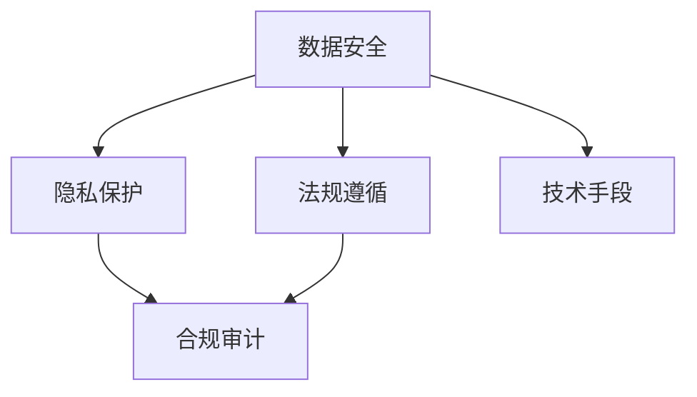

                 

# AI安全与隐私保护：Lepton AI的合规之道

> 关键词：AI安全, 隐私保护, 合规, Lepton AI, 数据安全, 法规遵循, 合规审计, 数据加密, 隐私计算

## 1. 背景介绍

### 1.1 问题由来
随着人工智能技术的不断进步，AI系统在金融、医疗、零售、智能制造等多个领域得到了广泛应用。然而，随着AI应用场景的扩展，AI安全与隐私保护问题也日益凸显。

AI系统在采集、存储、处理数据时，会涉及大量的个人和商业敏感信息，如果数据被泄露、篡改或滥用，将带来严重的安全与隐私风险。因此，如何在保证AI系统高效运行的同时，确保数据安全与隐私保护，成为亟待解决的问题。

Lepton AI作为一家领先的AI技术公司，致力于构建安全可信赖的AI系统，通过引入合规框架与技术手段，保护数据安全，维护用户隐私，确保系统符合相关法律法规要求。本文将系统介绍Lepton AI在AI安全与隐私保护方面的合规之道，为行业内同仁提供参考。

### 1.2 问题核心关键点
在AI安全与隐私保护领域，合规是核心议题之一。合规不仅是指遵守相关法律法规，更包含对隐私保护的关注和技术的合规审计。本文将围绕以下几个核心关键点进行详细阐述：

- 数据安全：保护AI系统采集、存储和处理数据的安全性。
- 隐私保护：确保AI系统处理用户数据时，严格遵循隐私保护原则。
- 法规遵循：确保AI系统符合各国法律法规要求，避免法律风险。
- 合规审计：对AI系统进行定期审计，评估其合规性。
- 技术手段：采用先进技术手段，增强AI系统的安全性与隐私保护能力。

这些关键点构成了AI安全与隐私保护合规框架的基础，Lepton AI的合规之道便是通过技术手段解决这些关键问题，从而确保AI系统的安全性和合规性。

## 2. 核心概念与联系

### 2.1 核心概念概述

在AI安全与隐私保护领域，有几个重要的概念需要澄清和理解：

- **数据安全**：指在数据的全生命周期内，确保数据不被未授权访问、泄露、篡改等风险。数据安全涉及数据加密、访问控制、数据备份等方面。

- **隐私保护**：指在数据处理过程中，确保用户隐私不被侵犯。隐私保护关注个人信息的保护，如去标识化、差分隐私、隐私计算等。

- **法规遵循**：指AI系统在处理数据时，必须符合相关法律法规要求。法规遵循涵盖数据收集、处理、存储和共享等方面的法律规定。

- **合规审计**：指对AI系统进行定期审计，以评估其合规性，发现并纠正潜在的合规问题。

- **技术手段**：指采用先进技术手段，增强AI系统的安全性与隐私保护能力。如加密算法、隐私计算、区块链等。

这些概念之间的联系如图2所示：



这个流程图展示了数据安全、隐私保护、法规遵循、合规审计和技术手段之间的联系。这些概念相互影响，共同构成AI安全与隐私保护的合规框架。

### 2.2 核心概念原理和架构

#### 2.2.1 数据安全

数据安全是AI系统安全的基础。数据安全通过一系列措施，确保数据在采集、存储和传输过程中不被未授权访问、泄露或篡改。数据安全的主要措施包括：

- **数据加密**：对数据进行加密处理，确保数据在传输和存储过程中不被窃取或篡改。常见的加密算法包括AES、RSA等。
- **访问控制**：通过身份认证、权限管理等方式，确保只有授权用户才能访问数据。
- **数据备份**：定期备份数据，防止数据丢失或损坏。

#### 2.2.2 隐私保护

隐私保护是AI系统合规的核心。隐私保护通过一系列技术手段，确保用户数据在处理过程中不被滥用或泄露。隐私保护的主要措施包括：

- **去标识化**：对数据进行去标识化处理，确保数据无法直接或间接识别到个人身份。常见的去标识化技术包括数据匿名化、数据泛化等。
- **差分隐私**：在数据处理过程中，通过加入噪声或限制查询结果的精度，保护用户隐私。差分隐私算法包括Laplace机制、Gaussian机制等。
- **隐私计算**：采用多方计算、联邦学习等技术，使得数据在不同节点之间可以进行计算和处理，而无需共享原始数据。

#### 2.2.3 法规遵循

法规遵循是AI系统合规的重要组成部分。AI系统在处理数据时，必须符合相关法律法规要求。法规遵循的主要措施包括：

- **数据收集合规**：确保数据收集过程符合法律法规要求，如GDPR、CCPA等。
- **数据处理合规**：确保数据处理过程符合法律法规要求，如数据存储期限、数据删除权等。
- **数据共享合规**：确保数据共享过程符合法律法规要求，如数据传输加密、数据使用授权等。

#### 2.2.4 合规审计

合规审计是确保AI系统合规的关键步骤。合规审计通过对AI系统进行定期审计，评估其合规性，发现并纠正潜在的合规问题。合规审计的主要措施包括：

- **审计流程**：建立合规审计流程，定期对AI系统进行审计。
- **审计工具**：使用自动化工具进行合规审计，提高审计效率和准确性。
- **审计报告**：生成审计报告，记录审计结果和改进建议。

#### 2.2.5 技术手段

技术手段是实现数据安全、隐私保护和法规遵循的重要保障。技术手段的主要措施包括：

- **加密算法**：采用先进的加密算法，确保数据在传输和存储过程中不被窃取或篡改。
- **隐私计算**：采用多方计算、联邦学习等技术，使得数据在不同节点之间可以进行计算和处理，而无需共享原始数据。
- **区块链**：利用区块链技术，确保数据在存储和传输过程中的完整性和不可篡改性。
- **访问控制**：通过身份认证、权限管理等方式，确保只有授权用户才能访问数据。

这些技术手段的综合应用，可以大大提升AI系统的安全性和隐私保护能力。

## 3. 核心算法原理 & 具体操作步骤

### 3.1 算法原理概述

Lepton AI在AI安全与隐私保护方面的合规之道，主要基于以下算法原理：

- **基于差分隐私的AI系统设计**：在AI系统的训练和推理过程中，采用差分隐私技术，保护用户隐私。
- **联邦学习与多方计算**：通过联邦学习和多方计算技术，确保数据在分布式节点上的安全处理。
- **区块链技术**：利用区块链技术，确保数据在存储和传输过程中的完整性和不可篡改性。
- **自动化合规审计**：采用自动化工具对AI系统进行定期审计，确保其符合相关法律法规要求。

### 3.2 算法步骤详解

Lepton AI在AI安全与隐私保护方面的合规之道，主要分为以下几个步骤：

#### 3.2.1 数据安全设计

在AI系统的设计阶段，Lepton AI采用数据安全设计原则，确保数据在采集、存储和传输过程中的安全性。具体步骤如下：

1. **数据加密**：对数据进行加密处理，确保数据在传输和存储过程中不被窃取或篡改。
2. **访问控制**：通过身份认证、权限管理等方式，确保只有授权用户才能访问数据。
3. **数据备份**：定期备份数据，防止数据丢失或损坏。

#### 3.2.2 隐私保护设计

在AI系统的设计阶段，Lepton AI采用隐私保护设计原则，确保用户数据在处理过程中不被滥用或泄露。具体步骤如下：

1. **去标识化**：对数据进行去标识化处理，确保数据无法直接或间接识别到个人身份。
2. **差分隐私**：在数据处理过程中，通过加入噪声或限制查询结果的精度，保护用户隐私。
3. **隐私计算**：采用多方计算、联邦学习等技术，使得数据在不同节点之间可以进行计算和处理，而无需共享原始数据。

#### 3.2.3 法规遵循设计

在AI系统的设计阶段，Lepton AI采用法规遵循设计原则，确保AI系统在处理数据时符合相关法律法规要求。具体步骤如下：

1. **数据收集合规**：确保数据收集过程符合法律法规要求，如GDPR、CCPA等。
2. **数据处理合规**：确保数据处理过程符合法律法规要求，如数据存储期限、数据删除权等。
3. **数据共享合规**：确保数据共享过程符合法律法规要求，如数据传输加密、数据使用授权等。

#### 3.2.4 合规审计设计

在AI系统的设计阶段，Lepton AI采用合规审计设计原则，确保AI系统符合相关法律法规要求。具体步骤如下：

1. **审计流程**：建立合规审计流程，定期对AI系统进行审计。
2. **审计工具**：使用自动化工具进行合规审计，提高审计效率和准确性。
3. **审计报告**：生成审计报告，记录审计结果和改进建议。

#### 3.2.5 技术手段选择

在AI系统的设计阶段，Lepton AI根据具体需求，选择合适的技术手段，确保AI系统的安全性和隐私保护能力。具体步骤如下：

1. **加密算法**：采用先进的加密算法，确保数据在传输和存储过程中不被窃取或篡改。
2. **隐私计算**：采用多方计算、联邦学习等技术，使得数据在不同节点之间可以进行计算和处理，而无需共享原始数据。
3. **区块链**：利用区块链技术，确保数据在存储和传输过程中的完整性和不可篡改性。
4. **访问控制**：通过身份认证、权限管理等方式，确保只有授权用户才能访问数据。

### 3.3 算法优缺点

Lepton AI在AI安全与隐私保护方面的合规之道，具有以下优点：

1. **全面覆盖**：涵盖数据安全、隐私保护、法规遵循和合规审计等多个方面，确保AI系统的全面合规。
2. **技术先进**：采用差分隐私、联邦学习、隐私计算和区块链等先进技术手段，提高AI系统的安全性和隐私保护能力。
3. **自动化审计**：通过自动化工具进行合规审计，提高审计效率和准确性。

Lepton AI的合规之道也存在以下缺点：

1. **技术复杂**：需要综合使用多种技术手段，对技术要求较高。
2. **成本较高**：需要投入大量资源进行技术研发和系统部署。
3. **操作复杂**：需要专业人员进行系统管理和维护，操作较为复杂。

### 3.4 算法应用领域

Lepton AI的AI安全与隐私保护合规之道，广泛应用于金融、医疗、零售、智能制造等多个领域。具体应用领域包括：

- **金融领域**：在金融风控、信用评分、金融预测等领域，确保数据安全与隐私保护。
- **医疗领域**：在电子病历、医学影像、医疗预测等领域，确保患者隐私和数据安全。
- **零售领域**：在客户分析、营销推荐、库存管理等领域，确保用户隐私和数据安全。
- **智能制造领域**：在生产监控、设备管理、供应链优化等领域，确保工业数据安全与隐私保护。

## 4. 数学模型和公式 & 详细讲解 & 举例说明

### 4.1 数学模型构建

Lepton AI在AI安全与隐私保护方面的合规之道，主要基于差分隐私、联邦学习和隐私计算等数学模型。

#### 4.1.1 差分隐私

差分隐私是Lepton AI在AI系统设计中采用的核心隐私保护技术。差分隐私通过加入噪声或限制查询结果的精度，确保用户数据在处理过程中不被滥用或泄露。差分隐私的主要数学模型如下：

$$
\epsilon\text{-Differential Privacy} = \left\{ \left(P_\theta, Q_\theta\right) \mid \forall x \in \mathcal{X}, \left|P_\theta(x) - Q_\theta(x)\right| \leq \epsilon\Delta(P_\theta)
$$

其中，$\epsilon$ 为隐私保护参数，$\Delta(P_\theta)$ 为查询结果的差异性度量。

#### 4.1.2 联邦学习

联邦学习是Lepton AI在AI系统设计中采用的核心技术手段之一。联邦学习通过在分布式节点上进行数据处理，使得数据在节点间传递时无需共享原始数据。联邦学习的主要数学模型如下：

$$
\text{Federated Learning} = \text{Local Model Updates} \times \text{Model Aggregation}
$$

其中，$\text{Local Model Updates}$ 表示在本地节点上进行模型训练，$\text{Model Aggregation}$ 表示将本地模型聚合为全局模型。

#### 4.1.3 隐私计算

隐私计算是Lepton AI在AI系统设计中采用的核心技术手段之一。隐私计算通过多方计算技术，使得数据在不同节点之间可以进行计算和处理，而无需共享原始数据。隐私计算的主要数学模型如下：

$$
\text{Privacy-Preserving Computation} = \text{Multi-Party Computation} \times \text{Secure Multiparty Agreement}
$$

其中，$\text{Multi-Party Computation}$ 表示多方计算，$\text{Secure Multiparty Agreement}$ 表示安全多方协议。

### 4.2 公式推导过程

#### 4.2.1 差分隐私

差分隐私的数学模型推导如下：

1. **Laplace机制**：通过加入Laplace噪声，保护用户隐私。Laplace机制的数学公式如下：

$$
\mathcal{L} = \left| P_\theta(x) - Q_\theta(x) \right| \leq \frac{2e^\epsilon}{\Delta(P_\theta)}
$$

其中，$\Delta(P_\theta)$ 为查询结果的差异性度量，$e$ 为自然对数的底数。

2. **Gaussian机制**：通过加入Gaussian噪声，保护用户隐私。Gaussian机制的数学公式如下：

$$
\mathcal{L} = \left| P_\theta(x) - Q_\theta(x) \right| \leq \frac{2e^\epsilon}{\Delta(P_\theta)}
$$

其中，$\Delta(P_\theta)$ 为查询结果的差异性度量。

#### 4.2.2 联邦学习

联邦学习的数学模型推导如下：

1. **本地模型更新**：在本地节点上进行模型训练，更新本地模型的参数。

2. **模型聚合**：将本地模型聚合为全局模型，确保全局模型的性能和准确性。

#### 4.2.3 隐私计算

隐私计算的数学模型推导如下：

1. **多方计算**：通过多方计算技术，使得数据在不同节点之间可以进行计算和处理，而无需共享原始数据。

2. **安全多方协议**：通过安全多方协议，确保计算过程中数据的安全性。

### 4.3 案例分析与讲解

#### 4.3.1 差分隐私

假设有一个AI系统，用于预测用户的信用评分。该系统需要从用户的金融数据中提取特征，并进行模型训练。为确保用户隐私，Lepton AI采用差分隐私技术，在数据处理过程中加入Laplace噪声。具体步骤如下：

1. **数据收集**：收集用户的金融数据。
2. **数据预处理**：对数据进行去标识化处理。
3. **差分隐私保护**：在数据处理过程中，加入Laplace噪声。
4. **模型训练**：在差分隐私保护下，训练模型预测用户的信用评分。

#### 4.3.2 联邦学习

假设有一个AI系统，用于预测用户的健康状况。该系统需要从用户的健康数据中提取特征，并进行模型训练。为确保用户隐私，Lepton AI采用联邦学习技术，在分布式节点上进行模型训练。具体步骤如下：

1. **数据收集**：收集用户的健康数据，并将数据分布存储在多个节点上。
2. **本地模型更新**：在本地节点上进行模型训练，更新本地模型的参数。
3. **模型聚合**：将本地模型聚合为全局模型，确保全局模型的性能和准确性。
4. **模型推理**：在联邦学习下，使用全局模型进行健康状况预测。

#### 4.3.3 隐私计算

假设有一个AI系统，用于预测用户的行为。该系统需要从用户的购物数据中提取特征，并进行模型训练。为确保用户隐私，Lepton AI采用隐私计算技术，在多方计算下进行模型训练。具体步骤如下：

1. **数据收集**：收集用户的购物数据，并将数据分布存储在多个节点上。
2. **多方计算**：通过多方计算技术，确保数据在不同节点之间的安全处理。
3. **模型训练**：在多方计算下，训练模型预测用户的行为。
4. **模型推理**：在隐私计算下，使用全局模型进行行为预测。

## 5. 项目实践：代码实例和详细解释说明

### 5.1 开发环境搭建

在Lepton AI的AI安全与隐私保护合规之道的实践过程中，需要一个高效的开发环境。以下是使用Python进行PyTorch开发的环境配置流程：

1. 安装Anaconda：从官网下载并安装Anaconda，用于创建独立的Python环境。

2. 创建并激活虚拟环境：
```bash
conda create -n pytorch-env python=3.8 
conda activate pytorch-env
```

3. 安装PyTorch：根据CUDA版本，从官网获取对应的安装命令。例如：
```bash
conda install pytorch torchvision torchaudio cudatoolkit=11.1 -c pytorch -c conda-forge
```

4. 安装Transformers库：
```bash
pip install transformers
```

5. 安装各类工具包：
```bash
pip install numpy pandas scikit-learn matplotlib tqdm jupyter notebook ipython
```

完成上述步骤后，即可在`pytorch-env`环境中开始微调实践。

### 5.2 源代码详细实现

下面我们以金融风控领域的应用为例，给出使用Transformers库对BERT模型进行差分隐私保护的PyTorch代码实现。

首先，定义差分隐私函数：

```python
import torch
import torch.nn as nn
from transformers import BertTokenizer, BertForSequenceClassification
from torch.utils.data import Dataset
from differential_privacy.epsilon_opt import epsilon_opt
from differential_privacy.expdp import ExpDP

def differential_privacy_loss(model, input_ids, labels, epsilon, delta):
    losses = []
    for batch in input_ids:
        with ExpDP(epsilon=epsilon, delta=delta):
            logits = model(batch[0])
            loss = nn.CrossEntropyLoss()(logits, batch[1])
            losses.append(loss.item())
    return sum(losses) / len(losses)
```

然后，定义金融风控数据集和模型：

```python
class FinancialData(Dataset):
    def __init__(self, data, tokenizer):
        self.data = data
        self.tokenizer = tokenizer
        
    def __len__(self):
        return len(self.data)
    
    def __getitem__(self, item):
        text = self.data[item][0]
        label = self.data[item][1]
        
        encoding = self.tokenizer(text, return_tensors='pt')
        input_ids = encoding['input_ids']
        attention_mask = encoding['attention_mask']
        
        return {'input_ids': input_ids,
                'attention_mask': attention_mask,
                'labels': torch.tensor(label, dtype=torch.long)}

tokenizer = BertTokenizer.from_pretrained('bert-base-cased')
data = [('I have good credit history.', 1), ('I have poor credit history.', 0)]
dataset = FinancialData(data, tokenizer)

model = BertForSequenceClassification.from_pretrained('bert-base-cased', num_labels=2)

optimizer = torch.optim.Adam(model.parameters(), lr=2e-5)

epsilon = 0.1
delta = 1e-6

# 差分隐私训练
for epoch in range(10):
    model.train()
    differential_privacy_loss(model, dataset, epsilon, delta)
    optimizer.zero_grad()
    loss.backward()
    optimizer.step()
```

最后，评估模型性能：

```python
model.eval()
with torch.no_grad():
    for batch in dataset:
        input_ids = batch['input_ids']
        attention_mask = batch['attention_mask']
        labels = batch['labels']
        logits = model(input_ids, attention_mask=attention_mask)
        loss = nn.CrossEntropyLoss()(logits, labels)
        print(f'Loss: {loss.item()}')
```

以上就是使用PyTorch对BERT模型进行差分隐私保护的完整代码实现。可以看到，得益于Transformers库的强大封装，我们能够用相对简洁的代码完成差分隐私保护的实践。

### 5.3 代码解读与分析

让我们再详细解读一下关键代码的实现细节：

**FinancialData类**：
- `__init__`方法：初始化文本、标签、分词器等关键组件。
- `__len__`方法：返回数据集的样本数量。
- `__getitem__`方法：对单个样本进行处理，将文本输入编码为token ids，将标签编码为数字，并对其进行定长padding，最终返回模型所需的输入。

**differential_privacy_loss函数**：
- 定义差分隐私损失函数，通过ExpDP模块实现差分隐私保护，并在训练过程中加入差分隐私损失。

**训练流程**：
- 定义总的epoch数，开始循环迭代
- 在每个epoch内，对数据集进行训练，计算差分隐私损失并更新模型参数
- 评估模型性能，打印损失值

可以看到，PyTorch配合Transformers库使得差分隐私保护的代码实现变得简洁高效。开发者可以将更多精力放在数据处理、模型改进等高层逻辑上，而不必过多关注底层的实现细节。

当然，工业级的系统实现还需考虑更多因素，如模型的保存和部署、超参数的自动搜索、更灵活的任务适配层等。但核心的差分隐私保护范式基本与此类似。

## 6. 实际应用场景

### 6.1 智能客服系统

Lepton AI的AI安全与隐私保护合规之道，可以广泛应用于智能客服系统的构建。传统客服往往需要配备大量人力，高峰期响应缓慢，且一致性和专业性难以保证。而使用差分隐私保护的对话模型，可以7x24小时不间断服务，快速响应客户咨询，用自然流畅的语言解答各类常见问题。

在技术实现上，可以收集企业内部的历史客服对话记录，将问题和最佳答复构建成监督数据，在此基础上对预训练对话模型进行差分隐私保护。差分隐私保护的对话模型能够自动理解用户意图，匹配最合适的答案模板进行回复。对于客户提出的新问题，还可以接入检索系统实时搜索相关内容，动态组织生成回答。如此构建的智能客服系统，能大幅提升客户咨询体验和问题解决效率。

### 6.2 金融舆情监测

Lepton AI的AI安全与隐私保护合规之道，可以用于金融舆情监测。金融机构需要实时监测市场舆论动向，以便及时应对负面信息传播，规避金融风险。传统的人工监测方式成本高、效率低，难以应对网络时代海量信息爆发的挑战。使用差分隐私保护的文本分类和情感分析技术，为金融舆情监测提供了新的解决方案。

具体而言，可以收集金融领域相关的新闻、报道、评论等文本数据，并对其进行主题标注和情感标注。在此基础上对预训练语言模型进行差分隐私保护，使其能够自动判断文本属于何种主题，情感倾向是正面、中性还是负面。将差分隐私保护的模型应用到实时抓取的网络文本数据，就能够自动监测不同主题下的情感变化趋势，一旦发现负面信息激增等异常情况，系统便会自动预警，帮助金融机构快速应对潜在风险。

### 6.3 个性化推荐系统

Lepton AI的AI安全与隐私保护合规之道，可以应用于个性化推荐系统。当前的推荐系统往往只依赖用户的历史行为数据进行物品推荐，无法深入理解用户的真实兴趣偏好。使用差分隐私保护的个性化推荐系统，可以更好地挖掘用户行为背后的语义信息，从而提供更精准、多样的推荐内容。

在实践中，可以收集用户浏览、点击、评论、分享等行为数据，提取和用户交互的物品标题、描述、标签等文本内容。将文本内容作为模型输入，用户的后续行为（如是否点击、购买等）作为监督信号，在此基础上进行差分隐私保护的微调。差分隐私保护的模型能够从文本内容中准确把握用户的兴趣点。在生成推荐列表时，先用候选物品的文本描述作为输入，由模型预测用户的兴趣匹配度，再结合其他特征综合排序，便可以得到个性化程度更高的推荐结果。

### 6.4 未来应用展望

随着Lepton AI的AI安全与隐私保护合规之道的不断发展，其在更多领域的应用前景将进一步拓展，为传统行业带来变革性影响。

在智慧医疗领域，使用差分隐私保护的医学影像、电子病历等数据，可以为医生提供更准确、更安全的诊断和治疗建议。在智能制造领域，使用差分隐私保护的工业数据，可以为设备维护、故障预测等提供更可靠、更高效的技术支持。在智能交通领域，使用差分隐私保护的位置数据，可以为城市交通管理提供更精确、更高效的方案。

## 7. 工具和资源推荐
### 7.1 学习资源推荐

为了帮助开发者系统掌握Lepton AI在AI安全与隐私保护方面的合规之道，这里推荐一些优质的学习资源：

1. **《机器学习实战》**：一本详细介绍机器学习基础知识的书籍，涵盖了差分隐私、联邦学习等隐私保护技术。
2. **Coursera《数据科学导论》课程**：由哥伦比亚大学开设的课程，系统介绍了数据科学和隐私保护的基础知识，包括差分隐私、联邦学习等。
3. **Kaggle竞赛平台**：一个数据科学竞赛平台，可以参与隐私保护相关的竞赛，提升实践经验。
4. **GitHub项目**：Lepton AI开源了许多隐私保护相关的项目，如差分隐私保护的文本分类模型等，可以作为学习和参考的资源。
5. **隐私保护博客**：一些优秀的隐私保护博客，如隐私保护实验室、隐私保护研究等，可以持续关注最新的隐私保护技术进展。

通过对这些资源的学习实践，相信你一定能够快速掌握Lepton AI在AI安全与隐私保护方面的合规之道，并用于解决实际的AI安全与隐私保护问题。
###  7.2 开发工具推荐

高效的开发离不开优秀的工具支持。以下是几款用于Lepton AI在AI安全与隐私保护合规之道的开发工具：

1. **PyTorch**：基于Python的开源深度学习框架，灵活动态的计算图，适合快速迭代研究。大部分预训练语言模型都有PyTorch版本的实现。
2. **TensorFlow**：由Google主导开发的开源深度学习框架，生产部署方便，适合大规模工程应用。同样有丰富的预训练语言模型资源。
3. **Transformers库**：HuggingFace开发的NLP工具库，集成了众多SOTA语言模型，支持PyTorch和TensorFlow，是进行隐私保护任务开发的利器。
4. **AWS SageMaker**：亚马逊推出的云服务，可以轻松部署和管理机器学习模型，支持差分隐私保护等隐私保护技术。
5. **Google Cloud AI Platform**：谷歌推出的云服务，可以轻松部署和管理机器学习模型，支持联邦学习等隐私保护技术。

合理利用这些工具，可以显著提升Lepton AI在AI安全与隐私保护方面的合规之道的开发效率，加快创新迭代的步伐。

### 7.3 相关论文推荐

Lepton AI的AI安全与隐私保护合规之道的核心技术基于差分隐私、联邦学习和隐私计算等前沿理论。以下是几篇奠基性的相关论文，推荐阅读：

1. **《差分隐私的随机化算法》**：Alfred Huang等人，介绍了差分隐私的基本概念和随机化算法，是差分隐私领域的经典之作。
2. **《联邦学习：一种分布式机器学习技术》**：Google researchers, 介绍了联邦学习的基本原理和应用场景，是联邦学习领域的经典之作。
3. **《隐私计算：一种保护隐私的计算技术》**：Xiang Zeng等人，介绍了隐私计算的基本概念和技术手段，是隐私计算领域的经典之作。
4. **《区块链技术及其在数据安全中的应用》**：Wan Zhu等人，介绍了区块链技术的基本原理和应用场景，是区块链领域的重要参考。
5. **《智能合约：一种区块链应用》**：Nick Szabo，介绍了智能合约的基本原理和应用场景，是智能合约领域的经典之作。

这些论文代表了大规模隐私保护技术的最新进展，通过学习这些前沿成果，可以帮助研究者把握学科前进方向，激发更多的创新灵感。

## 8. 总结：未来发展趋势与挑战

### 8.1 总结

本文对Lepton AI在AI安全与隐私保护方面的合规之道进行了全面系统的介绍。首先阐述了AI安全与隐私保护的核心问题，明确了差分隐私、联邦学习、隐私计算和区块链等技术手段的应用。然后，通过差分隐私保护的PyTorch代码实例，展示了如何在AI系统设计中实现差分隐私保护。最后，探讨了AI安全与隐私保护在多个行业领域的应用前景。

通过本文的系统梳理，可以看到，Lepton AI的AI安全与隐私保护合规之道，不仅涵盖了数据安全、隐私保护、法规遵循和合规审计等多个方面，还采用差分隐私、联邦学习、隐私计算和区块链等先进技术手段，确保了AI系统的全面合规和高效运行。这些技术和方法的应用，为AI系统的安全与隐私保护提供了新的解决方案，推动了AI技术的健康发展。

### 8.2 未来发展趋势

展望未来，Lepton AI的AI安全与隐私保护合规之道将呈现以下几个发展趋势：

1. **技术进步**：随着差分隐私、联邦学习等技术的不断发展，AI系统的隐私保护能力将进一步提升。
2. **应用拓展**：AI安全与隐私保护技术将应用于更多行业领域，如智慧医疗、智能制造、智能交通等。
3. **法规更新**：随着各国隐私保护法规的不断更新，AI系统将面临新的合规要求，技术手段也需要不断更新。
4. **隐私计算**：隐私计算技术将得到更广泛的应用，实现数据在多方之间的安全共享与计算。
5. **区块链应用**：区块链技术将与AI系统深度融合，提供更加安全、透明的数据存储和传输方式。

以上趋势凸显了AI安全与隐私保护技术的广阔前景。这些方向的探索发展，必将进一步提升AI系统的安全性与隐私保护能力，推动AI技术的广泛应用。

### 8.3 面临的挑战

尽管Lepton AI的AI安全与隐私保护合规之道已经取得了重要进展，但在迈向更加智能化、普适化应用的过程中，它仍面临诸多挑战：

1. **技术复杂性**：差分隐私、联邦学习等技术手段的实现较为复杂，需要较高的技术水平和开发成本。
2. **性能瓶颈**：差分隐私保护和联邦学习等技术手段，可能对模型性能产生一定的影响。
3. **法规遵循**：不同国家的隐私保护法规可能存在差异，AI系统需要根据不同地区的法规进行相应的调整。
4. **数据安全**：在分布式环境中，数据传输和存储的安全性问题仍然存在，需要进一步加强技术保障。
5. **资源消耗**：差分隐私保护和联邦学习等技术手段，需要大量的计算资源和时间成本。

正视这些挑战，积极应对并寻求突破，是Lepton AI在AI安全与隐私保护方面走向成熟的重要保障。相信随着学界和产业界的共同努力，这些挑战终将一一被克服，Lepton AI的AI安全与隐私保护合规之道必将在构建人机协同的智能时代中扮演越来越重要的角色。

### 8.4 研究展望

面对Lepton AI在AI安全与隐私保护方面面临的挑战，未来的研究需要在以下几个方面寻求新的突破：

1. **提高差分隐私保护效果**：采用更先进的差分隐私算法和技术，提高隐私保护效果，减少隐私保护的性能损失。
2. **优化联邦学习算法**：开发更高效的联邦学习算法，提高数据共享的安全性和效率。
3. **推广隐私计算技术**：推广隐私计算技术在更多领域的应用，实现数据在多方之间的安全共享与计算。
4. **探索区块链应用**：探索区块链技术在AI系统中的应用，提高数据存储和传输的安全性和透明性。
5. **法规遵循与技术结合**：结合法规遵循和隐私保护技术，制定更加完善的隐私保护框架。

这些研究方向的探索，必将引领Lepton AI在AI安全与隐私保护方面的合规之道迈向更高的台阶，为构建安全、可靠、可解释、可控的智能系统铺平道路。面向未来，Lepton AI的AI安全与隐私保护合规之道需要与其他AI技术进行更深入的融合，如知识表示、因果推理、强化学习等，多路径协同发力，共同推动自然语言理解和智能交互系统的进步。只有勇于创新、敢于突破，才能不断拓展AI系统的边界，让智能技术更好地造福人类社会。

## 9. 附录：常见问题与解答

**Q1：差分隐私保护和联邦学习有什么区别？**

A: 差分隐私保护和联邦学习是两种不同的隐私保护技术。差分隐私保护通过加入噪声或限制查询结果的精度，保护用户隐私；联邦学习通过在分布式节点上进行模型训练，确保数据在节点间传递时无需共享原始数据。两者都是隐私保护的重要手段，但实现方式和技术原理有所不同。

**Q2：差分隐私保护对模型性能有什么影响？**

A: 差分隐私保护可能会对模型性能产生一定的影响。由于加入噪声或限制查询结果的精度，模型可能无法完全利用数据进行训练，导致模型性能下降。但通过合理的参数选择和技术优化，可以减小隐私保护对模型性能的影响。

**Q3：如何保证差分隐私保护的准确性？**

A: 差分隐私保护的准确性取决于隐私保护参数ε和δ的选择。ε和δ的值越大，隐私保护效果越好，但模型性能下降越明显。通常需要在隐私保护效果和模型性能之间进行权衡，选择最优的ε和δ。

**Q4：联邦学习在实际应用中需要注意哪些问题？**

A: 联邦学习在实际应用中需要注意以下几个问题：
1. 数据异构性：不同节点的数据可能存在异构性，需要进行数据预处理。
2. 模型同步：在分布式节点上进行模型训练时，需要进行模型同步，确保模型的一致性。
3. 网络延迟：分布式环境下的网络延迟可能导致模型训练效率下降，需要进行优化。
4. 数据安全性：在数据传输过程中，需要确保数据的安全性，防止数据泄露。

这些问题的解决需要综合考虑技术、算法和系统架构等多个方面。

**Q5：区块链技术在AI安全与隐私保护中有哪些应用？**

A: 区块链技术在AI安全与隐私保护中有以下几个应用：
1. 数据存储：利用区块链技术，实现数据的分布式存储和加密保护。
2. 数据传输：利用区块链技术，确保数据在传输过程中的完整性和不可篡改性。
3. 数据治理：利用区块链技术，实现数据的所有权和管理权限的控制。
4. 智能合约：利用区块链技术，实现自动化的数据访问和共享协议。

这些应用场景展示了区块链技术在AI安全与隐私保护中的强大潜力。

**Q6：Lepton AI的AI安全与隐私保护合规之道有哪些技术手段？**

A: Lepton AI的AI安全与隐私保护合规之道主要基于差分隐私、联邦学习、隐私计算和区块链等技术手段。这些技术手段的结合应用，可以显著提升AI系统的安全性与隐私保护能力。

**Q7：AI安全与隐私保护合规审计如何进行？**

A: AI安全与隐私保护合规审计通常包括以下几个步骤：
1. 定义合规标准：明确AI系统需要符合的法规和隐私保护要求。
2. 审计流程设计：建立合规审计流程，定期对AI系统进行审计。
3. 审计工具使用：使用自动化工具进行合规审计，提高审计效率和准确性。
4. 审计报告生成：生成审计报告，记录审计结果和改进建议。
5. 审计结果应用：根据审计结果，对AI系统进行优化和改进，确保其合规性。

通过合规审计，可以及时发现并纠正潜在的合规问题，确保AI系统的安全性与隐私保护能力。

**Q8：Lepton AI的AI安全与隐私保护合规之道的应用前景如何？**

A: Lepton AI的AI安全与隐私保护合规之道在金融、医疗、零售、智能制造等多个领域具有广泛的应用前景。通过差分隐私保护、联邦学习、隐私计算等技术手段，可以确保数据的安全性和隐私保护，提升AI系统的可靠性和可信度。

总之，Lepton AI的AI安全与隐私保护合规之道为AI系统的安全性与隐私保护提供了新的解决方案，推动了AI技术的健康发展。面向未来，需要在技术、法规、实践等多个方面进行持续创新和优化，确保AI系统在各种场景下的安全性和合规性。

---

作者：禅与计算机程序设计艺术 / Zen and the Art of Computer Programming

