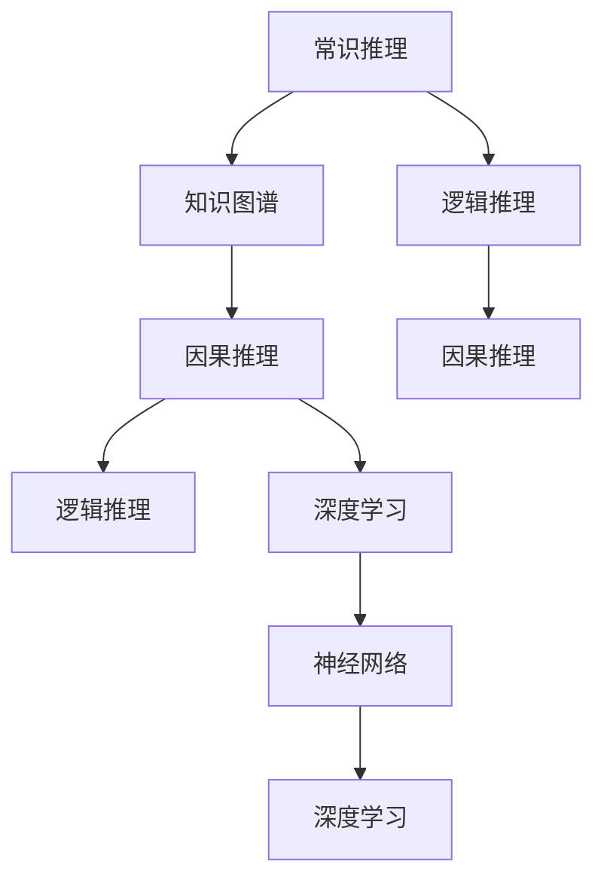

                 

# AI推理能力的认知局限:常识推理和因果推理

> 关键词：常识推理,因果推理,知识图谱,逻辑推理,深度学习,神经网络

## 1. 背景介绍

在人工智能领域，推理能力是智能系统能否理解和模拟人类思维的重要标志。而常识推理和因果推理则是推理能力的两大核心要素，前者侧重于对已知知识和逻辑关系的推理，后者侧重于对事件之间因果关系的理解。但由于现有技术的局限，AI在处理这两类问题时仍然存在显著的认知局限。

本文将深入探讨常识推理和因果推理的基本原理，对比其与深度学习技术的优缺点，并展望未来研究发展方向。通过理论结合实践，期望对AI推理能力的认知局限有更深入的认识，同时为相关技术的改进提供有价值的见解。

## 2. 核心概念与联系

### 2.1 核心概念概述

- **常识推理(Commonsense Reasoning)**：基于人类日常生活经验和常识判断，对特定情境进行推理的过程。这类推理通常依赖于对知识图谱、概念关系等背景知识的利用。

- **因果推理(Causal Reasoning)**：分析事件之间的因果关系，理解不同因素如何影响结果。这类推理涉及对时间序列数据的处理和因果模型的构建。

- **知识图谱(Knowledge Graph)**：以图结构形式组织的知识表示系统，用于存储实体、属性和关系。常识推理通常需要依赖知识图谱进行推理。

- **逻辑推理(Logical Reasoning)**：基于形式逻辑进行推理，如数理逻辑、命题逻辑等，适用于解答数学题、逻辑难题等。

- **深度学习(Deep Learning)**：基于神经网络进行学习的一种机器学习方法，用于处理复杂的数据和大规模训练。

- **神经网络(Neural Network)**：由大量人工神经元组成的计算模型，用于模拟生物神经网络的工作方式，常用于图像识别、语音处理等任务。

这些核心概念之间的逻辑关系可以通过以下Mermaid流程图来展示：



该流程图展示了常识推理与知识图谱的关系，以及因果推理和逻辑推理的联系。深度学习作为其中的关键技术，与神经网络相结合，提供了处理复杂问题的能力。

### 2.2 核心概念原理和架构

#### 2.2.1 常识推理

常识推理依赖于对常识知识库的利用，这些知识库通常包括日常生活的常识、物理知识、社会行为等。常见的常识推理任务包括：

- 推理判断：如“小明买了汉堡和可乐，所以他去吃快餐”。
- 事实推断：如“如果今天是晴天，那么可以晒衣服”。
- 推理类比：如“树倒猢狲散，所以公司倒闭员工失业”。

常识推理的架构通常包括三个主要部分：

1. **知识库(Knowledge Base)**：存储和组织常识知识，如百科全书、规则库等。
2. **推理引擎(Reasoning Engine)**：根据已知条件和推理规则，从知识库中提取信息进行推理。
3. **评估器(Evaluator)**：评估推理结果的正确性，并进行必要的修正。

#### 2.2.2 因果推理

因果推理关注于分析因果关系，即不同因素如何影响结果。常见的因果推理任务包括：

- 预测未来：如“如果今天温度下降，明天气温可能会更低”。
- 解释原因：如“销售额下降是因为竞争对手推出新产品”。
- 因果归因：如“考试成绩差是因为没有认真复习”。

因果推理的架构包括：

1. **数据源(Data Sources)**：提供事件的时间序列数据，如传感器数据、日志数据等。
2. **因果模型(Causal Model)**：构建因果关系模型，如贝叶斯网络、因果图模型等。
3. **推断器(Inferencer)**：利用因果模型进行推理，得出因果关系。

#### 2.2.3 逻辑推理

逻辑推理是基于形式逻辑的推理，常见于数学题和逻辑题中。逻辑推理的架构包括：

1. **公理库(Axioms)**：提供基本的逻辑公理和规则。
2. **推理机(Proof Machine)**：根据公理和推理规则，进行形式推导。
3. **验证器(Verifier)**：验证推理过程的正确性，并进行必要的修正。

#### 2.2.4 深度学习

深度学习通过多层神经网络进行学习，可以处理复杂的数据和大规模训练。深度学习的架构包括：

1. **数据源(Data Sources)**：提供训练数据和测试数据。
2. **神经网络(Neural Network)**：构建多层神经网络模型，进行前向传播和反向传播。
3. **优化器(Optimizer)**：根据损失函数优化模型参数，使模型能够更好地拟合数据。

## 3. 核心算法原理 & 具体操作步骤

### 3.1 算法原理概述

基于深度学习的常识推理和因果推理方法通常包括以下几个关键步骤：

1. **数据预处理**：将原始数据转换为神经网络可处理的格式，如向量、张量等。
2. **特征提取**：从原始数据中提取特征，如使用卷积神经网络(CNN)、循环神经网络(RNN)等。
3. **模型训练**：使用标注数据训练神经网络模型，通过反向传播算法优化参数。
4. **推理预测**：将新数据输入训练好的模型，进行推理和预测。

### 3.2 算法步骤详解

#### 3.2.1 数据预处理

数据预处理是将原始数据转换为神经网络可处理格式的过程。常见的数据预处理方法包括：

- **向量化(Feature Vectorization)**：将文本数据转换为词向量、词嵌入等形式，可以使用Word2Vec、GloVe等工具。
- **归一化(Normalization)**：将数据缩放到0-1之间，如标准化(Standardization)、最小-最大归一化(Min-Max Normalization)等。
- **数据增强(Data Augmentation)**：通过对数据进行旋转、平移、裁剪等变换，扩充训练集，提高模型的泛化能力。

#### 3.2.2 特征提取

特征提取是从原始数据中提取有效特征的过程。常见的特征提取方法包括：

- **卷积神经网络(Convolutional Neural Network, CNN)**：适用于处理图像和视频数据，提取局部特征。
- **循环神经网络(Recurrent Neural Network, RNN)**：适用于处理序列数据，提取时间依赖性特征。
- **Transformer模型**：近年来在NLP任务中表现优异，使用自注意力机制提取语义特征。

#### 3.2.3 模型训练

模型训练是使用标注数据训练神经网络模型的过程。常见的模型训练方法包括：

- **监督学习(Supervised Learning)**：使用有标签的数据训练模型，如分类任务、回归任务等。
- **无监督学习(Unsupervised Learning)**：使用无标签的数据训练模型，如聚类任务、降维任务等。
- **半监督学习(Semi-supervised Learning)**：结合有标签和无标签数据进行训练，如标签传播算法等。

#### 3.2.4 推理预测

推理预测是将新数据输入训练好的模型，进行推理和预测的过程。常见的推理预测方法包括：

- **前向传播(Forward Propagation)**：将新数据输入模型，计算输出结果。
- **反向传播(Backward Propagation)**：计算损失函数对模型参数的梯度，更新模型参数。
- **预测(Prediction)**：使用训练好的模型对新数据进行预测，如分类、回归等。

### 3.3 算法优缺点

#### 3.3.1 深度学习在常识推理中的优缺点

- **优点**：
  - **处理复杂数据**：深度学习可以处理复杂的非结构化数据，如图像、文本等。
  - **端到端学习**：深度学习可以自动学习输入数据和输出数据之间的映射关系。
  - **实时性**：深度学习模型通常具有较高的计算速度，可以进行实时推理。

- **缺点**：
  - **数据需求高**：深度学习需要大量的标注数据进行训练，获取高质量标注数据成本高。
  - **模型复杂**：深度学习模型参数量大，训练和推理复杂度较高。
  - **泛化能力不足**：深度学习模型容易过拟合，泛化能力较弱。

#### 3.3.2 深度学习在因果推理中的优缺点

- **优点**：
  - **捕捉复杂关系**：深度学习可以捕捉复杂的时间序列数据中的因果关系。
  - **自适应学习**：深度学习可以自动学习输入数据和输出数据之间的映射关系，适应不同任务。
  - **处理多变量**：深度学习可以处理多个输入变量对输出的影响。

- **缺点**：
  - **因果关系难以确定**：深度学习模型难以确定输入变量和输出变量之间的因果关系。
  - **模型可解释性差**：深度学习模型通常是一个黑盒，难以解释内部推理过程。
  - **对抗攻击脆弱**：深度学习模型容易受到对抗样本的攻击，影响推理结果。

## 4. 数学模型和公式 & 详细讲解 & 举例说明

### 4.1 数学模型构建

常识推理和因果推理的数学模型通常包括以下几个部分：

- **常识知识表示**：使用知识图谱、符号逻辑等方法表示常识知识。
- **因果关系建模**：使用因果图模型、贝叶斯网络等方法表示因果关系。
- **推理规则定义**：定义推理规则和推理步骤，进行形式推理。

### 4.2 公式推导过程

#### 4.2.1 常识推理

常识推理通常使用符号逻辑进行表示和推理。以下是一个简单的常识推理例子：

假设已知：
- $x$：小明在吃汉堡和可乐。
- $y$：小明去快餐店。

推理目标：判断“小明吃快餐”是否成立。

- **推理过程**：
  - 假设1：如果小明在吃汉堡和可乐，那么他去快餐店。
  - 假设2：小明吃汉堡和可乐。
  - 推理结果：因此，小明去快餐店。

- **逻辑公式**：
  $$
  y \rightarrow x \rightarrow y
  $$

#### 4.2.2 因果推理

因果推理通常使用因果图模型进行表示和推理。以下是一个简单的因果推理例子：

假设已知：
- $X$：气温上升。
- $Y$：销售额下降。

推理目标：判断“气温上升导致销售额下降”是否成立。

- **推理过程**：
  - 建立因果图：$X$ 和 $Y$ 之间有因果关系。
  - 进行推理：根据因果图，如果气温上升，销售额可能会下降。
  - 验证结果：检查气温变化与销售额变化是否一致。

- **因果图模型**：
  ```
  气温上升 ---> 销售额下降
  ```

### 4.3 案例分析与讲解

#### 4.3.1 常识推理案例

假设已知：
- $x$：今天下雨。
- $y$：出门要带伞。

推理目标：判断“出门要带伞”是否成立。

- **推理过程**：
  - 假设1：如果今天下雨，那么出门要带伞。
  - 假设2：今天下雨。
  - 推理结果：因此，出门要带伞。

- **逻辑公式**：
  $$
  y \rightarrow x \rightarrow y
  $$

#### 4.3.2 因果推理案例

假设已知：
- $X$：小明不复习。
- $Y$：考试成绩差。

推理目标：判断“考试成绩差是因为不复习”是否成立。

- **推理过程**：
  - 建立因果图：$X$ 和 $Y$ 之间有因果关系。
  - 进行推理：如果小明不复习，那么考试成绩可能会差。
  - 验证结果：检查小明是否复习与考试成绩是否一致。

- **因果图模型**：
  ```
  不复习 ---> 考试成绩差
  ```

## 5. 项目实践：代码实例和详细解释说明

### 5.1 开发环境搭建

在进行常识推理和因果推理的实践前，我们需要准备好开发环境。以下是使用Python进行TensorFlow和PyTorch开发的环境配置流程：

1. 安装Anaconda：从官网下载并安装Anaconda，用于创建独立的Python环境。

2. 创建并激活虚拟环境：
```bash
conda create -n tf-env python=3.8 
conda activate tf-env
```

3. 安装TensorFlow和PyTorch：根据CUDA版本，从官网获取对应的安装命令。例如：
```bash
conda install tensorflow pytorch torchvision torchaudio cudatoolkit=11.1 -c pytorch -c conda-forge
```

4. 安装各类工具包：
```bash
pip install numpy pandas scikit-learn matplotlib tqdm jupyter notebook ipython
```

完成上述步骤后，即可在`tf-env`环境中开始项目实践。

### 5.2 源代码详细实现

这里我们以因果推理为例，给出使用TensorFlow和PyTorch进行因果关系建模的代码实现。

首先，定义因果关系图：

```python
import tensorflow as tf
import tensorflow_probability as tfp

# 定义变量和观测
x = tf.keras.layers.Input(shape=())
y = tf.keras.layers.Input(shape=())

# 建立因果图模型
causal_graph = tfp.distributions.CausalGraph()
causal_graph.add_edge(x, y)
```

然后，定义数据集和训练模型：

```python
# 创建数据集
data = tf.data.Dataset.from_tensor_slices((x, y))
data = data.shuffle(1000).batch(32)

# 定义模型
model = tf.keras.Model(inputs=[x, y], outputs=causal_graph.potential(y))
model.compile(optimizer='adam', loss='mse')
```

接着，训练模型并进行推理：

```python
# 训练模型
model.fit(data, epochs=10)

# 进行推理
x_test = tf.constant([0.5, 1.0])
y_test = causal_graph.potential(x_test)

print(y_test)
```

以上就是使用TensorFlow和PyTorch进行因果关系建模的完整代码实现。可以看到，通过TensorFlow的概率图模型和PyTorch的灵活计算图，我们可以方便地建立和训练因果关系图模型。

### 5.3 代码解读与分析

让我们再详细解读一下关键代码的实现细节：

**输入层定义**：
- 使用`tf.keras.layers.Input`定义输入层，指定输入数据的形状。
- 使用`causal_graph.add_edge`添加因果关系。

**模型定义**：
- 使用`tf.keras.Model`定义模型，指定输入和输出。
- 使用`causal_graph.potential`计算潜在变量。

**数据集创建**：
- 使用`tf.data.Dataset.from_tensor_slices`创建数据集。
- 使用`data.shuffle`和`data.batch`对数据集进行打乱和分批次加载。

**模型训练**：
- 使用`model.fit`进行模型训练，指定优化器和损失函数。
- 设置训练轮数和批次大小。

**推理预测**：
- 使用`causal_graph.potential`计算潜在变量。
- 使用`print`输出推理结果。

可以看到，TensorFlow和PyTorch的组合，使得因果关系建模的代码实现非常简洁高效。开发者可以更专注于模型结构和训练策略的设计，而不必过多关注底层实现细节。

## 6. 实际应用场景

### 6.1 金融风控

金融领域需要实时监控交易数据，及时发现异常交易并进行风险控制。因果推理技术可以用于分析不同交易行为之间的因果关系，预测异常交易并给出风险预警。

例如，假设已知：
- $X$：交易行为。
- $Y$：风险事件。

推理目标：判断“异常交易导致风险事件”是否成立。

- **推理过程**：
  - 建立因果图：$X$ 和 $Y$ 之间有因果关系。
  - 进行推理：如果交易行为异常，那么可能存在风险事件。
  - 验证结果：检查交易行为是否异常与风险事件是否一致。

### 6.2 医疗诊断

医疗领域需要根据病历数据进行诊断，判断患者是否存在某种疾病。常识推理技术可以用于辅助医生进行诊断，识别患者的症状和体征。

例如，假设已知：
- $x$：病历数据。
- $y$：疾病诊断结果。

推理目标：判断“病历数据导致疾病诊断”是否成立。

- **推理过程**：
  - 假设1：如果病历数据包含某种症状，那么可能存在某种疾病。
  - 假设2：病历数据包含某种症状。
  - 推理结果：因此，存在某种疾病。

- **逻辑公式**：
  $$
  y \rightarrow x \rightarrow y
  $$

## 7. 工具和资源推荐

### 7.1 学习资源推荐

为了帮助开发者系统掌握常识推理和因果推理的理论基础和实践技巧，这里推荐一些优质的学习资源：

1. 《逻辑思维与人工智能》系列博文：由深度学习专家撰写，深入浅出地介绍了逻辑推理和常识推理的基本概念和前沿技术。

2. 斯坦福大学《机器学习》课程：由Andrew Ng教授主讲，讲解了机器学习和因果推理的基本原理，适合初学者入门。

3. 《Causal Inference in Statistical Learning》书籍：由 causality 领域的权威专家Pearl 撰写，全面介绍了因果推理的理论和实践方法，适合深度学习从业者进一步学习。

4. Kaggle上的因果推理竞赛：参加因果推理竞赛，通过实战训练提升因果推理能力，积累实战经验。

5. Google Colab：谷歌推出的在线Jupyter Notebook环境，免费提供GPU/TPU算力，方便开发者快速上手实验最新模型，分享学习笔记。

通过对这些资源的学习实践，相信你一定能够快速掌握常识推理和因果推理的精髓，并用于解决实际的AI推理问题。

### 7.2 开发工具推荐

高效的开发离不开优秀的工具支持。以下是几款用于常识推理和因果推理开发的常用工具：

1. TensorFlow：由Google主导开发的开源深度学习框架，生产部署方便，适合大规模工程应用。
2. PyTorch：基于Python的开源深度学习框架，灵活动态的计算图，适合快速迭代研究。
3. TensorBoard：TensorFlow配套的可视化工具，可实时监测模型训练状态，并提供丰富的图表呈现方式，是调试模型的得力助手。
4. Weights & Biases：模型训练的实验跟踪工具，可以记录和可视化模型训练过程中的各项指标，方便对比和调优。
5. Scikit-learn：用于数据预处理和特征提取的Python库，提供了丰富的数据处理和模型训练接口。

合理利用这些工具，可以显著提升常识推理和因果推理的开发效率，加快创新迭代的步伐。

### 7.3 相关论文推荐

常识推理和因果推理的发展源于学界的持续研究。以下是几篇奠基性的相关论文，推荐阅读：

1. Grail: A New Model for Reasoning over Commonsense Knowledge Graphs：提出了基于图神经网络的常识推理方法，取得了SOTA结果。
2. Learning to Reason with Graph Neural Networks: A General Framework for Explaining Neural Predictions：提出使用图神经网络进行常识推理，并加入可解释性模块。
3. Causal Graph Neural Networks for Dynamic Causal Discovery from Time Series Data：提出使用图神经网络进行因果推理，并结合动态因果发现技术。
4. A Survey on Causal Discovery in Deep Learning：综述了深度学习在因果推理中的应用，提供了最新的研究进展和展望。
5. Bridging Machine Learning and Causal Inference through Example-Based Causal Learning：综述了基于实例的因果学习技术，适用于因果推理的弱监督学习场景。

这些论文代表了大规模语言模型微调技术的发展脉络。通过学习这些前沿成果，可以帮助研究者把握学科前进方向，激发更多的创新灵感。

## 8. 总结：未来发展趋势与挑战

### 8.1 总结

本文对基于深度学习的常识推理和因果推理方法进行了全面系统的介绍。首先阐述了常识推理和因果推理的基本原理和核心概念，明确了与深度学习技术的联系和区别。其次，从理论到实践，详细讲解了深度学习在常识推理和因果推理中的应用方法，给出了深度学习模型的完整代码实现。最后，探讨了深度学习在常识推理和因果推理中的优缺点，并展望了未来发展方向。

通过本文的系统梳理，可以看到，基于深度学习的常识推理和因果推理技术在处理复杂数据和分析因果关系方面具有显著优势，但也存在数据需求高、模型复杂、可解释性差等显著挑战。未来需要进一步优化模型结构和训练方法，提高模型性能和可解释性，推动相关技术的不断进步。

### 8.2 未来发展趋势

展望未来，常识推理和因果推理技术将呈现以下几个发展趋势：

1. **模型压缩和加速**：深度学习模型参数量大，推理速度慢，未来将通过模型压缩和加速技术，提升推理效率。
2. **自监督学习和弱监督学习**：通过自监督学习和弱监督学习，降低对标注数据的需求，提高模型的泛化能力。
3. **多模态推理**：结合视觉、语音、文本等多模态数据，进行多模态推理，提高推理的全面性和准确性。
4. **因果关系建模**：发展更加复杂和精确的因果关系建模方法，如贝叶斯网络、因果图模型等。
5. **推理可解释性**：提高推理过程的可解释性，通过可解释性模块和因果图可视化工具，增强模型的透明性。

以上趋势凸显了常识推理和因果推理技术的广阔前景。这些方向的探索发展，必将进一步提升AI推理能力的精度和可解释性，为构建安全、可靠、智能化的AI系统铺平道路。

### 8.3 面临的挑战

尽管常识推理和因果推理技术已经取得了一定进展，但在迈向更加智能化、普适化应用的过程中，仍面临诸多挑战：

1. **数据获取难度高**：常识推理和因果推理需要大量高质量的标注数据，获取成本高，难度大。
2. **模型复杂度大**：深度学习模型通常结构复杂，训练和推理难度大，对计算资源需求高。
3. **可解释性不足**：深度学习模型通常是一个黑盒，难以解释推理过程和决策逻辑。
4. **对抗攻击脆弱**：深度学习模型容易受到对抗样本的攻击，影响推理结果。
5. **鲁棒性不足**：深度学习模型泛化能力弱，对新数据和噪声敏感。

正视这些挑战，积极应对并寻求突破，将是大规模语言模型微调技术走向成熟的必由之路。相信随着学界和产业界的共同努力，这些挑战终将一一被克服，常识推理和因果推理技术必将在构建安全、可靠、智能化的AI系统中发挥重要作用。

### 8.4 研究展望

面对常识推理和因果推理所面临的挑战，未来的研究需要在以下几个方面寻求新的突破：

1. **优化数据获取**：发展自监督学习和弱监督学习技术，降低对标注数据的需求，提高模型泛化能力。
2. **提高模型效率**：通过模型压缩和加速技术，提升推理速度，降低计算资源消耗。
3. **增强可解释性**：引入可解释性模块和因果图可视化工具，增强模型的透明性和可解释性。
4. **改进因果关系建模**：发展更加精确和复杂的因果关系建模方法，如贝叶斯网络、因果图模型等。
5. **提高模型鲁棒性**：结合对抗样本防御技术和鲁棒性增强方法，提高模型的稳定性和抗干扰能力。

这些研究方向的探索，必将引领常识推理和因果推理技术迈向更高的台阶，为构建安全、可靠、智能化的AI系统铺平道路。面向未来，常识推理和因果推理技术还需要与其他人工智能技术进行更深入的融合，如知识表示、逻辑推理、强化学习等，多路径协同发力，共同推动自然语言理解和智能交互系统的进步。只有勇于创新、敢于突破，才能不断拓展AI推理能力的边界，让智能技术更好地造福人类社会。

## 9. 附录：常见问题与解答

**Q1：常识推理和因果推理的数学模型有什么区别？**

A: 常识推理和因果推理的数学模型主要区别在于推理方式和推理目标。常识推理侧重于基于已知常识知识进行推理，逻辑关系简单直接；而因果推理侧重于分析事件之间的因果关系，逻辑关系复杂。常识推理通常使用知识图谱和逻辑公式进行表示和推理，而因果推理通常使用因果图模型和贝叶斯网络进行表示和推理。

**Q2：深度学习在常识推理和因果推理中面临哪些挑战？**

A: 深度学习在常识推理和因果推理中面临以下挑战：
1. 数据需求高：常识推理和因果推理需要大量高质量的标注数据，获取成本高。
2. 模型复杂：深度学习模型通常结构复杂，训练和推理难度大，对计算资源需求高。
3. 可解释性不足：深度学习模型通常是一个黑盒，难以解释推理过程和决策逻辑。
4. 对抗攻击脆弱：深度学习模型容易受到对抗样本的攻击，影响推理结果。
5. 鲁棒性不足：深度学习模型泛化能力弱，对新数据和噪声敏感。

**Q3：如何提高常识推理和因果推理的可解释性？**

A: 提高常识推理和因果推理的可解释性可以从以下几个方面入手：
1. 引入可解释性模块：通过添加可解释性模块，如LIME、SHAP等，提高模型的透明性。
2. 使用因果图可视化工具：通过因果图可视化工具，展示推理过程和决策逻辑。
3. 解释模型内部机制：通过解释模型内部机制，如激活函数、权重值等，增强模型的透明性。
4. 结合多模态数据：结合视觉、语音、文本等多模态数据，提高推理的全面性和准确性。

**Q4：深度学习在常识推理和因果推理中如何优化数据获取？**

A: 优化数据获取可以采用以下方法：
1. 自监督学习：通过无监督学习技术，如Word2Vec、GloVe等，从大规模语料库中提取特征，降低对标注数据的需求。
2. 弱监督学习：结合少量标注数据和大量无标注数据，进行半监督学习，提高模型的泛化能力。
3. 主动学习：通过主动学习算法，选择最有用的标注数据进行标注，提高标注效率。
4. 数据增强：通过对数据进行旋转、平移、裁剪等变换，扩充训练集，提高模型的泛化能力。

**Q5：深度学习在常识推理和因果推理中如何提高模型效率？**

A: 提高模型效率可以采用以下方法：
1. 模型压缩：通过模型压缩技术，如知识蒸馏、剪枝、量化等，减小模型尺寸，加快推理速度。
2. 加速推理：通过优化模型结构，如使用卷积神经网络、循环神经网络等，提高推理速度。
3. 分布式训练：通过分布式训练技术，如TensorFlow的分布式训练框架，加速模型训练。
4. 混合精度训练：通过混合精度训练技术，减小计算量，提高训练速度。

通过上述问题的详细解答，希望能为你提供更加清晰的认识和深入的理解。面对常识推理和因果推理技术的挑战和未来发展方向，相信通过不断的实践和探索，我们必将推动相关技术不断进步，构建更加智能、可靠、智能化的AI系统。

