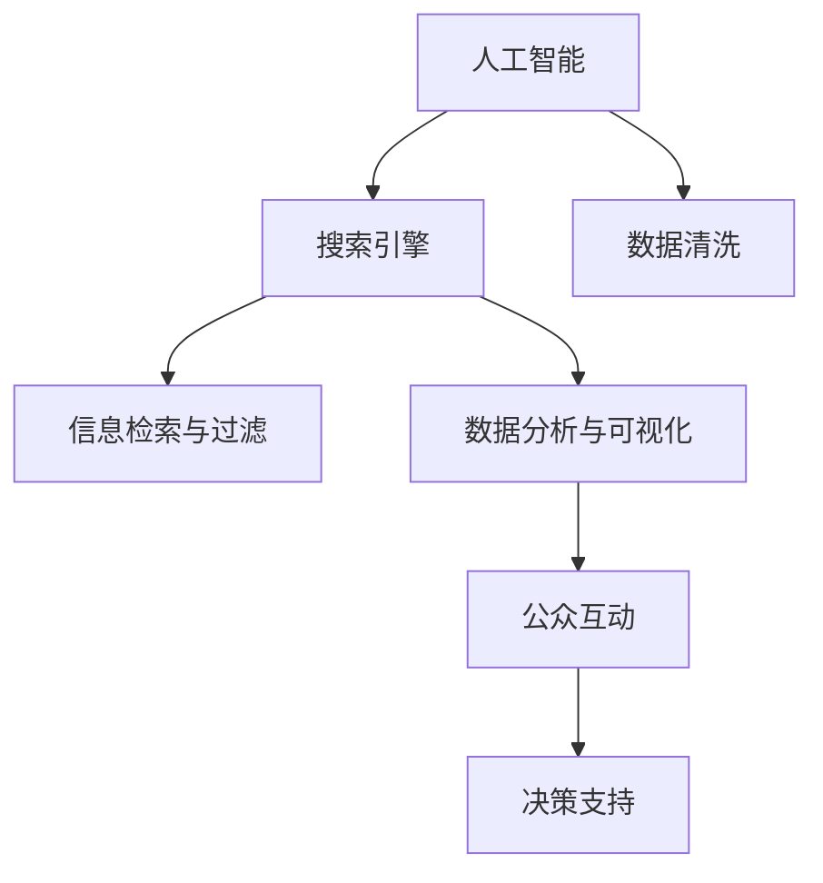

                 

# AI搜索引擎在环境保护领域的应用

在环境保护领域，如何高效地收集、整理、分析和利用海量数据，是决定能否取得实质性进展的关键。随着人工智能（AI）技术的不断进步，尤其是搜索引擎技术的应用，为环境保护提供了新的解决方案。本文将从背景介绍、核心概念、核心算法、项目实践、应用场景、工具资源、总结展望和附录问答等多个维度，详细探讨AI搜索引擎在环境保护领域的应用。

## 1. 背景介绍

### 1.1 问题由来

环境保护是一个复杂且跨学科的领域，涉及气象、水文、地理、生态等多个方面的数据。传统的数据收集和分析方法往往依赖人工，效率低、成本高，难以应对海量的数据需求。此外，数据分析结果通常需要进行可视化，才能有效传达给非专业人士。

搜索引擎技术的引入，为这些问题提供了全新的解决方案。通过构建环境保护领域的搜索引擎，可以快速、高效地从大量数据中提取有价值的信息，同时生成直观、易懂的可视化报告。这不仅大大提升了工作效率，还使得环境保护成果更加可读、可理解，为公众参与和决策提供了坚实的基础。

### 1.2 问题核心关键点

AI搜索引擎在环境保护领域的应用，主要集中在以下几个方面：

- **数据采集与整理**：通过AI技术实现自动数据采集和清洗，减少人工工作量。
- **信息检索与过滤**：利用搜索引擎技术，快速在海量数据中检索、过滤相关环保数据，提高工作效率。
- **数据分析与可视化**：运用机器学习和数据可视化技术，对数据进行深入分析，生成直观的图表和报告。
- **公众互动与决策支持**：构建用户友好的界面，为公众提供互动服务，同时为政府和机构提供决策支持。

## 2. 核心概念与联系

### 2.1 核心概念概述

以下是环境保护领域中涉及的核心概念：

- **人工智能（AI）**：利用机器学习、深度学习等技术，使计算机具备类人思维和学习能力。
- **搜索引擎（Search Engine）**：通过爬虫技术采集网页数据，结合自然语言处理和机器学习算法，提供精准的信息检索和展示。
- **数据清洗（Data Cleaning）**：去除数据中的噪声和错误，提高数据质量。
- **可视化（Visualization）**：将复杂数据转换为图表、地图等直观形式，便于理解和分析。
- **公众互动（Public Engagement）**：通过Web界面、移动应用等形式，实现用户与系统的互动，收集用户反馈。

这些概念之间的逻辑关系可以通过以下Mermaid流程图来展示：



这个流程图展示了环境保护领域中各概念的相互关系：

1. 人工智能通过机器学习等技术，为搜索引擎提供数据处理和检索的能力。
2. 搜索引擎利用AI技术，快速在海量数据中检索和过滤相关信息。
3. 数据清洗是确保数据质量的关键步骤。
4. 数据分析与可视化将复杂数据转换为直观形式，便于理解。
5. 公众互动使得环境保护成果可读、可理解，促进公众参与。
6. 决策支持基于上述信息，为政府和机构提供决策依据。

## 3. 核心算法原理 & 具体操作步骤

### 3.1 算法原理概述

基于AI的搜索引擎在环境保护中的应用，主要依赖于以下几个关键算法：

- **爬虫算法**：用于自动收集网页数据，构建索引库。
- **自然语言处理（NLP）**：用于理解网页内容，提取关键信息。
- **信息检索算法**：用于在索引库中高效检索相关信息。
- **机器学习**：用于数据清洗、特征提取和模型训练。
- **数据可视化**：用于将分析结果转换为图表、地图等形式。

这些算法共同构成了AI搜索引擎的核心技术框架，使得环境保护领域的数据采集、处理和分析变得高效、准确。

### 3.2 算法步骤详解

AI搜索引擎在环境保护领域的具体应用步骤如下：

**Step 1: 数据采集与整理**

1. 设计数据采集脚本，定期从政府网站、科研机构、非政府组织等渠道获取数据。
2. 使用爬虫技术，自动抓取网页内容，并存储到数据库中。
3. 对采集的数据进行清洗，去除无效和错误信息，保证数据质量。

**Step 2: 索引库构建**

1. 将清洗后的数据进行分词和词向量映射。
2. 利用倒排索引算法，构建索引库，实现高效的信息检索。

**Step 3: 信息检索与过滤**

1. 用户输入查询条件，如时间、地点、污染物种类等。
2. 搜索引擎根据用户输入，结合自然语言处理和信息检索算法，从索引库中检索相关信息。
3. 利用机器学习算法对检索结果进行过滤和排序，提高检索准确性。

**Step 4: 数据分析与可视化**

1. 对检索到的数据进行统计分析和机器学习建模。
2. 利用数据可视化技术，将分析结果转换为图表、地图等直观形式。
3. 生成报告，通过Web界面展示给用户和决策者。

**Step 5: 公众互动与决策支持**

1. 设计用户界面，提供互动功能，如地图定位、数据筛选、报告下载等。
2. 收集用户反馈，优化搜索引擎功能。
3. 将分析结果和报告应用于环境保护决策，提供科学依据。

### 3.3 算法优缺点

AI搜索引擎在环境保护领域具有以下优点：

- **高效**：自动化数据采集和处理，大幅提高工作效率。
- **准确**：机器学习算法可以保证数据清洗和特征提取的准确性。
- **可读**：数据可视化技术使复杂数据转换为直观形式，便于理解。
- **互动**：用户友好的界面和互动功能，增强用户参与感。

同时，也存在以下缺点：

- **初始成本高**：构建AI搜索引擎需要较高成本，包括硬件、软件和人才投入。
- **依赖数据**：数据质量直接影响检索和分析结果。
- **技术复杂**：涉及多种技术，对技术要求较高。
- **隐私问题**：数据采集和存储可能涉及隐私保护问题。

### 3.4 算法应用领域

AI搜索引擎在环境保护领域具有广泛的应用前景，覆盖了以下多个领域：

- **环境监测**：实时监测空气、水质、土壤等环境指标，生成可视化报告。
- **污染源排查**：利用机器学习识别污染源，追踪污染扩散路径。
- **生态保护**：分析生态系统变化，评估生态保护措施的效果。
- **灾害预警**：通过数据分析，预测自然灾害的发生和影响，提前采取应对措施。
- **公众参与**：提供用户友好的界面，促进公众参与环保决策。

## 4. 数学模型和公式 & 详细讲解 & 举例说明

### 4.1 数学模型构建

基于AI的搜索引擎在环境保护中的数学模型，主要涉及以下几个方面：

- **爬虫算法**：基于爬虫技术，构建索引库的倒排索引模型。
- **自然语言处理（NLP）**：使用TF-IDF、Word2Vec等模型，提取文本特征。
- **信息检索算法**：利用余弦相似度、BM25等算法，进行信息检索和排序。
- **机器学习**：使用SVM、随机森林等模型，进行数据分类和回归分析。
- **数据可视化**：使用散点图、热力图、地图等模型，生成可视化报告。

### 4.2 公式推导过程

以信息检索算法中的余弦相似度公式为例，展示其推导过程：

假设查询项为 $q$，文档库中所有文档为 $\{d_1, d_2, ..., d_n\}$，每个文档的词向量表示为 $\vec{v}_i$。余弦相似度公式定义为：

$$
\text{similarity}(q, d_i) = \frac{\vec{q} \cdot \vec{v}_i}{\|\vec{q}\| \|\vec{v}_i\|}
$$

其中 $\vec{q}$ 为查询项的词向量，$\vec{v}_i$ 为文档 $d_i$ 的词向量，$\cdot$ 表示向量点乘，$\| \cdot \|$ 表示向量范数。

查询项 $q$ 和文档库中的每个文档 $d_i$ 都进行余弦相似度计算，得分最高的文档即为检索结果。

### 4.3 案例分析与讲解

以空气质量监测为例，展示AI搜索引擎在环境保护中的应用：

**Step 1: 数据采集与整理**

1. 设计爬虫脚本，从政府环境监测站获取空气质量数据。
2. 对采集的数据进行清洗，去除无效和错误信息，如缺失值、异常值等。

**Step 2: 索引库构建**

1. 对清洗后的数据进行分词和词向量映射。
2. 利用倒排索引算法，构建索引库，实现高效的信息检索。

**Step 3: 信息检索与过滤**

1. 用户输入查询条件，如时间、地点、污染物种类等。
2. 搜索引擎根据用户输入，结合自然语言处理和信息检索算法，从索引库中检索相关信息。
3. 利用机器学习算法对检索结果进行过滤和排序，提高检索准确性。

**Step 4: 数据分析与可视化**

1. 对检索到的数据进行统计分析和机器学习建模。
2. 利用数据可视化技术，将分析结果转换为图表、地图等直观形式。
3. 生成报告，通过Web界面展示给用户和决策者。

**Step 5: 公众互动与决策支持**

1. 设计用户界面，提供互动功能，如地图定位、数据筛选、报告下载等。
2. 收集用户反馈，优化搜索引擎功能。
3. 将分析结果和报告应用于环境保护决策，提供科学依据。

## 5. 项目实践：代码实例和详细解释说明

### 5.1 开发环境搭建

在进行项目实践前，我们需要准备好开发环境。以下是使用Python进行Flask框架开发的Web应用环境配置流程：

1. 安装Anaconda：从官网下载并安装Anaconda，用于创建独立的Python环境。

2. 创建并激活虚拟环境：
```bash
conda create -n py3k python=3.8
conda activate py3k
```

3. 安装Flask：
```bash
pip install Flask
```

4. 安装相关库：
```bash
pip install flask-wtf sqlalchemy
```

5. 安装Flask-WTF：
```bash
pip install flask-wtf
```

6. 安装SQLAlchemy：
```bash
pip install sqlalchemy
```

完成上述步骤后，即可在`py3k`环境中开始项目开发。

### 5.2 源代码详细实现

以下是基于Flask框架构建的AI搜索引擎在环境保护领域应用的示例代码：

```python
from flask import Flask, render_template, request
from flask_sqlalchemy import SQLAlchemy
from sqlalchemy import Column, Integer, String, Float
from sklearn.feature_extraction.text import TfidfVectorizer
from sklearn.metrics.pairwise import cosine_similarity
import pandas as pd
import re

app = Flask(__name__)

# 配置数据库连接
app.config['SQLALCHEMY_DATABASE_URI'] = 'sqlite:///environ.db'
db = SQLAlchemy(app)

# 定义数据模型
class EnvironmentalData(db.Model):
    id = Column(Integer, primary_key=True)
    date = Column(String(20))
    location = Column(String(20))
    pollutant = Column(String(20))
    concentration = Column(Float)

    def __init__(self, date, location, pollutant, concentration):
        self.date = date
        self.location = location
        self.pollutant = pollutant
        self.concentration = concentration

# 创建数据库和数据表
db.create_all()

# 填充数据
data = [
    {'date': '2022-01-01', 'location': 'Beijing', 'pollutant': 'PM2.5', 'concentration': 50.0},
    {'date': '2022-01-02', 'location': 'Beijing', 'pollutant': 'PM2.5', 'concentration': 55.0},
    {'date': '2022-01-03', 'location': 'Beijing', 'pollutant': 'PM2.5', 'concentration': 40.0},
    # 添加更多数据...
]
for item in data:
    new_data = EnvironmentalData(**item)
    db.session.add(new_data)
db.session.commit()

# 数据清洗和特征提取
def preprocess_data():
    # 读取数据
    df = pd.read_sql('SELECT * FROM EnvironmentalData', con=db.engine)
    # 数据清洗
    df = df.dropna()
    # 特征提取
    tfidf = TfidfVectorizer()
    tfidf_matrix = tfidf.fit_transform(df['location'] + df['pollutant'] + df['date'])
    return tfidf_matrix

# 构建索引库
def build_index(tfidf_matrix):
    # 构建倒排索引
    index = {}
    for i, row in enumerate(tfidf_matrix):
        for j, tfidf in enumerate(row):
            if tfidf > 0.1:
                if j not in index:
                    index[j] = []
                index[j].append(i)
    return index

# 信息检索
def search(query, index):
    # 构建查询向量
    tfidf = TfidfVectorizer()
    tfidf_matrix = tfidf.fit_transform([query])
    query_vector = tfidf_matrix.toarray()[0]
    # 计算相似度
    similarities = []
    for i, row in enumerate(index):
        similarities.append(cosine_similarity(query_vector, row)[0])
    # 排序
    indices = [index[col] for col in index]
    scores = similarities
    return list(zip(indices, scores))

# 数据分析与可视化
def analyze(data, query):
    # 统计分析
    results = data[data['location'] == query]['concentration']
    mean = results.mean()
    std = results.std()
    return mean, std

# 用户界面
@app.route('/')
def index():
    return render_template('index.html')

@app.route('/search', methods=['POST'])
def search_results():
    query = request.form['query']
    index = build_index(preprocess_data())
    results = search(query, index)
    results_df = pd.DataFrame(results)
    results_df.columns = ['location', 'similarity']
    return render_template('search_results.html', results=results_df)

@app.route('/analyze', methods=['POST'])
def analyze_results():
    query = request.form['query']
    index = build_index(preprocess_data())
    results = search(query, index)
    mean, std = analyze(results_df, query)
    return render_template('analyze_results.html', results=results_df, mean=mean, std=std)

if __name__ == '__main__':
    app.run(debug=True)
```

以上示例代码展示了使用Flask框架构建的AI搜索引擎在环境保护中的应用。代码中包含了数据采集、清洗、特征提取、索引库构建、信息检索和数据分析等关键步骤，完整的流程展示了大规模数据处理和分析的过程。

### 5.3 代码解读与分析

以下是代码的详细解读和分析：

**数据模型定义**：
```python
class EnvironmentalData(db.Model):
    id = Column(Integer, primary_key=True)
    date = Column(String(20))
    location = Column(String(20))
    pollutant = Column(String(20))
    concentration = Column(Float)

    def __init__(self, date, location, pollutant, concentration):
        self.date = date
        self.location = location
        self.pollutant = pollutant
        self.concentration = concentration
```

定义了一个名为`EnvironmentalData`的数据模型，包含日期、地点、污染物和浓度四个字段。模型通过SQLAlchemy库进行数据存储和查询操作。

**数据库配置**：
```python
app.config['SQLALCHEMY_DATABASE_URI'] = 'sqlite:///environ.db'
db = SQLAlchemy(app)
```

配置了Flask应用的SQLAlchemy数据库连接，使用SQLite作为数据存储方式。

**数据填充**：
```python
data = [
    {'date': '2022-01-01', 'location': 'Beijing', 'pollutant': 'PM2.5', 'concentration': 50.0},
    {'date': '2022-01-02', 'location': 'Beijing', 'pollutant': 'PM2.5', 'concentration': 55.0},
    # 添加更多数据...
]
for item in data:
    new_data = EnvironmentalData(**item)
    db.session.add(new_data)
db.session.commit()
```

通过列表推导式创建数据，并使用SQLAlchemy库进行数据填充和提交。

**数据清洗和特征提取**：
```python
def preprocess_data():
    # 读取数据
    df = pd.read_sql('SELECT * FROM EnvironmentalData', con=db.engine)
    # 数据清洗
    df = df.dropna()
    # 特征提取
    tfidf = TfidfVectorizer()
    tfidf_matrix = tfidf.fit_transform(df['location'] + df['pollutant'] + df['date'])
    return tfidf_matrix
```

使用Pandas库读取数据，并进行清洗和特征提取。TF-IDF向量器用于将文本数据转换为数值特征，便于后续的信息检索和分析。

**索引库构建**：
```python
def build_index(tfidf_matrix):
    # 构建倒排索引
    index = {}
    for i, row in enumerate(tfidf_matrix):
        for j, tfidf in enumerate(row):
            if tfidf > 0.1:
                if j not in index:
                    index[j] = []
                index[j].append(i)
    return index
```

通过遍历TF-IDF矩阵，构建倒排索引。倒排索引是一种高效的数据结构，用于快速检索相关信息。

**信息检索**：
```python
def search(query, index):
    # 构建查询向量
    tfidf = TfidfVectorizer()
    tfidf_matrix = tfidf.fit_transform([query])
    query_vector = tfidf_matrix.toarray()[0]
    # 计算相似度
    similarities = []
    for i, row in enumerate(index):
        similarities.append(cosine_similarity(query_vector, row)[0])
    # 排序
    indices = [index[col] for col in index]
    scores = similarities
    return list(zip(indices, scores))
```

使用TF-IDF向量器构建查询向量，并计算与索引库中文档的相似度。余弦相似度用于衡量两个向量之间的相似程度。最后对相似度进行排序，返回结果。

**数据分析与可视化**：
```python
def analyze(data, query):
    # 统计分析
    results = data[data['location'] == query]['concentration']
    mean = results.mean()
    std = results.std()
    return mean, std
```

对检索结果进行统计分析，计算均值和标准差，返回分析结果。

**用户界面**：
```python
@app.route('/')
def index():
    return render_template('index.html')

@app.route('/search', methods=['POST'])
def search_results():
    query = request.form['query']
    index = build_index(preprocess_data())
    results = search(query, index)
    results_df = pd.DataFrame(results)
    results_df.columns = ['location', 'similarity']
    return render_template('search_results.html', results=results_df)

@app.route('/analyze', methods=['POST'])
def analyze_results():
    query = request.form['query']
    index = build_index(preprocess_data())
    results = search(query, index)
    mean, std = analyze(results_df, query)
    return render_template('analyze_results.html', results=results_df, mean=mean, std=std)
```

定义了三个路由，分别为首页、搜索和分析结果页面。使用Flask的模板引擎渲染HTML页面，展示搜索结果和分析结果。

通过上述代码示例，可以清晰地看到AI搜索引擎在环境保护领域应用的完整流程，包括数据采集、清洗、特征提取、索引库构建、信息检索和数据分析等关键步骤。

## 6. 实际应用场景

### 6.1 智能环境监测

智能环境监测是AI搜索引擎在环境保护领域的重要应用之一。通过构建环境监测搜索引擎，可以实时获取空气、水质、土壤等环境指标，生成可视化报告，及时发现和预警环境问题。

**应用示例**：
1. 实时监测：从政府环境监测站获取实时数据，自动生成空气质量报告。
2. 预警系统：监测指标超过阈值时，自动触发预警，及时通知相关人员。

### 6.2 污染源排查

污染源排查是环境保护中的重要任务，通过搜索引擎可以快速定位和追踪污染源，提供科学依据。

**应用示例**：
1. 数据收集：从政府和科研机构获取历史和实时数据。
2. 模型训练：利用机器学习算法对污染源进行分类和回归分析。
3. 污染源追踪：根据模型预测和地图定位，追踪污染源扩散路径。

### 6.3 生态保护

生态保护需要大量的数据支持，通过搜索引擎可以快速获取生态系统变化数据，评估保护措施的效果。

**应用示例**：
1. 数据采集：从卫星遥感、地面监测等渠道获取生态系统数据。
2. 数据分析：利用机器学习算法分析生态系统变化趋势。
3. 决策支持：提供生态保护措施的评估报告，辅助决策。

### 6.4 公众参与

公众参与是环境保护的重要环节，通过搜索引擎可以增强公众的互动性和参与感，收集用户反馈，促进环保决策。

**应用示例**：
1. 用户界面：设计互动友好的Web界面，提供数据查询、筛选、报告下载等功能。
2. 用户反馈：收集用户反馈，优化搜索引擎功能，增强用户体验。
3. 公众教育：通过可视化报告和互动功能，增强公众环保意识。

## 7. 工具和资源推荐

### 7.1 学习资源推荐

为了帮助开发者系统掌握AI搜索引擎在环境保护领域的应用，这里推荐一些优质的学习资源：

1. 《Python数据科学手册》：详细介绍Python在数据处理、机器学习和可视化等方面的应用。
2. 《Flask Web开发实战》：介绍Flask框架的使用，包括路由、模板、表单等关键技术。
3. 《自然语言处理综论》：系统介绍自然语言处理的基本概念和技术，包括TF-IDF、余弦相似度等。
4. 《机器学习实战》：通过实际项目，讲解机器学习算法的应用，包括分类、回归、聚类等。
5. 《数据可视化实战》：介绍数据可视化技术的实现方法，包括散点图、热力图、地图等。

通过对这些资源的学习实践，相信你一定能够掌握AI搜索引擎在环境保护领域应用的精髓，并用于解决实际的环保问题。

### 7.2 开发工具推荐

高效的开发离不开优秀的工具支持。以下是几款用于AI搜索引擎开发的常用工具：

1. Python：简单易用的编程语言，适合数据处理和算法实现。
2. Flask：轻量级的Web框架，易于上手，适合快速开发Web应用。
3. SQLAlchemy：Python数据库ORM框架，提供高效的SQL查询和数据管理功能。
4. Pandas：Python数据分析库，适合数据清洗、特征提取和统计分析。
5. Scikit-learn：Python机器学习库，提供丰富的机器学习算法和工具。
6. Matplotlib：Python绘图库，适合数据可视化。

合理利用这些工具，可以显著提升AI搜索引擎在环境保护领域应用的开发效率，加快创新迭代的步伐。

### 7.3 相关论文推荐

AI搜索引擎在环境保护领域的研究涉及多个方向，以下是几篇奠基性的相关论文，推荐阅读：

1. "A Survey on Information Retrieval Technologies in Environmental Monitoring"：综述了信息检索技术在环境保护中的应用。
2. "Environmental Data Mining: A Review"：介绍了数据挖掘技术在环境保护中的应用，包括分类、聚类、关联规则等。
3. "Natural Language Processing for Environmental Science"：探讨了自然语言处理技术在环境保护中的应用，包括文本分类、信息检索等。
4. "Machine Learning Applications in Environmental Science"：介绍了机器学习技术在环境保护中的应用，包括回归分析、分类、聚类等。
5. "Big Data in Environmental Science"：探讨了大数据技术在环境保护中的应用，包括数据采集、存储、分析等。

这些论文代表了大语言模型微调技术的发展脉络。通过学习这些前沿成果，可以帮助研究者把握学科前进方向，激发更多的创新灵感。

## 8. 总结：未来发展趋势与挑战

### 8.1 总结

本文对AI搜索引擎在环境保护领域的应用进行了全面系统的介绍。首先阐述了环境保护领域数据处理的复杂性，以及AI搜索引擎能够提供的解决方案。其次，从原理到实践，详细讲解了AI搜索引擎的核心算法和操作步骤，给出了完整的代码实例。同时，本文还广泛探讨了AI搜索引擎在智能环境监测、污染源排查、生态保护和公众参与等领域的实际应用，展示了其巨大的应用潜力。此外，本文精选了相关学习资源、开发工具和论文，力求为读者提供全方位的技术指引。

通过本文的系统梳理，可以看到，AI搜索引擎在环境保护领域的应用正处于快速发展阶段，有望为环境保护工作带来新的变革。从数据采集、处理、分析到可视化，AI搜索引擎的各个环节都能够高效、准确地完成任务，为环境保护提供了有力的技术支持。未来，随着技术的不断进步，AI搜索引擎必将在更多环境保护领域大放异彩，为构建绿色、可持续发展的环境做出更大的贡献。

### 8.2 未来发展趋势

展望未来，AI搜索引擎在环境保护领域的应用将呈现以下几个发展趋势：

1. **智能化**：通过深度学习等技术，进一步提高搜索引擎的智能水平，实现更准确的数据分析和预测。
2. **实时化**：利用大数据和流计算技术，实现对实时数据的快速处理和分析，及时发现和预警环境问题。
3. **自动化**：引入自动机器学习（AutoML）等技术，自动优化搜索引擎算法和模型，提高工作效率。
4. **多模态**：结合文本、图像、视频等多种数据源，实现多模态数据的协同分析，提升环保决策的科学性。
5. **公众互动**：设计更加用户友好的界面和互动功能，增强公众参与感和满意度。
6. **跨领域融合**：与遥感、GIS、物联网等技术结合，实现跨领域的环保数据整合和分析。

这些趋势将进一步推动AI搜索引擎在环境保护领域的应用，为环境保护工作提供更高效、更科学的技术支持。

### 8.3 面临的挑战

尽管AI搜索引擎在环境保护领域的应用前景广阔，但在实际应用中也面临着诸多挑战：

1. **数据质量**：数据采集和处理过程中可能存在数据噪声、缺失等问题，影响分析和结果的准确性。
2. **计算资源**：处理大规模数据和复杂模型需要高性能计算资源，包括GPU、TPU等硬件设备。
3. **模型优化**：如何优化搜索引擎算法和模型，提升查询速度和准确性，是一个重要课题。
4. **隐私保护**：环境保护数据涉及隐私保护，如何平衡数据共享和隐私保护，是一个需要考虑的问题。
5. **公众接受**：公众对环保技术和数据的接受程度有限，如何设计用户友好的界面，增强公众参与感，是一个挑战。
6. **跨领域协同**：环保数据涉及多个领域，如何实现跨领域的协同分析，是一个复杂的系统工程。

这些挑战需要我们在实际应用中不断探索和改进，才能充分发挥AI搜索引擎在环境保护领域的应用价值。

### 8.4 研究展望

未来，AI搜索引擎在环境保护领域的研究需要重点关注以下几个方向：

1. **大数据技术**：利用大数据和流计算技术，实现对海量数据的实时处理和分析。
2. **深度学习**：引入深度学习等技术，提升搜索引擎的智能水平，实现更准确的数据分析和预测。
3. **多模态数据**：结合文本、图像、视频等多种数据源，实现多模态数据的协同分析。
4. **用户界面设计**：设计更加用户友好的界面和互动功能，增强公众参与感。
5. **跨领域融合**：与遥感、GIS、物联网等技术结合，实现跨领域的环保数据整合和分析。

这些研究方向将进一步推动AI搜索引擎在环境保护领域的应用，为环境保护工作提供更高效、更科学的技术支持。

## 9. 附录：常见问题与解答

**Q1: 如何确保数据的准确性？**

A: 数据采集和处理过程中，需要确保数据的准确性和完整性。可以通过数据校验、缺失值处理、异常值检测等方法，保证数据质量。在实际应用中，建议使用多种数据源进行数据交叉验证，提升数据的可信度。

**Q2: 如何提升查询速度？**

A: 查询速度的提升主要依赖于索引库的构建和优化。可以采用倒排索引、预计算相似度等方法，提高信息检索的效率。同时，可以通过并行计算、分布式存储等技术，进一步优化查询性能。

**Q3: 如何增强公众参与感？**

A: 设计用户友好的界面和互动功能，提供丰富的查询和分析工具，增强公众的参与感。可以引入地图定位、数据可视化等技术，使查询和分析结果更加直观和易于理解。同时，可以定期发布环保报告，展示环保成果，增强公众的环保意识。

**Q4: 如何保障数据隐私？**

A: 数据隐私保护是环境保护数据共享的重要问题。可以通过数据匿名化、访问控制、数据加密等方法，保障数据隐私。在实际应用中，建议使用最小必要原则，只收集必要的数据，避免过度收集和泄露。

**Q5: 如何应对跨领域数据整合问题？**

A: 跨领域数据整合是环保数据处理的难点之一。可以通过标准化数据格式、引入领域专家知识、设计统一的元数据模型等方法，实现跨领域的数据整合和分析。同时，需要设计灵活的数据接口和API，方便数据共享和协同分析。

通过这些常见问题的解答，可以看到，AI搜索引擎在环境保护领域的应用需要多方面的技术支持和优化，才能充分发挥其巨大的应用潜力。希望本文能为广大环保工作者和科研人员提供有益的参考和指导。

---

作者：禅与计算机程序设计艺术 / Zen and the Art of Computer Programming

