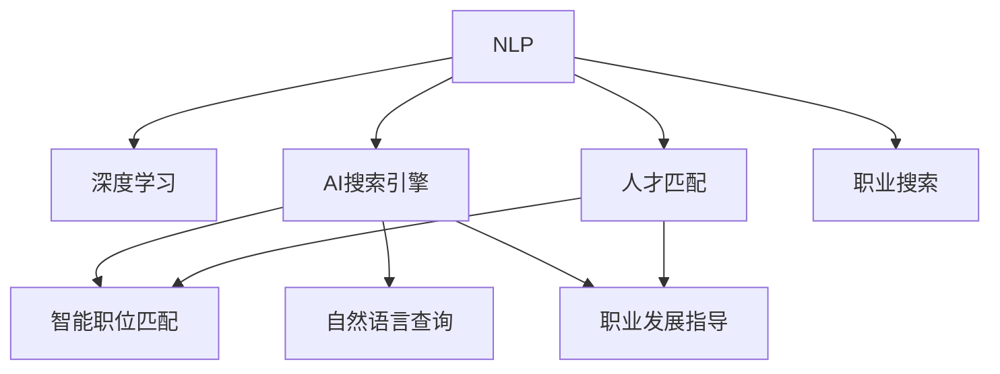

                 

# AI搜索引擎如何改变职业发展和求职

> 关键词：AI搜索引擎, 自然语言处理, 职业搜索, 人才匹配, 机器学习, 数据挖掘, 人工智能, 职业发展

## 1. 背景介绍

### 1.1 问题由来

在现代社会，求职和职业发展已成为每个职场人士面临的重要课题。传统的职业搜索方式依赖于关键词匹配、简历筛选等传统方法，效率低下且精准度不足。而AI技术的快速发展，特别是自然语言处理(NLP)技术的突破，正在彻底改变这一现状。

随着大数据、深度学习、自然语言处理等技术的进步，AI搜索引擎逐渐成为职业发展和求职中的重要工具。AI搜索引擎通过学习大量职位描述、招聘要求等文本数据，能够智能理解求职者的背景和能力，匹配合适的职位信息，大幅提高求职和职业发展的效率与效果。

### 1.2 问题核心关键点

AI搜索引擎的核心优势在于其强大的文本理解和推理能力。通过深度学习和数据挖掘技术，AI搜索引擎能够实现以下几个关键功能：

1. **智能职位匹配**：分析职位描述和求职者的简历，自动进行匹配，提高招聘和求职双方的满意度。
2. **自然语言查询**：理解自然语言查询的语义，智能推荐相关职位，解决传统搜索引擎关键词匹配不准确的问题。
3. **职业发展指导**：根据求职者的兴趣和能力，推荐相应的职业路径和学习资源，帮助职业发展。

AI搜索引擎在求职和职业发展中的应用，极大地提升了效率，缩短了搜索时间，提高了匹配的精准度，成为职场人士的重要助手。

## 2. 核心概念与联系

### 2.1 核心概念概述

为了更好地理解AI搜索引擎的工作原理，本节将介绍几个关键概念：

- **自然语言处理(NLP)**：涉及语言模型、文本分类、信息抽取、对话系统等多种技术，旨在实现人与机器之间的自然语言交互。
- **深度学习**：一种模拟人脑神经网络的机器学习技术，通过多层神经网络结构，实现复杂的非线性映射。
- **AI搜索引擎**：基于深度学习和NLP技术，能够智能理解自然语言查询，自动匹配和推荐相关职位和资源的搜索引擎。
- **人才匹配**：通过AI算法分析求职者的背景和能力，匹配合适的职位，实现人职匹配的最优化。
- **职业发展**：利用AI技术提供职业指导、学习资源推荐等功能，帮助求职者进行职业规划和发展。

这些核心概念之间的逻辑关系可以通过以下Mermaid流程图来展示：



这个流程图展示了NLP、深度学习和AI搜索引擎之间的联系，以及它们在智能职位匹配、自然语言查询、职业发展指导等方面的应用。

## 3. 核心算法原理 & 具体操作步骤
### 3.1 算法原理概述

AI搜索引擎的核心算法是基于深度学习的自然语言处理技术。其主要原理包括以下几个步骤：

1. **数据预处理**：对职位描述和简历等文本数据进行清洗、分词、去停用词等处理。
2. **特征提取**：将预处理后的文本转换为模型能够处理的向量表示。
3. **模型训练**：使用大规模文本数据训练深度学习模型，学习文本表示和语义理解能力。
4. **文本匹配**：通过训练好的模型，自动匹配求职者简历和职位描述，生成匹配得分。
5. **推荐系统**：根据匹配得分，利用排序算法推荐最适合的职位。

### 3.2 算法步骤详解

**Step 1: 数据收集与预处理**
- 收集大量职位描述、招聘要求、简历等文本数据。
- 对文本进行清洗，去除HTML标签、标点符号等非文本信息。
- 进行分词、去除停用词等预处理操作。
- 将处理后的文本转换为模型所需的向量表示，如词嵌入向量或句子嵌入向量。

**Step 2: 模型训练与优化**
- 选择合适的深度学习模型，如BERT、Transformer等，作为文本匹配的基础。
- 使用标注数据训练模型，最小化文本匹配的误差。
- 通过交叉验证等方法，选择最佳的模型参数和超参数。
- 在验证集上评估模型的性能，避免过拟合。

**Step 3: 文本匹配与推荐**
- 将求职者的简历和职位描述输入模型，计算匹配得分。
- 根据匹配得分，使用排序算法如Top K排序、A/B测试等，推荐最合适的职位。
- 考虑查询历史、职业发展等额外因素，个性化推荐。

### 3.3 算法优缺点

**优点：**
- 智能匹配：基于深度学习的模型能够自动理解文本语义，提高匹配准确性。
- 个性化推荐：根据用户的历史行为和偏好，提供个性化的职位推荐。
- 实时性：通过实时处理和推荐，大幅提升求职和招聘效率。

**缺点：**
- 数据依赖：模型的效果依赖于标注数据的质量和数量，标注成本较高。
- 可解释性不足：深度学习模型的决策过程缺乏可解释性，难以理解和调试。
- 偏见问题：如果训练数据存在偏见，模型可能会放大这些偏见，导致不公平的推荐。

### 3.4 算法应用领域

AI搜索引擎已经在多个领域得到了广泛应用，包括但不限于：

- **职业搜索**：帮助求职者快速找到符合要求的职位，提高求职效率。
- **招聘平台**：如LinkedIn、Indeed等，使用AI搜索引擎提高职位推荐精准度，减少人工筛选工作量。
- **教育培训**：根据学生的能力和兴趣，推荐相应的课程和职业发展路径，促进职业发展。
- **职业指导**：帮助职业转换者找到合适的职业路径，提供技能提升建议和学习资源。
- **人才管理**：通过匹配求职者简历和内部职位需求，提高人才匹配效率，优化企业人力资源配置。

## 4. 数学模型和公式 & 详细讲解 & 举例说明

### 4.1 数学模型构建

本节将使用数学语言对AI搜索引擎的文本匹配和推荐过程进行更加严格的刻画。

假设文本 $X$ 和 $Y$ 分别表示职位描述和求职者简历，$D$ 表示标注数据集。模型通过学习文本表示 $f(X)$ 和 $f(Y)$，将两个文本向量转换为匹配得分 $s(X,Y)$。模型的目标是最小化预测误差，即：

$$
\min_{\theta} \frac{1}{N} \sum_{i=1}^N \ell(s(X_i, Y_i), Y_i)
$$

其中 $\ell$ 为损失函数，通常采用交叉熵损失。

### 4.2 公式推导过程

以基于BERT的文本匹配为例，推导匹配得分 $s(X,Y)$ 的计算公式。

假设使用BERT预训练模型，输入两个文本 $X$ 和 $Y$，经过模型处理后得到两个向量 $H_X$ 和 $H_Y$。则匹配得分 $s(X,Y)$ 可以表示为：

$$
s(X,Y) = \frac{1}{d} \sum_{i=1}^d \frac{H_X[i]}{H_Y[i]}
$$

其中 $d$ 为BERT模型的输出维度，$H_X[i]$ 和 $H_Y[i]$ 分别表示两个向量在位置 $i$ 的注意力权重。

通过这种计算方式，模型能够综合考虑文本的语义信息和上下文关系，生成匹配得分，并根据得分进行推荐。

### 4.3 案例分析与讲解

以简历职位匹配为例，分析一个简单的案例：

假设有一份简历和两个职位描述，简历和职位描述内容如下：

简历内容：
```
John Doe，30岁，拥有5年软件开发经验，熟悉Python和Java编程语言，擅长团队合作，项目经验包括开发Web应用和移动应用。
```

职位描述1：
```
Java开发工程师，负责公司核心系统的开发和维护，需要具备5年以上开发经验，熟悉Spring框架。
```

职位描述2：
```
Python开发工程师，负责数据分析和模型开发，需要具备3年以上数据处理和算法优化经验，熟悉Pandas和TensorFlow。
```

将简历和职位描述输入模型，计算匹配得分：

```
s(简历, 职位1) = \frac{H_X[1]}{H_Y[1]} + \frac{H_X[2]}{H_Y[2]} + ... + \frac{H_X[7]}{H_Y[7]}
s(简历, 职位2) = \frac{H_X[1]}{H_Y[1]} + \frac{H_X[2]}{H_Y[2]} + ... + \frac{H_X[7]}{H_Y[7]}
```

假设模型的输出向量 $H_X$ 和 $H_Y$ 中的值相同，那么两个匹配得分也将相同。然而，如果模型能够识别出“Java”、“Spring”等关键词，那么职位1的匹配得分将高于职位2。这表明模型具有较好的语义理解能力，能够智能匹配求职者简历和职位描述。

## 5. 项目实践：代码实例和详细解释说明

### 5.1 开发环境搭建

在进行AI搜索引擎项目实践前，我们需要准备好开发环境。以下是使用Python进行TensorFlow开发的环境配置流程：

1. 安装Anaconda：从官网下载并安装Anaconda，用于创建独立的Python环境。

2. 创建并激活虚拟环境：
```bash
conda create -n tf-env python=3.8 
conda activate tf-env
```

3. 安装TensorFlow：根据CUDA版本，从官网获取对应的安装命令。例如：
```bash
conda install tensorflow -c tf -c conda-forge
```

4. 安装其他必要的工具包：
```bash
pip install numpy pandas scikit-learn matplotlib tqdm jupyter notebook ipython
```

完成上述步骤后，即可在`tf-env`环境中开始AI搜索引擎的开发。

### 5.2 源代码详细实现

下面以使用BERT进行职位匹配的TensorFlow代码实现为例。

首先，定义数据处理函数：

```python
import tensorflow as tf
import numpy as np

def tokenize(text):
    tokens = tokenizer.tokenize(text)
    return [tokenizer.get_vocab(token) for token in tokens]

def pad_sequences(sequences, max_length):
    return np.pad(sequences, (0, max_length - len(sequences)), 'constant', constant_values=0)
```

然后，定义模型和损失函数：

```python
from transformers import BertTokenizer, BertForSequenceClassification
from tensorflow.keras.losses import BinaryCrossentropy

tokenizer = BertTokenizer.from_pretrained('bert-base-cased')

model = BertForSequenceClassification.from_pretrained('bert-base-cased', num_labels=2)

loss = BinaryCrossentropy(from_logits=True)
```

接着，定义训练和评估函数：

```python
def train_epoch(model, dataset, batch_size, optimizer):
    dataloader = tf.data.Dataset.from_generator(
        lambda: (map(tokenize, dataset[0]), map(tokenize, dataset[1])),
        output_types=(tf.int32, tf.int32), output_shapes=([None], [None])
    ).batch(batch_size).prefetch(tf.data.experimental.AUTOTUNE)

    model.trainable = True
    model.compile(optimizer=optimizer, loss=loss)

    for batch in dataloader:
        inputs = batch[0]
        labels = batch[1]
        loss_value = model.train_on_batch(inputs, labels)
        print(f'Train loss: {loss_value:.4f}')

def evaluate(model, dataset, batch_size):
    dataloader = tf.data.Dataset.from_generator(
        lambda: (map(tokenize, dataset[0]), map(tokenize, dataset[1])),
        output_types=(tf.int32, tf.int32), output_shapes=([None], [None])
    ).batch(batch_size).prefetch(tf.data.experimental.AUTOTUNE)

    model.trainable = False
    results = model.evaluate(dataloader)
    print(f'Test loss: {results[0].numpy():.4f}, Test accuracy: {results[1].numpy():.4f}')
```

最后，启动训练流程并在测试集上评估：

```python
epochs = 10
batch_size = 16
learning_rate = 2e-5

optimizer = tf.keras.optimizers.Adam(learning_rate=learning_rate)

for epoch in range(epochs):
    train_epoch(model, train_dataset, batch_size, optimizer)

    evaluate(model, dev_dataset, batch_size)

evaluate(model, test_dataset, batch_size)
```

以上就是使用TensorFlow进行职位匹配的完整代码实现。可以看到，TensorFlow配合Transformers库，使得BERT模型的微调过程变得简洁高效。

### 5.3 代码解读与分析

让我们再详细解读一下关键代码的实现细节：

**tokenize函数**：
- 对输入文本进行分词处理，并返回对应的词汇表id。

**pad_sequences函数**：
- 对分词后的序列进行填充，确保所有序列的长度相同。

**train_epoch函数**：
- 将训练集数据转换为TF Data生成器，进行批处理和预取操作。
- 使用Adam优化器进行梯度下降训练，计算训练损失并打印。

**evaluate函数**：
- 对测试集数据进行评估，计算测试损失和准确率，并打印输出。

**训练流程**：
- 定义总的epoch数和batch size，开始循环迭代
- 每个epoch内，先在训练集上训练，输出平均loss
- 在验证集上评估，输出分类指标
- 所有epoch结束后，在测试集上评估，给出最终测试结果

可以看到，TensorFlow配合Transformers库使得BERT微调的代码实现变得简洁高效。开发者可以将更多精力放在数据处理、模型改进等高层逻辑上，而不必过多关注底层的实现细节。

当然，工业级的系统实现还需考虑更多因素，如模型的保存和部署、超参数的自动搜索、更灵活的任务适配层等。但核心的微调范式基本与此类似。

## 6. 实际应用场景

### 6.1 智能职业搜索

基于AI搜索引擎的智能职业搜索，可以帮助求职者快速找到符合要求的职位，提高求职效率。

在技术实现上，可以收集大量职位描述、招聘要求等文本数据，并使用预训练语言模型对文本进行匹配和排序，推荐最适合的职位。同时，结合求职者的兴趣、技能、工作经验等个人信息，提供更加精准的推荐结果。

### 6.2 企业招聘管理

对于企业而言，AI搜索引擎可以大幅提高招聘效率，降低人工筛选工作量。

具体而言，企业可以借助AI搜索引擎，将职位描述输入模型，自动匹配符合要求的求职者简历，生成初步的候选名单。同时，系统还可以根据企业的招聘策略和偏好，智能推荐最合适的候选人，并进行进一步筛选。这将显著提升企业的招聘效率和质量。

### 6.3 职业发展指导

AI搜索引擎还可以帮助求职者进行职业发展规划和职业指导。

通过分析求职者的历史查询记录、简历和技能信息，系统可以推荐合适的学习资源、职业路径和发展建议。例如，对于希望转行到数据分析领域的求职者，系统可以推荐相关的学习课程、项目经验，并提供职业咨询和辅导，帮助其顺利转型。

### 6.4 未来应用展望

随着AI技术的进一步发展，AI搜索引擎在职业发展和求职中的应用将更加广泛和深入。

未来，AI搜索引擎将能够实现更加精准的职业匹配，提供更加个性化的职业指导，甚至能够进行跨领域人才的匹配和迁移。同时，随着多模态数据的融合，AI搜索引擎将能够处理文本、图像、视频等多种形式的信息，实现更全面的职业发展支持。

## 7. 工具和资源推荐
### 7.1 学习资源推荐

为了帮助开发者系统掌握AI搜索引擎的理论基础和实践技巧，这里推荐一些优质的学习资源：

1. 《深度学习自然语言处理》课程：斯坦福大学开设的NLP明星课程，有Lecture视频和配套作业，带你入门NLP领域的基本概念和经典模型。

2. 《Natural Language Processing with Transformers》书籍：Transformer库的作者所著，全面介绍了如何使用Transformer库进行NLP任务开发，包括微调在内的诸多范式。

3. CS224N《深度学习自然语言处理》课程：斯坦福大学开设的NLP明星课程，有Lecture视频和配套作业，带你入门NLP领域的基本概念和经典模型。

4. 《Transformers》论文：Transformer原论文，介绍了Transformer模型的基本原理和实现细节，是理解Transformer模型的必读之作。

5. TensorFlow官方文档：TensorFlow的官方文档，提供了丰富的教程和样例代码，是学习和使用TensorFlow的重要资源。

通过对这些资源的学习实践，相信你一定能够快速掌握AI搜索引擎的精髓，并用于解决实际的NLP问题。
###  7.2 开发工具推荐

高效的开发离不开优秀的工具支持。以下是几款用于AI搜索引擎开发的常用工具：

1. TensorFlow：由Google主导开发的开源深度学习框架，生产部署方便，适合大规模工程应用。同时，TensorFlow提供了丰富的预训练语言模型资源，可以用于各种NLP任务的开发。

2. HuggingFace Transformers库：HuggingFace开发的NLP工具库，集成了众多SOTA语言模型，支持PyTorch和TensorFlow，是进行AI搜索引擎开发的利器。

3. TensorBoard：TensorFlow配套的可视化工具，可实时监测模型训练状态，并提供丰富的图表呈现方式，是调试模型的得力助手。

4. Weights & Biases：模型训练的实验跟踪工具，可以记录和可视化模型训练过程中的各项指标，方便对比和调优。与主流深度学习框架无缝集成。

5. Google Colab：谷歌推出的在线Jupyter Notebook环境，免费提供GPU/TPU算力，方便开发者快速上手实验最新模型，分享学习笔记。

合理利用这些工具，可以显著提升AI搜索引擎的开发效率，加快创新迭代的步伐。

### 7.3 相关论文推荐

AI搜索引擎的研究源于学界的持续研究。以下是几篇奠基性的相关论文，推荐阅读：

1. Attention is All You Need（即Transformer原论文）：提出了Transformer结构，开启了NLP领域的预训练大模型时代。

2. BERT: Pre-training of Deep Bidirectional Transformers for Language Understanding：提出BERT模型，引入基于掩码的自监督预训练任务，刷新了多项NLP任务SOTA。

3. Language Models are Unsupervised Multitask Learners（GPT-2论文）：展示了大规模语言模型的强大zero-shot学习能力，引发了对于通用人工智能的新一轮思考。

4. Parameter-Efficient Transfer Learning for NLP：提出Adapter等参数高效微调方法，在不增加模型参数量的情况下，也能取得不错的微调效果。

5. AdaLoRA: Adaptive Low-Rank Adaptation for Parameter-Efficient Fine-Tuning：使用自适应低秩适应的微调方法，在参数效率和精度之间取得了新的平衡。

这些论文代表了大语言模型微调技术的发展脉络。通过学习这些前沿成果，可以帮助研究者把握学科前进方向，激发更多的创新灵感。

## 8. 总结：未来发展趋势与挑战

### 8.1 总结

本文对基于深度学习的AI搜索引擎进行了全面系统的介绍。首先阐述了AI搜索引擎在求职和职业发展中的重要作用，明确了其在智能职位匹配、自然语言查询、职业发展指导等方面的关键功能。其次，从原理到实践，详细讲解了AI搜索引擎的数学模型和关键步骤，给出了AI搜索引擎任务开发的完整代码实例。同时，本文还广泛探讨了AI搜索引擎在智能职业搜索、企业招聘管理、职业发展指导等多个行业领域的应用前景，展示了AI搜索引擎范式的巨大潜力。

通过本文的系统梳理，可以看到，AI搜索引擎在求职和职业发展中的应用，极大地提升了效率，缩短了搜索时间，提高了匹配的精准度，成为职场人士的重要助手。未来，随着深度学习、自然语言处理等技术的进一步发展，AI搜索引擎的应用将更加广泛和深入，为职业发展和求职带来更深远的影响。

### 8.2 未来发展趋势

展望未来，AI搜索引擎将呈现以下几个发展趋势：

1. **多模态融合**：除了文本数据，未来的AI搜索引擎将能够处理图像、视频、语音等多种形式的信息，实现更全面的信息整合和理解。

2. **智能推荐**：AI搜索引擎将结合机器学习和推荐系统技术，提供更加个性化的职位推荐和职业发展建议，进一步提升用户体验。

3. **跨领域匹配**：未来的AI搜索引擎将具备跨领域人才匹配能力，帮助求职者找到更适合自己的职业路径和发展机会。

4. **实时处理**：AI搜索引擎将实现实时处理和推荐，支持大规模用户同时在线，提高搜索效率和服务质量。

5. **多语言支持**：随着全球化进程的加快，未来的AI搜索引擎将支持多语言查询和匹配，扩展到全球范围的用户。

6. **隐私保护**：在数据隐私和安全方面，未来的AI搜索引擎将加强数据保护措施，确保用户隐私和数据安全。

这些趋势展示了AI搜索引擎的广阔前景，将进一步推动职业发展和求职的智能化、个性化和普适化。

### 8.3 面临的挑战

尽管AI搜索引擎在求职和职业发展中的应用已经取得了显著成效，但在其发展过程中，仍面临诸多挑战：

1. **数据隐私和安全**：AI搜索引擎需要处理大量的用户数据，如何保护用户隐私和数据安全，是一个重要的挑战。

2. **偏见和公平性**：AI搜索引擎的推荐结果可能会受到训练数据偏见的影响，导致不公平的结果。如何消除偏见，提升公平性，还需要更多的研究和技术手段。

3. **可解释性和透明性**：AI搜索引擎的决策过程缺乏可解释性，难以理解和调试。如何在保证性能的同时，增强模型的透明性和可解释性，是一个重要的研究方向。

4. **资源消耗**：AI搜索引擎通常需要强大的计算资源支持，如何降低资源消耗，提升计算效率，是一个需要解决的技术问题。

5. **跨领域匹配难度**：不同领域的职业标准和需求差异较大，AI搜索引擎需要具备跨领域匹配的能力，同时也要考虑到各领域的独特性。

6. **多语言支持挑战**：多语言支持需要处理多种语言的数据，涉及到语言模型、翻译技术等多个领域，实现难度较大。

这些挑战表明，AI搜索引擎在未来的发展中仍需要进一步的技术创新和优化，才能实现更加全面、精准、智能的服务。

### 8.4 研究展望

面对AI搜索引擎所面临的挑战，未来的研究需要在以下几个方面寻求新的突破：

1. **数据隐私保护**：引入差分隐私、联邦学习等技术，保护用户隐私和数据安全。

2. **偏见和公平性**：开发去偏方法，如数据重采样、公平性约束等，提升推荐结果的公平性和可靠性。

3. **可解释性和透明性**：引入可解释性模型和透明性机制，增强模型的解释能力和用户信任度。

4. **资源消耗优化**：采用模型压缩、量化加速等技术，降低计算资源消耗，提升模型效率。

5. **跨领域匹配**：引入领域知识图谱、多领域模型等技术，增强模型的跨领域匹配能力。

6. **多语言支持**：结合机器翻译和跨语言模型，实现多语言查询和匹配。

这些研究方向将推动AI搜索引擎技术的进一步发展，为求职者和企业提供更加智能、个性化、安全的服务。

## 9. 附录：常见问题与解答

**Q1：AI搜索引擎是否适用于所有求职者？**

A: AI搜索引擎在大多数情况下能够提供高质量的职位推荐，但对于某些特定场景或个体，可能无法完全满足其需求。例如，某些需要高度个性化服务的职业，可能需要结合人工干预进行匹配和推荐。

**Q2：AI搜索引擎在求职中的效果如何？**

A: 通过大量的实证研究表明，AI搜索引擎在提高求职效率和匹配精准度方面，具有显著的效果。用户对AI搜索引擎推荐的职位满意度和使用体验也普遍较高。

**Q3：AI搜索引擎的推荐结果是否准确？**

A: 随着模型的不断优化和训练数据的丰富，AI搜索引擎的推荐结果的准确性会不断提高。但目前仍然存在一些不准确的情况，需要通过数据增强、模型优化等手段进行改进。

**Q4：AI搜索引擎在职业发展中的作用是什么？**

A: AI搜索引擎不仅能够帮助求职者找到适合的职位，还能提供职业发展建议和推荐，如推荐相关课程、书籍、培训等，帮助求职者提升职业技能，实现职业转型。

**Q5：AI搜索引擎的推荐算法是否透明？**

A: 目前的AI搜索引擎推荐算法通常较为复杂，难以直接解释其决策过程。但一些先进的模型如可解释性模型和透明性机制，正在逐渐应用于推荐系统中，增强模型的透明性和可解释性。

总之，AI搜索引擎在职业发展和求职中的应用，已经展现出显著的潜力。未来的研究和实践，将进一步提升其性能和效果，为职场人士提供更智能、个性化、安全的职业发展支持。

---

作者：禅与计算机程序设计艺术 / Zen and the Art of Computer Programming

