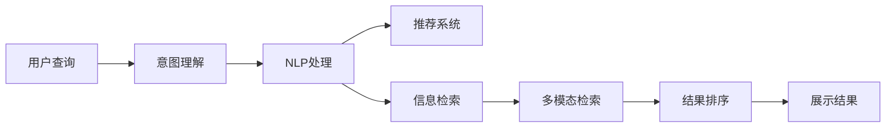

                 

# AI搜索引擎的未来：以用户为中心的体验优化

> 关键词：搜索引擎优化(SEO), 用户体验(UX), 个性化推荐, 信息检索, 智能搜索

## 1. 背景介绍

随着互联网信息量的爆炸式增长，搜索引擎已成为我们获取信息的重要工具。传统搜索引擎主要依赖关键词匹配算法，对于复杂查询和高难度语义理解的支持不足，用户体验参差不齐。为了提升搜索引擎的智能化和个性化水平，AI技术在搜索引擎中的应用成为新一轮热门趋势。

### 1.1 问题由来

搜索引擎的核心任务是从大量网页中检索出与用户查询意图最相关的结果。传统搜索引擎主要通过倒排索引、TF-IDF算法、PageRank算法等技术实现信息检索。但这些方法主要依赖关键词匹配，难以处理复杂的查询场景。

随着用户查询的个性化需求日益增强，搜索引擎亟需引入AI技术，提升对用户查询语义的理解能力，实现更加精准的信息检索和个性化的推荐，从而提高用户体验。例如，用户搜索“纽约的天气预报”时，不仅需要获取明天的温度、湿度等客观信息，还需要获取新闻、视频、图片等多媒体资源，甚至需要推荐当前纽约的旅游、交通、娱乐信息。这些需求，传统的关键词匹配算法难以满足。

### 1.2 问题核心关键点

AI技术在搜索引擎中的应用，主要集中在以下几个方面：

- **搜索引擎优化（SEO）**：通过AI技术优化网页内容、元数据和网站结构，提高网页在搜索结果中的排名。
- **用户查询意图理解**：利用自然语言处理（NLP）技术，理解用户查询背后的真实意图，提升检索结果的相关性和准确性。
- **个性化推荐**：结合用户的搜索历史、浏览行为和兴趣偏好，提供个性化的搜索结果。
- **多模态检索**：引入图像、视频等多模态信息，提升搜索结果的多样性和丰富性。
- **语义搜索**：通过语义理解技术，支持复杂的查询表达方式，提升查询的准确性和覆盖率。

这些技术手段相辅相成，共同构建了一个以用户为中心的智能搜索引擎体系。

## 2. 核心概念与联系

### 2.1 核心概念概述

为更好地理解AI在搜索引擎中的应用，本节将介绍几个关键概念：

- **搜索引擎优化（SEO）**：通过优化网站结构和内容，提升网页在搜索引擎中的排名，吸引更多流量。
- **信息检索（IR）**：根据用户查询意图，从大量网页中检索出最相关的结果。
- **自然语言处理（NLP）**：利用AI技术处理和理解自然语言，支持语言理解和生成。
- **推荐系统（Recommender System）**：根据用户行为和偏好，推荐相关信息和内容。
- **多模态信息检索（Multimodal IR）**：结合文本、图像、音频等多种信息源，提升检索结果的多样性和准确性。
- **语义搜索（Semantic Search）**：通过语义理解技术，支持复杂的查询表达方式，提升查询的准确性和覆盖率。

这些概念之间的联系紧密，共同构成了现代搜索引擎的核心框架。

### 2.2 核心概念原理和架构的 Mermaid 流程图(Mermaid 流程节点中不要有括号、逗号等特殊字符)



这个流程图展示了大语言模型在搜索引擎中的应用框架：

1. 用户输入查询。
2. 意图理解模块通过NLP技术，提取查询背后的真实意图。
3. 推荐系统根据用户行为，推荐相关搜索结果。
4. 信息检索模块从数据库中检索出最相关的网页。
5. 多模态检索模块引入图像、视频等多模态信息，丰富检索结果。
6. 结果排序模块综合考虑检索结果的相关性、权威性和用户行为等因素，对结果进行排序。
7. 展示结果模块将排序后的结果展示给用户。

## 3. 核心算法原理 & 具体操作步骤

### 3.1 算法原理概述

基于AI的搜索引擎优化主要包括以下几个关键算法：

- **用户意图理解（User Intent Understanding）**：通过NLP技术，对用户查询进行分词、词性标注、命名实体识别等处理，理解查询背后的真实意图。
- **内容优化（Content Optimization）**：利用关键词提取、页面元素优化、链接结构优化等技术，提升网页在搜索引擎中的排名。
- **个性化推荐（Personalized Recommendation）**：根据用户的历史行为、兴趣偏好、地理位置等，推荐个性化搜索结果。
- **多模态信息检索（Multimodal Information Retrieval）**：结合文本、图像、音频等多种信息源，提高搜索结果的多样性和丰富性。
- **语义搜索（Semantic Search）**：利用语义理解技术，支持复杂的查询表达方式，提升查询的准确性和覆盖率。

这些算法共同构成了现代搜索引擎的核心功能，帮助用户快速获取所需信息，提升搜索体验。

### 3.2 算法步骤详解

以下将详细介绍AI在搜索引擎中的主要算法步骤。

#### 3.2.1 用户意图理解

用户意图理解是搜索引擎优化和信息检索的基础。通过对用户查询进行分词、词性标注、命名实体识别等处理，可以更好地理解查询背后的真实意图。以下是常见的用户意图理解算法步骤：

1. **分词（Tokenization）**：将用户查询分成一个个有意义的词语。
2. **词性标注（Part-of-Speech Tagging）**：标注每个词语的词性，如名词、动词、形容词等。
3. **命名实体识别（Named Entity Recognition, NER）**：识别用户查询中的命名实体，如人名、地名、组织名等。
4. **意图分类（Intent Classification）**：根据分词、词性标注和命名实体识别结果，将用户查询归为预定义的意图类别，如新闻查询、商品查询、地图查询等。

#### 3.2.2 内容优化

内容优化是搜索引擎优化的重要环节，通过优化网页内容和结构，提升网页在搜索引擎中的排名。以下是常见的优化策略：

1. **关键词优化（Keyword Optimization）**：在网页标题、元标签、正文等位置合理分布关键词，提升网页的关键词密度。
2. **页面元素优化（Page Element Optimization）**：优化页面标题、描述、图像、链接等元素，提升网页的展示效果。
3. **链接结构优化（Link Structure Optimization）**：优化网页之间的链接结构，提升网页的权威性和相关性。

#### 3.2.3 个性化推荐

个性化推荐是提升用户体验的重要手段，通过推荐系统为用户推荐最相关的信息。以下是常见的推荐算法步骤：

1. **用户画像构建（User Profile Construction）**：根据用户的历史行为、兴趣偏好、地理位置等，构建用户画像。
2. **相似度计算（Similarity Calculation）**：计算用户画像与网页特征之间的相似度，筛选出最相关的网页。
3. **推荐模型训练（Recommendation Model Training）**：训练推荐模型，如协同过滤、基于内容的推荐等，根据用户画像和网页特征进行推荐。
4. **结果展示（Result Presentation）**：将推荐结果展示给用户，支持排序、过滤、搜索等功能。

#### 3.2.4 多模态信息检索

多模态信息检索通过结合文本、图像、音频等多种信息源，提升检索结果的多样性和丰富性。以下是常见的多模态检索算法步骤：

1. **文本检索（Text Retrieval）**：利用传统的文本检索算法，检索出最相关的文本信息。
2. **图像检索（Image Retrieval）**：利用图像特征提取和相似度计算，检索出最相关的图像信息。
3. **音频检索（Audio Retrieval）**：利用音频特征提取和相似度计算，检索出最相关的音频信息。
4. **结果融合（Result Fusion）**：将文本、图像、音频等结果进行融合，生成综合的搜索结果。

#### 3.2.5 语义搜索

语义搜索通过语义理解技术，支持复杂的查询表达方式，提升查询的准确性和覆盖率。以下是常见的语义搜索算法步骤：

1. **实体链接（Entity Linking）**：将用户查询中的实体链接到知识图谱或其他外部资源库。
2. **实体关系抽取（Relation Extraction）**：抽取实体之间的关系，生成更全面的语义表示。
3. **语义推理（Semantic Reasoning）**：利用逻辑推理技术，推断出更多隐含的语义信息。
4. **结果展示（Result Presentation）**：将语义查询结果展示给用户，支持自然语言描述和多语言支持。

### 3.3 算法优缺点

基于AI的搜索引擎优化具有以下优点：

1. **高度个性化**：通过用户画像和推荐算法，提供个性化的搜索结果，提升用户体验。
2. **多模态信息支持**：结合文本、图像、音频等多模态信息，丰富检索结果。
3. **语义理解能力强**：利用NLP和语义搜索技术，支持复杂的查询表达方式，提升查询准确性和覆盖率。

同时，该方法也存在以下缺点：

1. **数据隐私问题**：在用户画像构建和个性化推荐过程中，可能涉及用户隐私数据，需要采取严格的数据保护措施。
2. **算法复杂度高**：需要训练复杂的推荐模型和语义理解模型，对计算资源和算力要求较高。
3. **结果一致性差**：个性化推荐和语义搜索结果的多样性可能导致结果不一致，用户体验不稳定。
4. **冷启动问题**：新用户没有足够的浏览历史和搜索记录，个性化推荐难以生效。
5. **模型更新慢**：个性化推荐和语义搜索模型需要定期更新，更新周期较长，可能导致结果滞后。

尽管存在这些缺点，但就目前而言，基于AI的搜索引擎优化仍然是大势所趋。未来相关研究的重点在于如何进一步降低数据隐私风险，提高算法效率和效果，增强结果一致性，解决冷启动问题，加快模型更新速度等。

### 3.4 算法应用领域

基于AI的搜索引擎优化在多个领域得到了广泛应用，如：

- **电商网站**：利用个性化推荐和内容优化，提升商品搜索体验和销售转化率。
- **新闻网站**：结合语义搜索和内容优化，提供更精准的新闻推荐和搜索结果。
- **旅游平台**：通过多模态信息检索，提供更丰富、个性化的旅游信息。
- **金融应用**：结合用户画像和语义搜索，提供个性化金融服务和风险评估。
- **健康应用**：通过个性化推荐和语义搜索，提供健康信息和疾病咨询。

此外，基于AI的搜索引擎优化还被创新性地应用到更多场景中，如智能家居、智能办公、智能教育等，为智能化服务提供了新的技术路径。

## 4. 数学模型和公式 & 详细讲解 & 举例说明

### 4.1 数学模型构建

假设用户查询为 $q$，网页集合为 $D$，意图分类器为 $I$，内容优化模型为 $C$，推荐模型为 $R$，多模态检索模型为 $M$，语义搜索模型为 $S$。则基于AI的搜索引擎优化过程可形式化表示为：

$$
r(q) = I(q) \cdot C(I(q)) \cdot R(I(q), q) \cdot M(I(q), q) \cdot S(I(q), q)
$$

其中 $r(q)$ 为查询 $q$ 的搜索结果，$I(q)$ 为意图分类结果，$C(I(q))$ 为内容优化结果，$R(I(q), q)$ 为个性化推荐结果，$M(I(q), q)$ 为多模态检索结果，$S(I(q), q)$ 为语义搜索结果。

### 4.2 公式推导过程

以下以个性化推荐算法为例，推导推荐模型的训练和预测过程。

假设用户 $u$ 的历史行为向量为 $\vec{u} = [u_1, u_2, ..., u_n]$，表示用户对 $n$ 个物品的兴趣程度。物品 $i$ 的特征向量为 $\vec{i} = [i_1, i_2, ..., i_m]$，表示物品的 $m$ 个属性特征。推荐模型 $R$ 为矩阵分解模型，其预测用户对物品 $i$ 的评分 $\hat{r}_{u,i}$ 为：

$$
\hat{r}_{u,i} = \vec{u} \cdot \vec{v}_i
$$

其中 $\vec{v}_i$ 为物品 $i$ 的潜在向量，$R$ 通过矩阵分解算法求得。模型训练过程为：

$$
\min_{\vec{v}_i} \sum_{u=1}^U \sum_{i=1}^I (\hat{r}_{u,i} - r_{u,i})^2
$$

其中 $U$ 为用户数，$I$ 为物品数，$r_{u,i}$ 为用户 $u$ 对物品 $i$ 的真实评分。通过最小化上述损失函数，训练得到物品的潜在向量 $\vec{v}_i$，即可对任意物品进行评分预测。

### 4.3 案例分析与讲解

假设某电商网站需要对用户的商品搜索行为进行个性化推荐。网站收集了用户的历史浏览记录和商品评分数据，希望通过训练推荐模型，为用户推荐相关商品。具体步骤如下：

1. **数据预处理**：将用户行为数据和商品特征数据进行预处理，去除缺失值和异常值。
2. **特征工程**：选择用户和商品的特征，如浏览时间、商品价格、用户性别等。
3. **模型训练**：选择矩阵分解模型作为推荐算法，利用用户和商品的历史数据训练模型，得到物品的潜在向量。
4. **模型评估**：在测试集上评估推荐模型的精度，如准确率、召回率、F1分数等。
5. **结果展示**：根据模型预测结果，将推荐商品展示给用户。

通过上述步骤，电商网站可以构建一个高效的个性化推荐系统，提升用户的购物体验和转化率。

## 5. 项目实践：代码实例和详细解释说明

### 5.1 开发环境搭建

在进行项目实践前，我们需要准备好开发环境。以下是使用Python进行TensorFlow开发的环境配置流程：

1. 安装Anaconda：从官网下载并安装Anaconda，用于创建独立的Python环境。

2. 创建并激活虚拟环境：
```bash
conda create -n tf-env python=3.8 
conda activate tf-env
```

3. 安装TensorFlow：根据CUDA版本，从官网获取对应的安装命令。例如：
```bash
conda install tensorflow -c tensorflow -c conda-forge
```

4. 安装各类工具包：
```bash
pip install numpy pandas scikit-learn matplotlib tqdm jupyter notebook ipython
```

完成上述步骤后，即可在`tf-env`环境中开始项目实践。

### 5.2 源代码详细实现

以下是使用TensorFlow构建一个基于矩阵分解的个性化推荐系统的代码实现。

首先，定义数据集：

```python
import numpy as np
import pandas as pd
from sklearn.model_selection import train_test_split

# 读取用户和商品数据
users_df = pd.read_csv('users.csv')
items_df = pd.read_csv('items.csv')

# 合并用户和商品数据，生成用户-商品矩阵
user_item_matrix = pd.merge(users_df, items_df, on='user_id')
user_item_matrix = user_item_matrix.pivot(index='user_id', columns='item_id', values='rating').fillna(0)

# 生成训练集和测试集
train_df, test_df = train_test_split(user_item_matrix, test_size=0.2, random_state=42)
```

然后，定义模型：

```python
import tensorflow as tf
from tensorflow.keras.layers import Input, Embedding, Flatten, Dense, Dot

# 定义输入层
user_input = Input(shape=(user_item_matrix.shape[1],), name='user_input')
item_input = Input(shape=(user_item_matrix.shape[1],), name='item_input')

# 定义嵌入层
user_embedding = Embedding(input_dim=user_item_matrix.shape[0], output_dim=10, name='user_embedding')(user_input)
item_embedding = Embedding(input_dim=user_item_matrix.shape[1], output_dim=10, name='item_embedding')(item_input)

# 定义模型结构
dot_product = Dot(axes=1)([user_embedding, item_embedding])
output = Dense(1, activation='sigmoid')(dot_product)

# 定义模型
model = tf.keras.Model(inputs=[user_input, item_input], outputs=output)
model.compile(optimizer='adam', loss='binary_crossentropy', metrics=['accuracy'])
```

接着，定义训练和评估函数：

```python
from sklearn.metrics import precision_score, recall_score, f1_score

# 训练函数
def train(model, train_df, epochs=10):
    model.fit(x=train_df, y=train_df.values, epochs=epochs, batch_size=32)

# 评估函数
def evaluate(model, test_df):
    predictions = model.predict(test_df.values)
    precision = precision_score(test_df.values, predictions)
    recall = recall_score(test_df.values, predictions)
    f1 = f1_score(test_df.values, predictions)
    return precision, recall, f1
```

最后，启动训练流程并在测试集上评估：

```python
train(model, train_df)
precision, recall, f1 = evaluate(model, test_df)
print(f'Precision: {precision:.2f}, Recall: {recall:.2f}, F1 Score: {f1:.2f}')
```

以上就是使用TensorFlow构建基于矩阵分解的个性化推荐系统的完整代码实现。可以看到，TensorFlow提供了强大的模型定义和优化工具，可以便捷地实现复杂的推荐算法。

### 5.3 代码解读与分析

让我们再详细解读一下关键代码的实现细节：

**数据集定义**：
- 通过Pandas库读取用户和商品数据，进行合并和整理，生成用户-商品矩阵。
- 将用户-商品矩阵进行训练集和测试集的划分。

**模型定义**：
- 使用TensorFlow定义输入层和嵌入层，将用户和商品分别映射到低维向量空间。
- 通过点积运算实现用户和商品的交互，输出预测评分。
- 定义模型结构，并使用Adam优化器和二元交叉熵损失函数进行编译。

**训练和评估函数**：
- 使用sklearn库的精度、召回率和F1分数等指标，评估模型的性能。
- 训练函数和评估函数通过TensorFlow的API，将用户-商品矩阵和评分矩阵作为输入，计算模型的预测结果和评估指标。

**训练和评估**：
- 使用TensorFlow的API训练模型，设定训练轮数和批大小。
- 在测试集上评估模型的精度、召回率和F1分数，输出评估结果。

可以看到，TensorFlow使得模型定义和训练过程变得简单高效，可以轻松实现复杂的推荐算法。开发者可以将更多精力放在模型优化和评估上，而不必过多关注底层实现细节。

当然，实际应用中还需考虑更多因素，如超参数调优、模型集成、数据增强等。但核心的推荐算法基本与此类似。

## 6. 实际应用场景

### 6.1 智能客服系统

基于AI的搜索引擎优化技术，可以应用于智能客服系统的构建。传统的客服系统往往需要配备大量人力，响应缓慢且准确性难以保证。而使用基于推荐算法的智能客服系统，可以24小时不间断服务，快速响应用户咨询，并提供个性化、精准的解决方案。

在技术实现上，可以收集用户的历史对话记录，将问题和最佳答复构建成监督数据，在此基础上对预训练模型进行微调。微调后的模型能够自动理解用户意图，匹配最合适的答案模板进行回复。对于用户提出的新问题，还可以接入检索系统实时搜索相关内容，动态组织生成回答。如此构建的智能客服系统，能大幅提升用户咨询体验和问题解决效率。

### 6.2 金融舆情监测

金融机构需要实时监测市场舆论动向，以便及时应对负面信息传播，规避金融风险。传统的人工监测方式成本高、效率低，难以应对网络时代海量信息爆发的挑战。基于AI的搜索引擎优化技术，为金融舆情监测提供了新的解决方案。

具体而言，可以收集金融领域相关的新闻、报道、评论等文本数据，并对其进行主题标注和情感标注。在此基础上对预训练语言模型进行微调，使其能够自动判断文本属于何种主题，情感倾向是正面、中性还是负面。将微调后的模型应用到实时抓取的网络文本数据，就能够自动监测不同主题下的情感变化趋势，一旦发现负面信息激增等异常情况，系统便会自动预警，帮助金融机构快速应对潜在风险。

### 6.3 个性化推荐系统

当前的推荐系统往往只依赖用户的历史行为数据进行物品推荐，难以深入理解用户的真实兴趣偏好。基于AI的搜索引擎优化技术，个性化推荐系统可以更好地挖掘用户行为背后的语义信息，从而提供更精准、多样的推荐内容。

在实践中，可以收集用户浏览、点击、评论、分享等行为数据，提取和用户交互的物品标题、描述、标签等文本内容。将文本内容作为模型输入，用户的后续行为（如是否点击、购买等）作为监督信号，在此基础上微调预训练语言模型。微调后的模型能够从文本内容中准确把握用户的兴趣点。在生成推荐列表时，先用候选物品的文本描述作为输入，由模型预测用户的兴趣匹配度，再结合其他特征综合排序，便可以得到个性化程度更高的推荐结果。

### 6.4 未来应用展望

随着AI技术在搜索引擎中的应用日益广泛，未来将在更多领域得到应用，为传统行业带来变革性影响。

在智慧医疗领域，基于AI的搜索引擎优化技术可以构建智能诊断系统，根据医生的查询，提供最相关的病历、文献、治疗方案等。在智能教育领域，可以构建个性化的学习推荐系统，根据学生的学习情况，推荐最合适的学习资源和辅导方案。在智慧城市治理中，可以构建智能交通、智能安防等系统，提升城市管理的智能化水平。

此外，在企业生产、社会治理、文娱传媒等众多领域，基于AI的搜索引擎优化技术也将不断涌现，为智能化服务提供新的技术路径。相信随着技术的日益成熟，搜索引擎优化技术必将成为AI应用的重要范式，推动人工智能技术在各个领域的落地和应用。

## 7. 工具和资源推荐
### 7.1 学习资源推荐

为了帮助开发者系统掌握AI在搜索引擎中的应用，这里推荐一些优质的学习资源：

1. 《深度学习》系列课程：斯坦福大学开设的深度学习课程，系统讲解深度学习的基本概念和前沿技术。

2. 《自然语言处理综述》（ACL 2021）：包含大量自然语言处理相关的最新论文和研究动态。

3. 《推荐系统基础》（Recommender Systems）：推荐系统领域的经典书籍，详细讲解推荐算法的原理和实现。

4. 《多模态信息检索》（Multimodal Information Retrieval）：介绍多模态信息检索的最新进展和应用案例。

5. 《语义搜索》（Semantic Search）：介绍语义搜索的原理、算法和应用场景。

通过对这些资源的学习实践，相信你一定能够快速掌握AI在搜索引擎中的应用精髓，并用于解决实际的NLP问题。
###  7.2 开发工具推荐

高效的开发离不开优秀的工具支持。以下是几款用于AI搜索引擎开发的常用工具：

1. TensorFlow：谷歌开源的深度学习框架，支持分布式计算和GPU/TPU加速，适合大规模工程应用。

2. PyTorch：Facebook开源的深度学习框架，灵活动态的计算图，适合快速迭代研究。

3. HuggingFace Transformers库：谷歌开发的NLP工具库，集成了多种预训练语言模型，支持PyTorch和TensorFlow，方便快速实现NLP任务。

4. Scikit-learn：开源的机器学习库，提供丰富的算法和工具，支持模型训练和评估。

5. Apache Spark：大数据处理框架，支持分布式计算，适合处理大规模数据集。

6. Apache Flink：开源流式计算框架，支持实时数据处理，适合构建实时推荐系统。

合理利用这些工具，可以显著提升AI搜索引擎的开发效率，加快创新迭代的步伐。

### 7.3 相关论文推荐

AI技术在搜索引擎中的应用源于学界的持续研究。以下是几篇奠基性的相关论文，推荐阅读：

1. PageRank算法（1998）：Google的创始人之一Page提出的一种网页排序算法，奠定了搜索引擎优化的基础。

2. TF-IDF算法（2008）：Salton和Ng提出的一种信息检索算法，通过计算关键词的重要性，提升检索结果的相关性。

3. Matrix Factorization模型（2009）：Gleick和Fung提出的一种推荐算法，通过矩阵分解实现用户和物品的隐含关系建模。

4. DeepFM模型（2017）：Ding等提出的一种深度神经网络推荐模型，通过多层非线性映射提升推荐精度。

5. BERT算法（2018）：Devlin等提出的一种预训练语言模型，通过大规模自监督学习提升NLP任务的性能。

这些论文代表了大语言模型在搜索引擎中的应用发展脉络。通过学习这些前沿成果，可以帮助研究者把握学科前进方向，激发更多的创新灵感。

## 8. 总结：未来发展趋势与挑战

### 8.1 总结

本文对基于AI的搜索引擎优化方法进行了全面系统的介绍。首先阐述了AI技术在搜索引擎中的应用背景和意义，明确了搜索引擎优化的目标和核心技术。其次，从原理到实践，详细讲解了AI在搜索引擎中的主要算法步骤，给出了搜索引擎优化的完整代码实现。同时，本文还广泛探讨了搜索引擎优化在电商、金融、医疗等多个领域的应用前景，展示了搜索引擎优化的巨大潜力。

通过本文的系统梳理，可以看到，基于AI的搜索引擎优化技术正在成为搜索引擎优化的主流范式，极大地提升了搜索结果的相关性和个性化程度，为搜索引擎的智能化、个性化发展奠定了基础。未来，伴随AI技术的不断演进，基于AI的搜索引擎优化必将成为智能搜索的重要引擎，推动搜索引擎优化进入新的发展阶段。

### 8.2 未来发展趋势

展望未来，AI在搜索引擎中的应用将呈现以下几个发展趋势：

1. **深度学习模型普及**：深度学习模型的准确性、泛化能力和适应性不断提升，将逐渐替代传统的TF-IDF和PageRank等算法，成为搜索引擎优化的主要工具。

2. **多模态信息融合**：结合文本、图像、音频等多种信息源，提升搜索引擎的丰富性和多样性。

3. **语义搜索发展**：利用语义理解技术，支持复杂的查询表达方式，提升查询的准确性和覆盖率。

4. **个性化推荐优化**：通过推荐系统优化，提升搜索结果的个性化程度，增强用户体验。

5. **用户隐私保护**：随着用户隐私意识的增强，搜索引擎优化需要更加注重数据隐私保护，确保用户信息的安全性。

6. **跨平台无缝衔接**：实现搜索引擎在PC端、移动端和语音助手的无缝衔接，提升用户体验。

以上趋势凸显了AI在搜索引擎中的广阔前景。这些方向的探索发展，必将进一步提升搜索引擎的智能化和个性化水平，为用户带来更优质的搜索体验。

### 8.3 面临的挑战

尽管AI在搜索引擎中的应用已经取得了显著成果，但在迈向更加智能化、普适化应用的过程中，它仍面临着诸多挑战：

1. **数据隐私问题**：在用户画像构建和个性化推荐过程中，可能涉及用户隐私数据，需要采取严格的数据保护措施。

2. **算法复杂度高**：深度学习模型的训练和优化过程复杂，需要大量的计算资源和算力。

3. **结果一致性差**：个性化推荐和语义搜索结果的多样性可能导致结果不一致，用户体验不稳定。

4. **冷启动问题**：新用户没有足够的浏览历史和搜索记录，个性化推荐难以生效。

5. **模型更新慢**：个性化推荐和语义搜索模型需要定期更新，更新周期较长，可能导致结果滞后。

6. **跨平台衔接困难**：实现搜索引擎在PC端、移动端和语音助手的无缝衔接，需要解决技术标准和数据格式等问题。

尽管存在这些挑战，但未来的研究需要在以下几个方面寻求新的突破：

1. **数据隐私保护**：研究如何保护用户隐私数据，同时实现个性化的搜索结果。

2. **算法效率优化**：探索高效的深度学习模型和训练算法，提升搜索引擎的实时响应能力。

3. **结果一致性提升**：研究如何提高个性化推荐和语义搜索结果的一致性，提升用户体验。

4. **冷启动问题解决**：研究如何在新用户情况下，快速获取用户画像，提供有效的个性化推荐。

5. **模型快速更新**：研究如何实现高效的模型更新，缩短更新周期，保持模型的时效性。

6. **跨平台衔接技术**：研究如何实现搜索引擎在PC端、移动端和语音助手的无缝衔接，提升用户体验。

这些研究方向的探索，必将引领AI在搜索引擎中的应用进入新的发展阶段，进一步提升搜索引擎的智能化和个性化水平，为用户提供更优质的搜索体验。

### 8.4 研究展望

未来的搜索引擎优化需要与其他人工智能技术进行更深入的融合，如知识表示、因果推理、强化学习等，多路径协同发力，共同推动自然语言理解和智能交互系统的进步。同时，需要进一步探索跨平台衔接、用户隐私保护等关键问题，推动AI技术在搜索引擎中的广泛应用和深度落地。

总之，基于AI的搜索引擎优化技术正处于快速发展阶段，充满了无限可能。未来，伴随着技术的不断演进和优化，AI在搜索引擎中的应用必将更加智能化、个性化、高效化，推动搜索引擎优化进入新的发展阶段，为用户带来更优质的搜索体验。

## 9. 附录：常见问题与解答

**Q1：AI搜索引擎优化的主要算法有哪些？**

A: AI搜索引擎优化主要包括以下几种算法：

1. **用户意图理解算法**：利用NLP技术，对用户查询进行分词、词性标注、命名实体识别等处理，理解查询背后的真实意图。

2. **内容优化算法**：通过关键词优化、页面元素优化、链接结构优化等技术，提升网页在搜索引擎中的排名。

3. **个性化推荐算法**：根据用户的历史行为、兴趣偏好、地理位置等，推荐个性化搜索结果。

4. **多模态信息检索算法**：结合文本、图像、音频等多种信息源，提升检索结果的多样性和丰富性。

5. **语义搜索算法**：利用语义理解技术，支持复杂的查询表达方式，提升查询的准确性和覆盖率。

**Q2：AI搜索引擎优化在实际应用中需要注意哪些问题？**

A: 在实际应用中，AI搜索引擎优化需要注意以下问题：

1. **数据隐私保护**：在用户画像构建和个性化推荐过程中，可能涉及用户隐私数据，需要采取严格的数据保护措施。

2. **算法效率优化**：深度学习模型的训练和优化过程复杂，需要大量的计算资源和算力。

3. **结果一致性提升**：个性化推荐和语义搜索结果的多样性可能导致结果不一致，用户体验不稳定。

4. **冷启动问题解决**：新用户没有足够的浏览历史和搜索记录，个性化推荐难以生效。

5. **模型快速更新**：个性化推荐和语义搜索模型需要定期更新，更新周期较长，可能导致结果滞后。

6. **跨平台衔接困难**：实现搜索引擎在PC端、移动端和语音助手的无缝衔接，需要解决技术标准和数据格式等问题。

**Q3：AI搜索引擎优化的未来发展方向是什么？**

A: AI搜索引擎优化的未来发展方向包括：

1. **深度学习模型普及**：深度学习模型的准确性、泛化能力和适应性不断提升，将逐渐替代传统的TF-IDF和PageRank等算法，成为搜索引擎优化的主要工具。

2. **多模态信息融合**：结合文本、图像、音频等多种信息源，提升搜索引擎的丰富性和多样性。

3. **语义搜索发展**：利用语义理解技术，支持复杂的查询表达方式，提升查询的准确性和覆盖率。

4. **个性化推荐优化**：通过推荐系统优化，提升搜索结果的个性化程度，增强用户体验。

5. **用户隐私保护**：随着用户隐私意识的增强，搜索引擎优化需要更加注重数据隐私保护，确保用户信息的安全性。

6. **跨平台无缝衔接**：实现搜索引擎在PC端、移动端和语音助手的无缝衔接，提升用户体验。

这些方向的研究将推动AI在搜索引擎中的应用进入新的发展阶段，进一步提升搜索引擎的智能化和个性化水平，为用户提供更优质的搜索体验。

**Q4：AI搜索引擎优化的关键技术有哪些？**

A: AI搜索引擎优化的关键技术包括以下几种：

1. **NLP技术**：自然语言处理技术，用于理解和处理自然语言。

2. **深度学习模型**：深度神经网络模型，用于提升搜索引擎的智能水平。

3. **推荐算法**：推荐系统算法，用于个性化推荐和搜索结果排序。

4. **多模态信息融合**：结合文本、图像、音频等多种信息源，提升搜索结果的多样性和丰富性。

5. **语义搜索技术**：利用语义理解技术，支持复杂的查询表达方式，提升查询的准确性和覆盖率。

这些技术共同构成了现代搜索引擎的核心功能，帮助用户快速获取所需信息，提升搜索体验。

**Q5：AI搜索引擎优化的实际应用场景有哪些？**

A: AI搜索引擎优化的实际应用场景包括：

1. **电商网站**：利用个性化推荐和内容优化，提升商品搜索体验和销售转化率。

2. **新闻网站**：结合语义搜索和内容优化，提供更精准的新闻推荐和搜索结果。

3. **旅游平台**：通过多模态信息检索，提供更丰富、个性化的旅游信息。

4. **金融应用**：结合用户画像和语义搜索，提供个性化金融服务和风险评估。

5. **健康应用**：通过个性化推荐和语义搜索，提供健康信息和疾病咨询。

此外，AI搜索引擎优化还被创新性地应用到更多场景中，如智能客服、金融舆情监测、个性化推荐系统等，为智能化服务提供了新的技术路径。

**Q6：AI搜索引擎优化的主要挑战有哪些？**

A: AI搜索引擎优化的主要挑战包括：

1. **数据隐私问题**：在用户画像构建和个性化推荐过程中，可能涉及用户隐私数据，需要采取严格的数据保护措施。

2. **算法复杂度高**：深度学习模型的训练和优化过程复杂，需要大量的计算资源和算力。

3. **结果一致性差**：个性化推荐和语义搜索结果的多样性可能导致结果不一致，用户体验不稳定。

4. **冷启动问题**：新用户没有足够的浏览历史和搜索记录，个性化推荐难以生效。

5. **模型更新慢**：个性化推荐和语义搜索模型需要定期更新，更新周期较长，可能导致结果滞后。

6. **跨平台衔接困难**：实现搜索引擎在PC端、移动端和语音助手的无缝衔接，需要解决技术标准和数据格式等问题。

正视这些挑战，积极应对并寻求突破，将是大语言模型微调走向成熟的必由之路。相信随着学界和产业界的共同努力，这些挑战终将一一被克服，AI搜索引擎优化必将在构建人机协同的智能时代中扮演越来越重要的角色。

---

作者：禅与计算机程序设计艺术 / Zen and the Art of Computer Programming

