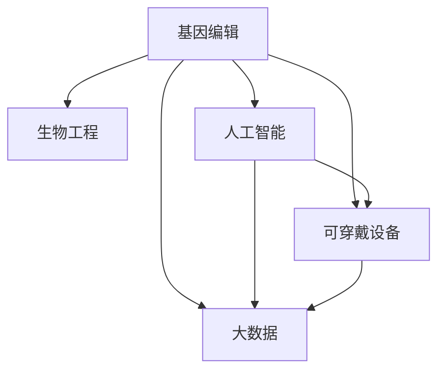

                 

# AI时代的人类增强：道德考虑与身体增强的未来发展机遇分析机遇挑战趋势

> 关键词：人类增强,身体增强,人工智能,技术伦理,基因编辑,生物工程,可穿戴设备,大数据,隐私保护,医疗健康,伦理道德

## 1. 背景介绍

### 1.1 问题由来

在AI时代，人类增强技术（Human Augmentation Technology）成为了备受关注的话题。通过基因编辑、生物工程、可穿戴设备、大数据等手段，人类拥有了前所未有的增强能力，包括智力、体力、感知力等方面。这一趋势在很大程度上提升了人类的生产力和生活质量，但也带来了许多伦理道德问题和潜在风险。如何平衡技术进步与伦理规范，成为当前亟待解决的问题。

### 1.2 问题核心关键点

人类增强技术涵盖了广泛的研究领域，包括基因编辑、生物工程、人工智能、可穿戴设备、大数据等。这些技术在推动人类进步的同时，也引发了诸多伦理道德问题，如基因隐私、歧视、公平性等。这些问题不仅仅是技术问题，更是社会、法律、伦理等多方面的综合挑战。

人类增强技术的核心关键点在于：
- **基因编辑与基因治疗**：通过基因编辑技术，实现人类遗传物质的改变，用于治疗遗传疾病、提高智力、延长寿命等。
- **生物工程**：利用生物技术，改变人类生理结构和功能，如植入人工器官、增强肌肉力量等。
- **人工智能**：通过智能算法和机器学习，增强人类的认知和决策能力。
- **可穿戴设备**：利用智能硬件，监测和优化人类的生理参数，如心率、血压、血糖等。
- **大数据**：通过分析人类行为数据，预测和优化人类活动，提高效率和安全性。

这些技术的发展，为人类的生产、生活带来了诸多机遇，但也伴随着伦理道德和法律问题，需要在技术开发和应用中加以慎重考虑。

## 2. 核心概念与联系

### 2.1 核心概念概述

为了更好地理解人类增强技术，本文将介绍几个密切相关的核心概念：

- **基因编辑（Gene Editing）**：通过CRISPR、TALEN等技术，对人类遗传物质进行精准修改，用于治疗疾病、提升智力等。
- **生物工程（Biotechnology）**：利用生物技术，改变人类生理结构和功能，如植入人工器官、增强肌肉力量等。
- **人工智能（AI）**：通过智能算法和机器学习，增强人类的认知和决策能力。
- **可穿戴设备（Wearable Devices）**：利用智能硬件，监测和优化人类的生理参数，如心率、血压、血糖等。
- **大数据（Big Data）**：通过分析人类行为数据，预测和优化人类活动，提高效率和安全性。

这些核心概念之间的逻辑关系可以通过以下Mermaid流程图来展示：



这个流程图展示了大人类增强技术中的核心概念及其之间的关系：

1. **基因编辑与生物工程**：基因编辑技术可以通过改变人类遗传物质来提升人体机能，而生物工程则通过改变生理结构来实现增强。
2. **人工智能与大数据**：AI通过智能算法提升人类的认知和决策能力，大数据则通过分析人类行为数据来优化活动。
3. **人工智能与可穿戴设备**：AI可以通过智能算法分析可穿戴设备采集的生理参数，提供个性化的健康管理建议。
4. **大数据与可穿戴设备**：大数据可以通过分析可穿戴设备采集的生理参数，提供健康预测和优化方案。

## 3. 核心算法原理 & 具体操作步骤
### 3.1 算法原理概述

人类增强技术涉及多个领域，其核心算法原理各有不同，但都围绕着如何利用技术手段提升人类自身能力展开。

以基因编辑为例，其基本原理是通过特定的编辑工具，如CRISPR-Cas9，对目标基因进行精确切割，并进行修复或替换，从而改变基因序列。类似地，生物工程利用细胞培养、组织工程等技术，通过植入人工器官、增强肌肉力量等手段实现身体增强。人工智能则通过机器学习算法，利用大数据分析优化决策和认知能力。可穿戴设备通过传感器采集生理参数，结合AI算法进行分析，提供个性化的健康管理建议。大数据则通过分析人类行为数据，提供预测和优化方案。

### 3.2 算法步骤详解

以基因编辑技术为例，其基本步骤包括：

1. **目标基因识别**：确定需要编辑的目标基因，如治疗遗传性疾病、提高智力等。
2. **设计编辑工具**：选择合适的基因编辑工具，如CRISPR-Cas9，并设计相应的核酸序列。
3. **细胞培养**：从患者体内提取细胞，并在实验室中进行培养。
4. **基因编辑**：利用编辑工具，对目标基因进行精确切割和修复。
5. **基因移植**：将编辑后的细胞移植回患者体内。
6. **效果评估**：通过跟踪患者的恢复情况，评估基因编辑的效果。

### 3.3 算法优缺点

人类增强技术在提升人类能力的同时，也存在诸多缺点和风险：

**优点**：
- **提升人类能力**：通过基因编辑、生物工程等手段，人类可以提升智力、体力、感知力等方面。
- **治疗疾病**：通过基因编辑技术，可以治疗许多遗传性疾病，提升患者生活质量。
- **优化健康管理**：通过可穿戴设备和AI算法，可以实现个性化的健康管理和疾病预防。

**缺点**：
- **技术风险**：基因编辑和生物工程技术存在一定的失败率和副作用，可能带来不可预测的风险。
- **伦理问题**：基因编辑涉及人类遗传物质的改变，可能引发基因歧视、伦理道德问题等。
- **数据隐私**：可穿戴设备和大数据技术涉及大量个人信息，可能带来隐私泄露和数据滥用问题。

### 3.4 算法应用领域

人类增强技术在多个领域都有广泛应用，包括医疗健康、教育、运动、军事等。

- **医疗健康**：基因编辑技术用于治疗遗传性疾病，生物工程用于植入人工器官，AI和大数据用于个性化健康管理。
- **教育**：通过AI和大数据，优化教育资源配置，提升教育质量。
- **运动**：生物工程和基因编辑技术用于增强运动员的体力和耐力。
- **军事**：利用AI和大数据，优化军事指挥和决策。

## 4. 数学模型和公式 & 详细讲解 & 举例说明

### 4.1 数学模型构建

以基因编辑为例，基因编辑的数学模型可以表示为：

$$
P_{\text{编辑}} = f(C, S, T)
$$

其中：
- $P_{\text{编辑}}$ 表示基因编辑的精准性和成功率。
- $C$ 表示细胞培养条件。
- $S$ 表示编辑工具的设计和优化。
- $T$ 表示基因移植后的跟踪和效果评估。

### 4.2 公式推导过程

基因编辑的精准性和成功率受到多种因素的影响，如细胞培养条件、编辑工具的设计和优化、基因移植后的跟踪和效果评估等。可以通过以下公式进行推导：

$$
P_{\text{编辑}} = \exp\left(-\frac{\Delta C^2}{2\sigma_C^2}\right)\exp\left(-\frac{\Delta S^2}{2\sigma_S^2}\right)\exp\left(-\frac{\Delta T^2}{2\sigma_T^2}\right)
$$

其中，$\Delta C$、$\Delta S$、$\Delta T$ 分别为细胞培养条件、编辑工具设计和优化、基因移植后跟踪和效果评估的偏差。$\sigma_C$、$\sigma_S$、$\sigma_T$ 分别为这些因素的标准差。

### 4.3 案例分析与讲解

以CRISPR-Cas9为例，基因编辑的精度可以通过以下步骤进行评估：

1. **细胞培养条件优化**：通过实验确定最佳的培养条件，如温度、氧气、营养液等。
2. **编辑工具设计和优化**：通过设计和优化核酸序列，提高编辑效率和成功率。
3. **基因移植后的跟踪和效果评估**：通过实时监测基因编辑后的细胞变化，评估编辑效果和副作用。

## 5. 项目实践：代码实例和详细解释说明
### 5.1 开发环境搭建

在进行人类增强技术项目开发前，需要准备好开发环境。以下是使用Python进行基因编辑项目开发的流程：

1. **安装Anaconda**：从官网下载并安装Anaconda，用于创建独立的Python环境。
2. **创建并激活虚拟环境**：
```bash
conda create -n gene-editing python=3.8 
conda activate gene-editing
```
3. **安装相关库**：
```bash
conda install numpy pandas matplotlib scipy biopython
```
4. **下载基因编辑工具**：
```bash
git clone https://github.com/Crispr-Cas9/Cas9.git
cd Cas9
python setup.py install
```
5. **下载基因序列数据**：
```bash
wget https://www.ncbi.nlm.nih.gov/genomes/downloads/assemblies_all.tar.gz
tar -xvf assemblies_all.tar.gz
```
6. **启动Jupyter Notebook**：
```bash
jupyter notebook
```

### 5.2 源代码详细实现

以下是使用Python进行基因编辑项目开发的代码实现：

```python
import numpy as np
from craspy import Cas9

# 创建基因编辑实例
cas9 = Cas9()

# 设置基因编辑参数
guide_rna = 'GATCAGTCA'
target_site = 'ATGGGGCCAGCGCGGAGACGAGCAGTTCAAGGAGGCCGAGGGACCCGGCGGAGGTCAAGCCGCAAGGGCGGCCGCACAGCGCCATGCGGCCATGTGCCATGCGGGCGGAATGGAGGATGCCGCCGGCCGAGGGATGCCCGATGGAACGGGCGGCGGCAAGCCCGCGGGCGGCCGATGCCGCCCGGCCGCCGGCGGCCAGGGCGCGGACCGGGCCGGCGGCGACAGGACGCCGGCGGCGGCAGCGCGCGCGCACGCCGAGGCCAGCAGGTGCCGGGCATGCCGCGCGCCCGACCGGACAGCGATGACCGCACGATGCCGCGACGGGACGGGCGCCGCAGGCCGCATGGGCGCCCGGGTGGCCGGCAAGCGGCGGGGGGGCGCGGCCGCGGCGGCGGTGCCGGCGAGGCGCGGGCGGGCGCGGCGGCGCCGGCGGGCCGGGCGGCAACCCCGGGGCGGGCGGCGGCAGCGCGGCGGCGGCCGAGGCGACCCGCGGCACGGGGGCCGCCCGGGCGCGCAGGGCGCGGGGCCGGCGGGCCGGCGGCGGCGGCGGCGCCGCGGCGACGCAGACGGCGGCCGGCCGGCGCGGCACGCCGGCGACGCCGGCGGGCGCCGGGCCGGCGAGGCGGCCGGCGGCGGCGGCGACGGCCGCGGCGCGCCGCGGGCGCGGGCGGCGGCGGCGCGCGGCGGCGGCCGCGCCGGCGCCGCGCGCCGCGGCCGCGCGCGGGCGCCCGGGCGCCGCCGCCGCCGCGGCGGCGCCGGCGCCGCGGCGGCCGGCGGCGCCGGCGGGCGGCGGCGGCCGCGGCGGCGCGGCGGCGGCCGGCGCGGCGGGCGCGCGCGCCGCCGCGCCGCGCGCGGCCGCGCGCCGCGCCGCGGGCGGCCGCGGCGCGGCGGCGGCGCGCGGCCGCGGCGGCCGCGGCCGCGGCGGCGGCCGCCGCGGCGGCGGCCGCCGCGGCCGCGGCCGCCGCGGCCGCGGCGGCGGCGGCGGCGGCCGCGCGCCGCGCGCGGCGCGGCCGCGCCGCGGCCGCGGCCGCGGCGGCGCGGCGCGGCCGCCGCCGCGCGGCGGCCGCGGCGCCGCCGCGGCCGCCGCCGCCGCGGCGGCGGCCGCGGCGGCCGCGGCGCGCGCGCCGCGCGCGCCGCGCGCGGCGCGCGGCGCGCCGCGGCGCGGCCGCGGCGCGGCCGCGCCGCCGCGGCGCGGCGGCGGCCGCGGCGCGGCGGCGGCGCGGCGCGGCGGCCGCGGCGCGGCGGCGGCCGCGGCGGCGGCCGCGGCGGCCGCGGCGGCGGCCGCGGCGGCGGCGGCGGCCGCGGCGGCGGCGGCGGCCGCGGCGGCGGCCGCGGCGGCGGCGGCGGCGGCGGCGGCGGCGGCCGCGGCGGCCGCGGCGGCGGCGGCGGCGGCGGCGGCGGCGGCCGCGGCGGCGGCGGCGGCGGCGGCGGCGGCGGCGGCCGCGGCGGCGGCGGCGGCGGCGGCGGCGGCGGCGGCGGCGGCGGCGGCCGCGGCGGCCGCGGCGGCGGCCGCGGCGGCGGCGGCGGCGGCGGCGGCGGCGGCGGCCGCGGCGGCGGCGGCCGCGGCGGCGGCGGCGGCGGCGGCGGCGGCGGCGGCGGCGGCCGCGGCGGCGGCCGCGGCGGCCGCGGCGGCGGCGGCGGCGGCGGCGGCGGCGGCCGCGGCGGCGGCGGCGGCCGCGGCGGCGGCGGCGGCGGCGGCCGCGGCGGCGGCCGCGGCGGCGGCGGCGGCGGCGGCGGCGGCGGCGGCCGCGGCGGCGGCGGCGGCCGCGGCGGCGGCGGCGGCGGCGGCGGCGGCGGCGGCGGCCGCGGCGGCCGCGGCGGCGGCGGCGGCGGCGGCGGCGGCGGCGGCCGCGGCGGCGGCGGCGGCGGCGGCGGCCGCGGCGGCGGCGGCGGCGGCCGCGGCGGCGGCGGCGGCGGCGGCGGCGGCCGCGGCGGCGGCGGCGGCGGCGGCCGCGGCGGCCGCGGCGGCCGCGGCGGCGGCGGCGGCGGCCGCGGCGGCCGCGGCGGCGGCGGCGGCGGCGGCCGCGGCGGCGGCCGCGGCGGCGGCGGCGGCGGCGGCCGCGGCGGCGGCGGCGGCGGCCGCGGCGGCGGCGGCGGCGGCGGCGGCGGCCGCGGCGGCGGCCGCGGCGGCGGCGGCGGCGGCGGCGGCGGCGGCGGCGGCGGCGGCGGCCGCGGCGGCGGCCGCGGCGGCGGCGGCGGCGGCGGCGGCGGCGGCCGCGGCGGCGGCGGCGGCGGCGGCGGCGGCGGCGGCGGCGGCGGCCGCGGCGGCGGCCGCGGCGGCGGCGGCGGCGGCGGCGGCGGCGGCGGCGGCGGCGGCGGCGGCCGCGGCGGCGGCCGCGGCGGCGGCGGCGGCGGCGGCGGCGGCCGCGGCGGCGGCGGCGGCGGCGGCGGCGGCGGCCGCGGCGGCGGCCGCGGCGGCGGCGGCGGCGGCGGCGGCGGCGGCGGCGGCCGCGGCGGCGGCGGCGGCGGCGGCGGCGGCGGCCGCGGCGGCGGCGGCGGCCGCGGCGGCGGCGGCGGCGGCGGCGGCGGCGGCGGCCGCGGCGGCGGCCGCGGCGGCGGCGGCGGCGGCGGCGGCGGCGGCGGCGGCGGCGGCCGCGGCGGCCGCGGCGGCGGCGGCGGCGGCGGCGGCGGCGGCCGCGGCGGCGGCGGCCGCGGCGGCGGCGGCGGCGGCGGCGGCGGCGGCCGCGGCGGCCGCGGCGGCCGCGGCGGCGGCGGCGGCGGCGGCGGCCGCGGCGGCGGCGGCGGCGGCCGCGGCGGCGGCGGCGGCGGCGGCCGCGGCGGCGGCGGCGGCCGCGGCGGCGGCGGCGGCGGCCGCGGCGGCGGCGGCGGCGGCGGCGGCGGCCGCGGCGGCCGCGGCGGCGGCCGCGGCGGCGGCGGCGGCGGCGGCGGCGGCGGCCGCGGCGGCGGCGGCGGCGGCGGCGGCCGCGGCGGCGGCGGCGGCGGCCGCGGCGGCGGCGGCGGCCGCGGCGGCGGCGGCGGCCGCGGCGGCGGCCGCGGCGGCGGCGGCGGCGGCGGCCGCGGCGGCGGCCGCGGCGGCGGCGGCGGCGGCGGCGGCCGCGGCGGCGGCGGCCGCGGCGGCCGCGGCGGCGGCGGCGGCGGCGGCCGCGGCGGCCGCGGCGGCCGCGGCGGCGGCGGCGGCGGCGGCGGCGGCCGCGGCGGCGGCGGCCGCGGCGGCGGCGGCGGCGGCGGCCGCGGCGGCGGCCGCGGCGGCGGCGGCCGCGGCGGCGGCGGCGGCCGCGGCGGCGGCCGCGGCGGCCGCGGCGGCCGCGGCGGCGGCCGCGGCGGCCGCGGCGGCGGCCGCGGCGGCGGCGGCCGCGGCGGCCGCGGCGGCCGCGGCGGCCGCGGCGGCGGCCGCGGCCGCGGCGGCCGCGGCGGCGGCGGCGGCGGCGGCGGCCGCGGCGGCGGCGGCGGCGGCGGCGGCGGCCGCGGCGGCCGCGGCGGCCGCGGCGGCCGCGGCGGCGGCGGCGGCGGCGGCGGCGGCGGCGGCCGCGGCGGCGGCGGCGGCGGCCGCGGCGGCGGCGGCGGCGGCCGCGGCGGCCGCGGCGGCGGCGGCGGCGGCGGCGGCCGCGGCGGCCGCGGCGGCCGCGGCGGCCGCGGCGGCCGCGGCGGCGGCGGCGGCGGCGGCGGCGGCGGCCGCGGCGGCGGCGGCGGCCGCGGCGGCCGCGGCGGCGGCGGCGGCGGCCGCGGCGGCCGCGGCGGCCGCGGCGGCCGCGGCGGCCGCGGCGGCCGCGGCGGCGGCGGCCGCGGCGGCGGCCGCGGCGGCCGCGGCGGCCGCGGCGGCGGCGGCGGCCGCGGCGGCCGCGGCGGCGGCGGCGGCCGCGGCGGCCGCGGCGGCGGCGGCGGCGGCCGCGGCGGCCGCGGCGGCGGCGGCGGCCGCGGCGGCCGCGGCGGCGGCGGCGGCGGCCGCGGCGGCGGCCGCGGCGGCGGCGGCCGCGGCGGCCGCGGCGGCGGCGGCGGCCGCGGCGGCGGCGGCGGCGGCCGCGGCGGCGGCGGCGGCGGCGGCGGCGGCCGCGGCGGCCGCGGCGGCGGCGGCGGCCGCGGCGGCCGCGGCGGCGGCGGCGGCGGCCGCGGCGGCGGCGGCGGCGGCCGCGGCGGCGGCGGCCGCGGCGGCGGCGGCGGCGGCGGCGGCGGCGGCGGCGGCCGCGGCGGCGGCGGCGGCCGCGGCGGCGGCGGCGGCGGCGGCGGCGGCCGCGGCGGCGGCGGCGGCGGCGGCGGCGGCGGCGGCGGCGGCCGCGGCGGCGGCGGCGGCGGCGGCGGCGGCGGCGGCGGCGGCCGCGGCGGCGGCGGCGGCGGCGGCGGCGGCGGCGGCGGCCGCGGCGGCGGCGGCGGCGGCGGCGGCGGCGGCGGCGGCGGCGGCCGCGGCGGCGGCGGCGGCGGCGGCGGCGGCGGCGGCGGCGGCGGCGGCCGCGGCGGCGGCGGCGGCGGCGGCGGCGGCGGCGGCGGCGGCGGCCGCGGCGGCGGCGGCGGCGGCGGCGGCGGCGGCGGCGGCGGCGGCGGCGGCGGCCGCGGCGGCGGCGGCGGCGGCGGCGGCGGCGGCGGCGGCCGCGGCGGCGGCGGCGGCGGCGGCGGCGGCGGCGGCGGCGGCCGCGGCGGCGGCGGCGGCGGCGGCGGCGGCGGCGGCGGCGGCGGCGGCGGCCGCGGCGGCGGCGGCGGCGGCGGCGGCGGCGGCGGCGGCGGCCGCGGCGGCGGCGGCGGCGGCGGCGGCGGCGGCGGCCGCGGCGGCGGCGGCGGCGGCGGCGGCGGCGGCCGCGGCGGCGGCGGCGGCCGCGGCGGCGGCGGCGGCGGCGGCGGCGGCCGCGGCGGCGGCGGCGGCCGCGGCGGCGGCGGCGGCGGCGGCGGCGGCGGCCGCGGCGGCGGCGGCGGCGGCCGCGGCGGCGGCGGCGGCGGCGGCGGCCGCGGCGGCGGCGGCGGCCGCGGCGGCGGCGGCGGCGGCGGCCGCGGCGGCGGCGGCGGCCGCGGCGGCGGCGGCGGCCGCGGCGGCGGCGGCGGCGGCCGCGGCGGCGGCGGCGGCGGCGGCCGCGGCGGCGGCGGCGGCGGCGGCGGCGGCGGCCGCGGCGGCGGCGGCGGCGGCCGCGGCGGCGGCGGCGGCGGCGGCGGCGGCCGCGGCGGCGGCGGCGGCGGCGGCGGCGGCGGCGGCGGCCGCGGCGGCGGCGGCGGCGGCGGCGGCGGCGGCGGCCGCGGCGGCGGCGGCGGCGGCGGCGGCGGCGGCGGCGGCGGCGGCGGCGGCCGCGGCGGCGGCGGCGGCGGCGGCGGCGGCGGCGGCGGCGGCCGCGGCGGCGGCGGCGGCGGCGGCGGCGGCGGCGGCGGCCGCGGCGGCGGCGGCGGCGGCGGCGGCGGCGGCGGCGGCCGCGGCGGCGGCGGCGGCGGCGGCGGCGGCGGCGGCGGCGGCGGCGGCGGCGGCCGCGGCGGCGGCGGCGGCGGCGGCGGCGGCGGCGGCGGCGGCCGCGGCGGCGGCGGCGGCGGCGGCGGCGGCGGCGGCGGCGGCCGCGGCGGCGGCGGCGGCGGCGGCGGCGGCGGCGGCGGCGGCGGCCGCGGCGGCGGCGGCGGCGGCGGCGGCGGCGGCGGCGGCGGCCGCGGCGGCGGCGGCGGCGGCGGCGGCGGCGGCGGCGGCGGCCGCGGCGGCGGCGGCGGCGGCGGCGGCGGCGGCGGCGGCGGCGGCGGCGGCCGCGGCGGCGGCGGCGGCGGCGGCGGCGGCGGCGGCGGCGGCGGCCGCGGCGGCGGCGGCGGCGGCGGCGGCGGCGGCGGCGGCGGCGGCGGCCGCGGCGGCGGCGGCGGCGGCGGCGGCGGCGGCGGCGGCGGCGGCCGCGGCGGCGGCGGCGGCGGCGGCGGCGGCGGCGGCGGCGGCGGCGGCGGCCGCGGCGGCGGCGGCGGCGGCGGCGGCGGCGGCGGCGGCGGCGGCCGCGGCGGCGGCGGCGGCGGCGGCGGCGGCGGCGGCGGCGGCCGCGGCGGCGGCGGCGGCGGCGGCGGCGGCGGCGGCGGCGGCGGCGGCGGCGGCCGCGGCGGCGGCGGCGGCGGCGGCGGCGGCGGCGGCGGCGGCGGCGGCGGCCGCGGCGGCGGCGGCGGCGGCGGCGGCGGCGGCGGCGGCGGCGGCCGCGGCGGCGGCGGCGGCGGCGGCGGCGGCGGCGGCGGCGGCGGCCGCGGCGGCGGCGGCGGCGGCGGCGGCGGCGGCGGCGGCGGCGGCGGCGGCGGCGGCCGCGGCGGCGGCGGCGGCGGCGGCGGCGGCGGCGGCGGCGGCGGCGGCGGCCGCGGCGGCGGCGGCGGCGGCGGCGGCGGCGGCGGCGGCGGCCGCGGCGGCGGCGGCGGCGGCGGCGGCGGCGGCGGCGGCGGCGGCCGCGGCGGCGGCGGCGGCGGCGGCGGCGGCGGCGGCGGCGGCGGCGGCGGCGGCCGCGGCGGCGGCGGCGGCGGCGGCGGCGGCGGCGGCGGCGGCGGCGGCGGCGGCGGCCGCGGCGGCGGCGGCGGCGGCGGCGGCGGCGGCGGCGGCGGCGGCGGCGGCCGCGGCGGCGGCGGCGGCGGCGGCGGCGGCGGCGGCGGCGGCGGCCGCGGCGGCGGCGGCGGCGGCGGCGGCGGCGGCGGCGGCGGCGGCGGCCGCGGCGGCGGCGGCGGCGGCGGCGGCGGCGGCGGCGGCGGCGGCGGCCGCGGCGGCGGCGGCGGCGGCGGCGGCGGCGGCGGCGGCGGCGGCGGCGGCGGCCGCGGCGGCGGCGGCGGCGGCGGCGGCGGCGGCGGCGGCGGCGGCGGCGGCGGCCGCGGCGGCGGCGGCGGCGGCGGCGGCGGCGGCGGCGGCGGCGGCGGCGGCGGCGGCCGCGGCGGCGGCGGCGGCGGCGGCGGCGGCGGCGGCGGCGGCGGCGGCGGCGGCGGCGGCGGCGGCGGCGGCGGCGGCGGCGGCGGCGGCGGCGGCGGCGGCGGCGGCGGCGGCGGCGGCGGCGGCGGCGGCGGCGGCGGCGGCGGCGGCGGCGGCGGCGGCGGCGGCGGCGGCGGCGGCGGCGGCGGCGGCGGCGGCGGCGGCGGCGGCGGCGGCGGCGGCGGCGGCGGCGGCGGCGGCGGCGGCGGCGGCGGCGGCGGCGGCGGCGGCGGCGGCGGCGGCGGCGGCGGCGGCGGCGGCGGCGGCGGCGGCGGCGGCGGCGGCGGCGGCGGCGGCGGCGGCGGCGGCGGCGGCGGCGGCGGCGGCGGCGGCGGCGGCGGCGGCGGCGGCGGCGGCGGCGGCGGCGGCGGCGGCGGCGGCGGCGGCGGCGGCGGCGGCGGCGGCGGCGGCGGCGGCGGCGGCGGCGGCGGCGGCGGCGGCGGCGGCGGCGGCGGCGGCGGCGGCGGCGGCGGCGGCGGCGGCGGCGGCGGCGGCGGCGGCGGCGGCGGCGGCGGCGGCGGCGGCGGCGGCGGCGGCGGCGGCGGCGGCGGCGGCGGCGGCGGCGGCGGCGGCGGCGGCGGCGGCGGCGGCGGCGGCGGCGGCGGCGGCGGCGGCGGCGGCGGCGGCGGCGGCGGCGGCGGCGGCGGCGGCGGCGGCGGCGGCGGCGGCGGCGGCGGCGGCGGCGGCGGCGGCGGCGGCGGCGGCGGCGGCGGCGGCGGCGGCGGCGGCGGCGGCGGCGGCGGCGGCGGCGGCGGCGGCGGCGGCGGCGGCGGCGGCGGCGGCGGCGGCGGCGGCGGCGGCGGCGGCGGCGGCGGCGGCGGCGGCGGCGGCGGCGGCGGCGGCGGCGGCGGCGGCGGCGGCGGCGGCGGCGGCGGCGGCGGCGGCGGCGGCGGCGGCGGCGGCGGCGGCGGCGGCGGCGGCGGCGGCGGCGGCGGCGGCGGCGGCGGCGGCGGCGGCGGCGGCGGCGGCGGCGGCGGCGGCGGCGGCGGCGGCGGCGGCGGCGGCGGCGGCGGCGGCGGCGGCGGCGGCGGCGGCGGCGGCGGCGGCGGCGGCGGCGGCGGCGGCGGCGGCGGCGGCGGCGGCGGCGGCGGCGGCGGCGGCGGCGGCGGCGGCGGCGGCGGCGGCGGCGGCGGCGGCGGCGGCGGCGGCGGCGGCGGCGGCGGCGGCGGCGGCGGCGGCGGCGGCGGCGGCGGCGGCGGCGGCGGCGGCGGCGGCGGCGGCGGCGGCGGCGGCGGCGGCGGCGGCGGCGGCGGCGGCGGCGGCGGCGGCGGCGGCGGCGGCGGCGGCGGCGGCGGCGGCGGCGGCGGCGGCGGCGGCGGCGGCGGCGGCGGCGGCGGCGGCGGCGGCGGCGGCGGCGGCGGCGGCGGCGGCGGCGGCGGCGGCGGCGGCGGCGGCGGCGGCGGCGGCGGCGGCGGCGGCGGCGGCGGCGGCGGCGGCGGCGGCGGCGGCGGCGGCGGCGGCGGCGGCGGCGGCGGCGGCGGCGGCGGCGGCGGCGGCGGCGGCGGCGGCGGCGGCGGCGGCGGCGGCGGCGGCGGCGGCGGCGGCGGCGGCGGCGGCGGCGGCGGCGGCGGCGGCGGCGGCGGCGGCGGCGGCGGCGGCGGCGGCGGCGGCGGCGGCGGCGGCGGCGGCGGCGGCGGCGGCGGCGGCGGCGGCGGCGGCGGCGGCGGCGGCGGCGGCGGCGGCGGCGGCGGCGGCGGCGGCGGCGGCGGCGGCGGCGGCGGCGGCGGCGGCGGCGGCGGCGGCGGCGGCGGCGGCGGCGGCGGCGGCGGCGGCGGCGGCGGCGGCGGCGGCGGCGGCGGCGGCGGCGGCGGCGGCGGCGGCGGCGGCGGCGGCGGCGGCGGCGGCGGCGGCGGCGGCGGCGGCGGCGGCGGCGGCGGCGGCGGCGGCGGCGGCGGCGGCGGCGGCGGCGGCGGCGGCGGCGGCGGCGGCGGCGGCGGCGGCGGCGGCGGCGGCGGCGGCGGCGGCGGCGGCGGCGGCGGCGGCGGCGGCGGCGGCGGCGGCGGCGGCGGCGGCGGCGGCGGCGGCGGCGGCGGCGGCGGCGGCGGCGGCGGCGGCGGCGGCGGCGGCGGCGGCGGCGGCGGCGGCGGCGGCGGCGGCGGCGGCGGCGGCGGCGGCGGCGGCGGCGGCGGCGGCGGCGGCGGCGGCGGCGGCGGCGGCGGCGGCGGCGGCGGCGGCGGCGGCGGCGGCGGCGGCGGCGGCGGCGGCGGCGGCGGCGGCGGCGGCGGCGGCGGCGGCGGCGGCGGCGGCGGCGGCGGCGGCGGCGGCGGCGGCGGCGGCGGCGGCGGCGGCGGCGGCGGCGGCGGCGGCGGCGGCGGCGGCGGCGGCGGCGGCGGCGGCGGCGGCGGCGGCGGCGGCGGCGGCGGCGGCGGCGGCGGCGGCGGCGGCGGCGGCGGCGGCGGCGGCGGCGGCGGCGGCGGCGGCGGCGGCGGCGGCGGCGGCGGCGGCGGCGGCGGCGGCGGCGGCGGCGGCGGCGGCGGCGGCGGCGGCGGCGGCGGCGGCGGCGGCGGCGGCGGCGGCGGCGGCGGCGGCGGCGGCGGCGGCGGCGGCGGCGGCGGCGGCGGCGGCGGCGGCGGCGGCGGCGGCGGCGGCGGCGGCGGCGGCGGCGGCGGCGGCGGCGGCGGCGGCGGCGGCGGCGGCGGCGGCGGCGGCGGCGGCGGCGGCGGCGGCGGCGGCGGCGGCGGCGGCGGCGGCGGCGGCGGCGGCGGCGGCGGCGGCGGCGGCGGCGGCGGCGGCGGCGGCGGCGGCGGCGGCGGCGGCGGCGGCGGCGGCGGCGGCGGCGGCGGCGGCGGCGGCGGCGGCGGCGGCGGCGGCGGCGGCGGCGGCGGCGGCGGCGGCGGCGGCGGCGGCGGCGGCGGCGGCGGCGGCGGCGGCGGCGGCGGCGGCGGCGGCGGCGGCGGCGGCGGCGGCGGCGGCGGCGGCGGCGGCGGCGGCGGCGGCGGCGGCGGCGGCGGCGGCGGCGGCGGCGGCGGCGGCGGCGGCGGCGGCGGCGGCGGCGGCGGCGGCGGCGGCGGCGGCGGCGGCGGCGGCGGCGGCGGCGGCGGCGGCGGCGGCGGCGGCGGCGGCGGCGGCGGCGGCGGCGGCGGCGGCGGCGGCGGCGGCGGCGGCGGCGGCGGCGGCGGCGGCGGCGGCGGCGGCGGCGGCGGCGGCGGCGGCGGCGGCGGCGGCGGCGGCGGCGGCGGCGGCGGCGGCGGCGGCGGCGGCGGCGGCGGCGGCGGCGGCGGCGGCGGCGGCGGCGGCGGCGGCGGCGGCGGCGGCGGCGGCGGCGGCGGCGGCGGCGGCGGCGGCGGCGGCGGCGGCGGCGGCGGCGGCGGCGGCGGCGGCGGCGGCGGCGGCGGCGGCGGCGGCGGCGGCGGCGGCGGCGGCGGCGGCGGCGGCGGCGGCGGCGGCGGCGGCGGCGGCGGCGGCGGCGGCGGCGGCGGCGGCGGCGGCGGCGGCGGCGGCGGCGGCGGCGGCGGCGGCGGCGGCGGCGGCGGCGGCGGCGGCGGCGGCGGCGGCGGCGGCGGCGGCGGCGGCGGCGGCGGCGGCGGCGGCGGCGGCGGCGGCGGCGGCGGCGGCGGCGGCGGCGGCGGCGGCGGCGGCGGCGGCGGCGGCGGCGGCGGCGGCGGCGGCGGCGGCGGCGGCGGCGGCGGCGGCGGCGGCGGCGGCGGCGGCGGCGGCGGCGGCGGCGGCGGCGGCGGCGGCGGCGGCGGCGGCGGCGGCGGCGGCGGCGGCGGCGGCGGCGGCGGCGGCGGCGGCGGCGGCGGCGGCGGCGGCGGCGGCGGCGGCGGCGGCGGCGGCGGCGGCGGCGGCGGCGGCGGCGGCGGCGGCGGCGGCGGCGGCGGCGGCGGCGGCGGCGGCGGCGGCGGCGGCGGCGGCGGCGGCGGCGGCGGCGGCGGCGGCGGCGGCGGCGGCGGCGGCGGCGGCGGCGGCGGCGGCGGCGGCGGCGGCGGCGGCGGCGGCGGCGGCGGCGGCGGCG

