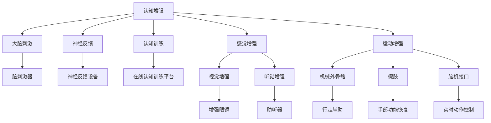

                 

# AI时代的人类增强：道德考虑与身体增强的未来发展策略

> 关键词：人工智能增强、身体增强技术、道德伦理、可穿戴设备、生物工程、生物伦理学

## 1. 背景介绍

### 1.1 问题由来
随着科技的快速发展，人工智能（AI）与人类的融合日益深入，为人类带来了前所未有的机遇与挑战。在AI时代，增强人体能力成为众多研究者与企业关注的热点。通过生物工程与AI技术的结合，增强人类感知、认知、运动等能力成为可能。但这些技术带来的增强能力，也引发了伦理、隐私、安全等一系列复杂的道德问题。

## 2. 核心概念与联系

### 2.1 核心概念概述

增强技术（Enhancement Technologies）指的是通过生物工程与AI等手段，提升人类个体在感知、认知、运动等方面能力的各种技术。这些技术主要分为三类：认知增强（Cognitive Enhancement）、感觉增强（Sensory Enhancement）、运动增强（Motor Enhancement）。

1. **认知增强**：包括大脑刺激、神经反馈、认知训练等技术，用于提升学习能力、记忆力、注意力等认知能力。
2. **感觉增强**：通过视觉增强、听觉增强等技术，提高个体的感觉器官感知能力。
3. **运动增强**：使用机械外骨骼、假肢、脑机接口等技术，增强人体的体力和协调能力。

这些增强技术在推动人类进步的同时，也带来了诸多伦理问题。例如，增强能力的公平性问题、隐私保护问题、人身安全问题等。

### 2.2 核心概念原理和架构的 Mermaid 流程图(Mermaid 流程节点中不要有括号、逗号等特殊字符)



这个流程图展示了增强技术的主要分类及其代表性设备和技术。

## 3. 核心算法原理 & 具体操作步骤

### 3.1 算法原理概述

增强技术通常采用AI技术来辅助提升人体能力。以认知增强为例，常用的AI技术包括深度学习、强化学习等。例如，使用深度学习模型进行脑电信号的分类和识别，实现神经反馈；使用强化学习算法优化认知训练方案，提高学习效果。

### 3.2 算法步骤详解

以**脑电信号分类**为例，其操作步骤如下：

1. **数据采集**：使用脑电信号采集设备，如脑电帽，采集用户的脑电信号。
2. **预处理**：对采集的信号进行去噪、滤波等预处理操作，提高数据质量。
3. **特征提取**：使用深度学习模型提取信号的特征向量，如卷积神经网络（CNN）、长短期记忆网络（LSTM）等。
4. **模型训练**：使用大量标注数据训练分类模型，如支持向量机（SVM）、随机森林（Random Forest）等。
5. **模型测试**：在测试集上评估模型的分类精度，调整模型参数。

### 3.3 算法优缺点

增强技术的AI算法具有以下优点：

- **高效性**：通过自动化处理大量数据，提高分析效率。
- **准确性**：深度学习等技术能够处理复杂的非线性关系，提高分类精度。

但同时也有以下缺点：

- **依赖高质量数据**：模型的训练效果依赖于高质量的标注数据，数据获取成本较高。
- **复杂性高**：算法实现复杂，需要专业知识支持。
- **隐私问题**：脑电信号等生物数据涉及隐私，处理不当可能引发伦理问题。

### 3.4 算法应用领域

增强技术广泛应用于医疗、教育、运动等多个领域：

- **医疗领域**：通过认知增强技术提升医生诊断能力；使用感觉增强技术提高患者康复效果；利用运动增强技术帮助残疾人士恢复运动功能。
- **教育领域**：通过认知训练提高学习效率；使用视觉增强技术改善课堂体验；利用运动增强技术增强体育教学效果。
- **运动领域**：使用机械外骨骼技术增强体能训练；通过脑机接口技术实现运动控制。

## 4. 数学模型和公式 & 详细讲解 & 举例说明

### 4.1 数学模型构建

以**脑电信号分类**为例，构建如下数学模型：

设脑电信号数据为 $x_i$，$i=1,...,N$，其中 $N$ 为样本数。设脑电信号的特征向量为 $f_i=(f_{i1},f_{i2},...,f_{in})$，其中 $n$ 为特征维度。设脑电信号的分类标签为 $y_i \in \{0,1\}$，其中 $0$ 表示非刺激状态，$1$ 表示刺激状态。

### 4.2 公式推导过程

使用支持向量机（SVM）进行脑电信号分类，其数学模型为：

$$
\min_{\alpha, \beta} \frac{1}{2} \|\alpha\|^2 + \frac{1}{2} \|\beta\|^2 + C \sum_{i=1}^N (y_i - \alpha^T \Phi(x_i) - \beta)^2
$$

其中 $\alpha$ 和 $\beta$ 为拉格朗日乘子，$C$ 为正则化参数，$\Phi(x_i)$ 为特征映射函数。

### 4.3 案例分析与讲解

假设有一个脑电信号数据集，包含 $N=100$ 个样本，每个样本有 $n=10$ 个特征。使用上述数学模型进行训练，模型参数 $\alpha$ 和 $\beta$ 通过求解优化问题得到。训练完毕后，使用测试集验证模型分类精度。

## 5. 项目实践：代码实例和详细解释说明

### 5.1 开发环境搭建

为了进行脑电信号分类项目，需要以下开发环境：

- Python 3.x
- scikit-learn 机器学习库
- TensorFlow 深度学习库
- 脑电信号采集设备（如脑电帽）

### 5.2 源代码详细实现

以下是使用scikit-learn库进行脑电信号分类的Python代码实现：

```python
from sklearn.model_selection import train_test_split
from sklearn.svm import SVC
from sklearn.metrics import accuracy_score
from sklearn.preprocessing import StandardScaler
import numpy as np

# 假设已有的脑电信号数据和标签
X = np.random.rand(100, 10)
y = np.random.randint(0, 2, 100)

# 数据预处理
scaler = StandardScaler()
X_scaled = scaler.fit_transform(X)

# 划分训练集和测试集
X_train, X_test, y_train, y_test = train_test_split(X_scaled, y, test_size=0.2, random_state=42)

# 训练SVM分类器
svm = SVC()
svm.fit(X_train, y_train)

# 在测试集上评估分类精度
y_pred = svm.predict(X_test)
accuracy = accuracy_score(y_test, y_pred)
print(f"测试集分类精度：{accuracy:.2f}")
```

### 5.3 代码解读与分析

上述代码实现了基本的脑电信号分类流程：

- 数据预处理：使用标准化处理（StandardScaler）对脑电信号进行归一化，提高模型训练效果。
- 模型训练：使用支持向量机（SVC）对脑电信号进行分类训练。
- 模型测试：使用测试集评估分类器的准确率。

## 6. 实际应用场景

### 6.1 医疗增强

认知增强技术在医疗领域有广泛应用。例如，通过脑电信号分析，医生可以实时了解患者的认知状态，及时调整治疗方案。神经反馈技术则可以帮助患者进行认知训练，提升记忆力和注意力。

### 6.2 教育增强

认知增强技术在教育领域也有重要应用。例如，通过认知训练提高学生的学习效率，使用视觉增强技术改善课堂体验，利用运动增强技术增强体育教学效果。

### 6.3 运动增强

运动增强技术在体育训练、康复医学等领域也有重要应用。例如，机械外骨骼技术可以增强运动员的力量和耐力，脑机接口技术可以实现实时运动控制。

### 6.4 未来应用展望

未来，增强技术将在更多领域得到应用，为人类带来更多福祉：

- **医疗健康**：通过认知增强提升医生的诊断能力，利用感觉增强技术提高患者的康复效果。
- **教育学习**：通过认知训练提高学习效率，使用视觉增强技术改善课堂体验。
- **运动体能**：使用机械外骨骼和脑机接口技术，增强运动员的体能和技能。

## 7. 工具和资源推荐

### 7.1 学习资源推荐

为了帮助开发者掌握增强技术，这里推荐一些优质的学习资源：

- **《神经反馈技术原理与实践》**：介绍了神经反馈技术的原理和应用。
- **《脑机接口技术入门》**：讲解了脑机接口技术的基本原理和最新进展。
- **《认知增强技术》**：介绍了认知增强技术在教育、医疗等领域的应用。

### 7.2 开发工具推荐

以下是几款用于增强技术开发的常用工具：

- **Python**：Python语言简单易学，适合快速迭代开发。
- **TensorFlow**：深度学习框架，支持复杂的神经网络模型。
- **OpenBCI**：脑电信号采集设备，支持多种电极和采集协议。
- **BrainCoach**：认知训练平台，提供丰富的认知训练工具。

### 7.3 相关论文推荐

增强技术的研究涉及多个领域，以下是几篇经典的学术论文，推荐阅读：

- **《基于神经反馈的认知增强》**：介绍了神经反馈技术的基本原理和应用。
- **《脑电信号分类与脑机接口技术》**：讲解了脑电信号分类的基本方法和最新进展。
- **《运动增强技术的最新进展》**：综述了运动增强技术的最新研究进展。

## 8. 总结：未来发展趋势与挑战

### 8.1 研究成果总结

增强技术的研究已取得显著进展，其应用领域日益广泛。但同时也面临诸多挑战，如数据获取成本高、算法复杂、隐私保护等。

### 8.2 未来发展趋势

未来，增强技术将在更多领域得到应用，为人类带来更多福祉。但也需要关注以下趋势：

- **技术普及**：增强技术将逐渐普及到更多人群，带来更多的应用场景。
- **跨领域融合**：增强技术将与其他技术（如生物工程、人工智能）进行更深入的融合，形成更多创新应用。
- **伦理规范**：增强技术的发展需要建立完善的伦理规范，保障公平、隐私、安全等。

### 8.3 面临的挑战

尽管增强技术发展迅速，但面临的挑战依然严峻：

- **伦理问题**：增强技术的公平性、隐私保护等伦理问题需要深入探讨。
- **技术瓶颈**：算法复杂度、数据获取成本等技术瓶颈需要克服。
- **监管政策**：增强技术的应用需要完善的监管政策，确保安全和合规。

### 8.4 研究展望

未来，增强技术的研究需要在以下几个方面进行深入探索：

- **公平性研究**：增强技术应保障公平性，避免加剧社会不平等。
- **隐私保护**：增强技术应加强隐私保护，确保数据安全。
- **伦理规范**：增强技术应建立完善的伦理规范，保障公平、隐私、安全等。

这些研究方向的探索，将推动增强技术的健康发展，为人类带来更多福祉。总之，在AI时代，增强技术的研究与应用前景广阔，但也需要伦理、隐私、安全等多方面的深入探讨和规范。

## 9. 附录：常见问题与解答

**Q1：增强技术在应用中是否存在伦理问题？**

A: 增强技术的应用确实存在伦理问题，主要集中在以下几个方面：
- **公平性问题**：不同社会阶层、性别、种族等人群可能无法平等地获取增强技术。
- **隐私问题**：增强技术需要收集大量生物数据，如何保护个人隐私是一个重要问题。
- **安全问题**：增强技术可能带来人身安全风险，如过度依赖导致自身能力退化等。

**Q2：如何平衡增强技术与伦理道德？**

A: 平衡增强技术与伦理道德，需要多方共同努力：
- **政策法规**：政府应制定相关政策法规，规范增强技术的应用。
- **行业标准**：行业应制定技术标准和伦理规范，保障用户权益。
- **公众参与**：增强技术的研发和应用需要公众广泛参与，形成共识。

**Q3：增强技术是否存在安全风险？**

A: 增强技术可能带来安全风险，如脑电信号的滥用、机械外骨骼的失控等。为保障安全，应采取以下措施：
- **技术限制**：设置技术使用的限制，防止滥用。
- **用户教育**：提高用户对增强技术的认识，避免过度依赖。
- **安全监控**：实时监控增强技术的使用情况，及时发现并解决潜在问题。

通过这些措施，可以最大限度地保障增强技术的安全性和合规性。总之，增强技术在AI时代具有广阔的应用前景，但也需要多方共同努力，保障其伦理、隐私、安全等方面的规范。

