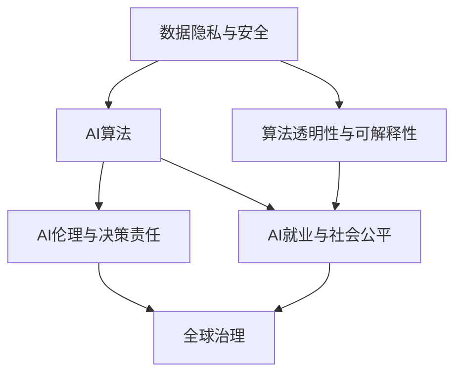

                 

# AI时代的人类计算：社会影响和责任

## 1. 背景介绍

### 1.1 问题由来

随着人工智能（AI）技术的迅猛发展，人类计算领域正经历着前所未有的变革。从算法优化、计算资源配置到数据挖掘与分析，AI技术的渗透和影响日益深入。然而，在享受技术带来的便利与效率的同时，我们也面临着一系列社会和伦理问题。这些问题不仅关系到技术的发展方向，更关系到人类社会未来的可持续发展。

### 1.2 问题核心关键点

1. **数据隐私与安全**：AI算法依赖大量数据进行训练和优化，但数据收集和存储过程中可能存在的隐私泄露问题，如用户隐私、数据被滥用等，引起了广泛关注。
   
2. **算法透明性与可解释性**：AI模型的复杂性和黑箱性质，使其在许多场景下难以被解释和理解，这不仅限制了AI技术的应用范围，还引发了监管和伦理上的争议。
   
3. **AI就业与社会公平**：AI技术的应用可能导致传统行业的劳动岗位消失，同时创造新的就业机会，但如何平衡两者的关系，促进社会公平，是未来AI发展必须考虑的重要问题。
   
4. **AI伦理与决策责任**：在医疗、司法、金融等高风险领域，AI的决策和行为可能对人类产生重大影响，如何确保AI系统的决策透明度和责任归属，是AI应用中的重要课题。
   
5. **AI与全球治理**：随着AI技术的全球化应用，如何制定相应的国际标准和法规，以保障全球数据安全与伦理道德，成为国际社会共同面临的挑战。

这些关键问题构成了AI时代人类计算的复杂图景，提示我们必须深入思考如何平衡技术进步与社会责任。

### 1.3 问题研究意义

理解并解决这些关键问题，对推动AI技术的健康发展具有重要意义：

1. **促进技术可持续发展**：通过解决隐私、安全、可解释性等社会问题，确保AI技术的安全可靠，为AI技术的长期发展奠定基础。
   
2. **推动社会公平与就业**：合理引导AI技术的就业效应，通过再培训和教育等方式，助力社会成员适应技术变革，提升整体就业质量。
   
3. **保障伦理与决策透明**：建立透明、可解释的AI系统，增强AI决策的可信赖性，保障在关键决策中的伦理与道德标准。
   
4. **加强国际合作与治理**：通过国际合作制定统一标准，确保AI技术的全球应用符合伦理道德规范，避免技术滥用带来的全球风险。

## 2. 核心概念与联系

### 2.1 核心概念概述

- **人工智能（AI）**：指通过模拟人类智能行为，利用计算机技术解决复杂问题的能力。AI技术包括机器学习、深度学习、自然语言处理、计算机视觉等众多领域。
   
- **人类计算**：指利用计算机辅助人类进行数据分析、计算和决策的过程。人类计算不仅包括传统计算任务，还涉及AI技术在教育、医疗、交通、金融等各领域的广泛应用。
   
- **数据隐私与安全**：指在数据收集、存储、处理和传输过程中，确保数据不被未经授权的访问和使用，保护个人隐私和数据安全。
   
- **算法透明性与可解释性**：指使AI算法的决策过程和结果易于理解，提供必要的透明度和解释，以增强算法的可信度和可接受性。
   
- **AI就业与社会公平**：指AI技术对就业市场的影响，包括岗位替代与新岗位创造，以及对社会成员技能和收入的影响。
   
- **AI伦理与决策责任**：指在AI应用中，确保决策过程符合伦理道德标准，明确决策责任归属，以避免不公正和不良后果。
   
- **全球治理**：指在AI技术全球应用的背景下，制定国际标准和法规，保障全球数据安全与伦理道德，协调国际合作，解决跨国问题。

### 2.2 核心概念原理和架构的 Mermaid 流程图



这个流程图展示了核心概念之间的相互联系，揭示了AI技术应用过程中可能涉及的多个关键问题。

## 3. 核心算法原理 & 具体操作步骤

### 3.1 算法原理概述

AI时代的人类计算涉及多种算法和技术，如机器学习、深度学习、强化学习、自然语言处理等。其核心原理是通过大量的数据训练模型，使其能够从数据中学习模式和规律，并在新场景中进行应用。以下是几个核心算法的简要概述：

- **机器学习**：通过算法自动从数据中学习规律，并应用于新数据中。主要包括监督学习、无监督学习和强化学习等。

- **深度学习**：一种基于多层神经网络的机器学习方法，通过深度神经网络自动提取数据特征，适用于复杂模式识别和分类任务。

- **自然语言处理（NLP）**：使计算机能够理解、处理和生成人类语言的技术，包括文本分类、情感分析、机器翻译等。

- **强化学习**：通过与环境的交互，使智能体通过试错学习最优策略，适用于游戏、机器人控制等任务。

### 3.2 算法步骤详解

1. **数据准备**：收集和预处理数据，确保数据质量，保护数据隐私和安全。
   
2. **模型训练**：选择合适的算法，并根据任务需求设计模型架构，在大量数据上进行训练。
   
3. **模型评估与调优**：评估模型性能，通过调整超参数和优化算法，提高模型效果。
   
4. **模型部署与应用**：将训练好的模型部署到实际应用场景中，进行数据输入、处理和输出，确保模型可靠性和性能。

### 3.3 算法优缺点

**优点**：

- **高效处理复杂任务**：AI算法能够处理海量数据，自动发现复杂模式和规律，极大地提升了计算和决策效率。
   
- **自动化与可扩展性**：AI算法可以自动适应新数据和新场景，具有良好的扩展性和可复用性。
   
- **促进跨领域应用**：AI技术可以应用于众多领域，如医疗、教育、金融、交通等，促进跨领域的协作与创新。

**缺点**：

- **数据依赖性强**：AI模型的效果依赖于高质量数据，数据获取和处理过程可能存在隐私和安全风险。
   
- **算法复杂性**：许多AI算法复杂度高，难以解释和理解，存在“黑箱”问题。
   
- **就业与公平问题**：AI技术可能取代某些传统岗位，导致就业结构变化，需要妥善处理就业转型和社会公平问题。

### 3.4 算法应用领域

AI算法在多个领域得到广泛应用，具体包括：

1. **医疗**：AI技术在疾病诊断、影像分析、药物研发等方面取得了显著进展，提升了医疗服务质量和效率。
   
2. **教育**：通过个性化学习、智能推荐、自动评估等技术，AI技术正在改变教育模式，提升教学效果和质量。
   
3. **金融**：AI算法在风险评估、欺诈检测、投资分析等方面发挥了重要作用，提升了金融服务水平和风险控制能力。
   
4. **交通**：自动驾驶、智能交通管理系统等AI技术正在改变交通模式，提升道路安全性和交通效率。
   
5. **零售**：AI技术在客户分析、商品推荐、库存管理等方面发挥了重要作用，提升了零售企业的运营效率和客户满意度。

## 4. 数学模型和公式 & 详细讲解 & 举例说明

### 4.1 数学模型构建

本节将介绍几个典型AI算法的数学模型构建过程。

以线性回归为例，其数学模型可表示为：

$$
y = w_0 + \sum_{i=1}^n w_i x_i
$$

其中，$y$ 为预测值，$w_0$ 和 $w_i$ 为模型参数，$x_i$ 为输入特征。模型的目标是最小化预测误差，即：

$$
\min_{w_0, w_i} \sum_{i=1}^n (y_i - (w_0 + \sum_{i=1}^n w_i x_i))^2
$$

### 4.2 公式推导过程

线性回归的公式推导过程如下：

1. **目标函数定义**：定义损失函数，衡量预测值与真实值之间的差异。
   
2. **梯度求解**：通过链式法则，求出损失函数对模型参数的梯度。
   
3. **参数更新**：使用梯度下降等优化算法，更新模型参数，使得损失函数最小化。

### 4.3 案例分析与讲解

以医疗影像分类为例，使用卷积神经网络（CNN）进行分类任务：

1. **数据准备**：收集医疗影像数据，并进行预处理，包括归一化、数据增强等。
   
2. **模型设计**：设计CNN模型架构，包括卷积层、池化层、全连接层等。
   
3. **训练与调优**：使用标注数据对模型进行训练，通过交叉验证等方法调优模型参数。
   
4. **评估与部署**：在测试数据集上评估模型性能，部署模型到医疗影像分类系统中。

## 5. 项目实践：代码实例和详细解释说明

### 5.1 开发环境搭建

在AI项目开发中，开发环境搭建至关重要。以下是Python环境下常用的开发环境搭建步骤：

1. **安装Python和相关库**：使用Anaconda或pip等工具安装Python和相关库，如TensorFlow、PyTorch、Keras等。
   
2. **环境配置**：创建虚拟环境，配置开发工具如Jupyter Notebook、Visual Studio Code等。
   
3. **版本控制**：使用Git等版本控制工具，确保代码版本管理。

### 5.2 源代码详细实现

以下是一个使用PyTorch框架进行线性回归的Python代码实现：

```python
import torch
import torch.nn as nn
import torch.optim as optim

# 定义模型
class LinearRegression(nn.Module):
    def __init__(self, input_size):
        super(LinearRegression, self).__init__()
        self.linear = nn.Linear(input_size, 1)
    
    def forward(self, x):
        return self.linear(x)
    
# 加载数据
x_train = torch.tensor([[1.0], [2.0], [3.0], [4.0]])
y_train = torch.tensor([[2.0], [4.0], [6.0], [8.0]])
    
# 定义模型、损失函数和优化器
model = LinearRegression(input_size=1)
criterion = nn.MSELoss()
optimizer = optim.SGD(model.parameters(), lr=0.01)
    
# 训练模型
for epoch in range(1000):
    optimizer.zero_grad()
    outputs = model(x_train)
    loss = criterion(outputs, y_train)
    loss.backward()
    optimizer.step()
    
# 测试模型
x_test = torch.tensor([[5.0], [6.0], [7.0], [8.0]])
y_test = model(x_test)
```

### 5.3 代码解读与分析

- **模型定义**：使用PyTorch定义一个线性回归模型，包含一个线性层。
- **数据准备**：准备训练数据，使用torch.tensor创建张量。
- **模型训练**：定义损失函数（均方误差损失）和优化器（随机梯度下降），通过前向传播和反向传播更新模型参数。
- **模型测试**：使用测试数据集测试模型性能。

## 6. 实际应用场景

### 6.1 医疗影像分类

医疗影像分类是AI在医疗领域的重要应用之一，通过深度学习算法对医学影像进行自动分类，提升诊断效率和准确性。医疗影像分类涉及图像预处理、模型训练、结果后处理等多个环节，需要高度专业化的技术支持。

### 6.2 个性化推荐系统

个性化推荐系统是AI在零售和娱乐领域的重要应用，通过分析用户历史行为数据，推荐用户感兴趣的商品或内容。推荐系统涉及用户画像构建、推荐算法设计、系统性能优化等多个方面，需要综合运用多种AI技术。

### 6.3 智能客服系统

智能客服系统是AI在服务行业的重要应用，通过自然语言处理和机器学习算法，实现对用户问题的自动理解与回答。智能客服系统涉及自然语言理解、对话生成、系统集成等多个环节，需要高度智能化的技术支持。

### 6.4 未来应用展望

未来，AI技术将在更多领域得到广泛应用，推动社会各领域的创新与发展。AI技术不仅能够提升生产效率，还能改变生活方式，提升社会治理水平。

1. **自动化与智能化**：AI技术将进一步推动自动化和智能化，提升各行业的效率和质量。
   
2. **个性化与定制化**：AI技术能够根据用户需求提供个性化和定制化的服务，提升用户体验。
   
3. **跨领域融合**：AI技术在不同领域之间的融合应用将更加广泛，推动跨领域协作与创新。

## 7. 工具和资源推荐

### 7.1 学习资源推荐

1. **在线课程**：Coursera、edX等平台提供的AI课程，涵盖从基础到高级的AI知识。
   
2. **书籍**：《深度学习》（Ian Goodfellow等著）、《Python数据科学手册》（Jake VanderPlas著）等经典书籍。
   
3. **社区论坛**：Kaggle、GitHub等平台，提供丰富的AI项目和资源共享。

### 7.2 开发工具推荐

1. **编程语言**：Python、R等易于使用的编程语言，是AI开发的主流选择。
   
2. **开发框架**：TensorFlow、PyTorch等深度学习框架，提供高效的计算图和自动微分功能。
   
3. **工具链**：Jupyter Notebook、Visual Studio Code等开发工具，支持代码编写和版本管理。

### 7.3 相关论文推荐

1. **深度学习**：《深度学习》（Ian Goodfellow等著）
   
2. **自然语言处理**：《自然语言处理综论》（Daniel Jurafsky等著）
   
3. **强化学习**：《强化学习：一个基础》（Richard S. Sutton等著）

## 8. 总结：未来发展趋势与挑战

### 8.1 研究成果总结

AI技术的发展离不开深入的学术研究和广泛的工业应用。近年来，AI领域的研究取得了显著进展，涵盖算法优化、数据处理、模型训练等多个方面。

### 8.2 未来发展趋势

1. **模型复杂性提升**：未来AI模型将更加复杂，能够处理更复杂和多样化的数据。
   
2. **数据质量与隐私保护**：高质量数据和隐私保护将成为AI技术发展的重要基础。
   
3. **跨领域应用普及**：AI技术将在更多领域得到广泛应用，推动社会各领域的创新与发展。

### 8.3 面临的挑战

1. **数据获取与隐私保护**：高质量数据获取和隐私保护仍是AI技术发展的瓶颈。
   
2. **算法透明性与可解释性**：提高AI算法的透明性和可解释性，确保其决策过程的公正性和可信度。
   
3. **伦理与决策责任**：在关键决策中明确AI系统的伦理责任，确保其行为符合社会价值观和道德标准。

### 8.4 研究展望

1. **隐私保护技术**：研究隐私保护技术，确保数据使用的合法性和安全性。
   
2. **可解释性算法**：开发可解释性算法，增强AI算法的透明度和可信度。
   
3. **跨领域应用**：推动AI技术在更多领域的广泛应用，促进跨领域协作与创新。

## 9. 附录：常见问题与解答

**Q1：AI技术的未来发展趋势是什么？**

A：未来AI技术将更加智能和自动化，涵盖更多领域和应用场景。AI技术将推动社会各行业的创新和发展，提升生产效率和生活质量。

**Q2：如何平衡AI技术的发展与数据隐私保护？**

A：通过数据匿名化、差分隐私等技术，确保数据使用的合法性和隐私保护。同时，制定严格的法律法规，规范数据获取和使用行为。

**Q3：AI技术的应用对就业有何影响？**

A：AI技术在提升生产效率的同时，也可能替代某些传统岗位，导致就业结构变化。需要通过再培训和教育等方式，帮助劳动力适应技术变革，促进社会公平和就业稳定。

**Q4：AI技术的伦理与决策责任如何确保？**

A：建立透明的AI决策过程，明确决策责任归属，确保AI系统的决策符合伦理道德标准。同时，通过监管和审核机制，确保AI系统的公正性和可信度。

**Q5：AI技术的全球治理如何实现？**

A：通过国际合作制定统一标准和法规，保障全球数据安全与伦理道德，协调跨国问题，推动全球AI技术的发展和应用。

---

作者：禅与计算机程序设计艺术 / Zen and the Art of Computer Programming

