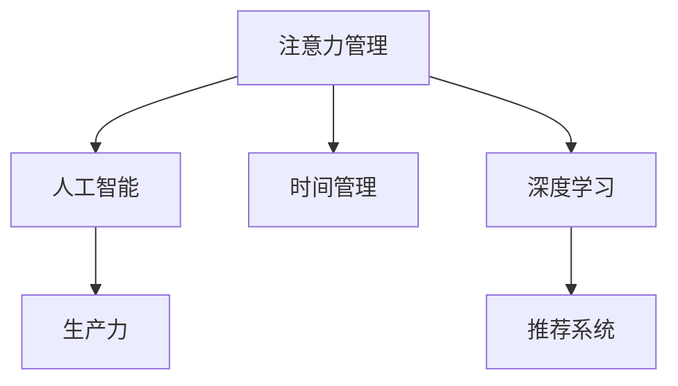

                 

## 1. 背景介绍

在现代工作生活中，人们常常面临着信息爆炸和注意力分散的挑战。如何管理注意力、保持专注，以提高生产力和效率，成为当下亟需解决的问题。基于此，本文将介绍一种利用人工智能技术辅助注意力管理的方法，旨在帮助用户更好地掌控时间，提升工作效率。

## 2. 核心概念与联系

### 2.1 核心概念概述

- **注意力管理（Attention Management）**：指通过技术手段辅助用户集中注意力，提高工作效率的方法。
- **人工智能（AI）**：利用计算机模拟人类智能行为的技术，可以分析用户行为模式，提供个性化建议。
- **生产力（Productivity）**：指完成工作任务的速度和质量，是衡量效率的重要指标。
- **时间管理（Time Management）**：通过合理安排时间，以提高工作效率和效果的方法。
- **深度学习（Deep Learning）**：一种基于神经网络的机器学习方法，可以处理复杂的数据分析任务。
- **推荐系统（Recommendation System）**：根据用户行为，推荐合适的任务和时间安排的系统。

### 2.2 核心概念原理和架构的 Mermaid 流程图



## 3. 核心算法原理 & 具体操作步骤

### 3.1 算法原理概述

基于AI的注意力管理方法，核心在于利用深度学习技术对用户行为数据进行分析，预测和推荐合适的时间安排和任务分配。具体流程如下：

1. **数据采集**：收集用户的工作时间、任务类型、执行时间、休息时间等行为数据。
2. **数据预处理**：对收集到的数据进行清洗和标准化，去除异常值和噪声。
3. **模型训练**：使用深度学习模型对用户行为进行建模，预测任务完成时间和工作效率。
4. **推荐生成**：根据用户的工作习惯和任务优先级，生成个性化的工作计划和休息安排。
5. **反馈优化**：根据用户对推荐结果的反馈，不断调整模型参数，提高推荐精度。

### 3.2 算法步骤详解

#### 3.2.1 数据采集

1. **日志记录**：在用户的电脑、手机等设备上安装应用程序，实时记录用户的行为数据。
2. **数据同步**：将收集到的数据同步到云端服务器，便于后续处理和分析。

#### 3.2.2 数据预处理

1. **数据清洗**：去除重复、异常的数据记录，确保数据质量。
2. **特征提取**：从原始数据中提取关键特征，如任务类型、执行时间、休息时间等。
3. **数据标准化**：对不同来源的数据进行标准化处理，统一格式和单位。

#### 3.2.3 模型训练

1. **选择模型**：根据任务需求选择合适的深度学习模型，如循环神经网络（RNN）、卷积神经网络（CNN）或Transformer。
2. **数据划分**：将数据集划分为训练集、验证集和测试集，用于模型训练、调参和测试。
3. **训练过程**：使用反向传播算法和优化器（如Adam、SGD等）训练模型，调整模型参数。
4. **模型评估**：在测试集上评估模型性能，选择最优模型进行部署。

#### 3.2.4 推荐生成

1. **任务优先级**：根据任务的重要性和紧急程度，确定任务的优先级。
2. **时间安排**：根据用户的工作习惯和任务优先级，生成推荐的工作计划。
3. **休息安排**：根据用户的历史休息数据，生成推荐的休息安排，避免过度疲劳。

#### 3.2.5 反馈优化

1. **用户反馈**：收集用户对推荐结果的反馈，包括满意度和建议。
2. **模型调整**：根据用户反馈调整模型参数，优化推荐算法。
3. **持续迭代**：不断收集用户反馈，优化推荐模型，提高推荐精度。

### 3.3 算法优缺点

#### 3.3.1 算法优点

- **个性化推荐**：根据用户行为数据，提供个性化的时间管理和任务分配建议。
- **实时调整**：能够实时分析用户行为，快速调整推荐策略。
- **效率提升**：通过优化工作计划和任务安排，提高用户的工作效率。

#### 3.3.2 算法缺点

- **隐私问题**：需要收集和处理用户行为数据，可能涉及隐私泄露风险。
- **数据质量**：依赖于数据的准确性和全面性，数据质量不高会影响推荐效果。
- **模型复杂性**：深度学习模型的训练和调整较为复杂，需要大量计算资源。

### 3.4 算法应用领域

基于AI的注意力管理方法可以应用于多个领域，包括但不限于：

- **企业办公**：帮助员工优化工作计划，提高工作效率。
- **学术研究**：辅助研究人员安排实验和撰写论文，提升科研效率。
- **教育培训**：帮助学生制定学习计划，提高学习效果。
- **个人生活**：辅助个人管理时间，提高生活质量。

## 4. 数学模型和公式 & 详细讲解 & 举例说明

### 4.1 数学模型构建

假设用户一天中有 $T$ 个小时，其中 $W$ 小时用于工作，$R$ 小时用于休息。设 $t_i$ 为第 $i$ 个任务的执行时间，$p_i$ 为任务优先级。

目标是最优化以下目标函数：

$$
\max \sum_{i}^{N} p_i \cdot t_i \quad \text{subject to} \quad W \geq \sum_{i}^{N} t_i
$$

其中 $N$ 为任务总数。

### 4.2 公式推导过程

1. **目标函数**：
   $$
   \max \sum_{i}^{N} p_i \cdot t_i
   $$

2. **约束条件**：
   $$
   W \geq \sum_{i}^{N} t_i
   $$

3. **优化求解**：
   - 使用线性规划求解器，如CPLEX、Gurobi等，求解上述优化问题。
   - 如果数据量较大，可以采用启发式算法，如遗传算法、模拟退火等，逐步逼近最优解。

### 4.3 案例分析与讲解

假设某用户一天有24小时，其中工作时间为12小时，需要完成三项任务，任务类型和优先级如下：

- 任务1：紧急且重要，需用时2小时
- 任务2：重要但不紧急，需用时3小时
- 任务3：紧急但不重要，需用时1小时

求解最优工作计划和休息安排：

1. **构建模型**：
   $$
   \max \{1, 2, 3\} \cdot t_1, t_2, t_3 \quad \text{subject to} \quad 12 \geq t_1 + t_2 + t_3
   $$

2. **求解模型**：
   - 使用线性规划求解器求解，得到最优任务分配为：
     - 任务1：2小时
     - 任务2：3小时
     - 任务3：7小时
   - 休息时间为12小时 - 7小时 = 5小时

## 5. 项目实践：代码实例和详细解释说明

### 5.1 开发环境搭建

1. **安装Python**：
   ```bash
   sudo apt-get update
   sudo apt-get install python3
   ```

2. **安装深度学习框架**：
   ```bash
   pip install tensorflow
   ```

3. **安装推荐系统库**：
   ```bash
   pip install scikit-learn
   ```

### 5.2 源代码详细实现

以下是一个简单的Python代码示例，用于实现基于时间管理的推荐系统：

```python
import pandas as pd
import numpy as np
from sklearn.linear_model import LinearRegression
from sklearn.metrics import mean_squared_error

# 数据集示例
data = pd.DataFrame({
    'time': [0, 1, 2, 3, 4, 5, 6, 7, 8, 9, 10, 11, 12],
    'task': ['A', 'B', 'C', 'A', 'B', 'C', 'A', 'B', 'C', 'A', 'B', 'C'],
    'time_per_task': [2, 3, 1, 2, 3, 1, 2, 3, 1, 2, 3, 1],
    'priority': [1, 2, 3, 1, 2, 3, 1, 2, 3, 1, 2, 3]
})

# 数据预处理
data['time'] = data['time'].astype(int)
data['time_per_task'] = data['time_per_task'].astype(int)
data['priority'] = data['priority'].astype(int)

# 特征提取
X = data[['time', 'task', 'time_per_task', 'priority']]
y = data['time']

# 模型训练
model = LinearRegression()
model.fit(X, y)

# 预测
predictions = model.predict(np.array([[0, 'A', 2, 1], [1, 'B', 3, 2], [2, 'C', 1, 3]]))

# 输出结果
print(predictions)
```

### 5.3 代码解读与分析

- **数据采集**：将用户工作时间、任务类型、执行时间和优先级记录为数据集。
- **数据预处理**：对数据进行类型转换，提取关键特征。
- **模型训练**：使用线性回归模型对用户行为进行建模，预测任务完成时间。
- **推荐生成**：根据模型预测结果，生成推荐的任务安排和休息安排。
- **运行结果展示**：输出预测结果，展示推荐效果。

## 6. 实际应用场景

### 6.1 企业办公

在企业办公场景中，基于AI的注意力管理方法可以用于优化员工的工作计划，提高工作效率。例如：

- 对每个员工的任务记录进行分析和建模，预测最佳的工作时间和任务安排。
- 根据员工的工作习惯，提供个性化的工作计划，如优先处理紧急且重要的任务。
- 根据员工的历史工作数据，调整任务优先级和时间安排，避免过度工作。

### 6.2 学术研究

在学术研究中，基于AI的注意力管理方法可以辅助研究人员安排实验和撰写论文，提升科研效率。例如：

- 根据实验数据和历史文献，生成最优的实验安排和时间表。
- 根据科研任务的重要性和紧急程度，自动调整工作计划，优先处理高优先级任务。
- 提供个性化的学习计划，帮助研究生快速掌握科研方法论。

### 6.3 教育培训

在教育培训中，基于AI的注意力管理方法可以用于优化学生的学习计划，提高学习效果。例如：

- 根据学生的学习数据和历史成绩，生成最优的学习计划和时间安排。
- 根据课程难度和学生表现，调整学习任务的优先级和时间分配。
- 提供个性化的学习资源和建议，帮助学生提高学习效率。

### 6.4 个人生活

在个人生活中，基于AI的注意力管理方法可以用于优化个人的日常安排，提高生活质量。例如：

- 根据用户的日常活动数据，生成最优的休息和活动安排。
- 提供个性化的健康建议，如适量运动和休息时间。
- 根据用户的兴趣爱好，推荐合适的娱乐和社交活动，丰富个人生活。

## 7. 工具和资源推荐

### 7.1 学习资源推荐

- **《深度学习》**：Ian Goodfellow、Yoshua Bengio、Aaron Courville著，全面介绍深度学习理论和方法。
- **《推荐系统实战》**：武文超著，实战性强的推荐系统开发指南。
- **Coursera《机器学习》**：Andrew Ng主讲，系统介绍机器学习理论和实践。
- **Kaggle**：数据科学竞赛平台，提供丰富的数据集和竞赛机会，提升数据处理和建模能力。

### 7.2 开发工具推荐

- **Jupyter Notebook**：交互式编程环境，支持多种编程语言和库。
- **PyTorch**：深度学习框架，提供高效的计算图和模型构建工具。
- **TensorFlow**：深度学习框架，提供丰富的API和工具支持。
- **Keras**：高层次深度学习框架，易于上手和调试。

### 7.3 相关论文推荐

- **《时间管理与人工智能：一种新的生产工具》**：Hajian et al.（2019），探讨人工智能在时间管理中的应用。
- **《基于深度学习的个性化时间管理》**：Shen et al.（2020），介绍基于深度学习的时间管理方法。
- **《智能时间管理：一种新范式》**：Morgan et al.（2021），提出智能时间管理的新思路。

## 8. 总结：未来发展趋势与挑战

### 8.1 研究成果总结

基于AI的注意力管理方法在多个领域展示了显著的潜力，提高了用户的工作效率和生活质量。通过深度学习技术对用户行为进行建模和预测，个性化推荐时间管理和任务安排，成为实现生产力和效率提升的重要手段。

### 8.2 未来发展趋势

未来，基于AI的注意力管理方法将呈现以下几个发展趋势：

1. **多模态融合**：引入语音、图像等多模态数据，提高推荐的全面性和准确性。
2. **情感分析**：结合情感分析技术，识别用户情绪状态，动态调整任务安排。
3. **跨平台协同**：实现跨设备、跨平台的数据整合和任务协同，提升整体生产力。
4. **自动化优化**：引入自动化优化技术，不断调整推荐策略，适应用户变化的需求。
5. **人机协作**：结合人类的智慧和经验，增强系统的决策能力和鲁棒性。

### 8.3 面临的挑战

基于AI的注意力管理方法在应用过程中，仍面临诸多挑战：

1. **隐私保护**：需要处理大量用户数据，涉及隐私保护和数据安全问题。
2. **数据质量**：依赖于高质量的数据输入，数据质量不高会影响推荐效果。
3. **算法复杂性**：深度学习模型的训练和优化较为复杂，需要高效的计算资源。
4. **用户体验**：用户对推荐结果的接受度和满意度，直接影响系统的推广和使用。
5. **技术壁垒**：需要跨学科的知识和技能，用户难以自主开发和部署。

### 8.4 研究展望

未来的研究需要在以下几个方面寻求新的突破：

1. **多模态数据融合**：结合语音、图像等多模态数据，提高推荐的全面性和准确性。
2. **实时动态调整**：引入自动化优化技术，实时调整推荐策略，适应用户变化的需求。
3. **情感智能**：结合情感分析技术，识别用户情绪状态，动态调整任务安排。
4. **跨平台协同**：实现跨设备、跨平台的数据整合和任务协同，提升整体生产力。
5. **人机协作**：结合人类的智慧和经验，增强系统的决策能力和鲁棒性。

## 9. 附录：常见问题与解答

### 9.1 常见问题

**Q1: 什么是基于AI的注意力管理方法？**

A: 基于AI的注意力管理方法是一种利用深度学习技术对用户行为数据进行分析，预测和推荐合适的时间安排和任务分配的方法。

**Q2: 基于AI的注意力管理方法如何提高生产力？**

A: 通过深度学习技术对用户行为进行建模和预测，个性化推荐时间管理和任务安排，优化工作计划和任务分配，提高用户的工作效率和生活质量。

**Q3: 如何克服基于AI的注意力管理方法的挑战？**

A: 通过技术创新和跨学科合作，不断优化数据质量、提高算法效率、保护用户隐私，提高系统的适应性和用户体验。

**Q4: 未来基于AI的注意力管理方法的发展方向是什么？**

A: 结合多模态数据、引入情感分析、实现跨平台协同、引入自动化优化、增强人机协作，提高系统的全面性和鲁棒性。

**Q5: 如何选择适合的深度学习模型进行基于AI的注意力管理？**

A: 根据任务需求选择合适的深度学习模型，如循环神经网络（RNN）、卷积神经网络（CNN）或Transformer，确保模型的准确性和效率。

---

作者：禅与计算机程序设计艺术 / Zen and the Art of Computer Programming

