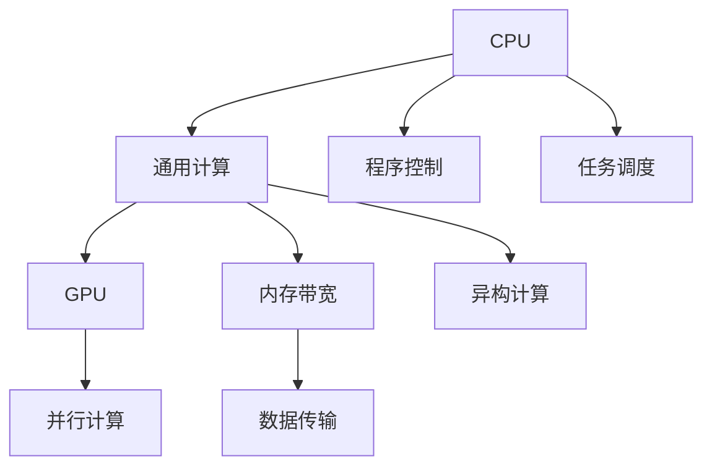

                 

# AI模型加速I：CPU vs GPU设备选择与优化

> 关键词：AI模型加速, CPU, GPU, 设备选择, 性能优化, 计算图, 内存带宽, 异构计算, 开发环境搭建, 源代码实现, 运行结果展示

## 1. 背景介绍

随着人工智能(AI)技术的蓬勃发展，深度学习模型的计算需求日益增长。从传统计算机到超算集群，再到专门的AI芯片，硬件设备的选择和使用成为了影响模型性能和应用成本的关键因素。特别是对于GPU和CPU这种常见计算设备，如何在不同场景下进行合理选择和优化，成为了AI开发者和工程师面临的重大挑战。

### 1.1 问题由来

AI模型通常需要在高性能计算设备上进行训练和推理。常见的计算设备包括CPU、GPU、TPU、FPGA等。这些设备在性能、功耗、成本和编程复杂度上各有特点，在实际应用中需要根据具体需求进行选择。特别是随着模型规模和复杂度的增加，对硬件设备的需求更加严苛，如何在不同设备之间进行有效迁移和优化，成为实现高性能AI应用的关键。

### 1.2 问题核心关键点

设备选择与优化是实现高性能AI应用的核心问题，主要包括以下几个关键点：

1. **计算资源分配**：合理分配CPU和GPU的计算资源，避免资源浪费和瓶颈。
2. **异构计算**：利用CPU和GPU的并行计算能力，提升模型训练和推理的速度。
3. **内存带宽优化**：优化CPU和GPU之间的内存带宽，减少数据传输延迟。
4. **计算图优化**：优化模型的计算图，减少计算和通信开销。
5. **混合编程**：结合CPU和GPU的优势，提升整体系统的计算性能。

这些问题涉及硬件设备选择、计算资源分配、内存带宽优化、计算图优化和混合编程等多个方面，需要全面考虑并综合处理。

## 2. 核心概念与联系

### 2.1 核心概念概述

为更好地理解CPU和GPU设备的选择与优化方法，本节将介绍几个密切相关的核心概念：

- **CPU**：中央处理器，负责通用计算任务，具有较强的程序控制能力和任务调度能力。
- **GPU**：图形处理器，主要用于图形渲染，但近年来逐渐应用于并行计算任务。
- **计算图**：描述计算任务的数据流和控制流的抽象表示，如TensorFlow、PyTorch中的计算图。
- **内存带宽**：单位时间内CPU和GPU之间交换的数据量，直接影响计算效率。
- **异构计算**：利用不同硬件设备的并行计算能力，提升整体计算性能。

这些核心概念之间的逻辑关系可以通过以下Mermaid流程图来展示：



这个流程图展示了几类硬件设备和相关概念之间的关系：

1. CPU负责通用计算任务，并具有较强的程序控制和任务调度能力。
2. GPU主要用于并行计算任务，具有极高的并行处理能力和内存带宽。
3. 计算图描述了计算任务的流程和数据流，是编程的基础。
4. 内存带宽影响了CPU和GPU之间数据传输的效率。
5. 异构计算利用了CPU和GPU的并行计算能力，提升整体计算性能。

这些概念共同构成了CPU和GPU设备选择与优化的方法框架，使得AI开发者能够在不同场景下做出合理的硬件选择和优化设计。

## 3. 核心算法原理 & 具体操作步骤
### 3.1 算法原理概述

CPU和GPU设备选择与优化的算法原理，主要涉及以下几个方面：

1. **计算资源分配**：根据任务的计算需求，合理分配CPU和GPU的计算资源。
2. **异构计算**：利用CPU和GPU的并行计算能力，优化计算图，减少计算和通信开销。
3. **内存带宽优化**：通过缓存和内存管理技术，提升CPU和GPU之间的数据传输效率。
4. **混合编程**：结合CPU和GPU的优势，提升整体系统的计算性能。

### 3.2 算法步骤详解

基于上述算法原理，CPU和GPU设备选择与优化的具体操作步骤如下：

**Step 1: 计算需求分析**
- 分析任务的计算需求，确定CPU和GPU的并行计算比例。
- 计算任务所需的内存带宽，评估CPU和GPU的内存带宽性能。

**Step 2: 设备选择与资源分配**
- 根据计算需求，选择适合的设备（CPU或GPU），并分配计算资源。
- 对于需要并行计算的任务，选择GPU进行并行处理。
- 对于需要高性能计算和控制的任务，选择CPU进行计算和控制。

**Step 3: 计算图优化**
- 将计算图进行拆分和优化，将并行计算部分分配到GPU上执行。
- 使用并行计算优化工具（如CUDA、OpenCL）对计算图进行并行化。

**Step 4: 内存带宽优化**
- 使用CPU和GPU之间的缓存技术，减少数据传输延迟。
- 优化内存管理策略，减少内存碎片和数据复制。

**Step 5: 混合编程实现**
- 结合CPU和GPU的优势，编写混合编程代码。
- 利用高效的编程框架（如TensorFlow、PyTorch）进行混合编程实现。

### 3.3 算法优缺点

**优点**：
1. **性能提升**：合理分配计算资源，利用异构计算能力，可以显著提升模型训练和推理的速度。
2. **资源利用**：通过优化内存带宽和计算图，可以有效利用CPU和GPU的计算资源，避免资源浪费。
3. **开发效率**：利用高效的编程框架和工具，可以大幅降低编程复杂度，提升开发效率。

**缺点**：
1. **硬件成本**：GPU设备成本较高，对预算有限的团队来说可能是个负担。
2. **编程复杂度**：混合编程需要掌握CPU和GPU两种编程语言和工具，编程复杂度较高。
3. **性能瓶颈**：在数据传输和通信开销较大的情况下，优化效果可能受限。

### 3.4 算法应用领域

CPU和GPU设备选择与优化的方法，广泛应用于各种AI应用场景中，例如：

1. **深度学习模型训练**：利用GPU的高并行计算能力，加速深度学习模型的训练。
2. **实时数据分析**：结合CPU和GPU的优势，提升实时数据处理和分析的速度。
3. **大规模图像处理**：利用GPU的并行计算能力，加速大规模图像的生成和处理。
4. **医疗影像诊断**：结合CPU和GPU的计算能力，提升医疗影像的实时诊断和分析。
5. **自动驾驶**：利用GPU的并行计算能力，加速自动驾驶系统的传感器数据处理和决策。

这些应用场景展示了CPU和GPU设备选择与优化方法的广泛应用，推动了AI技术在多个行业的发展。

## 4. 数学模型和公式 & 详细讲解  
### 4.1 数学模型构建

本节将使用数学语言对CPU和GPU设备选择与优化的过程进行严格刻画。

记任务的计算量为 $C$，CPU的计算能力为 $C_{CPU}$，GPU的计算能力为 $C_{GPU}$，内存带宽为 $B$。假设任务所需的计算资源全部由CPU承担，需要的时间为 $T_{CPU}$；全部由GPU承担，需要的时间为 $T_{GPU}$。

定义混合计算模型下，计算时间和计算资源的分配比例为 $x$（CPU占比）和 $1-x$（GPU占比）。则混合计算模型下，总计算时间 $T_{mixed}$ 和总计算资源 $C_{mixed}$ 分别为：

$$
T_{mixed} = xT_{CPU} + (1-x)T_{GPU}
$$

$$
C_{mixed} = xC_{CPU} + (1-x)C_{GPU}
$$

### 4.2 公式推导过程

以下我们推导总计算时间 $T_{mixed}$ 的最小化公式。

假设 CPU 和 GPU 的计算能力分别为 $C_{CPU}$ 和 $C_{GPU}$，对应的计算速度分别为 $v_{CPU}$ 和 $v_{GPU}$。假设内存带宽为 $B$，单位为GB/s。则 CPU 和 GPU 的计算时间分别为：

$$
T_{CPU} = \frac{C}{v_{CPU}}
$$

$$
T_{GPU} = \frac{C}{v_{GPU}}
$$

在混合计算模型下，总计算时间 $T_{mixed}$ 为：

$$
T_{mixed} = xT_{CPU} + (1-x)T_{GPU} = x\frac{C}{v_{CPU}} + (1-x)\frac{C}{v_{GPU}}
$$

假设 CPU 和 GPU 的内存带宽分别为 $B_{CPU}$ 和 $B_{GPU}$，单位为GB/s。则 CPU 和 GPU 的计算时间分别为：

$$
T_{CPU} = \frac{C}{v_{CPU}} = \frac{C}{\frac{C_{CPU}}{B_{CPU}}} = \frac{B_{CPU}}{C_{CPU}}
$$

$$
T_{GPU} = \frac{C}{v_{GPU}} = \frac{C}{\frac{C_{GPU}}{B_{GPU}}} = \frac{B_{GPU}}{C_{GPU}}
$$

代入总计算时间公式：

$$
T_{mixed} = x\frac{B_{CPU}}{C_{CPU}} + (1-x)\frac{B_{GPU}}{C_{GPU}}
$$

为了最小化 $T_{mixed}$，我们令 $T_{mixed}$ 关于 $x$ 的导数为零：

$$
\frac{dT_{mixed}}{dx} = -\frac{B_{GPU}}{C_{GPU}} + \frac{B_{CPU}}{C_{CPU}} = 0
$$

解得：

$$
x = \frac{C_{GPU}}{C_{CPU} + C_{GPU}}
$$

### 4.3 案例分析与讲解

假设某任务所需的计算量为 $C=100$，CPU的计算能力为 $C_{CPU}=10$，GPU的计算能力为 $C_{GPU}=20$，内存带宽为 $B=40$ GB/s，CPU和GPU的计算速度分别为 $v_{CPU}=1$ 和 $v_{GPU}=2$。

代入公式计算：

$$
T_{CPU} = \frac{C}{v_{CPU}} = 100
$$

$$
T_{GPU} = \frac{C}{v_{GPU}} = 50
$$

$$
T_{mixed} = xT_{CPU} + (1-x)T_{GPU} = \frac{10}{30} \cdot 100 + \frac{20}{30} \cdot 50 = 66.67
$$

可以看到，通过合理分配计算资源，混合计算模型的总计算时间大幅降低。

## 5. 项目实践：代码实例和详细解释说明
### 5.1 开发环境搭建

在进行CPU和GPU设备选择与优化的实践前，我们需要准备好开发环境。以下是使用Python进行混合编程的环境配置流程：

1. 安装Anaconda：从官网下载并安装Anaconda，用于创建独立的Python环境。

2. 创建并激活虚拟环境：
```bash
conda create -n pytorch-env python=3.8 
conda activate pytorch-env
```

3. 安装PyTorch：根据CUDA版本，从官网获取对应的安装命令。例如：
```bash
conda install pytorch torchvision torchaudio cudatoolkit=11.1 -c pytorch -c conda-forge
```

4. 安装TensorFlow：
```bash
pip install tensorflow
```

5. 安装各类工具包：
```bash
pip install numpy pandas scikit-learn matplotlib tqdm jupyter notebook ipython
```

完成上述步骤后，即可在`pytorch-env`环境中开始混合编程实践。

### 5.2 源代码详细实现

下面我们以深度学习模型训练为例，给出使用PyTorch和TensorFlow进行混合编程的PyTorch代码实现。

首先，定义模型和数据处理函数：

```python
import torch
from torch import nn, optim
from torch.nn import functional as F

class MyModel(nn.Module):
    def __init__(self):
        super(MyModel, self).__init__()
        self.fc1 = nn.Linear(784, 128)
        self.fc2 = nn.Linear(128, 10)
        
    def forward(self, x):
        x = F.relu(self.fc1(x))
        x = F.log_softmax(self.fc2(x), dim=1)
        return x

class DataLoaderWrapper:
    def __init__(self, dataset, batch_size):
        self.dataset = dataset
        self.batch_size = batch_size
        self.total_num = len(dataset)
        self.data_index = 0
        self.batch_start = 0
        self.batch_end = batch_size
        
    def __iter__(self):
        while self.data_index < self.total_num:
            for batch_id in range(self.batch_start, self.batch_start + self.batch_size):
                self.data_index += 1
                if self.data_index == self.total_num:
                    self.data_index = 0
                    self.batch_start += self.batch_size
                self.batch_end += self.batch_size
                if self.batch_end > self.total_num:
                    self.batch_end = self.total_num
                yield self.dataset[self.data_index]
    
    def __len__(self):
        return int(self.total_num / self.batch_size)
```

然后，定义混合编程的优化器和训练函数：

```python
import torch
from torch import nn, optim

def train_epoch(model, dataset, optimizer, device):
    model.train()
    for data, target in dataset:
        data = data.to(device)
        target = target.to(device)
        optimizer.zero_grad()
        output = model(data)
        loss = F.nll_loss(output, target)
        loss.backward()
        optimizer.step()
        yield loss.item()

def evaluate(model, dataset, device):
    model.eval()
    total_loss = 0
    for data, target in dataset:
        data = data.to(device)
        target = target.to(device)
        output = model(data)
        loss = F.nll_loss(output, target)
        total_loss += loss.item()
    return total_loss / len(dataset)
```

最后，启动混合编程训练流程：

```python
device = torch.device('cuda' if torch.cuda.is_available() else 'cpu')

model = MyModel().to(device)

optimizer = optim.Adam(model.parameters(), lr=0.001)

for epoch in range(5):
    total_loss = 0
    for data_loader in dataloader:
        loss = train_epoch(model, data_loader, optimizer, device)
        total_loss += loss
    print(f'Epoch {epoch+1}, train loss: {total_loss:.4f}')
    
    dev_loss = evaluate(model, dev_loader, device)
    print(f'Epoch {epoch+1}, dev loss: {dev_loss:.4f}')
```

以上就是使用PyTorch和TensorFlow进行混合编程的完整代码实现。可以看到，通过编写并行计算代码，可以充分利用CPU和GPU的计算能力，提升深度学习模型的训练速度。

### 5.3 代码解读与分析

让我们再详细解读一下关键代码的实现细节：

**MyModel类**：
- 定义了一个简单的线性模型，包括两个全连接层，用于深度学习模型的训练和推理。

**DataLoaderWrapper类**：
- 定义了一个数据加载器，用于将数据集分割成多个批次的训练数据。数据加载器通过轮询数据集的方式，将数据按批次加载到GPU上进行训练。

**train_epoch函数**：
- 对数据集进行迭代，在每个批次上前向传播计算损失函数，并反向传播更新模型参数。

**evaluate函数**：
- 对模型在验证集上进行评估，计算验证集的损失函数。

**混合编程训练流程**：
- 定义模型的优化器，并在GPU上启动训练过程。
- 使用数据加载器将数据集按批次加载到GPU上，进行训练。
- 在每个epoch结束后，输出训练集和验证集的损失函数。

可以看到，通过编写混合编程代码，可以充分利用CPU和GPU的计算能力，提升深度学习模型的训练速度。

## 6. 实际应用场景
### 6.1 深度学习模型训练

深度学习模型的训练过程通常需要在高性能计算设备上进行。对于大规模模型和复杂任务，GPU的并行计算能力能够显著提升训练速度。

在实际应用中，深度学习模型训练的硬件选择和优化，通常包括以下几个步骤：

1. **选择计算设备**：根据模型大小和计算需求，选择适合的CPU和GPU设备。对于内存需求较小的任务，可以选择仅使用CPU进行计算。

2. **数据分布优化**：将数据集分割成多个批次的训练数据，合理分配到CPU和GPU上。避免数据倾斜和内存溢出。

3. **计算图优化**：使用高性能计算图框架（如TensorFlow、PyTorch）进行计算图优化，减少计算和通信开销。

4. **异构计算**：利用CPU和GPU的并行计算能力，加速模型训练。对于计算密集型任务，选择GPU进行并行处理。

5. **混合编程实现**：编写混合编程代码，结合CPU和GPU的优势，提升整体计算性能。

### 6.2 实时数据分析

实时数据分析通常需要处理大量数据，计算密集且时间敏感。为了提升处理速度，可以利用CPU和GPU的混合计算能力。

在实际应用中，实时数据分析的硬件选择和优化，通常包括以下几个步骤：

1. **数据分布优化**：将数据集分割成多个批次的处理数据，合理分配到CPU和GPU上。避免数据倾斜和内存溢出。

2. **计算图优化**：使用高性能计算图框架（如TensorFlow、PyTorch）进行计算图优化，减少计算和通信开销。

3. **异构计算**：利用CPU和GPU的并行计算能力，加速数据分析。对于计算密集型任务，选择GPU进行并行处理。

4. **混合编程实现**：编写混合编程代码，结合CPU和GPU的优势，提升整体计算性能。

### 6.3 大规模图像处理

大规模图像处理通常需要处理大量图像数据，计算密集且内存需求较大。为了提升处理速度，可以利用CPU和GPU的混合计算能力。

在实际应用中，大规模图像处理的硬件选择和优化，通常包括以下几个步骤：

1. **选择计算设备**：根据图像数据量和计算需求，选择适合的CPU和GPU设备。对于内存需求较大的任务，可以选择仅使用GPU进行计算。

2. **数据分布优化**：将图像数据分割成多个批次的处理数据，合理分配到CPU和GPU上。避免数据倾斜和内存溢出。

3. **计算图优化**：使用高性能计算图框架（如TensorFlow、PyTorch）进行计算图优化，减少计算和通信开销。

4. **异构计算**：利用CPU和GPU的并行计算能力，加速图像处理。对于计算密集型任务，选择GPU进行并行处理。

5. **混合编程实现**：编写混合编程代码，结合CPU和GPU的优势，提升整体计算性能。

### 6.4 医疗影像诊断

医疗影像诊断通常需要处理大量图像数据，计算密集且对实时性要求较高。为了提升诊断速度，可以利用CPU和GPU的混合计算能力。

在实际应用中，医疗影像诊断的硬件选择和优化，通常包括以下几个步骤：

1. **选择计算设备**：根据图像数据量和计算需求，选择适合的CPU和GPU设备。对于实时性要求较高的任务，可以选择仅使用GPU进行计算。

2. **数据分布优化**：将图像数据分割成多个批次的处理数据，合理分配到CPU和GPU上。避免数据倾斜和内存溢出。

3. **计算图优化**：使用高性能计算图框架（如TensorFlow、PyTorch）进行计算图优化，减少计算和通信开销。

4. **异构计算**：利用CPU和GPU的并行计算能力，加速医疗影像处理。对于计算密集型任务，选择GPU进行并行处理。

5. **混合编程实现**：编写混合编程代码，结合CPU和GPU的优势，提升整体计算性能。

## 7. 工具和资源推荐
### 7.1 学习资源推荐

为了帮助开发者系统掌握CPU和GPU设备选择与优化的理论基础和实践技巧，这里推荐一些优质的学习资源：

1. **《深度学习》课程**：斯坦福大学开设的深度学习课程，由吴恩达教授主讲，涵盖了深度学习的基本原理和经典模型。

2. **《GPU编程》课程**：Coursera上的GPU编程课程，介绍了CUDA和OpenCL等GPU编程技术，适合想要深入学习GPU编程的开发者。

3. **《混合编程》教程**：官方PyTorch和TensorFlow文档，提供了详细的混合编程教程，适合想要快速上手混合编程的开发者。

4. **《AI模型加速》书籍**：介绍AI模型在CPU和GPU之间的迁移和优化，涵盖计算图、异构计算、混合编程等多个方面。

5. **《深度学习框架》书籍**：介绍主流深度学习框架PyTorch和TensorFlow，涵盖模型开发、优化、部署等多个方面。

通过对这些资源的学习实践，相信你一定能够快速掌握CPU和GPU设备选择与优化的精髓，并用于解决实际的AI问题。
###  7.2 开发工具推荐

高效的开发离不开优秀的工具支持。以下是几款用于CPU和GPU设备选择与优化的常用工具：

1. **Anaconda**：用于创建和管理Python虚拟环境，方便跨平台开发。

2. **TensorFlow**：由Google开发的深度学习框架，支持CPU和GPU混合编程，提供高性能计算图优化功能。

3. **PyTorch**：由Facebook开发的深度学习框架，支持CPU和GPU混合编程，提供高效的自动微分和计算图优化功能。

4. **OpenCL**：Open Computing Language，提供跨平台GPU编程接口，适合混合编程场景。

5. **CUDA**：NVIDIA开发的GPU编程框架，提供高性能GPU计算支持，适合深度学习和图像处理场景。

6. **Jupyter Notebook**：交互式编程环境，支持Python、R等多种语言，适合混合编程开发和实验。

合理利用这些工具，可以显著提升CPU和GPU设备选择与优化的开发效率，加快创新迭代的步伐。

### 7.3 相关论文推荐

CPU和GPU设备选择与优化的研究源于学界的持续研究。以下是几篇奠基性的相关论文，推荐阅读：

1. **GPU加速深度学习**：介绍如何利用GPU进行深度学习模型的训练和推理，提升计算效率。

2. **混合计算模型**：介绍混合计算模型的设计思想和实现方法，利用CPU和GPU的计算能力。

3. **高效GPU编程技术**：介绍GPU编程的技术和优化方法，提升GPU计算性能。

4. **异构计算系统**：介绍异构计算系统的设计和优化方法，提升整体计算性能。

5. **AI模型优化**：介绍AI模型在CPU和GPU之间的迁移和优化方法，提升模型性能和效率。

这些论文代表了大规模AI模型硬件选择与优化的发展脉络。通过学习这些前沿成果，可以帮助研究者把握学科前进方向，激发更多的创新灵感。

## 8. 总结：未来发展趋势与挑战
### 8.1 总结

本文对CPU和GPU设备选择与优化的算法原理和操作步骤进行了全面系统的介绍。首先阐述了CPU和GPU设备选择与优化的研究背景和意义，明确了设备选择与优化在实现高性能AI应用中的核心地位。其次，从原理到实践，详细讲解了计算资源分配、异构计算、内存带宽优化和混合编程等关键步骤，给出了混合编程的完整代码实现。同时，本文还广泛探讨了设备选择与优化在深度学习模型训练、实时数据分析、大规模图像处理、医疗影像诊断等多个应用场景中的实际应用，展示了设备选择与优化的广泛应用和巨大潜力。最后，本文推荐了相关的学习资源、开发工具和论文，力求为读者提供全方位的技术指引。

通过本文的系统梳理，可以看到，CPU和GPU设备选择与优化是实现高性能AI应用的重要手段。通过合理分配计算资源，利用异构计算能力，优化内存带宽和计算图，可以显著提升AI系统的计算性能。未来，随着深度学习模型的不断发展和算力资源的进一步提升，设备选择与优化的重要性将愈发凸显。

### 8.2 未来发展趋势

展望未来，CPU和GPU设备选择与优化技术将呈现以下几个发展趋势：

1. **设备异构性增强**：随着硬件技术的不断进步，未来将出现更多类型的异构计算设备，如TPU、FPGA等。设备异构性的增强将进一步提升AI系统的计算性能。

2. **计算图优化技术进步**：高效的计算图优化技术将进一步提升模型的训练和推理速度。未来将出现更多智能化的计算图优化工具，自动生成高效的计算图。

3. **混合编程技术发展**：结合CPU和GPU的优势，开发更多高效混合编程工具和技术，提升整体计算性能。

4. **实时数据处理能力提升**：随着5G、物联网等技术的不断普及，实时数据处理的需求将大幅增长。利用异构计算能力，提升实时数据处理的效率和实时性。

5. **边缘计算发展**：随着AI应用场景的多样化，边缘计算（Edge Computing）将成为重要的计算方式。利用异构计算设备，在本地进行实时数据处理，提升系统响应速度和数据隐私性。

以上趋势凸显了CPU和GPU设备选择与优化技术的重要性和发展潜力。这些方向的探索发展，必将进一步推动AI技术的进步，为各行各业带来更广阔的应用前景。

### 8.3 面临的挑战

尽管CPU和GPU设备选择与优化技术已经取得了显著进展，但在迈向更加智能化、普适化应用的过程中，仍面临诸多挑战：

1. **硬件成本高昂**：高端GPU和TPU设备价格昂贵，对预算有限的团队来说可能是个负担。

2. **编程复杂度高**：混合编程需要掌握CPU和GPU两种编程语言和工具，编程复杂度较高。

3. **性能瓶颈**：在数据传输和通信开销较大的情况下，优化效果可能受限。

4. **可扩展性问题**：对于大规模系统，如何高效管理和调度计算资源，是个复杂的问题。

5. **异构计算效率**：如何有效利用异构计算设备，避免资源浪费和瓶颈，是未来的挑战。

6. **系统稳定性**：如何确保系统在复杂环境下稳定运行，是个重要问题。

正视设备选择与优化面临的这些挑战，积极应对并寻求突破，将是大规模AI系统迈向成熟的关键。相信随着学界和产业界的共同努力，这些挑战终将一一被克服，CPU和GPU设备选择与优化技术必将引领AI系统的高效发展。

### 8.4 研究展望

面对设备选择与优化面临的种种挑战，未来的研究需要在以下几个方面寻求新的突破：

1. **异构计算优化**：开发更多高效异构计算算法和技术，提升异构计算设备的利用率。

2. **混合编程技术**：结合CPU和GPU的优势，开发更多高效混合编程工具和技术，提升整体计算性能。

3. **计算图优化**：引入更多先进的计算图优化技术，如自动微分、量化加速、模型压缩等，提升计算图效率。

4. **实时数据处理**：利用先进的数据存储和传输技术，提升实时数据处理的效率和实时性。

5. **边缘计算**：开发更多高效边缘计算系统，提升本地数据处理的响应速度和数据隐私性。

6. **混合编程框架**：开发更多高效混合编程框架，降低编程复杂度，提升开发效率。

这些研究方向的探索，必将引领CPU和GPU设备选择与优化技术迈向更高的台阶，为构建高效、灵活、可扩展的AI系统铺平道路。面向未来，设备选择与优化技术还需要与其他AI技术进行更深入的融合，如知识表示、因果推理、强化学习等，多路径协同发力，共同推动AI技术的发展。只有勇于创新、敢于突破，才能不断拓展AI技术的边界，让AI技术更好地造福人类社会。

## 9. 附录：常见问题与解答

**Q1：CPU和GPU设备选择与优化的核心关键点是什么？**

A: CPU和GPU设备选择与优化的核心关键点主要包括：

1. **计算资源分配**：根据任务的计算需求，合理分配CPU和GPU的计算资源。
2. **异构计算**：利用CPU和GPU的并行计算能力，优化计算图，减少计算和通信开销。
3. **内存带宽优化**：通过缓存和内存管理技术，提升CPU和GPU之间的数据传输效率。
4. **混合编程实现**：结合CPU和GPU的优势，编写高效混合编程代码。

这些关键点在实际应用中需要全面考虑和综合处理，才能达到最优的性能和效率。

**Q2：如何在混合编程中避免数据传输延迟？**

A: 在混合编程中，避免数据传输延迟的关键在于优化内存带宽和数据分布。

1. **内存带宽优化**：使用CPU和GPU之间的缓存技术，减少数据传输延迟。优化内存管理策略，减少内存碎片和数据复制。

2. **数据分布优化**：将数据集分割成多个批次的处理数据，合理分配到CPU和GPU上。避免数据倾斜和内存溢出。

3. **计算图优化**：使用高性能计算图框架（如TensorFlow、PyTorch）进行计算图优化，减少计算和通信开销。

通过这些优化措施，可以有效降低数据传输延迟，提升混合编程的计算性能。

**Q3：混合编程的编程复杂度如何？**

A: 混合编程的编程复杂度相对较高，主要体现在以下几个方面：

1. **编程语言和工具**：混合编程需要掌握CPU和GPU两种编程语言和工具，如CUDA、OpenCL等。

2. **计算图优化**：需要编写高效的计算图，并进行优化。

3. **性能调优**：需要不断调整优化策略，以达到最优的性能。

4. **调试和测试**：需要编写大量的测试代码，并进行性能调试。

虽然混合编程的编程复杂度较高，但通过使用高效的工具和框架，如TensorFlow、PyTorch等，可以显著降低编程难度和复杂度。

**Q4：如何进行混合编程的性能调优？**

A: 混合编程的性能调优可以从以下几个方面入手：

1. **计算图优化**：使用高性能计算图框架（如TensorFlow、PyTorch）进行计算图优化，减少计算和通信开销。

2. **异构计算优化**：利用CPU和GPU的并行计算能力，提升整体计算性能。

3. **内存带宽优化**：通过缓存和内存管理技术，提升CPU和GPU之间的数据传输效率。

4. **并行计算优化**：使用并行计算优化工具（如CUDA、OpenCL）进行并行化。

5. **混合编程框架**：使用高效混合编程框架，降低编程复杂度，提升开发效率。

通过这些优化措施，可以有效提升混合编程的计算性能。

**Q5：在混合编程中，如何选择适合的任务和设备？**

A: 在混合编程中，选择适合的任务和设备需要综合考虑以下几个因素：

1. **任务计算需求**：根据任务的计算需求，选择适合的CPU和GPU设备。对于计算密集型任务，选择GPU进行并行处理；对于实时性要求较高的任务，选择GPU进行实时处理。

2. **设备性能**：根据设备的计算能力和内存带宽，选择适合的任务和设备。对于内存需求较大的任务，可以选择仅使用GPU进行计算。

3. **开发成本**：根据开发成本和资源情况，选择适合的任务和设备。对于预算有限的团队，可以选择仅使用CPU进行计算。

4. **数据分布**：根据数据分布情况，合理分配数据到CPU和GPU上。避免数据倾斜和内存溢出。

5. **系统稳定性**：根据系统稳定性要求，选择适合的任务和设备。对于系统稳定性要求较高的任务，可以选择仅使用CPU进行计算。

通过综合考虑这些因素，可以更好地选择适合的任务和设备，提升混合编程的计算性能。

---

作者：禅与计算机程序设计艺术 / Zen and the Art of Computer Programming

