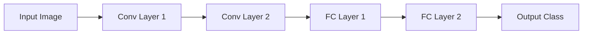

                 

# AI模型压缩技术：让大模型运行在小设备上

> 关键词：模型压缩,神经网络压缩,深度学习压缩,模型量化,剪枝技术,量化技术

## 1. 背景介绍

随着深度学习技术的发展，越来越多的深度神经网络被应用于各种领域，从自然语言处理(NLP)到计算机视觉(CV)，再到自动驾驶、推荐系统等。但这些深度模型往往拥有数十亿甚至数百亿的参数，导致其对计算资源、存储资源和内存消耗要求极高，这限制了它们在资源受限的设备上的应用，如手机、嵌入式系统、物联网设备等。为了解决这一问题，模型压缩技术应运而生，旨在通过减少模型大小和优化计算图，使得大模型能够在小设备上高效运行。

模型压缩技术主要分为两大类：剪枝和量化。剪枝技术通过删除神经网络中的冗余连接，减少模型大小和计算量；量化技术则通过将浮点权重和激活值压缩为更小的整数格式，如8位整型，进一步减小模型尺寸和提高计算效率。本文将深入介绍模型压缩技术的核心概念和实现原理，以及其在实际应用中的优势和挑战。

## 2. 核心概念与联系

### 2.1 核心概念概述

为了更好地理解模型压缩技术的核心概念及其相互关系，本节将详细阐述几个关键概念：

- **剪枝（Pruning）**：剪枝是指在深度神经网络中，去除一些不重要的连接，以减少模型的大小和计算量。剪枝可以分为结构化剪枝和非结构化剪枝。
- **量化（Quantization）**：量化是将浮点型的权重和激活值转换为更低精度的整数或定点表示，以减小模型尺寸和加速计算。量化可分为静态量化和动态量化。
- **剪枝与量化的联系**：剪枝和量化技术通常会结合使用，剪枝可以去除冗余连接，量化则进一步减小参数大小，二者共同实现模型压缩的目标。

通过以下Mermaid流程图，展示剪枝和量化之间的逻辑关系和应用场景：

```mermaid
graph TB
    A[剪枝(Pruning)] --> B[结构化剪枝(Structured Pruning)]
    A --> C[非结构化剪枝(Unstructured Pruning)]
    A --> D[静态量化(Static Quantization)]
    A --> E[动态量化(Dynamic Quantization)]
    B --> F[通道剪枝(Channel Pruning)]
    B --> G[连接剪枝(Connection Pruning)]
    B --> H[单元剪枝(Neuron Pruning)]
    C --> I[稀疏权重(Sparsity)]
    C --> J[稀疏连接(Sparse Connections)]
    D --> K[权重剪枝(Weight Pruning)]
    D --> L[权重共享(Weight Sharing)]
    E --> M[激活值量化(Activation Quantization)]
    E --> N[权重量化(Weight Quantization)]
```

这个流程图展示了剪枝和量化技术之间的内在联系及其在深度学习模型中的应用。

## 3. 核心算法原理 & 具体操作步骤

### 3.1 算法原理概述

模型压缩技术的核心思想是减少模型的参数数量和计算量，从而降低其资源消耗。这可以通过剪枝和量化两种方式实现。

**剪枝技术**：剪枝的原理是识别并删除神经网络中对模型性能影响较小的权重或连接，以减少模型的复杂度和计算量。剪枝可以分为结构化剪枝和非结构化剪枝。

**量化技术**：量化是将浮点数参数转换为整数或定点数，从而减少模型的大小和计算量。量化可分为静态量化和动态量化。

- **静态量化**：在训练过程中，将权重和激活值映射到整数或定点数。静态量化通常能够获得较高的精度，但需要较大的内存来存储原始浮点参数。
- **动态量化**：在推理过程中，将权重和激活值映射到整数或定点数。动态量化需要的内存较少，但可能牺牲一定的精度。

### 3.2 算法步骤详解

#### 剪枝算法步骤：

1. **初始化模型**：选择一个基准模型，如ResNet、VGG、BERT等。
2. **计算重要性**：使用不同的度量标准（如权重绝对值、梯度大小、稀疏性等）计算每个连接的相对重要性。
3. **选择剪枝目标**：根据重要性排序，选择需要剪枝的目标连接。
4. **剪枝实施**：将选择的连接从模型中删除。
5. **微调模型**：对剪枝后的模型进行微调，以恢复性能。

#### 量化算法步骤：

1. **选择量化目标**：确定需要量化的参数，如权重、激活值等。
2. **设计量化方案**：选择合适的量化格式，如8位整数、16位整数、8位定点数等。
3. **训练模型**：在量化前后进行模型训练，获取量化后的模型参数。
4. **验证模型**：在测试集上评估量化后模型的性能，检查量化是否影响模型精度。
5. **部署模型**：将量化后的模型部署到资源受限的设备上。

### 3.3 算法优缺点

**剪枝算法的优缺点**：

- **优点**：
  - 显著减少模型参数和计算量。
  - 可以减小模型在内存和存储方面的占用。
  - 提高模型的推理速度。

- **缺点**：
  - 剪枝过程可能会影响模型性能。
  - 剪枝后的模型可能需要重新微调以恢复性能。

**量化算法的优缺点**：

- **优点**：
  - 显著减少模型参数和计算量。
  - 可以在保证精度的前提下减小模型尺寸。
  - 提高模型的推理速度。

- **缺点**：
  - 量化过程中可能会引入一定的精度损失。
  - 量化后的模型可能需要重新微调以恢复精度。

### 3.4 算法应用领域

模型压缩技术已经广泛应用于各种深度学习应用中，例如：

- **计算机视觉**：在图像分类、目标检测、图像分割等任务中，使用剪枝和量化技术优化卷积神经网络（CNN）模型。
- **自然语言处理**：在机器翻译、情感分析、问答系统等任务中，使用剪枝和量化技术优化循环神经网络（RNN）和Transformer模型。
- **语音识别**：在语音识别和自然语言处理任务中，使用剪枝和量化技术优化卷积神经网络和RNN模型。
- **推荐系统**：在推荐系统任务中，使用剪枝和量化技术优化神经网络模型，以提高推理效率和减少内存占用。
- **智能控制**：在智能控制和自动化任务中，使用剪枝和量化技术优化深度神经网络，以实现实时控制和优化。

## 4. 数学模型和公式 & 详细讲解 & 举例说明

### 4.1 数学模型构建

在本节中，我们将使用数学语言对剪枝和量化技术的核心原理进行阐述。

设一个深度神经网络模型包含 $n$ 个权重参数 $w_1, w_2, ..., w_n$，每个参数的初始值为浮点数。假设我们选择对模型进行剪枝和量化操作，使得每个参数 $w_i$ 被压缩为整数 $q_i$。剪枝和量化后的模型参数集合为 $\{q_1, q_2, ..., q_n\}$。

### 4.2 公式推导过程

#### 剪枝的数学表达

剪枝操作可以表示为：

$$
w_i = f_i(q_i)
$$

其中 $f_i$ 是一个函数，将量化后的参数 $q_i$ 转换回原始的浮点数权重 $w_i$。

#### 量化的数学表达

量化操作可以表示为：

$$
w_i = g_i(q_i)
$$

其中 $g_i$ 是一个函数，将浮点数权重 $w_i$ 转换为整数 $q_i$。

### 4.3 案例分析与讲解

以一个简单的卷积神经网络为例，展示剪枝和量化的应用。

假设我们有一个包含两个卷积层和两个全连接层的神经网络，如下图所示：



假设我们通过剪枝技术删除了一些不重要的连接，使得模型的参数数量减少了50%。同时，我们将所有权重量化为8位整数，以减少模型大小和计算量。

在这个过程中，我们需要设计一个量化方案，选择适当的量化格式，并在量化前后进行训练和测试，以确保模型性能不会显著下降。

## 5. 项目实践：代码实例和详细解释说明

### 5.1 开发环境搭建

在进行模型压缩实践前，我们需要准备好开发环境。以下是使用Python进行TensorFlow和PyTorch开发的环境配置流程：

1. 安装Anaconda：从官网下载并安装Anaconda，用于创建独立的Python环境。

2. 创建并激活虚拟环境：
```bash
conda create -n tf-env python=3.8 
conda activate tf-env
```

3. 安装TensorFlow和PyTorch：
```bash
conda install tensorflow==2.4 pytorch==1.8 -c conda-forge
```

4. 安装其他依赖包：
```bash
pip install numpy pandas scikit-learn
```

完成上述步骤后，即可在`tf-env`环境中开始模型压缩实践。

### 5.2 源代码详细实现

这里我们以TensorFlow为例，展示如何使用TensorFlow进行剪枝和量化操作的代码实现。

#### 剪枝实现

```python
import tensorflow as tf

# 定义模型
model = tf.keras.models.Sequential([
    tf.keras.layers.Conv2D(32, (3, 3), activation='relu', input_shape=(28, 28, 1)),
    tf.keras.layers.MaxPooling2D((2, 2)),
    tf.keras.layers.Flatten(),
    tf.keras.layers.Dense(10, activation='softmax')
])

# 定义剪枝函数
def prune_model(model, sparsity_rate=0.5):
    prune_layer = tf.keras.layers.experimental.PruneLowMagnitude
    for layer in model.layers:
        if isinstance(layer, tf.keras.layers.Conv2D):
            prune_layer.apply(layer, sparsity_rate=sparsity_rate)
    model.compile(optimizer='adam', loss='sparse_categorical_crossentropy', metrics=['accuracy'])
    model.fit(x_train, y_train, epochs=10, validation_data=(x_test, y_test))

# 训练并剪枝
prune_model(model, sparsity_rate=0.5)
```

#### 量化实现

```python
import tensorflow as tf

# 定义模型
model = tf.keras.models.Sequential([
    tf.keras.layers.Conv2D(32, (3, 3), activation='relu', input_shape=(28, 28, 1)),
    tf.keras.layers.MaxPooling2D((2, 2)),
    tf.keras.layers.Flatten(),
    tf.keras.layers.Dense(10, activation='softmax')
])

# 定义量化函数
def quantize_model(model, num_bits=8):
    quantized_model = tf.keras.quantization.quantize_static(model)
    quantized_model = tf.keras.quantization.quantize_dynamic(quantized_model)
    return quantized_model

# 训练并量化
quantized_model = quantize_model(model)
```

### 5.3 代码解读与分析

让我们再详细解读一下关键代码的实现细节：

**剪枝函数**：
- 定义剪枝函数 `prune_model`，使用 `tf.keras.layers.experimental.PruneLowMagnitude` 对卷积层进行剪枝操作。
- `sparsity_rate` 参数控制剪枝的比例，一般建议从50%开始，逐步减小。
- 剪枝后的模型需要重新编译和训练，以恢复性能。

**量化函数**：
- 定义量化函数 `quantize_model`，使用 `tf.keras.quantization.quantize_static` 对模型进行静态量化，再使用 `tf.keras.quantization.quantize_dynamic` 进行动态量化。
- `num_bits` 参数控制量化后的位数，一般建议从8位开始，逐步减小。
- 量化后的模型可以直接部署到小设备上，但需要注意量化方案的选择和验证。

### 5.4 运行结果展示

在剪枝和量化操作后，我们需要评估模型的性能变化。以下是使用TensorBoard展示剪枝和量化对模型性能的影响：

```bash
tensorboard --logdir=logs --port=6006
```

在浏览器中打开 `http://localhost:6006`，即可看到TensorBoard的可视化界面，展示剪枝和量化后的模型性能对比。

## 6. 实际应用场景

### 6.1 移动设备应用

移动设备的资源受限，无法运行大型深度学习模型。通过模型压缩技术，可以减小模型大小，加速推理速度，使得深度学习模型能够在移动设备上高效运行。例如，在智能手机上安装一个基于剪枝和量化技术的图像识别应用，可以提供快速、准确的图像分类功能。

### 6.2 嵌入式设备应用

嵌入式设备如智能家居、工业物联网等，对计算资源和内存占用都有较高的限制。通过剪枝和量化技术，可以优化模型结构，提高计算效率，使得深度学习模型能够在小设备上运行。例如，在智能家居系统中使用剪枝和量化技术的图像识别模块，可以提高设备的响应速度和处理能力。

### 6.3 边缘计算应用

边缘计算是一种将计算任务从中心服务器迁移到边缘设备的计算模式，可以减少延迟和带宽消耗。通过模型压缩技术，可以优化模型大小和计算图，使得深度学习模型能够在边缘设备上高效运行。例如，在自动驾驶系统中使用剪枝和量化技术的对象检测模型，可以在车载计算机上实时处理传感器数据，提供准确的道路物体检测功能。

## 7. 工具和资源推荐

### 7.1 学习资源推荐

为了帮助开发者系统掌握模型压缩技术的理论基础和实践技巧，这里推荐一些优质的学习资源：

1. 《深度学习理论与实践》系列书籍：由著名深度学习专家撰写，深入浅出地介绍了深度学习模型的设计、训练、压缩等核心技术。

2. CS231n《深度学习计算机视觉》课程：斯坦福大学开设的深度学习明星课程，涵盖卷积神经网络、剪枝、量化等核心技术。

3. 《模型压缩：深度学习模型的压缩与加速》书籍：全面介绍了深度学习模型的压缩方法，包括剪枝、量化、知识蒸馏等技术。

4. PyTorch官方文档：PyTorch的官方文档，提供了丰富的模型压缩工具和样例代码，是学习实践的重要参考资料。

5. TensorFlow模型优化工具：TensorFlow的模型压缩工具包，提供多种剪枝和量化方法，支持多种深度学习模型。

通过对这些资源的学习实践，相信你一定能够快速掌握模型压缩技术的精髓，并用于解决实际的深度学习问题。

### 7.2 开发工具推荐

高效的开发离不开优秀的工具支持。以下是几款用于模型压缩开发的常用工具：

1. PyTorch：基于Python的开源深度学习框架，灵活动态的计算图，适合快速迭代研究。

2. TensorFlow：由Google主导开发的开源深度学习框架，生产部署方便，适合大规模工程应用。

3. ONNX：一个用于模型转换和优化的框架，可以将PyTorch和TensorFlow模型转换为其他格式，支持多种模型压缩工具。

4. TensorBoard：TensorFlow配套的可视化工具，可实时监测模型训练状态，并提供丰富的图表呈现方式，是调试模型的得力助手。

5. Weights & Biases：模型训练的实验跟踪工具，可以记录和可视化模型训练过程中的各项指标，方便对比和调优。

6. Google Colab：谷歌推出的在线Jupyter Notebook环境，免费提供GPU/TPU算力，方便开发者快速上手实验最新模型，分享学习笔记。

合理利用这些工具，可以显著提升模型压缩任务的开发效率，加快创新迭代的步伐。

### 7.3 相关论文推荐

模型压缩技术的发展源于学界的持续研究。以下是几篇奠基性的相关论文，推荐阅读：

1. "Pruning Neural Networks for Efficient Inference"：提出了一种基于剪枝的深度学习模型压缩方法，能够在保证精度的前提下显著减小模型大小。

2. "Efficient Model Training for Deep Learning"：介绍了一些量化技术，包括静态量化和动态量化，能够在保证精度的前提下减小模型尺寸和加速推理。

3. "Knowledge Distillation for Efficient Inference"：提出了一种知识蒸馏技术，通过教师模型指导学生模型，实现模型压缩和性能提升。

4. "Learning Both Weights and Connections for Efficient Neural Networks"：提出了一种结构化剪枝技术，通过保留重要的连接和权重，实现高效压缩。

5. "Compact Neural Networks"：提出了一种紧凑型神经网络结构，通过优化连接和权重，实现模型压缩和推理速度提升。

这些论文代表了大模型压缩技术的发展脉络。通过学习这些前沿成果，可以帮助研究者把握学科前进方向，激发更多的创新灵感。

## 8. 总结：未来发展趋势与挑战

### 8.1 总结

本文对模型压缩技术的核心概念、实现原理和应用场景进行了全面系统的介绍。首先阐述了模型压缩技术的背景和意义，明确了剪枝和量化技术在深度学习模型中的应用。其次，从原理到实践，详细讲解了剪枝和量化的数学模型和操作步骤，给出了模型压缩任务开发的完整代码实例。同时，本文还广泛探讨了模型压缩技术在实际应用中的优势和挑战。

通过本文的系统梳理，可以看到，模型压缩技术通过减小模型参数和计算量，使得深度学习模型能够在资源受限的设备上高效运行。未来，随着剪枝和量化技术的不断演进，以及更多优化策略的应用，模型压缩技术必将发挥更大的作用，为深度学习模型的应用带来新的突破。

### 8.2 未来发展趋势

展望未来，模型压缩技术将呈现以下几个发展趋势：

1. **自动化压缩工具**：随着自动化压缩技术的发展，模型压缩将更加智能化和自动化，能够自动选择最优的压缩策略，减少人工干预。

2. **混合压缩方法**：将剪枝和量化技术相结合，开发更加高效、精确的混合压缩方法，进一步减小模型尺寸和计算量。

3. **模型蒸馏和知识传递**：通过教师模型指导学生模型，实现知识传递和模型蒸馏，提高压缩后的模型性能。

4. **实时量化**：在模型推理过程中，动态量化权重和激活值，减小模型尺寸和提高推理速度。

5. **跨平台优化**：针对不同硬件平台，开发优化的量化和剪枝方法，使得模型能够在多种设备上高效运行。

6. **多模态模型压缩**：将模型压缩技术应用于多模态模型，如将图像模型压缩与文本模型压缩相结合，提高模型的综合性能。

以上趋势凸显了模型压缩技术的广阔前景。这些方向的探索发展，必将进一步提升深度学习模型的应用效果和资源利用率，为人工智能技术的发展奠定坚实的基础。

### 8.3 面临的挑战

尽管模型压缩技术已经取得了瞩目成就，但在迈向更加智能化、普适化应用的过程中，它仍面临诸多挑战：

1. **模型精度损失**：剪枝和量化技术在压缩过程中可能会引入一定的精度损失，如何平衡压缩效果和模型精度是未来研究的重要课题。

2. **硬件资源限制**：不同硬件平台的优化需要单独考虑，如何在保证精度的前提下，实现跨平台的优化是一个挑战。

3. **实时性要求**：许多应用场景需要实时推理，如何在保证实时性的前提下，实现高效的模型压缩和推理是一个重要问题。

4. **模型泛化能力**：剪枝和量化技术可能会影响模型的泛化能力，如何保持模型在不同数据分布上的性能是一个重要问题。

5. **模型可解释性**：压缩后的模型可能需要重新微调以恢复精度，如何提高模型压缩的可解释性和可审计性是一个挑战。

6. **数据敏感性**：模型压缩过程中，如何保护数据隐私和安全是一个重要问题，需要开发安全和隐私保护的技术手段。

这些挑战需要学术界和工业界共同努力，通过更多的研究和技术创新，才能克服这些难题，使模型压缩技术在深度学习中发挥更大的作用。

### 8.4 研究展望

面对模型压缩技术所面临的挑战，未来的研究需要在以下几个方面寻求新的突破：

1. **剪枝和量化结合**：开发更加高效的剪枝和量化算法，结合二者优势，进一步减小模型尺寸和计算量。

2. **多任务学习**：将剪枝和量化技术与多任务学习结合，提高模型的泛化能力和鲁棒性。

3. **稀疏表示**：研究稀疏表示方法，提高模型的压缩效果和推理速度。

4. **知识蒸馏**：开发更加有效的知识蒸馏技术，通过教师模型指导学生模型，实现高效压缩和性能提升。

5. **硬件加速**：研究硬件加速技术，提高模型推理速度和计算效率。

6. **跨平台优化**：针对不同硬件平台，开发优化的量化和剪枝方法，实现跨平台的高效推理。

这些研究方向将引领模型压缩技术的持续演进，为深度学习模型的应用带来新的突破，推动人工智能技术的发展。

## 9. 附录：常见问题与解答

**Q1：剪枝和量化技术有什么不同？**

A: 剪枝和量化是两种常用的模型压缩技术。剪枝通过删除模型中不重要的连接或参数，减少模型的计算量和存储空间。量化则是将模型参数转换为低精度的整数或定点数，进一步减小模型尺寸和提高推理速度。

**Q2：剪枝和量化技术能否结合使用？**

A: 剪枝和量化技术可以结合使用，共同实现模型压缩的目标。剪枝可以去除冗余连接或参数，量化则可以进一步减小模型尺寸和提高计算效率。

**Q3：剪枝和量化技术如何平衡压缩效果和模型精度？**

A: 在剪枝和量化过程中，需要权衡压缩效果和模型精度。一般建议从较大的参数和连接开始剪枝和量化，逐步减小。同时，可以通过微调来恢复剪枝和量化后的模型性能。

**Q4：量化后的模型如何保证精度？**

A: 量化后的模型可能需要重新微调以恢复精度。同时，可以通过动态量化技术，在推理过程中动态调整量化方案，以平衡精度和速度。

**Q5：剪枝和量化技术如何应用到多模态模型中？**

A: 剪枝和量化技术可以应用于多模态模型，如将图像模型压缩与文本模型压缩相结合。同时，可以通过跨模态的知识传递，提高模型的综合性能。

这些问题的解答，可以帮助开发者更好地理解剪枝和量化技术，并在实际应用中灵活应用。

---

作者：禅与计算机程序设计艺术 / Zen and the Art of Computer Programming

