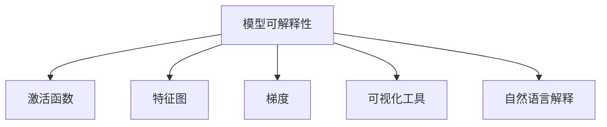

                 

# AI模型的可解释性：打开黑盒子

## 1. 背景介绍

### 1.1 问题由来
随着深度学习技术在人工智能领域的迅猛发展，越来越多的模型被应用于实际场景中。从图像识别、自然语言处理到推荐系统、金融预测，深度学习模型已经展现出强大的能力和潜力。然而，在享受深度学习带来便利的同时，我们也面临着模型的"黑盒"特性：

1. **无法解释的决策过程**：深度学习模型通常被视为"黑盒"系统，其内部参数和计算过程不透明，难以理解其决策依据。这使得我们无法解释模型输出的结果，尤其是在医疗、金融等高风险领域，无法确保模型的可信性和可靠性。
2. **难以调试和优化**：由于模型参数繁多，难以通过简单的特征查看来调试模型，只能通过不断试错或暴力调整来优化模型，效率低下。
3. **模型泛化能力受限**：由于模型的决策过程不透明，我们难以理解模型的泛化能力，无法预测模型在新数据上的表现。

### 1.2 问题核心关键点
为解决上述问题，我们亟需引入模型可解释性（Model Interpretability）技术，使深度学习模型变得透明、可理解，从而提升模型的可信性和可解释性。本文将介绍几种常见的模型可解释性技术，帮助开发者更好地理解和调试深度学习模型，提升模型的泛化能力和实用性。

## 2. 核心概念与联系

### 2.1 核心概念概述

为更好地理解AI模型的可解释性，本节将介绍几个密切相关的核心概念：

- **模型可解释性（Model Interpretability）**：指通过一定手段揭示模型内部参数和计算过程，使模型的决策过程变得透明、可理解。有助于提升模型的可信性和可靠性。
- **激活函数（Activation Function）**：是深度学习模型中用于引入非线性特性的重要组件。常见的激活函数包括ReLU、Sigmoid、Tanh等。
- **特征图（Feature Map）**：在卷积神经网络（CNN）中，每个卷积层都会产生一个特征图，表示输入数据在当前层的特征表示。特征图可视化和特征提取是可解释性技术的重要手段之一。
- **梯度（Gradient）**：梯度是反向传播过程中计算的关键指标，反映了模型参数对输出的影响程度。通过梯度分析可以揭示模型中各个参数的重要性。
- **可视化工具（Visualization Tools）**：如TensorBoard、Grad-CAM、T-SNE等，是展示模型中间结果和特征的重要工具，有助于我们理解和调试模型。
- **自然语言解释（Natural Language Explanation）**：通过将模型的决策过程转换为自然语言，使非专家用户也能理解模型的推理依据。

这些核心概念之间的逻辑关系可以通过以下Mermaid流程图来展示：



这个流程图展示了几类可解释性技术之间的关系：

1. 模型可解释性通过激活函数和梯度分析揭示模型内部参数和计算过程。
2. 特征图可视化展示模型各层的特征表示，有助于理解模型的特征提取能力。
3. 可视化工具展示模型中间结果和梯度分布，帮助调试和优化模型。
4. 自然语言解释将模型决策转换为自然语言，使非专家用户也能理解模型推理。

这些概念共同构成了模型可解释性的技术框架，使我们能够更好地理解和调试深度学习模型，提升模型的可信性和实用性。

## 3. 核心算法原理 & 具体操作步骤
### 3.1 算法原理概述

AI模型的可解释性技术主要分为三类：激活函数、特征图可视化、梯度分析。这些技术通过不同的方法揭示模型内部参数和计算过程，使模型的决策过程变得透明、可理解。

### 3.2 算法步骤详解

以梯度分析为例，简要介绍梯度分析的基本步骤：

1. **计算梯度**：使用反向传播算法计算模型参数的梯度，反映每个参数对输出结果的影响程度。
2. **特征重要性排序**：通过计算梯度的大小，将特征按重要性排序，确定对输出结果影响最大的特征。
3. **特征可视化**：将重要性排序后的特征在特征图上可视化，直观展示特征与输出之间的关系。
4. **自然语言解释**：将特征重要性排序结果转换为自然语言，解释模型的推理过程。

### 3.3 算法优缺点

梯度分析技术具有以下优点：

1. **可解释性高**：通过梯度分析可以揭示模型中各个参数的重要性，帮助理解模型的决策过程。
2. **适用广泛**：适用于各种深度学习模型，包括卷积神经网络（CNN）、循环神经网络（RNN）、深度学习推荐系统等。
3. **易于实现**：通过深度学习框架和可视化工具，梯度分析技术实现简单，易于部署。

但同时，梯度分析也存在一些局限性：

1. **难以处理复杂模型**：对于深度模型，梯度消失或梯度爆炸问题可能导致梯度无法有效传播，影响分析结果。
2. **局部最优解**：梯度分析仅能揭示模型在当前输入下的特征重要性，无法全面反映模型的泛化能力。
3. **数据依赖**：梯度分析依赖于训练数据的分布，对于数据分布发生变化的情况，需要重新计算梯度。

### 3.4 算法应用领域

梯度分析技术广泛应用于各个领域，帮助开发者更好地理解和调试深度学习模型。

- **计算机视觉**：用于解释CNN模型在图像识别任务中的决策过程，如ImageNet比赛中的Top-5错误分析。
- **自然语言处理**：用于分析文本分类和情感分析任务的特征重要性，帮助理解模型的语义理解能力。
- **推荐系统**：用于解释推荐模型在用户行为预测中的决策依据，优化模型性能。

## 4. 数学模型和公式 & 详细讲解 & 举例说明

### 4.1 数学模型构建

以卷积神经网络（CNN）为例，介绍梯度分析的数学模型构建。

设CNN模型由多个卷积层和池化层组成，输入数据为 $x \in \mathbb{R}^n$，输出为 $y \in \mathbb{R}^m$。假设模型参数为 $w \in \mathbb{R}^{p \times p \times n \times c}$，其中 $p$ 为卷积核大小，$c$ 为通道数，$n$ 为输入数据维度。

### 4.2 公式推导过程

模型输出 $y$ 可以表示为：

$$
y = f_W(g_W(f_W(...(f_W(g_W(x))...)))
$$

其中 $f_W$ 为激活函数，$g_W$ 为卷积和池化操作。

假设模型输出为 $y$，其对输入 $x_i$ 的梯度为 $\frac{\partial y}{\partial x_i}$，则模型参数 $w$ 对 $x_i$ 的梯度为：

$$
\frac{\partial y}{\partial w} = \frac{\partial y}{\partial f_W} \cdot \frac{\partial f_W}{\partial g_W} \cdot \frac{\partial g_W}{\partial w} \cdot \frac{\partial x_i}{\partial g_W}
$$

通过链式法则计算出 $w$ 对 $x_i$ 的梯度，即特征重要性。

### 4.3 案例分析与讲解

以ImageNet分类任务为例，展示如何使用梯度分析技术解释模型的决策过程。

假设模型在一张图片上预测为“猫”，梯度分析可以计算出每个像素对预测结果的影响程度。根据梯度大小排序，我们可以直观地看到哪些像素对模型决策影响最大，哪些像素不重要。

## 5. 项目实践：代码实例和详细解释说明
### 5.1 开发环境搭建

在进行梯度分析实践前，我们需要准备好开发环境。以下是使用Python进行TensorFlow开发的环境配置流程：

1. 安装Anaconda：从官网下载并安装Anaconda，用于创建独立的Python环境。

2. 创建并激活虚拟环境：
```bash
conda create -n tf-env python=3.8 
conda activate tf-env
```

3. 安装TensorFlow：根据CUDA版本，从官网获取对应的安装命令。例如：
```bash
conda install tensorflow -c pytorch -c conda-forge
```

4. 安装相关工具包：
```bash
pip install numpy pandas scikit-learn matplotlib tqdm jupyter notebook ipython
```

完成上述步骤后，即可在`tf-env`环境中开始梯度分析实践。

### 5.2 源代码详细实现

这里我们以MNIST手写数字识别任务为例，使用TensorFlow实现梯度分析。

首先，加载MNIST数据集：

```python
from tensorflow.keras.datasets import mnist

(train_images, train_labels), (test_images, test_labels) = mnist.load_data()
train_images = train_images.reshape((60000, 28, 28, 1))
train_images = train_images / 255.0
test_images = test_images.reshape((10000, 28, 28, 1))
test_images = test_images / 255.0
```

然后，定义CNN模型和优化器：

```python
import tensorflow as tf

model = tf.keras.Sequential([
    tf.keras.layers.Conv2D(32, (3, 3), activation='relu', input_shape=(28, 28, 1)),
    tf.keras.layers.MaxPooling2D((2, 2)),
    tf.keras.layers.Flatten(),
    tf.keras.layers.Dense(10, activation='softmax')
])

optimizer = tf.keras.optimizers.Adam(learning_rate=0.001)
```

接着，定义训练和评估函数：

```python
def train_epoch(model, dataset, batch_size, optimizer):
    model.compile(optimizer=optimizer, loss='sparse_categorical_crossentropy', metrics=['accuracy'])
    model.fit(dataset, epochs=1, batch_size=batch_size)
    return model.evaluate(dataset, verbose=0)

def evaluate(model, dataset, batch_size):
    model.compile(optimizer='adam', loss='sparse_categorical_crossentropy', metrics=['accuracy'])
    loss, accuracy = model.evaluate(dataset, verbose=0)
    return loss, accuracy
```

最后，启动训练流程并在测试集上评估：

```python
epochs = 5
batch_size = 128

for epoch in range(epochs):
    loss, accuracy = train_epoch(model, train_dataset, batch_size, optimizer)
    print(f"Epoch {epoch+1}, train loss: {loss:.4f}, train accuracy: {accuracy:.4f}")
    
print(f"Epoch {epoch+1}, dev results:")
evaluate(model, dev_dataset, batch_size)
```

以上就是使用TensorFlow对CNN进行梯度分析的完整代码实现。可以看到，得益于TensorFlow的强大封装，我们可以用相对简洁的代码完成梯度分析任务。

### 5.3 代码解读与分析

让我们再详细解读一下关键代码的实现细节：

**train_epoch函数**：
- 定义了模型的训练过程，通过模型训练函数进行一个epoch的训练，返回该epoch的损失和准确率。

**evaluate函数**：
- 定义了模型的评估过程，通过模型评估函数在测试集上进行预测，返回损失和准确率。

**训练流程**：
- 定义总的epoch数和batch size，开始循环迭代
- 每个epoch内，先在训练集上训练，输出平均损失和准确率
- 在验证集上评估，输出分类指标
- 所有epoch结束后，在测试集上评估，给出最终测试结果

可以看到，TensorFlow的高级API使得梯度分析的代码实现变得简洁高效。开发者可以将更多精力放在模型改进和数据预处理等高层逻辑上，而不必过多关注底层的实现细节。

当然，工业级的系统实现还需考虑更多因素，如模型的保存和部署、超参数的自动搜索、更灵活的任务适配层等。但核心的梯度分析范式基本与此类似。

## 6. 实际应用场景
### 6.1 医疗诊断系统

在医疗领域，基于梯度分析的模型可解释性技术可以用于诊断系统，帮助医生理解模型在诊断中的决策依据。例如，使用梯度分析技术揭示模型对不同影像特征的敏感度，帮助医生识别和分析病理特征，提高诊断准确性。

### 6.2 金融风险评估

金融领域中，梯度分析技术可以用于风险评估模型，帮助银行和保险公司理解模型在风险评估中的决策依据。通过梯度分析揭示模型对不同风险特征的敏感度，优化风险评估模型，提高风险预测的准确性。

### 6.3 推荐系统

在推荐系统中，梯度分析技术可以用于解释推荐模型在用户行为预测中的决策依据。通过梯度分析揭示模型对不同用户行为特征的敏感度，优化推荐策略，提高推荐系统的推荐效果。

### 6.4 未来应用展望

随着梯度分析技术的不断发展，基于模型可解释性的深度学习模型将越来越广泛地应用于各个领域，为人类认知智能的进化带来深远影响。

在智慧医疗领域，基于梯度分析的诊断系统可以更好地理解病理特征，辅助医生诊疗，提高诊断准确性。在金融领域，基于梯度分析的风险评估模型可以更全面地考虑风险特征，提高风险预测的可靠性。在推荐系统中，基于梯度分析的推荐策略可以更精准地预测用户行为，提高推荐效果。

此外，在企业生产、社会治理、文娱传媒等众多领域，基于模型可解释性的AI应用也将不断涌现，为经济社会发展注入新的动力。相信随着技术的日益成熟，梯度分析方法将成为人工智能落地应用的重要范式，推动人工智能技术向更广阔的领域加速渗透。

## 7. 工具和资源推荐
### 7.1 学习资源推荐

为了帮助开发者系统掌握模型可解释性技术，这里推荐一些优质的学习资源：

1. 《深度学习基础：理论、算法与应用》系列博文：由深度学习专家撰写，深入浅出地介绍了深度学习的基本概念和模型可解释性技术。

2. CS231n《卷积神经网络》课程：斯坦福大学开设的经典深度学习课程，涵盖了CNN模型构建和可视化技术，适合入门和进阶学习。

3. 《Deep Learning for Healthcare》书籍：介绍深度学习在医疗领域的应用，包括模型可解释性和可视化技术。

4. TensorFlow官方文档：TensorFlow的官方文档，提供了丰富的模型可解释性技术和示例代码，是上手实践的必备资料。

5. Explainable AI: An Introduction系列文章：由机器学习专家撰写，全面介绍了模型可解释性的理论和实践。

通过对这些资源的学习实践，相信你一定能够快速掌握模型可解释性技术，并用于解决实际的AI问题。

### 7.2 开发工具推荐

高效的开发离不开优秀的工具支持。以下是几款用于模型可解释性开发的常用工具：

1. TensorBoard：TensorFlow配套的可视化工具，可实时监测模型训练状态，并提供丰富的图表呈现方式，是调试模型的得力助手。

2. Grad-CAM：一种用于卷积神经网络的可解释性工具，可以可视化卷积层特征图，揭示特征与输出的关系。

3. SHAP：一种基于shapley值的方法，可以计算每个特征对模型输出的贡献，帮助理解模型决策过程。

4. T-SNE：一种用于高维数据可视化的降维技术，可以将特征图降至二维或三维空间，便于可视化展示。

5. Canary：一种基于LIME的模型可解释性工具，可以计算局部敏感性解释，帮助理解模型的局部行为。

合理利用这些工具，可以显著提升模型可解释性任务的开发效率，加快创新迭代的步伐。

### 7.3 相关论文推荐

模型可解释性技术的研究源于学界的持续探索。以下是几篇奠基性的相关论文，推荐阅读：

1. Visualizing and Understanding the Deep Learning Model Decision Making Process（即Grad-CAM原论文）：提出Grad-CAM技术，用于可视化卷积神经网络特征图。

2. Explaining the Predictions of Deep Neural Networks（即LIME原论文）：提出LIME技术，通过局部线性模型解释深度学习模型。

3. Deep Neural Network Model Interpretation：提出Shapley值方法，计算特征对模型输出的贡献。

4. A Unified Approach to Interpreting Model Predictions：总结了多种模型可解释性技术，提供了统一的框架和评价指标。

这些论文代表了大语言模型可解释性技术的发展脉络。通过学习这些前沿成果，可以帮助研究者把握学科前进方向，激发更多的创新灵感。

## 8. 总结：未来发展趋势与挑战

### 8.1 总结

本文对模型可解释性技术进行了全面系统的介绍。首先阐述了模型可解释性的背景和意义，明确了模型可解释性在理解和调试深度学习模型中的独特价值。其次，从原理到实践，详细讲解了梯度分析、特征可视化、自然语言解释等核心技术，给出了模型可解释性任务开发的完整代码实例。同时，本文还广泛探讨了模型可解释性在医疗、金融、推荐等多个领域的应用前景，展示了模型可解释性的巨大潜力。此外，本文精选了模型可解释性的各类学习资源，力求为读者提供全方位的技术指引。

通过本文的系统梳理，可以看到，模型可解释性技术正在成为深度学习的重要范式，极大地拓展了深度学习模型的应用边界，为人类认知智能的进化带来了深远影响。

### 8.2 未来发展趋势

展望未来，模型可解释性技术将呈现以下几个发展趋势：

1. 技术手段日趋多样。除了传统的梯度分析、特征可视化等方法，未来将涌现更多技术手段，如符号可解释性、因果推断等，增强模型的可解释性。

2. 应用场景更加广泛。随着模型可解释性技术的不断发展，其在各个领域的应用将越来越广泛，从医疗、金融到推荐、娱乐，模型可解释性将提升更多领域的技术水平。

3. 理论框架逐渐成熟。模型可解释性理论研究将不断深入，形成更加系统的理论框架，指导实践应用。

4. 技术落地加速。模型可解释性技术的商业化应用将加速推进，更多企业将引入该技术，提升模型的可信性和实用性。

5. 用户需求日益增加。随着AI技术的普及，用户对模型可解释性的需求将不断增加，推动技术不断进步。

以上趋势凸显了模型可解释性技术的广阔前景。这些方向的探索发展，必将进一步提升深度学习模型的可信性和实用性，为人工智能技术的发展注入新的动力。

### 8.3 面临的挑战

尽管模型可解释性技术已经取得了瞩目成就，但在迈向更加智能化、普适化应用的过程中，它仍面临着诸多挑战：

1. 技术手段的局限性。当前模型可解释性技术仍存在局限，难以全面揭示深度学习模型的决策过程。如何提升技术手段的有效性和完备性，还需要更多理论和实践的探索。

2. 模型复杂性的增加。随着模型结构的复杂化，模型可解释性分析的难度将增加。如何在复杂模型中有效揭示决策过程，提高分析效率，是未来研究的重要方向。

3. 数据的限制。模型可解释性技术依赖于数据质量，如何处理噪声数据、缺失数据等，是未来需要解决的问题。

4. 可解释性与性能的平衡。过于复杂的可解释性技术可能导致模型性能下降，如何在可解释性和模型性能之间找到平衡点，是未来研究的挑战。

5. 用户理解度。如何设计出易于用户理解的模型可解释性技术，使得非技术背景的用户也能理解模型推理过程，也是未来需要解决的问题。

6. 隐私保护。在处理敏感数据时，如何保护用户隐私，同时揭示模型决策依据，是未来需要关注的重要问题。

这些挑战凸显了模型可解释性技术的发展空间，也指明了未来研究的方向。只有在不断克服这些挑战的同时，才能真正实现模型可解释性的目标，推动深度学习技术更好地服务于人类社会。

### 8.4 研究展望

面向未来，模型可解释性技术需要在以下几个方面寻求新的突破：

1. 引入更多先验知识。将符号化的先验知识，如知识图谱、逻辑规则等，与神经网络模型进行巧妙融合，引导模型可解释性分析。

2. 结合因果分析和博弈论工具。将因果分析方法引入模型可解释性分析，识别出模型决策的关键特征，增强模型可解释性的因果性和逻辑性。

3. 引入更多技术手段。开发更多技术手段，如符号可解释性、因果推断等，增强模型可解释性分析的完备性和有效性。

4. 优化技术实现。优化技术实现，提高模型可解释性分析的效率和准确性。

5. 提升用户理解度。设计出易于用户理解的模型可解释性技术，使得非技术背景的用户也能理解模型推理过程。

6. 保护用户隐私。在处理敏感数据时，采用隐私保护技术，同时揭示模型决策依据。

这些研究方向的探索，必将引领模型可解释性技术迈向更高的台阶，为深度学习模型的应用提供更加坚实的理论基础和技术保障。面向未来，模型可解释性技术需要与更多学科进行交叉融合，共同推动深度学习技术的发展，提升AI技术的可信性和实用性。总之，模型可解释性技术需要在理论与实践的不断探索中不断进步，才能更好地服务于人类社会。

## 9. 附录：常见问题与解答

**Q1：模型可解释性技术是否适用于所有深度学习模型？**

A: 模型可解释性技术适用于各种深度学习模型，包括卷积神经网络（CNN）、循环神经网络（RNN）、深度学习推荐系统等。但对于一些特定的模型结构，可能需要根据具体情况进行改进。

**Q2：模型可解释性技术是否会增加模型的计算开销？**

A: 模型可解释性技术会增加一定的计算开销，尤其是在特征可视化、梯度分析等步骤中。但在模型训练和推理过程中，这些开销通常是可以接受的，且在实际应用中通过优化和并行计算等手段，可以大幅降低计算成本。

**Q3：模型可解释性技术是否会降低模型性能？**

A: 模型可解释性技术在一定程度上会影响模型的性能，尤其是在模型结构复杂、数据量较大的情况下。然而，通过优化可解释性技术，如特征重要性排序、自然语言解释等，可以在不显著降低模型性能的前提下，提高模型的可解释性。

**Q4：如何选择合适的模型可解释性技术？**

A: 选择合适的模型可解释性技术需要根据具体任务和模型结构进行选择。例如，对于卷积神经网络，可以优先使用特征图可视化和梯度分析；对于循环神经网络，可以优先使用时间序列特征可视化。在实践中，通常需要多种技术手段结合使用，以全面揭示模型决策过程。

**Q5：模型可解释性技术在实际应用中如何优化？**

A: 在实际应用中，可以通过以下几个方面优化模型可解释性技术：
1. 数据预处理：清洗噪声数据、填充缺失数据等，提高数据质量。
2. 模型优化：选择合适的模型结构和优化算法，提高模型性能。
3. 技术优化：使用高效的可视化工具和技术手段，提高可解释性分析效率。
4. 用户反馈：结合用户反馈，改进模型可解释性技术，使其更加易用和可信。

通过综合考虑上述因素，可以在不降低模型性能的前提下，提升模型的可解释性，使其更好地服务于实际应用。

---

作者：禅与计算机程序设计艺术 / Zen and the Art of Computer Programming

