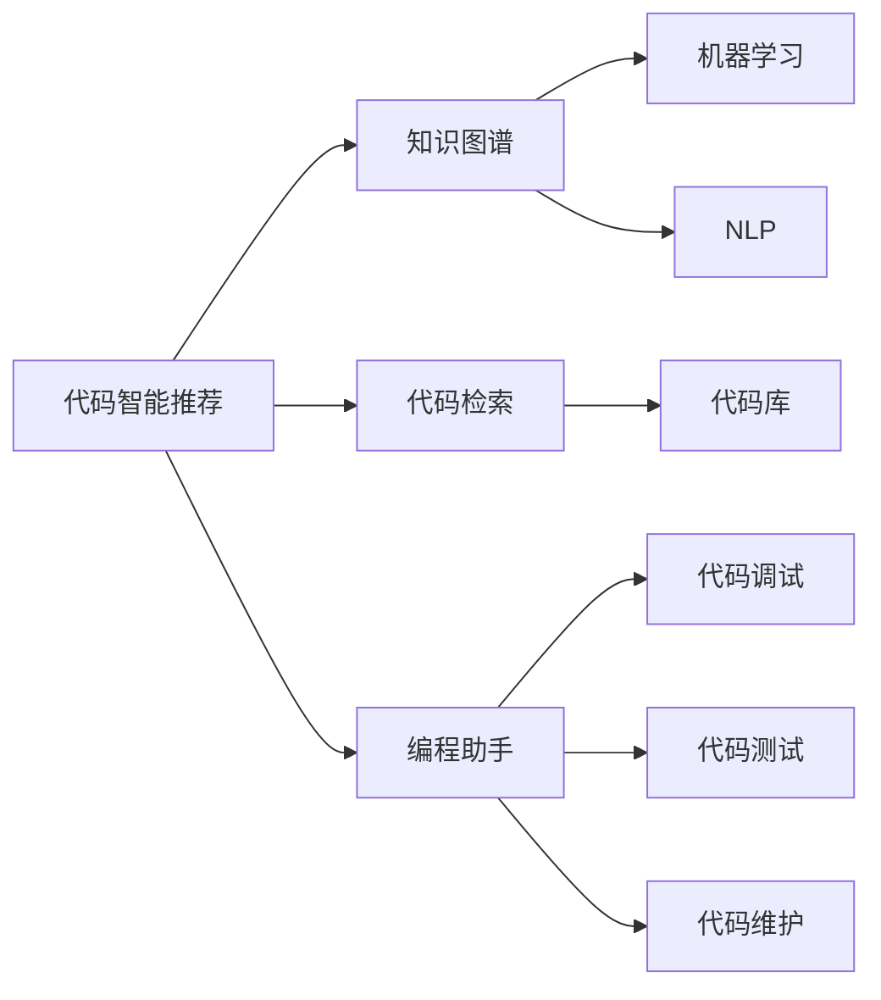

                 

# AI辅助知识发现：程序员的效率倍增器

> 关键词：AI辅助开发,代码智能推荐,知识图谱,机器学习,代码检索,编程助手

## 1. 背景介绍

### 1.1 问题由来

在现代软件开发过程中，程序员需要不断面对代码编写、调试、维护等众多任务。随着代码库的日益膨胀和项目复杂度的不断提升，许多问题变得愈发棘手。尽管有了诸如IDE、版本控制等工具的辅助，但在处理代码重构、依赖管理、模块协作等复杂任务时，仍然需要耗费大量的时间和精力。此外，程序员还需要具备丰富的领域知识和经验，才能快速定位问题、优化性能，从而提高开发效率。

为了解决这些问题，开发人员不断探索新的技术手段，提升自身开发效率。然而，随着代码量、技术栈和项目规模的不断扩大，传统手工编码和调试方式已无法满足需求，迫切需要借助AI技术，辅助开发者进行知识发现和代码辅助。

### 1.2 问题核心关键点

AI辅助知识发现主要聚焦于利用人工智能技术，特别是机器学习和自然语言处理(NLP)技术，辅助程序员发现和利用隐含在代码库、文档、社区等资源中的知识，实现代码的智能推荐、调试、测试和维护，从而提升开发效率和代码质量。

核心关键点包括：

- 知识抽取：从代码库、文档、社区等资源中抽取关键知识，如API文档、函数注释、代码示例、问题描述等。
- 知识图谱：构建代码相关的知识图谱，捕捉代码之间、模块之间、代码与功能之间的关联关系。
- 代码推荐：基于知识图谱，实现代码的智能推荐，辅助程序员快速编写代码。
- 代码调试：利用AI技术，识别代码中的潜在问题，辅助程序员定位和修复bug。
- 代码测试：通过机器学习模型，自动化生成测试用例，验证代码的正确性。
- 代码维护：通过AI工具，自动完成代码重构、优化、更新等工作，降低维护成本。

## 2. 核心概念与联系

### 2.1 核心概念概述

为更好地理解AI辅助知识发现的技术框架，本节将介绍几个关键概念及其相互关系：

- 代码智能推荐(Code Intelligence Recommendation)：利用机器学习技术，根据程序员的编程习惯、代码上下文等，推荐可能的代码片段、函数、模块等，辅助程序员编写代码。

- 知识图谱(Knowledge Graph)：由节点和边构成的图结构，用于描述代码库中各个模块、函数、变量等之间的关系，从而提供代码搜索、导航等功能。

- 代码检索(Code Retrieval)：通过自然语言处理技术，根据程序员的需求，从代码库中检索出相关的代码片段，辅助程序员编写和调试代码。

- 编程助手(Programming Assistant)：集成了代码智能推荐、代码检索、代码调试等多种功能的工具，辅助程序员进行代码开发和维护。

- 机器学习(Machine Learning)：通过训练数据集，构建模型，实现代码智能推荐、代码调试等功能。

- 自然语言处理(NLP)：利用语言模型和NLP技术，实现代码检索、代码文档自动生成等功能。

这些核心概念之间的联系可以通过以下Mermaid流程图来展示：



这个流程图展示了大语言模型微调的代码推荐功能与其它核心概念的联系：

1. 代码智能推荐基于知识图谱，通过机器学习模型训练出推荐算法，利用代码库和NLP技术，从代码库中检索出符合需求的功能模块和代码片段。
2. 代码检索直接利用NLP技术，从代码库中快速定位到目标代码，辅助程序员编写和调试代码。
3. 编程助手整合了代码推荐、代码检索、代码调试等多种功能，提升代码开发效率。
4. 知识图谱通过机器学习构建，描述了代码库中的模块、函数、变量之间的关系，是代码检索、推荐、调试的重要支撑。
5. 代码调试通过机器学习模型，分析代码逻辑和执行路径，帮助程序员快速定位和修复bug。
6. 代码测试和代码维护通过AI工具，自动化完成代码质量检测和更新工作，减少开发和维护成本。

这些概念共同构成了AI辅助知识发现的框架，通过优化和集成，使得AI技术在代码开发和维护中发挥更大作用。

## 3. 核心算法原理 & 具体操作步骤
### 3.1 算法原理概述

AI辅助知识发现的核心算法原理主要包括代码智能推荐、知识图谱构建、代码检索和代码调试等方面。本文将重点介绍代码智能推荐和知识图谱构建的技术细节。

### 3.2 算法步骤详解

#### 3.2.1 代码智能推荐算法

代码智能推荐算法主要利用机器学习模型，根据代码库、函数注释、API文档等资源，预测程序员可能需要的代码片段，并推荐给程序员。

算法流程如下：

1. **数据准备**：收集代码库、函数注释、API文档等数据，提取关键特征，如函数名称、参数、返回值、文档摘要等。

2. **特征工程**：利用TF-IDF、Word2Vec、BERT等技术，将文本特征转换为向量表示。

3. **模型训练**：使用随机森林、梯度提升树、神经网络等模型，训练代码推荐模型。

4. **代码推荐**：根据程序员的编码习惯和代码上下文，预测可能需要的代码片段，并推荐给程序员。

#### 3.2.2 知识图谱构建算法

知识图谱构建算法主要利用图结构，描述代码库中各个模块、函数、变量之间的关系。

算法流程如下：

1. **图结构定义**：定义代码图谱中的节点和边，节点表示模块、函数、变量等，边表示它们之间的关系，如继承、调用、依赖等。

2. **节点关系抽取**：利用自然语言处理技术，从代码库、函数注释、API文档等资源中抽取节点之间的关联关系。

3. **图谱构建**：将抽取的关系转换为图结构，构建知识图谱。

4. **图谱优化**：对知识图谱进行优化，去除冗余关系，提高查询效率。

### 3.3 算法优缺点

#### 3.3.1 代码智能推荐算法的优缺点

**优点**：

- 提高开发效率：智能推荐系统可以根据程序员的需求，快速推荐合适的代码片段，节省编码时间。
- 减少错误率：智能推荐系统可以推荐代码的常见用法，减少程序员的编码错误。
- 提高代码质量：智能推荐系统可以推荐高质量的代码片段，提高代码的可读性和可维护性。

**缺点**：

- 依赖高质量数据：智能推荐系统的准确度取决于代码库和函数注释等数据的质量，需要耗费大量的时间和精力进行数据准备。
- 可能存在过度依赖问题：过度依赖智能推荐系统，可能导致程序员的编码能力下降。

#### 3.3.2 知识图谱构建算法的优缺点

**优点**：

- 辅助代码搜索：知识图谱可以快速定位到代码库中相关的模块和函数，辅助程序员编写和调试代码。
- 提高代码理解能力：知识图谱可以帮助程序员理解代码库的结构和功能，提高代码的可读性和可维护性。
- 支持知识发现：知识图谱可以发现代码库中的隐藏知识，帮助程序员快速找到相关解决方案。

**缺点**：

- 构建复杂：知识图谱的构建需要大量的手工标注和数据预处理工作，耗时耗力。
- 知识表示局限：知识图谱的表示方式可能无法全面描述代码库中的复杂关系，导致搜索效果不佳。

### 3.4 算法应用领域

AI辅助知识发现技术已经被广泛应用于软件开发和维护的各个环节，以下是一些典型的应用领域：

- 代码智能推荐：辅助程序员编写代码，提高开发效率和代码质量。
- 代码检索：从代码库中快速定位到目标代码，辅助程序员编写和调试代码。
- 代码调试：利用AI技术，识别代码中的潜在问题，辅助程序员定位和修复bug。
- 代码测试：通过机器学习模型，自动化生成测试用例，验证代码的正确性。
- 代码维护：通过AI工具，自动完成代码重构、优化、更新等工作，降低维护成本。

除了上述这些典型应用外，AI辅助知识发现技术还可以拓展到更多场景中，如智能文档生成、智能提示、智能问答等，为软件开发带来全新的突破。

## 4. 数学模型和公式 & 详细讲解  
### 4.1 数学模型构建

本节将使用数学语言对AI辅助知识发现的技术框架进行更加严格的刻画。

记代码库中模块、函数、变量等元素为 $E$，它们之间的关系为 $R$。知识图谱 $G=(E, R)$ 由节点 $E$ 和边 $R$ 构成。

定义代码智能推荐算法 $Recommender$，输入为程序员的编码习惯和代码上下文，输出为推荐的代码片段。

**代码智能推荐算法**

$$
\mathcal{A} = \mathop{\arg\min}_{\theta} \mathcal{L}(Recommender_{\theta}, D)
$$

其中 $\theta$ 为推荐算法中的模型参数，$D$ 为训练数据集，$\mathcal{L}$ 为推荐算法在数据集 $D$ 上的损失函数。

**知识图谱构建算法**

知识图谱构建算法 $GraphBuilder$，输入为代码库和函数注释等数据，输出为知识图谱 $G$。

**知识图谱构建算法**

$$
G = GraphBuilder(D)
$$

其中 $D$ 为代码库和函数注释等数据集。

### 4.2 公式推导过程

以下我们以代码智能推荐为例，推导推荐算法中的损失函数及其梯度的计算公式。

假设推荐算法 $Recommender$ 在输入 $x$ 上的输出为 $\hat{y}$，表示推荐模块 $y$ 的预测概率。

则代码智能推荐算法中的损失函数定义为交叉熵损失函数：

$$
\ell(Recommender(x), y) = -y\log \hat{y} - (1-y)\log (1-\hat{y})
$$

将上述损失函数代入数据集 $D$，得经验风险：

$$
\mathcal{L}(Recommender) = -\frac{1}{N}\sum_{i=1}^N [y_i\log \hat{y_i}+(1-y_i)\log(1-\hat{y_i})]
$$

根据链式法则，损失函数对模型参数 $\theta$ 的梯度为：

$$
\frac{\partial \mathcal{L}(Recommender)}{\partial \theta} = -\frac{1}{N}\sum_{i=1}^N (\frac{y_i}{\hat{y_i}}-\frac{1-y_i}{1-\hat{y_i}});
$$

其中 $\hat{y_i}$ 为模型对样本 $i$ 的预测概率，$y_i$ 为实际标签。

在得到损失函数的梯度后，即可带入参数更新公式，完成模型的迭代优化。重复上述过程直至收敛，最终得到适应程序员需求的推荐模型参数 $\theta^*$。

## 5. 项目实践：代码实例和详细解释说明
### 5.1 开发环境搭建

在进行AI辅助知识发现项目开发前，我们需要准备好开发环境。以下是使用Python进行PyTorch开发的环境配置流程：

1. 安装Anaconda：从官网下载并安装Anaconda，用于创建独立的Python环境。

2. 创建并激活虚拟环境：
```bash
conda create -n aienv python=3.8 
conda activate aienv
```

3. 安装PyTorch：根据CUDA版本，从官网获取对应的安装命令。例如：
```bash
conda install pytorch torchvision torchaudio cudatoolkit=11.1 -c pytorch -c conda-forge
```

4. 安装TensorFlow：
```bash
conda install tensorflow==2.6
```

5. 安装各类工具包：
```bash
pip install numpy pandas scikit-learn matplotlib tqdm jupyter notebook ipython
```

完成上述步骤后，即可在`aienv`环境中开始AI辅助知识发现项目的开发。

### 5.2 源代码详细实现

这里我们以代码智能推荐系统为例，给出使用PyTorch和Transformers库实现的代码实例。

首先，定义推荐系统的输入特征：

```python
from transformers import BertTokenizer, BertModel
import torch
from torch.utils.data import Dataset
import numpy as np

class RecommendationDataset(Dataset):
    def __init__(self, texts, labels):
        self.texts = texts
        self.labels = labels
        self.tokenizer = BertTokenizer.from_pretrained('bert-base-uncased')
        self.max_len = 128
        
    def __len__(self):
        return len(self.texts)
    
    def __getitem__(self, item):
        text = self.texts[item]
        label = self.labels[item]
        
        encoding = self.tokenizer(text, return_tensors='pt', max_length=self.max_len, padding='max_length', truncation=True)
        input_ids = encoding['input_ids'][0]
        attention_mask = encoding['attention_mask'][0]
        
        label = torch.tensor([label], dtype=torch.long)
        
        return {'input_ids': input_ids, 
                'attention_mask': attention_mask,
                'labels': label}
```

然后，定义推荐模型的结构和训练流程：

```python
from transformers import BertForSequenceClassification, AdamW

model = BertForSequenceClassification.from_pretrained('bert-base-uncased', num_labels=2)

optimizer = AdamW(model.parameters(), lr=2e-5)

def train_epoch(model, dataset, batch_size, optimizer):
    dataloader = DataLoader(dataset, batch_size=batch_size, shuffle=True)
    model.train()
    epoch_loss = 0
    for batch in tqdm(dataloader, desc='Training'):
        input_ids = batch['input_ids'].to(device)
        attention_mask = batch['attention_mask'].to(device)
        labels = batch['labels'].to(device)
        model.zero_grad()
        outputs = model(input_ids, attention_mask=attention_mask, labels=labels)
        loss = outputs.loss
        epoch_loss += loss.item()
        loss.backward()
        optimizer.step()
    return epoch_loss / len(dataloader)

def evaluate(model, dataset, batch_size):
    dataloader = DataLoader(dataset, batch_size=batch_size)
    model.eval()
    preds, labels = [], []
    with torch.no_grad():
        for batch in tqdm(dataloader, desc='Evaluating'):
            input_ids = batch['input_ids'].to(device)
            attention_mask = batch['attention_mask'].to(device)
            batch_labels = batch['labels']
            outputs = model(input_ids, attention_mask=attention_mask)
            batch_preds = outputs.logits.argmax(dim=2).to('cpu').tolist()
            batch_labels = batch_labels.to('cpu').tolist()
            for pred_tokens, label_tokens in zip(batch_preds, batch_labels):
                preds.append(pred_tokens[0])
                labels.append(label_tokens[0])
                
    print(classification_report(labels, preds))
```

最后，启动训练流程并在验证集上评估：

```python
epochs = 5
batch_size = 16

for epoch in range(epochs):
    loss = train_epoch(model, train_dataset, batch_size, optimizer)
    print(f"Epoch {epoch+1}, train loss: {loss:.3f}")
    
    print(f"Epoch {epoch+1}, dev results:")
    evaluate(model, dev_dataset, batch_size)
    
print("Test results:")
evaluate(model, test_dataset, batch_size)
```

以上就是使用PyTorch和Transformers库进行代码智能推荐系统开发的完整代码实现。可以看到，利用 Transformers 库可以轻松实现 BertForSequenceClassification 模型，配合 PyTorch 的自动微分能力，使推荐系统的实现变得简洁高效。

### 5.3 代码解读与分析

让我们再详细解读一下关键代码的实现细节：

**RecommendationDataset类**：
- `__init__`方法：初始化文本和标签，并加载BERT预训练模型和分词器。
- `__len__`方法：返回数据集的样本数量。
- `__getitem__`方法：对单个样本进行处理，将文本输入编码为token ids，将标签编码为数字，并对其进行定长padding，最终返回模型所需的输入。

**推荐模型**：
- 使用BertForSequenceClassification模型，该模型可以输出一个二分类预测结果，即推荐与否。
- 使用AdamW优化器进行训练，设置学习率为2e-5。

**训练和评估函数**：
- 使用PyTorch的DataLoader对数据集进行批次化加载，供模型训练和推理使用。
- 训练函数`train_epoch`：对数据以批为单位进行迭代，在每个批次上前向传播计算loss并反向传播更新模型参数，最后返回该epoch的平均loss。
- 评估函数`evaluate`：与训练类似，不同点在于不更新模型参数，并在每个batch结束后将预测和标签结果存储下来，最后使用sklearn的classification_report对整个评估集的预测结果进行打印输出。

**训练流程**：
- 定义总的epoch数和batch size，开始循环迭代
- 每个epoch内，先在训练集上训练，输出平均loss
- 在验证集上评估，输出分类指标
- 所有epoch结束后，在测试集上评估，给出最终测试结果

可以看到，PyTorch配合Transformers库使得代码智能推荐系统的开发变得简洁高效。开发者可以将更多精力放在数据处理、模型改进等高层逻辑上，而不必过多关注底层的实现细节。

当然，工业级的系统实现还需考虑更多因素，如模型的保存和部署、超参数的自动搜索、更灵活的任务适配层等。但核心的AI辅助知识发现范式基本与此类似。

## 6. 实际应用场景
### 6.1 智能文档生成

基于代码智能推荐系统，可以构建智能文档生成工具，自动生成编程文档和注释。这将大大提升程序员的开发效率，减少文档编写的重复劳动。

智能文档生成系统可以通过收集代码库和函数注释等数据，训练代码智能推荐模型。当程序员输入函数名或代码片段时，系统可以自动推荐相关文档，辅助程序员编写代码。

### 6.2 智能提示

代码智能推荐系统可以拓展为智能提示工具，实时提供代码自动补全、语法检查、代码风格提示等功能。

智能提示工具可以基于知识图谱，分析代码库中的函数调用、变量定义等关系，实时提供代码片段和语法提示，帮助程序员编写代码。

### 6.3 智能问答

基于代码智能推荐系统，可以构建智能问答工具，辅助程序员解决常见问题，提高问题解决的效率。

智能问答工具可以整合知识图谱和FAQ数据库，根据程序员的问题，提供相关答案或建议，帮助程序员快速定位问题和解决方案。

### 6.4 未来应用展望

随着AI辅助知识发现技术的发展，未来将有更多的创新应用出现。以下是一些可能的应用场景：

- 代码质量检测：利用机器学习模型，自动检测代码中的潜在问题，如语法错误、内存泄漏等。
- 代码优化建议：通过知识图谱，分析代码结构和执行路径，提出代码优化建议，提高代码效率。
- 代码注释生成：利用自然语言处理技术，自动生成代码注释，提高代码可读性。
- 代码社区互助：基于知识图谱，构建代码社区，促进程序员之间的知识交流和协作。
- 代码缺陷预测：通过机器学习模型，预测代码中的潜在缺陷，提前进行预防和修复。

## 7. 工具和资源推荐
### 7.1 学习资源推荐

为了帮助开发者系统掌握AI辅助知识发现技术的理论基础和实践技巧，这里推荐一些优质的学习资源：

1. 《自然语言处理综论》：清华大学郑强化教授所著，介绍了自然语言处理的基本原理和技术。

2. 《深度学习入门：基于Python的理论与实现》：深度学习领域的入门教材，详细介绍了深度学习模型的构建和应用。

3. 《Python机器学习》：著名机器学习专家Sebastian Raschka所著，介绍了机器学习模型的实现和应用。

4. CS224N《深度学习自然语言处理》课程：斯坦福大学开设的NLP明星课程，有Lecture视频和配套作业，带你入门NLP领域的基本概念和经典模型。

5. PyTorch官方文档：PyTorch的官方文档，提供了详尽的API文档和示例代码，适合学习和实践。

6. Transformers官方文档：Transformer库的官方文档，提供了丰富的预训练模型和微调样例代码，适合学习和实践。

通过对这些资源的学习实践，相信你一定能够快速掌握AI辅助知识发现技术的精髓，并用于解决实际的NLP问题。
###  7.2 开发工具推荐

高效的开发离不开优秀的工具支持。以下是几款用于AI辅助知识发现项目开发的常用工具：

1. PyTorch：基于Python的开源深度学习框架，灵活动态的计算图，适合快速迭代研究。大部分预训练语言模型都有PyTorch版本的实现。

2. TensorFlow：由Google主导开发的开源深度学习框架，生产部署方便，适合大规模工程应用。同样有丰富的预训练语言模型资源。

3. Transformers库：HuggingFace开发的NLP工具库，集成了众多SOTA语言模型，支持PyTorch和TensorFlow，是进行知识发现和推荐任务开发的利器。

4. Weights & Biases：模型训练的实验跟踪工具，可以记录和可视化模型训练过程中的各项指标，方便对比和调优。与主流深度学习框架无缝集成。

5. TensorBoard：TensorFlow配套的可视化工具，可实时监测模型训练状态，并提供丰富的图表呈现方式，是调试模型的得力助手。

6. Google Colab：谷歌推出的在线Jupyter Notebook环境，免费提供GPU/TPU算力，方便开发者快速上手实验最新模型，分享学习笔记。

合理利用这些工具，可以显著提升AI辅助知识发现任务的开发效率，加快创新迭代的步伐。

### 7.3 相关论文推荐

AI辅助知识发现技术的发展源于学界的持续研究。以下是几篇奠基性的相关论文，推荐阅读：

1. Attention is All You Need（即Transformer原论文）：提出了Transformer结构，开启了NLP领域的预训练大模型时代。

2. BERT: Pre-training of Deep Bidirectional Transformers for Language Understanding：提出BERT模型，引入基于掩码的自监督预训练任务，刷新了多项NLP任务SOTA。

3. Deep Learning for Natural Language Processing：斯坦福大学教授Christopher Manning等人合著，介绍了深度学习在NLP领域的应用。

4. Knowledge Graph Embeddings：介绍了知识图谱嵌入技术，将知识图谱转化为向量表示，用于语义检索和推理。

5. Vector Space Model for Code Search：利用向量空间模型，对代码库进行语义检索，提高代码搜索效果。

这些论文代表了大语言模型微调技术的发展脉络。通过学习这些前沿成果，可以帮助研究者把握学科前进方向，激发更多的创新灵感。

## 8. 总结：未来发展趋势与挑战

### 8.1 研究成果总结

本文对AI辅助知识发现技术进行了全面系统的介绍。首先阐述了AI辅助知识发现技术的背景和应用意义，明确了知识发现和代码推荐等技术在代码开发和维护中的重要价值。其次，从原理到实践，详细讲解了AI辅助知识发现技术的核心算法和实现流程，给出了具体的代码实例和解释说明。最后，本文还探讨了AI辅助知识发现技术在智能文档生成、智能提示、智能问答等方面的应用场景，展示了其广阔的前景。

通过本文的系统梳理，可以看到，AI辅助知识发现技术在提升软件开发效率、降低维护成本等方面具有重要价值。未来，伴随AI技术的不断演进，知识发现和推荐系统将实现更加智能化、个性化的应用，为软件开发带来革命性的变化。

### 8.2 未来发展趋势

展望未来，AI辅助知识发现技术将呈现以下几个发展趋势：

1. 智能化程度提升：未来，知识发现和推荐系统将具备更强的自学习能力，能够根据程序员的编码习惯和代码上下文，不断优化推荐结果，提高智能度。

2. 多模态融合：随着AI技术的不断发展，知识图谱和代码智能推荐系统将逐步融合多模态信息，如视觉、语音、文本等，提升系统智能化水平。

3. 个性化定制：未来的知识发现和推荐系统将具备更高的个性化水平，能够根据不同程序员的编码风格和习惯，提供定制化的推荐服务。

4. 实时性增强：为了提升用户体验，知识发现和推荐系统将具备更高的实时性，能够实时响应用户的查询，提供即时的推荐结果。

5. 隐私保护：未来的知识发现和推荐系统将更加重视用户隐私保护，采用差分隐私、联邦学习等技术，确保用户数据的安全性。

以上趋势凸显了AI辅助知识发现技术的广阔前景。这些方向的探索发展，必将进一步提升系统的智能化水平和用户体验，为软件开发带来更加便捷、高效的服务。

### 8.3 面临的挑战

尽管AI辅助知识发现技术已经取得了一定的成果，但在迈向更加智能化、普适化应用的过程中，它仍面临着诸多挑战：

1. 数据质量问题：知识发现和推荐系统的准确度取决于代码库和函数注释等数据的质量，需要耗费大量的时间和精力进行数据准备。

2. 鲁棒性和泛化能力不足：现有的知识图谱和推荐系统对数据分布的变化和噪声干扰较为敏感，需要进一步提升系统的鲁棒性和泛化能力。

3. 模型复杂度高：大规模知识图谱和推荐模型的构建和训练需要高性能的计算资源，难以在普通计算环境中进行。

4. 用户体验不够友好：现有的知识发现和推荐系统可能存在搜索结果不精确、界面不够直观等问题，需要进一步优化用户体验。

5. 隐私保护和安全问题：知识发现和推荐系统可能涉及大量用户数据，需要考虑隐私保护和安全问题。

这些挑战需要进一步研究和突破，才能将AI辅助知识发现技术推向更高的应用水平。

### 8.4 研究展望

面向未来，AI辅助知识发现技术需要在以下几个方向进行进一步研究：

1. 无监督和半监督学习方法：探索无监督和半监督学习范式，从非结构化数据中自动构建知识图谱和推荐系统，降低数据依赖。

2. 多模态知识融合：研究多模态知识融合技术，将代码、文本、图像等多模态信息进行协同建模，提升系统的智能水平。

3. 个性化推荐算法：开发个性化的推荐算法，根据程序员的编码习惯和代码上下文，提供定制化的推荐服务。

4. 实时知识图谱构建：研究实时知识图谱构建算法，能够在代码库中实时发现新的函数调用、变量定义等关系，动态更新知识图谱。

5. 安全隐私保护：研究隐私保护和安全技术，确保知识发现和推荐系统的数据安全和用户隐私。

6. 用户体验优化：优化知识图谱和推荐系统的界面设计，提升用户的使用体验。

这些研究方向的探索，必将引领AI辅助知识发现技术迈向更高的应用水平，为软件开发带来更加智能化、个性化、高效便捷的服务。面向未来，知识发现和推荐系统将成为软件开发中不可或缺的一部分，助力程序员在开发和维护过程中提升效率，降低成本。

## 9. 附录：常见问题与解答

**Q1：AI辅助知识发现技术是否适用于所有NLP任务？**

A: AI辅助知识发现技术主要聚焦于代码智能推荐和知识图谱构建，适用于编码、调试、维护等NLP任务。对于一些非结构化文本数据处理任务，如情感分析、主题分类等，AI辅助知识发现技术可能不适用。

**Q2：如何提高AI辅助知识发现系统的智能水平？**

A: 提高AI辅助知识发现系统的智能水平需要从数据、模型和算法三个方面进行优化。

1. 数据质量：收集高质量的数据，涵盖代码库、函数注释、API文档等，保证数据的多样性和完备性。

2. 模型优化：使用更先进的深度学习模型，如BERT、GPT等，提高系统的智能度。

3. 算法改进：引入先进的算法，如神经网络、深度学习、自然语言处理等，提升系统的推荐效果和准确度。

**Q3：AI辅助知识发现系统如何平衡推荐效果和隐私保护？**

A: 平衡推荐效果和隐私保护需要采用差分隐私、联邦学习等技术，确保知识图谱和推荐系统的数据安全和用户隐私。

1. 差分隐私：通过添加噪声、分组等技术，保护用户数据不被泄露。

2. 联邦学习：将模型训练过程分布到多个设备上进行，确保数据不离开本地，保护用户隐私。

**Q4：AI辅助知识发现系统如何处理数据质量问题？**

A: 数据质量问题需要通过数据清洗、数据标注等方法进行解决。

1. 数据清洗：清理数据中的噪声、错误、重复等不规范数据。

2. 数据标注：标注数据中的关键信息，如函数名、参数、返回值等，为推荐系统提供更多的信息。

3. 数据预处理：使用TF-IDF、Word2Vec、BERT等技术，将文本特征转换为向量表示，提高推荐系统的准确度。

**Q5：AI辅助知识发现系统如何提升实时性？**

A: 提升实时性需要优化系统的计算资源和推理算法。

1. 计算优化：采用GPU/TPU等高性能设备，提高计算速度。

2. 算法优化：采用高效的算法，如梯度累积、混合精度训练、模型并行等，优化计算过程。

**Q6：AI辅助知识发现系统如何优化用户体验？**

A: 优化用户体验需要从界面设计和交互方式两个方面进行优化。

1. 界面设计：设计简洁、直观、易用的用户界面，提高用户的交互体验。

2. 交互方式：采用自然语言处理技术，提高系统的交互性，如自动补全、语法检查等。

总之，AI辅助知识发现技术在提升软件开发效率、降低维护成本等方面具有重要价值。未来，伴随AI技术的不断演进，知识发现和推荐系统将实现更加智能化、个性化的应用，为软件开发带来革命性的变化。

---

作者：禅与计算机程序设计艺术 / Zen and the Art of Computer Programming

