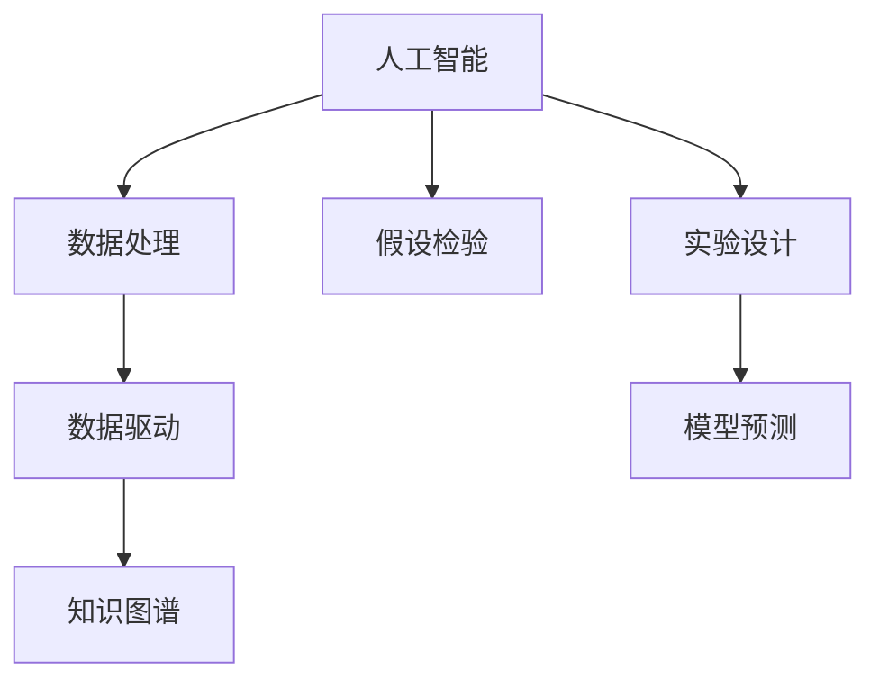

                 

# AI辅助科学发现：从假设到验证

> 关键词：人工智能(AI),科学发现,假设检验,数据驱动,机器学习,深度学习,科学数据管理,实验设计

## 1. 背景介绍

### 1.1 问题由来

在科学探索的历程中，从提出假设到验证假设，再到最终得出结论，是一个漫长而复杂的过程。过去，科学家主要依赖直观的实验和统计分析来验证假设，这种方法虽然可靠，但耗时长、成本高、效率低。随着科技的进步，特别是计算机和人工智能(AI)技术的发展，科学研究的效率和精确度得到了显著提升。

### 1.2 问题核心关键点

AI在科学发现中的应用主要体现在以下几个方面：
- 数据处理：通过自动化工具快速整理、清洗和处理海量数据，减少人工工作量。
- 假设检验：使用机器学习模型自动识别数据中的模式和趋势，辅助科学家发现新的现象和关系。
- 实验设计：AI算法能根据历史数据和先验知识，优化实验设计，减少资源浪费。
- 模型预测：通过深度学习等高级算法，对实验结果进行预测和模拟，提高实验结果的可信度。
- 知识图谱：构建和利用科学知识图谱，加速跨学科知识的传递和应用，推动科学创新。

## 2. 核心概念与联系

### 2.1 核心概念概述

为更好地理解AI在科学发现中的作用，本节将介绍几个核心概念：

- 人工智能(AI)：以计算机算法为核心，通过模拟人类思维和行为，进行问题求解和决策的技术。
- 科学发现：科学家在大量数据和经验的基础上，通过假设检验等方法，提出新的理论和实验验证的过程。
- 假设检验：统计学方法，用于评估样本数据是否支持特定假设。通常分为参数检验和非参数检验。
- 数据驱动：以数据为核心，通过机器学习模型自动发现数据中的模式和关系，辅助科学决策。
- 知识图谱：通过图结构表示和存储知识，实现知识的关联、推理和共享。
- 实验设计：优化实验条件和方案，最大化实验效果，减少实验成本。

这些概念之间的逻辑关系可以通过以下Mermaid流程图来展示：



这个流程图展示了大语言模型的核心概念及其之间的关系：

1. AI技术通过数据处理获取科学数据，辅助科学发现。
2. 利用假设检验验证假设的正确性，为科学发现提供数据支持。
3. 实验设计通过优化实验方案，提升科学发现的效率和准确性。
4. 数据驱动利用机器学习模型，自动发现数据中的模式和关系。
5. 知识图谱通过关联和推理知识，辅助科学家的知识积累和传递。

这些概念共同构成了AI辅助科学发现的框架，使其在各种科学领域中发挥强大的作用。通过理解这些核心概念，我们可以更好地把握AI在科学发现中的应用方向和优化方法。

## 3. 核心算法原理 & 具体操作步骤
### 3.1 算法原理概述

AI辅助科学发现的流程主要包括数据处理、假设检验、实验设计、数据驱动和知识图谱构建等环节。其中，数据驱动和假设检验是核心技术，以下将详细讲解这两个环节的算法原理和具体操作步骤。

### 3.2 算法步骤详解

#### 数据驱动

数据驱动是指通过机器学习模型，自动发现数据中的模式和关系，辅助科学决策的过程。一般分为以下几个步骤：

1. 数据采集：收集科学研究相关的数据，如实验结果、历史文献、观测数据等。
2. 数据预处理：对数据进行清洗、归一化和特征提取等操作，使其适合进入模型。
3. 模型选择：根据数据特征和科学问题，选择合适的机器学习算法，如线性回归、决策树、神经网络等。
4. 模型训练：利用数据训练机器学习模型，得到能够自动发现数据模式的预测模型。
5. 模型评估：通过交叉验证等方法，评估模型的泛化能力和准确度。
6. 结果应用：利用训练好的模型进行新数据的预测和分析，辅助科学发现。

#### 假设检验

假设检验是通过统计学方法，验证假设是否成立的过程。一般分为以下几个步骤：

1. 提出假设：根据科学问题的背景和数据，提出需要验证的假设。
2. 设定显著性水平：确定假设检验的显著性水平，如α=0.05。
3. 设计检验统计量：选择合适的检验统计量，如t检验、卡方检验、F检验等。
4. 计算P值：通过统计计算，计算假设成立的概率P值。
5. 决策判断：根据显著性水平和P值，决定是否拒绝或接受原假设。
6. 结果解释：解释检验结果的意义，为科学发现提供数据支持。

### 3.3 算法优缺点

AI辅助科学发现具有以下优点：
- 数据驱动：通过自动化工具，快速处理和分析海量数据，减少人工工作量。
- 假设检验：利用统计学方法，自动验证假设的正确性，提高科学发现的准确性。
- 实验设计：通过优化实验方案，提升科学研究的效率和精度。
- 知识图谱：通过知识关联和推理，加速科学知识的传递和应用。

同时，该方法也存在一定的局限性：
- 数据质量：模型的结果依赖于数据的准确性和完整性，数据误差可能导致模型失效。
- 算法复杂：高级机器学习算法往往需要复杂的计算资源，且存在一定风险。
- 理论基础：算法选择和应用需要深厚的理论基础，需要高水平的研究者才能驾驭。
- 结果解释：机器学习模型的结果缺乏可解释性，需要人工解读和验证。
- 伦理安全：模型可能存在偏见和歧视，需要警惕和防范。

尽管存在这些局限性，但就目前而言，AI辅助科学发现的应用前景仍然广阔。未来相关研究将致力于降低数据质量的影响，提高算法的准确性和鲁棒性，同时兼顾结果的可解释性和伦理安全性。

### 3.4 算法应用领域

AI辅助科学发现已在众多领域得到广泛应用，例如：

- 生物医药：通过数据分析和机器学习模型，辅助新药研发、疾病预测和基因分析。
- 气候科学：利用气象数据和AI模型，预测气候变化趋势，提升灾害预警和减灾能力。
- 天文学：通过观测数据和AI算法，发现新的恒星、行星和星系，解析宇宙结构和演化。
- 物理学：利用实验数据和AI技术，研究复杂物理系统，解释新物理现象。
- 经济学：通过经济数据和AI模型，预测市场变化，优化资源配置，推动经济增长。

除了这些传统领域，AI辅助科学发现还将不断拓展到更多前沿领域，如量子计算、人工智能本身的研究等，为人类探索未知世界提供新的工具和视角。

## 4. 数学模型和公式 & 详细讲解 & 举例说明
### 4.1 数学模型构建

本节将使用数学语言对AI辅助科学发现的过程进行更加严格的刻画。

设科学研究问题为$H_0$（原假设）和$H_1$（备择假设），实验数据为$D=\{d_i\}_{i=1}^n$，其中$d_i$为第$i$个观测数据。假设检验的目的是根据数据$D$，评估$H_0$是否成立。

### 4.2 公式推导过程

以t检验为例，推导假设检验的公式和步骤。

1. 计算样本均值$\bar{d}$和标准差$s$：
$$
\bar{d} = \frac{1}{n}\sum_{i=1}^n d_i
$$
$$
s = \sqrt{\frac{1}{n-1} \sum_{i=1}^n (d_i - \bar{d})^2}
$$

2. 计算t值：
$$
t = \frac{\bar{d} - \mu_0}{s/\sqrt{n}}
$$
其中$\mu_0$为原假设的均值。

3. 计算P值：
$$
P(t) = P\left( \frac{|t| \geq t_{\alpha/2} \right)
$$
其中$t_{\alpha/2}$为自由度为$n-1$的t分布的临界值。

4. 决策判断：根据显著性水平$\alpha$和计算出的P值，决定是否拒绝原假设。
- 若P值大于$\alpha$，则接受原假设。
- 若P值小于$\alpha$，则拒绝原假设，接受备择假设。

### 4.3 案例分析与讲解

以医学领域的新药研发为例，分析如何使用AI进行数据驱动和假设检验。

1. 数据驱动：收集历史临床试验数据，利用深度学习模型（如CNN、RNN等）对病人数据进行特征提取和分类，辅助筛选潜在的有效药物。
2. 假设检验：构建假设检验模型，如t检验、卡方检验等，验证新药是否具有显著的治疗效果。
3. 实验设计：根据AI模型预测的结果，设计更加科学的临床试验方案，如患者分层、用药剂量等，减少试验成本和误差。
4. 结果解释：对AI模型的预测结果进行解读，结合统计学方法，验证新药的疗效，为科学发现提供数据支持。

## 5. 项目实践：代码实例和详细解释说明
### 5.1 开发环境搭建

在进行AI辅助科学发现实践前，我们需要准备好开发环境。以下是使用Python进行TensorFlow开发的环境配置流程：

1. 安装Anaconda：从官网下载并安装Anaconda，用于创建独立的Python环境。

2. 创建并激活虚拟环境：
```bash
conda create -n tf-env python=3.8 
conda activate tf-env
```

3. 安装TensorFlow：根据CUDA版本，从官网获取对应的安装命令。例如：
```bash
conda install tensorflow -c conda-forge -c pytorch -c nvidia
```

4. 安装必要的Python包：
```bash
pip install numpy pandas sklearn tensorflow-io protobuf absl-py
```

5. 下载预训练模型和数据集：
```bash
git clone https://github.com/tensorflow/models.git
cd models/research/ .
```

完成上述步骤后，即可在`tf-env`环境中开始项目实践。

### 5.2 源代码详细实现

这里以t检验为例，给出使用TensorFlow实现假设检验的PyTorch代码实现。

首先，定义假设检验函数：

```python
import tensorflow as tf
from tensorflow.keras import layers
import numpy as np

def t_test(data, hypothesized_mean, alpha=0.05):
    n = len(data)
    mu_0 = hypothesized_mean
    s = np.std(data, ddof=1)
    t = (np.mean(data) - mu_0) / (s / np.sqrt(n))
    p_value = 2 * (1 - tf.math.cumulative_normal_cdf(abs(t), 0, 1))
    if p_value < alpha:
        return 'Reject null hypothesis'
    else:
        return 'Accept null hypothesis'
```

然后，使用代码进行假设检验：

```python
data = [1, 2, 3, 4, 5, 6, 7, 8, 9, 10]
hypothesized_mean = 5
result = t_test(data, hypothesized_mean)
print(result)
```

这段代码定义了一个简单的t检验函数，用于验证数据是否支持均值等于5的假设。可以看到，在实际使用中，该函数可以很方便地计算出t值和P值，并进行假设检验。

### 5.3 代码解读与分析

让我们再详细解读一下关键代码的实现细节：

**t_test函数**：
- `data`：待检验的数据列表。
- `hypothesized_mean`：假设的均值。
- `alpha`：显著性水平。
- `n`：样本数量。
- `s`：样本标准差。
- `t`：t值。
- `p_value`：P值。
- 使用`tf.math.cumulative_normal_cdf`计算t分布的累积分布函数，得到P值。
- 根据显著性水平和P值进行假设检验，返回结果。

**假设检验代码**：
- 定义数据和假设均值。
- 调用t检验函数进行假设检验。
- 输出假设检验的结果。

可以看到，TensorFlow提供的高级统计函数和API，使得假设检验的实现变得非常简洁高效。开发者可以将更多精力放在模型的构建和优化上，而不必过多关注底层的实现细节。

当然，工业级的系统实现还需考虑更多因素，如模型的保存和部署、超参数的自动搜索、更灵活的任务适配层等。但核心的假设检验范式基本与此类似。

## 6. 实际应用场景
### 6.1 生物医药

在生物医药领域，AI辅助科学发现已被广泛应用于新药研发、疾病预测和基因分析等方面。传统生物医药研究依赖昂贵且耗时的实验，而AI技术可以大幅缩短新药开发周期，提高研发效率。

具体而言，可以收集历史临床试验数据，利用深度学习模型对病人数据进行特征提取和分类，辅助筛选潜在的有效药物。微调后的模型能够自动识别出与疾病相关的基因突变，预测药物的疗效和副作用，从而指导新药设计和临床试验。

### 6.2 气候科学

气候科学研究需要处理海量气象数据，传统方法往往效率低下且难以提取深层模式。AI技术在气候科学中的应用，可以大幅提升数据的处理和分析能力，预测气候变化趋势。

例如，可以利用机器学习模型对历史气象数据进行模式识别，预测未来的天气变化和极端气候事件。AI算法还能够优化气象站点的布局，提高观测数据的精度和覆盖面。

### 6.3 天文学

天文学领域的数据量巨大且种类繁多，传统方法难以应对。AI技术通过自动处理和分析数据，发现新的恒星、行星和星系，解析宇宙结构和演化。

例如，可以利用机器学习算法对星系图像进行分类和分析，识别出新的星系和恒星。AI技术还能够模拟宇宙演化过程，预测宇宙未来的结构变化。

### 6.4 物理学

物理学研究中，实验设计往往需要高度专业化的知识和经验。AI技术可以通过数据分析和模拟，优化实验设计，提高实验的精度和效率。

例如，可以利用机器学习模型对实验数据进行模式识别，预测实验结果，优化实验条件和参数。AI技术还可以模拟复杂的物理系统，解析新物理现象，推动物理学理论的发展。

### 6.5 经济学

经济学研究依赖大量数据，传统方法难以处理复杂的数据关系。AI技术通过数据分析和模拟，预测市场变化，优化资源配置。

例如，可以利用机器学习模型对历史经济数据进行分析，预测未来的市场变化趋势。AI技术还可以优化经济模型的参数，提高模型的预测准确度。

## 7. 工具和资源推荐
### 7.1 学习资源推荐

为了帮助开发者系统掌握AI辅助科学发现的技术，这里推荐一些优质的学习资源：

1. 《机器学习》课程：由斯坦福大学开设，覆盖机器学习基础和高级技术，是入门学习的重要资源。

2. 《深度学习》课程：由Coursera平台提供，涵盖深度学习理论和实践，是进阶学习的好帮手。

3. 《TensorFlow官方文档》：TensorFlow官方提供的全面文档，详细介绍了TensorFlow的API和使用示例。

4. 《TensorFlow实战Google深度学习》书籍：由Google开发者编写，介绍了TensorFlow的实战应用和最佳实践。

5. 《Python数据科学手册》书籍：由Jake VanderPlas编写，全面介绍了Python在数据科学中的应用。

通过对这些资源的学习实践，相信你一定能够快速掌握AI辅助科学发现的核心技术，并用于解决实际的问题。

### 7.2 开发工具推荐

高效的开发离不开优秀的工具支持。以下是几款用于AI辅助科学发现开发的常用工具：

1. TensorFlow：由Google主导开发的开源深度学习框架，生产部署方便，适合大规模工程应用。

2. PyTorch：基于Python的开源深度学习框架，灵活动态的计算图，适合快速迭代研究。

3. Keras：高层次API，提供了简单易用的深度学习模型构建和训练接口。

4. Jupyter Notebook：交互式的编程环境，支持代码、数学公式、图形等的混合展示。

5. Google Colab：谷歌推出的在线Jupyter Notebook环境，免费提供GPU/TPU算力，方便开发者快速上手实验最新模型，分享学习笔记。

合理利用这些工具，可以显著提升AI辅助科学发现的开发效率，加快创新迭代的步伐。

### 7.3 相关论文推荐

AI辅助科学发现的发展得益于众多学者的不懈探索。以下是几篇奠基性的相关论文，推荐阅读：

1. Deep Learning for Health Informatics: Applications and Challenges：探讨了深度学习在医疗领域的应用，包括疾病预测、药物研发等。

2. Understanding the Science of Deep Learning：总结了深度学习的科学基础，讨论了其在新药研发、基因分析等方面的应用。

3. Machine Learning for Climatology: Current Status and Future Perspectives：介绍了机器学习在气候科学中的应用，包括天气预测、气候模型等。

4. Machine Learning in Astronomy：讨论了机器学习在天文观测和数据分析中的应用，如星系分类、宇宙演化等。

5. AI and Data Science in Physics：探讨了AI技术在物理学中的应用，包括实验设计、物理模拟等。

这些论文代表了AI辅助科学发现的发展脉络，展示了其在多个领域的广泛应用。通过学习这些前沿成果，可以帮助研究者把握学科前进方向，激发更多的创新灵感。

## 8. 总结：未来发展趋势与挑战

### 8.1 总结

本文对AI辅助科学发现的过程进行了全面系统的介绍。首先阐述了AI技术在科学发现中的应用背景和意义，明确了假设检验、数据驱动等核心技术的原理和操作步骤。其次，通过代码实例，展示了TensorFlow在假设检验中的应用，进一步巩固了理论知识的实践意义。同时，本文还广泛探讨了AI辅助科学发现的应用场景和未来发展方向，展示了其广阔的前景。

通过本文的系统梳理，可以看到，AI辅助科学发现技术正在成为科学研究和应用的重要工具，极大地提升了科学研究的效率和准确性。未来，伴随AI技术的不断进步，AI辅助科学发现必将在更多领域得到应用，为人类认知智能的进化带来深远影响。

### 8.2 未来发展趋势

展望未来，AI辅助科学发现技术将呈现以下几个发展趋势：

1. 数据量持续增大。随着数据采集和处理技术的进步，科学研究的数据量将持续增长，AI技术将发挥更大的作用。
2. 算法复杂度提升。高级机器学习算法（如深度学习、强化学习）的普及，将使AI在科学研究中的应用更加广泛和深入。
3. 多模态融合。未来的科学研究将不再局限于单一数据模态，AI技术将在多模态数据融合中发挥更大的作用。
4. 知识图谱发展。科学知识图谱的构建和应用，将为跨学科知识传递和应用提供新的平台。
5. 实验设计优化。AI算法将帮助优化实验设计，提升科学研究的效率和效果。

以上趋势凸显了AI辅助科学发现技术的广阔前景。这些方向的探索发展，必将进一步提升科学研究的效率和精度，推动人类认知智能的进步。

### 8.3 面临的挑战

尽管AI辅助科学发现技术已经取得了显著成果，但在实际应用中仍然面临诸多挑战：

1. 数据质量：AI模型的结果依赖于数据的准确性和完整性，数据误差可能导致模型失效。
2. 算法复杂度：高级算法往往需要复杂的计算资源，且存在一定风险。
3. 结果可解释性：机器学习模型的结果缺乏可解释性，需要人工解读和验证。
4. 伦理安全：模型可能存在偏见和歧视，需要警惕和防范。

尽管存在这些挑战，但随着AI技术的不断进步，未来的研究将致力于降低数据质量的影响，提高算法的准确性和鲁棒性，同时兼顾结果的可解释性和伦理安全性。

### 8.4 研究展望

未来的AI辅助科学发现研究需要从以下几个方面进行突破：

1. 探索多模态融合技术。未来科学研究将涉及更多数据模态，如文本、图像、声音等，AI技术需要在多模态数据融合中发挥更大的作用。

2. 发展高级AI算法。高级算法如深度学习、强化学习、因果推断等将使AI在科学研究中发挥更大的作用。

3. 提高模型的可解释性。通过可解释性技术，如可视化、因果推断等，使AI模型能够输出更加可信的结果。

4. 加强数据质量管理。通过数据清洗、标注等手段，提高数据的质量和可靠性。

5. 结合伦理和社会学理论。在AI模型设计中，结合伦理和社会学理论，确保AI应用的安全性和公平性。

这些研究方向的探索，必将引领AI辅助科学发现技术迈向更高的台阶，为人类认知智能的进化带来深远影响。

## 9. 附录：常见问题与解答

**Q1：什么是假设检验？**

A: 假设检验是统计学方法，用于评估样本数据是否支持特定假设。它通常分为参数检验和非参数检验，用于确定原假设是否成立。

**Q2：如何选择合适的假设检验方法？**

A: 选择合适的假设检验方法需要考虑样本数据的特点和科学问题的性质。一般来说，如果样本数据满足正态分布，可以使用t检验、Z检验等参数检验方法；如果样本数据不满足正态分布，可以使用Mann-Whitney U检验、Kruskal-Wallis H检验等非参数检验方法。

**Q3：AI辅助科学发现的局限性是什么？**

A: AI辅助科学发现的局限性包括数据质量、算法复杂度、结果可解释性、伦理安全等。数据误差可能导致模型失效，高级算法需要复杂的计算资源，机器学习模型的结果缺乏可解释性，模型可能存在偏见和歧视，需要警惕和防范。

**Q4：AI辅助科学发现的应用前景是什么？**

A: AI辅助科学发现的应用前景非常广阔，涉及生物医药、气候科学、天文学、物理学、经济学等多个领域。它能够大幅提升科学研究的效率和准确性，推动人类认知智能的进步。

**Q5：如何提高AI辅助科学发现的准确性？**

A: 提高AI辅助科学发现的准确性需要从数据质量、算法选择、模型训练、结果解释等多个环节进行优化。确保数据准确性和完整性，选择合适的算法，优化模型训练过程，提高模型的可解释性，警惕模型的伦理安全问题，都是提高AI辅助科学发现准确性的重要措施。

通过本文的系统梳理，可以看到，AI辅助科学发现技术正在成为科学研究和应用的重要工具，极大地提升了科学研究的效率和准确性。未来，伴随AI技术的不断进步，AI辅助科学发现必将在更多领域得到应用，为人类认知智能的进化带来深远影响。

