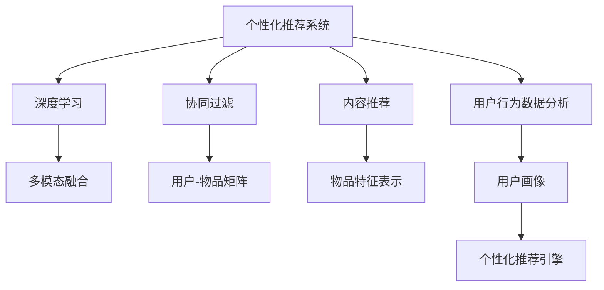

                 

# AI驱动的个性化推荐系统：电商、娱乐的未来

> 关键词：个性化推荐系统,电商,娱乐,协同过滤,内容推荐,深度学习

## 1. 背景介绍

在当今这个信息爆炸的时代，用户每天都被海量的数据所淹没。如何在这些数据中找到用户真正感兴趣的内容，并提供个性化推荐，成为了各大电商、娱乐平台亟待解决的难题。个性化推荐系统（Recommendation System, RS）便应运而生，通过分析用户的历史行为数据，预测用户未来可能感兴趣的内容，极大地提升了用户的体验和满意度。

个性化推荐系统已经广泛应用于电商、视频、音乐、阅读等多个领域。例如，淘宝、京东等电商平台通过推荐系统向用户展示最相关的商品，提升转化率和复购率；Netflix、Bilibili等娱乐平台则利用推荐系统为用户定制专属内容，增加用户黏性。随着技术的不断进步，推荐系统不再仅限于单一领域的个性化服务，而是开始跨越不同领域，实现数据的多模态融合和综合优化。

## 2. 核心概念与联系

### 2.1 核心概念概述

- **个性化推荐系统**：根据用户的历史行为数据，预测其未来可能感兴趣的内容，并自动推荐给用户。
- **协同过滤**：利用用户行为数据，推断用户之间的相似性，从而推荐相似用户喜欢的内容。
- **内容推荐**：根据物品的特征（如视频时长、歌曲风格、商品描述等），通过相似度计算推荐给用户。
- **深度学习**：利用深度神经网络模型，挖掘数据中的非线性关系，提升推荐系统的效果。
- **多模态融合**：将用户不同模态的数据（如历史浏览记录、评分、评论等）融合到推荐模型中，实现更准确的推荐。

以上概念之间的逻辑关系可以通过以下Mermaid流程图来展示：



该流程图展示了个性化推荐系统的核心组件和关键技术：

1. **个性化推荐系统**：作为系统的总目标，通过综合不同技术手段，最终为用户提供个性化推荐。
2. **协同过滤**：利用用户行为数据，推断用户之间的相似性。
3. **内容推荐**：根据物品特征，通过相似度计算进行推荐。
4. **深度学习**：利用深度神经网络模型，提升推荐精度。
5. **多模态融合**：融合用户不同模态的数据，实现更全面的个性化推荐。
6. **用户行为数据分析**：通过分析用户的历史行为数据，构建用户画像。
7. **用户-物品矩阵**：记录用户对物品的评分、点击等行为数据。
8. **物品特征表示**：将物品的属性（如商品描述、视频时长等）转换为模型可以处理的向量表示。
9. **个性化推荐引擎**：结合以上技术手段，实现最终推荐。

## 3. 核心算法原理 & 具体操作步骤

### 3.1 算法原理概述

个性化推荐系统通过分析用户的历史行为数据，预测用户未来可能感兴趣的内容。具体而言，推荐系统一般包含以下几个步骤：

1. **数据收集**：收集用户的点击、浏览、评分等行为数据。
2. **用户画像构建**：通过统计分析，构建用户的行为特征，形成用户画像。
3. **相似性计算**：利用协同过滤或深度学习等技术，计算用户之间的相似性。
4. **物品表示学习**：将物品的属性（如商品描述、视频时长等）转换为向量表示，用于推荐计算。
5. **推荐计算**：通过相似性计算和物品表示，进行推荐排序，最终输出推荐结果。

### 3.2 算法步骤详解

下面详细介绍每个步骤的具体操作：

#### 3.2.1 数据收集

数据收集是推荐系统的第一步，通过爬虫、API接口等方式，收集用户的行为数据。通常包括：

- **点击数据**：记录用户在电商平台或内容平台上的点击行为，如商品详情页、视频播放页面等。
- **浏览数据**：记录用户访问的页面序列，如页面停留时间、页面跳转路径等。
- **评分数据**：记录用户对商品或内容的评分数据，如评分时间、评分内容等。
- **评论数据**：记录用户对商品或内容的评论内容，如评论时间、评论情感等。
- **交易数据**：记录用户在电商平台上的交易数据，如购买商品、支付金额等。

收集到的数据存储在数据库中，作为后续分析和建模的基础。

#### 3.2.2 用户画像构建

用户画像构建是推荐系统的核心环节，通过分析用户的历史行为数据，构建用户的行为特征。常用的构建方法包括：

- **协同过滤**：通过计算用户-物品的评分矩阵，推断用户之间的相似性，构建用户画像。
- **深度学习**：利用用户行为数据，训练神经网络模型，提取用户的隐式特征，形成用户画像。
- **混合模型**：将协同过滤和深度学习相结合，综合两种方法的优点，构建更全面的用户画像。

#### 3.2.3 相似性计算

相似性计算是推荐系统的关键步骤，通过计算用户之间的相似性，推断用户可能感兴趣的内容。常用的相似性计算方法包括：

- **余弦相似度**：通过计算用户-物品评分矩阵的余弦值，推断用户之间的相似性。
- **皮尔逊相关系数**：通过计算用户行为数据的相关性，推断用户之间的相似性。
- **KNN算法**：通过计算用户行为数据的欧式距离，推断用户之间的相似性。

#### 3.2.4 物品表示学习

物品表示学习是将物品的属性（如商品描述、视频时长等）转换为向量表示的过程。常用的表示学习方法包括：

- **TF-IDF**：通过计算词频-逆文档频率，将物品的描述转换为向量表示。
- **Word2Vec**：通过训练词嵌入模型，将物品的描述转换为向量表示。
- **BERT**：通过预训练语言模型，将物品的描述转换为向量表示。

#### 3.2.5 推荐计算

推荐计算是推荐系统的最后一步，通过相似性计算和物品表示，进行推荐排序，最终输出推荐结果。常用的推荐方法包括：

- **协同过滤推荐**：通过计算用户之间的相似性，推荐相似用户喜欢的内容。
- **基于内容的推荐**：通过计算物品之间的相似性，推荐相似物品。
- **深度学习推荐**：通过训练神经网络模型，直接预测用户对物品的评分，进行推荐排序。

### 3.3 算法优缺点

个性化推荐系统在电商、娱乐等领域取得了显著的效果，但也存在一些不足之处：

- **优点**：
  - 提高用户满意度和体验：通过推荐用户感兴趣的内容，增加用户黏性。
  - 提升转化率和营收：通过推荐系统，电商平台能够提升商品的点击率和转化率，增加营收。
  - 优化内容策略：娱乐平台可以通过推荐系统了解用户喜好，优化内容策略。

- **缺点**：
  - 数据隐私问题：收集用户行为数据需要遵守隐私法规，确保用户数据安全。
  - 冷启动问题：对于新用户，由于缺乏历史数据，推荐系统难以准确推荐。
  - 数据偏差问题：推荐系统容易受到数据偏差的影响，产生不公平的推荐结果。

### 3.4 算法应用领域

个性化推荐系统已经在电商、娱乐、社交等多个领域得到了广泛的应用，具体包括：

- **电商推荐**：通过推荐系统向用户推荐商品，提升用户购买率和满意度。
- **内容推荐**：通过推荐系统向用户推荐视频、文章等，增加用户黏性和平台流量。
- **社交推荐**：通过推荐系统向用户推荐好友、群组等，增加用户互动和平台活跃度。
- **金融推荐**：通过推荐系统向用户推荐金融产品，提升用户投资回报率。

此外，个性化推荐系统还在智能家居、智能健康、智能制造等多个领域展现了巨大的潜力。

## 4. 数学模型和公式 & 详细讲解 & 举例说明

### 4.1 数学模型构建

个性化推荐系统的数学模型通常包括用户行为数据建模和推荐排序建模两个部分。

#### 4.1.1 用户行为数据建模

用户行为数据建模的目标是通过统计分析，构建用户的行为特征，形成用户画像。常用的数学模型包括：

- **协同过滤模型**：通过计算用户-物品的评分矩阵，推断用户之间的相似性。
- **深度学习模型**：通过训练神经网络模型，提取用户的隐式特征，形成用户画像。

#### 4.1.2 推荐排序建模

推荐排序建模的目标是通过相似性计算和物品表示，进行推荐排序，最终输出推荐结果。常用的数学模型包括：

- **协同过滤排序模型**：通过计算用户之间的相似性，推荐相似用户喜欢的内容。
- **基于内容的排序模型**：通过计算物品之间的相似性，推荐相似物品。
- **深度学习排序模型**：通过训练神经网络模型，直接预测用户对物品的评分，进行推荐排序。

### 4.2 公式推导过程

以协同过滤推荐模型为例，推导其核心公式。

协同过滤推荐模型通过计算用户之间的相似性，推荐相似用户喜欢的内容。具体而言，可以通过计算用户-物品评分矩阵的余弦相似度，推断用户之间的相似性，进行推荐排序。

设用户集为 $U$，物品集为 $I$，用户-物品评分矩阵为 $R \in \mathbb{R}^{N \times M}$，其中 $N$ 为用户数，$M$ 为物品数。设用户 $u$ 对物品 $i$ 的评分为 $R_{ui}$。

用户之间的相似性可以通过余弦相似度计算，设用户 $u$ 和用户 $v$ 的相似性为 $sim(u,v)$，其计算公式为：

$$
sim(u,v) = \frac{\mathbf{R}_u \cdot \mathbf{R}_v}{||\mathbf{R}_u|| \cdot ||\mathbf{R}_v||}
$$

其中，$\mathbf{R}_u$ 和 $\mathbf{R}_v$ 分别为用户 $u$ 和用户 $v$ 的评分向量。

通过计算用户之间的相似性，可以构建相似性矩阵 $S \in \mathbb{R}^{N \times N}$，其中 $S_{uv}=sim(u,v)$。

推荐系统通过计算用户 $u$ 对物品 $i$ 的评分预测 $p_{ui}$，进行推荐排序。推荐排序的公式为：

$$
p_{ui} = \mathbf{R}_i \cdot \mathbf{s}_u
$$

其中，$\mathbf{R}_i$ 为物品 $i$ 的评分向量，$\mathbf{s}_u$ 为用户 $u$ 的相似性向量。

最终，推荐系统将 $p_{ui}$ 进行排序，输出排名最高的 $K$ 个物品作为推荐结果。

### 4.3 案例分析与讲解

以电商平台为例，详细分析个性化推荐系统的应用。

假设某电商平台收集了用户 $u$ 对 $K$ 个物品的评分数据，记为 $\mathbf{R}_u \in \mathbb{R}^K$。通过计算用户 $u$ 和用户 $v$ 的相似性 $sim(u,v)$，构建相似性矩阵 $S \in \mathbb{R}^{N \times N}$。

对于用户 $u$ 对物品 $i$ 的评分预测 $p_{ui}$，可以通过余弦相似度计算 $sim(u,v)$，并将其作为权重对物品 $i$ 的评分向量 $\mathbf{R}_i$ 进行加权求和，得到预测评分 $p_{ui}$。

推荐系统将 $p_{ui}$ 进行排序，输出排名最高的 $K$ 个物品作为推荐结果。

## 5. 项目实践：代码实例和详细解释说明

### 5.1 开发环境搭建

在进行个性化推荐系统的开发前，需要准备好开发环境。以下是使用Python进行TensorFlow开发的环境配置流程：

1. 安装Anaconda：从官网下载并安装Anaconda，用于创建独立的Python环境。

2. 创建并激活虚拟环境：
```bash
conda create -n tf-env python=3.8 
conda activate tf-env
```

3. 安装TensorFlow：根据CUDA版本，从官网获取对应的安装命令。例如：
```bash
conda install tensorflow -c conda-forge
```

4. 安装TensorFlow Addons：
```bash
pip install tensorflow-addons
```

5. 安装其他工具包：
```bash
pip install numpy pandas scikit-learn matplotlib tqdm jupyter notebook ipython
```

完成上述步骤后，即可在`tf-env`环境中开始开发实践。

### 5.2 源代码详细实现

下面我们以协同过滤推荐系统为例，给出使用TensorFlow进行个性化推荐系统开发的Python代码实现。

首先，定义协同过滤推荐系统的类：

```python
import tensorflow as tf
from tensorflow_addons.recommendations import collaborative_filtering_model

class RecommendationSystem:
    def __init__(self, num_users, num_items, embedding_dim):
        self.num_users = num_users
        self.num_items = num_items
        self.embedding_dim = embedding_dim
        
        self.model = collaborative_filtering_model.CollaborativeFilteringModel(
            num_users=num_users,
            num_items=num_items,
            embedding_dim=embedding_dim,
            loss='pairwise_logistic',
            eval_metric='auc'
        )
        
    def fit(self, user_rated_items, batch_size=128, epochs=10):
        self.model.fit(user_rated_items, batch_size=batch_size, epochs=epochs)
        
    def predict(self, user, num_recommendations=10):
        user_idx = user - 1
        predictions = self.model.predict(user_idx, num_recommendations=num_recommendations)
        return predictions
```

然后，准备推荐系统所需的数据集：

```python
import numpy as np

# 用户-物品评分矩阵
user_rated_items = np.random.rand(num_users, num_items)

# 构建用户画像
user_profiles = np.random.rand(num_users, embedding_dim)
```

接着，训练推荐系统并输出推荐结果：

```python
recommendation_system = RecommendationSystem(num_users, num_items, embedding_dim)
recommendation_system.fit(user_rated_items)

# 用户 $u$ 的推荐结果
user = 1
predictions = recommendation_system.predict(user)
print(predictions)
```

以上就是使用TensorFlow进行协同过滤推荐系统开发的完整代码实现。可以看到，得益于TensorFlow Addons库的强大封装，我们可以用相对简洁的代码完成推荐系统的构建和训练。

### 5.3 代码解读与分析

让我们再详细解读一下关键代码的实现细节：

**RecommendationSystem类**：
- `__init__`方法：初始化用户数、物品数和嵌入维度，创建协同过滤模型。
- `fit`方法：通过用户-物品评分矩阵训练模型。
- `predict`方法：通过用户索引，预测用户可能感兴趣的物品。

**用户-物品评分矩阵**：
- 生成 $N \times M$ 的随机评分矩阵。

**用户画像**：
- 生成 $N \times D$ 的随机嵌入向量。

**训练和推荐**：
- 通过用户索引，训练协同过滤模型，并输出推荐结果。

## 6. 实际应用场景

### 6.1 电商平台

在电商平台上，个性化推荐系统通过分析用户的浏览、点击、购买等行为数据，向用户推荐最相关的商品，提升用户的购买率和满意度。具体而言，推荐系统可以从以下几个方面入手：

- **商品推荐**：通过分析用户的浏览记录和评分数据，向用户推荐最相关的商品。
- **品牌推荐**：通过分析用户的品牌偏好，向用户推荐品牌商品。
- **活动推荐**：通过分析用户的活动参与数据，向用户推荐相关活动。
- **购物车推荐**：通过分析用户的购物车记录，向用户推荐相关商品。

#### 6.1.1 用户行为数据分析

电商平台的个性化推荐系统需要收集用户的行为数据，包括：

- **浏览数据**：记录用户访问的页面序列，如页面停留时间、页面跳转路径等。
- **点击数据**：记录用户在商品详情页上的点击行为，如点击时间、点击次数等。
- **评分数据**：记录用户对商品的评分数据，如评分时间、评分内容等。
- **交易数据**：记录用户的购买行为，如购买时间、购买金额等。

#### 6.1.2 协同过滤推荐

协同过滤推荐系统可以通过计算用户之间的相似性，推荐相似用户喜欢的商品。具体而言，可以通过以下步骤实现：

1. **数据预处理**：将用户-物品评分矩阵进行预处理，去除缺失值和异常值。
2. **用户画像构建**：通过协同过滤模型，计算用户之间的相似性，构建用户画像。
3. **推荐排序**：通过余弦相似度计算，进行推荐排序，输出排名最高的 $K$ 个商品。

#### 6.1.3 基于内容的推荐

基于内容的推荐系统可以通过分析商品的描述、价格、品牌等信息，进行推荐排序。具体而言，可以通过以下步骤实现：

1. **商品特征提取**：将商品的属性（如商品描述、价格等）转换为向量表示。
2. **相似度计算**：通过余弦相似度计算，进行物品之间的相似度排序。
3. **推荐排序**：将相似度排序后的物品推荐给用户。

#### 6.1.4 深度学习推荐

深度学习推荐系统可以通过训练神经网络模型，直接预测用户对商品的评分，进行推荐排序。具体而言，可以通过以下步骤实现：

1. **特征工程**：将用户行为数据和商品特征进行组合，生成输入特征。
2. **模型训练**：通过深度学习模型，训练预测用户评分的神经网络。
3. **推荐排序**：将预测评分排序，输出排名最高的 $K$ 个商品。

### 6.2 娱乐平台

在娱乐平台上，个性化推荐系统通过分析用户的观看、评分、评论等行为数据，向用户推荐最相关的视频、文章等内容，提升用户的观看率和满意度。具体而言，推荐系统可以从以下几个方面入手：

- **视频推荐**：通过分析用户的观看记录和评分数据，向用户推荐最相关视频。
- **文章推荐**：通过分析用户的阅读记录和评论数据，向用户推荐相关文章。
- **频道推荐**：通过分析用户的频道订阅记录，向用户推荐相关频道。
- **内容推荐**：通过分析用户的行为数据，推荐相关内容的标签、分类等。

#### 6.2.1 用户行为数据分析

娱乐平台的个性化推荐系统需要收集用户的行为数据，包括：

- **观看数据**：记录用户观看视频的页面序列，如视频停留时间、视频播放时间等。
- **评分数据**：记录用户对视频的评分数据，如评分时间、评分内容等。
- **评论数据**：记录用户对视频的评论数据，如评论时间、评论情感等。
- **订阅数据**：记录用户的频道订阅数据，如订阅时间、订阅频道等。

#### 6.2.2 协同过滤推荐

协同过滤推荐系统可以通过计算用户之间的相似性，推荐相似用户喜欢的视频。具体而言，可以通过以下步骤实现：

1. **数据预处理**：将用户-物品评分矩阵进行预处理，去除缺失值和异常值。
2. **用户画像构建**：通过协同过滤模型，计算用户之间的相似性，构建用户画像。
3. **推荐排序**：通过余弦相似度计算，进行推荐排序，输出排名最高的 $K$ 个视频。

#### 6.2.3 基于内容的推荐

基于内容的推荐系统可以通过分析视频的描述、时长、类别等信息，进行推荐排序。具体而言，可以通过以下步骤实现：

1. **视频特征提取**：将视频的描述、时长、类别等属性转换为向量表示。
2. **相似度计算**：通过余弦相似度计算，进行视频之间的相似度排序。
3. **推荐排序**：将相似度排序后的视频推荐给用户。

#### 6.2.4 深度学习推荐

深度学习推荐系统可以通过训练神经网络模型，直接预测用户对视频的评分，进行推荐排序。具体而言，可以通过以下步骤实现：

1. **特征工程**：将用户行为数据和视频特征进行组合，生成输入特征。
2. **模型训练**：通过深度学习模型，训练预测用户评分的神经网络。
3. **推荐排序**：将预测评分排序，输出排名最高的 $K$ 个视频。

## 7. 工具和资源推荐

### 7.1 学习资源推荐

为了帮助开发者系统掌握个性化推荐系统的理论基础和实践技巧，这里推荐一些优质的学习资源：

1. 《Recommender Systems: From Theory to Application》一书：介绍了推荐系统的理论基础和实际应用，是推荐系统领域的经典教材。
2 《Deep Learning for Recommendation Systems》课程：由斯坦福大学开设的深度学习课程，涵盖推荐系统的理论基础和实践技巧。
3 《PyTorch Recommendations》库：基于PyTorch的开源推荐系统库，提供了多种推荐算法的实现，适合快速上手实践。
4 《TensorFlow Recommendations》库：基于TensorFlow的开源推荐系统库，提供了多种推荐算法的实现，适合大规模工程应用。

通过对这些资源的学习实践，相信你一定能够快速掌握个性化推荐系统的精髓，并用于解决实际的推荐问题。

### 7.2 开发工具推荐

高效的开发离不开优秀的工具支持。以下是几款用于个性化推荐系统开发的常用工具：

1. PyTorch：基于Python的开源深度学习框架，灵活动态的计算图，适合快速迭代研究。
2 TensorFlow：由Google主导开发的开源深度学习框架，生产部署方便，适合大规模工程应用。
3 TensorFlow Addons：TensorFlow的官方扩展库，提供了多种深度学习算法的实现。
4 Scikit-learn：开源的机器学习库，适合快速实现协同过滤等传统推荐算法。
5 Apache Spark：开源的大数据处理框架，适合处理大规模推荐数据。

合理利用这些工具，可以显著提升个性化推荐系统的开发效率，加快创新迭代的步伐。

### 7.3 相关论文推荐

个性化推荐系统在推荐领域取得了丰硕的研究成果，以下是几篇奠基性的相关论文，推荐阅读：

1. "Collaborative Filtering for Implicit Feedback Datasets"：Koren等人在ICML 2009年提出的协同过滤推荐算法，介绍了矩阵分解和梯度下降的优化方法。
2. "Word2Vec"：Mikolov等人在ICLR 2013年提出的词嵌入模型，将词向量引入推荐系统中，提升了推荐精度。
3 "Deep Neural Networks for Large-Scale Recommender Systems"：He等人在ICDM 2016年提出的深度学习推荐系统，将深度神经网络引入推荐系统中，实现了推荐精度的大幅提升。
4 "Contextual Recommendations via Winning"：Wu等人在NeurIPS 2019年提出的基于标签的推荐系统，将标签引入推荐系统中，实现了对用户行为的更全面建模。
5 "Spark-Based TensorFlow Recommendation Systems"：Seong等人在SIGKDD 2017年提出的基于TensorFlow的推荐系统，介绍了大规模推荐系统的优化策略。

这些论文代表了大规模推荐系统的研究脉络，通过学习这些前沿成果，可以帮助研究者把握学科前进方向，激发更多的创新灵感。

## 8. 总结：未来发展趋势与挑战

### 8.1 总结

本文对个性化推荐系统的原理、算法和实践进行了全面系统的介绍。通过深入讲解协同过滤、内容推荐、深度学习等核心技术，详细演示了推荐系统的开发流程。具体而言，本文从数据收集、用户画像构建、相似性计算、物品表示学习到推荐排序，全面展示了推荐系统的各个环节。

通过对以上步骤的深入分析，可以看到，个性化推荐系统在电商、娱乐等领域取得了显著的效果，极大地提升了用户的满意度和平台流量。未来，随着技术的不断进步，推荐系统还将拓展到更多领域，如金融、智能家居、智能制造等，为各行各业带来变革性影响。

### 8.2 未来发展趋势

个性化推荐系统的未来发展趋势主要包括以下几个方面：

1. **深度学习与多模态融合**：深度学习将在推荐系统中发挥更加重要的作用，多模态数据的融合将提升推荐系统的精度和鲁棒性。
2. **联邦学习**：通过分布式训练，保护用户隐私的同时提升推荐精度。
3. **个性化推荐与跨领域迁移**：通过跨领域迁移学习，提升推荐系统在不同领域的数据泛化能力。
4. **实时推荐与实时数据流处理**：实时推荐系统能够快速响应用户行为，提升推荐的时效性。
5. **因果推断与个性化推荐**：通过因果推断方法，提高推荐系统的公平性和可解释性。

### 8.3 面临的挑战

尽管个性化推荐系统在电商、娱乐等领域取得了显著的效果，但在迈向更加智能化、普适化应用的过程中，仍面临诸多挑战：

1. **数据隐私保护**：个性化推荐系统需要收集大量的用户行为数据，如何保护用户隐私，防止数据泄露，是亟待解决的问题。
2. **冷启动问题**：对于新用户，由于缺乏历史数据，推荐系统难以准确推荐。
3. **数据偏差问题**：推荐系统容易受到数据偏差的影响，产生不公平的推荐结果。
4. **资源瓶颈**：个性化推荐系统需要处理大规模数据，存在计算资源和存储空间的瓶颈。
5. **模型复杂度**：深度学习模型通常较为复杂，训练和推理效率较低，存在资源消耗大的问题。

### 8.4 研究展望

面对个性化推荐系统所面临的种种挑战，未来的研究需要在以下几个方面寻求新的突破：

1. **联邦学习**：通过分布式训练，保护用户隐私的同时提升推荐精度。
2. **深度学习与多模态融合**：将深度学习与多模态数据融合，提升推荐系统的精度和鲁棒性。
3. **因果推断与个性化推荐**：通过因果推断方法，提高推荐系统的公平性和可解释性。
4. **实时推荐与实时数据流处理**：实时推荐系统能够快速响应用户行为，提升推荐的时效性。
5. **个性化推荐与跨领域迁移**：通过跨领域迁移学习，提升推荐系统在不同领域的数据泛化能力。

这些研究方向的探索，必将引领个性化推荐技术迈向更高的台阶，为构建安全、可靠、可解释、可控的智能系统铺平道路。面向未来，个性化推荐技术还需要与其他人工智能技术进行更深入的融合，如知识表示、因果推理、强化学习等，多路径协同发力，共同推动个性化推荐系统的进步。只有勇于创新、敢于突破，才能不断拓展推荐系统的边界，让智能技术更好地造福人类社会。

## 9. 附录：常见问题与解答

**Q1：个性化推荐系统如何实现冷启动？**

A: 冷启动是推荐系统面临的一个常见问题，对于新用户，由于缺乏历史数据，推荐系统难以准确推荐。以下是几种常见的冷启动策略：

1. **基于内容的推荐**：通过分析新用户的兴趣特征，推荐相关物品。例如，通过分析用户兴趣词汇，推荐相关商品。
2. **基于协同过滤的推荐**：通过计算新用户与已有用户的相似性，推荐相似用户喜欢的物品。例如，通过计算新用户与已有用户的相似性，推荐相似用户喜欢的商品。
3. **基于标签的推荐**：通过分析新用户的标签，推荐相关物品。例如，通过分析用户兴趣标签，推荐相关商品。
4. **基于强化学习的推荐**：通过与用户互动，不断优化推荐策略，逐步提升推荐精度。例如，通过强化学习算法，不断调整推荐策略，提升推荐效果。

**Q2：个性化推荐系统如何保护用户隐私？**

A: 个性化推荐系统需要收集大量的用户行为数据，如何保护用户隐私，防止数据泄露，是亟待解决的问题。以下是几种常见的隐私保护策略：

1. **数据匿名化**：通过数据匿名化处理，保护用户隐私。例如，通过数据脱敏、数据加密等方法，保护用户隐私。
2. **差分隐私**：通过添加噪声，保护用户隐私。例如，通过差分隐私算法，保护用户隐私。
3. **联邦学习**：通过分布式训练，保护用户隐私。例如，通过联邦学习算法，保护用户隐私。
4. **本地差分隐私**：通过在本地设备上训练模型，保护用户隐私。例如，通过本地差分隐私算法，保护用户隐私。

**Q3：个性化推荐系统如何优化资源消耗？**

A: 个性化推荐系统需要处理大规模数据，存在计算资源和存储空间的瓶颈。以下是几种常见的资源优化策略：

1. **模型裁剪**：去除不必要的层和参数，减小模型尺寸，加快推理速度。例如，通过剪枝、量化等方法，优化模型大小。
2. **混合精度训练**：通过混合精度训练，减少内存消耗。例如，通过使用16位精度进行训练，减小内存消耗。
3. **模型并行**：通过模型并行，提高训练效率。例如，通过数据并行、模型并行等方法，提高训练效率。
4. **模型压缩**：通过模型压缩，优化存储空间。例如，通过剪枝、量化、稀疏化存储等方法，优化模型存储。

**Q4：个性化推荐系统如何提升推荐精度？**

A: 个性化推荐系统需要提升推荐精度，以下是几种常见的提升策略：

1. **特征工程**：通过深入分析用户行为数据和物品属性，优化特征工程。例如，通过分析用户行为特征，优化特征选择。
2. **模型选择**：选择合适的推荐算法和模型。例如，选择性能更好的协同过滤算法、深度学习算法等。
3. **超参数调优**：通过超参数调优，提升推荐精度。例如，通过网格搜索、贝叶斯优化等方法，优化超参数。
4. **模型集成**：通过模型集成，提升推荐精度。例如，通过集成多个推荐模型，提升推荐精度。

**Q5：个性化推荐系统如何提高推荐的时效性？**

A: 个性化推荐系统需要提高推荐的时效性，以下是几种常见的方法：

1. **实时推荐系统**：通过实时推荐系统，快速响应用户行为。例如，通过实时推荐系统，及时调整推荐策略。
2. **分布式推荐系统**：通过分布式推荐系统，提高推荐系统的吞吐量。例如，通过分布式训练和推理，提高推荐系统的性能。
3. **增量学习**：通过增量学习，及时更新推荐策略。例如，通过增量学习算法，及时更新推荐策略。
4. **缓存技术**：通过缓存技术，提高推荐系统的响应速度。例如，通过缓存推荐结果，减少计算时间。

通过以上问题的详细解答，相信你对个性化推荐系统的开发实践有了更深入的理解。希望本文能为你提供有价值的参考，助你更好地应对实际推荐问题。

---

作者：禅与计算机程序设计艺术 / Zen and the Art of Computer Programming

