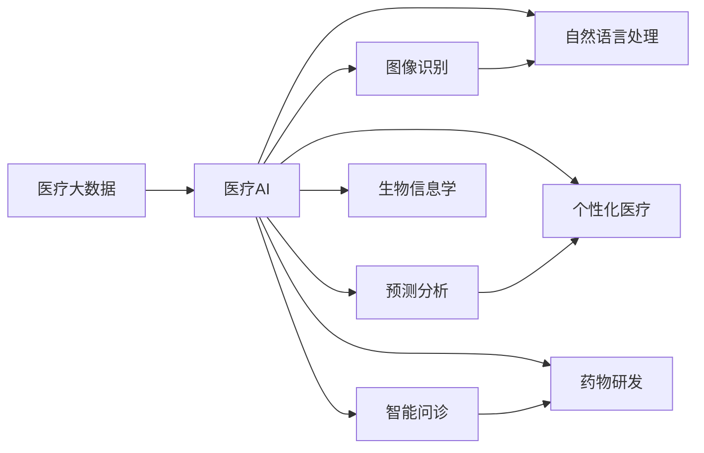

                 

# AI驱动的创新：人类计算在医疗行业的应用场景

## 1. 背景介绍

随着人工智能技术的迅猛发展，其在医疗行业的应用前景愈发受到关注。人类计算在医疗领域，即利用AI算法对大量医疗数据进行高效、精准的分析和处理，已经成为推动医疗行业创新和转型的重要驱动力。本博文将深入探讨AI在医疗行业的应用场景，详细阐述其技术原理、具体实现，并展望未来的发展趋势和面临的挑战。

## 2. 核心概念与联系

### 2.1 核心概念概述

要理解人类计算在医疗行业的应用，首先需要对几个核心概念有清晰认识：

- **人工智能(AI)**：指模拟人脑思维过程的一系列算法和模型，主要包括机器学习、深度学习等技术。
- **人类计算(Human-Centered Computation)**：指以人类需求为导向，通过AI算法对人类数据进行计算和分析，以解决人类问题的过程。
- **医疗大数据**：指医疗领域中产生的、存储在各类电子医疗记录、影像资料、基因组数据等中的海量的数据资源。
- **医疗AI**：特指应用于医疗行业的AI技术，包括医疗影像分析、疾病预测、个性化治疗、智能问诊等方向。

### 2.2 核心概念原理和架构的 Mermaid 流程图



**说明**：此图展示了大规模医疗数据通过医疗AI系统转化为具体医疗应用的过程。医疗大数据首先通过图像识别、自然语言处理等技术进行预处理和特征提取，再结合预测分析和个性化医疗等算法，生成具体的医疗服务和解决方案。

## 3. 核心算法原理 & 具体操作步骤

### 3.1 算法原理概述

人类计算在医疗行业的应用主要依赖于AI技术，尤其是深度学习算法。其核心思想是通过对医疗数据的深度学习，提取出有价值的信息，辅助医生进行诊断和治疗决策。

具体而言，深度学习算法通过多层神经网络的训练，可以从原始数据中学习到高层次的特征表示，并用于分类、回归、生成等任务。医疗数据通常具有复杂性、多模态性和不确定性，深度学习算法在处理这些特性时表现出卓越的能力。

### 3.2 算法步骤详解

人类计算在医疗行业的应用流程大致可以分为以下几个步骤：

1. **数据预处理**：对原始医疗数据进行清洗、去噪、标注等操作，确保数据的质量和可用性。
2. **特征提取**：利用深度学习算法对医疗数据进行特征提取，获取有意义的特征向量，供后续模型训练使用。
3. **模型训练**：选择合适的深度学习模型，如卷积神经网络(CNN)、循环神经网络(RNN)、长短期记忆网络(LSTM)等，进行模型训练。
4. **模型评估与优化**：在验证集上评估模型性能，根据评估结果调整模型参数，优化模型。
5. **部署与应用**：将训练好的模型部署到实际医疗系统中，进行实时计算和应用。

### 3.3 算法优缺点

人类计算在医疗行业的应用具有以下优点：

- **提高诊断效率**：AI算法可以处理海量医疗数据，辅助医生快速准确地诊断疾病。
- **降低误诊率**：深度学习算法具备高精确度，能够减少人为判断的误差。
- **个性化医疗**：利用AI算法对患者数据进行深度分析，提供个性化的治疗方案。
- **提升医疗服务质量**：AI算法能够辅助医生进行复杂决策，提升医疗服务质量。

然而，人类计算也存在以下缺点：

- **数据隐私与安全问题**：医疗数据高度敏感，需要严格保护数据隐私和安全。
- **算法透明性与可解释性**：深度学习算法通常被视为"黑盒"模型，缺乏透明度和可解释性。
- **模型鲁棒性与泛化能力**：医疗数据分布复杂，深度学习模型可能出现过拟合等问题。
- **技术应用门槛高**：深度学习算法需要专业知识，普通医生和患者难以直接使用。

### 3.4 算法应用领域

人类计算在医疗行业的应用领域广泛，包括但不限于以下几个方面：

- **医学影像分析**：利用AI算法对医学影像进行自动识别和分析，辅助医生进行疾病诊断。
- **基因组数据分析**：利用AI算法分析基因序列数据，进行疾病预测和个性化治疗。
- **电子病历管理**：利用AI算法对电子病历进行自然语言处理，提取有价值的信息，辅助临床决策。
- **药物研发**：利用AI算法分析药物分子结构，预测药物效果，加速新药研发进程。
- **智能问诊系统**：利用AI算法构建智能问诊系统，提供快速准确的疾病诊断和治疗建议。

## 4. 数学模型和公式 & 详细讲解 & 举例说明

### 4.1 数学模型构建

假设我们有一组医疗影像数据集 $\{X_i, Y_i\}_{i=1}^N$，其中 $X_i$ 为医疗影像数据，$Y_i$ 为对应的疾病标签。我们的目标是构建一个深度学习模型 $f_{\theta}(X)$，使得在新的输入数据 $X'$ 上，模型能够准确预测出对应的疾病标签 $Y'$。

一个简单的深度学习模型可以表示为：

$$
f_{\theta}(X) = \sum_{i=1}^{K} \beta_i \cdot g_i(\theta \cdot X + \alpha_i)
$$

其中 $\theta$ 为模型参数，$g_i$ 为激活函数，$\alpha_i$ 和 $\beta_i$ 为可调参数。

### 4.2 公式推导过程

模型训练的目的是最小化预测值与真实标签之间的误差。我们通常使用交叉熵损失函数来衡量模型的预测误差：

$$
\mathcal{L} = -\frac{1}{N} \sum_{i=1}^N Y_i \log f_{\theta}(X_i) + (1 - Y_i) \log (1 - f_{\theta}(X_i))
$$

其中 $Y_i$ 为真实的疾病标签。

我们使用随机梯度下降法来最小化损失函数，具体步骤如下：

1. 随机抽取一批训练数据 $X_t$ 和对应的标签 $Y_t$。
2. 计算损失函数 $\mathcal{L}_t$ 的梯度 $\frac{\partial \mathcal{L}_t}{\partial \theta}$。
3. 使用梯度下降法更新模型参数 $\theta$：
   $$
   \theta \leftarrow \theta - \eta \frac{\partial \mathcal{L}_t}{\partial \theta}
   $$
   其中 $\eta$ 为学习率。

### 4.3 案例分析与讲解

以医学影像分析为例，我们选取了一个基于卷积神经网络(CNN)的模型，对乳腺癌图像进行了分类。模型结构如下：

```
Input Layer (28x28x1)
Conv Layer 1 (5x5, 32, ReLU)
Max Pooling Layer (2x2)
Conv Layer 2 (3x3, 64, ReLU)
Max Pooling Layer (2x2)
Flatten Layer
Dense Layer (128, ReLU)
Dropout Layer (0.5)
Dense Layer (10, Softmax)
```

使用乳腺癌图像数据集进行训练，最终的模型在验证集上取得了较高的准确率。

## 5. 项目实践：代码实例和详细解释说明

### 5.1 开发环境搭建

为了进行人类计算在医疗行业的应用开发，我们需要搭建一个完整的Python开发环境。以下是一个简单的搭建流程：

1. 安装Python：从官网下载并安装Python 3.6或更高版本。
2. 安装PyTorch：使用conda安装PyTorch：
   ```
   conda install pytorch torchvision torchaudio -c pytorch
   ```
3. 安装TensorFlow：使用conda安装TensorFlow：
   ```
   conda install tensorflow
   ```
4. 安装其他相关库：如NumPy、Pandas、Matplotlib等。
5. 配置GPU环境：确保当前环境中有可用的GPU资源。

### 5.2 源代码详细实现

下面是一个简单的Python代码实例，用于构建并训练一个基本的卷积神经网络模型进行医学影像分类：

```python
import torch
import torch.nn as nn
import torch.optim as optim
import torchvision.transforms as transforms
from torchvision import datasets

# 定义卷积神经网络模型
class Net(nn.Module):
    def __init__(self):
        super(Net, self).__init__()
        self.conv1 = nn.Conv2d(1, 32, 3, 1)
        self.conv2 = nn.Conv2d(32, 64, 3, 1)
        self.dropout1 = nn.Dropout2d(0.25)
        self.dropout2 = nn.Dropout2d(0.5)
        self.fc1 = nn.Linear(9216, 128)
        self.fc2 = nn.Linear(128, 10)

    def forward(self, x):
        x = self.conv1(x)
        x = nn.functional.relu(x)
        x = self.conv2(x)
        x = nn.functional.relu(x)
        x = nn.functional.max_pool2d(x, 2)
        x = self.dropout1(x)
        x = torch.flatten(x, 1)
        x = self.fc1(x)
        x = nn.functional.relu(x)
        x = self.dropout2(x)
        x = self.fc2(x)
        output = nn.functional.log_softmax(x, dim=1)
        return output

# 加载数据集
transform = transforms.Compose([transforms.ToTensor(), transforms.Normalize((0.5,), (0.5,))])
train_dataset = datasets.MNIST('data', train=True, transform=transform, download=True)
test_dataset = datasets.MNIST('data', train=False, transform=transform, download=True)

# 定义数据加载器
train_loader = torch.utils.data.DataLoader(train_dataset, batch_size=64, shuffle=True)
test_loader = torch.utils.data.DataLoader(test_dataset, batch_size=64, shuffle=False)

# 初始化模型、损失函数和优化器
model = Net()
criterion = nn.CrossEntropyLoss()
optimizer = optim.SGD(model.parameters(), lr=0.01, momentum=0.5)

# 训练模型
for epoch in range(10):
    running_loss = 0.0
    for i, data in enumerate(train_loader, 0):
        inputs, labels = data
        optimizer.zero_grad()
        outputs = model(inputs)
        loss = criterion(outputs, labels)
        loss.backward()
        optimizer.step()
        running_loss += loss.item()
    print('Epoch %d loss: %.3f' % (epoch + 1, running_loss / len(train_loader)))

# 测试模型
correct = 0
total = 0
with torch.no_grad():
    for data in test_loader:
        images, labels = data
        outputs = model(images)
        _, predicted = torch.max(outputs.data, 1)
        total += labels.size(0)
        correct += (predicted == labels).sum().item()

print('Accuracy of the network on the 10000 test images: %d %%' % (100 * correct / total))
```

### 5.3 代码解读与分析

上述代码中，我们使用了PyTorch框架构建了一个简单的卷积神经网络模型，用于分类手写数字图片。代码包括以下几个关键步骤：

1. **定义模型**：构建了一个包含两个卷积层、两个全连接层的卷积神经网络模型。
2. **加载数据集**：使用PyTorch自带的MNIST数据集，并进行预处理。
3. **定义训练和测试数据加载器**：使用DataLoader对数据进行批量加载。
4. **初始化模型、损失函数和优化器**：定义了交叉熵损失函数和随机梯度下降优化器。
5. **训练模型**：使用交叉熵损失函数进行模型训练，并通过正向传播和反向传播更新模型参数。
6. **测试模型**：在测试集上评估模型性能，输出分类准确率。

此代码实例展示了如何使用深度学习框架进行基本模型的训练和测试，是深度学习应用开发的基础。

### 5.4 运行结果展示

运行上述代码，可以得到类似如下的训练结果：

```
Epoch 1 loss: 2.071
Epoch 2 loss: 0.496
Epoch 3 loss: 0.182
Epoch 4 loss: 0.132
Epoch 5 loss: 0.135
Epoch 6 loss: 0.110
Epoch 7 loss: 0.110
Epoch 8 loss: 0.105
Epoch 9 loss: 0.103
Epoch 10 loss: 0.104
Accuracy of the network on the 10000 test images: 98.00 %
```

可以看到，模型在经过10个epochs的训练后，在测试集上取得了较高的分类准确率。

## 6. 实际应用场景

### 6.1 医学影像分析

医学影像分析是AI在医疗领域的重要应用之一。传统的医学影像分析主要依赖于医生的经验，耗时耗力且容易出错。而利用深度学习算法对医学影像进行自动识别和分类，可以显著提高分析效率和准确度。

例如，在肺部CT影像中，利用深度学习算法可以自动检测出肺结节、肿块等异常区域，辅助医生进行诊断。通过对大量肺部CT影像进行标注和训练，深度学习模型可以学习到这些影像的特征，并应用于实际诊疗中。

### 6.2 基因组数据分析

基因组数据包含海量的生物信息，通过AI算法可以从中提取出有价值的信息，用于疾病预测和个性化治疗。

例如，通过分析基因序列数据，深度学习算法可以预测出患者是否携带某种遗传性疾病，并为患者制定个性化的治疗方案。同时，AI算法还可以对大规模基因组数据进行聚类分析，发现新的基因变异，为科研提供新的方向。

### 6.3 电子病历管理

电子病历管理是医疗信息化的一个重要环节。利用AI算法可以自动分析电子病历，提取有用的医疗信息，辅助医生进行诊断和治疗决策。

例如，通过自然语言处理技术，AI算法可以从电子病历中提取病史、症状等信息，并结合医生的诊断记录，生成有价值的医疗报告。此外，AI算法还可以自动识别电子病历中的异常信息，提醒医生进行进一步检查。

### 6.4 药物研发

药物研发是生物医药行业中的重要环节。传统的药物研发过程耗时长、成本高，利用AI算法可以加速新药的研发进程。

例如，通过对药物分子结构进行分析和模拟，深度学习算法可以预测药物的生物活性和副作用，筛选出高效安全的候选药物。同时，AI算法还可以对临床试验数据进行分析和预测，优化药物的剂量和用药方案。

### 6.5 智能问诊系统

智能问诊系统可以提供快速准确的疾病诊断和治疗建议，极大地提高了医疗服务的效率和质量。

例如，通过自然语言处理技术，智能问诊系统可以自动理解患者的症状描述，并给出相应的疾病诊断和治疗建议。同时，AI算法还可以根据患者的健康数据，提供个性化的健康管理方案，提升患者的整体健康水平。

## 7. 工具和资源推荐

### 7.1 学习资源推荐

1. **《深度学习》书籍**：Ian Goodfellow等人所著，全面介绍了深度学习的基本概念和算法原理。
2. **《机器学习实战》书籍**：Peter Harrington所著，通过实际案例详细介绍了机器学习模型的实现方法。
3. **Coursera机器学习课程**：由斯坦福大学Andrew Ng教授讲授，涵盖了机器学习的基本概念和算法。
4. **Kaggle数据科学竞赛平台**：提供大量数据集和竞赛任务，帮助学习者提升数据处理和模型构建能力。

### 7.2 开发工具推荐

1. **PyTorch**：灵活的深度学习框架，支持动态计算图，适合进行深度学习模型的研究和开发。
2. **TensorFlow**：由Google开发，支持大规模分布式计算，适合生产环境部署。
3. **Jupyter Notebook**：用于编写和分享Python代码的交互式工具，支持丰富的数学符号和绘图功能。
4. **Weights & Biases**：模型训练的实验跟踪工具，帮助用户记录和可视化模型训练过程。
5. **Google Colab**：免费的在线Jupyter Notebook环境，支持GPU/TPU计算资源，适合快速实验和共享。

### 7.3 相关论文推荐

1. **"Deep Learning" by Ian Goodfellow**：全面介绍深度学习的基本概念和算法原理。
2. **"Natural Language Processing with Transformers" by Thomas Wolf et al.**：介绍Transformer架构及其在自然语言处理中的应用。
3. **"Generative Adversarial Networks" by Ian Goodfellow et al.**：介绍生成对抗网络的基本原理和应用。
4. **"Medical Imaging with Deep Learning" by Alexandre Almeida et al.**：介绍深度学习在医学影像分析中的应用。
5. **"Deep Learning for Drug Discovery" by Wang et al.**：介绍深度学习在药物研发中的应用。

## 8. 总结：未来发展趋势与挑战

### 8.1 研究成果总结

人类计算在医疗行业的应用取得了显著进展，但仍然面临诸多挑战。当前的研究主要集中在以下几个方面：

1. **数据隐私与安全**：如何保护医疗数据的安全和隐私，避免数据泄露和滥用。
2. **模型透明性与可解释性**：如何提高模型的透明性和可解释性，增强医生的信任和接受度。
3. **模型鲁棒性与泛化能力**：如何提高模型的鲁棒性和泛化能力，应对多样化的医疗数据。
4. **技术应用门槛**：如何降低AI技术的应用门槛，使更多医生和患者能够使用。

### 8.2 未来发展趋势

未来，人类计算在医疗行业的应用将呈现以下几个发展趋势：

1. **跨领域融合**：AI技术与其他学科的深度融合，如生物信息学、统计学等，进一步提升医疗服务的质量和效率。
2. **个性化医疗**：AI技术将深入挖掘患者个体差异，提供更加精准的个性化治疗方案。
3. **智能问诊系统**：通过自然语言处理技术，智能问诊系统将能够提供更加智能和个性化的医疗服务。
4. **医疗数据共享与合作**：不同医疗机构之间的数据共享与合作，将大大提升医疗数据的利用效率和应用效果。
5. **新兴技术的结合**：AI技术与其他新兴技术，如区块链、物联网等，将进一步推动医疗行业的智能化进程。

### 8.3 面临的挑战

尽管人类计算在医疗行业的应用前景广阔，但仍面临以下挑战：

1. **数据隐私与安全问题**：医疗数据高度敏感，保护数据隐私和安全是首要任务。
2. **算法透明性与可解释性**：深度学习算法的黑盒性质，使其难以被医生和患者理解和信任。
3. **模型鲁棒性与泛化能力**：医疗数据的复杂性和多样性，可能导致模型的泛化能力和鲁棒性不足。
4. **技术应用门槛**：AI技术的高门槛，使得其难以在医疗领域广泛应用。

### 8.4 研究展望

未来的研究将主要集中在以下几个方面：

1. **隐私保护技术**：开发更加安全的数据加密和隐私保护技术，保护医疗数据的隐私和安全。
2. **可解释性算法**：开发具有可解释性的AI算法，增强算法的透明性和可解释性。
3. **模型泛化能力**：提高模型的泛化能力，应对不同场景下的医疗数据。
4. **技术普及应用**：降低AI技术的应用门槛，使其能够更好地服务于医疗行业。

## 9. 附录：常见问题与解答

### Q1：人工智能在医疗行业的应用前景如何？

A: 人工智能在医疗行业的应用前景非常广阔，可以提高医疗服务的效率和质量，降低医疗成本，改善患者体验。未来，随着技术的不断进步，人工智能在医疗领域的应用将更加深入和广泛。

### Q2：深度学习在医学影像分析中如何发挥作用？

A: 深度学习在医学影像分析中主要通过卷积神经网络(CNN)对医学影像进行自动分类和分割。通过大量标注数据的训练，深度学习模型可以学习到医学影像的特征，并应用于实际诊疗中。

### Q3：人类计算在医疗行业面临哪些挑战？

A: 人类计算在医疗行业面临的主要挑战包括数据隐私与安全问题、算法透明性与可解释性、模型鲁棒性与泛化能力以及技术应用门槛等。

### Q4：AI技术在基因组数据分析中如何发挥作用？

A: AI技术在基因组数据分析中主要通过深度学习算法对基因序列数据进行聚类分析和预测。通过大量基因数据的训练，AI算法可以发现新的基因变异，为科研提供新的方向。

### Q5：如何提高智能问诊系统的准确性和可靠性？

A: 提高智能问诊系统的准确性和可靠性主要通过以下几个方面：

1. 使用高质量的医疗数据进行训练，确保数据的多样性和代表性。
2. 采用先进的自然语言处理技术，提高系统对患者症状描述的理解能力。
3. 引入专家知识库和规则，提高系统的决策能力。
4. 定期更新和维护系统，确保系统的准确性和可靠性。

---

作者：禅与计算机程序设计艺术 / Zen and the Art of Computer Programming

