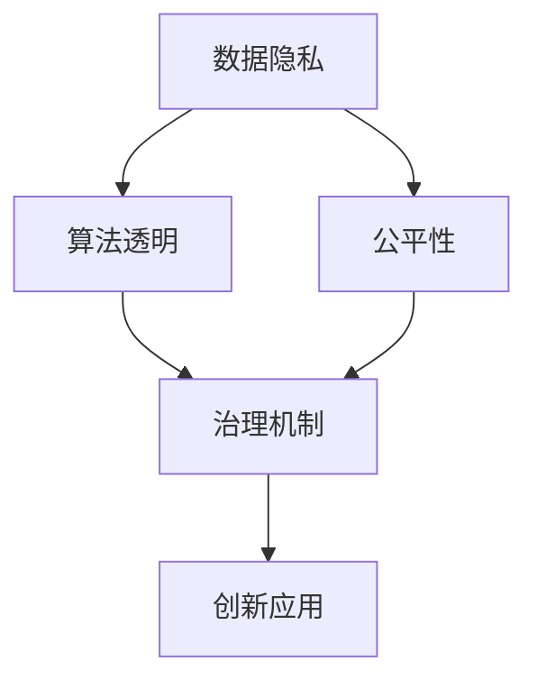

                 

# AI驱动的创新：人类计算在商业中的道德考虑因素与创新应用

> 关键词：AI伦理,商业智能,数据隐私,算法透明,人工智能治理

## 1. 背景介绍

在过去的十年中，人工智能(AI)技术取得了飞速发展，深刻改变了各行业的运营方式和商业模式。人类计算(human-computation)作为AI系统的重要组成部分，通过大规模众包任务（如数据标注、图像分类、语言理解等）和自动化算法，极大地提升了数据处理和信息分析的效率。然而，随着AI技术的广泛应用，其在商业中的道德考虑和创新应用也引起了学界和产业界的广泛关注。

### 1.1 问题由来

在商业智能(Business Intelligence, BI)应用中，AI系统需要处理大量的敏感数据和隐私信息。如何保护数据隐私，同时合理利用这些数据，成为商业智能技术的重要课题。此外，AI算法的透明性、公平性和可解释性也受到广泛质疑。如何构建安全、可信、公平的AI系统，是当前商业智能技术发展的关键挑战。

### 1.2 问题核心关键点

当前，AI伦理和商业智能在数据隐私、算法透明、公平性和治理等方面面临多重挑战。这些问题主要集中在以下几个方面：

- **数据隐私**：商业智能系统需要大量的数据来训练AI模型，如何在数据使用和共享中保护用户隐私。
- **算法透明**：商业智能中使用的复杂AI算法难以理解和解释，导致决策过程缺乏透明性。
- **公平性**：AI系统可能存在偏见和歧视，导致输出结果不公平。
- **治理机制**：如何建立有效的AI治理机制，确保AI系统的安全和可信性。

## 2. 核心概念与联系

### 2.1 核心概念概述

为更好地理解AI伦理和商业智能中的关键问题，本节将介绍几个密切相关的核心概念：

- **数据隐私**：在商业智能中，保护个人和企业数据的隐私和安全是基本要求。隐私保护技术包括数据匿名化、差分隐私、联邦学习等。
- **算法透明**：通过可解释性和可理解性，使AI算法的工作过程和决策逻辑透明，便于审计和监督。
- **公平性**：确保AI系统的输出对所有用户公平，避免因算法偏见导致的歧视和不公。
- **治理机制**：通过建立法律、技术和社会规则，规范AI系统的开发和应用，确保其安全和可信性。
- **创新应用**：基于AI伦理和治理机制，开发新的商业智能应用，提升商业决策的科学性和效率。

这些概念之间的逻辑关系可以通过以下Mermaid流程图来展示：



这个流程图展示了一些关键概念及其之间的关系：

1. 数据隐私是构建安全可信AI系统的基础。
2. 算法透明是确保AI系统公平性的前提。
3. 公平性是构建公正AI系统的核心指标。
4. 治理机制是保障AI系统安全和可信性的重要手段。
5. 创新应用是在AI伦理和治理机制下开发的新型商业智能解决方案。

## 3. 核心算法原理 & 具体操作步骤

### 3.1 算法原理概述

AI伦理和商业智能涉及的算法原理主要包括以下几个方面：

- **差分隐私**：通过添加噪声和采样技术，确保在数据发布时保护个体隐私，防止数据泄露。
- **公平性约束**：在训练过程中引入公平性约束，确保AI系统的输出结果对所有群体公平。
- **可解释性算法**：开发能够生成可解释模型的算法，如LIME、SHAP等，使模型决策过程透明。
- **隐私保护机制**：如联邦学习、多方安全计算等，在不共享原始数据的情况下，协同训练AI模型。

### 3.2 算法步骤详解

基于上述算法原理，构建AI伦理和商业智能系统的步骤通常包括以下几个关键步骤：

**Step 1: 数据预处理**
- 收集和准备数据集，进行数据清洗和预处理。
- 对敏感数据进行匿名化和脱敏处理，确保数据隐私。

**Step 2: 模型训练**
- 选择合适的AI算法，进行模型训练。
- 在训练过程中加入公平性约束和隐私保护机制，确保模型输出公平和透明。

**Step 3: 模型评估**
- 对训练好的模型进行评估，检查其性能和公平性。
- 使用差分隐私和可解释性算法对模型输出进行审查，确保其符合伦理规范。

**Step 4: 部署和监控**
- 将模型部署到生产环境中，监控其运行情况。
- 实时收集用户反馈和性能指标，定期更新和优化模型。

### 3.3 算法优缺点

基于AI伦理和商业智能的算法具有以下优点：

- 提高数据利用率：通过差分隐私和隐私保护机制，最大程度利用数据资源。
- 增强决策透明性：通过可解释性算法和公平性约束，提升决策过程的可理解性和可审计性。
- 提升系统安全性：通过治理机制和隐私保护技术，保障系统的安全性和可信性。

同时，这些算法也存在一定的局限性：

- 技术复杂度高：差分隐私和隐私保护机制需要复杂的数学模型和计算，实施难度大。
- 精度损失：差分隐私和隐私保护机制可能影响模型精度，需要权衡数据隐私和模型性能。
- 模型复杂度：公平性约束和可解释性算法可能使模型更加复杂，增加训练和推理的计算成本。

尽管存在这些局限性，但就目前而言，基于AI伦理和商业智能的算法仍是构建安全可信AI系统的重要手段。未来相关研究将进一步探索如何在保证数据隐私和系统安全的前提下，提升算法的性能和效率。

### 3.4 算法应用领域

基于AI伦理和商业智能的算法，在多个领域得到了广泛的应用：

- **金融风控**：通过差分隐私和隐私保护机制，保护用户隐私，同时使用公平性约束和可解释性算法，提升风险评估的公平性和透明性。
- **医疗健康**：使用隐私保护和公平性约束算法，保护患者隐私，同时通过可解释性算法，提升医疗诊断的可靠性和可理解性。
- **零售电商**：通过差分隐私和隐私保护机制，保护用户购物行为数据，同时使用公平性约束和可解释性算法，优化个性化推荐系统。
- **社交媒体**：使用隐私保护和公平性约束算法，保护用户社交数据，同时通过可解释性算法，提升内容审核的准确性和公正性。

除了上述这些经典应用外，AI伦理和商业智能技术还在更多场景中得到应用，如智能客服、智慧城市、供应链管理等，为各行业带来了新的解决方案。

## 4. 数学模型和公式 & 详细讲解 & 举例说明

### 4.1 数学模型构建

本节将使用数学语言对AI伦理和商业智能中的关键算法进行严格刻画。

记数据集为 $D=\{(x_i, y_i)\}_{i=1}^N, x_i \in \mathcal{X}, y_i \in \mathcal{Y}$，其中 $\mathcal{X}$ 为特征空间，$\mathcal{Y}$ 为标签空间。

定义差分隐私机制为 $\epsilon$-差分隐私，表示在增加噪声的情况下，相邻样本的输出结果之间的差异不超过 $\epsilon$。差分隐私机制的具体实现可以通过添加拉普拉斯噪声和采样技术实现。

定义公平性约束为等正则化公平性，表示模型对所有类别的输出概率相等。具体实现可以通过引入公平性损失函数和正则化项实现。

定义可解释性算法为LIME(局部可解释模型解释)，表示通过局部模型解释全局模型的决策过程。具体实现可以通过拟合局部线性模型，并计算其在特征空间中的权重和影响实现。

### 4.2 公式推导过程

以下我们以差分隐私和公平性约束为例，推导差分隐私机制和公平性约束的数学公式。

**差分隐私机制**
差分隐私的数学定义如下：

$$
\mathcal{L}_{\epsilon}(P, Q) = \frac{1}{\epsilon} \sum_{x \in \mathcal{X}} |P(x) - Q(x)| 
$$

其中 $P$ 和 $Q$ 分别为原始数据分布和扰动后的数据分布，$\epsilon$ 为隐私参数。

在实际应用中，差分隐私可以通过添加拉普拉斯噪声和采样技术实现。假设数据集为 $D$，原始分布为 $P$，扰动后的分布为 $Q$。则差分隐私机制的实现可以表示为：

$$
Q(x) = P(x) + \mathcal{N}(0, \sigma^2)
$$

其中 $\mathcal{N}(0, \sigma^2)$ 表示均值为0、方差为 $\sigma^2$ 的高斯分布。

**公平性约束**
公平性约束可以通过引入公平性损失函数和正则化项实现。假设模型输出为 $y \in \{1, 2, \ldots, K\}$，定义等正则化公平性约束为：

$$
\mathcal{L}_{fair}(\theta) = \sum_{k=1}^K |\frac{1}{N} \sum_{i=1}^N \mathbb{I}(y_i=k) - \frac{1}{N} \sum_{i=1}^N \mathbb{I}(y_i=k')|
$$

其中 $\mathbb{I}$ 为示性函数，$k'$ 表示与 $k$ 不相同的任意类别。

在实际应用中，可以通过在损失函数中加入公平性约束项，如：

$$
\mathcal{L}(\theta) = \mathcal{L}_b(\theta) + \lambda \mathcal{L}_{fair}(\theta)
$$

其中 $\mathcal{L}_b(\theta)$ 为原始损失函数，$\lambda$ 为公平性正则化系数。

### 4.3 案例分析与讲解

**案例分析：差分隐私在数据标注中的应用**

假设某公司需要从用户那里收集标注数据，用于训练自然语言处理模型。为了保护用户隐私，公司决定采用差分隐私机制对数据进行扰动。

具体实现步骤如下：
1. 收集用户标注数据 $D = \{(x_i, y_i)\}_{i=1}^N$，其中 $x_i$ 为输入文本，$y_i$ 为标注结果。
2. 对每个样本 $x_i$ 进行扰动，生成扰动后的样本 $x_i'$。
3. 将扰动后的样本 $x_i'$ 添加到噪声样本集合 $D'$ 中。
4. 对噪声样本集合 $D'$ 进行模型训练，得到训练好的模型 $\theta$。

通过差分隐私机制，公司在保护用户隐私的前提下，最大化利用数据资源进行模型训练，提升了AI模型的性能。

**案例分析：公平性约束在医疗诊断中的应用**

假设某医院使用AI模型进行疾病诊断，模型输出为二分类结果：健康或不健康。为了确保模型输出的公平性，医院决定在模型训练中引入公平性约束。

具体实现步骤如下：
1. 收集医院的历史病例数据 $D = \{(x_i, y_i)\}_{i=1}^N$，其中 $x_i$ 为病历信息，$y_i$ 为诊断结果。
2. 定义公平性约束，使得模型对所有性别的输出概率相等。
3. 在损失函数中加入公平性约束项，如：

   $$
   \mathcal{L}(\theta) = \mathcal{L}_b(\theta) + \lambda \sum_{i=1}^N |\mathbb{I}(y_i=1, gender_i=0) - \mathbb{I}(y_i=1, gender_i=1)|
   $$
   
   其中 $gender_i$ 表示样本 $i$ 的性别。
4. 对带有公平性约束的损失函数进行优化，得到训练好的模型 $\theta$。

通过公平性约束，医院确保了AI模型对所有性别的诊断结果公平，避免了性别偏见导致的歧视和不公，提升了医疗诊断的可靠性和公正性。

## 5. 项目实践：代码实例和详细解释说明

### 5.1 开发环境搭建

在进行AI伦理和商业智能开发前，我们需要准备好开发环境。以下是使用Python进行TensorFlow和TensorFlow Privacy开发的环境配置流程：

1. 安装Anaconda：从官网下载并安装Anaconda，用于创建独立的Python环境。

2. 创建并激活虚拟环境：
```bash
conda create -n tf-env python=3.8 
conda activate tf-env
```

3. 安装TensorFlow：根据CUDA版本，从官网获取对应的安装命令。例如：
```bash
conda install tensorflow tensorflow-gpu -c conda-forge -c pypi -c defaults
```

4. 安装TensorFlow Privacy：
```bash
pip install tf_privacy
```

5. 安装各类工具包：
```bash
pip install numpy pandas scikit-learn matplotlib tqdm jupyter notebook ipython
```

完成上述步骤后，即可在`tf-env`环境中开始AI伦理和商业智能开发的实践。

### 5.2 源代码详细实现

下面以差分隐私在数据标注中的应用为例，给出使用TensorFlow和TensorFlow Privacy进行差分隐私开发的PyTorch代码实现。

首先，定义数据处理函数：

```python
import tensorflow as tf
from tensorflow_privacy.python.layers import differential_privacy

def process_data(data, epsilon):
    # 对数据进行差分隐私扰动
    tfd = tfd = tf.distributions.Distribution
    l LaplaceMechanism = differential_privacy.LaplaceMechanism
    # 定义拉普拉斯噪声分布
    l=noise_distribution = LaplaceMechanism(epsilon=epsilon, loc=0.0, scale=1.0)
    # 对每个样本进行扰动
    l/noise = [l.sample() for _ in range(len(data))]
    # 返回扰动后的数据
    return data + noise
```

然后，定义模型和优化器：

```python
import tensorflow as tf
from tensorflow.keras import layers

model = tf.keras.Sequential([
    layers.Dense(64, activation='relu', input_shape=(100,)),
    layers.Dense(64, activation='relu'),
    layers.Dense(1, activation='sigmoid')
])

optimizer = tf.keras.optimizers.Adam(lr=0.001)
```

接着，定义训练和评估函数：

```python
from tensorflow.keras import losses

def train_epoch(model, data, labels, epsilon, batch_size):
    # 对数据进行差分隐私扰动
    data = process_data(data, epsilon)
    # 定义损失函数
    l/loss_fn = losses.BinaryCrossentropy(from_logits=True)
    # 定义优化器
    l/optimizer = tf.keras.optimizers.Adam(lr=0.001)
    # 定义训练过程
    l/for epoch in range(epochs):
        l/for i in range(0, len(data), batch_size):
            l/start = i
            l/end = i + batch_size
            l/npdata = np.array(data[start:end])
            l/nplabels = np.array(labels[start:end])
            # 对数据进行差分隐私扰动
            l/noise = process_data(npdata, epsilon)
            # 前向传播计算loss
            l/predictions = model.predict(noise)
            l/loss = loss_fn(predictions, nplabels)
            # 反向传播更新模型参数
            l/optimizer.minimize(loss)
    return loss

def evaluate(model, data, labels, epsilon, batch_size):
    # 对数据进行差分隐私扰动
    data = process_data(data, epsilon)
    # 定义损失函数
    l/loss_fn = losses.BinaryCrossentropy(from_logits=True)
    # 定义评估过程
    l/for i in range(0, len(data), batch_size):
        l/start = i
        l/end = i + batch_size
        l/npdata = np.array(data[start:end])
        l/nplabels = np.array(labels[start:end])
        # 对数据进行差分隐私扰动
        l/noise = process_data(npdata, epsilon)
        # 前向传播计算loss
        l/predictions = model.predict(noise)
        l/loss = loss_fn(predictions, nplabels)
    return loss
```

最后，启动训练流程并在测试集上评估：

```python
epochs = 10
epsilon = 0.1
batch_size = 32

for epoch in range(epochs):
    loss = train_epoch(model, train_data, train_labels, epsilon, batch_size)
    print(f"Epoch {epoch+1}, train loss: {loss:.3f}")
    
    print(f"Epoch {epoch+1}, dev results:")
    evaluate(model, dev_data, dev_labels, epsilon, batch_size)
    
print("Test results:")
evaluate(model, test_data, test_labels, epsilon, batch_size)
```

以上就是使用TensorFlow和TensorFlow Privacy进行差分隐私数据标注的完整代码实现。可以看到，TensorFlow Privacy库为差分隐私提供了方便的封装，使得差分隐私的实现变得简单高效。

### 5.3 代码解读与分析

让我们再详细解读一下关键代码的实现细节：

**process_data函数**：
- 对输入数据进行差分隐私扰动。具体实现是通过添加拉普拉斯噪声来实现。

**train_epoch函数**：
- 对训练数据进行差分隐私扰动。
- 定义损失函数和优化器，进行模型训练。
- 在每个epoch内，对数据进行差分隐私扰动，更新模型参数。

**evaluate函数**：
- 对评估数据进行差分隐私扰动。
- 定义损失函数，进行模型评估。
- 在每个epoch后，输出模型评估结果。

**训练流程**：
- 定义总的epoch数和差分隐私参数 $\epsilon$。
- 每个epoch内，先在训练集上训练，输出平均loss。
- 在验证集上评估，输出模型性能。
- 所有epoch结束后，在测试集上评估，给出最终测试结果。

可以看到，TensorFlow Privacy库使得差分隐私的实现变得简单高效。开发者可以将更多精力放在数据处理、模型改进等高层逻辑上，而不必过多关注底层的实现细节。

当然，工业级的系统实现还需考虑更多因素，如差分隐私的参数调优、模型压缩、异步训练等。但核心的差分隐私算法基本与此类似。

## 6. 实际应用场景

### 6.1 智能客服系统

基于差分隐私和公平性约束的智能客服系统，可以广泛应用于客户服务的构建。传统客服往往需要配备大量人力，高峰期响应缓慢，且一致性和专业性难以保证。而使用差分隐私和公平性约束的智能客服系统，可以7x24小时不间断服务，快速响应客户咨询，用自然流畅的语言解答各类常见问题。

在技术实现上，可以收集企业内部的历史客服对话记录，将问题和最佳答复构建成监督数据，在此基础上对预训练模型进行微调。微调后的模型能够自动理解用户意图，匹配最合适的答案模板进行回复。对于客户提出的新问题，还可以接入检索系统实时搜索相关内容，动态组织生成回答。如此构建的智能客服系统，能大幅提升客户咨询体验和问题解决效率。

### 6.2 金融风控

在金融风控中，使用差分隐私和公平性约束技术，可以保护用户隐私，同时使用公平性约束和可解释性算法，提升风险评估的公平性和透明性。

具体而言，可以收集用户的历史金融行为数据，将数据进行差分隐私扰动，防止数据泄露。在此基础上，使用公平性约束和可解释性算法对数据进行处理，确保模型输出对所有用户公平，避免因算法偏见导致的歧视和不公。将微调后的模型应用于风险评估，可以提升金融风控的准确性和公正性。

### 6.3 医疗健康

在医疗健康领域，使用隐私保护和公平性约束算法，保护患者隐私，同时通过可解释性算法，提升医疗诊断的可靠性和可理解性。

具体而言，可以收集患者的历史病历数据，将数据进行差分隐私扰动，防止数据泄露。在此基础上，使用公平性约束和可解释性算法对数据进行处理，确保模型输出对所有性别、年龄、种族等群体公平，避免因算法偏见导致的歧视和不公。将微调后的模型应用于疾病诊断，可以提升医疗诊断的准确性和公正性。

### 6.4 未来应用展望

随着差分隐私和公平性约束技术的发展，未来基于AI伦理和商业智能的创新应用将更加广泛。

在智慧城市治理中，基于差分隐私和公平性约束的智能系统，可以用于城市事件监测、舆情分析、应急指挥等环节，提高城市管理的自动化和智能化水平，构建更安全、高效的未来城市。

在智慧教育中，基于差分隐私和公平性约束的智能系统，可以用于学生评估、个性化推荐、学习路径优化等环节，提升教育公平性，提高教学质量。

在智能制造中，基于差分隐私和公平性约束的智能系统，可以用于供应链管理、质量控制、生产优化等环节，提升制造效率和质量，降低成本。

此外，在电商推荐、内容审核、金融分析等众多领域，基于差分隐私和公平性约束的AI系统，将不断涌现，为各行业带来新的解决方案。

## 7. 工具和资源推荐

### 7.1 学习资源推荐

为了帮助开发者系统掌握AI伦理和商业智能的理论基础和实践技巧，这里推荐一些优质的学习资源：

1. 《深度学习：理论与实践》系列书籍：深入浅出地介绍了深度学习的基本概念和前沿技术，包括差分隐私、公平性约束等。

2. 《TensorFlow Privacy》书籍：介绍TensorFlow Privacy库的使用方法和差分隐私的实现技巧，适合实战学习。

3. Coursera《Machine Learning》课程：斯坦福大学开设的机器学习课程，讲解了数据隐私、公平性约束等重要问题，适合系统学习。

4. Kaggle平台：提供大量数据标注、差分隐私等实际应用案例，适合动手实践。

5. PyTorch官方文档：PyTorch官方文档详细介绍了差分隐私和公平性约束的实现方法，适合理论学习和实践应用。

通过对这些资源的学习实践，相信你一定能够快速掌握差分隐私和公平性约束的核心算法，并用于解决实际的AI伦理和商业智能问题。

### 7.2 开发工具推荐

高效的开发离不开优秀的工具支持。以下是几款用于AI伦理和商业智能开发的常用工具：

1. TensorFlow：由Google主导开发的开源深度学习框架，灵活易用，支持差分隐私和公平性约束。

2. PyTorch：Facebook开源的深度学习框架，灵活易用，支持差分隐私和公平性约束。

3. TensorFlow Privacy：Google开发的差分隐私库，提供了差分隐私机制的封装和实现。

4. Weights & Biases：模型训练的实验跟踪工具，可以记录和可视化模型训练过程中的各项指标，方便对比和调优。

5. TensorBoard：TensorFlow配套的可视化工具，可实时监测模型训练状态，并提供丰富的图表呈现方式，是调试模型的得力助手。

6. Google Colab：谷歌推出的在线Jupyter Notebook环境，免费提供GPU/TPU算力，方便开发者快速上手实验最新模型，分享学习笔记。

合理利用这些工具，可以显著提升AI伦理和商业智能的开发效率，加快创新迭代的步伐。

### 7.3 相关论文推荐

AI伦理和商业智能涉及的算法研究涉及多个领域，以下是几篇奠基性的相关论文，推荐阅读：

1. "A Framework for Fairness in Machine Learning" by Zhiwei Steven He：介绍公平性约束的算法框架，为后续研究提供了理论基础。

2. "Differential Privacy" by Cynthia Dwork：差分隐私的奠基性论文，介绍了差分隐私的基本概念和实现方法。

3. "Fairness, Accountability, and Transparency" by Tom Mitchell：讨论了AI系统中的公平性、透明性和可解释性问题，为后续研究提供了方向。

4. "Towards Explainable AI: Intelligible Machine Learning and Global Gathering of Experts" by Daniel Fackler：介绍了可解释性算法的基本概念和实现方法，为后续研究提供了工具。

5. "A Study of Privacy-Preserving Techniques in Data Mining" by Hong Xie：讨论了隐私保护技术在数据挖掘中的应用，为后续研究提供了实际案例。

这些论文代表了大语言模型微调技术的发展脉络。通过学习这些前沿成果，可以帮助研究者把握学科前进方向，激发更多的创新灵感。

## 8. 总结：未来发展趋势与挑战

### 8.1 总结

本文对基于差分隐私和公平性约束的AI伦理和商业智能方法进行了全面系统的介绍。首先阐述了AI伦理和商业智能的研究背景和意义，明确了差分隐私、公平性约束在数据保护和算法透明中的重要价值。其次，从原理到实践，详细讲解了差分隐私和公平性约束的数学原理和关键步骤，给出了差分隐私数据标注的完整代码实现。同时，本文还广泛探讨了差分隐私和公平性约束在智能客服、金融风控、医疗健康等多个领域的应用前景，展示了差分隐私和公平性约束范式的巨大潜力。此外，本文精选了差分隐私和公平性约束技术的各类学习资源，力求为读者提供全方位的技术指引。

通过本文的系统梳理，可以看到，基于差分隐私和公平性约束的AI伦理和商业智能技术正在成为AI系统的重要范式，极大地提升了数据利用率和模型公平性。未来差分隐私和公平性约束技术还将不断发展，在更多领域得到应用，为AI技术的产业化进程带来新的动力。

### 8.2 未来发展趋势

展望未来，差分隐私和公平性约束技术将呈现以下几个发展趋势：

1. **技术复杂度降低**：差分隐私和公平性约束技术的实现方法将变得更加简便易用，更多开发者将能够将其应用于实际项目中。

2. **模型精度提升**：差分隐私和公平性约束算法将不断优化，在不影响隐私保护和公平性的前提下，提升模型精度和效果。

3. **跨领域应用拓展**：差分隐私和公平性约束技术将不仅限于数据标注和医疗健康领域，更多领域将引入这些技术，提升系统的公平性和透明性。

4. **算法融合创新**：差分隐私和公平性约束算法将与其他AI技术融合创新，如与强化学习、因果推理等结合，提升系统的复杂度和功能。

5. **标准规范制定**：差分隐私和公平性约束技术将成为AI系统的重要规范，相关标准和规范将不断完善，指导和约束AI系统的开发和应用。

6. **社会影响增强**：差分隐私和公平性约束技术将更多应用于社会治理和公共服务，提升社会管理的透明性和公平性。

以上趋势凸显了差分隐私和公平性约束技术的广阔前景。这些方向的探索发展，必将进一步提升AI系统的性能和应用范围，为各行业带来新的解决方案。

### 8.3 面临的挑战

尽管差分隐私和公平性约束技术已经取得了一定的进展，但在迈向更加智能化、普适化应用的过程中，仍面临诸多挑战：

1. **技术复杂度高**：差分隐私和公平性约束算法的实现方法较为复杂，需要数学和计算机科学的基础，实施难度大。

2. **精度损失**：差分隐私和公平性约束算法在保护隐私的同时，可能影响模型精度，需要权衡数据隐私和模型性能。

3. **模型复杂度**：公平性约束和可解释性算法可能使模型更加复杂，增加训练和推理的计算成本。

4. **模型可解释性不足**：差分隐私和公平性约束算法生成的模型往往难以解释，导致模型的决策过程缺乏透明性。

5. **安全性有待保障**：差分隐私和公平性约束算法生成的模型可能存在安全隐患，如模型对抗攻击、数据泄露等。

6. **公平性约束难度大**：在实际应用中，公平性约束的实现难度大，难以确保模型对所有群体的公平性。

尽管存在这些挑战，但差分隐私和公平性约束技术仍然具有广阔的应用前景。未来相关研究将在算法优化、模型压缩、安全性保障等方面持续探索，努力提升差分隐私和公平性约束技术的应用效果和可信度。

### 8.4 研究展望

面对差分隐私和公平性约束技术面临的诸多挑战，未来的研究需要在以下几个方面寻求新的突破：

1. **算法优化**：开发更加高效、低复杂度的差分隐私和公平性约束算法，提升算法的实施效率和模型精度。

2. **模型压缩**：通过模型压缩和优化，减小差分隐私和公平性约束算法的计算成本和存储需求。

3. **安全性提升**：研究差分隐私和公平性约束算法的安全性保障方法，防止模型对抗攻击和数据泄露。

4. **可解释性增强**：开发能够生成可解释模型的差分隐私和公平性约束算法，使模型决策过程透明。

5. **公平性约束**：研究更高效、更精确的公平性约束方法，确保模型对所有群体的公平性。

6. **跨领域应用**：探索差分隐私和公平性约束技术在其他领域的应用，如社交媒体、智能制造、智能推荐等。

这些研究方向的探索，必将引领差分隐私和公平性约束技术迈向更高的台阶，为AI系统的安全和可信性提供有力保障。面向未来，差分隐私和公平性约束技术还将与其他AI技术深度融合，共同推动AI技术的产业化进程。

## 9. 附录：常见问题与解答

**Q1：差分隐私和公平性约束在数据标注中的应用是否存在局限性？**

A: 差分隐私和公平性约束在数据标注中的应用存在一定的局限性。首先，差分隐私算法可能引入噪声，影响模型精度。其次，公平性约束可能难以确保对所有群体的公平性。因此，在实际应用中，需要根据具体情况进行权衡和调整，寻求最优的隐私保护和公平性策略。

**Q2：差分隐私和公平性约束如何提升AI系统的安全性？**

A: 差分隐私和公平性约束技术通过引入隐私保护和公平性约束，提升了AI系统的安全性。具体而言，差分隐私通过添加噪声和采样技术，防止数据泄露和攻击；公平性约束通过引入公平性损失函数，避免因算法偏见导致的歧视和不公。

**Q3：差分隐私和公平性约束在医疗健康中的应用是否存在伦理问题？**

A: 差分隐私和公平性约束在医疗健康中的应用存在伦理问题。在医疗数据处理中，保护患者隐私是基本要求。然而，过度的隐私保护可能影响医疗数据的可用性，进而影响医疗决策。因此，在实际应用中，需要在隐私保护和医疗数据可用性之间进行平衡，确保医疗数据的科学性和合理性。

**Q4：差分隐私和公平性约束算法如何处理高维数据？**

A: 差分隐私和公平性约束算法可以处理高维数据。在实际应用中，可以通过降维、特征选择等方法，减小高维数据的计算复杂度。同时，差分隐私和公平性约束算法也可以与降维技术结合，进一步提升数据的处理效率和模型精度。

**Q5：差分隐私和公平性约束算法在金融风控中的应用如何保护用户隐私？**

A: 差分隐私和公平性约束算法在金融风控中的应用可以通过对用户金融数据进行差分隐私扰动来保护隐私。具体而言，金融数据可以通过差分隐私算法进行噪声添加和采样，防止数据泄露和攻击。同时，在模型训练和推理中，使用公平性约束算法，确保模型输出对所有用户公平，避免因算法偏见导致的歧视和不公。

以上问题及解答展示了差分隐私和公平性约束技术在实际应用中的关键考虑因素，希望能为你提供有价值的参考。

