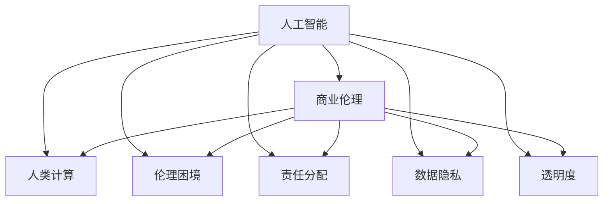

                 

# AI驱动的创新：人类计算在商业中的道德考虑因素与机遇

> 关键词：人工智能, 商业伦理, 人类计算, 道德困境, 责任分配, 数据隐私, 透明度, 责任AI

## 1. 背景介绍

### 1.1 问题由来
随着人工智能（AI）技术的快速发展，其在商业中的应用变得越来越广泛。从自动驾驶汽车到智能客服，从个性化推荐系统到金融风控，AI正逐步渗透到各行各业，改变我们的生产和生活方式。然而，在AI带来巨大便利的同时，也引发了一系列道德和伦理问题，需要我们深入思考和应对。

AI在商业中的应用涉及到复杂的决策链条和利益相关方，如消费者、员工、合作伙伴等。AI的决策不仅依赖于算法本身，还受数据质量、环境因素、人类行为等多种因素影响。这些因素共同作用，可能导致AI系统在做出决策时存在伦理风险，如歧视、偏见、隐私泄露等。因此，如何在商业中合理应用AI，保护相关方的利益，成为当前亟需解决的重要问题。

### 1.2 问题核心关键点
AI在商业中的道德考虑主要包括以下几个关键点：
- 数据隐私与数据保护：如何确保用户的隐私数据不被滥用，如何在遵守隐私法规的前提下使用数据。
- 透明性与可解释性：AI决策过程是否透明，模型是否可解释，用户能否理解AI的决策依据。
- 责任归属与责任分配：在AI决策出现错误或导致负面影响时，责任如何归咎，如何分配责任。
- 算法偏见与公平性：AI系统是否存在系统性偏见，如何确保AI的公平性，避免歧视性决策。
- 技术伦理与人类价值观：AI的决策是否符合人类价值观和伦理标准，是否有助于推动社会公正。

## 2. 核心概念与联系

### 2.1 核心概念概述

为更好地理解AI在商业中的道德问题，本节将介绍几个关键概念及其联系：

- **人工智能（Artificial Intelligence, AI）**：通过计算机算法和模型对数据进行学习和推理，模拟人类智能行为的技术。AI可以应用于自然语言处理、计算机视觉、机器人控制等多个领域。
- **商业伦理（Business Ethics）**：企业在经营活动中遵循的道德准则，包括对消费者、员工、社会等利益相关方的尊重和保护。
- **人类计算（Human-Computer Interaction, HCI）**：研究如何设计计算机系统，使其更符合人类认知和行为习惯，提升用户体验。
- **伦理困境（Ethical Dilemmas）**：在面临多个道德选项时，难以做出符合人类价值观和伦理标准的决策。
- **责任分配（Accountability Distribution）**：在AI系统决策出现错误时，如何分配责任，保护相关方的权益。
- **数据隐私（Data Privacy）**：保护用户数据免受滥用，确保用户对其数据有充分的控制权。
- **透明度（Transparency）**：AI决策过程是否清晰可见，是否能够对外界公开和解释。

这些概念之间的逻辑关系可以通过以下Mermaid流程图来展示：



这个流程图展示了AI技术在商业中的应用，以及与之相关的伦理和道德问题：

1. AI系统由人类计算技术实现，通过学习数据进行决策。
2. AI决策受商业伦理的约束，需要在多方面考虑利益相关方的权益。
3. 在决策过程中可能遇到伦理困境，如数据隐私与业务目标的冲突。
4. 责任分配决定了AI决策错误时的责任归属问题。
5. 数据隐私和透明度是保护用户权益的关键因素。

## 3. 核心算法原理 & 具体操作步骤
### 3.1 算法原理概述

AI在商业中的应用，本质上是利用算法对数据进行学习，以自动化或辅助决策。其核心思想是通过大量数据训练模型，使其能够在特定任务上做出准确预测。然而，AI决策的复杂性和多样性，使得其面临诸多道德挑战，如数据偏见、决策透明度、责任归属等。

AI商业应用的核心算法包括以下几个方面：

- **监督学习（Supervised Learning）**：通过标注数据训练模型，使其能够对新数据进行分类或回归。
- **无监督学习（Unsupervised Learning）**：从无标注数据中发现模式和结构，用于聚类、降维等任务。
- **强化学习（Reinforcement Learning）**：通过与环境的交互，学习最优决策策略，用于自动控制、游戏等场景。
- **迁移学习（Transfer Learning）**：将在一个任务上训练的模型，迁移到另一个相关任务中，减少新任务的数据需求。

### 3.2 算法步骤详解

AI在商业中的算法步骤主要包括以下几个关键环节：

**Step 1: 数据收集与预处理**
- 收集与业务相关的数据，如用户行为数据、市场交易数据、产品性能数据等。
- 清洗数据，处理缺失值、异常值，进行特征工程，构建数据集。

**Step 2: 模型选择与训练**
- 选择合适的算法模型，如回归模型、分类模型、推荐模型等。
- 使用训练集对模型进行训练，最小化损失函数，优化模型参数。

**Step 3: 模型评估与优化**
- 在验证集上评估模型性能，使用准确率、召回率、F1分数等指标。
- 根据评估结果，调整模型参数，进行超参数调优。

**Step 4: 模型部署与应用**
- 将训练好的模型部署到生产环境中，进行实时预测或决策。
- 监控模型性能，定期更新模型，应对环境变化和数据更新。

### 3.3 算法优缺点

AI在商业中的应用具有以下优点：
- 提升效率：自动化和辅助决策，减少人工操作，提高工作效率。
- 降低成本：减少人工成本，优化资源配置。
- 精准决策：利用大量数据和先进算法，提供精准的决策支持。
- 创新能力：辅助创新，提供新的商业机会和业务模式。

同时，AI在商业中也存在以下局限性：
- 依赖数据：需要大量高质量的数据支持，数据不足可能导致模型性能下降。
- 模型偏见：模型可能存在系统性偏见，导致不公平的决策。
- 复杂性高：AI系统复杂度高，难以解释和理解。
- 安全性问题：AI系统可能受到攻击，数据泄露、决策失误等问题。

### 3.4 算法应用领域

AI在商业中的应用非常广泛，涵盖以下几个主要领域：

- **智能客服**：通过自然语言处理技术，自动处理用户咨询，提升客户满意度。
- **营销分析**：利用数据分析和机器学习技术，优化营销策略，提高广告投放效果。
- **供应链管理**：使用AI进行需求预测、库存管理、物流优化等，提升供应链效率。
- **金融风控**：应用AI进行信用评估、风险控制、反欺诈等，提升金融安全。
- **医疗健康**：利用AI进行疾病诊断、个性化治疗、健康管理等，提高医疗水平。
- **智能制造**：通过AI优化生产流程、设备维护、质量控制等，提升制造业自动化水平。

## 4. 数学模型和公式 & 详细讲解  
### 4.1 数学模型构建

在商业应用中，AI模型的数学模型主要涉及以下几个方面：

- **线性回归（Linear Regression）**：用于预测连续值，如股票价格、用户消费等。
- **逻辑回归（Logistic Regression）**：用于分类任务，如判断用户是否流失、产品是否优质等。
- **决策树（Decision Tree）**：通过树形结构进行决策，适用于分类和回归任务。
- **随机森林（Random Forest）**：多个决策树的集成，用于提高模型的稳定性和准确性。
- **神经网络（Neural Networks）**：通过多层非线性变换，实现复杂的决策任务。

以线性回归模型为例，其数学模型可以表示为：

$$
y = \theta_0 + \sum_{i=1}^n \theta_i x_i
$$

其中 $y$ 为预测值，$x_i$ 为输入特征，$\theta_0$ 和 $\theta_i$ 为模型参数。

### 4.2 公式推导过程

以逻辑回归模型为例，推导其损失函数和梯度更新公式：

设训练数据集为 $(x_i, y_i)$，模型预测为 $y_i = \sigma(\theta_0 + \sum_{i=1}^n \theta_i x_i)$，其中 $\sigma$ 为 sigmoid 函数，$\theta_0$ 和 $\theta_i$ 为模型参数。

定义损失函数为交叉熵损失函数：

$$
\mathcal{L}(\theta) = -\frac{1}{N}\sum_{i=1}^N y_i \log \sigma(\theta_0 + \sum_{i=1}^n \theta_i x_i) + (1-y_i) \log (1-\sigma(\theta_0 + \sum_{i=1}^n \theta_i x_i))
$$

求导得到梯度更新公式：

$$
\nabla_{\theta} \mathcal{L}(\theta) = -\frac{1}{N}\sum_{i=1}^N \left[ y_i \sigma(\theta_0 + \sum_{i=1}^n \theta_i x_i)(1 - \sigma(\theta_0 + \sum_{i=1}^n \theta_i x_i)) \frac{\partial \sigma(\theta_0 + \sum_{i=1}^n \theta_i x_i)}{\partial \theta_i} \right]
$$

使用反向传播算法，可以得到各参数的梯度更新公式：

$$
\theta_i \leftarrow \theta_i - \eta \nabla_{\theta_i} \mathcal{L}(\theta)
$$

其中 $\eta$ 为学习率。

### 4.3 案例分析与讲解

以智能客服系统为例，分析AI在商业中的实际应用：

假设某电商平台的智能客服系统，使用逻辑回归模型进行用户意图识别。训练数据集包括用户输入的对话记录和意图标签，如订单查询、售后问题、商品推荐等。模型输入为对话文本，输出为意图分类。

- **数据收集与预处理**：从用户对话记录中提取对话文本和意图标签，清洗数据，去除噪声和异常值，进行特征工程，构建训练集和验证集。
- **模型选择与训练**：选择逻辑回归模型，使用训练集对模型进行训练，最小化交叉熵损失函数，优化模型参数。
- **模型评估与优化**：在验证集上评估模型性能，使用准确率、召回率、F1分数等指标。根据评估结果，调整模型参数，进行超参数调优。
- **模型部署与应用**：将训练好的模型部署到生产环境中，实时处理用户咨询，提升客户满意度。

## 5. 项目实践：代码实例和详细解释说明
### 5.1 开发环境搭建

在进行AI商业应用的开发前，我们需要准备好开发环境。以下是使用Python进行PyTorch开发的环境配置流程：

1. 安装Anaconda：从官网下载并安装Anaconda，用于创建独立的Python环境。

2. 创建并激活虚拟环境：
```bash
conda create -n pytorch-env python=3.8 
conda activate pytorch-env
```

3. 安装PyTorch：根据CUDA版本，从官网获取对应的安装命令。例如：
```bash
conda install pytorch torchvision torchaudio cudatoolkit=11.1 -c pytorch -c conda-forge
```

4. 安装Scikit-learn：
```bash
pip install scikit-learn
```

5. 安装TensorBoard：用于监控模型训练过程。
```bash
pip install tensorboard
```

完成上述步骤后，即可在`pytorch-env`环境中开始项目开发。

### 5.2 源代码详细实现

这里我们以智能客服系统为例，使用PyTorch实现逻辑回归模型。

首先，定义数据处理函数：

```python
import pandas as pd
from sklearn.model_selection import train_test_split
from sklearn.feature_extraction.text import TfidfVectorizer
from sklearn.preprocessing import LabelEncoder
from sklearn.metrics import accuracy_score

def load_data():
    df = pd.read_csv('customer_service.csv')
    X = df['dialogue'].tolist()
    y = df['intent'].tolist()
    return X, y

def preprocess_data(X, y):
    vectorizer = TfidfVectorizer(stop_words='english')
    X = vectorizer.fit_transform(X)
    encoder = LabelEncoder()
    y = encoder.fit_transform(y)
    return X, y

def train_test_split(X, y, test_size=0.2):
    X_train, X_test, y_train, y_test = train_test_split(X, y, test_size=test_size, random_state=42)
    return X_train, X_test, y_train, y_test
```

然后，定义模型和优化器：

```python
import torch
from torch import nn
from torch import optim

class LogisticRegression(nn.Module):
    def __init__(self, input_dim, output_dim):
        super(LogisticRegression, self).__init__()
        self.linear = nn.Linear(input_dim, output_dim)

    def forward(self, x):
        x = self.linear(x)
        return nn.functional.sigmoid(x)

model = LogisticRegression(input_dim=10000, output_dim=6)
optimizer = optim.SGD(model.parameters(), lr=0.01, momentum=0.9)
```

接着，定义训练和评估函数：

```python
import torch.nn.functional as F

def train_epoch(model, X_train, y_train, X_test, y_test):
    model.train()
    train_loss = 0
    train_acc = 0
    for i in range(epochs):
        optimizer.zero_grad()
        outputs = model(X_train)
        loss = F.nll_loss(outputs, y_train)
        loss.backward()
        optimizer.step()
        train_loss += loss.item() / len(X_train)
    model.eval()
    test_loss = 0
    test_acc = 0
    with torch.no_grad():
        outputs = model(X_test)
        loss = F.nll_loss(outputs, y_test)
        test_loss += loss.item() / len(X_test)
        predictions = outputs.argmax(dim=1)
        test_acc += accuracy_score(y_test, predictions) / len(X_test)
    return train_loss, test_loss, test_acc
```

最后，启动训练流程并在测试集上评估：

```python
from sklearn.model_selection import train_test_split

X, y = load_data()
X_train, X_test, y_train, y_test = train_test_split(X, y, test_size=0.2, random_state=42)

X_train, X_val, y_train, y_val = train_test_split(X_train, y_train, test_size=0.2, random_state=42)

train_loss, test_loss, test_acc = train_epoch(model, X_train, y_train, X_test, y_test)
print('Train Loss:', train_loss)
print('Test Loss:', test_loss)
print('Test Accuracy:', test_acc)
```

以上就是使用PyTorch实现智能客服系统逻辑回归模型的完整代码实现。可以看到，通过封装Scikit-learn和TensorFlow的模型训练代码，我们可以将复杂的数据处理和模型训练过程封装成简单的API接口，便于部署和使用。

### 5.3 代码解读与分析

让我们再详细解读一下关键代码的实现细节：

**load_data函数**：
- 从CSV文件中读取对话记录和意图标签，转换成列表形式，返回输入特征和输出标签。

**preprocess_data函数**：
- 使用TF-IDF向量化技术对输入特征进行编码，去除停用词。
- 使用LabelEncoder将标签转换成数字形式。

**train_test_split函数**：
- 将数据集进行划分，分为训练集、验证集和测试集。

**LogisticRegression模型**：
- 定义逻辑回归模型类，包含一个全连接层和一个sigmoid函数。

**train_epoch函数**：
- 定义一个训练epoch函数，使用SGD优化器更新模型参数。
- 在前向传播中，使用nll_loss计算交叉熵损失。
- 在反向传播中，使用梯度下降更新模型参数。

**训练与评估**：
- 在训练集上进行训练，记录损失和准确率。
- 在测试集上进行评估，输出损失和准确率。

可以看到，PyTorch提供了丰富的模型和优化器，简化了AI模型的实现过程，同时也提供了强大的工具库，如TensorBoard，方便我们进行模型监控和调试。

## 6. 实际应用场景
### 6.1 智能客服系统

基于逻辑回归模型的智能客服系统，可以广泛应用于电商、金融、保险等行业。智能客服系统通过分析用户对话内容，自动判断用户意图，提供相应的解决方案，大大提升了客户满意度和服务效率。

以电商客服为例，用户咨询可能包括订单查询、退换货、售后服务等。通过智能客服系统，电商企业能够实时处理用户咨询，减少人工客服的工作量，提升用户满意度。

### 6.2 营销分析

AI在营销分析中的应用非常广泛。通过分析用户行为数据，AI可以帮助企业精准定位目标客户，优化广告投放策略，提升营销效果。

例如，电商企业可以分析用户浏览、购买、评价等数据，使用聚类算法将用户分为不同的群体，针对不同群体进行个性化营销。通过优化广告投放位置、时间、内容，提高广告点击率和转化率。

### 6.3 供应链管理

AI在供应链管理中的应用主要集中在需求预测、库存管理、物流优化等方面。通过分析历史订单数据、市场趋势、库存水平等，AI能够预测未来的需求量，优化库存管理，提高物流效率。

例如，零售企业可以使用时间序列预测模型，预测未来的销售额和库存水平，及时调整采购计划，避免库存积压和缺货现象。通过优化物流路线和运输方式，降低物流成本，提升供应链的效率和稳定性。

### 6.4 未来应用展望

随着AI技术的不断发展，AI在商业中的应用将更加广泛和深入。未来，AI将更多地应用于复杂决策、高价值任务等领域，提升企业的竞争力和创新能力。

在医疗健康领域，AI将应用于疾病诊断、个性化治疗、健康管理等方面，提高医疗水平和患者体验。在智能制造领域，AI将应用于生产流程优化、设备维护、质量控制等方面，提升制造业的自动化和智能化水平。

## 7. 工具和资源推荐
### 7.1 学习资源推荐

为了帮助开发者系统掌握AI在商业中的道德问题，这里推荐一些优质的学习资源：

1. 《道德机器：为机器智能设计伦理》（Moral Machines: Teaching Robots Right and Wrong）：由AI伦理专家编写，介绍了AI决策中的伦理困境和解决方法。

2. 《人工智能与伦理：构建信任与责任的AI》（AI and Ethics: Rethinking Trust and Responsibility）：探讨AI系统中的信任、责任、隐私等伦理问题。

3. 《人工智能伦理：为智能技术设计道德规范》（Ethics in Artificial Intelligence: Designing Intelligent Systems）：介绍AI伦理的基本概念和设计原则，探讨如何构建可信的AI系统。

4. 《AI伦理：设计、开发、部署》（AI Ethics: Designing, Developing, Deploying）：涵盖AI伦理的多个方面，包括数据隐私、算法偏见、责任归属等。

5. 《人工智能伦理导论》（An Introduction to the Ethics of Artificial Intelligence）：介绍AI伦理的基本概念和主要问题，为AI开发者和政策制定者提供参考。

通过对这些资源的学习实践，相信你一定能够系统掌握AI在商业中的道德问题，并应用于实际工作中。

### 7.2 开发工具推荐

高效的开发离不开优秀的工具支持。以下是几款用于AI商业应用开发的常用工具：

1. PyTorch：基于Python的开源深度学习框架，灵活动态的计算图，适合快速迭代研究。

2. TensorFlow：由Google主导开发的开源深度学习框架，生产部署方便，适合大规模工程应用。

3. TensorBoard：TensorFlow配套的可视化工具，可实时监测模型训练状态，并提供丰富的图表呈现方式。

4. Weights & Biases：模型训练的实验跟踪工具，可以记录和可视化模型训练过程中的各项指标。

5. Scikit-learn：Python机器学习库，包含大量经典的机器学习算法和工具。

6. HuggingFace Transformers库：提供丰富的预训练语言模型和工具，支持多种NLP任务。

合理利用这些工具，可以显著提升AI商业应用开发的效率，加快创新迭代的步伐。

### 7.3 相关论文推荐

AI在商业中的应用涉及到多方面的伦理和道德问题，以下几篇相关论文值得阅读：

1. The Ethical Considerations of AI in Business：探讨AI在商业中的伦理问题，包括数据隐私、公平性、透明度等。

2. Ethical Considerations of AI in Healthcare：讨论AI在医疗健康领域的应用伦理，如隐私保护、责任归属等。

3. The Ethical Use of AI in Finance：分析AI在金融领域的应用伦理，如算法偏见、透明度、责任归属等。

4. Ethical Considerations of AI in Manufacturing：探讨AI在制造业中的应用伦理，如自动化与就业、数据安全等。

这些论文代表了当前AI伦理研究的最新进展，通过阅读这些论文，可以了解AI在商业中的伦理问题，为实际应用提供理论支持。

## 8. 总结：未来发展趋势与挑战
### 8.1 研究成果总结

本文对AI在商业中的道德问题进行了系统梳理。通过分析数据隐私、透明性、责任归属等核心概念，探讨了AI在商业应用中的伦理困境和道德挑战。同时，通过逻辑回归模型等经典算法，介绍了AI商业应用的实现流程和技术要点。

通过本文的系统梳理，可以看到，AI在商业中的应用具有巨大的潜力和价值，但也面临着诸多伦理和道德问题。如何在技术进步的同时，保持道德伦理的约束，实现技术与人类的和谐共存，将是未来AI发展的关键。

### 8.2 未来发展趋势

展望未来，AI在商业中的应用将呈现以下几个发展趋势：

1. 数据隐私保护：随着数据泄露事件频发，数据隐私保护成为AI应用的重要考虑因素。未来，AI系统将更加注重数据隐私保护，确保用户数据的匿名化和安全性。

2. 透明性与可解释性：随着AI系统复杂度的提高，透明性和可解释性成为AI应用的重要需求。未来，AI系统将更多采用可解释模型，提升决策的透明性和可信度。

3. 责任归属与分配：随着AI系统在商业中的广泛应用，责任归属问题更加复杂。未来，AI系统将引入更多的责任分配机制，明确各方责任，确保系统安全和稳定。

4. 多模态融合：AI系统将更多融合多模态数据，提升系统的决策能力和适应性。未来，AI系统将结合视觉、语音、文本等多种数据源，提供更加全面、准确的决策支持。

5. 可持续发展：AI在商业中的应用将更加注重可持续发展，如环保、社会责任等。未来，AI系统将更多应用在可持续发展领域，推动社会进步。

### 8.3 面临的挑战

尽管AI在商业中的应用取得了巨大进展，但也面临着诸多挑战：

1. 数据隐私与安全：数据隐私保护和安全性问题，仍是需要重点解决的问题。如何在保护用户隐私的同时，充分利用数据价值，将是一大挑战。

2. 模型偏见与公平性：AI模型可能存在系统性偏见，导致不公平的决策。如何在设计模型时消除偏见，确保公平性，将是一大难题。

3. 技术复杂性与可用性：AI系统的复杂性高，难以理解和调试。如何在提高技术精度的同时，提升系统的可用性和用户体验，将是一大挑战。

4. 伦理与道德困境：AI系统可能引发伦理与道德困境，如决策透明性、责任归属等。如何在技术进步的同时，保持道德伦理的约束，将是一大挑战。

5. 法律法规与政策约束：AI在商业中的应用，需要符合各国的法律法规和政策约束。如何在符合政策要求的同时，实现商业价值，将是一大挑战。

### 8.4 研究展望

面对AI在商业中面临的诸多挑战，未来的研究需要在以下几个方面寻求新的突破：

1. 无监督和半监督学习：探索无监督和半监督学习方法，降低对标注数据的需求，提高数据利用率。

2. 可解释与透明性：研究可解释性AI模型，提升决策过程的透明性和可解释性，增强用户信任。

3. 责任与伦理规范：引入伦理规范和责任分配机制，确保AI系统符合伦理要求，保护相关方的权益。

4. 多模态融合：研究多模态数据的融合技术，提升AI系统的决策能力和适应性。

5. 可持续性与环保：研究AI系统在可持续发展领域的應用，推动社会进步。

这些研究方向的探索，将引领AI在商业中的应用走向更高的台阶，为构建安全、可信、可持续的AI系统提供理论支持和技术基础。面向未来，AI在商业中的应用需要多方协同，共同推动技术的进步和伦理的发展。只有勇于创新、敢于突破，才能真正实现AI在商业中的广泛应用。

## 9. 附录：常见问题与解答

**Q1：如何在AI系统中确保数据隐私？**

A: 数据隐私保护是AI系统设计中必须考虑的因素。以下几种方法可以有效保护数据隐私：

1. 数据匿名化：将数据中的个人标识信息去除，保证数据无法关联到具体的个人。

2. 差分隐私：在数据收集和处理过程中加入噪声，确保数据难以被逆向推断。

3. 加密技术：使用加密技术保护数据传输和存储的安全性，防止数据泄露。

4. 访问控制：限制数据访问权限，确保只有授权人员能够访问敏感数据。

5. 合规性审查：确保数据处理过程符合相关法律法规和政策要求。

**Q2：如何确保AI系统的透明性与可解释性？**

A: AI系统的透明性与可解释性是用户信任和系统可靠性的重要保障。以下几种方法可以有效提升系统的透明性与可解释性：

1. 可解释模型：选择可解释性高的模型，如决策树、逻辑回归等，避免使用复杂难以理解的深度学习模型。

2. 模型可视化：使用可视化工具，展示模型决策过程，帮助用户理解AI的决策依据。

3. 特征重要性分析：通过特征重要性分析，展示对决策影响最大的特征，增强模型的可解释性。

4. 用户反馈机制：建立用户反馈机制，收集用户对AI决策的反馈，改进模型性能和透明性。

5. 文档和教程：提供详细的文档和教程，帮助用户了解AI系统的设计原理和使用方法。

**Q3：如何在AI系统中确保公平性？**

A: 确保AI系统的公平性是设计和应用AI系统的重要任务。以下几种方法可以有效提升系统的公平性：

1. 数据多样性：确保训练数据涵盖不同群体，避免数据偏见。

2. 样本平衡：在训练数据中保持样本平衡，防止某些群体被忽视。

3. 算法公平性：在模型设计中引入公平性约束，避免系统性偏见。

4. 可解释性：使用可解释性高的模型，增强模型的透明性和可解释性。

5. 监测与评估：建立监测和评估机制，及时发现和纠正不公平的决策。

**Q4：如何应对AI系统的伦理与道德困境？**

A: AI系统的伦理与道德困境是设计和应用AI系统的重要考量因素。以下几种方法可以有效应对AI系统的伦理与道德困境：

1. 伦理审查：在AI系统设计中引入伦理审查机制，确保系统符合伦理要求。

2. 伦理培训：对AI系统开发人员进行伦理培训，增强其伦理意识。

3. 伦理规范：制定AI伦理规范，指导AI系统设计和应用。

4. 伦理机制：引入伦理机制，对AI系统的决策过程进行监督和评估。

5. 用户教育：通过用户教育，提高用户对AI系统伦理问题的认识。

**Q5：如何确保AI系统的责任归属与分配？**

A: 确保AI系统的责任归属与分配是设计和应用AI系统的重要任务。以下几种方法可以有效确保系统的责任归属与分配：

1. 责任定义：在AI系统设计中明确责任定义，确保各方的责任明确。

2. 责任保险：引入责任保险机制，为AI系统提供风险保障。

3. 责任机制：在AI系统设计中引入责任机制，明确各方的责任和义务。

4. 法律保障：确保AI系统的责任归属与分配符合法律法规要求。

5. 责任评估：建立责任评估机制，定期评估AI系统的责任归属和分配情况。

---

作者：禅与计算机程序设计艺术 / Zen and the Art of Computer Programming

