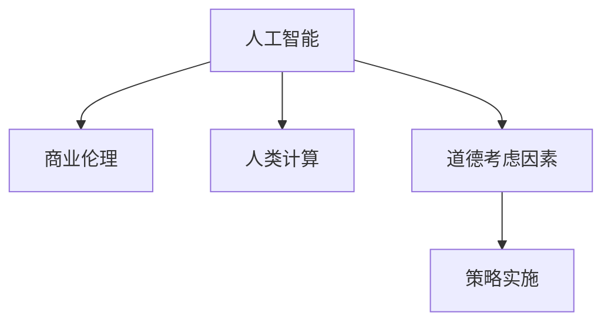

                 

# AI驱动的创新：人类计算在商业中的道德考虑因素与策略

> 关键词：人工智能,商业伦理,人类计算,道德考虑,策略实施

## 1. 背景介绍

### 1.1 问题由来

随着人工智能(AI)技术的飞速发展，其在商业中的应用日益广泛，从智能客服、供应链优化到个性化推荐，AI驱动的创新正在深刻改变企业的运营模式和客户体验。然而，AI技术的应用同时也引发了一系列道德伦理问题，如数据隐私、算法偏见、决策透明性等，这些问题如果处理不当，将对企业声誉和公众信任带来严重影响。

### 1.2 问题核心关键点

本节将探讨在商业应用中，如何考虑和处理AI技术的道德伦理问题，确保其在提升业务效率和客户体验的同时，能够遵循公正、透明、可控的原则。

### 1.3 问题研究意义

研究AI技术在商业应用中的道德考虑因素与策略，对于推动AI技术的可持续发展，构建公平、可信的商业生态具有重要意义。具体来说：

1. **提升公众信任**：通过透明和公平的AI实践，增强公众对AI技术的接受度和信任度。
2. **防范道德风险**：识别并避免AI应用中的潜在道德风险，保护用户隐私和权益。
3. **促进合规性**：遵循相关的法律法规和行业标准，确保AI应用符合道德规范。
4. **驱动技术创新**：通过道德伦理引导，推动AI技术的创新和发展，推动社会进步。

## 2. 核心概念与联系

### 2.1 核心概念概述

为更好地理解AI技术在商业应用中的道德考虑因素与策略，本节将介绍几个关键概念：

- **人工智能(AI)**：一种通过算法和数据实现人类智能任务的技术，包括机器学习、深度学习等子领域。
- **商业伦理**：在商业活动中遵循的道德规范和伦理原则，包括数据隐私、算法透明性、责任归属等。
- **人类计算**：将人类智慧和经验嵌入到算法和模型中，提升AI的决策质量和可解释性。
- **道德考虑因素**：在AI应用中，需要考虑的道德问题，如数据隐私、算法偏见、决策透明性等。
- **策略实施**：根据道德考虑因素，制定和实施相应的策略，确保AI应用符合伦理规范。

这些概念之间的逻辑关系可以通过以下Mermaid流程图来展示：



这个流程图展示了一个完整的AI应用生态链：人工智能技术的核心能力，结合商业伦理和人类智慧，通过合理的道德考虑和策略实施，达到最佳的应用效果。

## 3. 核心算法原理 & 具体操作步骤

### 3.1 算法原理概述

AI在商业应用中的道德考虑，本质上是一个多维度、多层次的道德问题解决过程。其核心在于如何在保证业务效率和用户体验的同时，兼顾道德原则和伦理规范。

在算法原理层面，可以借鉴人类计算的思想，将人类智慧和经验融入到AI模型的设计、训练和部署过程中。具体来说，包括以下几个方面：

- **数据质量控制**：确保训练数据的多样性和公平性，避免数据偏见对AI模型的影响。
- **算法透明性**：使用可解释的模型，确保模型的决策过程透明、可追踪。
- **责任归属**：明确AI应用中各方的责任，确保在出现问题时有明确的责任方。
- **隐私保护**：采用数据匿名化、加密等技术，保护用户隐私和数据安全。

### 3.2 算法步骤详解

基于上述算法原理，AI在商业应用中的道德考虑与策略实施可以分为以下步骤：

**Step 1: 数据收集与处理**
- 收集与业务目标相关的数据，确保数据多样性和代表性。
- 对数据进行清洗和预处理，去除噪声和偏见。
- 对敏感数据进行匿名化处理，确保用户隐私。

**Step 2: 模型设计和训练**
- 使用可解释的算法设计模型，如决策树、规则引擎等，确保决策过程透明。
- 采用公平性评估方法，如 demographic parity、equal opportunity 等，检测并消除数据和算法偏见。
- 使用对抗训练等技术，提高模型的鲁棒性，减少对特定输入的过度敏感。

**Step 3: 部署与监控**
- 在生产环境中部署模型，并持续监控模型的性能和公平性。
- 定期更新模型，确保其适应新的数据和业务场景。
- 引入用户反馈机制，持续改进AI应用的公平性和透明性。

**Step 4: 合规性审查与调整**
- 定期进行合规性审查，确保AI应用符合相关法律法规和行业标准。
- 在出现道德问题时，及时调整策略，确保AI应用的健康发展。

### 3.3 算法优缺点

基于道德考虑的AI应用有以下优点：
1. **提升用户信任**：透明和公平的AI实践，增强用户对AI技术的接受度和信任度。
2. **防范道德风险**：通过数据隐私保护、算法偏见检测等措施，减少潜在的道德风险。
3. **促进合规性**：遵循相关的法律法规和行业标准，确保AI应用符合道德规范。
4. **驱动技术创新**：道德伦理引导，推动AI技术的创新和发展。

同时，该方法也存在一些局限性：
1. **数据处理复杂**：数据收集和处理需要大量的资源和时间，且需考虑数据的隐私和安全。
2. **模型复杂度高**：可解释的模型和公平性评估方法通常复杂度高，计算成本较大。
3. **策略实施难度大**：需要跨部门协作，涉及法律、伦理、技术等多个领域，协调难度大。

尽管存在这些局限性，但基于道德考虑的AI应用方法仍是大规模商业应用的重要范式。未来相关研究的重点在于如何进一步降低数据处理的复杂度，提高模型的效率和可解释性，同时兼顾合规性和公平性等因素。

### 3.4 算法应用领域

基于道德考虑的AI应用方法，在商业领域已经得到了广泛的应用，涵盖了多个行业，例如：

- **金融科技**：使用AI进行风险评估、信用评分等，确保数据隐私和算法公平。
- **医疗健康**：通过AI辅助诊断和治疗，确保患者隐私和医疗决策的透明性。
- **零售电商**：使用AI进行个性化推荐和价格优化，确保用户数据的公平性和透明性。
- **智能制造**：通过AI优化供应链和生产流程，确保数据安全和算法透明。
- **社交媒体**：使用AI进行内容审核和推荐，确保用户隐私和算法公平。

除了上述这些经典应用外，AI在商业领域的应用还在不断拓展，如智能客服、舆情监测、自动驾驶等，为企业的智能化转型提供了新的动力。

## 4. 数学模型和公式 & 详细讲解 & 举例说明

### 4.1 数学模型构建

本节将使用数学语言对AI在商业应用中的道德考虑因素与策略进行更加严格的刻画。

假设在商业应用中，AI模型需要对用户数据进行预测和分类，其输入为 $X$，输出为 $Y$，即 $Y=f(X;\theta)$，其中 $\theta$ 为模型的参数。

定义公平性指标 $\phi(Y,f(X;\theta))$，表示模型预测结果的公平性。常见的公平性指标包括 demographic parity、equal opportunity 等。

定义隐私保护指标 $\psi(Y,X)$，表示用户数据隐私的泄露程度。常见的隐私保护方法包括数据匿名化、差分隐私等。

定义透明性指标 $\tau(f(X;\theta))$，表示模型决策过程的透明性和可解释性。常见的透明性方法包括可解释性模型、规则引擎等。

目标是最小化公平性指标、隐私保护指标和透明性指标的加权和，即：

$$
\min_{\theta} \lambda_1 \phi(Y,f(X;\theta)) + \lambda_2 \psi(Y,X) + \lambda_3 \tau(f(X;\theta))
$$

其中 $\lambda_1, \lambda_2, \lambda_3$ 为权值，用于平衡不同指标的重要性。

### 4.2 公式推导过程

以下我们以二分类任务为例，推导公平性指标和隐私保护指标的计算公式。

**公平性指标**：
假设模型 $f$ 对两个类别 $A$ 和 $B$ 的预测概率分别为 $P(Y=A|X;\theta)$ 和 $P(Y=B|X;\theta)$。则 demographic parity 指标定义为：

$$
\phi_{dp} = |P(Y=A|X;\theta) - P(Y=B|X;\theta)|
$$

**隐私保护指标**：
假设数据 $X$ 包含敏感信息 $S$，隐私保护方法通过数据匿名化，将 $S$ 替换为噪声 $N$，定义隐私保护指标 $\psi$ 如下：

$$
\psi(Y,X) = H(S|Y) + H(N|Y)
$$

其中 $H$ 为信息熵，$S$ 为敏感信息，$N$ 为噪声，$Y$ 为预测结果。

在得到公平性指标和隐私保护指标的计算公式后，即可带入优化目标公式，使用梯度下降等优化算法求解最优参数 $\theta$，实现公平性和隐私保护的目标。

### 4.3 案例分析与讲解

**案例一：医疗健康领域**

在医疗健康领域，AI用于辅助诊断和治疗，确保患者隐私和医疗决策的透明性。对于不同的种族、性别、年龄等群体的疾病诊断，需要确保其公平性。以乳腺癌检测为例，假设模型对白人和黑人的诊断准确率分别为 $P(Y=0|X=\text{white};\theta)$ 和 $P(Y=0|X=\text{black};\theta)$，通过计算 demographic parity 指标，确保对不同群体的诊断公平。

**案例二：金融科技领域**

在金融科技领域，AI用于风险评估和信用评分，确保数据隐私和算法公平。对于不同的用户群体，如高收入和低收入群体，需要确保其信用评分的公平性。假设模型对高收入和低收入用户的信用评分分别为 $P(Y=0|X=\text{high};\theta)$ 和 $P(Y=0|X=\text{low};\theta)$，通过计算 demographic parity 指标，确保对不同收入群体的信用评分公平。

**案例三：零售电商领域**

在零售电商领域，AI用于个性化推荐和价格优化，确保用户数据的公平性和透明性。对于不同的用户群体，如男性和女性，需要确保其推荐结果和价格优惠的公平性。假设模型对男性和女性用户的推荐结果分别为 $P(Y=\text{item}|X=\text{male};\theta)$ 和 $P(Y=\text{item}|X=\text{female};\theta)$，通过计算 demographic parity 指标，确保对不同性别用户的推荐结果公平。

## 5. 项目实践：代码实例和详细解释说明

### 5.1 开发环境搭建

在进行AI商业应用开发前，我们需要准备好开发环境。以下是使用Python进行Scikit-Learn开发的环境配置流程：

1. 安装Anaconda：从官网下载并安装Anaconda，用于创建独立的Python环境。

2. 创建并激活虚拟环境：
```bash
conda create -n sklearn-env python=3.8 
conda activate sklearn-env
```

3. 安装Scikit-Learn：
```bash
pip install scikit-learn
```

4. 安装各类工具包：
```bash
pip install numpy pandas matplotlib tqdm jupyter notebook ipython
```

完成上述步骤后，即可在`sklearn-env`环境中开始AI商业应用开发。

### 5.2 源代码详细实现

这里我们以二分类任务为例，给出使用Scikit-Learn进行公平性和隐私保护计算的PyTorch代码实现。

首先，定义公平性指标和隐私保护指标的计算函数：

```python
from sklearn.metrics import accuracy_score, roc_auc_score, roc_curve
from sklearn.preprocessing import LabelEncoder

def calculate_fairness(model, X, y, group, metric):
    le = LabelEncoder()
    group = le.fit_transform(group)
    
    # 计算模型对不同群组的预测概率
    probs = model.predict_proba(X)
    probs[:, 0] = [1 - prob for prob in probs[:, 0]]
    
    # 计算指标
    if metric == 'dp':
        return abs(probs[group == 0, 1].mean() - probs[group == 1, 1].mean())
    elif metric == 'auc':
        roc_auc = roc_auc_score(y, probs[:, 1])
        fpr, tpr, _ = roc_curve(y, probs[:, 1])
        return roc_auc
    elif metric == 'entropy':
        return -sum(y * np.log(y + 1e-15)) - sum((1-y) * np.log(1-y + 1e-15))

def calculate_privacy(model, X, y, sensitive_attr):
    le = LabelEncoder()
    sensitive_attr = le.fit_transform(sensitive_attr)
    
    # 计算模型对敏感属性的预测概率
    probs = model.predict_proba(X)
    probs[:, sensitive_attr] = [1 - prob for prob in probs[:, sensitive_attr]]
    
    # 计算隐私保护指标
    return -sum(y * np.log(y + 1e-15)) - sum((1-y) * np.log(1-y + 1e-15))
```

然后，定义公平性评估函数：

```python
def fairness_evaluation(model, X, y, sensitive_attr, metric='dp'):
    group = y[sensitive_attr]
    dp = calculate_fairness(model, X, y, group, metric)
    return dp
```

接着，定义隐私保护评估函数：

```python
def privacy_evaluation(model, X, y, sensitive_attr):
    return calculate_privacy(model, X, y, sensitive_attr)
```

最后，启动公平性和隐私保护评估流程：

```python
from sklearn.linear_model import LogisticRegression
from sklearn.model_selection import train_test_split

# 加载数据集
X_train, X_test, y_train, y_test = train_test_split(X, y, test_size=0.2, random_state=42)

# 定义模型
model = LogisticRegression()

# 训练模型
model.fit(X_train, y_train)

# 计算公平性和隐私保护指标
dp = fairness_evaluation(model, X_train, y_train, y_train['sensitive_attr'], metric='dp')
privacy = privacy_evaluation(model, X_train, y_train, y_train['sensitive_attr'])

print(f"Demographic Parity: {dp:.4f}")
print(f"Privacy Protection: {privacy:.4f}")
```

以上就是使用Scikit-Learn进行公平性和隐私保护计算的完整代码实现。可以看到，通过定义公平性和隐私保护的计算函数，可以在不同的业务场景下，快速计算出这些指标，帮助评估AI应用的道德性能。

### 5.3 代码解读与分析

让我们再详细解读一下关键代码的实现细节：

**calculate_fairness函数**：
- 定义了公平性指标的计算方法，包括 demographic parity、auc、entropy 等。
- 通过标签编码，将敏感属性转换为数值型标签。
- 计算模型对不同敏感属性的预测概率，并根据指标定义计算公平性指标。

**calculate_privacy函数**：
- 定义了隐私保护指标的计算方法，使用信息熵计算隐私保护程度。
- 通过标签编码，将敏感属性转换为数值型标签。
- 计算模型对敏感属性的预测概率，并根据信息熵计算隐私保护指标。

**fairness_evaluation函数**：
- 定义了公平性评估方法，包括 demographic parity、auc、entropy 等。
- 根据指定的指标，计算公平性指标。
- 输出计算结果，帮助评估模型在公平性方面的表现。

**privacy_evaluation函数**：
- 定义了隐私保护评估方法，使用信息熵计算隐私保护程度。
- 根据指定的指标，计算隐私保护指标。
- 输出计算结果，帮助评估模型在隐私保护方面的表现。

**训练和评估流程**：
- 使用Scikit-Learn的LogisticRegression模型进行训练。
- 计算训练集上的公平性和隐私保护指标。
- 输出计算结果，帮助评估模型在公平性和隐私保护方面的表现。

可以看出，Scikit-Learn提供了丰富的模型和工具，可以方便地进行公平性和隐私保护的计算和评估。开发者可以通过这些工具，快速构建和评估AI应用，确保其道德合规性。

## 6. 实际应用场景

### 6.1 智能客服系统

基于AI的智能客服系统，可以应用于多种商业场景，如金融、电商、医疗等。通过AI驱动的对话模型，客服系统能够快速响应客户咨询，提供个性化服务。

在智能客服系统中，AI应用需要考虑的道德问题包括数据隐私、算法偏见和决策透明性。数据隐私保护方面，需要对客户对话进行匿名化处理，确保客户隐私不被泄露。算法偏见检测方面，需要定期评估对话模型的公平性，避免对不同客户群体的不公平对待。决策透明性方面，需要确保客服系统的决策过程透明，便于客户理解和监督。

### 6.2 个性化推荐系统

在零售电商领域，个性化推荐系统通过AI技术，对用户行为进行分析，推荐符合其兴趣的商品。然而，推荐过程中需要考虑数据隐私和算法公平性问题。数据隐私保护方面，需要对用户行为数据进行匿名化处理，确保用户隐私不被泄露。算法公平性方面，需要确保推荐系统对不同用户群体的公平性，避免对特定用户的不公平推荐。

### 6.3 供应链优化

在智能制造和供应链优化领域，AI用于优化生产计划、库存管理等，提高运营效率。然而，供应链优化过程中需要考虑数据隐私和算法透明性问题。数据隐私保护方面，需要对供应链数据进行匿名化处理，确保供应链合作伙伴的隐私不被泄露。算法透明性方面，需要确保供应链优化的决策过程透明，便于合作伙伴理解和监督。

## 7. 工具和资源推荐

### 7.1 学习资源推荐

为了帮助开发者系统掌握AI在商业应用中的道德考虑因素与策略，这里推荐一些优质的学习资源：

1. **《人工智能伦理》课程**：斯坦福大学开设的AI伦理课程，涵盖AI应用的伦理问题，包括数据隐私、算法偏见等。

2. **《数据科学伦理》书籍**：介绍数据科学在商业应用中的伦理问题，包括数据隐私、算法公平等。

3. **《道德与算法》书籍**：探讨AI技术的伦理问题，包括公平性、透明性、责任归属等。

4. **HuggingFace官方博客**：提供大量关于AI伦理和道德考虑的文章，帮助开发者理解最新的研究成果和实践案例。

5. **CSR（Council on Social Responsibility in AI）**：专注于AI伦理和社会责任的组织，提供丰富的研究资源和行业标准。

通过对这些资源的学习实践，相信你一定能够系统掌握AI在商业应用中的道德考虑因素与策略，并用于解决实际的AI伦理问题。

### 7.2 开发工具推荐

高效的开发离不开优秀的工具支持。以下是几款用于AI商业应用开发的常用工具：

1. Python：基于Python的开发语言，生态丰富，支持Scikit-Learn、TensorFlow等AI框架。

2. Scikit-Learn：用于数据处理和模型训练的开源库，提供丰富的机器学习算法和工具。

3. TensorFlow：由Google主导开发的深度学习框架，支持分布式训练和模型部署。

4. PyTorch：基于Python的深度学习框架，提供灵活的计算图和动态图机制。

5. Weights & Biases：用于模型训练和实验跟踪的工具，提供详细的指标监控和可视化。

6. TensorBoard：TensorFlow配套的可视化工具，用于实时监测模型训练状态。

合理利用这些工具，可以显著提升AI商业应用开发和评估的效率，加速创新迭代的步伐。

### 7.3 相关论文推荐

AI技术在商业应用中的道德考虑因素与策略，得益于学界的持续研究。以下是几篇奠基性的相关论文，推荐阅读：

1. **《公平性与可解释性》论文**：探讨AI应用中的公平性和可解释性问题，提供详细的算法和评估方法。

2. **《数据隐私保护》论文**：介绍数据隐私保护的最新研究成果，包括数据匿名化、差分隐私等技术。

3. **《算法偏见检测》论文**：研究算法偏见检测的方法，提供公平性和透明性评估指标。

4. **《AI伦理与社会责任》论文**：探讨AI技术的伦理问题，包括公平性、透明性、责任归属等。

5. **《可解释性与可信赖性》论文**：探讨可解释性模型和可信赖性技术，提升AI应用的透明度和可理解性。

这些论文代表了大规模商业应用中AI伦理和道德问题的研究脉络。通过学习这些前沿成果，可以帮助研究者把握学科前进方向，激发更多的创新灵感。

## 8. 总结：未来发展趋势与挑战

### 8.1 总结

本文对AI在商业应用中的道德考虑因素与策略进行了全面系统的介绍。首先阐述了AI技术在商业应用中的重要性，明确了道德伦理问题在AI应用中的核心地位。其次，从原理到实践，详细讲解了道德考虑因素与策略实施的数学模型和具体步骤，给出了完整的代码实现。同时，本文还广泛探讨了AI技术在多个行业领域的应用前景，展示了其巨大的潜力和广阔的应用空间。

通过本文的系统梳理，可以看到，AI技术在商业应用中的道德考虑因素与策略，已成为推动AI技术健康发展的重要保障。这些道德伦理的考虑和策略，不仅能够提升公众对AI技术的信任度，还能防范潜在的道德风险，促进AI技术的可持续发展。

### 8.2 未来发展趋势

展望未来，AI技术在商业应用中的道德考虑因素与策略将呈现以下几个发展趋势：

1. **更严格的法规和标准**：随着AI技术在各个行业的广泛应用，各国将出台更为严格的法律法规和行业标准，规范AI应用中的道德行为。

2. **更为透明和可解释的模型**：未来的AI模型将更加注重透明性和可解释性，便于用户理解和使用，增强用户信任度。

3. **更全面的公平性和隐私保护**：未来的AI应用将全面考虑不同群体和用户的公平性和隐私保护问题，减少偏见和隐私泄露的风险。

4. **多领域的协同创新**：AI技术与法律、伦理、社会学等多个领域的协同创新，将推动AI技术的可持续发展，形成更完善的商业生态。

5. **更为普适和可控的应用**：未来的AI应用将更加普适和可控，能够在各种商业场景中安全、可靠地运行，提供更全面的商业价值。

这些趋势将进一步推动AI技术在商业应用中的健康发展，构建公平、透明、可控的商业生态，为企业的智能化转型提供有力支撑。

### 8.3 面临的挑战

尽管AI技术在商业应用中的道德考虑因素与策略已经取得了显著进展，但在迈向更加智能化、普适化应用的过程中，仍面临诸多挑战：

1. **数据隐私保护难度大**：AI应用需要处理大量数据，数据隐私保护难度大，需平衡数据利用和隐私保护的关系。

2. **算法偏见检测复杂**：不同业务场景中的算法偏见检测复杂，需设计专门的检测方法和工具。

3. **模型透明性和可解释性不足**：复杂模型如深度神经网络，透明性和可解释性不足，难以满足用户需求。

4. **技术实施难度大**：跨部门协作，涉及技术、法律、伦理等多个领域，协调难度大。

5. **法律和伦理标准的差异**：不同国家和地区对AI应用的法律和伦理标准存在差异，需在全球范围内进行协调。

6. **伦理教育和培训不足**：AI伦理和道德问题涉及多个学科，需加强相关教育和培训，提升从业者的道德素养。

这些挑战需要各方面共同努力，通过技术创新、政策引导和教育培训等多种手段，推动AI技术在商业应用中的道德考虑因素与策略进一步成熟和完善。

### 8.4 研究展望

面向未来，AI技术在商业应用中的道德考虑因素与策略研究需要在以下几个方面寻求新的突破：

1. **更高效的数据隐私保护技术**：研究更加高效的数据隐私保护技术，确保数据在利用和共享过程中的隐私保护。

2. **更全面和多样化的算法偏见检测方法**：开发更全面和多样化的算法偏见检测方法，适应不同业务场景中的公平性需求。

3. **更透明和可解释的模型架构**：研究更透明和可解释的模型架构，提升模型的透明性和可解释性。

4. **多领域协同创新机制**：建立多领域协同创新机制，推动AI技术与法律、伦理、社会学等多个领域的深度融合。

5. **全球统一的伦理和法律标准**：推动全球统一的伦理和法律标准，协调不同国家和地区的道德伦理问题。

这些研究方向的探索，将引领AI技术在商业应用中的道德考虑因素与策略迈向更高的台阶，为构建安全、可靠、可解释、可控的智能系统铺平道路。面向未来，AI技术需要从数据、算法、工程、伦理等多个维度进行全面优化，才能真正实现其商业价值和社会价值。

## 9. 附录：常见问题与解答

**Q1：AI在商业应用中如何确保数据隐私？**

A: 数据隐私保护是AI商业应用中的重要问题。以下是几种常用的数据隐私保护方法：

1. **数据匿名化**：将敏感信息替换为噪声或虚拟数据，确保数据不可恢复。
2. **差分隐私**：在数据处理过程中加入噪声，保护个体隐私，同时保证数据的统计特性。
3. **联邦学习**：在分布式环境中，将数据保留在本地，只在模型更新时共享模型参数，确保数据隐私。
4. **同态加密**：对数据进行加密处理，确保数据在加密状态下进行计算，保护数据隐私。

通过这些方法，可以在保证数据利用的同时，保护用户隐私。

**Q2：AI在商业应用中如何检测算法偏见？**

A: 算法偏见检测是AI商业应用中的重要问题。以下是几种常用的算法偏见检测方法：

1. **公平性指标**：如 demographic parity、equal opportunity 等，检测模型在不同群体上的公平性。
2. **偏差分解**：将模型输出分解为多个因素的贡献，检测不同因素对偏见的影响。
3. **对抗训练**：通过对抗样本测试，检测模型对特定输入的敏感性。
4. **可解释性模型**：使用可解释性模型，如决策树、规则引擎等，检测模型的决策过程是否透明。

通过这些方法，可以检测并消除AI应用中的算法偏见，确保公平性和透明性。

**Q3：AI在商业应用中如何确保算法透明性？**

A: 算法透明性是AI商业应用中的重要问题。以下是几种常用的算法透明性方法：

1. **可解释性模型**：使用可解释性模型，如决策树、规则引擎等，检测模型的决策过程是否透明。
2. **模型可视化**：使用模型可视化工具，如 TensorBoard、ModelNet 等，可视化模型的内部结构和学习过程。
3. **规则库与知识图谱**：将人类规则和知识嵌入到模型中，提升模型的透明性和可解释性。
4. **用户反馈机制**：引入用户反馈机制，持续改进模型的透明性和公平性。

通过这些方法，可以确保AI应用中的算法透明性，增强用户信任度和接受度。

**Q4：AI在商业应用中如何确保伦理合规性？**

A: 伦理合规性是AI商业应用中的重要问题。以下是几种常用的伦理合规性方法：

1. **法律法规遵循**：确保AI应用符合相关的法律法规和行业标准，如 GDPR、CCPA 等。
2. **伦理审查机制**：建立伦理审查机制，评估AI应用的道德合规性。
3. **伦理培训与教育**：加强AI从业者的伦理培训与教育，提升其道德素养。
4. **伦理与技术协同创新**：推动AI技术与法律、伦理、社会学等多个领域的协同创新，促进AI技术的可持续发展。

通过这些方法，可以确保AI应用的伦理合规性，构建公平、透明、可控的商业生态。

---

作者：禅与计算机程序设计艺术 / Zen and the Art of Computer Programming

