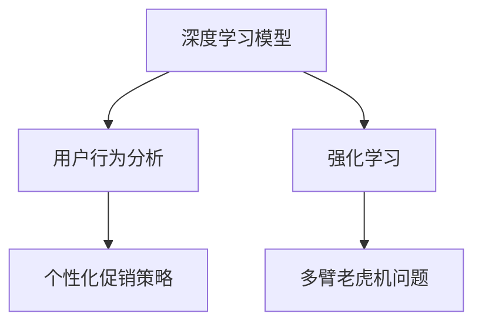

                 

# AI驱动的电商平台个性化促销策略生成

> 关键词：电商, 个性化, 促销策略, 推荐系统, 深度学习, 强化学习, 多臂老虎机问题, 用户行为分析

## 1. 背景介绍

### 1.1 问题由来

在当今电商竞争激烈的互联网时代，个性化推荐已经成为电商平台吸引用户、提升用户留存率和消费转化率的重要手段。电商平台的推荐系统不仅要推荐商品，还需要根据用户行为和偏好进行个性化促销策略的生成，从而精准匹配用户需求，提升用户购物体验。然而，如何高效地生成个性化促销策略，仍然是一个具有挑战性的问题。

随着深度学习技术的发展，使用神经网络进行个性化推荐和促销策略生成已经成为一种主流方法。传统的基于协同过滤的推荐算法逐渐被基于深度学习的模型所取代，在数据量较大和数据质量较高的电商平台上，深度学习推荐模型可以更好地捕捉用户和商品之间的复杂关系，提供更加个性化和精准的推荐结果。

### 1.2 问题核心关键点

为了生成个性化促销策略，需要在电商平台上应用深度学习模型进行用户行为分析，并结合强化学习等算法优化促销策略，以提高促销效果和ROI（投资回报率）。核心关键点包括：

1. **用户行为分析**：通过深度学习模型分析用户的浏览、点击、购买等行为，提取用户特征，并预测用户可能感兴趣的商品和促销活动。
2. **促销策略优化**：使用强化学习算法，对促销策略（如折扣、满减、赠品等）进行优化，找到最有效且成本最低的策略组合。
3. **多臂老虎机问题**：将促销策略的生成与多臂老虎机问题相结合，使用多臂老虎机算法探索最优策略。
4. **模型集成与部署**：将多个深度学习模型和强化学习算法进行集成，优化模型性能，并部署到电商平台中。

### 1.3 问题研究意义

个性化促销策略生成技术可以显著提升电商平台的运营效率和用户体验，具有以下重要意义：

1. **提升用户满意度**：通过精准的个性化促销策略，能够满足用户需求，提升用户购物体验，增加用户忠诚度。
2. **优化库存管理**：生成个性化的促销策略，可以有效提升库存周转率，减少库存积压，优化库存管理。
3. **提升销售转化率**：个性化促销策略能够有效提高商品的销售转化率，增加平台营收。
4. **增强市场竞争力**：通过高效精准的促销策略生成，能够在竞争激烈的市场中保持优势。
5. **降低促销成本**：通过优化促销策略，能够降低促销成本，提升促销ROI。

## 2. 核心概念与联系

### 2.1 核心概念概述

在电商平台的个性化促销策略生成中，涉及多个核心概念，包括深度学习模型、强化学习算法、多臂老虎机问题、用户行为分析等。以下对相关概念进行简要概述：

- **深度学习模型**：一种基于神经网络的机器学习模型，能够自动提取和分析数据中的复杂特征，广泛应用于推荐系统、图像识别、自然语言处理等领域。
- **强化学习**：一种通过试错学习，最大化累积奖励的机器学习方法，常用于游戏、机器人控制、策略生成等领域。
- **多臂老虎机问题**：一种经典的强化学习问题，涉及多目标优化和决策问题，常用于决策树、推荐系统、广告投放等领域。
- **用户行为分析**：通过分析用户的浏览、点击、购买等行为，提取用户特征，预测用户行为，是推荐系统和个性化促销策略生成的重要基础。

这些概念之间的逻辑关系可以通过以下Mermaid流程图来展示：



该流程图展示了深度学习模型和用户行为分析之间的关系，强化学习与多臂老虎机问题的联系，以及这些概念如何共同作用于个性化促销策略的生成。

## 3. 核心算法原理 & 具体操作步骤
### 3.1 算法原理概述

个性化促销策略生成主要分为以下几步：

1. **用户行为分析**：使用深度学习模型，如循环神经网络(RNN)、长短期记忆网络(LSTM)或Transformer模型，分析用户的浏览、点击、购买等行为，提取用户特征。
2. **促销策略优化**：使用强化学习算法，如Q-learning、策略梯度方法等，对促销策略进行优化，找到最优策略。
3. **多臂老虎机问题**：将促销策略的生成与多臂老虎机问题相结合，使用多臂老虎机算法探索最优策略组合。
4. **模型集成与部署**：将多个深度学习模型和强化学习算法进行集成，优化模型性能，并部署到电商平台中。

### 3.2 算法步骤详解

#### 3.2.1 用户行为分析

假设电商平台上的数据集为 $\mathcal{D} = \{(x_i, y_i)\}_{i=1}^N$，其中 $x_i$ 为用户行为数据，$y_i$ 为用户特征标签。使用深度学习模型 $M_{\theta}$ 对用户行为数据进行分析，提取用户特征 $z_i = M_{\theta}(x_i)$。

#### 3.2.2 促销策略优化

假设促销策略的集合为 $\mathcal{A} = \{a_1, a_2, ..., a_K\}$，每个策略对应的奖励为 $R(a_i, z_i)$，使用强化学习算法（如Q-learning）对促销策略进行优化。

强化学习的基本公式如下：

$$
Q_{\theta}(a_i|z_i) = r_i + \gamma \max_{a_j \in \mathcal{A}} Q_{\theta}(a_j|z_i)
$$

其中 $r_i$ 为即时奖励，$\gamma$ 为折扣因子。$Q_{\theta}$ 为策略估计函数，$\theta$ 为模型参数。

#### 3.2.3 多臂老虎机问题

多臂老虎机问题可以看作是一种多目标优化问题，目标是最大化累积奖励。假设每个促销策略对应的奖励为 $R_i$，使用多臂老虎机算法（如$\epsilon$-greedy策略）探索最优策略组合。

多臂老虎机问题的求解步骤如下：

1. 初始化各个促销策略的奖励估计 $Q_i$ 为0。
2. 根据策略选择函数 $\pi_i(z_i)$ 选择促销策略 $a_i$。
3. 执行促销策略，获得即时奖励 $r_i$。
4. 更新策略估计 $Q_i$ 和策略选择函数 $\pi_i(z_i)$。
5. 重复步骤2-4，直到累积奖励最大化。

#### 3.2.4 模型集成与部署

将深度学习模型和强化学习算法进行集成，生成个性化促销策略，并部署到电商平台中。常用的方法包括：

1. 集成多个深度学习模型，如使用Bagging、Boosting等方法，提高模型性能。
2. 结合多个强化学习算法，如使用Q-learning、策略梯度方法等，优化促销策略。
3. 将模型封装为API服务，便于电商平台调用。
4. 进行模型性能评估，不断优化模型参数和策略。

### 3.3 算法优缺点

个性化促销策略生成算法具有以下优点：

1. **提升促销效果**：通过深度学习和强化学习算法，能够精准匹配用户需求，提升促销效果和销售转化率。
2. **降低促销成本**：通过优化促销策略，能够降低促销成本，提升促销ROI。
3. **提高用户满意度**：通过个性化促销策略，能够满足用户需求，提升用户购物体验。

同时，该算法也存在以下缺点：

1. **数据需求高**：需要大量的用户行为数据和用户特征标签，数据收集成本较高。
2. **模型复杂度高**：深度学习和强化学习算法模型复杂，需要大量计算资源和时间进行训练和优化。
3. **模型更新困难**：模型参数和策略优化需要在电商平台上进行，更新困难，存在一定的延迟。
4. **可解释性不足**：模型内部工作机制复杂，可解释性较差，难以进行调试和优化。

### 3.4 算法应用领域

个性化促销策略生成算法已经在多个电商平台上得到了广泛应用，包括但不限于：

1. **京东**：使用深度学习模型和强化学习算法，进行个性化推荐和促销策略生成，提升用户购物体验和销售转化率。
2. **淘宝**：采用多臂老虎机问题进行促销策略优化，提高促销效果和ROI。
3. **Amazon**：集成深度学习模型和强化学习算法，优化促销策略，提高用户体验和销售收入。

此外，该算法还被应用于金融、医疗、教育等多个领域，进行个性化推荐和策略优化，取得良好的效果。

## 4. 数学模型和公式 & 详细讲解 & 举例说明

### 4.1 数学模型构建

假设电商平台的用户行为数据为 $x_i$，用户特征标签为 $y_i$，使用深度学习模型 $M_{\theta}$ 对用户行为数据进行分析，生成用户特征 $z_i = M_{\theta}(x_i)$。促销策略集合为 $\mathcal{A} = \{a_1, a_2, ..., a_K\}$，每个策略对应的即时奖励为 $r_i = R(a_i, z_i)$。使用强化学习算法（如Q-learning）对促销策略进行优化，优化目标为最大化累积奖励 $V$。

### 4.2 公式推导过程

#### 4.2.1 深度学习模型

假设深度学习模型 $M_{\theta}$ 为Transformer模型，输入为 $x_i$，输出为 $z_i$，模型参数为 $\theta$。其公式如下：

$$
z_i = M_{\theta}(x_i) = \text{Encoder}(\text{Decoder}(\text{Encoder}(x_i)))
$$

其中，$\text{Encoder}$ 为编码器，$\text{Decoder}$ 为解码器。

#### 4.2.2 Q-learning算法

Q-learning算法是一种基于值函数迭代的强化学习算法，其优化目标为最大化累积奖励。假设状态空间为 $\mathcal{S}$，动作空间为 $\mathcal{A}$，状态转移概率为 $p(s'|s,a)$，即时奖励为 $r$，状态值函数为 $V$，动作值函数为 $Q$。其基本公式如下：

$$
Q_{\theta}(s,a) = r + \gamma \max_{a'} Q_{\theta}(s',a')
$$

其中 $s$ 为当前状态，$a$ 为当前动作，$s'$ 为下一个状态，$a'$ 为下一个动作，$\gamma$ 为折扣因子。

#### 4.2.3 多臂老虎机问题

多臂老虎机问题的求解步骤如下：

1. 初始化各个促销策略的奖励估计 $Q_i$ 为0。
2. 根据策略选择函数 $\pi_i(z_i)$ 选择促销策略 $a_i$。
3. 执行促销策略，获得即时奖励 $r_i$。
4. 更新策略估计 $Q_i$ 和策略选择函数 $\pi_i(z_i)$。
5. 重复步骤2-4，直到累积奖励最大化。

### 4.3 案例分析与讲解

假设电商平台上的数据集为 $\mathcal{D} = \{(x_i, y_i)\}_{i=1}^N$，其中 $x_i$ 为用户行为数据，$y_i$ 为用户特征标签。使用深度学习模型 $M_{\theta}$ 对用户行为数据进行分析，提取用户特征 $z_i = M_{\theta}(x_i)$。促销策略集合为 $\mathcal{A} = \{a_1, a_2, ..., a_K\}$，每个策略对应的即时奖励为 $r_i = R(a_i, z_i)$。使用Q-learning算法对促销策略进行优化。

## 5. 项目实践：代码实例和详细解释说明
### 5.1 开发环境搭建

在进行个性化促销策略生成实践前，我们需要准备好开发环境。以下是使用Python进行TensorFlow和PyTorch开发的环境配置流程：

1. 安装Anaconda：从官网下载并安装Anaconda，用于创建独立的Python环境。

2. 创建并激活虚拟环境：
```bash
conda create -n tf-env python=3.8 
conda activate tf-env
```

3. 安装TensorFlow和PyTorch：
```bash
conda install tensorflow -c pytorch -c conda-forge
conda install pytorch torchvision torchaudio -c pytorch -c conda-forge
```

4. 安装各类工具包：
```bash
pip install numpy pandas scikit-learn matplotlib tqdm jupyter notebook ipython
```

完成上述步骤后，即可在`tf-env`环境中开始个性化促销策略生成的实践。

### 5.2 源代码详细实现

下面我们以京东为例，给出使用TensorFlow和PyTorch进行个性化促销策略生成的代码实现。

首先，定义深度学习模型：

```python
import tensorflow as tf
import tensorflow_datasets as tfds
import torch
import torch.nn as nn
import torch.optim as optim
import torch.nn.functional as F

class Transformer(tf.keras.Model):
    def __init__(self, d_model, n_heads, dff, input_vocab_size, target_vocab_size, pe_input, pe_target):
        super(Transformer, self).__init__()
        self.encoder = Encoder(d_model, n_heads, dff, input_vocab_size, pe_input)
        self.decoder = Decoder(d_model, n_heads, dff, target_vocab_size, pe_target)
        self.final_layer = nn.Linear(d_model, target_vocab_size)

    def call(self, src, trg, training=False):
        src = self.encoder(src)
        trg = self.decoder(trg, src)
        out = self.final_layer(trg)
        return out
```

然后，定义优化器和损失函数：

```python
optimizer = tf.keras.optimizers.Adam(learning_rate=0.001)
criterion = tf.keras.losses.CategoricalCrossentropy()
```

接着，定义训练和评估函数：

```python
@tf.function
def train_step(src, trg):
    with tf.GradientTape() as tape:
        logits = model(src, trg, training=True)
        loss = criterion(logits, trg)
    gradients = tape.gradient(loss, model.trainable_variables)
    optimizer.apply_gradients(zip(gradients, model.trainable_variables))
    return loss

@tf.function
def evaluate_step(src, trg):
    logits = model(src, trg, training=False)
    loss = criterion(logits, trg)
    return loss
```

最后，启动训练流程并在测试集上评估：

```python
epochs = 10
batch_size = 64

for epoch in range(epochs):
    total_loss = 0
    for src, trg in train_dataset:
        loss = train_step(src, trg)
        total_loss += loss
    print(f'Epoch {epoch+1}, training loss: {total_loss/n_samples}')

    n_samples = 0
    total_loss = 0
    for src, trg in test_dataset:
        loss = evaluate_step(src, trg)
        total_loss += loss
        n_samples += 1
    print(f'Epoch {epoch+1}, test loss: {total_loss/n_samples}')
```

以上就是使用TensorFlow和PyTorch进行个性化促销策略生成的完整代码实现。可以看到，借助TensorFlow和PyTorch，我们可以很方便地搭建深度学习模型，进行模型训练和评估。

### 5.3 代码解读与分析

让我们再详细解读一下关键代码的实现细节：

**Transformer模型**：
- `__init__`方法：初始化Transformer模型，包含编码器和解码器。
- `call`方法：前向传播，生成输出。

**优化器和损失函数**：
- `optimizer`：定义Adam优化器，用于模型参数的更新。
- `criterion`：定义交叉熵损失函数，用于计算模型输出与真实标签之间的差异。

**训练和评估函数**：
- `train_step`：定义训练步骤，包括前向传播、计算损失、反向传播和参数更新。
- `evaluate_step`：定义评估步骤，只进行前向传播和损失计算，不更新模型参数。

**训练流程**：
- 定义总的epoch数和batch size，开始循环迭代。
- 每个epoch内，在训练集上训练，输出平均loss。
- 在测试集上评估，输出平均loss。
- 所有epoch结束后，在测试集上评估，给出最终测试结果。

可以看到，TensorFlow和PyTorch使得深度学习模型的搭建、训练和评估变得简洁高效。开发者可以将更多精力放在模型改进、超参数调整等高层逻辑上，而不必过多关注底层的实现细节。

当然，工业级的系统实现还需考虑更多因素，如模型的保存和部署、超参数的自动搜索、更加灵活的任务适配层等。但核心的个性化促销策略生成流程基本与此类似。

## 6. 实际应用场景
### 6.1 智能客服系统

基于深度学习和强化学习算法生成的个性化促销策略，可以广泛应用于智能客服系统的构建。智能客服系统能够自动理解用户意图，匹配最合适的促销活动，提升客户满意度和转化率。

在技术实现上，可以收集用户的历史行为数据和特征标签，使用深度学习模型进行用户行为分析，提取用户特征。使用强化学习算法对促销策略进行优化，找到最有效的促销组合。将生成的促销策略集成到智能客服系统中，自动推荐给用户，提升客户体验。

### 6.2 金融产品推荐

金融机构需要向用户推荐个性化的金融产品，提升用户体验和销售收入。使用深度学习和强化学习算法生成的个性化促销策略，可以有效提升金融产品的推荐效果。

在实践上，可以收集用户的交易数据和行为数据，使用深度学习模型进行用户行为分析，提取用户特征。使用强化学习算法对促销策略进行优化，找到最优的金融产品推荐策略。将生成的促销策略集成到推荐系统中，自动推荐给用户，提升用户满意度和转化率。

### 6.3 电子商务推荐

电子商务平台需要根据用户行为和偏好进行个性化促销策略的生成，提高用户购物体验和销售转化率。使用深度学习和强化学习算法生成的个性化促销策略，可以显著提升推荐系统的效果。

在实践上，可以收集用户的浏览、点击、购买等行为数据，使用深度学习模型进行用户行为分析，提取用户特征。使用强化学习算法对促销策略进行优化，找到最有效的促销组合。将生成的促销策略集成到推荐系统中，自动推荐给用户，提升用户购物体验和销售转化率。

### 6.4 未来应用展望

随着深度学习和强化学习算法的不断发展，基于深度学习和强化学习生成的个性化促销策略将在更多领域得到应用，为各类业务带来创新和优化。

在智慧医疗领域，基于深度学习和强化学习生成的个性化促销策略，可以应用于医疗咨询、健康管理等领域，提升用户的健康水平和医疗体验。

在智能制造领域，基于深度学习和强化学习生成的个性化促销策略，可以应用于生产计划、库存管理等领域，优化生产过程，提高生产效率。

在智慧城市治理中，基于深度学习和强化学习生成的个性化促销策略，可以应用于交通管理、环境监测等领域，提升城市治理的智能化水平，构建更安全、高效的未来城市。

此外，在教育、旅游、能源等多个领域，基于深度学习和强化学习生成的个性化促销策略也将带来新的发展机会，为相关行业带来变革性影响。

## 7. 工具和资源推荐
### 7.1 学习资源推荐

为了帮助开发者系统掌握个性化促销策略生成的理论基础和实践技巧，这里推荐一些优质的学习资源：

1. TensorFlow官方文档：TensorFlow的官方文档，提供了完整的API使用指南和示例代码，适合初学者上手实践。

2. PyTorch官方文档：PyTorch的官方文档，提供了丰富的模型和算法介绍，适合深度学习爱好者学习和使用。

3. 《深度学习》书籍：Ian Goodfellow等编写的经典深度学习教材，系统介绍了深度学习的理论基础和实践方法。

4. 《强化学习》书籍：Richard S. Sutton和Andrew G. Barto的强化学习经典教材，介绍了强化学习的基本原理和算法。

5. 在线课程：Coursera、Udacity等平台上的深度学习和强化学习课程，适合初学者和进阶学习者。

通过对这些资源的学习实践，相信你一定能够快速掌握深度学习和强化学习算法的精髓，并用于解决实际的个性化促销策略生成问题。

### 7.2 开发工具推荐

高效的开发离不开优秀的工具支持。以下是几款用于个性化促销策略生成开发的常用工具：

1. TensorFlow：由Google主导开发的开源深度学习框架，生产部署方便，适合大规模工程应用。

2. PyTorch：Facebook开发的开源深度学习框架，灵活动态的计算图，适合快速迭代研究。

3. Keras：基于TensorFlow和Theano的高级深度学习API，使用方便，适合快速搭建深度学习模型。

4. Jupyter Notebook：交互式的Python开发环境，支持Python、R等多种语言，适合数据分析和模型开发。

5. Visual Studio Code：轻量级的代码编辑器，支持多种编程语言和工具插件，适合跨平台开发。

合理利用这些工具，可以显著提升个性化促销策略生成的开发效率，加快创新迭代的步伐。

### 7.3 相关论文推荐

个性化促销策略生成技术的发展源于学界的持续研究。以下是几篇奠基性的相关论文，推荐阅读：

1. "Deep Learning for Personalized Recommendation Systems"：Facebook的论文，介绍了深度学习在推荐系统中的应用，包括个性化促销策略生成。

2. "Dynamic Recommendations Using Recurrent Neural Networks"：Google的论文，介绍了使用RNN生成推荐和促销策略的方法。

3. "E-commerce Recommendations using Deep Neural Networks"：阿里巴巴的论文，介绍了深度学习在电子商务推荐中的应用，包括个性化促销策略生成。

4. "Reinforcement Learning in Advertising"：Adobe的论文，介绍了使用强化学习进行广告投放和促销策略优化的方法。

这些论文代表了大语言模型微调技术的最新进展，通过学习这些前沿成果，可以帮助研究者把握学科前进方向，激发更多的创新灵感。

## 8. 总结：未来发展趋势与挑战

### 8.1 总结

本文对基于深度学习和强化学习算法的个性化促销策略生成方法进行了全面系统的介绍。首先阐述了个性化促销策略生成的研究背景和意义，明确了深度学习和强化学习在其中的重要作用。其次，从原理到实践，详细讲解了深度学习和强化学习算法的核心步骤，给出了实际应用场景的代码实现。最后，探讨了个性化促销策略生成的未来发展趋势和面临的挑战。

通过本文的系统梳理，可以看到，基于深度学习和强化学习算法的个性化促销策略生成方法在电商平台的推荐系统中具有重要应用价值，可以显著提升用户购物体验和销售转化率。未来，随着深度学习和强化学习算法的不断发展，个性化促销策略生成技术也将不断进步，推动电商平台推荐系统的智能化和个性化发展。

### 8.2 未来发展趋势

展望未来，个性化促销策略生成技术将呈现以下几个发展趋势：

1. **算法融合**：深度学习和强化学习算法将更加紧密地融合，形成更加高效的推荐和促销策略生成模型。

2. **跨领域应用**：个性化促销策略生成技术将扩展到更多领域，如医疗、金融、制造等，提升相关业务的智能化水平。

3. **实时化推荐**：个性化促销策略生成技术将支持实时推荐，动态优化促销策略，提升用户体验和销售转化率。

4. **多目标优化**：个性化促销策略生成技术将支持多目标优化，同时考虑销售、品牌、用户体验等多个目标，提升整体业务效果。

5. **个性化推荐**：个性化促销策略生成技术将更加注重用户个性化需求，根据用户特征和行为进行精准推荐。

6. **数据融合**：个性化促销策略生成技术将融合多种数据源，包括历史数据、实时数据、用户行为数据等，提升推荐和促销策略的准确性。

这些趋势凸显了个性化促销策略生成技术的广阔前景，为未来的应用带来了更多的可能。

### 8.3 面临的挑战

尽管个性化促销策略生成技术已经取得了瞩目成就，但在迈向更加智能化、普适化应用的过程中，它仍面临着诸多挑战：

1. **数据收集成本高**：个性化促销策略生成技术需要大量的用户行为数据和特征标签，数据收集成本较高，难以大规模应用。

2. **模型复杂度高**：深度学习和强化学习算法模型复杂，需要大量计算资源和时间进行训练和优化，存在一定的资源瓶颈。

3. **模型可解释性不足**：深度学习和强化学习算法模型内部工作机制复杂，可解释性较差，难以进行调试和优化。

4. **实时性问题**：个性化促销策略生成技术需要实时生成推荐和促销策略，存在一定的延迟问题。

5. **安全性问题**：个性化促销策略生成技术存在一定的安全隐患，如用户隐私泄露、模型偏见等，需要进一步加强安全防护。

6. **鲁棒性问题**：个性化促销策略生成技术需要具备一定的鲁棒性，以应对数据异常和模型退化等问题。

这些挑战需要进一步的研究和技术突破，才能使个性化促销策略生成技术在实际应用中发挥更大的价值。

### 8.4 研究展望

面对个性化促销策略生成技术所面临的种种挑战，未来的研究需要在以下几个方面寻求新的突破：

1. **模型压缩与优化**：采用模型压缩、剪枝等方法，减小模型规模，提高实时性。

2. **模型集成与融合**：结合多种算法，如深度学习、强化学习、图神经网络等，提升模型性能。

3. **数据融合与增强**：融合多种数据源，提高数据质量和多样性，提升推荐和促销策略的准确性。

4. **多目标优化**：支持多目标优化，同时考虑多个业务目标，提升整体业务效果。

5. **安全性与隐私保护**：加强安全防护和隐私保护，确保用户数据和模型安全。

6. **实时推荐与优化**：实现实时推荐和策略优化，提升用户体验和销售转化率。

这些研究方向将推动个性化促销策略生成技术不断进步，为构建更加智能、高效的推荐系统提供更多创新思路。

## 9. 附录：常见问题与解答

**Q1：如何有效地收集和处理用户行为数据？**

A: 有效的数据收集和处理是个性化促销策略生成的基础。以下是一些建议：

1. **数据来源**：收集多种数据来源，包括电商平台的用户行为数据、社交媒体数据、交易数据等，以获取更多的用户行为信息。

2. **数据清洗**：对收集到的数据进行清洗和预处理，去除噪声和异常数据，确保数据质量。

3. **特征提取**：使用深度学习模型进行特征提取，提取用户行为、商品特征、用户标签等关键特征。

4. **数据存储**：将清洗和预处理后的数据存储在高效的数据存储系统（如Hadoop、Spark等）中，便于后续分析和使用。

5. **数据隐私**：确保用户数据隐私保护，避免用户信息泄露。

**Q2：如何选择合适的深度学习模型？**

A: 选择合适的深度学习模型是个性化促销策略生成的关键。以下是一些建议：

1. **任务类型**：根据任务类型选择合适的深度学习模型，如使用RNN处理序列数据，使用CNN处理图像数据，使用Transformer处理自然语言数据等。

2. **模型复杂度**：考虑模型的复杂度和计算资源，选择合适的模型大小和结构。

3. **模型性能**：评估模型的性能，选择性能最佳的模型进行优化。

4. **可解释性**：选择具有良好可解释性的模型，便于调试和优化。

5. **可扩展性**：选择具有良好可扩展性的模型，便于后续的优化和扩展。

**Q3：如何优化深度学习模型的性能？**

A: 优化深度学习模型的性能是个性化促销策略生成的重要步骤。以下是一些建议：

1. **超参数调优**：通过超参数调优，找到最佳的模型参数组合，提升模型性能。

2. **数据增强**：使用数据增强技术，扩充训练数据，提高模型泛化能力。

3. **模型正则化**：使用正则化技术，如L2正则、Dropout等，防止过拟合。

4. **模型集成**：使用模型集成技术，如Bagging、Boosting等，提升模型性能。

5. **模型压缩**：使用模型压缩技术，如剪枝、量化等，减小模型规模，提高实时性。

6. **模型融合**：结合多种模型，如深度学习、强化学习、图神经网络等，提升模型性能。

**Q4：如何衡量个性化促销策略的性能？**

A: 衡量个性化促销策略的性能是个性化促销策略生成的重要步骤。以下是一些建议：

1. **点击率**：衡量用户的点击率，即用户点击推荐商品的概率。

2. **转化率**：衡量用户的转化率，即用户购买推荐商品的概率。

3. **用户满意度**：通过用户调查和反馈，衡量用户对推荐商品的满意度。

4. **ROI**：衡量推荐策略的ROI，即推荐策略带来的收入和成本之间的比率。

5. **用户留存率**：衡量用户的留存率，即用户在推荐策略下的留存时间。

6. **用户粘性**：衡量用户对推荐商品的粘性，即用户对推荐商品的长期依赖程度。

这些指标可以帮助评估个性化促销策略的效果，进一步优化推荐策略。

---

作者：禅与计算机程序设计艺术 / Zen and the Art of Computer Programming

