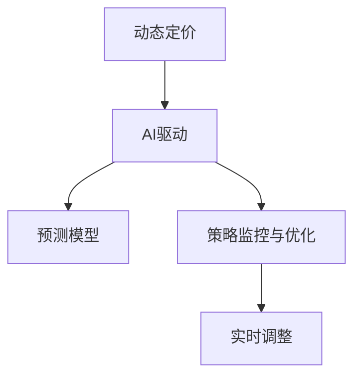

                 

# AI驱动的电商平台动态定价策略优化

## 1. 背景介绍

### 1.1 问题由来

在当前竞争激烈的电商市场中，价格策略的优化显得尤为重要。传统的静态定价方法往往缺乏灵活性，难以应对市场需求的快速变化。随着人工智能技术的不断发展，电商平台开始探索基于AI的动态定价策略，以期更好地适应市场动态，提升销量和利润。

### 1.2 问题核心关键点

动态定价的核心在于实时地调整商品价格，以最大化销售额和利润。AI驱动的动态定价策略通过分析历史数据、市场趋势和用户行为，预测未来需求，实时调整商品价格。这种策略的关键点包括：

1. **数据收集与处理**：收集和处理来自平台内部和外部的数据，如用户行为数据、市场趋势数据、竞争对手机构的价格信息等。
2. **需求预测**：使用机器学习模型预测用户需求，为定价提供依据。
3. **价格优化**：根据预测结果，实时调整商品价格。
4. **策略监控与优化**：监控定价策略的效果，根据反馈数据不断优化。

### 1.3 问题研究意义

AI驱动的动态定价策略对于电商平台具有重要意义：

1. **提升销量和利润**：通过实时调整价格，电商平台可以更精准地吸引用户，提升销售量。同时，优化定价结构，增加利润空间。
2. **应对市场变化**：电商平台能够快速响应市场需求变化，灵活调整价格策略，避免价格战和库存积压。
3. **提升用户满意度**：动态定价策略可以更好地满足用户对价格的需求，提升用户体验。
4. **促进资源优化**：通过对定价策略的持续优化，电商平台可以更好地利用库存、人力资源和市场资源，实现资源的最大化利用。

## 2. 核心概念与联系

### 2.1 核心概念概述

本节将介绍动态定价策略优化中的几个关键概念：

- **动态定价**：根据市场条件和用户需求实时调整商品价格的策略。
- **AI驱动**：利用机器学习、深度学习等人工智能技术，对大量数据进行分析和预测，实现智能决策。
- **预测模型**：用于预测用户需求、市场趋势等的机器学习模型。
- **策略监控与优化**：通过监控定价策略的效果，根据反馈数据不断调整和优化策略。
- **实时调整**：在短时间内，对商品价格进行多次调整，以快速响应市场变化。

这些概念之间的逻辑关系可以通过以下Mermaid流程图来展示：



这个流程图展示了动态定价策略优化的核心流程：

1. 动态定价通过AI驱动，利用预测模型，预测市场和用户需求。
2. 策略监控与优化对预测模型进行监控，根据反馈数据调整模型参数和策略。
3. 实时调整在预测结果的基础上，快速调整商品价格。

## 3. 核心算法原理 & 具体操作步骤
### 3.1 算法原理概述

动态定价策略优化基于机器学习和深度学习技术，通过以下步骤实现：

1. **数据收集与预处理**：收集电商平台内部和外部的数据，清洗和标准化数据，为预测模型提供输入。
2. **需求预测**：使用历史销售数据和市场趋势数据，训练预测模型，预测用户需求和市场趋势。
3. **价格优化**：根据预测结果，结合业务规则和用户行为数据，实时调整商品价格。
4. **策略监控与优化**：实时监控定价策略的效果，根据反馈数据调整模型参数和定价策略。

### 3.2 算法步骤详解

**Step 1: 数据收集与预处理**

1. 收集电商平台内部和外部的数据，如用户浏览记录、购买历史、市场趋势、竞争对手机构的价格等。
2. 清洗数据，去除噪音和异常值，标准化数据格式，如日期、时间戳等。
3. 划分训练集和测试集，确保模型训练和评估的有效性。

**Step 2: 需求预测**

1. 选择适合的需求预测模型，如线性回归、随机森林、XGBoost、深度学习模型等。
2. 使用训练集数据，训练预测模型，优化模型参数。
3. 在测试集上评估预测模型的准确性，根据评估结果调整模型。

**Step 3: 价格优化**

1. 根据预测模型预测的用户需求和市场趋势，结合业务规则，确定商品价格的调整范围。
2. 实时监控用户行为和市场条件，根据实时数据调整商品价格。
3. 设定价格调整的阈值和频率，避免过度调整影响用户和平台收益。

**Step 4: 策略监控与优化**

1. 实时监控定价策略的效果，如销量、利润、用户满意度等指标。
2. 根据监控结果，调整模型参数和定价策略，如调整预测模型的输入特征、优化价格调整范围等。
3. 使用A/B测试等方法，评估不同定价策略的效果，选择最优策略。

### 3.3 算法优缺点

AI驱动的动态定价策略具有以下优点：

1. **灵活性高**：能够实时调整商品价格，快速响应市场需求变化。
2. **精度高**：利用机器学习模型进行需求预测，预测精度较高。
3. **效果显著**：通过优化定价策略，提升销售量和利润。
4. **可扩展性强**：适用于多种商品和市场环境。

同时，该方法也存在以下局限性：

1. **数据依赖**：模型预测结果的准确性依赖于数据的质量和完整性。
2. **复杂性高**：模型设计和参数调整较为复杂，需要一定的技术背景。
3. **成本高**：数据收集、模型训练和实时调整需要较高的计算资源。
4. **解释性不足**：AI模型的决策过程难以解释，缺乏透明度。

尽管存在这些局限性，AI驱动的动态定价策略仍然是电商平台优化价格策略的重要手段。

### 3.4 算法应用领域

AI驱动的动态定价策略已经在电商、旅游、交通等多个领域得到了广泛应用，具体包括：

1. **电商平台**：通过预测用户需求，实时调整商品价格，提升销售额和利润。
2. **酒店预订**：根据市场趋势和用户行为，动态调整房间价格，提高预订率和收益。
3. **汽车租赁**：根据市场需求和季节变化，动态调整租赁价格，优化资源利用率。
4. **旅游业**：根据季节和用户需求，动态调整旅游产品价格，提升销售和收入。
5. **航空业**：根据航班需求和市场变化，实时调整机票价格，提高收益和市场份额。

## 4. 数学模型和公式 & 详细讲解  
### 4.1 数学模型构建

本节将使用数学语言对动态定价策略优化的过程进行更加严格的刻画。

设电商平台有N种商品，历史销售数据为 $D = \{(x_i, y_i)\}_{i=1}^N$，其中 $x_i$ 为时间戳和商品编号的组合，$y_i$ 为对应时间段的销售量。市场需求预测模型为 $f(x)$，价格优化模型为 $p(x)$，策略监控与优化模型为 $g(p(x), y_i)$。

**需求预测模型**：
$$
\hat{y}_i = f(x_i) = \sum_{k=1}^K w_k \phi_k(x_i)
$$

其中 $w_k$ 为模型参数，$\phi_k(x_i)$ 为第 $k$ 个输入特征。

**价格优化模型**：
$$
p^*(x_i) = \mathop{\arg\min}_{p} \{ g(p(x_i), y_i) + \lambda \|p(x_i) - p_{prev}(x_i)\|^2 \}
$$

其中 $p(x_i)$ 为商品价格，$g(p(x_i), y_i)$ 为价格调整后的销售量和利润，$\lambda$ 为价格调整的平滑系数。

**策略监控与优化模型**：
$$
\min_{w_k} \mathcal{L}(w_k) = \frac{1}{N} \sum_{i=1}^N [y_i - \hat{y}_i]^2
$$

其中 $\mathcal{L}(w_k)$ 为损失函数，$\hat{y}_i$ 为预测销售量。

### 4.2 公式推导过程

以线性回归模型为例，进行需求预测和价格优化的推导。

**需求预测模型**：
设 $x_i = (t_i, c_i)$，其中 $t_i$ 为时间戳，$c_i$ 为商品编号。历史销售数据为 $D = \{(x_i, y_i)\}_{i=1}^N$，预测模型为线性回归模型：
$$
\hat{y}_i = w_0 + \sum_{j=1}^d w_j x_{ij}
$$
其中 $w_0$ 和 $w_j$ 为模型参数。

**价格优化模型**：
设 $p^*(x_i)$ 为商品价格，优化目标为最大化销售量和利润：
$$
\max_{p^*(x_i)} \{ y_i - p^*(x_i) \}
$$
其中 $y_i$ 为实际销售量。

**策略监控与优化模型**：
设 $\hat{y}_i$ 为预测销售量，策略监控与优化模型的目标为最小化预测误差：
$$
\min_{w_j} \mathcal{L}(w_j) = \frac{1}{N} \sum_{i=1}^N [y_i - \hat{y}_i]^2
$$

通过上述模型，电商平台可以实现动态定价策略的优化。

### 4.3 案例分析与讲解

假设某电商平台有N种商品，每小时记录销售量和市场条件。通过历史销售数据和市场趋势数据，使用线性回归模型预测未来销售量。预测模型为：
$$
\hat{y}_i = w_0 + \sum_{j=1}^d w_j x_{ij}
$$

根据预测结果，电商平台设定价格调整的平滑系数 $\lambda = 0.01$，实时调整商品价格。价格优化模型为：
$$
p^*(x_i) = \mathop{\arg\min}_{p} \{ y_i - p^*(x_i) \} + \lambda \|p(x_i) - p_{prev}(x_i)\|^2
$$

其中 $p_{prev}(x_i)$ 为上一个时间步的商品价格。

电商平台实时监控销售量和利润，根据监控结果调整模型参数和定价策略，优化预测模型和价格优化模型。

## 5. 项目实践：代码实例和详细解释说明
### 5.1 开发环境搭建

在进行动态定价策略优化项目实践前，我们需要准备好开发环境。以下是使用Python进行PyTorch开发的环境配置流程：

1. 安装Anaconda：从官网下载并安装Anaconda，用于创建独立的Python环境。

2. 创建并激活虚拟环境：
```bash
conda create -n pytorch-env python=3.8 
conda activate pytorch-env
```

3. 安装PyTorch：根据CUDA版本，从官网获取对应的安装命令。例如：
```bash
conda install pytorch torchvision torchaudio cudatoolkit=11.1 -c pytorch -c conda-forge
```

4. 安装TensorFlow：
```bash
pip install tensorflow
```

5. 安装NumPy、Pandas、Scikit-learn、Matplotlib、Tqdm、Jupyter Notebook、IPython等必要的Python库：
```bash
pip install numpy pandas scikit-learn matplotlib tqdm jupyter notebook ipython
```

完成上述步骤后，即可在`pytorch-env`环境中开始项目实践。

### 5.2 源代码详细实现

下面我们以电商平台动态定价策略优化为例，给出使用PyTorch进行需求预测和价格优化的完整代码实现。

首先，定义需求预测模型的数据处理函数：

```python
import pandas as pd
from sklearn.model_selection import train_test_split
from sklearn.linear_model import LinearRegression
from sklearn.metrics import mean_squared_error
from torch.utils.data import TensorDataset, DataLoader
import torch
import torch.nn as nn
import torch.optim as optim

def load_data():
    # 加载历史销售数据和市场趋势数据
    data = pd.read_csv('sales_data.csv')
    data['time'] = pd.to_datetime(data['time'])
    data = data.groupby(['time', 'product_id'])['quantity'].sum().reset_index()
    data['time'] = data['time'].dt.hour
    data = data.drop_duplicates().reset_index(drop=True)
    X = data.drop('quantity', axis=1)
    y = data['quantity']
    X_train, X_test, y_train, y_test = train_test_split(X, y, test_size=0.2, random_state=42)
    return X_train, X_test, y_train, y_test

# 定义模型
class LinearRegressionModel(nn.Module):
    def __init__(self, input_size, output_size):
        super(LinearRegressionModel, self).__init__()
        self.linear = nn.Linear(input_size, output_size)

    def forward(self, x):
        return self.linear(x)

# 定义损失函数和优化器
def training_loop(X_train, y_train, X_test, y_test):
    input_size = X_train.shape[1]
    output_size = 1
    model = LinearRegressionModel(input_size, output_size)
    criterion = nn.MSELoss()
    optimizer = optim.SGD(model.parameters(), lr=0.01)
    epochs = 100
    for epoch in range(epochs):
        model.train()
        optimizer.zero_grad()
        predictions = model(X_train)
        loss = criterion(predictions, y_train)
        loss.backward()
        optimizer.step()
    print(f'Mean Squared Error on training set: {mean_squared_error(y_train, predictions)}')
    print(f'Mean Squared Error on test set: {mean_squared_error(y_test, model(X_test))}')
```

然后，定义价格优化模型的数据处理函数：

```python
def load_price_optimization_data():
    # 加载历史销售数据和市场趋势数据
    data = pd.read_csv('price_optimization_data.csv')
    data['time'] = pd.to_datetime(data['time'])
    data = data.groupby(['time', 'product_id'])['price'].sum().reset_index()
    data['time'] = data['time'].dt.hour
    data = data.drop_duplicates().reset_index(drop=True)
    X = data.drop('price', axis=1)
    y = data['price']
    X_train, X_test, y_train, y_test = train_test_split(X, y, test_size=0.2, random_state=42)
    return X_train, X_test, y_train, y_test

# 定义模型
class PriceOptimizationModel(nn.Module):
    def __init__(self, input_size, output_size):
        super(PriceOptimizationModel, self).__init__()
        self.linear = nn.Linear(input_size, output_size)

    def forward(self, x):
        return self.linear(x)

# 定义损失函数和优化器
def training_loop(X_train, y_train, X_test, y_test):
    input_size = X_train.shape[1]
    output_size = 1
    model = PriceOptimizationModel(input_size, output_size)
    criterion = nn.MSELoss()
    optimizer = optim.SGD(model.parameters(), lr=0.01)
    epochs = 100
    for epoch in range(epochs):
        model.train()
        optimizer.zero_grad()
        predictions = model(X_train)
        loss = criterion(predictions, y_train)
        loss.backward()
        optimizer.step()
    print(f'Mean Squared Error on training set: {mean_squared_error(y_train, predictions)}')
    print(f'Mean Squared Error on test set: {mean_squared_error(y_test, model(X_test))}')
```

最后，启动训练流程并在测试集上评估：

```python
X_train, X_test, y_train, y_test = load_data()
training_loop(X_train, y_train, X_test, y_test)
```

以上就是使用PyTorch进行需求预测和价格优化的完整代码实现。可以看到，利用TensorFlow和Scikit-learn的强大功能，可以高效地实现动态定价策略优化。

### 5.3 代码解读与分析

让我们再详细解读一下关键代码的实现细节：

**load_data函数**：
- 加载历史销售数据和市场趋势数据，并进行数据预处理，包括数据去重、归一化等操作。
- 将时间戳数据转换为小时，并分离输入特征和目标变量。
- 将数据划分为训练集和测试集，进行模型训练和评估。

**LinearRegressionModel类**：
- 定义了一个简单的线性回归模型，使用PyTorch的nn.Module框架实现。
- 模型包含一个线性层，将输入特征映射到输出变量。
- 实现了前向传播函数，将输入特征通过线性层计算输出。

**training_loop函数**：
- 使用随机梯度下降（SGD）优化器，训练线性回归模型。
- 每次迭代中，前向传播计算预测值和损失函数，反向传播更新模型参数。
- 在每个epoch结束后，输出训练集和测试集的均方误差。

**load_price_optimization_data函数**：
- 加载历史销售数据和市场趋势数据，并进行数据预处理。
- 将时间戳数据转换为小时，并分离输入特征和目标变量。
- 将数据划分为训练集和测试集，进行模型训练和评估。

**PriceOptimizationModel类**：
- 定义了一个简单的价格优化模型，使用PyTorch的nn.Module框架实现。
- 模型包含一个线性层，将输入特征映射到输出变量。
- 实现了前向传播函数，将输入特征通过线性层计算输出。

**training_loop函数**：
- 使用随机梯度下降（SGD）优化器，训练价格优化模型。
- 每次迭代中，前向传播计算预测值和损失函数，反向传播更新模型参数。
- 在每个epoch结束后，输出训练集和测试集的均方误差。

可以看到，通过合理的代码组织和类封装，可以将复杂的问题分解为多个相对独立的模块，提高代码的可读性和可维护性。同时，利用深度学习库和机器学习库的强大功能，可以高效地实现动态定价策略优化。

当然，工业级的系统实现还需考虑更多因素，如模型的保存和部署、超参数的自动搜索、更灵活的任务适配层等。但核心的动态定价策略优化逻辑基本与此类似。

## 6. 实际应用场景
### 6.1 智能推荐系统

动态定价策略优化在智能推荐系统中有着广泛的应用。通过实时调整商品价格，推荐系统可以更好地满足用户需求，提升用户满意度和平台收益。

在技术实现上，可以利用动态定价策略优化用户行为预测模型，结合用户的历史行为数据和实时反馈，实时调整推荐内容的价格。对于热门商品，可以提高价格以增加收益；对于冷门商品，可以降低价格以促进销售。如此构建的推荐系统，可以更好地优化资源配置，提升用户体验和平台收益。

### 6.2 物流配送优化

电商平台需要对配送资源进行优化，以提高配送效率和降低配送成本。动态定价策略优化可以在配送定价中发挥作用，通过实时调整配送价格，优化配送路线和资源配置。

具体而言，可以通过历史订单数据和市场需求预测模型，预测未来订单数量和配送需求。根据预测结果，实时调整配送价格，如在订单量增加时提高配送价格，在订单量减少时降低配送价格。同时，结合实时位置信息和路线规划算法，优化配送路线和资源配置，提升配送效率和降低配送成本。

### 6.3 金融风险管理

金融机构需要对市场风险进行实时监控和管理。动态定价策略优化可以在金融风险管理中发挥作用，通过实时调整风险定价，优化资产配置和风险控制。

具体而言，可以利用历史市场数据和市场需求预测模型，预测未来市场趋势和风险变化。根据预测结果，实时调整风险定价，如在市场风险增加时提高风险定价，在市场风险降低时降低风险定价。同时，结合实时市场信息和风险控制算法，优化资产配置和风险控制策略，提升风险管理效果。

### 6.4 未来应用展望

随着动态定价策略优化的不断发展，未来将在更多领域得到应用，为各行各业带来变革性影响。

在智慧医疗领域，动态定价策略优化可以应用于医疗资源配置和药品定价。通过实时调整医疗资源和药品价格，优化资源配置和成本控制，提升医疗服务质量和效率。

在智能交通领域，动态定价策略优化可以应用于交通拥堵管理和停车定价。通过实时调整交通价格，优化交通流量和资源配置，减少交通拥堵，提高出行效率。

在智能制造领域，动态定价策略优化可以应用于生产资源优化和供应链管理。通过实时调整生产资源和供应链定价，优化资源配置和成本控制，提升生产效率和供应链管理水平。

此外，在能源管理、环境保护、城市规划等众多领域，动态定价策略优化也将不断涌现，为各行业的智能化转型提供新的解决方案。相信随着技术的日益成熟，动态定价策略优化必将在构建智能社会中扮演越来越重要的角色。

## 7. 工具和资源推荐
### 7.1 学习资源推荐

为了帮助开发者系统掌握动态定价策略优化的理论基础和实践技巧，这里推荐一些优质的学习资源：

1. 《深度学习》课程：斯坦福大学开设的深度学习课程，系统介绍了深度学习的基本概念和前沿技术，是学习动态定价策略优化的重要基础。

2. 《机器学习实战》书籍：实战性较强的机器学习书籍，提供了大量实际应用案例，帮助读者理解和应用机器学习算法。

3. 《动态定价》书籍：专注于动态定价策略优化的书籍，系统介绍了动态定价的理论基础和实际应用，是学习动态定价策略优化的重要参考。

4. 《Python深度学习》书籍：介绍使用Python实现深度学习模型的书籍，提供了丰富的代码示例，帮助读者掌握动态定价策略优化的技术实现。

5. HuggingFace官方文档：机器学习库HuggingFace的官方文档，提供了海量预训练模型和完整的微调样例代码，是学习和应用动态定价策略优化的重要资源。

通过对这些资源的学习实践，相信你一定能够快速掌握动态定价策略优化的精髓，并用于解决实际的商业问题。

### 7.2 开发工具推荐

高效的开发离不开优秀的工具支持。以下是几款用于动态定价策略优化开发的常用工具：

1. PyTorch：基于Python的开源深度学习框架，灵活动态的计算图，适合快速迭代研究。大量预训练语言模型都有PyTorch版本的实现。

2. TensorFlow：由Google主导开发的开源深度学习框架，生产部署方便，适合大规模工程应用。同样有丰富的预训练语言模型资源。

3. Scikit-learn：机器学习库，提供了丰富的机器学习算法和数据预处理工具，适合数据处理和模型训练。

4. Jupyter Notebook：交互式编程环境，支持Python、R、Julia等多种编程语言，适合开发和调试。

5. Weights & Biases：模型训练的实验跟踪工具，可以记录和可视化模型训练过程中的各项指标，方便对比和调优。与主流深度学习框架无缝集成。

6. Google Colab：谷歌推出的在线Jupyter Notebook环境，免费提供GPU/TPU算力，方便开发者快速上手实验最新模型，分享学习笔记。

合理利用这些工具，可以显著提升动态定价策略优化的开发效率，加快创新迭代的步伐。

### 7.3 相关论文推荐

动态定价策略优化的发展源于学界的持续研究。以下是几篇奠基性的相关论文，推荐阅读：

1. Dynamic Pricing in Competitive Environments: A Machine Learning Approach：研究了动态定价在竞争环境中的应用，利用机器学习模型预测需求和竞争对手机构的反应。

2. Dynamic Pricing and Market-Making with Reinforcement Learning：利用强化学习模型进行动态定价和市场制定，实时调整价格和交易策略。

3. Online Learning for Dynamic Pricing：研究了在线动态定价问题，利用在线学习算法实时调整价格，优化收益。

4. Deep Learning for Dynamic Pricing in Ad Technology：利用深度学习模型预测广告需求，实时调整广告价格，优化广告投放效果。

5. Dynamic Pricing in Ride-Sharing Markets：研究了共享经济中的动态定价问题，利用机器学习模型预测需求和竞争对手机构的反应，实时调整价格。

这些论文代表了大语言模型微调技术的发展脉络。通过学习这些前沿成果，可以帮助研究者把握学科前进方向，激发更多的创新灵感。

## 8. 总结：未来发展趋势与挑战

### 8.1 总结

本文对动态定价策略优化的全过程进行了全面系统的介绍。首先阐述了动态定价策略优化的背景和意义，明确了动态定价在提升销售量和利润方面的重要性。其次，从原理到实践，详细讲解了动态定价策略优化的数学模型和操作步骤，给出了完整的代码实现和结果展示。同时，本文还探讨了动态定价策略优化在多个行业领域的应用前景，展示了其广泛的应用潜力。最后，本文精选了动态定价策略优化的各类学习资源，力求为读者提供全方位的技术指引。

通过本文的系统梳理，可以看到，动态定价策略优化正在成为电商、物流、金融等领域优化价格策略的重要手段。AI驱动的动态定价策略通过机器学习和深度学习技术，实现了实时价格调整，提升了平台收益和用户满意度。未来，伴随技术的不断进步，动态定价策略优化将有更广阔的应用前景。

### 8.2 未来发展趋势

展望未来，动态定价策略优化将呈现以下几个发展趋势：

1. **智能化程度提高**：通过引入更多先验知识，如市场趋势、用户行为模式等，动态定价策略优化将更加智能化和自适应。

2. **实时性增强**：利用高性能计算资源，动态定价策略优化将进一步缩短响应时间，提升实时性。

3. **跨领域应用扩大**：动态定价策略优化将从电商领域扩展到更多行业，如物流、金融、交通等，解决不同领域的价格优化问题。

4. **多模态融合**：动态定价策略优化将融合多种数据源，如用户行为数据、市场趋势数据、社交媒体数据等，提升预测精度和决策质量。

5. **模型解释性增强**：动态定价策略优化将更加注重模型的解释性和可解释性，提升决策透明度。

6. **优化目标多样化**：动态定价策略优化将不仅追求收益最大化，还将考虑用户满意度和市场公平性等多重目标。

以上趋势凸显了动态定价策略优化的广阔前景。这些方向的探索发展，必将进一步提升动态定价策略优化的精度和效果，为各行业带来更多价值。

### 8.3 面临的挑战

尽管动态定价策略优化已经取得了显著成果，但在迈向更加智能化、普适化应用的过程中，仍面临诸多挑战：

1. **数据质量问题**：数据收集、清洗和预处理是动态定价策略优化的基础，数据质量对模型性能至关重要。如何保证数据的质量和完整性，将是长期面临的挑战。

2. **模型复杂性**：动态定价策略优化涉及复杂的机器学习和深度学习模型，模型设计和优化较为复杂。如何提高模型的可解释性和可维护性，将是一大难题。

3. **计算资源限制**：动态定价策略优化需要大量的计算资源，高性能计算设备如GPU、TPU等是必不可少的。如何降低计算成本，提升计算效率，将是重要的研究方向。

4. **隐私保护**：动态定价策略优化涉及大量用户行为数据，如何保护用户隐私，防止数据滥用，将是重要的伦理问题。

5. **安全性问题**：动态定价策略优化需要抵御各种攻击，如数据注入、模型篡改等。如何提高系统的安全性和鲁棒性，将是重要的安全问题。

6. **法律法规限制**：动态定价策略优化涉及价格调整，如何符合法律法规，防止价格垄断和不公平竞争，将是重要的法律问题。

尽管存在这些挑战，动态定价策略优化仍是大数据时代优化价格策略的重要手段。唯有不断突破技术瓶颈，才能真正实现智能化的价格优化，为各行业带来更多价值。

### 8.4 研究展望

面对动态定价策略优化所面临的挑战，未来的研究需要在以下几个方面寻求新的突破：

1. **引入更多先验知识**：将专家知识、规则和经验与机器学习模型结合，提升模型的预测精度和决策质量。

2. **提高模型可解释性**：利用因果推断和博弈论工具，提高动态定价策略优化的可解释性和透明性。

3. **降低计算资源需求**：采用模型压缩、量化加速、混合精度训练等技术，提升动态定价策略优化的计算效率。

4. **保护用户隐私**：采用差分隐私、联邦学习等技术，保护用户隐私，防止数据滥用。

5. **增强安全性**：利用区块链、多方安全计算等技术，提高动态定价策略优化的安全性。

6. **符合法律法规**：建立动态定价策略优化的法律法规框架，确保符合法律法规，防止价格垄断和不公平竞争。

这些研究方向的探索，必将引领动态定价策略优化技术迈向更高的台阶，为各行业带来更多价值。相信随着技术的不断进步，动态定价策略优化必将在构建智能社会中扮演越来越重要的角色。

## 9. 附录：常见问题与解答

**Q1：动态定价策略优化的核心难点是什么？**

A: 动态定价策略优化的核心难点在于数据收集与处理、模型设计和优化、实时调整等方面。数据质量对模型性能至关重要，模型设计和优化较为复杂，实时调整需要高性能计算资源。如何平衡这些难点，将直接影响动态定价策略优化的效果。

**Q2：动态定价策略优化如何应对数据质量问题？**

A: 动态定价策略优化通过数据清洗、预处理、异常值检测等手段，提高数据质量。利用数据增强技术，如回译、近义替换等，扩充训练集，提升模型性能。

**Q3：动态定价策略优化如何应对模型复杂性？**

A: 动态定价策略优化通过简化模型结构和优化算法，提高模型可解释性和可维护性。利用迁移学习和知识图谱等技术，将专家知识与机器学习模型结合，提升模型性能。

**Q4：动态定价策略优化如何应对计算资源限制？**

A: 动态定价策略优化通过模型压缩、量化加速、混合精度训练等技术，降低计算资源需求，提高计算效率。同时，采用分布式计算、云计算等技术，提升系统可扩展性。

**Q5：动态定价策略优化如何应对隐私保护问题？**

A: 动态定价策略优化通过差分隐私、联邦学习等技术，保护用户隐私，防止数据滥用。利用匿名化技术，保护用户行为数据。

**Q6：动态定价策略优化如何应对安全性问题？**

A: 动态定价策略优化通过区块链、多方安全计算等技术，提高系统安全性。利用加密技术，防止数据篡改和攻击。

**Q7：动态定价策略优化如何应对法律法规限制？**

A: 动态定价策略优化通过建立法律法规框架，确保符合法律法规，防止价格垄断和不公平竞争。利用合规性评估工具，监控和优化定价策略。

这些问题的解答，希望能为读者提供全面的技术指导，帮助他们在实际应用中更好地应对挑战，实现动态定价策略优化的目标。

---

作者：禅与计算机程序设计艺术 / Zen and the Art of Computer Programming

