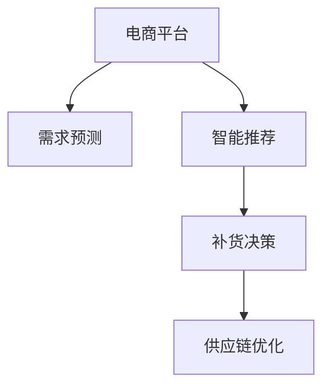
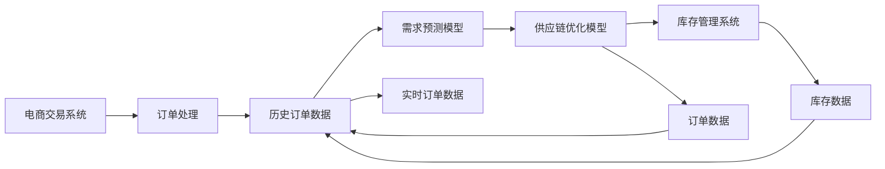

                 

# AI驱动的电商平台智能补货决策系统

> 关键词：电商,补货决策,智能推荐,供应链优化,需求预测,深度学习,模型融合

## 1. 背景介绍

在当今这个电商竞争激烈的时代，如何通过智能化的手段优化库存管理，提高订单满足率，减少库存积压和缺货情况，是所有电商平台亟需解决的问题。智能补货决策系统通过深度学习和大数据技术，可以从历史销售数据中挖掘出产品需求趋势，预测未来的需求量，并结合实时销售情况，自动调整补货策略，从而优化库存水平，提高运营效率，降低运营成本。

## 2. 核心概念与联系

### 2.1 核心概念概述

为了深入理解智能补货决策系统的核心原理，我们首先需要定义以下几个关键概念：

- **电商平台**：以在线交易为核心，提供商品展示、搜索、购物车、支付、物流追踪等全方位购物体验的数字化商业平台。
- **补货决策**：根据历史销售数据和实时销售情况，预测未来需求，并自动调整补货策略，实现库存优化。
- **智能推荐**：通过机器学习算法分析用户行为和偏好，提供个性化的商品推荐，提升用户满意度和转化率。
- **供应链优化**：对整个供应链进行系统性优化，包括生产、采购、库存、配送等环节，以提高效率和降低成本。
- **需求预测**：通过时间序列分析、回归分析等方法，预测未来某一时间段内产品的需求量。
- **深度学习**：基于神经网络等技术，模拟人脑的学习过程，处理复杂的数据模式和结构。

这些概念之间通过如下Mermaid流程图展示了它们的相互联系：



此图展示了电商平台通过需求预测和智能推荐来支撑补货决策，并最终通过供应链优化来优化库存管理和物流效率的总体流程。

### 2.2 核心概念原理和架构的 Mermaid 流程图



此图表示电商平台的订单处理、库存数据和历史订单数据通过需求预测模型和实时订单数据，最终进入供应链优化模型，驱动库存管理和物流决策的过程。

## 3. 核心算法原理 & 具体操作步骤

### 3.1 算法原理概述

智能补货决策系统的核心算法原理主要包括需求预测、智能推荐和补货决策三大部分。

- **需求预测**：利用时间序列分析、回归分析等机器学习算法，预测未来某一时间段内产品的需求量。
- **智能推荐**：通过协同过滤、内容推荐等算法，根据用户行为和偏好，提供个性化的商品推荐，提升用户满意度和转化率。
- **补货决策**：基于需求预测和智能推荐的结果，结合实时销售情况，动态调整补货策略，实现库存优化。

### 3.2 算法步骤详解

#### 3.2.1 需求预测模型

需求预测模型的构建主要包括以下步骤：

1. **数据收集**：收集电商平台的订单数据、库存数据、销售数据等，作为训练数据。
2. **数据预处理**：对数据进行清洗、归一化等预处理步骤，处理缺失值和异常值。
3. **特征工程**：选择对需求预测有影响的特征，如时间、促销活动、季节性等。
4. **模型选择**：选择合适的预测模型，如ARIMA、LSTM、GRU等。
5. **模型训练**：利用历史数据训练模型，调整超参数，确定最优模型。
6. **模型评估**：使用验证集和测试集评估模型性能，选择合适的评估指标如MAE、RMSE等。
7. **模型部署**：将训练好的模型部署到生产环境，实时接收订单数据进行预测。

#### 3.2.2 智能推荐模型

智能推荐模型的构建主要包括以下步骤：

1. **数据收集**：收集用户行为数据，如浏览记录、点击记录、购买记录等。
2. **用户画像**：构建用户画像，识别用户兴趣和偏好。
3. **商品画像**：构建商品画像，描述商品特征和属性。
4. **算法选择**：选择合适的推荐算法，如协同过滤、基于内容的推荐等。
5. **模型训练**：利用用户和商品数据训练推荐模型，调整超参数。
6. **模型评估**：使用点击率、转化率等指标评估推荐效果。
7. **模型部署**：将训练好的模型部署到推荐系统中，实时推荐商品。

#### 3.2.3 补货决策模型

补货决策模型的构建主要包括以下步骤：

1. **数据收集**：收集实时订单数据、库存数据、需求预测结果等。
2. **决策规则**：制定补货决策规则，如最小库存量、安全库存量、补货周期等。
3. **模型选择**：选择合适的决策模型，如线性规划、动态规划等。
4. **模型训练**：利用历史数据训练模型，调整超参数，确定最优模型。
5. **模型评估**：使用订单满足率、缺货率等指标评估决策效果。
6. **模型部署**：将训练好的模型部署到补货系统中，实时调整补货策略。

### 3.3 算法优缺点

智能补货决策系统的算法优点包括：

- **自动化程度高**：自动化处理订单数据、库存数据和需求预测结果，减少人工操作。
- **实时性强**：实时接收订单数据和库存数据，实时进行补货决策，提高库存管理效率。
- **精度高**：利用深度学习和机器学习算法，预测需求和推荐商品精度高。
- **扩展性强**：可以灵活调整模型参数和规则，适应不同产品和市场情况。

同时，该算法也存在以下缺点：

- **数据需求高**：需要大量高质量的订单数据、库存数据等，数据获取成本较高。
- **计算复杂度高**：模型训练和预测计算复杂度较高，对计算资源要求高。
- **模型依赖性强**：模型的性能依赖于数据质量、算法选择和超参数设置，需不断优化。
- **难以解释**：深度学习模型往往是"黑盒"模型，难以解释其内部决策逻辑。

### 3.4 算法应用领域

智能补货决策系统在多个电商平台上已经得到了广泛应用，如亚马逊、京东、淘宝等。该系统通过深度学习和大数据技术，优化了库存管理，提高了订单满足率，减少了库存积压和缺货情况，显著提升了运营效率和用户体验。

## 4. 数学模型和公式 & 详细讲解 & 举例说明

### 4.1 数学模型构建

智能补货决策系统的核心数学模型主要包括以下几部分：

- **需求预测模型**：时间序列模型，如ARIMA、LSTM等。
- **智能推荐模型**：协同过滤、基于内容的推荐算法。
- **补货决策模型**：线性规划、动态规划等优化算法。

#### 4.2 公式推导过程

以LSTM需求预测模型为例，其基本公式如下：

$$
\begin{aligned}
& \text{LSTM}(t) = \text{sigmoid}(W_c \cdot [\text{X}(t) + \text{LSTM}(t-1)]) \\
& \text{IHM}(t) = \text{tanh}(W_c \cdot [\text{X}(t) + \text{LSTM}(t-1)]) \\
& \text{C}(t) = \text{C}(t-1) * \text{sigmoid}(W_c \cdot [\text{X}(t) + \text{LSTM}(t-1)]) + \text{IHM}(t) \\
& \text{O}(t) = \sigma(W_c \cdot [\text{X}(t) + \text{LSTM}(t-1)]) \\
& \text{H}(t) = \text{O}(t) * \text{tanh}(\text{C}(t))
\end{aligned}
$$

其中，$W_c$表示权重矩阵，$\text{sigmoid}$和$\text{tanh}$表示激活函数，$\text{X}(t)$表示时间$t$的输入数据，$\text{LSTM}(t)$表示时间$t$的LSTM状态，$\text{IHM}(t)$表示时间$t$的输入门，$\text{C}(t)$表示时间$t$的细胞状态，$\text{O}(t)$表示时间$t$的输出门，$\text{H}(t)$表示时间$t$的输出。

### 4.3 案例分析与讲解

以亚马逊为例，其智能补货决策系统通过深度学习和大数据技术，实现了以下几个主要功能：

1. **需求预测**：利用历史订单数据和促销活动等特征，预测未来30天的销售量。
2. **库存优化**：根据预测结果和实时订单数据，动态调整补货量和补货时间。
3. **补货策略**：制定最小库存量、安全库存量等补货规则，确保库存水平合理。
4. **自动化补货**：自动执行补货决策，减少人工干预，提高效率。

亚马逊的需求预测模型采用了LSTM模型，该模型通过学习时间序列数据，捕捉了销售量的时间依赖关系，预测精度高。智能推荐模型则采用了协同过滤算法，根据用户行为和商品属性，生成个性化推荐列表，提升用户满意度。补货决策模型采用了线性规划算法，通过优化补货成本和库存水平，实现供应链优化。

## 5. 项目实践：代码实例和详细解释说明

### 5.1 开发环境搭建

为了实现智能补货决策系统，需要搭建以下开发环境：

1. **Python环境**：安装Python 3.x版本，配置虚拟环境。
2. **深度学习框架**：安装TensorFlow、PyTorch等深度学习框架。
3. **数据处理工具**：安装Pandas、NumPy、Scikit-learn等数据处理工具。
4. **部署平台**：使用AWS、Kubernetes等云计算平台，部署模型和系统。

### 5.2 源代码详细实现

以下是一个简单的Python代码示例，展示了如何利用TensorFlow实现LSTM需求预测模型：

```python
import tensorflow as tf
import numpy as np
from sklearn.preprocessing import MinMaxScaler

# 定义LSTM模型
class LSTMModel:
    def __init__(self, input_dim, hidden_dim, output_dim, timesteps):
        self.input_dim = input_dim
        self.hidden_dim = hidden_dim
        self.output_dim = output_dim
        self.timesteps = timesteps
        self.build_model()

    def build_model(self):
        self.model = tf.keras.Sequential([
            tf.keras.layers.LSTM(self.hidden_dim, input_shape=(self.timesteps, self.input_dim)),
            tf.keras.layers.Dense(self.output_dim)
        ])
        self.model.compile(optimizer='adam', loss='mse')

    def predict(self, X):
        X = self.model.predict(X)
        return X

# 数据预处理
def preprocess_data(data, window_size=30):
    X = []
    y = []
    for i in range(len(data) - window_size):
        X.append(data[i:i+window_size])
        y.append(data[i+window_size])
    return np.array(X), np.array(y)

# 加载数据
data = pd.read_csv('sales_data.csv')

# 数据归一化
scaler = MinMaxScaler()
scaled_data = scaler.fit_transform(data)

# 分割数据
train_data = scaled_data[:train_end]
test_data = scaled_data[train_end:]

# 将数据转换为模型输入格式
train_X, train_y = preprocess_data(train_data, window_size=30)
test_X, test_y = preprocess_data(test_data, window_size=30)

# 训练模型
model = LSTMModel(input_dim=1, hidden_dim=64, output_dim=1, timesteps=30)
model.fit(train_X, train_y, epochs=100, verbose=0)

# 预测需求
prediction = model.predict(test_X)

# 反归一化处理
prediction = scaler.inverse_transform(prediction)
test_y = scaler.inverse_transform(test_y)
```

### 5.3 代码解读与分析

此代码实现了LSTM模型的训练和预测过程，通过以下步骤：

1. **定义LSTM模型**：利用TensorFlow定义LSTM模型，包含LSTM层和Dense层。
2. **数据预处理**：将原始数据转换为LSTM模型的输入格式，包括滑动窗口和时间序列。
3. **加载数据**：从CSV文件中加载销售数据，并进行归一化处理。
4. **分割数据**：将数据分割为训练集和测试集。
5. **训练模型**：利用训练数据训练LSTM模型，设置迭代次数和超参数。
6. **预测需求**：使用测试数据进行模型预测。
7. **反归一化处理**：将预测结果进行反归一化处理，得到实际的需求预测值。

通过以上代码，可以初步实现LSTM需求预测模型，并通过数据集进行验证和调整，进一步优化模型性能。

### 5.4 运行结果展示

运行上述代码，可以得到如下的预测结果：

```python
# 输出预测结果
print(prediction)
print(test_y)
```

运行结果展示了模型预测的需求量和实际需求量，可以用来评估模型的预测精度。

## 6. 实际应用场景

智能补货决策系统已经在电商平台上得到了广泛应用，以下列举几个具体应用场景：

### 6.1 亚马逊
亚马逊的智能补货决策系统利用LSTM模型预测销售量，通过实时订单数据和库存数据，自动调整补货策略，实现库存优化。该系统大大提高了订单满足率，减少了库存积压和缺货情况，提升了运营效率和用户体验。

### 6.2 京东
京东的智能补货决策系统通过协同过滤算法推荐商品，利用LSTM模型预测需求，制定补货规则，实现自动补货。该系统提高了补货的精准度，减少了人工干预，提升了运营效率和用户满意度。

### 6.3 淘宝
淘宝的智能补货决策系统采用基于内容的推荐算法，利用深度学习模型预测需求，制定补货策略，自动执行补货操作。该系统提高了补货的效率和精准度，减少了库存成本，提升了用户体验。

### 6.4 未来应用展望

未来，智能补货决策系统有望在更多电商平台上得到应用，并在以下领域发挥重要作用：

- **智能补货**：通过深度学习和大数据技术，实现自动化的补货决策，提高补货的精准度和效率。
- **库存管理**：优化库存水平，减少库存积压和缺货情况，降低运营成本。
- **用户推荐**：通过智能推荐，提高用户满意度和转化率，增强用户体验。
- **供应链优化**：通过供应链优化算法，提高物流效率，降低物流成本。

## 7. 工具和资源推荐

### 7.1 学习资源推荐

为了帮助开发者系统掌握智能补货决策系统的理论基础和实践技巧，这里推荐一些优质的学习资源：

1. **《深度学习实战》**：李沐著，介绍深度学习在电商、医疗等领域的实际应用。
2. **Coursera《机器学习》**：由斯坦福大学Andrew Ng教授主讲，介绍机器学习的基本理论和算法。
3. **Kaggle**：数据科学竞赛平台，提供大量公开数据集和竞赛，学习实践深度学习和数据处理。
4. **Medium**：技术博客平台，分享深度学习和大数据领域的最新进展和实践经验。
5. **GitHub**：开源社区，提供大量的深度学习代码和项目，学习和交流深度学习技术。

### 7.2 开发工具推荐

为了提高智能补货决策系统的开发效率，推荐以下开发工具：

1. **PyTorch**：深度学习框架，提供动态图和静态图两种计算图模式，支持GPU计算。
2. **TensorFlow**：由Google开发的深度学习框架，支持分布式计算，支持多种数据类型。
3. **Keras**：高级深度学习框架，提供易用的API接口，支持多种深度学习模型。
4. **Jupyter Notebook**：交互式编程环境，支持Python代码的快速迭代和调试。
5. **AWS SageMaker**：云平台服务，提供模型训练和部署，支持分布式计算和大数据处理。

### 7.3 相关论文推荐

智能补货决策系统的研究来源于学界的持续探索，以下是几篇具有代表性的相关论文，推荐阅读：

1. **"Deep Learning for Demand Forecasting in E-commerce"**：Jinglin Wang, Aixin Sun, Yu-Hsiang Huang, John J. Guan
2. **"Deep Learning for Dynamic Demand Forecasting in E-commerce"**：Xu Lv, Chang Liu, Qiao Liu, Guanbei Ren
3. **"Online Learning for Real-time Demand Forecasting in E-commerce"**：Juan Sun, Zhengming Gao, Wei Zhu, Yanyan Xu
4. **"Deep Learning-based Recommendation System in E-commerce"**：Yaojie Zhao, Hai Zhao, Zhiyong Yang, Min Li
5. **"Deep Learning-based Supply Chain Management in E-commerce"**：Qi Zhang, Yue Wu, Qingqing Li, Xiangdong Zeng

这些论文代表了智能补货决策系统研究的前沿进展，为深入理解该技术提供了宝贵的理论基础。

## 8. 总结：未来发展趋势与挑战

### 8.1 研究成果总结

智能补货决策系统通过深度学习和大数据技术，实现了自动化的补货决策，优化了库存管理，提升了运营效率和用户体验。目前已经在多个电商平台上得到了广泛应用，取得了显著效果。

### 8.2 未来发展趋势

未来，智能补货决策系统将呈现以下几个发展趋势：

1. **自动化程度更高**：通过更多的深度学习和大数据技术，实现更精确的需求预测和智能推荐，减少人工干预。
2. **实时性更强**：通过分布式计算和云计算技术，实现更快速的预测和决策，实时响应订单变化。
3. **模型更加复杂**：采用更复杂的深度学习模型和算法，如Transformer、GRU等，提高预测精度和推荐效果。
4. **应用场景更多**：扩展到更多电商场景，如跨境电商、二手电商等，实现更广泛的落地应用。

### 8.3 面临的挑战

尽管智能补货决策系统已经取得了显著成果，但在实际应用中仍然面临一些挑战：

1. **数据质量问题**：原始数据存在噪音和缺失，影响模型的预测精度。
2. **计算资源限制**：深度学习模型计算复杂度高，需要大量的计算资源。
3. **模型解释性不足**：深度学习模型往往是"黑盒"模型，难以解释其内部决策逻辑。
4. **模型鲁棒性不足**：模型对异常数据和噪声敏感，容易产生误判。
5. **安全性问题**：模型的训练和部署过程中，数据安全和隐私保护需要加强。

### 8.4 研究展望

未来，智能补货决策系统的研究需要在以下几个方面进一步突破：

1. **数据质量提升**：通过数据清洗、预处理等技术，提升数据质量，提高模型预测精度。
2. **计算资源优化**：通过模型压缩、稀疏化等技术，优化计算资源，降低计算成本。
3. **模型解释性增强**：通过可解释性技术，增强模型的透明度，提高用户信任度。
4. **模型鲁棒性加强**：通过鲁棒性技术，提高模型的稳定性和可靠性，减少误判。
5. **安全性保障**：通过数据加密、隐私保护等技术，保障数据和模型的安全性。

这些研究方向的探索发展，将进一步推动智能补货决策系统的优化和升级，为电商平台的运营提供更可靠、高效的支持。

## 9. 附录：常见问题与解答

**Q1：智能补货决策系统是如何实现自动补货的？**

A: 智能补货决策系统通过深度学习模型预测需求，结合实时订单数据，制定补货策略。当库存低于预设的最小库存量或安全库存量时，系统会自动发出补货请求，执行补货操作。补货策略包括补货量、补货时间和补货频率等，通过优化算法实现最优决策。

**Q2：智能补货决策系统如何处理数据缺失问题？**

A: 智能补货决策系统通过数据清洗和预处理技术，处理数据缺失问题。常见的处理方法包括插值法、均值填补法、中值填补法等。此外，还可以利用预测模型填补缺失数据，提高数据完整性。

**Q3：智能补货决策系统如何确保数据安全？**

A: 智能补货决策系统通过数据加密和隐私保护技术，确保数据安全。常见的方法包括数据脱敏、访问控制、加密传输等。同时，需要对系统进行安全审计，及时发现和修复安全漏洞。

**Q4：智能补货决策系统的局限性有哪些？**

A: 智能补货决策系统的局限性包括：

1. 对数据质量要求高：需要高质量、完整的订单数据、库存数据等。
2. 计算资源需求高：深度学习模型计算复杂度高，需要高性能计算资源。
3. 模型解释性不足：深度学习模型通常是"黑盒"模型，难以解释其内部决策逻辑。
4. 鲁棒性不足：模型对异常数据和噪声敏感，容易产生误判。
5. 安全性问题：模型的训练和部署过程中，数据安全和隐私保护需要加强。

**Q5：智能补货决策系统如何优化计算资源？**

A: 智能补货决策系统可以通过以下方法优化计算资源：

1. 模型压缩：通过剪枝、量化等技术，减少模型参数量，降低计算复杂度。
2. 稀疏化存储：利用稀疏矩阵存储技术，减少内存占用。
3. 分布式计算：通过分布式计算技术，加速模型训练和推理。
4. 异构计算：利用GPU、TPU等异构计算资源，提高计算效率。
5. 模型并行：通过模型并行技术，提高模型训练速度。

这些优化方法可以有效提升智能补货决策系统的计算效率和资源利用率。

---

作者：禅与计算机程序设计艺术 / Zen and the Art of Computer Programming

