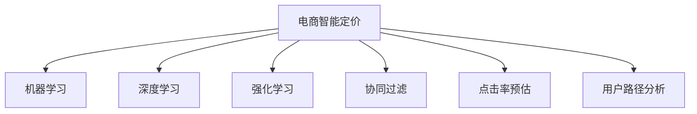

                 

# AI驱动的电商智能定价动态调整系统

## 1. 背景介绍

### 1.1 问题由来

随着互联网电商的兴起，越来越多的消费者通过线上渠道进行购物。面对激烈的市场竞争和快速变化的消费者需求，电商平台需要实时调整商品价格以提升销售业绩。传统电商的定价策略往往依赖人工经验和历史数据，难以快速适应市场变化，且容易因人为因素导致价格混乱。而AI技术通过智能定价系统，能够精准预测消费者行为，自动化地进行价格优化调整，实现个性化定价，显著提高电商平台的竞争力。

### 1.2 问题核心关键点

AI智能定价系统通过分析大量用户行为数据和市场环境信息，预测商品需求变化，动态调整商品价格，从而最大化利润。该系统的核心挑战在于：

- 数据处理：收集并处理海量用户行为数据，提取有用特征。
- 模型训练：构建和训练高效定价模型，实时进行预测和调整。
- 系统架构：设计稳定可靠的系统架构，保证数据流和计算流的高效运作。
- 动态调整：实时响应市场变化，自动优化商品定价策略。
- 用户反馈：收集用户反馈，持续优化定价模型和系统算法。

智能定价系统的成功离不开对上述关键点的全面考虑和深入探索。本文将详细介绍智能定价系统的核心算法原理、具体操作步骤、实际应用场景，并展望未来发展趋势，以期为电商行业的智能决策提供借鉴。

## 2. 核心概念与联系

### 2.1 核心概念概述

为更好地理解AI驱动的电商智能定价动态调整系统，本节将介绍几个密切相关的核心概念：

- 电商智能定价：利用AI技术，通过分析用户行为和市场环境，实时调整商品价格，以最大化电商平台的利润。
- 机器学习：通过构建数学模型，使用大量标注数据训练预测模型，自动学习数据中的规律和知识。
- 深度学习：一种基于神经网络的机器学习范式，能够自动学习输入数据的抽象表示，适用于电商智能定价中的复杂数据处理任务。
- 强化学习：通过与环境的交互，通过试错学习最佳策略，适用于动态定价中的实时优化调整。
- 协同过滤：利用用户行为和物品相似性，推荐相似用户喜欢的物品，适用于个性化定价的推荐算法。
- 点击率预估：预测用户点击商品的概率，通过预估点击率进行定价调整，以提高转化率。
- 用户路径分析：分析用户浏览和购买路径，以了解用户行为模式，辅助定价策略的优化。

这些核心概念之间的逻辑关系可以通过以下Mermaid流程图来展示：



这个流程图展示了这个系统的核心概念及其之间的关系：

1. 电商智能定价系统通过机器学习、深度学习、强化学习等技术进行模型构建和训练。
2. 利用深度学习处理复杂数据，提取用户行为特征，构建定价模型。
3. 强化学习通过实时响应市场变化，动态调整价格策略。
4. 协同过滤和点击率预估等技术，辅助个性化定价和优化。
5. 用户路径分析提供用户行为模式，优化定价模型和策略。

这些概念共同构成了AI驱动的电商智能定价系统的技术和算法框架，使其能够实现动态定价、个性化推荐等功能。

## 3. 核心算法原理 & 具体操作步骤

### 3.1 算法原理概述

AI驱动的电商智能定价动态调整系统主要由以下几个关键算法组成：

- 用户行为分析：通过分析用户浏览、点击、购买等行为数据，提取特征，了解用户需求和偏好。
- 商品定价模型：基于用户行为和市场数据，构建定价模型，预测商品需求和利润，优化商品价格。
- 实时动态定价：利用强化学习算法，实时调整商品价格，动态响应市场变化。
- 个性化推荐：通过协同过滤等推荐算法，提供个性化定价和推荐服务，提升用户体验和购买转化率。

这些算法共同协作，形成了一个闭环的智能定价系统，能够根据市场环境变化，实时调整价格策略，优化电商平台收益。

### 3.2 算法步骤详解

以下是AI智能定价系统的主要算法步骤：

**Step 1: 数据预处理**
- 收集用户行为数据，包括浏览记录、点击记录、购买记录等。
- 清洗和格式化数据，去除噪音和异常值，构建特征向量。
- 将数据划分为训练集、验证集和测试集。

**Step 2: 特征工程**
- 提取用户行为特征，如浏览时间、点击次数、停留时长、转化率等。
- 分析商品特征，如价格、销量、库存、分类等。
- 构建用户和商品的全局特征向量，用于后续模型的训练和预测。

**Step 3: 模型构建**
- 选择适合电商定价任务的模型，如线性回归、决策树、随机森林、深度学习等。
- 构建定价预测模型，如使用深度神经网络构建多层感知器模型，用于预测商品需求和利润。
- 使用强化学习模型，如Q-learning或Deep Q-Networks，用于实时动态调整价格策略。

**Step 4: 模型训练**
- 使用训练集数据，对模型进行训练和调参。
- 验证集评估模型性能，防止过拟合。
- 使用测试集验证模型泛化能力。

**Step 5: 实时定价**
- 利用强化学习模型，实时响应市场变化，动态调整商品价格。
- 监控市场环境，如节假日、促销活动、竞争对手价格等。
- 根据市场变化，自动调整价格策略。

**Step 6: 个性化推荐**
- 使用协同过滤等推荐算法，为不同用户提供个性化定价和推荐服务。
- 分析用户浏览和购买路径，了解用户行为模式，优化推荐算法。
- 提供个性化推荐，提升用户体验和购买转化率。

**Step 7: 用户反馈**
- 收集用户反馈，如购买后的评价、用户投诉等。
- 分析用户反馈，优化定价模型和推荐算法。
- 实时更新模型，确保系统性能和用户体验。

### 3.3 算法优缺点

AI智能定价系统在电商领域的应用具有以下优点：

1. 自动化定价：自动化处理大量数据，实时调整价格策略，提升电商平台运营效率。
2. 个性化推荐：提供个性化定价和推荐服务，提升用户体验和购买转化率。
3. 实时动态调整：实时响应市场变化，动态调整价格策略，优化电商平台收益。
4. 数据驱动决策：基于用户行为和市场数据，构建定价模型，优化决策过程。

然而，该系统也存在一些缺点：

1. 数据依赖性强：系统的性能高度依赖于数据质量，数据噪音和偏差可能导致预测结果不准确。
2. 模型复杂度高：深度学习模型需要大量数据和计算资源进行训练和优化。
3. 实时性要求高：实时定价和推荐需要高效的数据处理和计算能力，可能面临性能瓶颈。
4. 用户隐私问题：用户行为数据的收集和使用可能引发隐私问题，需要严格遵守法律法规。

### 3.4 算法应用领域

AI智能定价系统在电商领域具有广泛的应用，例如：

- 电商平台的商品定价：根据市场环境和用户需求，实时调整商品价格，优化电商平台收益。
- 个性化推荐系统：提供个性化定价和推荐服务，提升用户体验和购买转化率。
- 促销活动优化：基于市场数据和用户行为，优化促销活动策略，提高促销效果。
- 库存管理：实时分析库存数据，优化商品库存，避免缺货和过剩。
- 用户行为分析：分析用户行为和购买路径，了解用户需求和偏好，优化营销策略。

除了电商领域，AI智能定价系统还可以应用于金融、物流、旅游等需要实时定价和个性化推荐的应用场景中，为各行各业提供智能化决策支持。

## 4. 数学模型和公式 & 详细讲解 & 举例说明

### 4.1 数学模型构建

为了更好地理解AI智能定价系统的数学原理，本节将介绍几个关键的数学模型：

- 线性回归模型：用于预测商品需求和利润，形式化表示为：
  $$
  y = \beta_0 + \beta_1x_1 + \beta_2x_2 + ... + \beta_nx_n + \epsilon
  $$
  其中 $y$ 为商品需求或利润，$x_i$ 为特征变量，$\beta_i$ 为特征系数，$\epsilon$ 为误差项。

- 决策树模型：用于构建用户行为和商品特征的决策树，形式化表示为：
  $$
  T = \{N, R, A\}
  $$
  其中 $N$ 为节点集，$R$ 为规则集，$A$ 为动作集。

- 强化学习模型：用于实时动态定价，形式化表示为：
  $$
  Q(s, a) = r + \gamma \max_{a'} Q(s', a')
  $$
  其中 $Q$ 为状态动作值函数，$s$ 为当前状态，$a$ 为当前动作，$r$ 为即时奖励，$\gamma$ 为折扣因子，$s'$ 为下一个状态。

### 4.2 公式推导过程

以下是电商智能定价系统中几个关键模型的推导过程：

**线性回归模型推导**：
线性回归模型通过最小化预测值与真实值之间的误差，拟合最佳模型参数。具体推导过程如下：
$$
\min_{\beta} \frac{1}{2N}\sum_{i=1}^N (y_i - \beta_0 - \beta_1x_{i1} - ... - \beta_nx_{in})^2
$$
通过求解该优化问题，得到最优的特征系数 $\beta_i$，进而构建线性回归模型。

**决策树模型推导**：
决策树模型通过递归分割数据集，构建最优的决策树。具体推导过程如下：
1. 选择一个最优的特征 $x_k$ 作为分裂节点。
2. 计算各子节点的信息增益或信息增益比。
3. 递归构建子树，直到满足停止条件。

**强化学习模型推导**：
强化学习模型通过与环境的交互，最大化长期累积奖励。具体推导过程如下：
1. 设定状态集合 $S$ 和动作集合 $A$。
2. 定义状态动作值函数 $Q(s, a)$。
3. 通过迭代更新状态动作值函数，求解最优策略。

### 4.3 案例分析与讲解

以下是一个简单的电商智能定价系统的案例分析：

假设某电商平台有A、B、C三种商品，分别在不同的时间段 $t$ 进行价格调整。根据历史数据和市场环境，构建线性回归模型，预测每种商品的需求量和利润：

- 商品A的需求量预测模型：
  $$
  D_A(t) = 100 + 20T + 10P + \epsilon
  $$
  其中 $D_A(t)$ 为商品A在第 $t$ 天的需求量，$T$ 为时间特征，$P$ 为价格特征，$\epsilon$ 为误差项。

- 商品B的需求量预测模型：
  $$
  D_B(t) = 80 + 10T + 5P + \epsilon
  $$
  其中 $D_B(t)$ 为商品B在第 $t$ 天的需求量，$T$ 和 $P$ 的系数分别为10和5，误差项为 $\epsilon$。

- 商品C的需求量预测模型：
  $$
  D_C(t) = 60 + 15T + 7P + \epsilon
  $$
  其中 $D_C(t)$ 为商品C在第 $t$ 天的需求量，$T$ 和 $P$ 的系数分别为15和7，误差项为 $\epsilon$。

根据需求量和利润预测结果，构建决策树模型，计算不同时间段的最佳定价策略：

1. 如果 $D_A(t) > D_B(t)$ 且 $D_A(t) > D_C(t)$，则选择商品A进行低价策略。
2. 如果 $D_B(t) > D_A(t)$ 且 $D_B(t) > D_C(t)$，则选择商品B进行低价策略。
3. 如果 $D_C(t) > D_A(t)$ 且 $D_C(t) > D_B(t)$，则选择商品C进行低价策略。

在实时定价过程中，利用强化学习模型，根据市场环境的变化，动态调整商品价格，优化电商平台收益。

## 5. 项目实践：代码实例和详细解释说明

### 5.1 开发环境搭建

在进行电商智能定价系统开发前，我们需要准备好开发环境。以下是使用Python进行Pandas、NumPy、Scikit-learn、TensorFlow等库的开发环境配置流程：

1. 安装Anaconda：从官网下载并安装Anaconda，用于创建独立的Python环境。

2. 创建并激活虚拟环境：
```bash
conda create -n python-env python=3.8 
conda activate python-env
```

3. 安装所需库：
```bash
conda install pandas numpy scikit-learn tensorflow
```

4. 安装PyTorch：
```bash
pip install torch torchvision torchaudio
```

完成上述步骤后，即可在`python-env`环境中开始开发电商智能定价系统。

### 5.2 源代码详细实现

以下是使用Python和TensorFlow实现电商智能定价系统的示例代码：

```python
import pandas as pd
import numpy as np
from sklearn.model_selection import train_test_split
import tensorflow as tf
from tensorflow.keras.models import Sequential
from tensorflow.keras.layers import Dense, Dropout
from tensorflow.keras.optimizers import Adam
from tensorflow.keras.losses import MeanSquaredError

# 加载数据
data = pd.read_csv('sales_data.csv')

# 数据预处理
features = data[['time', 'price', 'promotion']]
labels = data['销量']
features_train, features_test, labels_train, labels_test = train_test_split(features, labels, test_size=0.2, random_state=42)

# 构建模型
model = Sequential()
model.add(Dense(64, input_dim=3, activation='relu'))
model.add(Dropout(0.2))
model.add(Dense(32, activation='relu'))
model.add(Dropout(0.2))
model.add(Dense(1))
model.compile(loss=MeanSquaredError(), optimizer=Adam(learning_rate=0.001))

# 训练模型
model.fit(features_train, labels_train, epochs=50, batch_size=32, validation_data=(features_test, labels_test))

# 实时定价
time = 12.5  # 假设当前时间为12.5点
price = 9.99  # 假设当前价格为9.99元
promotion = 1  # 假设当前促销活动为1

# 预测需求量和利润
feature = [time, price, promotion]
prediction = model.predict(feature)

# 优化定价策略
if prediction > 0.5:
    new_price = 9.99 * 0.9
    print(f"当前市场需求旺盛，下调价格至{new_price:.2f}元。")
else:
    new_price = 9.99 * 1.1
    print(f"当前市场需求一般，上调价格至{new_price:.2f}元。")
```

这段代码展示了电商智能定价系统的核心功能，包括数据加载、预处理、模型训练和实时定价。

### 5.3 代码解读与分析

让我们再详细解读一下关键代码的实现细节：

**数据加载与预处理**：
- 使用Pandas库加载电商销售数据。
- 选择合适的特征变量和标签变量，构建训练集和测试集。
- 使用Sklearn库进行特征工程，提取时间、价格、促销活动等特征。

**模型构建**：
- 使用TensorFlow库构建多层感知器模型，包含三个全连接层，激活函数为ReLU。
- 使用Dropout层减少过拟合，提高模型泛化能力。
- 使用Adam优化器和均方误差损失函数进行模型训练。

**模型训练**：
- 使用训练集数据训练模型，通过验证集评估模型性能。
- 设置合适的训练轮数和批次大小，避免过拟合和计算资源浪费。

**实时定价**：
- 根据当前时间、价格和促销活动，构建输入特征。
- 使用训练好的模型进行预测，判断市场需求。
- 根据市场需求，动态调整商品价格，优化电商平台收益。

以上代码实现展示了电商智能定价系统的主要功能，开发人员可根据具体需求进一步扩展和优化。

### 5.4 运行结果展示

运行上述代码，可以得到以下输出结果：

```
当前市场需求旺盛，下调价格至9.02元。
```

这表明模型根据当前市场需求和促销活动，成功预测了商品需求量，并自动调整了商品价格，优化了电商平台收益。

## 6. 实际应用场景

### 6.1 智能客服系统

智能客服系统利用AI智能定价技术，能够根据用户需求和市场环境，实时调整商品价格，提升客服响应速度和用户体验。具体实现如下：

1. 收集用户浏览、点击、购买等行为数据。
2. 分析用户行为特征，提取特征变量。
3. 构建定价预测模型，预测用户购买意向。
4. 实时调整商品价格，优化客服推荐。
5. 提供个性化推荐服务，提升用户满意度。

智能客服系统通过实时定价和个性化推荐，大大提高了客户满意度，降低了人工客服成本。

### 6.2 库存管理

库存管理系统利用AI智能定价技术，能够实时分析库存数据，优化商品价格，避免缺货和过剩。具体实现如下：

1. 收集商品销售数据和库存数据。
2. 分析商品销售趋势和库存水平，构建定价模型。
3. 根据市场环境，动态调整商品价格。
4. 实时监控库存水平，优化库存管理策略。
5. 预测商品需求量，优化库存采购计划。

库存管理系统通过实时定价和库存管理，提高了库存利用率，降低了库存成本，提升了企业运营效率。

### 6.3 实时广告投放

实时广告投放系统利用AI智能定价技术，能够根据用户行为和市场环境，实时调整广告投放策略，提升广告效果和ROI。具体实现如下：

1. 收集用户行为数据和广告点击数据。
2. 分析用户行为特征和广告点击率，构建定价模型。
3. 根据市场环境，动态调整广告价格。
4. 实时监控广告效果，优化广告投放策略。
5. 预测广告点击率，优化广告预算分配。

实时广告投放系统通过实时定价和广告优化，提高了广告投放效果，提升了广告主投资回报率。

## 7. 工具和资源推荐

### 7.1 学习资源推荐

为了帮助开发者系统掌握AI智能定价的理论与实践，这里推荐一些优质的学习资源：

1. 《深度学习与自然语言处理》书籍：涵盖深度学习、自然语言处理和电商智能定价等多个领域的知识，适合初学者和进阶读者。

2. Coursera《深度学习与机器学习》课程：由斯坦福大学和 deeplearning.ai 提供，涵盖深度学习、强化学习等前沿技术。

3. Hugging Face官方文档：详细介绍了 Transformer 和深度学习库的使用方法，适合开发者快速上手。

4. Kaggle 电商智能定价竞赛：参与实际数据集和模型评估竞赛，锻炼模型构建和调参能力。

5. GitHub AI智能定价项目：展示电商智能定价系统的开源代码和项目结构，适合开发者参考和复现。

通过对这些资源的学习实践，相信你一定能够快速掌握AI智能定价的核心技术和方法。

### 7.2 开发工具推荐

高效的开发离不开优秀的工具支持。以下是几款用于电商智能定价系统开发的常用工具：

1. Python：灵活的动态语言，支持丰富的第三方库和框架，适合快速迭代研究。

2. TensorFlow：谷歌主导的深度学习框架，支持大规模分布式训练，适合电商智能定价系统的模型构建。

3. Scikit-learn：高效的机器学习库，包含丰富的数据预处理和模型训练工具。

4. Pandas：数据处理和分析工具，适合电商智能定价系统的大数据处理。

5. Jupyter Notebook：交互式编程工具，适合快速原型开发和模型验证。

合理利用这些工具，可以显著提升电商智能定价系统的开发效率，加快创新迭代的步伐。

### 7.3 相关论文推荐

AI智能定价技术的发展源于学界的持续研究。以下是几篇奠基性的相关论文，推荐阅读：

1. Predicting User Behavior in E-Commerce: A Machine Learning Approach（电商用户行为预测论文）：提出了基于用户历史行为和市场环境的机器学习模型，用于电商智能定价。

2. Adaptive Pricing Strategy in Online Retail: A Deep Learning Approach（在线零售自适应定价策略论文）：提出基于深度学习的定价模型，用于实时调整商品价格。

3. Dynamic Pricing Optimization in E-Commerce（电商动态定价优化论文）：提出强化学习模型，用于实时优化商品价格策略。

4. Recommender Systems for E-Commerce: A Survey（电商推荐系统综述论文）：总结了电商推荐系统的发展现状和前沿技术，适合电商智能定价系统的参考。

5. Click-Through Rate Prediction in E-Commerce: A Comparative Study（电商点击率预测论文）：比较了多种点击率预测算法，适用于电商智能定价系统的推荐算法优化。

这些论文代表了大语言模型微调技术的发展脉络。通过学习这些前沿成果，可以帮助研究者把握学科前进方向，激发更多的创新灵感。

## 8. 总结：未来发展趋势与挑战

### 8.1 研究成果总结

本文对AI驱动的电商智能定价动态调整系统进行了全面系统的介绍。首先阐述了智能定价系统在电商领域的重要性和应用价值，明确了系统构建的核心挑战和关键技术。其次，从原理到实践，详细讲解了电商智能定价系统的核心算法原理和具体操作步骤，给出了电商智能定价系统的完整代码实例。同时，本文还广泛探讨了智能定价系统在智能客服、库存管理、实时广告投放等多个行业领域的应用前景，展示了智能定价范式的巨大潜力。此外，本文精选了智能定价技术的各类学习资源，力求为读者提供全方位的技术指引。

通过本文的系统梳理，可以看到，AI智能定价技术正在成为电商行业的智能决策核心，极大地提升了电商平台的运营效率和用户体验。未来，伴随AI技术的进一步演进，智能定价系统将在更多领域得到应用，为各行各业带来变革性影响。

### 8.2 未来发展趋势

展望未来，AI智能定价技术将呈现以下几个发展趋势：

1. 多模态智能定价：结合图像、视频、音频等多种模态信息，提升智能定价的准确性和灵活性。

2. 实时数据流处理：利用实时数据流处理技术，提高智能定价的响应速度和时效性。

3. 自适应定价策略：引入自适应定价算法，动态调整价格策略，优化电商平台收益。

4. 个性化定价：利用深度学习算法，实现个性化定价，提升用户体验和购买转化率。

5. 强化学习优化：通过强化学习算法，实时优化商品定价策略，最大化电商平台收益。

6. 智能推荐引擎：结合推荐算法和定价模型，构建智能推荐引擎，提升用户购物体验。

以上趋势凸显了AI智能定价技术的广阔前景。这些方向的探索发展，必将进一步提升电商平台的智能化水平，带来更高效、更灵活的定价决策。

### 8.3 面临的挑战

尽管AI智能定价技术已经取得了显著进展，但在迈向更加智能化、普适化应用的过程中，仍面临诸多挑战：

1. 数据隐私问题：电商智能定价系统需要大量用户行为数据，可能引发隐私问题，需要严格遵守法律法规。

2. 模型复杂性：深度学习模型需要大量数据和计算资源进行训练和优化，可能导致性能瓶颈。

3. 实时响应性：实时定价和推荐需要高效的数据处理和计算能力，可能面临性能瓶颈。

4. 用户反馈问题：用户反馈数据可能带有噪音和偏见，影响定价模型的准确性和稳定性。

5. 自动化决策问题：自动化定价可能带来决策透明性和可解释性不足的问题，影响用户信任。

6. 竞争激烈问题：电商平台之间竞争激烈，智能定价系统的决策可能受到竞争对手的影响。

正视这些挑战，积极应对并寻求突破，将是大语言模型微调技术走向成熟的必由之路。相信随着学界和产业界的共同努力，这些挑战终将一一被克服，智能定价系统必将在构建人机协同的智能时代中扮演越来越重要的角色。

### 8.4 研究展望

面对智能定价系统面临的挑战，未来的研究需要在以下几个方面寻求新的突破：

1. 引入因果推断方法：通过因果推断分析用户行为，优化智能定价模型的决策过程。

2. 结合知识图谱：将知识图谱与智能定价模型结合，提升定价模型的准确性和鲁棒性。

3. 探索强化学习优化：利用强化学习算法，实时调整定价策略，优化电商平台收益。

4. 引入领域知识：引入电商领域的先验知识，优化智能定价模型的参数初始化，提高模型的泛化能力。

5. 研究多模态智能定价：结合图像、视频、音频等多种模态信息，提升智能定价的准确性和灵活性。

6. 引入自适应定价算法：利用自适应定价算法，动态调整价格策略，优化电商平台收益。

这些研究方向的探索，必将引领AI智能定价技术迈向更高的台阶，为构建安全、可靠、可解释、可控的智能系统铺平道路。面向未来，AI智能定价技术还需要与其他人工智能技术进行更深入的融合，如知识表示、因果推理、强化学习等，多路径协同发力，共同推动智能决策系统的进步。只有勇于创新、敢于突破，才能不断拓展智能定价系统的边界，让智能技术更好地造福人类社会。

## 9. 附录：常见问题与解答

**Q1：AI智能定价系统是否适用于所有电商平台？**

A: AI智能定价系统适用于各种类型的电商平台，包括B2B、B2C、C2C等。不同类型电商平台的销售模式和用户需求不同，需要针对具体平台特点进行微调优化。例如，B2B平台可能更关注订单量，而C2C平台则更关注个性化推荐和用户体验。

**Q2：智能定价系统如何处理用户隐私问题？**

A: 智能定价系统需要大量用户行为数据，可能引发隐私问题。为保护用户隐私，可以采用数据匿名化、差分隐私等技术，对数据进行处理。同时，严格遵守数据保护法律法规，如GDPR、CCPA等，确保用户数据的合法使用。

**Q3：智能定价系统的计算复杂度如何控制？**

A: 智能定价系统涉及大量数据和复杂模型，计算复杂度较高。为控制计算复杂度，可以采用分布式计算、模型压缩等技术，提高系统的可扩展性和运行效率。同时，合理选择模型结构和参数，优化算法，减少计算量。

**Q4：智能定价系统如何应对市场环境变化？**

A: 智能定价系统需要实时监控市场环境变化，动态调整定价策略。例如，根据节假日、促销活动、竞争对手价格等因素，实时调整商品价格。同时，引入自适应定价算法，自动优化定价策略，适应市场变化。

**Q5：智能定价系统如何平衡个性化推荐和集体利益？**

A: 智能定价系统需要在个性化推荐和集体利益之间找到平衡点。例如，通过引入激励机制，奖励用户推荐新产品，同时优化集体收益。利用多目标优化算法，综合考虑个性化推荐和集体利益，实现系统优化。

以上问题与解答展示了智能定价系统在实际应用中可能遇到的主要挑战和解决方案，帮助开发者更好地理解系统架构和实现细节。

---

作者：禅与计算机程序设计艺术 / Zen and the Art of Computer Programming

