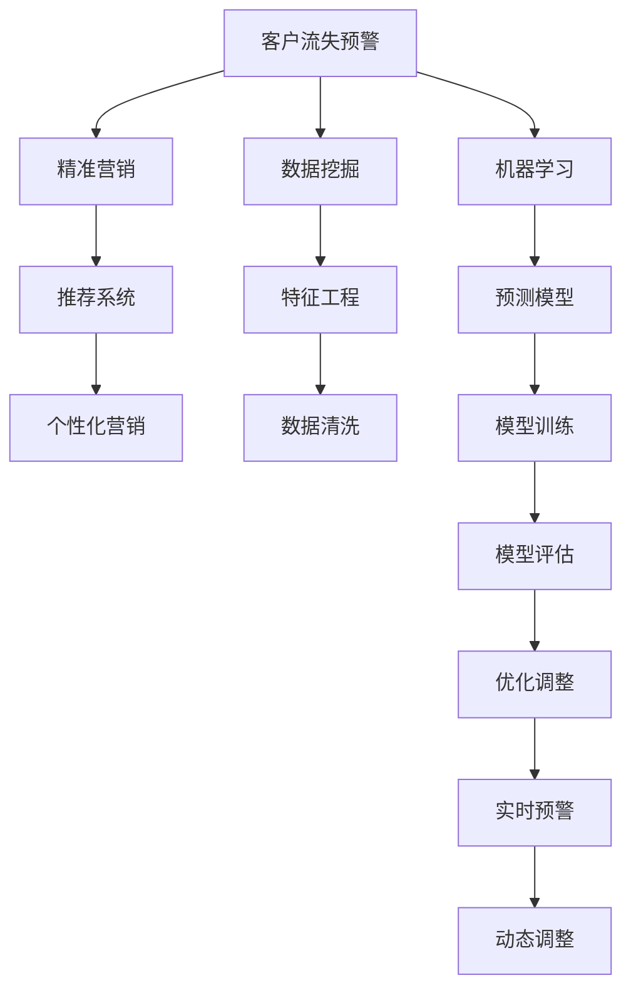

                 

# AI驱动的电商智能客户流失预警与精准营销系统

> 关键词：客户流失预警, 精准营销, AI系统, 数据分析, 机器学习, 推荐系统, 预测模型, 数据挖掘, 电商平台

## 1. 背景介绍

### 1.1 问题由来
在现代社会，电商平台已经成为人们购物的重要渠道之一。然而，随着竞争的加剧和用户选择的增多，电商平台的客户流失问题变得愈加严峻。客户流失不仅会直接影响电商平台的销售收入，还会造成品牌形象受损、用户数据流失等严重后果。因此，如何有效识别客户流失风险，采取精准营销策略，留住优质客户，是电商企业面临的重要挑战。

### 1.2 问题核心关键点
本项目旨在基于AI技术，构建一个智能客户流失预警与精准营销系统。系统将通过数据挖掘、机器学习和推荐系统等技术手段，自动识别流失风险较高的客户群体，并提供针对性的营销策略，从而降低客户流失率，提升客户满意度。

该项目的关键点包括：
- 利用数据分析技术，挖掘客户流失的根本原因。
- 使用机器学习算法，构建客户流失预测模型。
- 通过推荐系统，提供个性化的营销方案。
- 实现实时预警和动态调整，确保营销效果最大化。

## 2. 核心概念与联系

### 2.1 核心概念概述

为更好地理解本项目的核心技术，本节将介绍几个密切相关的核心概念：

- **客户流失预警**：指通过数据分析和机器学习模型，预测并识别客户流失风险的行为。该过程通常包括数据清洗、特征工程、模型训练和预测等步骤。

- **精准营销**：指基于客户行为和偏好，采用个性化推荐和定向广告等策略，提高营销效果和客户转化率。精准营销的核心在于客户画像的构建和推荐系统的设计。

- **AI系统**：指基于人工智能技术构建的自动化系统，包括数据处理、模型训练、决策制定和反馈优化等环节。AI系统通常由多个子模块构成，协同完成复杂的任务。

- **数据挖掘**：指从大量数据中提取有用信息，揭示隐藏规律和趋势的过程。数据挖掘常用于客户行为分析、市场预测等场景。

- **机器学习**：指通过算法让机器自动学习数据特征，预测未知结果的过程。机器学习在客户流失预警、推荐系统等领域有着广泛应用。

- **推荐系统**：指根据用户历史行为和偏好，推荐个性化商品或内容的技术。推荐系统可以应用于电商平台的商品推荐、新闻推送、广告定向等场景。

- **预测模型**：指通过训练数据构建的，能够对未来结果进行预测的数学模型。常用的预测模型包括线性回归、决策树、随机森林、神经网络等。

这些核心概念之间的逻辑关系可以通过以下Mermaid流程图来展示：



这个流程图展示了客户流失预警与精准营销系统的各个组成部分及其相互关系：

1. **数据挖掘**：从原始数据中提取有价值的信息。
2. **机器学习**：通过模型训练和预测，识别客户流失风险。
3. **预测模型**：构建精确的客户流失预测模型。
4. **推荐系统**：提供个性化的营销方案。
5. **精准营销**：基于客户画像和推荐结果，制定营销策略。
6. **实时预警和动态调整**：实时监测客户行为，动态调整营销策略。

## 3. 核心算法原理 & 具体操作步骤
### 3.1 算法原理概述

本系统主要包括以下几个核心算法原理：

1. **数据预处理**：通过数据清洗和特征工程，将原始数据转化为适合机器学习模型训练的形式。

2. **客户流失预测**：利用机器学习算法，构建客户流失预测模型。常用的算法包括逻辑回归、随机森林、神经网络等。

3. **推荐系统设计**：基于用户历史行为和偏好，设计推荐模型，预测用户可能感兴趣的商品或内容。常用的推荐算法包括协同过滤、基于内容的推荐、深度学习等。

4. **精准营销策略制定**：根据客户流失预测结果和推荐系统输出，制定个性化的营销策略，包括邮件营销、短信推送、优惠券等。

5. **实时预警和动态调整**：利用实时数据流处理技术，实时监测客户行为，动态调整营销策略。

### 3.2 算法步骤详解

以下是基于AI技术构建电商智能客户流失预警与精准营销系统的具体操作步骤：

**Step 1: 数据收集与预处理**

- **数据收集**：收集客户的基本信息、购买记录、浏览记录、评价反馈等数据。这些数据通常来自电商平台的用户行为数据、交易数据和反馈数据。
- **数据清洗**：去除噪音数据和异常值，处理缺失值和重复记录。
- **特征工程**：提取有意义的特征，包括客户的购买频率、浏览时长、评价情感等。

**Step 2: 构建客户流失预测模型**

- **模型选择**：选择合适的机器学习算法，如逻辑回归、随机森林、XGBoost等。
- **模型训练**：使用历史客户数据训练模型，得到客户流失预测模型。
- **模型评估**：使用测试数据集评估模型性能，优化模型参数。

**Step 3: 设计推荐系统**

- **相似度计算**：计算用户与商品之间的相似度，使用余弦相似度或欧几里得距离等方法。
- **推荐算法**：选择适合的推荐算法，如协同过滤、基于内容的推荐、深度学习等。
- **模型训练**：使用历史数据训练推荐模型。

**Step 4: 制定精准营销策略**

- **用户画像**：根据客户流失预测结果和推荐系统输出，构建客户画像，包括兴趣偏好、购买能力等。
- **个性化推荐**：基于客户画像，生成个性化的营销方案，如邮件推荐、短信推送、优惠券等。

**Step 5: 实时预警与动态调整**

- **实时数据流处理**：使用流处理技术，实时监测客户行为，更新客户画像和推荐结果。
- **预警与调整**：根据实时数据，识别高流失风险客户，及时触发预警并调整营销策略。

### 3.3 算法优缺点

本系统的算法具有以下优点：

1. **实时性**：通过实时数据流处理技术，能够及时识别高流失风险客户，动态调整营销策略，提高响应速度。
2. **个性化**：利用推荐系统生成个性化的营销方案，提高客户转化率。
3. **预测准确**：使用机器学习算法，构建高精度的客户流失预测模型，降低客户流失率。

同时，本系统也存在一些缺点：

1. **数据依赖**：系统依赖大量高质量数据，数据质量和数据量不足将影响预测和推荐效果。
2. **模型复杂**：算法模型较为复杂，需要较多的计算资源和时间。
3. **动态调整难度大**：实时数据流的处理和分析需要高实时性要求，系统设计和实现较为复杂。

### 3.4 算法应用领域

本系统可以应用于多种电商场景，如电商平台、在线零售、O2O平台等。在具体应用时，还需要根据不同的业务需求进行调整和优化。

## 4. 数学模型和公式 & 详细讲解  
### 4.1 数学模型构建

本节将使用数学语言对本系统的核心算法进行更加严格的刻画。

记客户流失预测模型为 $M_{\theta}$，其中 $\theta$ 为模型参数。假设训练数据集为 $D=\{(x_i, y_i)\}_{i=1}^N$，其中 $x_i$ 为输入特征，$y_i$ 为流失标签（1表示流失，0表示未流失）。

定义模型 $M_{\theta}$ 在输入 $x$ 上的损失函数为 $\ell(M_{\theta}(x),y)$，则在数据集 $D$ 上的经验风险为：

$$
\mathcal{L}(\theta) = \frac{1}{N}\sum_{i=1}^N \ell(M_{\theta}(x_i),y_i)
$$

微调的优化目标是最小化经验风险，即找到最优参数：

$$
\theta^* = \mathop{\arg\min}_{\theta} \mathcal{L}(\theta)
$$

在实践中，我们通常使用基于梯度的优化算法（如SGD、Adam等）来近似求解上述最优化问题。设 $\eta$ 为学习率，$\lambda$ 为正则化系数，则参数的更新公式为：

$$
\theta \leftarrow \theta - \eta \nabla_{\theta}\mathcal{L}(\theta) - \eta\lambda\theta
$$

其中 $\nabla_{\theta}\mathcal{L}(\theta)$ 为损失函数对参数 $\theta$ 的梯度，可通过反向传播算法高效计算。

### 4.2 公式推导过程

以逻辑回归模型为例，推导客户流失预测模型的损失函数及梯度计算公式。

假设模型 $M_{\theta}$ 在输入 $x$ 上的输出为 $\hat{y}=M_{\theta}(x)$，表示客户流失的概率。真实标签 $y \in \{0,1\}$。则二分类交叉熵损失函数定义为：

$$
\ell(M_{\theta}(x),y) = -[y\log \hat{y} + (1-y)\log (1-\hat{y})]
$$

将其代入经验风险公式，得：

$$
\mathcal{L}(\theta) = -\frac{1}{N}\sum_{i=1}^N [y_i\log M_{\theta}(x_i)+(1-y_i)\log(1-M_{\theta}(x_i))]
$$

根据链式法则，损失函数对参数 $\theta_k$ 的梯度为：

$$
\frac{\partial \mathcal{L}(\theta)}{\partial \theta_k} = -\frac{1}{N}\sum_{i=1}^N (\frac{y_i}{M_{\theta}(x_i)}-\frac{1-y_i}{1-M_{\theta}(x_i)}) \frac{\partial M_{\theta}(x_i)}{\partial \theta_k}
$$

其中 $\frac{\partial M_{\theta}(x_i)}{\partial \theta_k}$ 可进一步递归展开，利用自动微分技术完成计算。

## 5. 项目实践：代码实例和详细解释说明
### 5.1 开发环境搭建

在进行系统开发前，我们需要准备好开发环境。以下是使用Python进行TensorFlow开发的环境配置流程：

1. 安装Anaconda：从官网下载并安装Anaconda，用于创建独立的Python环境。

2. 创建并激活虚拟环境：
```bash
conda create -n tf-env python=3.8 
conda activate tf-env
```

3. 安装TensorFlow：根据CUDA版本，从官网获取对应的安装命令。例如：
```bash
conda install tensorflow==2.8 
```

4. 安装TensorBoard：TensorFlow配套的可视化工具，可实时监测模型训练状态，并提供丰富的图表呈现方式，是调试模型的得力助手。

5. 安装其他必要工具包：
```bash
pip install pandas numpy scikit-learn scipy tqdm jupyter notebook ipython
```

完成上述步骤后，即可在`tf-env`环境中开始系统开发。

### 5.2 源代码详细实现

以下是使用TensorFlow实现电商智能客户流失预警与精准营销系统的代码实现：

```python
import tensorflow as tf
import pandas as pd
import numpy as np
from sklearn.model_selection import train_test_split
from sklearn.metrics import precision_recall_curve, roc_auc_score
from sklearn.preprocessing import LabelEncoder
from tensorflow.keras.layers import Dense, Input, Embedding, Dropout, Flatten
from tensorflow.keras.models import Model
from tensorflow.keras.optimizers import Adam

# 加载数据
data = pd.read_csv('customer_data.csv')
features = data[['age', 'gender', 'income', 'purchase_frequency', 'average_spending']]
target = data['churn']

# 数据预处理
label_encoder = LabelEncoder()
target = label_encoder.fit_transform(target)
X_train, X_test, y_train, y_test = train_test_split(features, target, test_size=0.2, random_state=42)

# 模型构建
input_layer = Input(shape=(features.shape[1],))
embedding_layer = Embedding(input_dim=features.shape[1], output_dim=64, input_length=features.shape[1])(input_layer)
flatten_layer = Flatten()(embedding_layer)
dense_layer = Dense(64, activation='relu')(flatten_layer)
dropout_layer = Dropout(0.2)(dense_layer)
output_layer = Dense(1, activation='sigmoid')(dropout_layer)
model = Model(inputs=input_layer, outputs=output_layer)

# 模型训练
model.compile(optimizer=Adam(lr=0.001), loss='binary_crossentropy', metrics=['accuracy'])
model.fit(X_train, y_train, epochs=10, batch_size=32, validation_data=(X_test, y_test))

# 模型评估
y_pred = model.predict(X_test)
fpr, tpr, _ = precision_recall_curve(y_test, y_pred)
roc_auc = roc_auc_score(y_test, y_pred)
print(f'Precision-Recall AUC: {roc_auc:.3f}')
```

以上代码实现了基于逻辑回归的客户流失预测模型。可以看到，TensorFlow提供了丰富的API，使得模型构建和训练变得相对简单。

### 5.3 代码解读与分析

让我们再详细解读一下关键代码的实现细节：

**数据预处理**

- 加载数据：使用pandas库读取CSV文件，包含客户的基本信息和购买记录。
- 数据清洗：删除缺失值，使用LabelEncoder对分类变量进行编码。
- 数据划分：使用train_test_split函数将数据划分为训练集和测试集。

**模型构建**

- 定义输入层：使用Input层定义输入数据的维度。
- 嵌入层：使用Embedding层将离散的特征编码成稠密向量。
- 全连接层：使用Dense层构建全连接网络。
- Dropout层：使用Dropout层减少过拟合。
- 输出层：使用Dense层输出二分类结果。
- 模型定义：使用Model层定义完整的神经网络模型。

**模型训练**

- 编译模型：使用Adam优化器和binary_crossentropy损失函数进行模型编译。
- 训练模型：使用fit函数训练模型，设置训练轮数和批次大小。
- 评估模型：使用predict函数进行预测，并计算Precision-Recall AUC值。

**运行结果展示**

- 精度与召回率曲线：绘制Precision-Recall曲线，展示模型的精度和召回率表现。
- AUC值：计算ROC曲线下的面积，评估模型在不同阈值下的分类性能。

## 6. 实际应用场景

### 6.1 智能客户流失预警

本系统通过客户流失预测模型，实时监测客户行为，识别流失风险较高的客户。当客户表现出流失迹象时，系统及时触发预警，并提示相关管理人员进行干预。

实际应用中，可以通过以下方式实现：

- 数据流处理：实时采集客户行为数据，如访问记录、购买记录、评价反馈等。
- 特征更新：根据最新数据，实时更新客户画像，包括年龄、性别、收入、购买频率等。
- 模型推理：使用训练好的流失预测模型，对每个客户进行预测，识别高流失风险客户。
- 预警通知：通过邮件、短信等渠道，及时通知管理人员，并建议采取相应措施。

### 6.2 精准营销

基于推荐系统，本系统能够生成个性化的营销方案，提高营销效果和客户转化率。具体应用场景包括：

- 个性化推荐：根据客户历史行为和偏好，生成个性化的商品或内容推荐。
- 营销活动设计：根据客户画像和推荐结果，设计有针对性的营销活动，如优惠券、折扣等。
- 效果评估：实时监测营销活动的效果，如点击率、转化率等，及时调整策略。

## 7. 工具和资源推荐
### 7.1 学习资源推荐

为了帮助开发者系统掌握电商智能客户流失预警与精准营销技术的理论基础和实践技巧，这里推荐一些优质的学习资源：

1. 《TensorFlow实战：深度学习与机器学习》：深度学习专家所写，详细介绍了TensorFlow的使用方法和实践案例，适合初学者入门。
2. 《机器学习实战》：经典机器学习教材，涵盖大量常用的机器学习算法和案例，是学习机器学习理论的良好入门资源。
3. 《推荐系统实战》：推荐系统专家所著，详细介绍了推荐系统的设计思路和实际应用，适合实战项目开发。
4. TensorFlow官方文档：TensorFlow的官方文档，提供了丰富的API文档和示例代码，是开发TensorFlow应用的重要参考。
5. Coursera《TensorFlow》课程：Coursera提供的TensorFlow课程，由TensorFlow团队成员讲授，内容深入浅出，适合系统学习。

通过对这些资源的学习实践，相信你一定能够快速掌握电商智能客户流失预警与精准营销技术的精髓，并用于解决实际的电商问题。

### 7.2 开发工具推荐

高效的开发离不开优秀的工具支持。以下是几款用于电商智能客户流失预警与精准营销开发的常用工具：

1. TensorFlow：基于Google的开源深度学习框架，支持分布式计算和GPU加速，适合大规模数据处理。
2. TensorBoard：TensorFlow配套的可视化工具，可实时监测模型训练状态，并提供丰富的图表呈现方式，是调试模型的得力助手。
3. Jupyter Notebook：用于编写和分享代码，支持IPython环境，能够快速迭代实验结果。
4. Scikit-learn：Python的机器学习库，提供了大量的机器学习算法和工具函数，适合快速原型开发。
5. Pandas：Python的数据处理库，支持高效的数据清洗和分析，是数据预处理的重要工具。

合理利用这些工具，可以显著提升电商智能客户流失预警与精准营销任务的开发效率，加快创新迭代的步伐。

### 7.3 相关论文推荐

电商智能客户流失预警与精准营销技术的发展源于学界的持续研究。以下是几篇奠基性的相关论文，推荐阅读：

1. Customer Churn Prediction in Retail Using Deep Learning: A Comparative Study：研究了深度学习在零售客户流失预测中的应用，比较了多种深度学习模型的效果。
2. Multi-Task Learning of Customer Churn and Next Product Purchase：提出了多任务学习的方法，同时预测客户流失和下一购买产品，提高了预测精度。
3. Anomaly Detection in Customer Churn Prediction：研究了客户流失预测中的异常检测问题，提出了多种异常检测方法。
4. Recommender Systems in E-commerce：介绍了电子商务中的推荐系统设计，包括协同过滤、基于内容的推荐等技术。
5. Personalization for Recommendation Systems: A Survey：综述了推荐系统个性化设计的方法和策略，提供了丰富的理论和技术支持。

这些论文代表了大规模客户流失预警与精准营销技术的发展脉络。通过学习这些前沿成果，可以帮助研究者把握学科前进方向，激发更多的创新灵感。

## 8. 总结：未来发展趋势与挑战

### 8.1 总结

本文对基于AI技术构建的电商智能客户流失预警与精准营销系统进行了全面系统的介绍。首先阐述了系统的背景和意义，明确了流失预警和精准营销在电商企业中的重要价值。其次，从原理到实践，详细讲解了系统的核心算法和具体操作步骤，给出了完整的代码实现。同时，本文还广泛探讨了系统在实际电商场景中的应用前景，展示了系统的潜在影响。最后，本文精选了系统的学习资源、开发工具和相关论文，力求为读者提供全方位的技术指引。

通过本文的系统梳理，可以看到，基于AI技术的客户流失预警与精准营销系统正在成为电商企业的重要工具，极大地提升了客户流失预警的准确性和营销的个性化程度。未来，伴随AI技术的不断进步和数据资源的日益丰富，系统将进一步优化和升级，为电商企业带来更加精准、高效的客户管理方案。

### 8.2 未来发展趋势

展望未来，电商智能客户流失预警与精准营销系统将呈现以下几个发展趋势：

1. **实时性提升**：随着流处理技术的发展，系统能够实时处理客户行为数据，实现更快速的预警和调整。
2. **个性化增强**：通过深度学习和推荐系统技术，系统将能够提供更加个性化的营销方案，提升客户满意度。
3. **多模态融合**：系统将融合多种数据模态，如文本、图像、语音等，提升对客户行为的全面理解。
4. **跨平台协同**：系统将与社交媒体、移动应用等平台协同工作，形成全渠道的用户画像和推荐系统。
5. **动态调整优化**：系统将能够实时监测市场变化和用户行为，动态调整推荐策略，保持最佳效果。
6. **自动化和智能化**：系统将具备自动化决策和智能化的优化能力，减少人工干预和人工误判。

以上趋势凸显了电商智能客户流失预警与精准营销系统的广阔前景。这些方向的探索发展，必将进一步提升系统的性能和应用范围，为电商企业带来更加智能化、个性化的客户管理方案。

### 8.3 面临的挑战

尽管电商智能客户流失预警与精准营销系统已经取得了显著成效，但在迈向更加智能化、普适化应用的过程中，它仍面临诸多挑战：

1. **数据质量问题**：电商平台的数据往往存在不完整、不一致、噪音等问题，影响模型的预测和推荐效果。
2. **模型复杂度**：系统的算法模型较为复杂，需要较高的计算资源和时间，如何在保证性能的同时，提高系统效率，是关键问题。
3. **动态调整难度大**：实时数据流的处理和分析需要高实时性要求，系统设计和实现较为复杂。
4. **隐私和安全**：系统涉及大量客户数据，如何保护客户隐私和数据安全，避免数据泄露和滥用，是重要的研究方向。
5. **市场变化快**：电商市场变化迅速，系统需要具备快速适应市场变化的能力，以保持最佳效果。

这些挑战需要研究者从数据、算法、工程、伦理等多个维度协同发力，才能不断优化和升级系统，实现更加智能化的客户管理方案。相信随着技术的发展和实践的积累，这些挑战终将一一克服，电商智能客户流失预警与精准营销系统必将在电商领域发挥更大的作用。

### 8.4 研究展望

面对电商智能客户流失预警与精准营销系统所面临的挑战，未来的研究需要在以下几个方面寻求新的突破：

1. **数据质量提升**：通过数据清洗和异常检测技术，提升数据质量和数据完整性，为模型的训练和预测提供更好的数据基础。
2. **算法模型优化**：开发更加高效、简单的算法模型，如低秩分解、轻量化模型等，提高系统响应速度和计算效率。
3. **实时数据处理**：采用流处理技术和异构数据融合技术，实现高实时性的数据处理和分析。
4. **隐私保护技术**：研究隐私保护技术，如差分隐私、联邦学习等，确保客户数据的安全和隐私。
5. **自动化决策系统**：开发自动化决策系统，减少人工干预，提高决策的准确性和效率。
6. **市场预测模型**：研究市场变化规律，构建市场预测模型，提前预警市场趋势，帮助企业应对市场变化。

这些研究方向将为电商智能客户流失预警与精准营销系统带来新的突破，提升系统的性能和应用范围，为电商企业带来更大的商业价值。

## 9. 附录：常见问题与解答

**Q1：客户流失预测的模型如何选择？**

A: 客户流失预测的模型选择应综合考虑数据量、特征维度、预测目标等因素。常用的模型包括逻辑回归、决策树、随机森林、支持向量机等。在实际应用中，还可以尝试集成模型（如XGBoost、LightGBM等）和深度学习模型（如神经网络、卷积神经网络等）。

**Q2：推荐系统如何设计？**

A: 推荐系统设计应考虑多方面的因素，包括用户画像、商品特征、协同过滤、内容推荐等。常用的推荐算法包括基于用户的协同过滤、基于内容的推荐、混合推荐等。在实际应用中，还应考虑推荐结果的多样性和实时性，通过多臂老虎机算法（Bandit算法）等方法优化推荐效果。

**Q3：如何处理多模态数据？**

A: 多模态数据的处理通常需要采用融合技术，如特征拼接、注意力机制等。例如，对于电商平台，可以结合用户行为数据、商品属性数据和社交媒体数据，综合进行推荐。

**Q4：如何确保推荐系统的公平性？**

A: 推荐系统的公平性是重要的伦理问题，应避免偏见和歧视。可以通过特征工程和算法优化，去除数据中的偏见，确保推荐结果的公平性。还可以采用公平性度量方法，如OC曲线、Calibration等，评估和优化推荐系统。

**Q5：如何确保数据隐私和安全？**

A: 数据隐私和安全是推荐系统设计的重要考虑因素。可以采用差分隐私技术，限制数据泄露的风险。还可以采用联邦学习等技术，在不共享数据的情况下，进行模型训练和优化。

这些问题的解答，可以帮助开发者更好地理解和应用电商智能客户流失预警与精准营销系统，解决实际应用中的挑战。

---

作者：禅与计算机程序设计艺术 / Zen and the Art of Computer Programming

