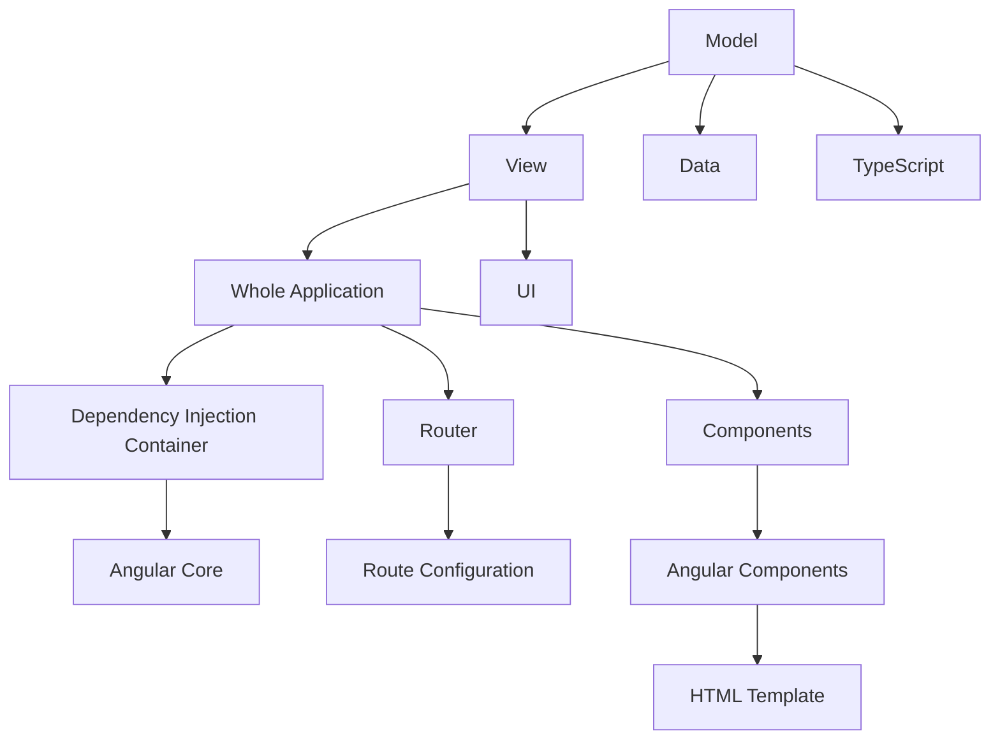

                 

# Angular 框架：Google 的 MVW 框架

> 关键词：Angular, MVW框架, 组件化, 依赖注入, 响应式, TypeScript, 模块化, 模板驱动视图

## 1. 背景介绍

Angular是由Google开发的下一代JavaScript框架，采用MVW（Model-View-Whole）架构模型，提供强大的组件化、依赖注入、响应式数据绑定和模块化功能。Angular在业界广受认可，被广泛应用于构建单页应用、桌面应用和移动应用等不同类型的应用。

本文将深入探讨Angular框架的原理、核心概念及其实现机制，帮助读者全面理解Angular的工作原理和开发技巧，从而更好地使用该框架构建高质量的Web应用。

## 2. 核心概念与联系

### 2.1 核心概念概述

Angular框架的核心概念主要包括：

- **MVW架构模型**：将应用分为数据模型、视图显示和全应用状态三部分，每一部分都有明确的角色和职责。
- **组件化**：将应用拆分为独立的可复用组件，每个组件可以独立开发、测试和部署。
- **依赖注入(DI)**：通过依赖注入容器，管理组件之间的依赖关系，实现模块化和解耦合。
- **响应式数据绑定**：通过双向数据绑定，实现数据和视图之间的实时同步，提高开发效率。
- **TypeScript**：使用静态类型检查的JavaScript超集，提升代码可读性和可维护性。
- **模块化**：将应用划分为多个独立的模块，每个模块负责一个独立的功能，提高应用的组织性和可扩展性。

这些核心概念构成了Angular框架的基石，使得开发人员能够更加高效地构建出高质量的Web应用。

### 2.2 核心概念原理和架构的 Mermaid 流程图



以上是一个简化的Angular架构图，展示了框架的核心组件及其相互关系。

## 3. 核心算法原理 & 具体操作步骤

### 3.1 算法原理概述

Angular框架的算法原理主要体现在以下几个方面：

- **依赖注入(Dependency Injection)**：通过DI容器，管理组件之间的依赖关系，实现模块化和解耦合。
- **响应式数据绑定(Change Detection)**：实现数据和视图之间的实时同步，提高开发效率。
- **组件化(Component-Based Architecture)**：将应用拆分为独立的可复用组件，提高代码的可维护性和可扩展性。

### 3.2 算法步骤详解

**Step 1: 准备开发环境**
- 安装Node.js和npm：Angular是基于Node.js和npm的JavaScript框架，需要先安装Node.js和npm。
- 安装Angular CLI：Angular CLI是Angular框架的命令行工具，用于创建、构建和测试Angular应用。
- 创建Angular项目：使用Angular CLI创建新项目，选择对应的框架版本和应用类型。

**Step 2: 设计应用架构**
- 划分应用模块：将应用按照功能划分多个模块，每个模块负责一个独立的功能。
- 定义组件结构：将每个模块划分为多个独立的组件，每个组件负责一个独立的功能。
- 设计服务接口：定义应用中使用的服务接口，服务接口是应用的核心逻辑。

**Step 3: 实现应用功能**
- 创建组件和模板：使用Angular CLI创建组件和模板文件，定义组件的UI结构和行为。
- 实现组件逻辑：在组件类中实现组件的逻辑，通过依赖注入管理组件之间的依赖关系。
- 定义数据模型：定义数据模型，用于存储和处理应用数据。
- 实现业务逻辑：在服务类中实现业务逻辑，用于处理应用的核心功能。

**Step 4: 配置应用路由**
- 配置路由规则：使用Angular的路由模块配置路由规则，将URL映射到相应的组件。
- 实现路由守卫：在路由中实现路由守卫，防止未授权用户访问应用功能。

**Step 5: 优化应用性能**
- 实现懒加载：使用Angular的懒加载功能，只加载需要的组件和模块，提高应用的加载速度。
- 使用模板缓存：使用模板缓存技术，减少模板的渲染次数，提高应用性能。
- 实现数据缓存：使用数据缓存技术，减少数据请求次数，提高应用响应速度。

**Step 6: 测试和部署**
- 编写单元测试：使用Angular CLI编写单元测试，测试组件和服务的逻辑。
- 编写端到端测试：使用Angular CLI编写端到端测试，测试应用的整体功能。
- 部署应用：使用Angular CLI部署应用，生成生产环境所需的代码和配置。

### 3.3 算法优缺点

Angular框架的优点包括：

- **模块化和组件化**：将应用划分为多个独立的模块和组件，提高了代码的可维护性和可扩展性。
- **依赖注入**：通过DI容器管理组件之间的依赖关系，实现了模块化和解耦合，提高了开发效率。
- **响应式数据绑定**：实现了数据和视图之间的实时同步，提高了开发效率和用户体验。
- **TypeScript**：使用静态类型检查的JavaScript超集，提升了代码可读性和可维护性。

Angular框架的缺点包括：

- **学习曲线陡峭**：Angular框架的学习曲线比较陡峭，需要花费一定时间进行学习和实践。
- **性能问题**：由于Angular的框架复杂性，应用性能可能不如原生JavaScript开发的应用。
- **依赖注入复杂性**：Angular的依赖注入机制比较复杂，需要开发人员具备一定的DI经验。

### 3.4 算法应用领域

Angular框架可以应用于各种类型的Web应用，包括：

- **单页应用(Single-Page Application, SPA)**：如Google Play商店、Trello等。
- **桌面应用**：如Angular CLI、Angular Material等。
- **移动应用**：如Ionic框架等。
- **企业级应用**：如电商平台、金融系统等。

## 4. 数学模型和公式 & 详细讲解 & 举例说明

### 4.1 数学模型构建

Angular框架的核心数学模型主要包括：

- **依赖注入图(Dependency Injection Graph)**：描述组件之间的依赖关系。
- **响应式数据模型(Reactive Data Model)**：描述数据模型和视图之间的数据流。
- **路由图(Routing Graph)**：描述URL和组件之间的映射关系。

### 4.2 公式推导过程

假设有一个Angular应用，包含两个组件A和B，A依赖于B，B依赖于C，C依赖于A和B。我们可以使用以下公式表示依赖注入图：

```
A --> B
B --> C
C --> A, B
```

这表明组件A依赖于组件B，组件B依赖于组件C，组件C依赖于组件A和B。

### 4.3 案例分析与讲解

假设有一个Angular应用，包含一个数据模型和一个视图，数据模型存储了一个数组，视图显示了这个数组的内容。我们可以使用以下公式表示响应式数据模型：

```
DataModel --> View
```

这表明视图的数据模型是响应式的，当数据模型发生变化时，视图会自动更新。

## 5. 项目实践：代码实例和详细解释说明

### 5.1 开发环境搭建

**安装Node.js和npm**

```bash
$ curl -fsSL https://deb.nodesource.com/setup_18.x | sudo -E bash -
$ sudo apt-get install -y nodejs
$ sudo apt-get install -y npm
```

**安装Angular CLI**

```bash
$ npm install -g @angular/cli
```

### 5.2 源代码详细实现

以下是一个简单的Angular组件的示例代码：

```typescript
// 组件类
import { Component } from '@angular/core';

@Component({
  selector: 'app-counter',
  template: `
    <div>
      <h1>Counter: {{ counter }}</h1>
      <button (click)="increment()">Increment</button>
      <button (click)="decrement()">Decrement</button>
    </div>
  `
})
export class CounterComponent {
  counter = 0;

  increment() {
    this.counter++;
  }

  decrement() {
    this.counter--;
  }
}
```

以上代码定义了一个简单的计数器组件，包含一个计数器和一个增加和减少按钮。

### 5.3 代码解读与分析

**组件类**

- 组件类定义了组件的行为和状态，是一个普通的JavaScript类。
- 组件类必须使用`@Component`装饰器进行装饰，并指定组件的标签名和模板。

**模板**

- 模板定义了组件的UI结构，使用双花括号`{{}}`进行数据绑定。
- 模板中的事件监听器使用`(click)`进行绑定，可以触发组件的相应方法。

### 5.4 运行结果展示

```bash
$ ng serve
```

以上命令启动Angular应用，并在浏览器中打开应用。在浏览器中，可以看到计数器的数值，点击按钮可以改变计数器的数值。

## 6. 实际应用场景

Angular框架可以应用于各种类型的Web应用，以下是一些实际应用场景：

### 6.1 单页应用(SPA)

Angular的SPA架构非常适合构建高性能、响应式和可维护的Web应用。Angular的路由和响应式数据绑定特性，使得开发人员可以方便地构建复杂的单页应用。

### 6.2 桌面应用

Angular的桌面应用开发框架Angular Material提供了丰富的UI组件和样式，可以方便地开发高质量的桌面应用。

### 6.3 移动应用

Angular的移动应用框架Ionic提供了一套完整的移动UI组件和路由解决方案，可以方便地开发跨平台的移动应用。

### 6.4 企业级应用

Angular的模块化和组件化特性，使得开发人员可以方便地构建复杂的企业级应用。Angular的服务和依赖注入特性，使得企业级应用更加可扩展和可维护。

## 7. 工具和资源推荐

### 7.1 学习资源推荐

- **Angular官方文档**：Angular官方文档是学习Angular的最佳资源，包含了Angular的完整介绍和示例代码。
- **Angular在中国**：Angular在中国社区提供的Angular相关学习资源和资料。
- **Vue与Angular实战**：开源书籍，介绍了Vue和Angular的实际开发应用案例。

### 7.2 开发工具推荐

- **Visual Studio Code**：VS Code是Angular的官方编辑器，支持Angular的智能提示、语法高亮和代码自动补全功能。
- **GitHub**：GitHub提供了Angular的源代码和社区贡献，方便开发人员进行代码协作和版本控制。

### 7.3 相关论文推荐

- **Angular架构设计**：论文介绍了Angular框架的设计思路和架构模型。
- **Angular依赖注入**：论文介绍了Angular的依赖注入机制和实现原理。

## 8. 总结：未来发展趋势与挑战

### 8.1 研究成果总结

Angular框架采用MVW架构模型，提供了强大的组件化、依赖注入、响应式数据绑定和模块化功能，已经广泛应用于各种类型的Web应用。

### 8.2 未来发展趋势

Angular框架的未来发展趋势包括：

- **TypeScript支持**：Angular将进一步提升对TypeScript的支持，提高代码的可读性和可维护性。
- **性能优化**：Angular将进一步优化应用性能，提高应用的响应速度和加载速度。
- **生态系统完善**：Angular将进一步完善其生态系统，提供更多高质量的UI组件和工具。

### 8.3 面临的挑战

Angular框架面临的挑战包括：

- **学习曲线陡峭**：Angular的学习曲线比较陡峭，需要开发人员具备一定的经验。
- **性能问题**：Angular的应用性能可能不如原生JavaScript开发的应用。
- **依赖注入复杂性**：Angular的依赖注入机制比较复杂，需要开发人员具备一定的DI经验。

### 8.4 研究展望

未来，Angular将进一步提升对TypeScript的支持，优化应用性能，完善其生态系统，以应对学习曲线陡峭和性能问题等挑战，为开发人员提供更好的开发工具和资源。

## 9. 附录：常见问题与解答

**Q1: Angular与React和Vue的区别是什么？**

A: Angular、React和Vue都是现代JavaScript框架，它们的主要区别在于架构模型和设计理念。Angular采用MVW架构模型，强调组件化、依赖注入和响应式数据绑定，适合构建大型复杂应用。React采用组件化架构，强调组件复用和状态管理，适合构建高性能的数据驱动应用。Vue采用MVVM架构模型，强调模板驱动视图，适合构建轻量级和中型应用。

**Q2: Angular如何实现双向数据绑定？**

A: Angular通过使用响应式数据模型和数据绑定语法，实现数据和视图之间的双向绑定。当数据模型发生变化时，视图会自动更新，反之亦然。

**Q3: Angular的依赖注入(DI)机制是如何工作的？**

A: Angular的DI机制通过DI容器管理组件之间的依赖关系，实现了模块化和解耦合。DI容器负责创建和注入组件所需的依赖对象，确保组件能够正常运行。

**Q4: Angular的模块化是如何实现的？**

A: Angular的模块化通过将应用划分为多个独立的模块，每个模块负责一个独立的功能，提高应用的组织性和可扩展性。模块之间通过依赖注入进行通信，实现了模块的解耦合和复用。

**Q5: Angular的性能问题是如何优化的？**

A: Angular的性能问题可以通过懒加载、模板缓存和数据缓存等技术进行优化。懒加载可以减少应用的加载体积，模板缓存可以减少模板的渲染次数，数据缓存可以减少数据请求次数，提高应用响应速度。

---

作者：禅与计算机程序设计艺术 / Zen and the Art of Computer Programming

