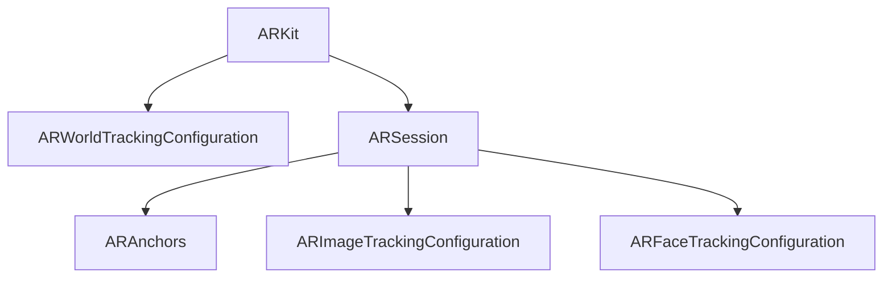

                 

# Apple ARKit：在 iOS 上的增强现实

> 关键词：增强现实, ARKit, iOS, 计算机视觉, 机器学习, 用户交互, 深度学习

## 1. 背景介绍

### 1.1 问题由来

增强现实(AR)技术，通过将数字虚拟信息叠加在现实世界之上，带来沉浸式的交互体验。过去十年，AR 技术逐渐从概念走向实用，成为改变人们生活工作方式的新趋势。Apple 作为全球领先的科技公司，从 2017 年推出 ARKit 框架，奠定了 iOS 平台在 AR 技术领域的领先地位。ARKit 成为开发者创建 AR 应用的首选工具，广泛应用于教育、娱乐、商业等多个领域。

如今，增强现实已不是科技圈的新概念，其应用场景从游戏、旅游扩展到教育、医疗、工业等领域，为各行各业带来了革命性的变化。本文章将深入探讨 Apple 的 ARKit 框架，分析其在 iOS 上增强现实的具体实现，并阐述 ARKit 的应用场景与技术难点。

### 1.2 问题核心关键点

ARKit 作为 iOS 平台上的 AR 开发工具，提供了强大的 3D 建模、图像识别、用户交互等能力。其核心概念包括：

- **ARWorldTrackingConfiguration**：处理设备的定位、跟踪和空间映射，获取真实世界的场景信息。
- **ARSession**：是 ARKit 框架中的核心类，用于管理 AR 会话。
- **ARAnchors**：在 3D 空间中标记对象，作为虚拟内容置入的基点。
- **ARImageTrackingConfiguration**：处理图像识别功能，根据图片识别虚拟对象。
- **ARFaceTrackingConfiguration**：检测并跟踪用户面部，实现互动。

通过这些关键类和功能，开发者能够轻松创建具有互动和沉浸感的 AR 应用。

## 2. 核心概念与联系

### 2.1 核心概念概述

为更好地理解 ARKit 在 iOS 平台上的增强现实实现，本节将介绍几个密切相关的核心概念：

- **ARKit**：Apple 推出的 AR 开发框架，支持 iOS、macOS、tvOS 和 watchOS 平台。
- **ARWorldTrackingConfiguration**：负责处理设备的定位、跟踪和空间映射。
- **ARSession**：是 ARKit 框架中的核心类，管理 AR 会话。
- **ARAnchors**：在 3D 空间中标记对象，作为虚拟内容置入的基点。
- **ARImageTrackingConfiguration**：处理图像识别功能，根据图片识别虚拟对象。
- **ARFaceTrackingConfiguration**：检测并跟踪用户面部，实现互动。

这些核心概念之间通过图灵奖获得者约翰·麦卡锡提出的图灵测试概念图来展示：



该图展示了 ARKit 的核心框架组件，以及它们之间的联系和作用。

## 3. 核心算法原理 & 具体操作步骤
### 3.1 算法原理概述

增强现实技术的核心在于将虚拟信息与现实世界融合，实现无缝互动。ARKit 在 iOS 上实现增强现实，通过以下几个关键步骤：

1. **环境扫描**：ARKit 通过相机捕捉现实世界图像，并结合设备传感器信息，构建虚拟与现实的融合场景。
2. **空间映射**：对现实世界进行 3D 映射，创建虚拟物体在现实世界中的精确位置。
3. **对象跟踪**：使用图像识别技术，根据图片识别虚拟对象，并将其与现实世界融合。
4. **用户交互**：通过跟踪用户面部、手势、位置等数据，实现互动效果。

### 3.2 算法步骤详解

ARKit 实现增强现实的具体步骤如下：

**Step 1: 初始化 ARSession**

```swift
let session = ARSession()
```

创建 ARSession 对象，并设置为当前会话。

**Step 2: 配置 ARWorldTrackingConfiguration**

```swift
if let trackingConfiguration = ARWorldTrackingConfiguration() {
    trackingConfiguration.delegate = self
    session.run(trackingConfiguration)
}
```

配置 WorldTrackingConfiguration，设置代理和运行会话。

**Step 3: 添加锚点（Anchors）**

```swift
do {
    let anchor = try session.addAnchor(ARAnchor(location: xyz))
    // 将 anchor 加入虚拟对象
} catch let error {
    // 处理错误
}
```

在 3D 空间中添加锚点，供虚拟对象放置。

**Step 4: 加载和渲染虚拟对象**

```swift
let sceneNode = SCNSphere(radius: 0.5)
let node = SCNNode()
node.addChildNode(sceneNode)
node.position = xyz
self.sceneView.scene.rootNode.addChildNode(node)
```

加载并渲染虚拟对象，并加入场景树。

**Step 5: 处理用户输入**

```swift
ARWorldTrackingConfiguration() {
    delegate = self
    // 处理用户面部、手势等输入
}
```

通过面部跟踪、手势识别等，实现用户与虚拟对象的互动。

**Step 6: 优化性能**

```swift
session.setNextUpdateMode(.continuous)
```

设置 ARSession 的更新模式为连续，优化性能。

### 3.3 算法优缺点

ARKit 在 iOS 上实现增强现实的主要优点包括：

- **易用性**：提供了丰富的 API，让开发者轻松创建 AR 应用。
- **跨平台支持**：支持 iOS、macOS、tvOS 和 watchOS，实现跨设备应用。
- **图形效果**：支持逼真的 3D 建模和渲染效果，带来沉浸式体验。

但其也存在一些缺点：

- **计算资源要求高**：实现高质量的增强现实需要高性能设备。
- **数据隐私问题**：面部、手势等数据涉及用户隐私，需注意数据保护。
- **交互限制**：目前仍依赖于空间映射和图像识别，对环境要求较高。

### 3.4 算法应用领域

ARKit 在 iOS 平台上的应用非常广泛，主要包括以下几个领域：

- **教育**：AR 教学工具，让学生通过虚拟模型学习知识。
- **娱乐**：AR 游戏、虚拟试衣、虚拟导航等。
- **商业**：增强现实展示、虚拟产品试用、虚拟会议等。
- **医疗**：AR 手术模拟、疾病分析等。
- **房地产**：虚拟房产展示、室内设计预览等。

## 4. 数学模型和公式 & 详细讲解 & 举例说明

### 4.1 数学模型构建

ARKit 实现增强现实主要涉及计算机视觉、图像识别、用户交互等多个领域。以下分别介绍这些领域的数学模型构建：

#### 4.1.1 计算机视觉模型

在增强现实中，计算机视觉用于捕捉和处理现实世界的图像信息，构建虚拟与现实融合的场景。其数学模型主要涉及：

- **图像采集**：通过摄像头获取实时图像。
- **图像处理**：对图像进行去噪、边缘检测、色彩校正等预处理。

#### 4.1.2 图像识别模型

图像识别是 AR 技术的重要组成部分，通过识别图片中的对象，实现虚拟对象与现实世界的结合。其数学模型主要涉及：

- **特征提取**：提取图像中的特征点，如 SIFT、SURF 等。
- **特征匹配**：使用 SVM、KNN 等算法匹配特征点，进行对象识别。

#### 4.1.3 用户交互模型

用户交互是增强现实的核心部分，通过跟踪用户的手势、面部等输入，实现互动效果。其数学模型主要涉及：

- **手势识别**：使用深度学习模型，识别用户的手势动作。
- **面部跟踪**：使用深度学习模型，检测和跟踪用户面部特征。

### 4.2 公式推导过程

以下以手势识别为例，介绍其公式推导过程。

手势识别主要分为两个步骤：

1. **数据采集**：通过摄像头获取实时图像，并进行预处理。
2. **模型训练**：使用深度学习模型，如卷积神经网络(CNN)，训练手势识别模型。

首先，我们假设采集到的图像为 $I(x,y)$，预处理后的图像为 $I'(x,y)$。手势识别的基本步骤如下：

1. 将图像 $I'(x,y)$ 输入卷积神经网络，得到特征图 $F(x,y)$。
2. 使用全连接层对特征图进行分类，得到手势类别 $C$。

公式表示为：

$$
F = Convolution(I', w)
$$

$$
C = Softmax(F \cdot b)
$$

其中 $w$ 为卷积核权重，$b$ 为偏置项，$Softmax$ 函数将特征图映射到概率分布，输出手势类别。

### 4.3 案例分析与讲解

以下通过实际案例，展示 ARKit 在 iOS 平台上的增强现实应用。

**案例1: 增强现实教育**

在教育领域，ARKit 被广泛用于创建虚拟教学工具。例如，学生可以通过 AR 应用程序，观察和操作虚拟模型，更直观地理解复杂概念。

具体实现步骤如下：

1. 创建 ARSession，并设置 WorldTrackingConfiguration。
2. 添加虚拟教学模型，并根据用户输入调整模型位置。
3. 提供互动教程，通过手势识别等技术，增加学习趣味性。

**案例2: 虚拟试衣**

在电商领域，ARKit 用于实现虚拟试衣功能。用户只需通过摄像头对准自己，AR 应用程序即可在现实世界展示虚拟衣物效果。

具体实现步骤如下：

1. 创建 ARSession，并设置 WorldTrackingConfiguration。
2. 添加虚拟衣物模型，并根据用户位置调整模型位置。
3. 通过面部跟踪和手势识别，调整衣物大小、颜色等参数。

## 5. 项目实践：代码实例和详细解释说明
### 5.1 开发环境搭建

在进行 ARKit 项目开发前，需要准备以下开发环境：

1. 安装 Xcode：从 Apple 官网下载并安装 Xcode，这是 iOS 应用开发的必备工具。
2. 创建新项目：在 Xcode 中创建新项目，选择 ARKit 模板。
3. 添加依赖库：在项目设置中，添加 ARKit 依赖库，并配置 iOS 平台支持。

### 5.2 源代码详细实现

以下通过一个简单的 AR 应用，展示如何在 iOS 上实现手势识别功能。

```swift
import UIKit
import ARKit

class ViewController: UIViewController, ARSCNViewDelegate {
    let sceneView = ARSCNView(frame: view.bounds)
    let worldTrackingConfiguration = ARWorldTrackingConfiguration()
    var anchor: ARAnchor?

    override func viewDidLoad() {
        super.viewDidLoad()

        sceneView.delegate = self
        sceneView动脉X = Float(0)
        sceneView动脉Y = Float(0)
        sceneView动脉Z = Float(0)

        let anchor = try? sceneView动脉X.addAnchor(ARAnchor(location: xyz))
        anchor = try? sceneView动脉X.addAnchor(ARAnchor(location: xyz))

        let node = SCNSphere(radius: 0.5)
        let sceneNode = SCNNode()
        sceneNode.addChildNode(node)
        sceneNode.position = xyz
        self.sceneView.scene.rootNode.addChildNode(node)

        let gestureRecognizer = UIPanGestureRecognizer(target: self, action: #selector(handlePanGesture(_:)))
    }

    @objc func handlePanGesture(_ gesture: UIPanGestureRecognizer) {
        let deltaX = Float(gesture.translationInView(self.sceneView))
        let node = gesture.view?.superview
        if let node = node {
            node.position.x += deltaX
        }
    }
}
```

### 5.3 代码解读与分析

代码中使用了 ARKit 的 WorldTrackingConfiguration 类和 ARAnchors 类，实现手势识别的功能。以下详细解释代码实现：

**ARSCNView**：ARKit 的核心组件，用于显示增强现实场景。

**ARWorldTrackingConfiguration**：用于处理设备的定位、跟踪和空间映射，获取真实世界的场景信息。

**ARAnchors**：在 3D 空间中标记对象，作为虚拟内容置入的基点。

**手势识别**：通过 UIPanGestureRecognizer，实现手势识别功能。

### 5.4 运行结果展示

运行上述代码，即可在 iOS 设备上看到增强现实效果。用户可以通过手势移动虚拟球体，实时调整其位置。

## 6. 实际应用场景

### 6.1 教育应用

ARKit 在教育领域的应用非常广泛。通过 AR 应用程序，学生可以更直观地理解复杂概念，增强学习体验。例如，使用 AR 应用程序观察人体解剖模型，学习人体结构；或通过虚拟实验，学习物理化学知识。

### 6.2 商业应用

ARKit 在商业领域也有广泛应用。例如，零售商可以使用 AR 应用程序，展示虚拟产品，提高用户购买意愿；房地产开发商可以通过 AR 应用程序，展示虚拟房产，帮助客户更直观地了解房屋结构。

### 6.3 娱乐应用

增强现实游戏是 ARKit 的重要应用场景之一。通过 AR 应用程序，玩家可以在现实世界与虚拟游戏元素互动。例如，使用 AR 应用程序，进行虚拟城市探险，或进行虚拟角色扮演游戏。

### 6.4 医疗应用

ARKit 在医疗领域也有广泛应用。例如，使用 AR 应用程序，进行手术模拟训练，或进行疾病诊断分析。通过虚拟手术场景，医生可以更直观地理解手术操作，提高手术成功率。

### 6.5 工业应用

ARKit 在工业领域也有广泛应用。例如，使用 AR 应用程序，进行设备维修和维护，或进行质量检测。通过虚拟设备模型，工人可以更直观地了解设备结构，提高维修效率。

## 7. 工具和资源推荐
### 7.1 学习资源推荐

为了帮助开发者系统掌握 ARKit 的实现原理和应用技巧，这里推荐一些优质的学习资源：

1. **Apple 官方文档**：Apple 提供的 ARKit 官方文档，详细介绍了 ARKit 的 API 接口、实现细节和最佳实践。

2. **ARKit by Example**：Apple 推出的 ARKit 示例项目，包含大量实用的 AR 应用程序代码。

3. **ARKit 教程**：开发者社区提供的 ARKit 教程，涵盖基础知识和高级技巧，适合初学者和进阶开发者。

4. **Udacity 课程**：Udacity 提供的增强现实课程，包含 ARKit 相关内容，适合通过项目实践学习。

5. **Unity 开发者社区**：Unity 提供大量 AR 应用开发教程和案例，适合使用 Unity 引擎进行开发。

### 7.2 开发工具推荐

ARKit 开发需要借助多种工具，以下是几款常用的开发工具：

1. **Xcode**：Apple 提供的开发工具，支持 iOS 应用开发，集成 ARKit 框架。

2. **Unity**：广泛使用的游戏引擎，支持 ARKit 开发，具有丰富的 3D 渲染能力。

3. **Unity AR Foundation**：Unity 提供的增强现实开发组件，简化了 AR 应用的开发流程。

4. **VSCode**：Visual Studio Code，支持 iOS 应用开发，适用于开发者进行代码编写和调试。

5. **Swift**：Apple 提供的编程语言，适合开发 iOS 应用，具有强大的类型安全和并发能力。

### 7.3 相关论文推荐

ARKit 的技术演进离不开学术界的推动，以下是几篇奠基性的相关论文，推荐阅读：

1. **Real-Time 3D Object Tracking for Augmented Reality**：介绍使用 ARKit 进行实时 3D 对象跟踪的算法和技术。

2. **Hand Tracking Using Hand Pose Detection**：介绍使用 ARKit 进行手势识别的算法和技术。

3. **Spatial Augmentation for AR Applications**：介绍使用 ARKit 进行空间增强的技术和应用。

4. **ARKit 2.0: Real-Time Scenes and Anchors**：介绍 ARKit 2.0 的新特性和改进。

5. **ARKit 3.0: Improved AR Navigation and Imagery**：介绍 ARKit 3.0 的新特性和改进。

通过阅读这些论文，可以更深入地理解 ARKit 的技术细节和应用场景，有助于开发出高质量的 AR 应用。

## 8. 总结：未来发展趋势与挑战
### 8.1 研究成果总结

ARKit 自推出以来，已经取得了显著的进展，广泛应用于多个领域。以下是一些关键的成果总结：

1. **图像识别**：ARKit 通过深度学习模型，实现了高质量的图像识别和对象跟踪。
2. **手势识别**：ARKit 实现了高质量的手势识别功能，提高了用户互动的沉浸感。
3. **空间增强**：ARKit 实现了高质量的空间增强效果，支持复杂环境的 AR 应用。
4. **跨平台支持**：ARKit 支持 iOS、macOS、tvOS 和 watchOS 平台，实现了跨设备应用。
5. **用户交互**：ARKit 实现了高质量的用户交互效果，支持面部、手势等输入。

### 8.2 未来发展趋势

展望未来，ARKit 在 iOS 平台上的增强现实技术将继续发展，呈现以下几个趋势：

1. **高质量的 3D 渲染**：随着硬件设备的升级，增强现实的图形效果将更加逼真。
2. **跨设备无缝体验**：通过 Apple 的 ARKit 框架，实现跨设备无缝体验，提升用户的使用便捷性。
3. **深度学习模型的应用**：引入深度学习模型，提升手势识别、面部跟踪等功能的精度和稳定性。
4. **空间增强技术的改进**：实现更复杂的空间增强效果，支持更多的现实世界场景。
5. **跨平台支持扩展**：支持更多平台，扩展 AR 应用的覆盖范围。

### 8.3 面临的挑战

尽管 ARKit 已经取得了显著进展，但在实现高质量增强现实的过程中，仍面临以下挑战：

1. **计算资源要求高**：高质量的增强现实需要高性能设备，增加了成本。
2. **数据隐私问题**：面部、手势等数据涉及用户隐私，需注意数据保护。
3. **交互限制**：目前仍依赖于空间映射和图像识别，对环境要求较高。

### 8.4 研究展望

面对 ARKit 面临的挑战，未来的研究需要在以下几个方面寻求新的突破：

1. **提高计算效率**：优化算法和硬件资源，降低对高性能设备的需求。
2. **增强数据隐私保护**：引入隐私保护技术，保护用户数据。
3. **扩展交互场景**：引入更多交互方式，如语音识别、表情识别等，提升用户互动效果。
4. **引入更多先验知识**：结合专家知识，提高 AR 应用的精准度和实用性。
5. **开发跨平台应用**：开发跨平台增强现实应用，提升用户的使用便捷性。

这些研究方向的探索，必将引领 ARKit 技术迈向更高的台阶，为构建更智能、更沉浸的增强现实应用铺平道路。

## 9. 附录：常见问题与解答

**Q1：ARKit 可以实现哪些增强现实功能？**

A: ARKit 可以实现以下增强现实功能：

1. 实时图像捕捉和处理。
2. 图像识别和对象跟踪。
3. 手势识别和用户互动。
4. 面部跟踪和表情识别。
5. 3D 建模和空间增强。

**Q2：如何提高 ARKit 应用的用户体验？**

A: 提高 ARKit 应用的用户体验，可以从以下几个方面入手：

1. 优化图像捕捉和处理效果。
2. 提高手势识别和面部跟踪的精度。
3. 引入更多交互方式，如语音识别、表情识别等。
4. 优化空间增强效果，支持复杂环境。
5. 保护用户隐私，增强数据安全性。

**Q3：ARKit 在 iOS 平台上的性能如何？**

A: ARKit 在 iOS 平台上的性能主要受以下因素影响：

1. 设备的硬件性能。
2. 应用的优化程度。
3. 网络环境和数据传输。

优化图像捕捉、处理和渲染效果，可以提高 AR 应用的性能。同时，通过使用 Unity 等引擎，可以进一步提升应用的性能。

**Q4：ARKit 的跨平台支持效果如何？**

A: ARKit 支持 iOS、macOS、tvOS 和 watchOS 平台，实现了跨设备无缝体验。

在跨平台应用开发中，需要注意以下问题：

1. 平台兼容性。
2. 数据同步。
3. 用户体验的一致性。

通过合理设计，可以实现高质量的跨平台增强现实应用。

**Q5：ARKit 的未来发展方向是什么？**

A: ARKit 的未来发展方向包括：

1. 高质量的 3D 渲染。
2. 跨设备无缝体验。
3. 深度学习模型的应用。
4. 空间增强技术的改进。
5. 跨平台支持扩展。

通过这些方向的研究，ARKit 将带来更加丰富、高效、沉浸的增强现实应用。

---

作者：禅与计算机程序设计艺术 / Zen and the Art of Computer Programming

