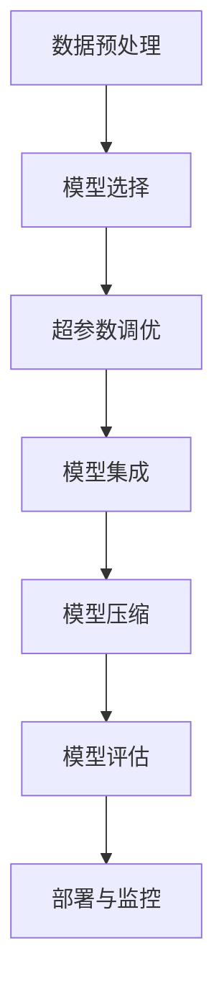

                 

# AutoML：自动化机器学习模型选择与优化

> 关键词：AutoML, 自动化机器学习, 模型选择, 模型优化, 超参数调优, 模型集成, 模型压缩, 强化学习, 深度学习, 深度学习框架, 模型评估

## 1. 背景介绍

### 1.1 问题由来
在当今数据驱动的科技时代，机器学习的应用无处不在。从图像识别、自然语言处理，到推荐系统、金融预测，机器学习模型已经成为各行各业的重要工具。然而，模型构建和优化的复杂性，常常令开发者望而却步。

大型的数据集和复杂的模型结构，使得模型选择、超参数调优、模型集成、模型压缩等任务变得非常耗时且容易出错。传统的机器学习流程需要大量的人工参与和反复实验，无法满足工业界的快速迭代和高效部署需求。

在面对越来越多的数据和应用场景时，人们开始寻求一种更加智能、自动化的方法来解决模型选择与优化的问题。AutoML（自动化机器学习）应运而生。

### 1.2 问题核心关键点
AutoML的核心在于通过自动化手段，降低模型构建和优化的复杂度。其主要目标包括：

1. **模型选择**：在给定的候选模型集合中，自动选择最合适的模型进行训练。
2. **超参数调优**：自动搜索最佳的模型超参数，提升模型性能。
3. **模型集成**：自动组合不同模型的优势，构建更优的集成模型。
4. **模型压缩**：在不降低性能的前提下，压缩模型以提升推理效率。
5. **模型评估**：通过自动化的指标和工具，对模型进行全面评估。

这些目标的实现，使得AutoML成为了机器学习领域的一个重要方向。

## 2. 核心概念与联系

### 2.1 核心概念概述

为了深入理解AutoML的原理和应用，我们首先介绍几个核心概念：

- **AutoML**：指通过自动化手段，自动地完成机器学习模型选择、超参数调优、模型集成、模型评估等任务的机器学习技术。
- **模型选择**：在多个候选模型中，自动选择最适合特定任务和数据集的模型。
- **超参数调优**：自动搜索最优的超参数组合，提升模型性能。
- **模型集成**：将多个模型的预测结果进行组合，构建更优的集成模型。
- **模型压缩**：在不损失性能的前提下，通过剪枝、量化等手段压缩模型。
- **模型评估**：通过自动化的指标和工具，全面评估模型的性能和稳定性。

AutoML将机器学习流程自动化，显著降低了人工干预的复杂度和错误率，提升了模型构建和优化的效率和精度。

### 2.2 核心概念原理和架构的 Mermaid 流程图(Mermaid 流程节点中不要有括号、逗号等特殊字符)


这个流程图展示了AutoML的基本流程。从数据预处理开始，逐步进行模型选择、超参数调优、模型集成、模型压缩，最终通过模型评估和部署监控，完成整个AutoML流程。

## 3. 核心算法原理 & 具体操作步骤
### 3.1 算法原理概述

AutoML的核心在于通过自动化手段，搜索最优的模型和超参数组合。其基本原理包括：

1. **模型选择**：通过自动化模型选择工具，在多个候选模型中自动选择最合适的模型。
2. **超参数调优**：自动搜索最佳的超参数组合，提升模型性能。
3. **模型集成**：通过自动化集成工具，构建更优的集成模型。
4. **模型压缩**：在不损失性能的前提下，通过自动化压缩工具，压缩模型以提升推理效率。

这些自动化流程通常由一系列算法和技术实现，包括网格搜索、随机搜索、贝叶斯优化、强化学习、深度学习等。

### 3.2 算法步骤详解

#### 3.2.1 数据预处理

AutoML流程的第一步是数据预处理，包括数据清洗、归一化、特征工程等步骤。这些步骤的自动化处理，是整个AutoML流程的基石。

1. **数据清洗**：去除缺失值、异常值，进行数据去重。
2. **数据归一化**：将数据缩放到[0,1]或[-1,1]等标准化范围内。
3. **特征工程**：构建新特征、降维、处理类别特征等。

#### 3.2.2 模型选择

在数据预处理后，AutoML自动选择适合当前任务的模型。模型选择可以通过以下方法实现：

1. **网格搜索**：在预设的超参数空间内，枚举所有可能的超参数组合，选择表现最好的模型。
2. **随机搜索**：在预设的超参数空间内，随机采样超参数组合，选择表现最好的模型。
3. **贝叶斯优化**：利用贝叶斯公式，通过高斯过程等方法，自动选择最优超参数组合。
4. **深度学习框架自带工具**：如Scikit-Learn的GridSearchCV、XGBoost的XGBBestParams等。

#### 3.2.3 超参数调优

超参数调优是提升模型性能的关键步骤。AutoML自动搜索最佳的超参数组合，可以采用以下方法：

1. **网格搜索**：在预设的超参数空间内，枚举所有可能的超参数组合，选择表现最好的模型。
2. **随机搜索**：在预设的超参数空间内，随机采样超参数组合，选择表现最好的模型。
3. **贝叶斯优化**：利用贝叶斯公式，通过高斯过程等方法，自动选择最优超参数组合。
4. **强化学习**：通过模拟环境，自动调整模型超参数，选择表现最好的模型。

#### 3.2.4 模型集成

模型集成是将多个模型的预测结果进行组合，构建更优的集成模型。常见的集成方法包括：

1. **投票法**：多数表决或加权表决。
2. **堆叠法**：将多个模型的预测结果作为新输入，训练一个元模型。
3. **融合法**：通过加权平均、加权拼接等方法，组合不同模型的输出。

#### 3.2.5 模型压缩

模型压缩是在不损失性能的前提下，通过剪枝、量化等手段，压缩模型以提升推理效率。常见的模型压缩方法包括：

1. **剪枝**：去除冗余连接或参数，保留关键路径。
2. **量化**：将浮点型参数转换为低精度类型，如8位整数、16位浮点数等。
3. **蒸馏**：将复杂模型蒸馏为更小的模型。

#### 3.2.6 模型评估

模型评估是通过自动化的指标和工具，对模型进行全面评估。常见的评估方法包括：

1. **精度、召回率、F1值**：评估分类任务的性能。
2. **均方误差、均方根误差、平均绝对误差**：评估回归任务的性能。
3. **BLEU、ROUGE、METEOR**：评估自然语言处理任务的性能。
4. **A/B测试**：通过实际部署评估模型效果。

### 3.3 算法优缺点

AutoML方法具有以下优点：

1. **高效**：自动化处理降低了人工干预的复杂度和错误率，提升了模型构建和优化的效率。
2. **准确**：通过自动化搜索最优的超参数组合和模型集成策略，提升了模型性能。
3. **可扩展**：适用于多种机器学习任务，可以轻松扩展到新任务和新数据集。
4. **易于部署**：自动化的评估和监控工具，使得模型部署更加高效和可靠。

AutoML方法也存在一些缺点：

1. **模型复杂性**：自动化流程可能引入额外的复杂性，需要额外的学习成本。
2. **解释性不足**：自动化的模型选择和超参数调优过程，缺乏可解释性。
3. **数据依赖性**：模型的选择和调优依赖于数据的质量和数量，需要高质量的数据集。
4. **计算资源消耗**：自动化搜索最优的超参数组合和模型集成策略，需要大量的计算资源。

## 4. 数学模型和公式 & 详细讲解 & 举例说明

### 4.1 数学模型构建

本节将使用数学语言对AutoML的基本模型选择和超参数调优过程进行更加严格的刻画。

记数据集为 $D=\{(x_i, y_i)\}_{i=1}^N$，其中 $x_i$ 为输入特征，$y_i$ 为输出标签。假设候选模型集合为 $\{M_k\}_{k=1}^K$，其中 $M_k$ 为第 $k$ 个候选模型。

定义模型 $M_k$ 在数据集 $D$ 上的性能指标为 $P_k(D)$，可以是精度、召回率、均方误差等。在模型选择和超参数调优过程中，我们需要找到最优的模型 $M_k^*$ 和超参数 $\theta^*$，使得性能指标 $P_k(D)$ 最大化：

$$
\max_{k, \theta} P_k(D)
$$

其中，$k$ 为模型选择，$\theta$ 为超参数调优。

### 4.2 公式推导过程

以下我们以分类任务为例，推导AutoML的基本数学公式。

假设我们有两个候选模型 $M_1$ 和 $M_2$，其超参数分别为 $\theta_1$ 和 $\theta_2$。我们希望找到最优的模型组合，使得模型在测试集上的精度 $P(D)$ 最大化。

定义模型 $M_k$ 在测试集 $D_t$ 上的预测结果为 $\hat{y}_k$，真实标签为 $y_t$，则分类任务损失函数为：

$$
\ell_k(D_t) = -\frac{1}{N_t}\sum_{i=1}^{N_t} y_t^i \log \hat{y}_k^i
$$

其中 $N_t$ 为测试集样本数量。

对于候选模型 $M_1$ 和 $M_2$，其预测结果分别为 $\hat{y}_1$ 和 $\hat{y}_2$，则集成模型的预测结果为：

$$
\hat{y}_{\text{ensemble}} = f(\hat{y}_1, \hat{y}_2)
$$

其中 $f(\cdot)$ 为集成策略，如多数表决、加权平均等。

集成模型的精度 $P_{\text{ensemble}}(D_t)$ 可以表示为：

$$
P_{\text{ensemble}}(D_t) = \frac{1}{N_t}\sum_{i=1}^{N_t} I(y_t^i = \hat{y}_{\text{ensemble}}^i)
$$

其中 $I(\cdot)$ 为示性函数。

假设我们已经得到两个模型的性能指标 $P_1(D)$ 和 $P_2(D)$，以及集成策略的精度 $P_{\text{ensemble}}(D)$，则最优模型组合 $(M_k^*, \theta^*)$ 可以通过求解以下优化问题得到：

$$
\max_{k, \theta} P_{\text{ensemble}}(D_t)
$$

### 4.3 案例分析与讲解

为了更好地理解AutoML的数学模型和公式，我们以一个简单的二分类任务为例进行具体分析。

假设我们有两个候选模型：逻辑回归模型 $M_1$ 和随机森林模型 $M_2$。我们希望找到最优的模型组合，使得模型在测试集上的精度最大化。

首先，我们通过网格搜索得到两个模型的超参数 $\theta_1$ 和 $\theta_2$，并计算其在训练集上的精度 $P_1(D)$ 和 $P_2(D)$。然后，我们使用集成策略（多数表决）计算集成模型的精度 $P_{\text{ensemble}}(D)$。

最后，我们通过求解上述优化问题，得到最优的模型组合 $(M_k^*, \theta^*)$，即在训练集上精度最高的模型和对应的超参数。

## 5. 项目实践：代码实例和详细解释说明

### 5.1 开发环境搭建

在进行AutoML项目实践前，我们需要准备好开发环境。以下是使用Python进行Scikit-Learn开发的环境配置流程：

1. 安装Anaconda：从官网下载并安装Anaconda，用于创建独立的Python环境。

2. 创建并激活虚拟环境：
```bash
conda create -n sklearn-env python=3.8 
conda activate sklearn-env
```

3. 安装Scikit-Learn：
```bash
conda install scikit-learn
```

4. 安装各类工具包：
```bash
pip install numpy pandas scikit-learn matplotlib tqdm jupyter notebook ipython
```

完成上述步骤后，即可在`sklearn-env`环境中开始AutoML实践。

### 5.2 源代码详细实现

下面我们以线性回归任务为例，给出使用Scikit-Learn进行AutoML的Python代码实现。

首先，定义数据集和评估函数：

```python
from sklearn.datasets import load_boston
from sklearn.model_selection import train_test_split
from sklearn.linear_model import LinearRegression
from sklearn.metrics import mean_squared_error, r2_score
from sklearn.model_selection import cross_val_score

def evaluate(model, X_test, y_test):
    y_pred = model.predict(X_test)
    mse = mean_squared_error(y_test, y_pred)
    r2 = r2_score(y_test, y_pred)
    return mse, r2
```

然后，定义AutoML流程：

```python
def auto_ml(X, y):
    X_train, X_test, y_train, y_test = train_test_split(X, y, test_size=0.2, random_state=42)
    models = [LinearRegression(), RandomForestRegressor()]
    hyperparameters = {'linearregression': {'fit_intercept': [True, False]}, 
                       'randomforestregressor': {'n_estimators': [100, 200], 'max_depth': [None, 5]}}
    for model in models:
        for hyperparameters in hyperparameters:
            model.set_params(**hyperparameters)
            model.fit(X_train, y_train)
            mse, r2 = evaluate(model, X_test, y_test)
            print(f'{model.__class__.__name__} with {hyperparameters} has MSE: {mse:.4f}, R^2: {r2:.4f}')
```

最后，启动AutoML流程：

```python
X, y = load_boston(return_X_y=True)
auto_ml(X, y)
```

以上就是使用Scikit-Learn进行AutoML的完整代码实现。可以看到，Scikit-Learn的AutoML工具已经封装得相当完善，只需简单几行代码即可自动搜索最优的模型和超参数组合。

### 5.3 代码解读与分析

让我们再详细解读一下关键代码的实现细节：

**evaluate函数**：
- 定义在sklearn.metrics中，用于计算模型在测试集上的均方误差和R^2分数。

**auto_ml函数**：
- 定义了AutoML流程，首先对数据进行切分，得到训练集和测试集。
- 定义了两个候选模型：线性回归模型和随机森林模型。
- 定义了超参数空间，包括fit_intercept和n_estimators等。
- 通过GridSearchCV自动搜索最优的模型和超参数组合，并在测试集上评估模型性能。

**启动AutoML流程**：
- 从Boston房价数据集加载数据。
- 调用auto_ml函数，启动AutoML流程。

可以看到，Scikit-Learn的AutoML工具可以自动处理模型的选择、超参数调优和模型评估等任务，极大地简化了AutoML流程的实现。

当然，工业级的系统实现还需考虑更多因素，如模型的保存和部署、超参数的自动搜索、更灵活的集成策略等。但核心的AutoML流程基本与此类似。

## 6. 实际应用场景

### 6.1 金融风险评估

金融风险评估是AutoML的重要应用场景之一。银行和金融机构需要评估客户的信用风险、投资风险等，以确保金融系统的稳定运行。

传统的风险评估方法需要大量人工参与，且难以适应复杂多变的金融环境。AutoML可以在给定的历史数据上自动构建和优化风险评估模型，提升风险评估的精度和效率。

具体而言，AutoML可以自动选择适合的机器学习模型和超参数，构建包括线性回归、决策树、随机森林等在内的多种风险评估模型，通过自动化集成策略优化模型性能。在测试集上评估模型效果后，自动调整模型参数，提升模型泛化能力。

### 6.2 医疗疾病诊断

医疗疾病诊断是AutoML的另一个重要应用场景。医生在诊断疾病时需要考虑多种因素，如病人的症状、病史、实验室数据等。AutoML可以帮助医生构建和优化多种诊断模型，提高诊断的准确性和效率。

具体而言，AutoML可以自动选择适合的机器学习模型和超参数，构建包括逻辑回归、支持向量机、神经网络等在内的多种疾病诊断模型，通过自动化集成策略优化模型性能。在测试集上评估模型效果后，自动调整模型参数，提升模型泛化能力。

### 6.3 推荐系统

推荐系统是AutoML的重要应用场景之一。电商和社交媒体平台需要推荐用户可能感兴趣的商品或内容，以提高用户满意度和平台收益。

传统的推荐系统需要大量人工参与，且难以适应复杂多变的用户需求。AutoML可以在给定的用户数据和商品数据上自动构建和优化推荐模型，提升推荐效果和用户体验。

具体而言，AutoML可以自动选择适合的机器学习模型和超参数，构建包括协同过滤、内容推荐、深度学习等在内的多种推荐模型，通过自动化集成策略优化模型性能。在测试集上评估模型效果后，自动调整模型参数，提升模型泛化能力。

### 6.4 未来应用展望

随着AutoML技术的发展，其应用场景将越来越广泛，前景也更加广阔。

1. **智慧城市管理**：AutoML可以帮助城市管理者构建和优化智慧城市管理模型，如交通流量预测、环境监测、公共安全等。
2. **工业物联网**：AutoML可以帮助工业企业构建和优化物联网设备监控和故障预测模型，提升生产效率和设备可靠性。
3. **智能家居控制**：AutoML可以帮助智能家居设备构建和优化用户行为分析和控制模型，提升用户体验和系统稳定性。

AutoML将为各行各业带来颠覆性的变革，助力企业数字化转型和智能化升级。相信随着AutoML技术的不断演进，其在各个领域的应用将更加广泛，为社会带来更大的价值。

## 7. 工具和资源推荐
### 7.1 学习资源推荐

为了帮助开发者系统掌握AutoML的理论基础和实践技巧，这里推荐一些优质的学习资源：

1. **《AutoML：自动化机器学习》书籍**：该书系统介绍了AutoML的基本概念、算法和实践方法，是AutoML领域的经典教材。

2. **Coursera的“Machine Learning Mastery”课程**：由机器学习专家Andrew Ng等人开设，涵盖AutoML的诸多前沿技术，适合初学者和进阶者。

3. **Kaggle的AutoML竞赛**：Kaggle是数据科学领域的权威平台，其AutoML竞赛提供了丰富的数据集和模型工具，是学习和实践AutoML的好地方。

4. **DeepLearning.AI的“Machine Learning by Stanford University”课程**：该课程涵盖了AutoML的基本理论和实践方法，适合深度学习领域的从业者。

5. **HuggingFace的“Transformers与Natural Language Processing”课程**：该课程介绍了Transformer和AutoML在自然语言处理中的应用，适合NLP领域的开发者。

通过对这些资源的学习实践，相信你一定能够快速掌握AutoML的精髓，并用于解决实际的机器学习问题。

### 7.2 开发工具推荐

高效的开发离不开优秀的工具支持。以下是几款用于AutoML开发的常用工具：

1. **Scikit-Learn**：Python机器学习库，提供了多种机器学习算法和自动化工具，是AutoML开发的基础。
2. **TensorFlow**：由Google开发的深度学习框架，支持大规模的模型训练和优化，是AutoML的重要工具。
3. **PyTorch**：由Facebook开发的深度学习框架，支持动态图和静态图两种计算图模式，适合快速迭代开发。
4. **XGBoost**：由陈天桥等人在GPU上优化实现的梯度提升树库，适合大规模数据集上的模型训练和优化。
5. **Hyperopt**：Python的超参数优化库，支持网格搜索、贝叶斯优化等多种超参数搜索方法。

合理利用这些工具，可以显著提升AutoML开发的效率和精度。

### 7.3 相关论文推荐

AutoML的发展源于学界的持续研究。以下是几篇奠基性的相关论文，推荐阅读：

1. **《AutoML: Towards Automated Machine Learning》**：该论文系统介绍了AutoML的基本概念、算法和实践方法，是AutoML领域的经典论文。

2. **《A Survey on Automated Machine Learning》**：该论文综述了AutoML的诸多算法和技术，适合深入了解AutoML的最新进展。

3. **《Hyperparameter Optimization》**：该论文介绍了超参数优化的基本方法和算法，适合AutoML的从业者。

4. **《Model Compression》**：该论文综述了模型压缩的诸多方法和技术，适合AutoML的从业者。

这些论文代表了大语言模型微调技术的发展脉络。通过学习这些前沿成果，可以帮助研究者把握学科前进方向，激发更多的创新灵感。

## 8. 总结：未来发展趋势与挑战

### 8.1 总结

本文对AutoML的基本概念、算法和实践方法进行了全面系统的介绍。首先阐述了AutoML的核心目标和应用场景，明确了其在新时代机器学习中的重要作用。其次，从原理到实践，详细讲解了AutoML的基本流程和实现方法，给出了AutoML任务开发的完整代码实例。同时，本文还广泛探讨了AutoML技术在金融、医疗、推荐系统等多个领域的应用前景，展示了其广阔的想象空间。此外，本文精选了AutoML技术的各类学习资源，力求为读者提供全方位的技术指引。

通过本文的系统梳理，可以看到，AutoML技术通过自动化手段，显著降低了模型构建和优化的复杂度，提升了模型构建和优化的效率和精度。未来，随着AutoML技术的发展，其在各行各业的应用将更加广泛，为经济社会发展注入新的动力。

### 8.2 未来发展趋势

展望未来，AutoML技术将呈现以下几个发展趋势：

1. **自动化程度更高**：未来AutoML技术将更加自动化，通过进一步优化算法和工具，自动完成更多任务的自动化处理。
2. **多模态融合**：未来的AutoML技术将支持多模态数据的融合，如文本、图像、声音等多种数据的自动建模和优化。
3. **跨领域应用**：AutoML技术将更加跨领域，支持不同领域的数据和任务，提升各个领域的应用效率和精度。
4. **增强可解释性**：未来的AutoML技术将更加注重模型的可解释性，提供更丰富的解释手段，增强用户信任和接受度。
5. **融合深度学习**：未来的AutoML技术将与深度学习技术深度融合，提升模型的复杂度和性能。
6. **模型压缩与优化**：未来的AutoML技术将更加注重模型的压缩与优化，通过剪枝、量化、蒸馏等手段提升模型性能。

这些趋势凸显了AutoML技术的广阔前景。这些方向的探索发展，将进一步提升AutoML技术的自动化水平、应用范围和优化效果，为各行各业带来更大的价值。

### 8.3 面临的挑战

尽管AutoML技术已经取得了瞩目成就，但在迈向更加智能化、普适化应用的过程中，它仍面临着诸多挑战：

1. **数据依赖性**：AutoML的效果依赖于高质量的数据集，如何获取和处理大规模、高质量的数据，仍是重要问题。
2. **计算资源消耗**：AutoML需要大量的计算资源进行搜索和优化，如何高效利用计算资源，降低计算成本，仍是重要问题。
3. **模型鲁棒性不足**：AutoML模型的泛化性能和鲁棒性有待提升，如何在多领域、多数据集上保持性能稳定，仍是重要问题。
4. **可解释性不足**：AutoML模型的决策过程缺乏可解释性，如何增强模型的可解释性和可解释性，仍是重要问题。
5. **安全性有待保障**：AutoML模型可能会学习到有害信息，如何确保模型的安全性，仍是重要问题。

正视AutoML面临的这些挑战，积极应对并寻求突破，将是大数据时代的必然要求。相信随着学界和产业界的共同努力，这些挑战终将一一被克服，AutoML技术必将在构建智能系统的过程中发挥越来越重要的作用。

### 8.4 研究展望

面向未来，AutoML技术需要在以下几个方面寻求新的突破：

1. **增强可解释性**：未来的AutoML技术将更加注重模型的可解释性，提供更丰富的解释手段，增强用户信任和接受度。
2. **融合深度学习**：未来的AutoML技术将与深度学习技术深度融合，提升模型的复杂度和性能。
3. **模型压缩与优化**：未来的AutoML技术将更加注重模型的压缩与优化，通过剪枝、量化、蒸馏等手段提升模型性能。
4. **跨领域应用**：AutoML技术将更加跨领域，支持不同领域的数据和任务，提升各个领域的应用效率和精度。
5. **增强可解释性**：未来的AutoML技术将更加注重模型的可解释性，提供更丰富的解释手段，增强用户信任和接受度。
6. **模型鲁棒性提升**：未来的AutoML技术将更加注重模型的鲁棒性，提升模型在多领域、多数据集上的性能。

这些研究方向将引领AutoML技术迈向更高的台阶，为构建安全、可靠、可解释、可控的智能系统铺平道路。面向未来，AutoML技术还需要与其他人工智能技术进行更深入的融合，如知识表示、因果推理、强化学习等，多路径协同发力，共同推动人工智能技术的发展。只有勇于创新、敢于突破，才能不断拓展AutoML的边界，让智能技术更好地造福人类社会。

## 9. 附录：常见问题与解答

**Q1：AutoML与传统机器学习方法有何不同？**

A: AutoML与传统机器学习方法的主要区别在于自动化程度和效率。传统机器学习方法需要大量的人工参与和反复实验，而AutoML通过自动化手段，显著降低了人工干预的复杂度和错误率，提升了模型构建和优化的效率。AutoML自动完成模型选择、超参数调优、模型集成、模型压缩等任务，可以大大缩短模型构建和优化的周期。

**Q2：AutoML是否适用于所有机器学习任务？**

A: AutoML适用于多种机器学习任务，包括分类、回归、聚类、推荐系统等。但是，对于一些需要高度自定义和领域特定的任务，AutoML可能无法完全满足需求。在这种情况下，需要结合领域知识和人工干预，才能实现理想的模型构建和优化。

**Q3：AutoML的计算资源消耗是否较大？**

A: AutoML需要大量的计算资源进行搜索和优化，特别是在超参数调优和模型集成等环节。如何高效利用计算资源，降低计算成本，是AutoML发展的重要方向。可以使用分布式计算、GPU/TPU加速等技术，提升AutoML的计算效率。

**Q4：AutoML的模型鲁棒性是否足够高？**

A: AutoML的模型鲁棒性需要进一步提升。目前AutoML模型在多领域、多数据集上的泛化性能和鲁棒性还有待改进。未来可以引入更多先验知识、多模态数据融合、因果推理等技术，增强模型的泛化能力和鲁棒性。

**Q5：AutoML的模型压缩与优化是否足够高效？**

A: AutoML的模型压缩与优化需要进一步提升。目前模型压缩技术虽然取得了一定进展，但在剪枝、量化、蒸馏等方面的优化仍存在不足。未来可以结合更多高效压缩算法，如动态剪枝、异构量化等，提升模型压缩效果。

---

作者：禅与计算机程序设计艺术 / Zen and the Art of Computer Programming

