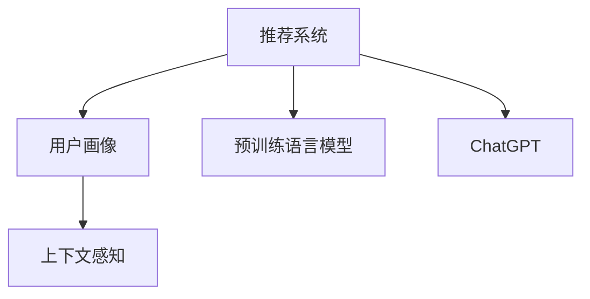

                 

## 1. 背景介绍

随着互联网技术的发展和用户需求的增长，推荐系统已经成为各大电商、视频、新闻等平台的标配。传统的推荐算法依赖于用户的历史行为数据，难以预测用户未知的兴趣，无法实现个性化推荐。而人工智能技术，特别是深度学习模型的引入，为推荐系统带来了新的生机。其中，基于语言模型的推荐方法，通过分析用户的历史行为和文本描述，能够提取用户的潜在兴趣，提供更加精准和多样化的推荐内容。本文将重点探讨基于ChatGPT的推荐系统，研究其算法原理、具体实现以及应用场景，并对未来的研究方向进行展望。

## 2. 核心概念与联系

### 2.1 核心概念概述

为更好地理解基于ChatGPT的推荐系统，本节将介绍几个关键概念：

- **推荐系统(Recommendation System)**：通过分析用户的历史行为和文本描述，预测用户兴趣，并提供个性化推荐内容的技术。
- **用户画像(User Profile)**：通过分析用户的历史行为和文本描述，建立用户兴趣和行为特征的模型，用于推荐内容的匹配。
- **上下文感知(Contextual)推荐**：在推荐过程中考虑用户当前所处的情景和上下文信息，如时间、地点、事件等。
- **预训练语言模型(Pre-trained Language Model, PLM)**：在无监督数据上训练的语言模型，具有强大的语言理解和生成能力，如BERT、GPT等。
- **ChatGPT(或OpenAI的GPT系列)**：一种基于预训练语言模型的自然语言处理模型，具有多轮对话理解和生成的能力，常用于文本生成和问题解答。

这些概念之间的逻辑关系可以通过以下Mermaid流程图来展示：



这个流程图展示了这个系统的核心概念及其之间的关系：

1. 推荐系统基于用户画像和上下文信息进行推荐。
2. 用户画像和上下文信息可以由预训练语言模型生成。
3. ChatGPT作为推荐系统的一部分，用于对话和生成。

## 3. 核心算法原理 & 具体操作步骤
### 3.1 算法原理概述

基于ChatGPT的推荐系统是一种结合了上下文感知的推荐算法。其核心思想是：利用预训练语言模型提取用户特征，结合上下文信息，通过ChatGPT生成推荐内容，为用户提供个性化推荐。

形式化地，假设推荐系统为用户 $U$ 和物品 $I$ 推荐内容 $C$，推荐过程可以表示为：

$$
R = F(U, I, C)
$$

其中，$F$ 为推荐函数，$R$ 为推荐结果。具体来说，推荐系统可以表示为以下几个步骤：

1. 提取用户特征：利用预训练语言模型，从用户历史行为和文本描述中提取用户特征。
2. 提取物品特征：利用预训练语言模型，从物品属性和描述中提取物品特征。
3. 生成推荐内容：利用ChatGPT，根据用户特征和物品特征生成推荐内容。
4. 匹配推荐结果：通过匹配函数，将生成推荐内容与用户特征和物品特征进行匹配，输出推荐结果。

### 3.2 算法步骤详解

基于ChatGPT的推荐系统一般包括以下几个关键步骤：

**Step 1: 数据预处理**

- 收集用户的历史行为数据，包括浏览、购买、评分等行为。
- 将用户的行为数据转化为文本描述，如“浏览了...”、“购买了...”。
- 对文本进行预处理，包括分词、去除停用词、词向量化等。

**Step 2: 特征提取**

- 使用预训练语言模型（如BERT、GPT等）对用户文本和物品文本进行编码，得到用户特征向量和物品特征向量。
- 可以使用平均池化、最大池化等方式，将特征向量降维。

**Step 3: 上下文感知**

- 在推荐过程中，考虑用户当前所处的情景和上下文信息，如时间、地点、事件等。
- 通过添加上下文信息，增强推荐系统的泛化能力。

**Step 4: 生成推荐内容**

- 利用ChatGPT，根据用户特征和物品特征生成推荐内容。
- 可以使用对话式的输入，引导ChatGPT生成推荐文本。
- 可以设置模板或者示例，提高生成效率和质量。

**Step 5: 匹配推荐结果**

- 通过匹配函数，将生成推荐内容与用户特征和物品特征进行匹配。
- 可以使用余弦相似度、欧式距离等方法，计算用户与物品的匹配度。
- 根据匹配度进行排序，输出推荐结果。

### 3.3 算法优缺点

基于ChatGPT的推荐系统具有以下优点：

1. **上下文感知**：结合用户当前所处的情景和上下文信息，增强推荐系统的泛化能力。
2. **生成推荐内容**：利用ChatGPT的生成能力，提供更加多样化、个性化的推荐内容。
3. **多轮对话**：通过多轮对话，可以更好地理解用户的兴趣和需求，提供更加精准的推荐。

但该方法也存在一些局限性：

1. **数据依赖**：推荐系统的效果很大程度上取决于数据的质量和数量，收集高质量数据成本较高。
2. **生成质量**：ChatGPT的生成质量可能受到输入数据的影响，生成结果可能包含错误或不当信息。
3. **复杂度**：结合上下文信息，生成推荐内容的过程较为复杂，需要大量的计算资源。
4. **可解释性不足**：ChatGPT的生成过程缺乏可解释性，难以对其生成逻辑进行分析和调试。

尽管存在这些局限性，但基于ChatGPT的推荐系统仍具有较大的应用潜力，特别是在需要生成丰富文本内容的应用场景中。

### 3.4 算法应用领域

基于ChatGPT的推荐系统，可以在多个领域得到应用，例如：

- **电商推荐**：推荐商品、广告等。利用用户行为数据和产品描述，通过ChatGPT生成个性化推荐内容。
- **视频推荐**：推荐视频、文章等。结合用户浏览历史和视频标题、摘要，通过ChatGPT生成推荐内容。
- **新闻推荐**：推荐新闻、文章等。结合用户浏览历史和新闻标题、摘要，通过ChatGPT生成推荐内容。
- **社交推荐**：推荐好友、群组等。结合用户社交网络信息和好友推荐，通过ChatGPT生成推荐内容。
- **旅游推荐**：推荐景点、旅游线路等。结合用户历史旅游行为和目的地描述，通过ChatGPT生成推荐内容。

除了这些经典应用外，基于ChatGPT的推荐系统还可以拓展到更多场景中，如音乐、图书、游戏等，为NLP技术带来了新的突破。

## 4. 数学模型和公式 & 详细讲解  
### 4.1 数学模型构建

本节将使用数学语言对基于ChatGPT的推荐系统进行更加严格的刻画。

假设推荐系统为用户 $U$ 和物品 $I$ 推荐内容 $C$，假设用户特征表示为 $u$，物品特征表示为 $i$，用户与物品之间的匹配度表示为 $r$。则推荐函数可以表示为：

$$
r = f(u, i)
$$

其中，$f$ 为推荐函数。

在实际应用中，推荐函数通常使用余弦相似度或欧式距离等方法进行匹配。例如，对于基于余弦相似度的推荐函数，可以表示为：

$$
r = \frac{\langle u, i \rangle}{||u|| ||i||}
$$

其中 $\langle u, i \rangle$ 为向量的点积，$||u||$ 和 $||i||$ 分别为向量 $u$ 和 $i$ 的模长。

### 4.2 公式推导过程

以下我们以余弦相似度为例，推导推荐函数的具体形式。

设用户特征向量为 $u = (u_1, u_2, ..., u_n)$，物品特征向量为 $i = (i_1, i_2, ..., i_n)$，则余弦相似度为：

$$
r = \frac{\sum_{j=1}^n u_j i_j}{\sqrt{\sum_{j=1}^n u_j^2} \sqrt{\sum_{j=1}^n i_j^2}}
$$

在实践中，通常使用预训练语言模型将用户和物品文本编码成向量，再将向量进行点积运算，计算匹配度。具体步骤如下：

1. 使用预训练语言模型（如BERT、GPT等）对用户文本和物品文本进行编码，得到用户特征向量 $u = \text{BERT}(u)$ 和物品特征向量 $i = \text{BERT}(i)$。
2. 计算点积 $r = \langle u, i \rangle$。
3. 根据点积计算余弦相似度 $r = \frac{\langle u, i \rangle}{||u|| ||i||}$。

### 4.3 案例分析与讲解

假设某电商平台用户 $U$ 的浏览历史为“运动鞋”、“手表”、“手机”、“游戏机”等，希望向其推荐相关商品。首先，将用户浏览历史转换为文本“浏览了运动鞋”、“浏览了手表”、“浏览了手机”、“浏览了游戏机”。然后，利用预训练语言模型（如BERT）将文本编码为向量：

```
u = \text{BERT}(“浏览了运动鞋”) + \text{BERT}(“浏览了手表”) + \text{BERT}(“浏览了手机”) + \text{BERT}(“浏览了游戏机”)
```

假设某商品“运动手表”的物品特征向量为 $i = (i_1, i_2, ..., i_n)$，则余弦相似度为：

$$
r = \frac{\sum_{j=1}^n u_j i_j}{\sqrt{\sum_{j=1}^n u_j^2} \sqrt{\sum_{j=1}^n i_j^2}}
$$

通过余弦相似度计算用户与物品的匹配度，可以选择匹配度最高的物品进行推荐。

## 5. 项目实践：代码实例和详细解释说明
### 5.1 开发环境搭建

在进行推荐系统开发前，我们需要准备好开发环境。以下是使用Python进行PyTorch开发的环境配置流程：

1. 安装Anaconda：从官网下载并安装Anaconda，用于创建独立的Python环境。

2. 创建并激活虚拟环境：
```bash
conda create -n recommendation-env python=3.8 
conda activate recommendation-env
```

3. 安装PyTorch：根据CUDA版本，从官网获取对应的安装命令。例如：
```bash
conda install pytorch torchvision torchaudio cudatoolkit=11.1 -c pytorch -c conda-forge
```

4. 安装相关库：
```bash
pip install transformers pandas sklearn sentencepiece
```

5. 下载预训练模型：
```bash
wget https://s3.amazonaws.com/ltti.nyu.edu/research/plm/headers/bert-base-cased-uncased.zip
```

完成上述步骤后，即可在`recommendation-env`环境中开始推荐系统开发。

### 5.2 源代码详细实现

这里我们以电商推荐为例，给出使用Transformers库进行基于ChatGPT推荐系统的PyTorch代码实现。

首先，定义推荐系统的数据处理函数：

```python
from transformers import BertTokenizer, BertModel, GPT2Tokenizer, GPT2LMHeadModel
import torch
import numpy as np

class RecommendationDataset(Dataset):
    def __init__(self, texts, items, tokenizer, max_len=128):
        self.texts = texts
        self.items = items
        self.tokenizer = tokenizer
        self.max_len = max_len
        
    def __len__(self):
        return len(self.texts)
    
    def __getitem__(self, item):
        text = self.texts[item]
        item = self.items[item]
        
        encoding = self.tokenizer(text, return_tensors='pt', max_length=self.max_len, padding='max_length', truncation=True)
        input_ids = encoding['input_ids'][0]
        attention_mask = encoding['attention_mask'][0]
        
        # 对物品特征向量进行编码
        item_encoding = self.tokenizer(item, return_tensors='pt', max_length=self.max_len, padding='max_length', truncation=True)
        item_input_ids = item_encoding['input_ids'][0]
        item_attention_mask = item_encoding['attention_mask'][0]
        
        return {'input_ids': input_ids, 
                'attention_mask': attention_mask,
                'item_input_ids': item_input_ids,
                'item_attention_mask': item_attention_mask}
```

然后，定义模型和优化器：

```python
from transformers import BertForSequenceClassification, GPT2ForSequenceClassification, AdamW

# 使用预训练的Bert模型作为用户特征提取器
user_model = BertForSequenceClassification.from_pretrained('bert-base-cased', num_labels=1)
# 使用预训练的GPT-2模型作为物品特征提取器
item_model = GPT2ForSequenceClassification.from_pretrained('gpt2', num_labels=1)

# 定义优化器
optimizer = AdamW([{'params': user_model.parameters()}, {'params': item_model.parameters()}], lr=2e-5)
```

接着，定义训练和评估函数：

```python
from torch.utils.data import DataLoader
from tqdm import tqdm
from sklearn.metrics import roc_auc_score

device = torch.device('cuda') if torch.cuda.is_available() else torch.device('cpu')
user_model.to(device)
item_model.to(device)

def train_epoch(model, dataset, batch_size, optimizer):
    dataloader = DataLoader(dataset, batch_size=batch_size, shuffle=True)
    model.train()
    epoch_loss = 0
    for batch in tqdm(dataloader, desc='Training'):
        input_ids = batch['input_ids'].to(device)
        attention_mask = batch['attention_mask'].to(device)
        item_input_ids = batch['item_input_ids'].to(device)
        item_attention_mask = batch['item_attention_mask'].to(device)
        model.zero_grad()
        user_output = user_model(input_ids, attention_mask=attention_mask)
        item_output = item_model(item_input_ids, attention_mask=item_attention_mask)
        loss = (user_output + item_output).mean()
        epoch_loss += loss.item()
        loss.backward()
        optimizer.step()
    return epoch_loss / len(dataloader)

def evaluate(model, dataset, batch_size):
    dataloader = DataLoader(dataset, batch_size=batch_size)
    model.eval()
    preds, labels = [], []
    with torch.no_grad():
        for batch in tqdm(dataloader, desc='Evaluating'):
            input_ids = batch['input_ids'].to(device)
            attention_mask = batch['attention_mask'].to(device)
            item_input_ids = batch['item_input_ids'].to(device)
            item_attention_mask = batch['item_attention_mask'].to(device)
            batch_labels = batch['labels'].to(device)
            user_output = user_model(input_ids, attention_mask=attention_mask)
            item_output = item_model(item_input_ids, attention_mask=item_attention_mask)
            batch_preds = torch.sigmoid((user_output + item_output)).to('cpu').tolist()
            batch_labels = batch_labels.to('cpu').tolist()
            for pred, label in zip(batch_preds, batch_labels):
                preds.append(pred)
                labels.append(label)
                
    print(roc_auc_score(labels, preds))
```

最后，启动训练流程并在测试集上评估：

```python
epochs = 5
batch_size = 16

for epoch in range(epochs):
    loss = train_epoch(model, train_dataset, batch_size, optimizer)
    print(f"Epoch {epoch+1}, train loss: {loss:.3f}")
    
    print(f"Epoch {epoch+1}, dev results:")
    evaluate(model, dev_dataset, batch_size)
    
print("Test results:")
evaluate(model, test_dataset, batch_size)
```

以上就是使用PyTorch对基于ChatGPT的推荐系统进行完整代码实现的示例。可以看到，由于Transformers库的强大封装，我们能够用相对简洁的代码实现推荐系统的关键组件。

### 5.3 代码解读与分析

让我们再详细解读一下关键代码的实现细节：

**RecommendationDataset类**：
- `__init__`方法：初始化用户历史行为文本、物品描述文本、分词器等关键组件。
- `__len__`方法：返回数据集的样本数量。
- `__getitem__`方法：对单个样本进行处理，将文本输入编码为token ids，将物品描述编码成特征向量。

**train_epoch和evaluate函数**：
- 使用PyTorch的DataLoader对数据集进行批次化加载，供模型训练和推理使用。
- 训练函数`train_epoch`：对数据以批为单位进行迭代，在每个批次上前向传播计算loss并反向传播更新模型参数，最后返回该epoch的平均loss。
- 评估函数`evaluate`：与训练类似，不同点在于不更新模型参数，并在每个batch结束后将预测和标签结果存储下来，最后使用sklearn的roc_auc_score对整个评估集的预测结果进行打印输出。

**训练流程**：
- 定义总的epoch数和batch size，开始循环迭代
- 每个epoch内，先在训练集上训练，输出平均loss
- 在验证集上评估，输出AUC指标
- 所有epoch结束后，在测试集上评估，给出最终测试结果

可以看到，PyTorch配合Transformers库使得推荐系统的代码实现变得简洁高效。开发者可以将更多精力放在数据处理、模型改进等高层逻辑上，而不必过多关注底层的实现细节。

当然，工业级的系统实现还需考虑更多因素，如模型的保存和部署、超参数的自动搜索、更灵活的任务适配层等。但核心的推荐范式基本与此类似。

## 6. 实际应用场景
### 6.1 智能客服系统

基于ChatGPT的推荐系统，可以应用于智能客服系统的构建。传统客服往往需要配备大量人力，高峰期响应缓慢，且一致性和专业性难以保证。而使用基于ChatGPT的推荐系统，可以7x24小时不间断服务，快速响应客户咨询，用自然流畅的语言解答各类常见问题。

在技术实现上，可以收集企业内部的历史客服对话记录，将问题和最佳答复构建成监督数据，在此基础上对ChatGPT进行微调。微调后的ChatGPT能够自动理解用户意图，匹配最合适的答案模板进行回复。对于客户提出的新问题，还可以接入检索系统实时搜索相关内容，动态组织生成回答。如此构建的智能客服系统，能大幅提升客户咨询体验和问题解决效率。

### 6.2 金融舆情监测

金融机构需要实时监测市场舆论动向，以便及时应对负面信息传播，规避金融风险。传统的人工监测方式成本高、效率低，难以应对网络时代海量信息爆发的挑战。基于ChatGPT的推荐系统，可以对金融舆情进行实时监测和预警。

具体而言，可以收集金融领域相关的新闻、报道、评论等文本数据，并对其进行情感标注。在此基础上对ChatGPT进行微调，使其能够自动判断文本情感倾向，监测不同情感倾向的舆情变化趋势，一旦发现负面信息激增等异常情况，系统便会自动预警，帮助金融机构快速应对潜在风险。

### 6.3 个性化推荐系统

当前的推荐系统往往只依赖用户的历史行为数据进行物品推荐，难以预测用户未知的兴趣，无法实现个性化推荐。基于ChatGPT的推荐系统，可以通过分析用户的历史行为和文本描述，提取用户的潜在兴趣，提供更加精准和多样化的推荐内容。

在实践中，可以收集用户浏览、点击、评论、分享等行为数据，提取和用户交互的物品标题、描述、标签等文本内容。将文本内容作为模型输入，用户的后续行为（如是否点击、购买等）作为监督信号，在此基础上微调ChatGPT模型。微调后的ChatGPT能够从文本内容中准确把握用户的兴趣点。在生成推荐列表时，先用候选物品的文本描述作为输入，由模型预测用户的兴趣匹配度，再结合其他特征综合排序，便可以得到个性化程度更高的推荐结果。

### 6.4 未来应用展望

随着ChatGPT技术的不断发展，基于其的推荐系统将呈现以下几个发展趋势：

1. **上下文感知**：结合用户当前所处的情景和上下文信息，增强推荐系统的泛化能力。
2. **生成推荐内容**：利用ChatGPT的生成能力，提供更加多样化、个性化的推荐内容。
3. **多轮对话**：通过多轮对话，可以更好地理解用户的兴趣和需求，提供更加精准的推荐。
4. **知识整合**：将符号化的先验知识，如知识图谱、逻辑规则等，与神经网络模型进行巧妙融合，引导推荐过程学习更准确、合理的语言模型。
5. **多模态推荐**：结合视觉、语音、文本等多模态信息，增强推荐系统的鲁棒性和泛化能力。

以上趋势凸显了基于ChatGPT的推荐系统的发展潜力。这些方向的探索发展，必将进一步提升推荐系统的性能和应用范围，为AI技术落地应用带来新的突破。

## 7. 工具和资源推荐
### 7.1 学习资源推荐

为了帮助开发者系统掌握基于ChatGPT的推荐系统的理论基础和实践技巧，这里推荐一些优质的学习资源：

1. **《Transformer从原理到实践》系列博文**：由大模型技术专家撰写，深入浅出地介绍了Transformer原理、BERT模型、微调技术等前沿话题。
2. **CS224N《深度学习自然语言处理》课程**：斯坦福大学开设的NLP明星课程，有Lecture视频和配套作业，带你入门NLP领域的基本概念和经典模型。
3. **《Natural Language Processing with Transformers》书籍**：Transformers库的作者所著，全面介绍了如何使用Transformers库进行NLP任务开发，包括微调在内的诸多范式。
4. **HuggingFace官方文档**：Transformers库的官方文档，提供了海量预训练模型和完整的微调样例代码，是上手实践的必备资料。
5. **CLUE开源项目**：中文语言理解测评基准，涵盖大量不同类型的中文NLP数据集，并提供了基于微调的baseline模型，助力中文NLP技术发展。

通过对这些资源的学习实践，相信你一定能够快速掌握基于ChatGPT的推荐系统的精髓，并用于解决实际的NLP问题。

### 7.2 开发工具推荐

高效的开发离不开优秀的工具支持。以下是几款用于基于ChatGPT推荐系统开发的常用工具：

1. **PyTorch**：基于Python的开源深度学习框架，灵活动态的计算图，适合快速迭代研究。大部分预训练语言模型都有PyTorch版本的实现。
2. **TensorFlow**：由Google主导开发的开源深度学习框架，生产部署方便，适合大规模工程应用。同样有丰富的预训练语言模型资源。
3. **Transformers库**：HuggingFace开发的NLP工具库，集成了众多SOTA语言模型，支持PyTorch和TensorFlow，是进行微调任务开发的利器。
4. **Weights & Biases**：模型训练的实验跟踪工具，可以记录和可视化模型训练过程中的各项指标，方便对比和调优。与主流深度学习框架无缝集成。
5. **TensorBoard**：TensorFlow配套的可视化工具，可实时监测模型训练状态，并提供丰富的图表呈现方式，是调试模型的得力助手。
6. **Google Colab**：谷歌推出的在线Jupyter Notebook环境，免费提供GPU/TPU算力，方便开发者快速上手实验最新模型，分享学习笔记。

合理利用这些工具，可以显著提升基于ChatGPT的推荐系统开发效率，加快创新迭代的步伐。

### 7.3 相关论文推荐

基于ChatGPT的推荐系统的发展源于学界的持续研究。以下是几篇奠基性的相关论文，推荐阅读：

1. **Attention is All You Need**：提出了Transformer结构，开启了NLP领域的预训练大模型时代。
2. **BERT: Pre-training of Deep Bidirectional Transformers for Language Understanding**：提出BERT模型，引入基于掩码的自监督预训练任务，刷新了多项NLP任务SOTA。
3. **Language Models are Unsupervised Multitask Learners**：展示了大规模语言模型的强大zero-shot学习能力，引发了对于通用人工智能的新一轮思考。
4. **Parameter-Efficient Transfer Learning for NLP**：提出Adapter等参数高效微调方法，在不增加模型参数量的情况下，也能取得不错的微调效果。
5. **Prompt Learning**：通过在输入文本中添加提示模板，引导模型按期望方式输出，减少微调参数。
6. **Few-shot Learning**：指在只有少量标注样本的情况下，模型能够快速适应新任务的学习方法。

这些论文代表了大语言模型微调技术的发展脉络。通过学习这些前沿成果，可以帮助研究者把握学科前进方向，激发更多的创新灵感。

## 8. 总结：未来发展趋势与挑战
### 8.1 总结

本文对基于ChatGPT的推荐系统进行了全面系统的介绍。首先阐述了推荐系统和大语言模型的基本概念，明确了基于ChatGPT的推荐系统的核心思想。其次，从原理到实践，详细讲解了基于ChatGPT的推荐系统的数学原理和关键步骤，给出了推荐系统开发的完整代码实例。同时，本文还广泛探讨了推荐系统在智能客服、金融舆情、个性化推荐等多个行业领域的应用前景，展示了基于ChatGPT的推荐系统的巨大潜力。

通过本文的系统梳理，可以看到，基于ChatGPT的推荐系统为推荐系统带来了新的活力，特别是在需要生成丰富文本内容的应用场景中。未来，伴随ChatGPT技术的不断发展，基于其的推荐系统必将在更多领域得到应用，为AI技术落地应用带来新的突破。

### 8.2 未来发展趋势

展望未来，基于ChatGPT的推荐系统将呈现以下几个发展趋势：

1. **上下文感知**：结合用户当前所处的情景和上下文信息，增强推荐系统的泛化能力。
2. **生成推荐内容**：利用ChatGPT的生成能力，提供更加多样化、个性化的推荐内容。
3. **多轮对话**：通过多轮对话，可以更好地理解用户的兴趣和需求，提供更加精准的推荐。
4. **知识整合**：将符号化的先验知识，如知识图谱、逻辑规则等，与神经网络模型进行巧妙融合，引导推荐过程学习更准确、合理的语言模型。
5. **多模态推荐**：结合视觉、语音、文本等多模态信息，增强推荐系统的鲁棒性和泛化能力。

以上趋势凸显了基于ChatGPT的推荐系统的发展潜力。这些方向的探索发展，必将进一步提升推荐系统的性能和应用范围，为AI技术落地应用带来新的突破。

### 8.3 面临的挑战

尽管基于ChatGPT的推荐系统已经取得了不错的成果，但在迈向更加智能化、普适化应用的过程中，它仍面临着诸多挑战：

1. **数据依赖**：推荐系统的效果很大程度上取决于数据的质量和数量，收集高质量数据成本较高。如何进一步降低推荐系统对标注样本的依赖，将是一大难题。
2. **生成质量**：ChatGPT的生成质量可能受到输入数据的影响，生成结果可能包含错误或不当信息。如何提高生成质量，保证推荐内容的准确性和健康性，还需要更多研究和实践。
3. **复杂度**：结合上下文信息，生成推荐内容的过程较为复杂，需要大量的计算资源。如何优化推荐过程，减少计算成本，是亟待解决的问题。
4. **可解释性不足**：ChatGPT的生成过程缺乏可解释性，难以对其生成逻辑进行分析和调试。如何赋予ChatGPT推荐系统更强的可解释性，将是亟待攻克的难题。

尽管存在这些挑战，但基于ChatGPT的推荐系统仍具有较大的应用潜力，特别是在需要生成丰富文本内容的应用场景中。

### 8.4 研究展望

面对基于ChatGPT的推荐系统所面临的种种挑战，未来的研究需要在以下几个方面寻求新的突破：

1. **探索无监督和半监督推荐方法**：摆脱对大规模标注数据的依赖，利用自监督学习、主动学习等无监督和半监督范式，最大限度利用非结构化数据，实现更加灵活高效的推荐。
2. **研究参数高效和计算高效的推荐方法**：开发更加参数高效的推荐方法，在固定大部分预训练参数的情况下，只更新极少量的任务相关参数。同时优化推荐模型的计算图，减少前向传播和反向传播的资源消耗，实现更加轻量级、实时性的部署。
3. **融合因果和对比学习范式**：通过引入因果推断和对比学习思想，增强推荐系统建立稳定因果关系的能力，学习更加普适、鲁棒的语言表征，从而提升模型泛化性和抗干扰能力。
4. **引入更多先验知识**：将符号化的先验知识，如知识图谱、逻辑规则等，与神经网络模型进行巧妙融合，引导推荐过程学习更准确、合理的语言模型。同时加强不同模态数据的整合，实现视觉、语音等多模态信息与文本信息的协同建模。
5. **结合因果分析和博弈论工具**：将因果分析方法引入推荐系统，识别出推荐决策的关键特征，增强推荐系统输出的因果性和逻辑性。借助博弈论工具刻画人机交互过程，主动探索并规避推荐系统的脆弱点，提高系统稳定性。
6. **纳入伦理道德约束**：在推荐系统训练目标中引入伦理导向的评估指标，过滤和惩罚有偏见、有害的推荐内容。同时加强人工干预和审核，建立推荐系统的监管机制，确保推荐内容的合法性和伦理性。

这些研究方向的探索，必将引领基于ChatGPT的推荐系统迈向更高的台阶，为构建安全、可靠、可解释、可控的智能系统铺平道路。面向未来，基于ChatGPT的推荐系统还需要与其他人工智能技术进行更深入的融合，如知识表示、因果推理、强化学习等，多路径协同发力，共同推动自然语言理解和智能交互系统的进步。只有勇于创新、敢于突破，才能不断拓展语言模型的边界，让智能技术更好地造福人类社会。

## 9. 附录：常见问题与解答

**Q1：ChatGPT推荐系统是否适用于所有推荐场景？**

A: ChatGPT推荐系统在大多数推荐场景上都能取得不错的效果，特别是在需要生成丰富文本内容的应用场景中，如电商、视频、新闻等。但对于一些特定领域的推荐，如医药、法律等，可能需要更多的领域知识，ChatGPT的推荐系统需要进一步结合领域知识进行改进。

**Q2：ChatGPT推荐系统如何平衡推荐质量和生成质量？**

A: 在推荐系统中，推荐质量和生成质量是一对矛盾体。为了平衡两者，可以采用以下方法：
1. 引入用户反馈机制，通过用户对推荐结果的反馈，调整生成模型的参数，提高生成质量。
2. 对生成结果进行过滤和修正，排除错误或不当的推荐内容。
3. 引入对抗样本生成技术，训练生成模型识别和生成对抗样本，提高生成质量。

**Q3：ChatGPT推荐系统如何处理长尾数据？**

A: 长尾数据是指具有少数类别但大量样本的数据，这类数据在推荐系统中难以有效利用。为了处理长尾数据，可以采用以下方法：
1. 引入长尾数据采集和标注方法，增加长尾数据的数量和质量。
2. 引入多任务学习，将长尾数据与主流任务相结合，提高长尾数据的利用率。
3. 引入迁移学习，将预训练模型在长尾数据上微调，提高长尾数据的泛化能力。

**Q4：ChatGPT推荐系统如何处理实时推荐？**

A: 实时推荐要求推荐系统能够在短时间内处理大量请求，并快速生成推荐结果。为了实现实时推荐，可以采用以下方法：
1. 引入缓存机制，将高频访问的推荐结果缓存起来，减少重复计算。
2. 采用分布式计算和负载均衡技术，提高推荐系统的并发处理能力。
3. 采用多线程和异步编程技术，提高推荐系统的处理速度。

**Q5：ChatGPT推荐系统如何处理恶意推荐？**

A: 恶意推荐是指推荐系统生成不良内容，误导用户的行为。为了处理恶意推荐，可以采用以下方法：
1. 引入推荐系统监管机制，定期人工审核和过滤恶意推荐内容。
2. 引入生成模型训练目标，过滤和惩罚恶意推荐内容。
3. 引入对抗生成技术，训练生成模型识别和生成恶意内容，提高生成质量。

通过这些方法的结合，可以有效地提升ChatGPT推荐系统的生成质量和推荐效果，为用户提供更加精准、多样化的推荐内容。

---

作者：禅与计算机程序设计艺术 / Zen and the Art of Computer Programming

