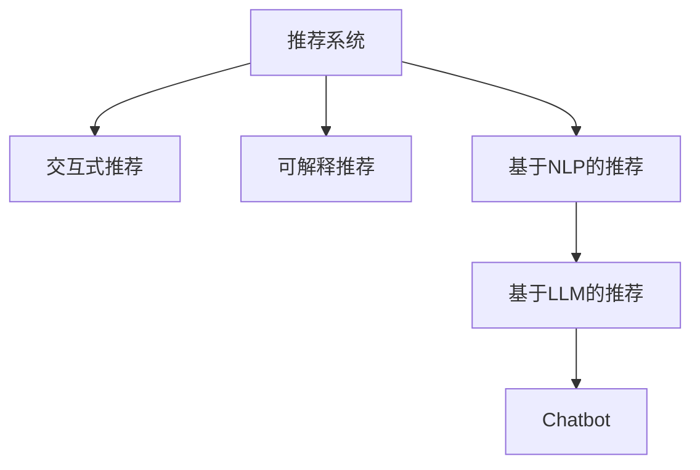

                 

# Chat-REC:交互式可解释的LLM增强推荐系统

> 关键词：推荐系统,聊天机器人,交互式,可解释,LLM

## 1. 背景介绍

### 1.1 问题由来

随着互联网的快速发展，在线内容和服务的多样化，个性化推荐系统在电商、社交、新闻、视频等领域得到广泛应用。传统的推荐系统依赖于用户的历史行为数据，难以捕捉用户隐性需求，存在冷启动问题。交互式推荐系统通过用户与推荐系统的互动，能够实时获取用户反馈，提升推荐效果。

然而，现有的推荐系统多基于深度学习模型，存在黑箱问题，难以解释推荐逻辑和决策过程。用户对于推荐结果的质疑和不满时有发生，阻碍了推荐系统的可信度和接受度。

自然语言处理(NLP)技术的突破，特别是大规模预训练语言模型(LLM)的崛起，为推荐系统带来了新的突破口。LLM能够处理复杂的自然语言数据，捕捉用户意图，解释推荐逻辑，提升用户体验。但现有基于LLM的推荐系统仍存在可解释性不足、推荐效果不稳定等问题，需要通过交互式推荐技术进一步提升。

### 1.2 问题核心关键点

本研究的核心是构建一个交互式、可解释的基于大规模预训练语言模型(LLM)的推荐系统。具体来说，主要关注以下三个关键点：

1. **交互式推荐**：利用用户与系统的对话，实时获取用户反馈，动态调整推荐策略。
2. **可解释推荐**：通过LLM解释推荐逻辑和决策依据，提升用户信任度。
3. **基于LLM的增强推荐**：利用LLM的自然语言处理能力，提升推荐准确性。

本文将详细介绍基于这些核心点构建的Chat-REC系统，并通过系统架构、算法原理、开发实践、应用场景等多方面阐述交互式可解释的LLM增强推荐系统。

## 2. 核心概念与联系

### 2.1 核心概念概述

为更好地理解Chat-REC系统的构建原理，本节将介绍几个密切相关的核心概念：

- **推荐系统(Recommender System)**：基于用户历史行为数据或特征，推荐合适的产品、内容、服务等。常见的推荐系统包括协同过滤、基于内容的推荐、矩阵分解等。

- **交互式推荐(Interactive Recommender System)**：通过用户与系统的互动，实时获取用户反馈，动态调整推荐策略，增强推荐效果。如基于对话的推荐、基于多臂老虎机的推荐等。

- **可解释推荐(Explainable Recommender System)**：通过解释推荐逻辑和决策依据，提升用户信任度和接受度。如基于规则的推荐、基于深度学习的可解释性增强等。

- **自然语言处理(NLP)**：研究计算机如何处理和理解自然语言的技术，包括语言模型、文本分类、情感分析等。

- **大规模预训练语言模型(LLM)**：通过大规模无标签文本数据进行自监督预训练，学习语言的通用表示。常见的LLM包括BERT、GPT等。

- **Chatbot**：能够进行自然语言对话的计算机程序，通过理解和生成自然语言，实现人与机的交互。

这些核心概念之间的逻辑关系可以通过以下Mermaid流程图来展示：



这个流程图展示了几类推荐系统之间的联系：

1. 传统推荐系统通过LLM进行增强，提升推荐效果。
2. 交互式推荐系统通过实时获取用户反馈，动态调整推荐策略。
3. 可解释推荐系统通过解释推荐逻辑，提升用户信任度。
4. 基于NLP的推荐系统通过理解自然语言，提升推荐准确性。
5. 基于LLM的推荐系统通过预训练学习通用语言表示，增强推荐效果。
6. Chatbot通过对话交互，实时获取用户反馈，实现动态推荐。

## 3. 核心算法原理 & 具体操作步骤

### 3.1 算法原理概述

Chat-REC系统的核心算法原理基于以下三个步骤：

1. **交互式对话获取用户反馈**：用户与Chatbot进行自然语言对话，表达需求和反馈。
2. **基于LLM的推荐生成**：通过对话获取的信息，利用LLM生成推荐结果。
3. **可解释推荐结果**：通过解释LLM的生成逻辑，提升推荐结果的可信度和可解释性。

具体来说，Chat-REC系统通过以下三个子算法实现：

1. **对话生成算法**：通过LLM生成自然语言对话，获取用户需求和反馈。
2. **推荐生成算法**：利用LLM生成的对话信息，生成推荐结果。
3. **推荐解释算法**：通过解释LLM的生成逻辑，提升推荐结果的可解释性。

### 3.2 算法步骤详解

#### 3.2.1 对话生成算法

对话生成算法通过LLM生成自然语言对话，获取用户需求和反馈。算法步骤如下：

1. **输入**：用户提出的查询问题和历史行为数据。
2. **预处理**：对输入进行预处理，包括分词、去停用词、词干提取等。
3. **LLM编码**：利用预训练的LLM模型，将查询问题和历史行为数据编码为向量表示。
4. **生成对话**：基于编码后的向量，使用LLM生成对话文本，表达用户需求和反馈。
5. **输出**：对话文本作为系统的输入，用于后续的推荐生成。

#### 3.2.2 推荐生成算法

推荐生成算法利用LLM生成的对话信息，生成推荐结果。算法步骤如下：

1. **输入**：对话文本。
2. **预处理**：对对话文本进行预处理，包括分词、去除停用词、词干提取等。
3. **LLM编码**：利用预训练的LLM模型，将处理后的对话文本编码为向量表示。
4. **生成推荐**：基于编码后的向量，使用LLM生成推荐结果。
5. **输出**：推荐结果作为系统的输出，用于展示给用户。

#### 3.2.3 推荐解释算法

推荐解释算法通过解释LLM的生成逻辑，提升推荐结果的可解释性。算法步骤如下：

1. **输入**：推荐结果。
2. **预处理**：对推荐结果进行预处理，包括分词、去除停用词、词干提取等。
3. **LLM解码**：利用预训练的LLM模型，对推荐结果进行解码，生成解释文本。
4. **输出**：解释文本作为系统的输出，用于展示给用户。

### 3.3 算法优缺点

Chat-REC系统基于LLM的增强推荐具有以下优点：

1. **推荐效果提升**：利用LLM的自然语言处理能力，提升推荐准确性。
2. **交互式推荐**：通过实时获取用户反馈，动态调整推荐策略。
3. **可解释性增强**：通过解释推荐逻辑，提升用户信任度。

同时，该系统也存在一些缺点：

1. **计算资源消耗大**：大规模预训练语言模型计算资源消耗大，需要高性能计算设备支持。
2. **数据质量要求高**：需要高质量的对话数据和标注数据，才能保证推荐效果。
3. **模型泛化能力不足**：LLM模型的泛化能力有待提升，需要结合领域知识进行微调。
4. **对抗性攻击风险**：由于LLM模型存在黑箱问题，容易被恶意攻击，造成误导。

### 3.4 算法应用领域

Chat-REC系统在电商、社交、新闻、视频等多个领域具有广泛的应用前景。例如：

1. **电商推荐**：通过实时对话获取用户需求，动态调整推荐策略，提升商品推荐效果。
2. **社交推荐**：通过用户与系统的互动，动态调整推荐内容，提升用户满意度。
3. **新闻推荐**：通过实时对话获取用户兴趣，动态调整推荐内容，提升阅读体验。
4. **视频推荐**：通过用户与系统的互动，动态调整推荐内容，提升观看体验。
5. **智能客服**：通过实时对话获取用户问题，动态调整回答策略，提升客户服务体验。

这些领域的应用，展示了Chat-REC系统的强大潜力和广泛应用前景。

## 4. 数学模型和公式 & 详细讲解 & 举例说明

### 4.1 数学模型构建

本节将使用数学语言对Chat-REC系统的核心算法进行更加严格的刻画。

记用户的历史行为数据为 $X$，查询问题为 $Q$，历史对话记录为 $C$，LLM的输入为 $I$，对话生成模型为 $P(Q|X,C)$，推荐生成模型为 $P(R|Q,I)$，推荐解释模型为 $P(E|R)$，其中 $R$ 表示推荐结果，$E$ 表示推荐解释。

### 4.2 公式推导过程

以电商推荐为例，推导Chat-REC系统的推荐生成算法。

1. **输入**：查询问题 $Q$ 和用户的历史行为数据 $X$。
2. **预处理**：对 $Q$ 和 $X$ 进行预处理，包括分词、去停用词、词干提取等。
3. **LLM编码**：利用预训练的LLM模型，将 $Q$ 和 $X$ 编码为向量表示 $I_1$ 和 $I_2$。
4. **生成对话**：基于 $I_1$ 和 $I_2$，使用LLM生成对话文本 $C$。
5. **推荐生成**：基于对话文本 $C$，使用LLM生成推荐结果 $R$。
6. **推荐解释**：基于推荐结果 $R$，使用LLM生成解释文本 $E$。

具体数学公式如下：

$$
\begin{aligned}
I_1 &= \text{BERT}(Q) \\
I_2 &= \text{BERT}(X) \\
C &= \text{LLM}(I_1, I_2) \\
R &= \text{LLM}(C) \\
E &= \text{LLM}(R)
\end{aligned}
$$

其中 $\text{BERT}$ 表示BERT模型，$\text{LLM}$ 表示预训练的LLM模型。

### 4.3 案例分析与讲解

以电商推荐为例，对Chat-REC系统的推荐生成算法进行详细讲解。

假设用户查询问题为 "我需要一件T恤"，用户历史行为数据为 "最近浏览了上衣和裤子"。通过对话生成算法，LLM生成对话文本 "你需要T恤吗？还是其他上衣或裤子？"，用户回复 "我需要T恤"。然后，通过推荐生成算法，LLM生成推荐结果 "T恤推荐"，推荐解释 "根据你的兴趣和浏览历史，我们为你推荐T恤"。最终，系统将 "T恤推荐" 展示给用户。

这个例子展示了Chat-REC系统如何通过对话获取用户需求，动态调整推荐策略，生成推荐结果，并解释推荐逻辑。

## 5. 项目实践：代码实例和详细解释说明

### 5.1 开发环境搭建

在进行Chat-REC系统开发前，我们需要准备好开发环境。以下是使用Python进行PyTorch开发的环境配置流程：

1. 安装Anaconda：从官网下载并安装Anaconda，用于创建独立的Python环境。

2. 创建并激活虚拟环境：
```bash
conda create -n chatrec-env python=3.8 
conda activate chatrec-env
```

3. 安装PyTorch：根据CUDA版本，从官网获取对应的安装命令。例如：
```bash
conda install pytorch torchvision torchaudio cudatoolkit=11.1 -c pytorch -c conda-forge
```

4. 安装Transformers库：
```bash
pip install transformers
```

5. 安装各类工具包：
```bash
pip install numpy pandas scikit-learn matplotlib tqdm jupyter notebook ipython
```

完成上述步骤后，即可在`chatrec-env`环境中开始Chat-REC系统的开发。

### 5.2 源代码详细实现

下面我们以电商推荐为例，给出使用Transformers库对BERT模型进行微调的PyTorch代码实现。

首先，定义电商推荐任务的数据处理函数：

```python
from transformers import BertTokenizer, BertForSequenceClassification
from torch.utils.data import Dataset, DataLoader
import torch

class ShoppingDataset(Dataset):
    def __init__(self, texts, labels):
        self.texts = texts
        self.labels = labels
        self.tokenizer = BertTokenizer.from_pretrained('bert-base-uncased')
        
    def __len__(self):
        return len(self.texts)
    
    def __getitem__(self, item):
        text = self.texts[item]
        label = self.labels[item]
        
        encoding = self.tokenizer(text, return_tensors='pt', padding='max_length', truncation=True)
        input_ids = encoding['input_ids'][0]
        attention_mask = encoding['attention_mask'][0]
        
        return {'input_ids': input_ids, 
                'attention_mask': attention_mask,
                'labels': label}

# 创建dataset
tokenizer = BertTokenizer.from_pretrained('bert-base-uncased')

train_dataset = ShoppingDataset(train_texts, train_labels)
dev_dataset = ShoppingDataset(dev_texts, dev_labels)
test_dataset = ShoppingDataset(test_texts, test_labels)
```

然后，定义模型和优化器：

```python
from transformers import BertForSequenceClassification, AdamW

model = BertForSequenceClassification.from_pretrained('bert-base-uncased', num_labels=2)

optimizer = AdamW(model.parameters(), lr=2e-5)
```

接着，定义训练和评估函数：

```python
from tqdm import tqdm
from sklearn.metrics import accuracy_score

device = torch.device('cuda') if torch.cuda.is_available() else torch.device('cpu')
model.to(device)

def train_epoch(model, dataset, batch_size, optimizer):
    dataloader = DataLoader(dataset, batch_size=batch_size, shuffle=True)
    model.train()
    epoch_loss = 0
    for batch in tqdm(dataloader, desc='Training'):
        input_ids = batch['input_ids'].to(device)
        attention_mask = batch['attention_mask'].to(device)
        labels = batch['labels'].to(device)
        model.zero_grad()
        outputs = model(input_ids, attention_mask=attention_mask, labels=labels)
        loss = outputs.loss
        epoch_loss += loss.item()
        loss.backward()
        optimizer.step()
    return epoch_loss / len(dataloader)

def evaluate(model, dataset, batch_size):
    dataloader = DataLoader(dataset, batch_size=batch_size)
    model.eval()
    preds, labels = [], []
    with torch.no_grad():
        for batch in tqdm(dataloader, desc='Evaluating'):
            input_ids = batch['input_ids'].to(device)
            attention_mask = batch['attention_mask'].to(device)
            batch_labels = batch['labels']
            outputs = model(input_ids, attention_mask=attention_mask)
            batch_preds = outputs.logits.argmax(dim=2).to('cpu').tolist()
            batch_labels = batch_labels.to('cpu').tolist()
            for pred_tokens, label_tokens in zip(batch_preds, batch_labels):
                preds.append(pred_tokens[0])
                labels.append(label_tokens[0])
                
    print("Accuracy: {:.2f}%".format(accuracy_score(labels, preds)))
```

最后，启动训练流程并在测试集上评估：

```python
epochs = 5
batch_size = 16

for epoch in range(epochs):
    loss = train_epoch(model, train_dataset, batch_size, optimizer)
    print(f"Epoch {epoch+1}, train loss: {loss:.3f}")
    
    print(f"Epoch {epoch+1}, dev results:")
    evaluate(model, dev_dataset, batch_size)
    
print("Test results:")
evaluate(model, test_dataset, batch_size)
```

以上就是使用PyTorch对BERT进行电商推荐任务微调的完整代码实现。可以看到，得益于Transformers库的强大封装，我们可以用相对简洁的代码完成BERT模型的加载和微调。

### 5.3 代码解读与分析

让我们再详细解读一下关键代码的实现细节：

**ShoppingDataset类**：
- `__init__`方法：初始化文本、标签等关键组件。
- `__len__`方法：返回数据集的样本数量。
- `__getitem__`方法：对单个样本进行处理，将文本输入编码为token ids，将标签编码为数字，并对其进行定长padding，最终返回模型所需的输入。

**模型定义**：
- 使用BertForSequenceClassification类定义模型，设置标签数量为2（表示是否购买）。

**优化器定义**：
- 使用AdamW优化器，设置学习率为2e-5。

**训练和评估函数**：
- 使用DataLoader对数据集进行批次化加载，供模型训练和推理使用。
- 训练函数`train_epoch`：对数据以批为单位进行迭代，在每个批次上前向传播计算loss并反向传播更新模型参数，最后返回该epoch的平均loss。
- 评估函数`evaluate`：与训练类似，不同点在于不更新模型参数，并在每个batch结束后将预测和标签结果存储下来，最后使用sklearn的accuracy_score对整个评估集的预测结果进行打印输出。

**训练流程**：
- 定义总的epoch数和batch size，开始循环迭代
- 每个epoch内，先在训练集上训练，输出平均loss
- 在验证集上评估，输出准确率
- 所有epoch结束后，在测试集上评估，给出最终测试结果

可以看到，PyTorch配合Transformers库使得BERT微调的代码实现变得简洁高效。开发者可以将更多精力放在数据处理、模型改进等高层逻辑上，而不必过多关注底层的实现细节。

当然，工业级的系统实现还需考虑更多因素，如模型的保存和部署、超参数的自动搜索、更灵活的任务适配层等。但核心的微调范式基本与此类似。

## 6. 实际应用场景

### 6.1 电商推荐

基于Chat-REC系统的电商推荐可以广泛应用在电商平台，提升商品推荐效果。用户进入电商网站时，系统通过对话获取用户需求，动态调整推荐策略，生成推荐结果，并解释推荐逻辑。具体应用流程如下：

1. **用户进入网站**：用户访问电商网站，进入推荐页面。
2. **获取历史行为**：系统自动获取用户历史浏览、购买等行为数据。
3. **对话生成**：系统通过对话生成算法，生成自然语言对话，获取用户需求。
4. **推荐生成**：系统通过推荐生成算法，生成推荐结果。
5. **推荐展示**：系统将推荐结果展示给用户，并提供推荐解释。
6. **用户反馈**：用户查看推荐结果，给出反馈。
7. **动态调整**：系统根据用户反馈，动态调整推荐策略。

通过以上流程，Chat-REC系统能够实时获取用户需求，动态调整推荐策略，提升推荐效果。

### 6.2 智能客服

基于Chat-REC系统的智能客服可以广泛应用于客服系统，提升客户服务体验。用户与客服系统对话，系统通过对话生成算法获取用户需求，通过推荐生成算法生成回答，并通过推荐解释算法解释回答逻辑。具体应用流程如下：

1. **用户与客服对话**：用户进入客服系统，与客服对话。
2. **获取用户需求**：客服系统通过对话生成算法，生成自然语言对话，获取用户需求。
3. **生成回答**：客服系统通过推荐生成算法，生成回答。
4. **解释回答**：客服系统通过推荐解释算法，解释回答逻辑。
5. **回答展示**：客服系统将回答展示给用户。
6. **用户反馈**：用户查看回答，给出反馈。
7. **客服调整**：客服根据用户反馈，调整回答策略。

通过以上流程，Chat-REC系统能够实时获取用户需求，动态调整回答策略，提升客户服务体验。

### 6.3 未来应用展望

随着Chat-REC系统的不断优化和扩展，其应用场景也将不断丰富。未来可能的应用场景包括但不限于：

1. **内容推荐**：通过对话获取用户需求，动态调整推荐策略，提升内容推荐效果。
2. **视频推荐**：通过对话获取用户兴趣，动态调整推荐内容，提升观看体验。
3. **智能问答**：通过对话生成算法，生成自然语言对话，获取用户问题，通过推荐生成算法生成回答，并通过推荐解释算法解释回答逻辑。
4. **情感分析**：通过对话生成算法，生成自然语言对话，获取用户情感，通过推荐生成算法生成情感分析结果，并通过推荐解释算法解释分析逻辑。

## 7. 工具和资源推荐

### 7.1 学习资源推荐

为了帮助开发者系统掌握Chat-REC系统的构建原理和实践技巧，这里推荐一些优质的学习资源：

1. 《Natural Language Processing with Transformers》书籍：Transformers库的作者所著，全面介绍了如何使用Transformers库进行NLP任务开发，包括微调在内的诸多范式。

2. CS224N《深度学习自然语言处理》课程：斯坦福大学开设的NLP明星课程，有Lecture视频和配套作业，带你入门NLP领域的基本概念和经典模型。

3. 《Transformers: State-of-the-Art Machine Learning for Natural Language Processing》书籍：介绍Transformers模型及其在NLP领域的应用，适合深入学习Transformer的原理和实践。

4. Weights & Biases：模型训练的实验跟踪工具，可以记录和可视化模型训练过程中的各项指标，方便对比和调优。与主流深度学习框架无缝集成。

5. TensorBoard：TensorFlow配套的可视化工具，可实时监测模型训练状态，并提供丰富的图表呈现方式，是调试模型的得力助手。

通过对这些资源的学习实践，相信你一定能够快速掌握Chat-REC系统的构建原理和实践技巧，并用于解决实际的NLP问题。

### 7.2 开发工具推荐

高效的开发离不开优秀的工具支持。以下是几款用于Chat-REC系统开发的常用工具：

1. PyTorch：基于Python的开源深度学习框架，灵活动态的计算图，适合快速迭代研究。大部分预训练语言模型都有PyTorch版本的实现。

2. TensorFlow：由Google主导开发的开源深度学习框架，生产部署方便，适合大规模工程应用。同样有丰富的预训练语言模型资源。

3. Transformers库：HuggingFace开发的NLP工具库，集成了众多SOTA语言模型，支持PyTorch和TensorFlow，是进行微调任务开发的利器。

4. Weights & Biases：模型训练的实验跟踪工具，可以记录和可视化模型训练过程中的各项指标，方便对比和调优。与主流深度学习框架无缝集成。

5. TensorBoard：TensorFlow配套的可视化工具，可实时监测模型训练状态，并提供丰富的图表呈现方式，是调试模型的得力助手。

6. Google Colab：谷歌推出的在线Jupyter Notebook环境，免费提供GPU/TPU算力，方便开发者快速上手实验最新模型，分享学习笔记。

合理利用这些工具，可以显著提升Chat-REC系统的开发效率，加快创新迭代的步伐。

### 7.3 相关论文推荐

Chat-REC系统的研究源于学界的持续研究。以下是几篇奠基性的相关论文，推荐阅读：

1. Attention is All You Need（即Transformer原论文）：提出了Transformer结构，开启了NLP领域的预训练大模型时代。

2. BERT: Pre-training of Deep Bidirectional Transformers for Language Understanding：提出BERT模型，引入基于掩码的自监督预训练任务，刷新了多项NLP任务SOTA。

3. Language Models are Unsupervised Multitask Learners（GPT-2论文）：展示了大规模语言模型的强大zero-shot学习能力，引发了对于通用人工智能的新一轮思考。

4. Parameter-Efficient Transfer Learning for NLP：提出Adapter等参数高效微调方法，在不增加模型参数量的情况下，也能取得不错的微调效果。

5. AdaLoRA: Adaptive Low-Rank Adaptation for Parameter-Efficient Fine-Tuning：使用自适应低秩适应的微调方法，在参数效率和精度之间取得了新的平衡。

这些论文代表了大语言模型微调技术的发展脉络。通过学习这些前沿成果，可以帮助研究者把握学科前进方向，激发更多的创新灵感。

## 8. 总结：未来发展趋势与挑战

### 8.1 研究成果总结

本文对基于LLM的交互式可解释推荐系统进行了全面系统的介绍。首先阐述了交互式推荐、可解释推荐和基于LLM的增强推荐的核心概念及其联系，明确了Chat-REC系统的工作原理和优化方向。其次，从原理到实践，详细讲解了Chat-REC系统的核心算法和关键步骤，给出了完整的代码实例和详细解释。同时，本文还广泛探讨了Chat-REC系统的应用场景，展示了其在电商、智能客服等多个领域的应用潜力。最后，本文精选了相关学习资源和工具，力求为开发者提供全方位的技术指引。

通过本文的系统梳理，可以看到，基于LLM的交互式可解释推荐系统正在成为NLP领域的重要范式，极大地拓展了预训练语言模型的应用边界，催生了更多的落地场景。受益于大规模语料的预训练，Chat-REC系统在推荐效果、交互性和可解释性方面取得了显著进展，推动了推荐系统向更加智能、可信、透明的方向发展。未来，伴随LLM技术的不断进步，Chat-REC系统有望进一步提升推荐效果，拓展应用范围，成为推动NLP技术落地应用的重要引擎。

### 8.2 未来发展趋势

展望未来，Chat-REC系统将呈现以下几个发展趋势：

1. **推荐效果提升**：利用LLM的自然语言处理能力，提升推荐准确性。
2. **交互式推荐**：通过实时获取用户反馈，动态调整推荐策略。
3. **可解释性增强**：通过解释推荐逻辑，提升用户信任度。
4. **多模态融合**：结合图像、视频、语音等多模态数据，提升推荐效果。
5. **个性化推荐**：利用用户行为数据和对话数据，生成个性化推荐。
6. **实时推荐**：结合流式数据处理技术，实现实时推荐。

以上趋势凸显了Chat-REC系统的强大潜力和广泛应用前景。这些方向的探索发展，必将进一步提升推荐系统的效果和用户体验，推动NLP技术在各领域的深入应用。

### 8.3 面临的挑战

尽管Chat-REC系统已经取得了瞩目成就，但在迈向更加智能化、普适化应用的过程中，它仍面临诸多挑战：

1. **数据质量要求高**：需要高质量的对话数据和标注数据，才能保证推荐效果。
2. **模型计算资源消耗大**：大规模预训练语言模型计算资源消耗大，需要高性能计算设备支持。
3. **模型泛化能力不足**：LLM模型的泛化能力有待提升，需要结合领域知识进行微调。
4. **对抗性攻击风险**：由于LLM模型存在黑箱问题，容易被恶意攻击，造成误导。
5. **推荐稳定性不足**：由于LLM模型的多变性，可能导致推荐结果不稳定。
6. **用户信任度低**：由于LLM模型的黑箱问题，用户对推荐结果的信任度较低。

### 8.4 研究展望

面对Chat-REC系统所面临的挑战，未来的研究需要在以下几个方面寻求新的突破：

1. **数据增强**：通过数据增强技术，扩充对话数据和标注数据，提高模型泛化能力。
2. **模型压缩**：通过模型压缩技术，减少计算资源消耗，提升模型效率。
3. **对抗性鲁棒性**：通过对抗性鲁棒性技术，提升模型的鲁棒性和安全性。
4. **推荐稳定性**：通过推荐稳定性技术，提升推荐结果的稳定性。
5. **用户信任度提升**：通过可解释性技术，提升用户对推荐结果的信任度。

这些研究方向的探索，必将引领Chat-REC系统向更加智能、可信、透明的方向发展，推动NLP技术在各领域的深入应用。

## 9. 附录：常见问题与解答

**Q1：Chat-REC系统与传统的推荐系统相比，有何优势？**

A: Chat-REC系统相较于传统的推荐系统，具有以下优势：

1. **交互式推荐**：通过实时获取用户反馈，动态调整推荐策略，提升推荐效果。
2. **可解释性增强**：通过解释推荐逻辑，提升用户信任度。
3. **自然语言处理能力**：利用LLM的自然语言处理能力，提升推荐准确性。
4. **多模态融合**：结合图像、视频、语音等多模态数据，提升推荐效果。
5. **个性化推荐**：利用用户行为数据和对话数据，生成个性化推荐。

这些优势使得Chat-REC系统在推荐效果、交互性和可解释性方面取得了显著进展，推动了推荐系统向更加智能、可信、透明的方向发展。

**Q2：Chat-REC系统的开发环境配置有哪些关键步骤？**

A: Chat-REC系统的开发环境配置包括以下关键步骤：

1. 安装Anaconda：从官网下载并安装Anaconda，用于创建独立的Python环境。

2. 创建并激活虚拟环境：
```bash
conda create -n chatrec-env python=3.8 
conda activate chatrec-env
```

3. 安装PyTorch：根据CUDA版本，从官网获取对应的安装命令。例如：
```bash
conda install pytorch torchvision torchaudio cudatoolkit=11.1 -c pytorch -c conda-forge
```

4. 安装Transformers库：
```bash
pip install transformers
```

5. 安装各类工具包：
```bash
pip install numpy pandas scikit-learn matplotlib tqdm jupyter notebook ipython
```

完成上述步骤后，即可在`chatrec-env`环境中开始Chat-REC系统的开发。

**Q3：Chat-REC系统的推荐生成算法如何进行训练？**

A: Chat-REC系统的推荐生成算法通常使用监督学习进行训练。具体步骤如下：

1. **准备数据**：收集用户的历史行为数据和对话数据，并进行预处理。
2. **模型定义**：定义基于LLM的推荐生成模型，如BertForSequenceClassification。
3. **损失函数**：定义合适的损失函数，如交叉熵损失。
4. **优化器**：选择合适的优化器，如AdamW。
5. **训练过程**：在训练集上进行前向传播和反向传播，更新模型参数。
6. **评估过程**：在验证集上进行评估，记录评估结果。
7. **保存模型**：保存训练好的模型，用于后续的推理。

推荐生成算法的训练过程中，需要调整学习率、批次大小、迭代轮数等超参数，以优化模型效果。

**Q4：Chat-REC系统的推荐解释算法如何进行训练？**

A: Chat-REC系统的推荐解释算法通常使用监督学习进行训练。具体步骤如下：

1. **准备数据**：收集推荐结果和对应的解释文本，并进行预处理。
2. **模型定义**：定义基于LLM的推荐解释模型，如BertForSequenceClassification。
3. **损失函数**：定义合适的损失函数，如交叉熵损失。
4. **优化器**：选择合适的优化器，如AdamW。
5. **训练过程**：在训练集上进行前向传播和反向传播，更新模型参数。
6. **评估过程**：在验证集上进行评估，记录评估结果。
7. **保存模型**：保存训练好的模型，用于后续的推理。

推荐解释算法的训练过程中，需要调整学习率、批次大小、迭代轮数等超参数，以优化模型效果。

**Q5：Chat-REC系统在电商推荐中的应用流程是什么？**

A: Chat-REC系统在电商推荐中的应用流程如下：

1. **用户进入网站**：用户访问电商网站，进入推荐页面。
2. **获取历史行为**：系统自动获取用户历史浏览、购买等行为数据。
3. **对话生成**：系统通过对话生成算法，生成自然语言对话，获取用户需求。
4. **推荐生成**：系统通过推荐生成算法，生成推荐结果。
5. **推荐展示**：系统将推荐结果展示给用户，并提供推荐解释。
6. **用户反馈**：用户查看推荐结果，给出反馈。
7. **动态调整**：系统根据用户反馈，动态调整推荐策略。

通过以上流程，Chat-REC系统能够实时获取用户需求，动态调整推荐策略，提升推荐效果。

---

作者：禅与计算机程序设计艺术 / Zen and the Art of Computer Programming

