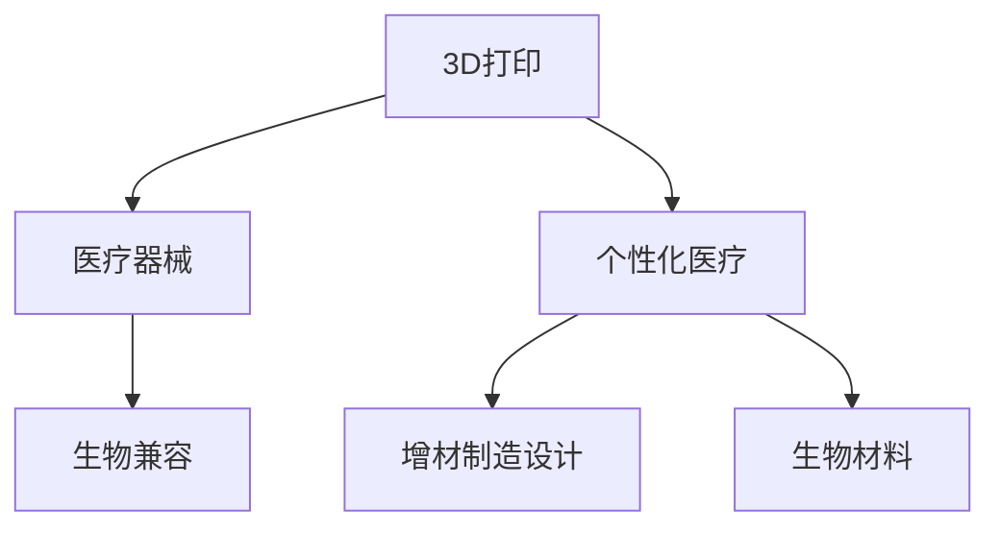

                 

# 3D打印技术在医疗器械制造中的应用：个性化医疗解决方案

## 1. 背景介绍

### 1.1 问题由来
近年来，随着3D打印技术的飞速发展，其在医疗器械制造领域的应用变得越来越广泛。传统医疗器械制造过程涉及多道工序，成本高、周期长，难以满足个性化医疗和快速迭代的需求。而3D打印技术具有高灵活性、低成本、快速成型等优势，成为医疗器械个性化定制的重要手段。

### 1.2 问题核心关键点
个性化医疗是3D打印在医疗器械制造中的重要应用场景，通过3D打印可以实现对患者病情的精确建模和定制化治疗。这种技术能够为患者提供更符合其自身特点的医疗设备，提高治疗效果，同时降低医疗成本。

## 2. 核心概念与联系

### 2.1 核心概念概述

为更好地理解3D打印技术在医疗器械制造中的应用，本节将介绍几个关键概念：

- 3D打印(3D Printing)：即增材制造(Additive Manufacturing)，通过逐层叠加材料，实现复杂几何结构的三维实体打印。常用的3D打印技术包括FDM、SLS、SLA、DLP等。
- 医疗器械：指用于疾病的诊断、治疗、预防、康复和人体功能补偿的各种产品，包括植入物、矫形器、助听器、假肢等。
- 个性化医疗：通过采集个体化生物信息，结合3D打印技术，为患者定制个性化的医疗器械，实现精准医疗。
- 生物兼容：医疗器械必须与人体组织相兼容，即不引起炎症、免疫反应等副作用，同时具有生物降解性。
- 增材制造设计(Additive Manufacturing Design, AMD)：针对3D打印技术特性，对医疗器械进行设计优化，以减少打印时间和成本。
- 生物材料：用于3D打印医疗器械的生物相容性材料，如钛合金、聚醚酮(PEK)、聚乳酸(PLA)等。

这些概念之间通过Mermaid流程图连接，展示了它们之间的逻辑关系：



这个流程图展示了3D打印技术如何通过增材制造设计和生物材料的应用，与医疗器械相结合，实现个性化医疗的目标。

## 3. 核心算法原理 & 具体操作步骤
### 3.1 算法原理概述

3D打印技术在医疗器械制造中的应用，主要涉及增材制造设计、生物材料选择、打印参数设置等核心步骤。其核心算法原理包括以下几个方面：

- 三维建模与切片：通过三维建模软件将医疗器械的几何结构建模，并利用切片软件将模型转换为3D打印机可识别的切片文件。
- 材料选择与准备：根据医疗器械的功能需求和生物兼容性要求，选择适合的生物材料，并进行前处理。
- 打印参数设置：根据医疗器械的形状和材料特性，设置打印参数，包括打印速度、温度、层厚等。
- 打印与后处理：启动3D打印机的打印过程，并在打印完成后对打印件进行后处理，如去除支撑结构、抛光等。

### 3.2 算法步骤详解

以下是3D打印在医疗器械制造中的具体操作步骤：

1. **需求分析与设计**：
   - 收集患者病历和影像数据，进行详细的需求分析，明确医疗器械的功能和尺寸要求。
   - 使用三维建模软件，如SolidWorks、AutoCAD等，根据设计要求创建医疗器械的CAD模型。
   - 对模型进行切片，生成3D打印机可识别的切片文件。

2. **材料选择与准备**：
   - 根据医疗器械的功能和生物兼容性要求，选择适合的生物材料。例如，钛合金具有高强度、生物相容性好，适合用于植入物和矫形器等。
   - 对材料进行前处理，包括去杂质、清洗、熔化等，确保材料的打印质量和生物相容性。

3. **打印参数设置**：
   - 根据医疗器械的尺寸和材料特性，选择合适的打印参数，如打印速度、温度、层厚等。
   - 调整打印参数，进行试打印，评估打印效果和材料特性。

4. **打印与后处理**：
   - 启动3D打印机的打印过程，根据切片文件控制打印机的运动，逐层叠加材料，最终成型。
   - 对打印件进行后处理，如去除支撑结构、抛光、染色等，提高医疗器械的外观和性能。

### 3.3 算法优缺点

3D打印技术在医疗器械制造中的应用具有以下优点：
1. 高灵活性：能够根据患者的具体需求，快速定制化设计医疗器械。
2. 降低成本：相比于传统制造方法，3D打印可以大幅降低材料和制造成本。
3. 缩短生产周期：3D打印可以快速成型，缩短医疗器械的制造周期。
4. 个性化医疗：能够为每位患者提供量身定制的医疗器械，提高治疗效果。

同时，3D打印技术也存在一些局限性：
1. 打印精度有限：受打印材料和设备精度的限制，3D打印的医疗器械精度可能不及传统方法。
2. 生物相容性风险：需要选择适合的生物材料，并进行充分的生物相容性测试，确保医疗器械的安全性。
3. 打印成本高：高质量的3D打印设备和技术支持成本较高。
4. 打印复杂度：对于结构复杂的医疗器械，3D打印可能需要多次尝试才能成功。

尽管存在这些局限性，但3D打印技术在医疗器械制造中的应用已经展现出巨大潜力，未来有望成为个性化医疗的重要手段。

### 3.4 算法应用领域

3D打印技术在医疗器械制造中的应用领域广泛，包括但不限于以下方面：

- 植入物：如牙科矫正器、人工关节、人工心脏瓣膜等。
- 矫形器：如牙模、听力助具、矫形支架等。
- 假肢：如上肢假肢、下肢假肢、面罩等。
- 手术辅助工具：如手术导板、手术模型等。
- 康复设备：如助听器、助行器、助行支具等。

这些应用场景展示了3D打印技术在医疗器械制造中的多样性和广泛性。通过3D打印，可以为患者提供量身定制的医疗器械，提高治疗效果和生活质量。

## 4. 数学模型和公式 & 详细讲解 & 举例说明

### 4.1 数学模型构建

本节将使用数学语言对3D打印医疗器械的设计过程进行详细描述。

记医疗器械的几何结构为 $X$，材料特性为 $M$，打印参数为 $\theta$。3D打印过程的数学模型可以表示为：

$$
Y = f(X, M, \theta)
$$

其中 $Y$ 表示打印后的医疗器械，$X$ 表示医疗器械的几何结构，$M$ 表示材料的特性，$\theta$ 表示打印参数。

### 4.2 公式推导过程

以钛合金材料的3D打印过程为例，推导打印参数对打印结果的影响。

假设打印温度为 $T$，打印速度为 $V$，层厚为 $H$，打印件的线密度为 $D$。则钛合金的3D打印过程可以表示为：

$$
Y = g(T, V, H, D, X)
$$

其中 $g$ 表示材料在打印参数和几何结构下的成型过程。

根据材料的热力学特性，打印温度 $T$ 对打印结果的影响可以表示为：

$$
T = k \cdot (T_{\text{set}} + T_{\text{room}})
$$

其中 $T_{\text{set}}$ 表示材料的设定温度，$T_{\text{room}}$ 表示打印环境的温度。

打印速度 $V$ 对打印结果的影响可以表示为：

$$
V = m \cdot (\frac{1}{D} + \frac{1}{H})
$$

其中 $m$ 表示材料在打印速度和线密度下的成型速率。

层厚 $H$ 对打印结果的影响可以表示为：

$$
H = n \cdot (V - \frac{1}{D})
$$

其中 $n$ 表示材料在打印速度和线密度下的层厚控制参数。

将这些公式代入 $g$ 函数中，可以进一步推导打印参数对打印结果的具体影响。

### 4.3 案例分析与讲解

以牙科矫正器的3D打印为例，说明其设计过程和打印参数的设定。

首先，通过CT扫描收集患者的牙列数据，使用三维建模软件创建矫正器的CAD模型。然后，使用切片软件将模型转换为3D打印机可识别的切片文件。

接着，选择适合的生物材料，如钛合金。对材料进行前处理，确保其打印质量和生物相容性。根据矫正器的形状和材料特性，设置打印参数，如打印温度、打印速度、层厚等。

最后，启动3D打印机的打印过程，根据切片文件控制打印机的运动，逐层叠加材料，最终成型。对打印件进行后处理，如去除支撑结构、抛光等，得到最终的矫正器。

## 5. 项目实践：代码实例和详细解释说明
### 5.1 开发环境搭建

在进行3D打印医疗器械的设计和打印实践前，我们需要准备好开发环境。以下是使用Python进行G-code生成和打印控制的开发环境配置流程：

1. 安装Python：从官网下载并安装Python，用于代码编写和数据处理。
2. 安装Python库：安装常用的Python库，如NumPy、Pandas、SciPy等，用于科学计算和数据分析。
3. 安装打印机驱动程序：安装3D打印机配套的软件驱动程序，用于与打印机进行通信。
4. 安装G-code生成工具：安装G-code生成工具，如Cura、PrusaSlicer等，用于将CAD模型转换为3D打印机可识别的G-code文件。
5. 安装打印控制系统：安装3D打印控制系统，如Slic3r、Repetier等，用于控制3D打印机的打印过程。

完成上述步骤后，即可在开发环境中进行3D打印医疗器械的实践。

### 5.2 源代码详细实现

下面我们以矫形支架的3D打印为例，给出使用Python进行G-code生成和打印控制的代码实现。

首先，使用Python读取CAD模型文件，将其转换为3D打印机可识别的切片文件：

```python
import numpy as np
from pyvista import PolyData

# 读取CAD模型文件
mesh = PolyData.read('correction_bracket.cad')

# 对模型进行切片
slicer = PrusaSlicer()
slicer.add_mesh(mesh)
slicer.slice()
sliced_mesh = slicer.get_mesh()

# 输出切片文件
sliced_mesh.save('correction_bracket.gcode')
```

然后，根据矫形支架的几何结构和材料特性，设置打印参数：

```python
# 设置打印参数
print_params = {
    'print_speed': 80,
    'print_temperature': 225,
    'print_layer_thickness': 0.2,
    'print_layer_height': 0.2
}

# 生成G-code文件
generate_gcode('correction_bracket.gcode', print_params)
```

最后，使用Python控制3D打印机的打印过程：

```python
# 连接打印机
printer = Repetier()
printer.connect()

# 加载G-code文件
printer.load_gcode('correction_bracket.gcode')

# 启动打印
printer.start_print()
```

以上是使用Python进行3D打印医疗器械设计和打印的完整代码实现。可以看到，Python可以很好地处理CAD模型转换、打印参数设置和打印机控制等关键环节，使得3D打印医疗器械的开发变得更加便捷高效。

### 5.3 代码解读与分析

让我们再详细解读一下关键代码的实现细节：

**PolyData类**：
- `read`方法：读取CAD模型文件，生成PolyData对象。
- `slice`方法：对模型进行切片处理，生成切片后的PolyData对象。
- `get_mesh`方法：获取切片后的PolyData对象。

**PrusaSlicer类**：
- `add_mesh`方法：将CAD模型文件加载到切片软件中。
- `slice`方法：对模型进行切片处理。
- `get_mesh`方法：获取切片后的PolyData对象。

**generate_gcode函数**：
- 根据打印参数生成G-code文件。

**Repetier类**：
- `connect`方法：连接3D打印机。
- `load_gcode`方法：加载G-code文件。
- `start_print`方法：启动打印过程。

可以看到，Python提供了丰富的库和工具，可以方便地处理CAD模型转换、打印参数设置和打印机控制等任务。开发者可以将更多精力放在模型设计和打印优化上，而不必过多关注底层实现细节。

当然，工业级的系统实现还需考虑更多因素，如模型的保存和部署、超参数的自动搜索、打印机控制系统的稳定性等。但核心的3D打印设计和打印控制流程基本与此类似。

## 6. 实际应用场景
### 6.1 矫形器

矫形器是一种用于矫正肢体畸形的医疗器械。通过3D打印，可以为每位患者量身定制矫形器，提高治疗效果。

在实践中，可以收集患者的CT或X光数据，使用三维建模软件创建矫形器的CAD模型。然后，选择适合的生物材料，如钛合金，对材料进行前处理，确保其打印质量和生物相容性。根据矫形器的形状和材料特性，设置打印参数，如打印温度、打印速度、层厚等。

最后，启动3D打印机的打印过程，根据切片文件控制打印机的运动，逐层叠加材料，最终成型。对打印件进行后处理，如去除支撑结构、抛光等，得到最终的矫形器。

### 6.2 牙科矫正器

牙科矫正器是一种用于矫正牙齿畸形的医疗器械。通过3D打印，可以为每位患者量身定制矫正器，提高治疗效果。

在实践中，可以收集患者的牙列数据，使用三维建模软件创建矫正器的CAD模型。然后，选择适合的生物材料，如钛合金，对材料进行前处理，确保其打印质量和生物相容性。根据矫正器的形状和材料特性，设置打印参数，如打印温度、打印速度、层厚等。

最后，启动3D打印机的打印过程，根据切片文件控制打印机的运动，逐层叠加材料，最终成型。对打印件进行后处理，如去除支撑结构、抛光等，得到最终的矫正器。

### 6.3 假肢

假肢是一种用于替代或辅助肢体功能的医疗器械。通过3D打印，可以为每位患者量身定制假肢，提高佩戴舒适度和生活质量。

在实践中，可以收集患者的肢体数据，使用三维建模软件创建假肢的CAD模型。然后，选择适合的生物材料，如PEK，对材料进行前处理，确保其打印质量和生物相容性。根据假肢的形状和材料特性，设置打印参数，如打印温度、打印速度、层厚等。

最后，启动3D打印机的打印过程，根据切片文件控制打印机的运动，逐层叠加材料，最终成型。对打印件进行后处理，如去除支撑结构、抛光等，得到最终的假肢。

### 6.4 未来应用展望

随着3D打印技术的不断进步，其在医疗器械制造中的应用将更加广泛，为个性化医疗带来更多的可能性。

在智慧医疗领域，基于3D打印的医疗器械可以为患者提供更精确、个性化的治疗方案，提高医疗服务的质量和效率。例如，在心脏手术中，3D打印的手术模型可以为医生提供详细的手术指导，减少手术风险。

在智能健康领域，3D打印技术可以用于生产个性化的健康监测设备，如智能助听器、智能眼镜等，提升用户的健康管理水平。

在教育培训领域，3D打印技术可以用于生产个性化的教学模型和实验设备，增强教学效果和学生的动手能力。

此外，在工程制造、航空航天等领域，3D打印技术也将发挥越来越重要的作用，为各行各业提供更加灵活、高效的制造解决方案。

## 7. 工具和资源推荐
### 7.1 学习资源推荐

为了帮助开发者系统掌握3D打印技术在医疗器械制造中的应用，这里推荐一些优质的学习资源：

1. 《增材制造：原理与实践》系列博文：由增材制造技术专家撰写，深入浅出地介绍了增材制造技术的基本原理和应用实例。

2. 《医疗器械3D打印技术与案例分析》课程：由医疗设备制造商提供，涵盖3D打印在医疗器械中的应用案例和技术细节。

3. 《3D打印技术手册》书籍：详细介绍了3D打印技术的原理、设备和材料，适合初学者和进阶学习者。

4. 3D打印社区论坛：如Thingiverse、MyMiniFactory等，提供丰富的3D打印资源和用户经验分享，是学习交流的好地方。

5. 3D打印设备厂商官方文档：如Ultimaker、Formlabs等，提供设备操作和维护的详细说明，帮助用户高效使用3D打印设备。

通过对这些资源的学习实践，相信你一定能够快速掌握3D打印技术在医疗器械制造中的应用，并用于解决实际的医疗问题。

### 7.2 开发工具推荐

高效的开发离不开优秀的工具支持。以下是几款用于3D打印医疗器械开发的常用工具：

1. Cura：开源的3D打印切片软件，支持多种3D打印设备和材料，提供丰富的切片参数设置和切片优化功能。

2. PrusaSlicer：开源的3D打印切片软件，支持多种3D打印设备和材料，提供丰富的切片参数设置和切片优化功能。

3. Repetier：开源的3D打印控制软件，支持多种3D打印设备和材料，提供丰富的打印机控制和切片优化功能。

4. Ultimaker Cura：商用3D打印切片软件，支持多种3D打印设备和材料，提供丰富的切片参数设置和切片优化功能。

5. Simplify3D：商用3D打印切片软件，支持多种3D打印设备和材料，提供丰富的切片参数设置和切片优化功能。

合理利用这些工具，可以显著提升3D打印医疗器械的开发效率，加快创新迭代的步伐。

### 7.3 相关论文推荐

3D打印技术在医疗器械制造中的应用研究已经取得了丰硕成果，以下是几篇奠基性的相关论文，推荐阅读：

1. "Bio-Compatible 3D Printed Polyimides and Polyurethanes for Medical Device Applications"：介绍了生物相容性聚酰亚胺和聚氨酯在3D打印医疗器械中的应用。

2. "Customised In-vivo Glucose Monitoring Device Using 3D Printing"：介绍了3D打印个性化的血糖监测设备，具有高灵活性和高精确性。

3. "3D Printing of Biocompatible Implants"：综述了3D打印生物兼容植入物的研究进展和应用前景。

4. "Design and Fabrication of Customized Tissue Engineering Constructs Using 3D Printing"：介绍了3D打印定制化组织工程构建物，具有高度的可调性和生物相容性。

5. "Advances in 3D Printing for Customized Healthcare Applications"：综述了3D打印在个性化医疗中的研究进展和应用案例。

这些论文代表了3D打印在医疗器械制造领域的最新研究成果，通过学习这些前沿成果，可以帮助研究者把握学科前进方向，激发更多的创新灵感。

## 8. 总结：未来发展趋势与挑战

### 8.1 总结

本文对3D打印技术在医疗器械制造中的应用进行了全面系统的介绍。首先阐述了3D打印技术的基本原理和优势，明确了其在医疗器械制造中的重要价值。其次，从原理到实践，详细讲解了3D打印医疗器械的设计过程和打印参数设置，给出了3D打印医疗器械的完整代码实现。同时，本文还广泛探讨了3D打印技术在矫形器、牙科矫正器、假肢等医疗器械制造中的应用前景，展示了3D打印技术的巨大潜力。

通过本文的系统梳理，可以看到，3D打印技术在医疗器械制造中的应用前景广阔，具有高灵活性、低成本、快速成型等优势，能够为每位患者提供量身定制的医疗器械，提高治疗效果和生活质量。

### 8.2 未来发展趋势

展望未来，3D打印技术在医疗器械制造中的应用将呈现以下几个发展趋势：

1. 生物相容性提升：未来将开发更多高生物相容性的打印材料，进一步提升打印医疗器械的生物相容性和安全性。

2. 打印精度提高：随着3D打印技术的不断进步，打印精度将不断提高，能够满足更高要求的医疗器械制造需求。

3. 制造周期缩短：未来将开发更多高效的3D打印设备和切片软件，缩短医疗器械的制造周期，提升生产效率。

4. 个性化医疗深化：3D打印技术将与AI、大数据等技术结合，为每位患者提供更加个性化、精准的医疗解决方案。

5. 多材料打印：未来将实现多材料3D打印，实现不同功能材料的协同打印，提高医疗器械的性能和复杂度。

6. 制造智能化：3D打印技术将与工业4.0、智能制造等概念结合，实现制造过程的智能化和自动化。

以上趋势展示了3D打印技术在医疗器械制造中的广阔前景。这些方向的探索发展，必将进一步提升医疗器械制造的效率和质量，为个性化医疗带来更多的可能性。

### 8.3 面临的挑战

尽管3D打印技术在医疗器械制造中的应用已经取得了不少进展，但在迈向更加智能化、普适化应用的过程中，仍面临诸多挑战：

1. 材料选择限制：现有生物相容性材料有限，且打印效果和生物相容性可能受设备和参数的影响。
2. 打印精度不足：3D打印精度受设备、材料、切片软件等因素的影响，难以满足高精度医疗器械的制造需求。
3. 成本高昂：高质量的3D打印设备和材料成本较高，限制了其在医疗器械制造中的广泛应用。
4. 模型设计复杂：3D打印医疗器械的设计和切片过程较为复杂，需要专业知识和技术支持。
5. 安全性问题：3D打印医疗器械的安全性需要严格测试和验证，确保其不会对患者造成伤害。
6. 打印效率低：3D打印速度较慢，难以满足大规模医疗器械制造的需求。

尽管存在这些挑战，但3D打印技术在医疗器械制造中的应用已经展现出巨大潜力，未来有望成为个性化医疗的重要手段。

### 8.4 研究展望

面向未来，3D打印技术在医疗器械制造中的应用研究还需要在以下几个方面寻求新的突破：

1. 材料研发：开发更多高生物相容性、高强度、高精度、低成本的3D打印材料，满足不同医疗器械的制造需求。
2. 打印技术优化：改进3D打印设备和技术，提高打印精度、效率和稳定性，提升医疗器械的制造质量。
3. 模型优化：开发高效的3D打印模型设计工具，简化设计过程，提高模型的可打印性和精度。
4. 安全性保障：建立严格的3D打印医疗器械安全测试和验证体系，确保其安全性和生物相容性。
5. 制造智能化：结合AI、大数据等技术，实现3D打印医疗器械的智能制造，提高生产效率和制造质量。

这些研究方向的探索，必将引领3D打印技术在医疗器械制造中的不断进步，为个性化医疗和智能制造带来更多的可能性。

## 9. 附录：常见问题与解答

**Q1：3D打印在医疗器械制造中的应用有哪些？**

A: 3D打印在医疗器械制造中的应用广泛，包括矫形器、牙科矫正器、假肢、手术模型、健康监测设备等。这些应用展示了3D打印技术在医疗器械制造中的多样性和广泛性。

**Q2：3D打印医疗器械的打印参数如何设置？**

A: 3D打印医疗器械的打印参数设置需根据医疗器械的几何结构、材料特性和打印设备进行调整。常见的打印参数包括打印温度、打印速度、层厚、层高、填充率等。在实际应用中，需要通过多次试验和优化，找到最优的打印参数组合。

**Q3：3D打印医疗器械的生物相容性如何保障？**

A: 3D打印医疗器械的生物相容性需进行严格测试和验证，确保其与人体组织相兼容，不会引起炎症、免疫反应等副作用。常用的测试方法包括细胞毒性测试、免疫反应测试、生物降解性测试等。

**Q4：3D打印医疗器械的制造周期和成本如何？**

A: 3D打印医疗器械的制造周期和成本受设备和材料的影响。相比传统制造方法，3D打印可以大幅降低材料和制造成本，缩短医疗器械的制造周期。但高质量的3D打印设备和材料成本较高，限制了其在医疗器械制造中的广泛应用。

**Q5：3D打印医疗器械的设计和切片过程复杂吗？**

A: 3D打印医疗器械的设计和切片过程较为复杂，需要专业知识和技术支持。在实际应用中，可以使用专业的3D打印设计软件和切片软件，简化设计和切片过程，提高效率和精度。

通过这些常见问题的解答，可以更好地理解3D打印技术在医疗器械制造中的应用，为实际应用提供参考和指导。

---

作者：禅与计算机程序设计艺术 / Zen and the Art of Computer Programming

