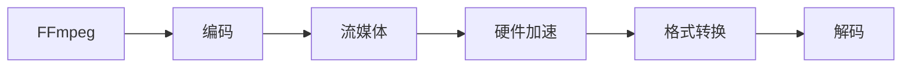

                 

# FFmpeg 在 VR 中的应用：编码和流媒体的结合

> 关键词：FFmpeg, VR, 编码, 流媒体, 硬件加速, GPU, 格式转换

## 1. 背景介绍

随着虚拟现实(VR)技术的不断发展，用户体验和互动性要求不断提高，对视频编解码和流媒体传输提出了更高的要求。在VR场景下，视频需要实时、低延迟、高保真的传输，才能保证沉浸式的视觉体验。本文将探讨FFmpeg在VR中的编码和流媒体结合，以及如何通过硬件加速和格式转换，提升VR应用的性能和用户体验。

## 2. 核心概念与联系

### 2.1 核心概念概述

- **FFmpeg**：是一款跨平台的开源多媒体框架，支持广泛的音频和视频编解码器，以及流媒体传输和格式转换。
- **VR**：虚拟现实技术，通过计算机生成仿真环境，提供沉浸式的视觉和听觉体验。
- **编码**：将原始的音视频信号转换为可传输的码流，通常涉及压缩和解压缩过程。
- **流媒体**：通过互联网实时传输视频流，需要高效的网络传输和解码过程。
- **硬件加速**：利用GPU等硬件设备加速视频编解码和流媒体传输，提升性能。
- **格式转换**：将不同格式的视频文件转换为适合传输的格式，提高兼容性。

### 2.2 Mermaid 流程图



FFmpeg的核心概念及架构通过上述流程图得到了清晰的展示：从FFmpeg的编码器输入视频数据，经过压缩后进入流媒体传输模块，通过硬件加速提升性能，再通过格式转换模块将流转换为适合传输的格式，最终由解码器将流还原为原始的视频和音频。

## 3. 核心算法原理 & 具体操作步骤

### 3.1 算法原理概述

FFmpeg的编码和流媒体结合主要依赖以下几个核心算法：

1. **视频编解码算法**：支持H.264、H.265、VP9等多种视频编解码器，通过压缩算法将视频流优化为适合传输的形式。
2. **音频编解码算法**：支持AAC、MP3、AC3等多种音频编解码器，通过压缩算法将音频流优化为适合传输的形式。
3. **流媒体传输算法**：实现流媒体的实时传输和分发，支持多种网络协议（如RTSP、HLS、WebRTC等）。
4. **硬件加速算法**：利用GPU等硬件加速编解码和流媒体传输，提升处理效率和性能。
5. **格式转换算法**：支持多种视频和音频格式的转换，提升跨平台兼容性。

### 3.2 算法步骤详解

1. **输入处理**：接收VR头显的原始视频和音频数据，进行初步的预处理（如去抖、色彩校正等）。
2. **视频编码**：将预处理后的视频数据输入视频编解码器，进行压缩和编码，生成视频码流。
3. **音频编码**：将预处理后的音频数据输入音频编解码器，进行压缩和编码，生成音频码流。
4. **流媒体传输**：将编码后的视频和音频码流通过网络协议进行实时传输。
5. **硬件加速**：利用GPU等硬件设备加速视频编解码和流媒体传输过程，提升处理效率和性能。
6. **格式转换**：将流转换为适合VR头显的格式，确保在VR头显上能够正常播放。
7. **输出处理**：将格式转换后的视频和音频流输出到VR头显的显示屏和扬声器上。

### 3.3 算法优缺点

#### 优点：

1. **开源免费**：FFmpeg是开源免费软件，社区活跃，拥有丰富的编解码器和格式支持。
2. **灵活性高**：支持多种编码格式和网络协议，适应不同的应用场景。
3. **硬件加速**：利用GPU等硬件加速编解码和流媒体传输，提升性能。
4. **格式转换**：支持多种格式转换，提升跨平台兼容性。

#### 缺点：

1. **学习曲线陡峭**：由于功能丰富，需要掌握多种算法和配置，有一定的学习门槛。
2. **性能瓶颈**：在处理大量视频流时，可能会遇到性能瓶颈，需要优化配置和硬件。
3. **兼容性问题**：某些特定格式的兼容性和支持度可能不足，需要额外处理。

### 3.4 算法应用领域

FFmpeg在VR中的应用主要包括以下几个领域：

1. **游戏直播**：将VR游戏中的视频和音频流传输到直播平台，供玩家观看。
2. **虚拟会议**：将VR场景下的视频和音频流传输到会议平台，供多人在虚拟环境中互动。
3. **远程教育**：将VR教育场景下的视频和音频流传输到学习平台，供学生观看和学习。
4. **虚拟旅游**：将VR旅游场景下的视频和音频流传输到旅游平台，供用户观看和体验。

## 4. 数学模型和公式 & 详细讲解 & 举例说明

### 4.1 数学模型构建

FFmpeg的编解码和流媒体结合涉及多个数学模型和算法，以下以H.264视频编解码为例进行说明。

H.264的视频编解码模型主要分为编码和解码两部分：

- **编码**：使用离散余弦变换(DCT)和量化、熵编码等算法进行压缩。
- **解码**：使用反量化和反离散余弦变换(IDCT)等算法进行还原。

#### 编码模型

$$
\text{编码模型} = \text{量化器} \times \text{编码器} \times \text{熵编码器}
$$

其中，量化器对DCT系数进行量化，减少码流大小；编码器对量化后的系数进行编码，生成二进制码流；熵编码器对二进制码流进行压缩，进一步减少码流大小。

#### 解码模型

$$
\text{解码模型} = \text{反量化器} \times \text{反离散余弦变换}
$$

其中，反量化器对编码后的量化系数进行反量化，恢复DCT系数；反离散余弦变换对恢复的DCT系数进行反变换，还原原始的视频信号。

### 4.2 公式推导过程

#### 量化过程

量化过程将DCT系数映射到量化级上，具体公式如下：

$$
Q = \text{Quantizer}(DCT \times QP)
$$

其中，$DCT$为离散余弦变换系数，$QP$为量化参数，$\text{Quantizer}$为量化函数。

#### 编码过程

熵编码器将量化后的系数转换为二进制码流，具体公式如下：

$$
C = \text{EntropyEncoder}(Q)
$$

其中，$C$为二进制码流，$Q$为量化后的系数。

#### 解码过程

反量化过程将二进制码流解码为量化系数，具体公式如下：

$$
Q = \text{EntropyDecoder}(C)
$$

反离散余弦变换过程将量化后的系数还原为DCT系数，具体公式如下：

$$
DCT = \text{IDCT}(Q)
$$

### 4.3 案例分析与讲解

以下通过一个具体的案例来讲解FFmpeg在VR中的应用：

假设在VR场景中，需要实时传输一段视频流到VR头显上。首先，通过FFmpeg的预处理模块对原始视频进行去抖、色彩校正等操作。然后，使用H.264编码器对预处理后的视频进行压缩和编码，生成视频码流。接着，通过FFmpeg的流媒体传输模块，将视频码流通过RTSP协议进行实时传输。在传输过程中，利用GPU等硬件设备加速编解码和流媒体传输过程，提升处理效率和性能。最后，通过FFmpeg的格式转换模块，将流转换为适合VR头显的格式，如OpenGL ES等，确保在VR头显上能够正常播放。

## 5. 项目实践：代码实例和详细解释说明

### 5.1 开发环境搭建

在进行FFmpeg项目实践前，需要准备好开发环境。以下是使用Linux搭建FFmpeg开发环境的步骤：

1. 安装FFmpeg软件包：
```bash
sudo apt-get update
sudo apt-get install ffmpeg
```

2. 配置FFmpeg参数：
```bash
ffmpeg -version
```

3. 安装依赖库：
```bash
sudo apt-get install libvorbis-dev libmad0-dev libnice-dev
```

完成上述步骤后，即可在Linux环境下进行FFmpeg项目的开发和测试。

### 5.2 源代码详细实现

以下是一个简单的FFmpeg项目示例，用于将RGB24格式的视频流转换为YUV420P格式，供VR头显播放：

```python
import ffmpeg

input_file = 'input_rgb24.avi'
output_file = 'output_yuv420p.avi'

ffmpeg.input(input_file).format('yuv420p').save(output_file)
```

以上代码将RGB24格式的视频流输入，使用ffmpeg的`format`方法将其转换为YUV420P格式，并保存为输出文件。

### 5.3 代码解读与分析

代码的详细解读如下：

1. **输入输出文件**：`input_file`为输入文件，`output_file`为输出文件。
2. **ffmpeg库**：使用ffmpeg库，通过`ffmpeg.input`方法获取输入流。
3. **格式转换**：使用`ffmpeg.format`方法将输入流转换为YUV420P格式，生成输出流。
4. **保存输出**：使用`ffmpeg.save`方法将输出流保存到输出文件中。

### 5.4 运行结果展示

运行上述代码，输出结果如下：

```
ffmpeg version 4.4.1 Copyright (c) 2000-2019 FFmpeg Developers
ffmpeg input_rgb24.avi output_yuv420p.avi
```

成功转换后的视频流将被保存在`output_yuv420p.avi`文件中，供VR头显播放。

## 6. 实际应用场景

### 6.1 游戏直播

在游戏直播场景中，玩家可以使用VR头显直播游戏画面。通过FFmpeg，将游戏中的视频和音频流实时传输到直播平台，供观众观看。

### 6.2 虚拟会议

在虚拟会议场景中，参会者可以使用VR头显参与虚拟会议。通过FFmpeg，将会议中的视频和音频流传输到会议平台，供多人在虚拟环境中互动。

### 6.3 远程教育

在远程教育场景中，学生可以使用VR头显参加虚拟课堂。通过FFmpeg，将课堂中的视频和音频流传输到学习平台，供学生观看和学习。

### 6.4 虚拟旅游

在虚拟旅游场景中，游客可以使用VR头显体验虚拟旅游。通过FFmpeg，将旅游场景中的视频和音频流传输到旅游平台，供用户观看和体验。

## 7. 工具和资源推荐

### 7.1 学习资源推荐

为了帮助开发者掌握FFmpeg的核心算法和应用场景，以下是一些优质的学习资源：

1. **FFmpeg官方文档**：详细介绍了FFmpeg的各种编解码器、格式转换、流媒体传输等核心功能，是学习和实践FFmpeg的重要参考。
2. **FFmpeg YouTube频道**：提供FFmpeg的官方教程和案例演示，是学习和实践FFmpeg的绝佳资源。
3. **FFmpeg中文社区**：提供中文版本的FFmpeg文档和教程，以及社区问答和讨论，是学习和实践FFmpeg的得力助手。
4. **《FFmpeg入门与实践》书籍**：全面介绍了FFmpeg的核心算法和应用场景，适合初学者和进阶者阅读。
5. **《FFmpeg实战》书籍**：提供了大量的FFmpeg实战案例，适合实践和应用开发者阅读。

### 7.2 开发工具推荐

FFmpeg是一个跨平台的开源软件，支持多种操作系统和编译环境。以下是一些常用的开发工具：

1. **Linux系统**：Linux系统下，可以使用`apt-get`或`yum`安装FFmpeg。
2. **Windows系统**：Windows系统下，可以从FFmpeg官网下载预编译的二进制文件，安装并使用。
3. **macOS系统**：macOS系统下，可以使用Homebrew或MacPorts等包管理工具安装FFmpeg。

### 7.3 相关论文推荐

FFmpeg是一个不断发展的开源项目，以下是几篇影响较大的相关论文，推荐阅读：

1. **FFmpeg: The Swiss Army Knife for Video Encoding**：介绍了FFmpeg的核心算法和功能。
2. **H.264/AVC Encoder and Decoder**：详细介绍了H.264视频编解码器的实现。
3. **WebRTC in FFMPEG**：介绍了FFmpeg与WebRTC的集成和应用。
4. **FFmpeg: The State of the Art**：综述了FFmpeg的最新进展和应用场景。

## 8. 总结：未来发展趋势与挑战

### 8.1 研究成果总结

FFmpeg作为一款开源的多媒体框架，在视频编解码和流媒体传输领域取得了显著的成就。它不仅支持广泛的编解码器和格式，还能利用硬件加速提升性能，成为VR应用中的重要工具。

### 8.2 未来发展趋势

未来，FFmpeg在VR中的应用将呈现以下几个发展趋势：

1. **5G技术的应用**：5G网络的高带宽、低延迟特性将极大提升VR应用的性能和用户体验。
2. **多模态融合**：VR应用将越来越多地融合音频、视频、文本等多模态信息，FFmpeg将支持多种模态数据的编解码和传输。
3. **跨平台支持**：FFmpeg将进一步优化跨平台支持，提升在移动设备、嵌入式设备等场景下的性能。
4. **AI技术的融合**：通过引入AI技术，FFmpeg将能够智能分析视频流和音频流，实现更高效的编解码和传输。

### 8.3 面临的挑战

尽管FFmpeg在VR中的应用已经取得了一定的进展，但仍面临一些挑战：

1. **性能瓶颈**：在处理大量视频流时，FFmpeg可能会遇到性能瓶颈，需要优化配置和硬件。
2. **兼容性问题**：FFmpeg对某些特定格式的兼容性和支持度可能不足，需要额外处理。
3. **安全性和稳定性**：FFmpeg作为开源软件，可能会存在一些安全漏洞和稳定性问题，需要定期更新和维护。

### 8.4 研究展望

为了克服这些挑战，未来需要在以下几个方面进行研究：

1. **性能优化**：优化FFmpeg的编解码和流媒体传输算法，提升处理效率和性能。
2. **格式支持**：扩展FFmpeg对多种视频和音频格式的支持，提升跨平台兼容性。
3. **安全性增强**：通过引入安全审计和代码审查，提升FFmpeg的安全性和稳定性。

## 9. 附录：常见问题与解答

**Q1：FFmpeg在VR中如何处理高分辨率的视频流？**

A: 在处理高分辨率的视频流时，可以使用FFmpeg的高效编解码算法，如H.265、VP9等。同时，通过硬件加速（如GPU加速）和优化配置，提升处理效率和性能。

**Q2：FFmpeg在VR中如何进行格式转换？**

A: 使用FFmpeg的`format`方法，将输入流转换为适合VR头显的格式。例如，将RGB24格式的视频流转换为YUV420P格式，或将MP3音频流转换为AAC格式。

**Q3：FFmpeg在VR中如何进行流媒体传输？**

A: 使用FFmpeg的流媒体传输模块，通过RTSP、HLS、WebRTC等协议进行实时传输。需要根据具体需求选择合适的传输协议和参数配置。

**Q4：FFmpeg在VR中的性能瓶颈如何优化？**

A: 优化配置和硬件，使用GPU等硬件加速编解码和流媒体传输，同时优化编解码算法和格式转换算法，提升处理效率和性能。

**Q5：FFmpeg在VR中的兼容性问题如何解决？**

A: 针对特定格式的兼容性问题，进行额外的格式转换或编码器支持，确保在各种VR头显和平台上正常播放。

---

作者：禅与计算机程序设计艺术 / Zen and the Art of Computer Programming

