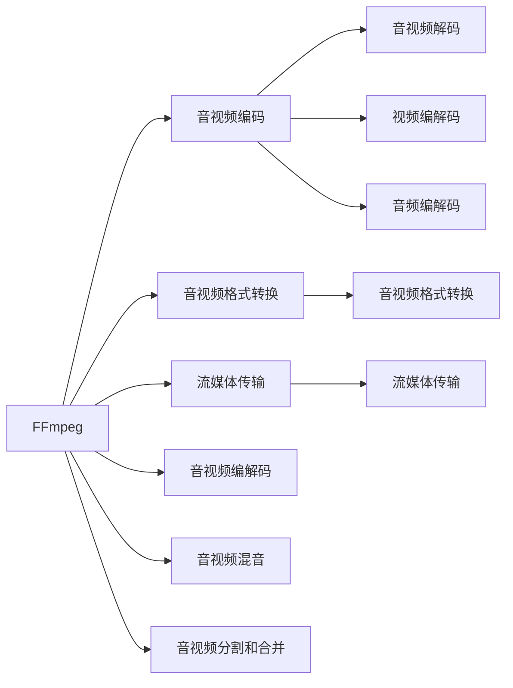

                 

# FFmpeg命令行：音视频处理的瑞士军刀

> 关键词：FFmpeg,音视频编解码,命令行,流媒体处理,多媒体应用

## 1. 背景介绍

在现代数字化世界中，音视频文件的数量呈爆炸式增长，无处不在的音视频内容需求推动着音视频处理技术的快速发展。作为开源的音视频处理工具，FFmpeg以其高效、灵活、丰富的功能而闻名，成为了音视频处理的“瑞士军刀”。无论是专业人士还是普通用户，都能通过简单的命令行操作，轻松实现音视频的编解码、格式转换、流媒体传输等任务。本文将深入介绍FFmpeg的核心概念、命令行操作、应用场景及未来发展趋势，带你全面掌握这一强大的音视频处理工具。

## 2. 核心概念与联系

### 2.1 核心概念概述

FFmpeg是一款开源的跨平台音视频处理工具，支持几乎所有的音视频编解码器。它不仅支持视频编码和解码，还可以进行音频编码、混音、分割、合并等操作。FFmpeg的强大之处在于其丰富的命令行接口，能够轻松实现各种音视频处理任务。

### 2.2 核心概念原理和架构的 Mermaid 流程图



这个流程图展示了FFmpeg的基本功能架构，主要包括音视频编解码、格式转换、流媒体传输、混音、分割合并等核心功能。这些功能通过FFmpeg的命令行接口来实现，用户可以轻松配置各种参数，实现复杂的音视频处理需求。

## 3. 核心算法原理 & 具体操作步骤

### 3.1 算法原理概述

FFmpeg的核心算法主要包括音视频编解码算法、音视频格式转换算法和流媒体传输协议。音视频编解码算法是FFmpeg的核心功能之一，支持包括H.264、H.265、AAC、MP3等多种编解码器。音视频格式转换算法能够将不同格式的文件进行相互转换，支持多种编码器和编解码器。流媒体传输协议包括HTTP Live Streaming（HLS）、Dynamic Adaptive Streaming over HTTP（DASH）等，能够实现高质量、低延迟的流媒体传输。

### 3.2 算法步骤详解

#### 3.2.1 音视频编解码

FFmpeg支持多种音视频编解码器，其核心算法包括H.264、H.265、AAC等。以下是使用FFmpeg进行音视频编解码的基本步骤：

1. 安装FFmpeg：
   ```bash
   sudo apt-get install ffmpeg
   ```

2. 编码：将视频文件转换为指定格式的编码文件。例如将MP4格式的视频文件转换为H264编码：
   ```bash
   ffmpeg -i input.mp4 -c:v libx264 -preset veryslow output.mp4
   ```

3. 解码：将H264编码的视频文件解码为MP4格式的视频文件。例如将H264编码的视频文件解码：
   ```bash
   ffmpeg -i input.mp4 -c:v libx264 -preset veryslow output.mp4
   ```

#### 3.2.2 音视频格式转换

FFmpeg支持多种音视频格式之间的转换，例如将MP4格式的视频文件转换为MKV格式：

```bash
ffmpeg -i input.mp4 -c:v libx264 -c:a copy output.mkv
```

这个命令会将输入的MP4视频文件转换为MKV格式，同时保持音轨不变。

#### 3.2.3 流媒体传输

FFmpeg支持多种流媒体传输协议，例如将MP4视频文件转换为HLS格式的流媒体文件：

```bash
ffmpeg -i input.mp4 -f hls -hls_time 0.5 -hls_list_size 5 output.m3u8
```

这个命令会将输入的MP4视频文件转换为HLS格式的流媒体文件，同时设置HLS播放时长为0.5秒，播放列表大小为5。

### 3.3 算法优缺点

FFmpeg的优点包括：
1. 开源免费：FFmpeg是一款开源免费的工具，任何人都可以使用和修改其源代码。
2. 功能丰富：支持多种音视频编解码器、格式转换、流媒体传输等核心功能。
3. 高效灵活：FFmpeg的命令行接口非常灵活，用户可以轻松配置各种参数，实现复杂的音视频处理需求。

FFmpeg的缺点包括：
1. 学习曲线较陡：由于FFmpeg功能强大且灵活，初学者可能需要花费一定时间学习和掌握其命令参数。
2. 资源占用较大：在处理大量音视频文件时，FFmpeg的资源占用较大，可能会影响系统性能。
3. 版本兼容性：不同版本的FFmpeg可能对某些命令和参数支持不同，需要仔细检查版本信息。

### 3.4 算法应用领域

FFmpeg在多媒体领域有着广泛的应用，例如：
1. 视频编解码：用于视频文件的编解码，例如将视频文件转换为不同格式或进行压缩。
2. 格式转换：用于不同格式之间的转换，例如将视频文件转换为流媒体格式。
3. 流媒体传输：用于实现高质量、低延迟的流媒体传输，例如将视频文件转换为HLS格式进行流媒体播放。
4. 音视频混音：用于音视频的混音处理，例如将多个音视频文件混合成一个文件。
5. 音视频分割合并：用于音视频的分割和合并处理，例如将一个大视频文件分割成多个小视频文件或将多个小视频文件合并成一个大视频文件。

## 4. 数学模型和公式 & 详细讲解

### 4.1 数学模型构建

FFmpeg的音视频编解码和格式转换过程，实际上是一个数学模型构建和求解的过程。例如，音视频编解码过程需要根据输入的音视频数据，使用特定的编解码算法生成对应的编码数据。格式转换过程需要根据输入的音视频数据和目标格式，使用特定的转换算法生成对应的目标格式数据。

### 4.2 公式推导过程

以下是FFmpeg进行音视频编解码的基本公式推导过程：

假设输入的音视频数据为 $X$，目标编解码器为 $C$，编解码器参数为 $P$，输出结果为 $Y$。编解码过程可以表示为：

$$ Y = C(X, P) $$

其中，$C$ 表示编解码器，$P$ 表示编解码器参数，$X$ 表示输入的音视频数据，$Y$ 表示输出的编解码结果。

### 4.3 案例分析与讲解

以将MP4格式的视频文件转换为H264编码为例，其基本公式推导过程如下：

$$ Y = C(X, P) $$

其中，$X$ 表示输入的MP4视频文件，$P$ 表示编解码参数，$Y$ 表示输出的H264编码视频文件。

使用FFmpeg进行编解码的过程可以表示为：

```bash
ffmpeg -i input.mp4 -c:v libx264 -preset veryslow output.mp4
```

这个命令将输入的MP4视频文件转换为H264编码视频文件，其中 $P$ 表示编解码参数，$X$ 表示输入的MP4视频文件，$Y$ 表示输出的H264编码视频文件。

## 5. 项目实践：代码实例和详细解释说明

### 5.1 开发环境搭建

在使用FFmpeg进行音视频处理之前，需要先搭建好开发环境。以下是使用Linux系统搭建FFmpeg开发环境的步骤：

1. 安装FFmpeg：
   ```bash
   sudo apt-get install ffmpeg
   ```

2. 测试FFmpeg版本：
   ```bash
   ffmpeg -version
   ```

### 5.2 源代码详细实现

#### 5.2.1 音视频编解码

以下是使用FFmpeg进行音视频编解码的示例代码：

```bash
ffmpeg -i input.mp4 -c:v libx264 -preset veryslow output.mp4
```

这个命令将输入的MP4视频文件转换为H264编码视频文件。其中，`-i`参数表示输入文件，`-c:v`参数表示编解码器，`-libx264`参数表示编解码器参数，`-preset`参数表示预设参数。

#### 5.2.2 音视频格式转换

以下是使用FFmpeg进行音视频格式转换的示例代码：

```bash
ffmpeg -i input.mp4 -c:v libx264 -c:a copy output.mkv
```

这个命令将输入的MP4视频文件转换为MKV格式的视频文件，同时保持音轨不变。其中，`-i`参数表示输入文件，`-c:v`参数表示编解码器，`-c:a`参数表示音轨编解码器，`copy`表示复制音轨，不进行编解码。

#### 5.2.3 流媒体传输

以下是使用FFmpeg进行流媒体传输的示例代码：

```bash
ffmpeg -i input.mp4 -f hls -hls_time 0.5 -hls_list_size 5 output.m3u8
```

这个命令将输入的MP4视频文件转换为HLS格式的流媒体文件。其中，`-i`参数表示输入文件，`-f`参数表示输出格式，`hls`表示HLS格式，`-hls_time`参数表示播放时长，`-hls_list_size`参数表示播放列表大小。

### 5.3 代码解读与分析

使用FFmpeg进行音视频处理的命令参数较为复杂，需要仔细阅读FFmpeg的官方文档和帮助信息。以下是对常用命令参数的解读：

- `-i`：输入文件名，多个输入文件用空格分隔。
- `-c:v`：视频编解码器，常用的编解码器包括libx264、libx265、libvpx等。
- `-c:a`：音频编解码器，常用的编解码器包括aac、mp3、opus等。
- `-preset`：编解码预设参数，用于控制编解码速度和质量。
- `-b:v`：视频比特率，用于控制视频输出大小。
- `-b:a`：音频比特率，用于控制音频输出大小。
- `-f`：输出格式，常用的格式包括mp4、mkv、hls等。
- `-hls_time`：HLS播放时长，用于控制HLS格式的分片大小。
- `-hls_list_size`：HLS播放列表大小，用于控制HLS格式的播放列表大小。

### 5.4 运行结果展示

使用FFmpeg进行音视频处理的运行结果展示如下：

- 音视频编解码：将MP4格式的视频文件转换为H264编码视频文件。
- 音视频格式转换：将MP4视频文件转换为MKV格式的视频文件。
- 流媒体传输：将MP4视频文件转换为HLS格式的流媒体文件。

## 6. 实际应用场景

### 6.1 视频会议

视频会议是FFmpeg在多媒体应用中最常见的场景之一。FFmpeg可以用于视频流的录制、编解码和传输，保证视频会议的流畅和稳定性。

### 6.2 视频直播

FFmpeg可以用于视频流的实时录制、编解码和传输，支持各种流媒体协议，如RTMP、RTSP等，能够实现高质量、低延迟的直播。

### 6.3 视频点播

FFmpeg可以用于视频文件的编解码和格式转换，将视频文件转换为流媒体格式，实现视频点播功能。

### 6.4 未来应用展望

未来，FFmpeg将在以下几个方面得到进一步发展：
1. 支持更多编解码器：FFmpeg将支持更多的编解码器，实现更加广泛的音视频处理能力。
2. 改进命令行界面：FFmpeg将改进命令行界面，提供更加友好、易用的交互体验。
3. 支持更多协议：FFmpeg将支持更多的流媒体协议，实现更加丰富的音视频传输能力。
4. 引入机器学习：FFmpeg将引入机器学习技术，提高音视频处理的智能化水平。
5. 实现跨平台支持：FFmpeg将实现跨平台支持，进一步拓展应用范围。

## 7. 工具和资源推荐

### 7.1 学习资源推荐

#### 7.1.1 FFmpeg官方文档

FFmpeg官方文档是学习FFmpeg的最佳资源，提供了详细的命令参数说明和示例代码。

#### 7.1.2 YouTube视频教程

YouTube上有大量关于FFmpeg的视频教程，适合初学者快速上手。

#### 7.1.3 FFmpeg社区

FFmpeg社区是一个活跃的开发者社区，提供了大量的FFmpeg相关资源和问题解答。

### 7.2 开发工具推荐

#### 7.2.1 Linux命令行

Linux命令行是使用FFmpeg最便捷的方式，支持大量的命令参数和选项。

#### 7.2.2 Windows命令行

Windows命令行也支持FFmpeg，适合在Windows系统上使用。

#### 7.2.3 Mac命令行

Mac命令行支持FFmpeg，适合在Mac系统上使用。

### 7.3 相关论文推荐

#### 7.3.1 FFmpeg：快速视频编解码器

该论文介绍了FFmpeg的设计思想和实现原理，是了解FFmpeg的重要参考文献。

#### 7.3.2 FFmpeg在视频会议中的应用

该论文研究了FFmpeg在视频会议中的应用，提出了一些优化方案和解决方案。

## 8. 总结：未来发展趋势与挑战

### 8.1 研究成果总结

FFmpeg作为音视频处理的“瑞士军刀”，以其高效、灵活、丰富的功能而闻名。经过多年的发展，FFmpeg已经成为音视频处理领域的事实标准，广泛应用于多媒体领域。

### 8.2 未来发展趋势

FFmpeg未来将朝着以下几个方向发展：
1. 支持更多编解码器：FFmpeg将支持更多的编解码器，实现更加广泛的音视频处理能力。
2. 改进命令行界面：FFmpeg将改进命令行界面，提供更加友好、易用的交互体验。
3. 支持更多协议：FFmpeg将支持更多的流媒体协议，实现更加丰富的音视频传输能力。
4. 引入机器学习：FFmpeg将引入机器学习技术，提高音视频处理的智能化水平。
5. 实现跨平台支持：FFmpeg将实现跨平台支持，进一步拓展应用范围。

### 8.3 面临的挑战

FFmpeg在发展过程中也面临着一些挑战：
1. 学习曲线较陡：FFmpeg功能强大且灵活，初学者可能需要花费一定时间学习和掌握其命令参数。
2. 资源占用较大：在处理大量音视频文件时，FFmpeg的资源占用较大，可能会影响系统性能。
3. 版本兼容性：不同版本的FFmpeg可能对某些命令和参数支持不同，需要仔细检查版本信息。

### 8.4 研究展望

未来，FFmpeg需要在以下几个方面进行深入研究：
1. 优化算法：FFmpeg需要在编解码算法和格式转换算法方面进行优化，提高处理速度和质量。
2. 改进界面：FFmpeg需要改进命令行界面，提供更加友好、易用的交互体验。
3. 引入机器学习：FFmpeg需要引入机器学习技术，提高音视频处理的智能化水平。
4. 实现跨平台支持：FFmpeg需要实现跨平台支持，进一步拓展应用范围。

## 9. 附录：常见问题与解答

### 9.1 常见问题

#### 9.1.1 如何安装FFmpeg？

在Linux系统中，可以通过以下命令安装FFmpeg：

```bash
sudo apt-get install ffmpeg
```

#### 9.1.2 如何使用FFmpeg进行音视频编解码？

使用FFmpeg进行音视频编解码的命令如下：

```bash
ffmpeg -i input.mp4 -c:v libx264 -preset veryslow output.mp4
```

这个命令将输入的MP4视频文件转换为H264编码视频文件。

#### 9.1.3 如何使用FFmpeg进行音视频格式转换？

使用FFmpeg进行音视频格式转换的命令如下：

```bash
ffmpeg -i input.mp4 -c:v libx264 -c:a copy output.mkv
```

这个命令将输入的MP4视频文件转换为MKV格式的视频文件，同时保持音轨不变。

#### 9.1.4 如何使用FFmpeg进行流媒体传输？

使用FFmpeg进行流媒体传输的命令如下：

```bash
ffmpeg -i input.mp4 -f hls -hls_time 0.5 -hls_list_size 5 output.m3u8
```

这个命令将输入的MP4视频文件转换为HLS格式的流媒体文件。

### 9.2 解答

#### 9.2.1 如何安装FFmpeg？

在Linux系统中，可以通过以下命令安装FFmpeg：

```bash
sudo apt-get install ffmpeg
```

#### 9.2.2 如何使用FFmpeg进行音视频编解码？

使用FFmpeg进行音视频编解码的命令如下：

```bash
ffmpeg -i input.mp4 -c:v libx264 -preset veryslow output.mp4
```

这个命令将输入的MP4视频文件转换为H264编码视频文件。

#### 9.2.3 如何使用FFmpeg进行音视频格式转换？

使用FFmpeg进行音视频格式转换的命令如下：

```bash
ffmpeg -i input.mp4 -c:v libx264 -c:a copy output.mkv
```

这个命令将输入的MP4视频文件转换为MKV格式的视频文件，同时保持音轨不变。

#### 9.2.4 如何使用FFmpeg进行流媒体传输？

使用FFmpeg进行流媒体传输的命令如下：

```bash
ffmpeg -i input.mp4 -f hls -hls_time 0.5 -hls_list_size 5 output.m3u8
```

这个命令将输入的MP4视频文件转换为HLS格式的流媒体文件。

---

作者：禅与计算机程序设计艺术 / Zen and the Art of Computer Programming

