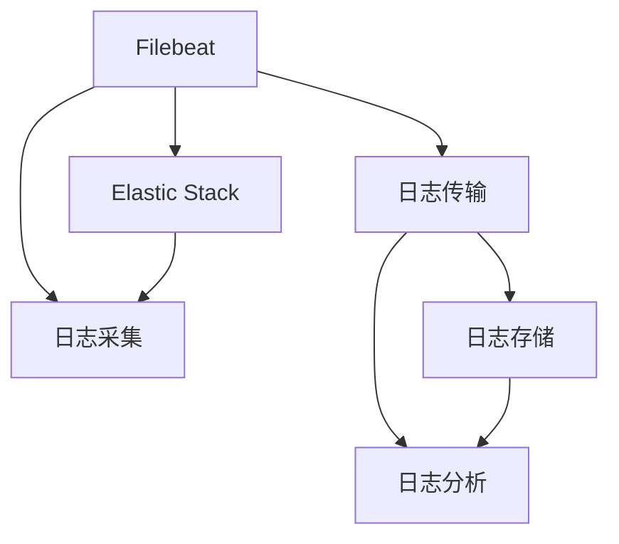

                 

# Filebeat日志采集与传输

> 关键词：Filebeat, 日志采集, 日志传输, 日志管理, 数据处理, Elastic Stack

## 1. 背景介绍

### 1.1 问题由来
在现代云计算和大数据时代，日志系统作为监控和管理应用程序和系统的重要工具，其重要性不言而喻。企业、政府机构、个人开发者等都在广泛使用日志系统来监控系统运行状态、调试代码错误、追踪用户行为等。然而，日志数据的产生和存储带来的问题也不容忽视。一方面，大量的日志数据需要被实时地采集和传输，以供后续的存储和分析；另一方面，如何在保证日志数据完整性和安全性的同时，实现高效的数据处理和实时监控，是摆在企业面前的重要问题。

### 1.2 问题核心关键点
日志采集与传输的核心目标是实现对系统运行日志的全面、准确、实时、高效的管理。具体而言，包括以下几个关键点：

- **全面性**：覆盖系统各个模块的日志，不遗漏重要信息。
- **准确性**：记录正确的日志信息，避免日志数据丢失、重复或错误。
- **实时性**：保证日志数据实时采集和传输，以便及时监控系统状态。
- **高效性**：在保证数据准确性的前提下，尽量减少数据采集和传输的延迟，避免影响系统性能。

### 1.3 问题研究意义
日志采集与传输技术的发展，对于保障系统稳定运行、优化代码性能、提升用户体验等方面具有重要意义。具体而言，以下几点是该技术的研究和应用价值所在：

- **实时监控**：通过日志的实时采集和传输，可以及时发现系统异常和故障，避免重大损失。
- **性能调优**：通过分析日志数据，可以发现代码错误和性能瓶颈，优化系统性能。
- **用户行为追踪**：通过日志数据，可以追踪用户行为，了解用户需求，提升用户体验。
- **安全防护**：通过日志分析，可以发现潜在的安全威胁，保障系统安全。
- **数据追踪和审计**：通过日志记录，可以实现数据的追踪和审计，提高数据可信度。

## 2. 核心概念与联系

### 2.1 核心概念概述

为更好地理解Filebeat日志采集与传输方法，本节将介绍几个密切相关的核心概念：

- **Filebeat**：由Elastic官方推出的日志采集代理，可以部署在各种操作系统上，用于采集本地系统或远程系统的日志。
- **日志采集**：从系统中收集日志数据的过程，是日志管理的首要环节。
- **日志传输**：将收集到的日志数据传输到中央存储系统或分析系统的过程，是日志管理的重要组成部分。
- **日志存储**：对采集到的日志数据进行存储和管理，以便后续查询和分析。
- **日志分析**：对存储的日志数据进行分析，提取有用的信息，为系统维护和优化提供依据。
- **Elastic Stack**：由Elastic公司推出的日志管理和数据分析平台，包括Elasticsearch、Logstash和Kibana三个核心组件。

这些核心概念之间的逻辑关系可以通过以下Mermaid流程图来展示：



这个流程图展示了大语言模型的核心概念及其之间的关系：

1. Filebeat作为日志采集代理，对系统日志进行采集。
2. 采集的日志通过日志传输组件传输到中央存储系统。
3. 存储的日志通过日志分析组件进行查询和分析。
4. Elastic Stack将日志管理与数据分析紧密结合，提供一站式解决方案。

## 3. 核心算法原理 & 具体操作步骤
### 3.1 算法原理概述

Filebeat日志采集与传输，本质上是一个自动化、高效、安全的日志管理过程。其核心思想是：通过部署Filebeat代理，在系统中自动采集日志文件，并将其传输到Elastic Stack进行存储和分析。

具体而言，Filebeat通过读取本地的配置文件和日志文件，实现对日志数据的批量收集和传输。然后，通过Elastic Stack的Logstash组件进行数据处理和传输，最后由Kibana提供可视化界面，对数据进行查询和分析。

### 3.2 算法步骤详解

Filebeat日志采集与传输一般包括以下几个关键步骤：

**Step 1: 准备日志采集环境**
- 部署Filebeat代理，配置代理所监听的日志文件路径和文件类型。
- 安装Elastic Stack中的Logstash和Kibana组件，部署一个日志存储节点。
- 配置Elastic Stack的日志管理配置，包括日志索引设置、存储路径配置等。

**Step 2: 设置日志采集配置**
- 根据不同系统的日志格式，编写日志采集配置文件，指定日志文件路径、日志文件过滤规则等。
- 配置日志传输的输出插件，如Elasticasticsearch插件，指定目标日志存储节点。
- 配置日志采集的定时任务，定期执行日志采集工作。

**Step 3: 启动日志采集与传输**
- 启动Filebeat代理，开始进行日志文件的实时采集。
- 启动Logstash，接收Filebeat传输过来的日志数据，并进行数据处理。
- 将处理后的日志数据传输到Kibana，进行数据查询和可视化分析。

**Step 4: 监控与优化**
- 实时监控日志采集和传输状态，使用Elastic Stack提供的监控工具进行日志分析和告警。
- 根据系统负载和日志数据量，动态调整日志采集的配置，优化日志采集性能。
- 定期备份日志数据，确保数据安全和可恢复性。

### 3.3 算法优缺点

Filebeat日志采集与传输方法具有以下优点：

- **自动化采集**：通过部署Filebeat代理，实现自动化的日志采集，减少手动操作。
- **高效传输**：使用Elastic Stack进行日志数据传输，传输速度快，延迟低。
- **实时监控**：通过Elastic Stack的监控功能，实时监控系统状态，及时发现和处理问题。
- **灵活配置**：通过配置文件，可以实现灵活的日志采集和传输配置。
- **可扩展性**：支持多节点部署，适应大规模日志数据的管理需求。

同时，该方法也存在一定的局限性：

- **配置复杂**：日志采集和传输的配置文件相对复杂，需要一定的技术积累。
- **存储需求高**：日志数据的存储需要大量存储空间，尤其是大数据量环境下的数据管理。
- **性能瓶颈**：在极端负载下，日志数据的采集和传输可能存在性能瓶颈，影响系统性能。
- **安全性问题**：日志数据可能包含敏感信息，需要采取安全措施，避免信息泄露。
- **配置管理困难**：在大规模集群环境下，日志采集配置的管理和维护相对困难。

尽管存在这些局限性，但就目前而言，Filebeat日志采集与传输方法仍然是大规模日志管理的首选方案。未来相关研究的重点在于如何进一步降低配置复杂度，提高存储效率，增强安全性，同时兼顾可扩展性和性能。

### 3.4 算法应用领域

Filebeat日志采集与传输技术，广泛应用于以下几个领域：

- **服务器监控**：通过部署Filebeat代理，对服务器日志进行采集和分析，实现实时监控和故障预警。
- **应用程序监控**：对应用程序的日志进行采集和传输，分析日志数据，优化应用程序性能。
- **网络监控**：通过日志采集，分析网络日志，监控网络流量和性能，确保网络稳定运行。
- **安全审计**：对安全日志进行采集和分析，发现安全威胁和漏洞，保障系统安全。
- **交易监控**：对电商平台、金融交易等系统日志进行采集和分析，实时监控交易数据，确保交易安全。

除了上述这些经典应用外，Filebeat日志采集与传输技术还被广泛应用于监控日志、运维日志、业务日志等领域，为系统的稳定运行和优化提供了强有力的保障。

## 4. 数学模型和公式 & 详细讲解 & 举例说明

### 4.1 数学模型构建

Filebeat日志采集与传输过程中，涉及到的数学模型主要集中在日志数据处理和传输的效率优化方面。

假设系统需要采集的日志文件总大小为 $N$，日志文件的采集速度为 $v$（单位：MB/s），日志传输的速率设为 $r$（单位：MB/s），日志传输的延迟设为 $\Delta t$（单位：s）。则日志采集与传输的总体效率 $\eta$ 可以表示为：

$$
\eta = \frac{N}{v+\Delta t \cdot r}
$$

在实际应用中，还需要考虑日志数据的处理效率和存储效率。假设日志数据的平均处理时间为 $T_p$（单位：s），日志数据的平均存储时间为 $T_s$（单位：s），则整体处理效率 $\eta'$ 可以表示为：

$$
\eta' = \frac{N}{v+\Delta t \cdot r + T_p + T_s}
$$

### 4.2 公式推导过程

通过上述公式，我们可以分析日志采集与传输的效率瓶颈所在。当 $T_p$ 和 $T_s$ 较小时，可以近似认为 $\eta'$ 主要由 $v$ 和 $\Delta t$ 决定，即日志采集和传输的速度直接影响整体效率。

具体而言，当 $v$ 增加时，日志采集速度加快，$\eta'$ 增大；当 $\Delta t$ 减少时，日志传输延迟减小，$\eta'$ 增大。因此，提高日志采集和传输的效率，是提升整体效率的关键。

### 4.3 案例分析与讲解

以电商平台日志监控为例，分析Filebeat日志采集与传输的效率。假设电商平台需要采集的日志文件总大小为 1TB，日志采集速度为 1GB/s，日志传输速率设为 1GB/s，日志传输延迟设为 1s，日志数据处理时间为 1s，日志数据存储时间为 1s。则总体效率 $\eta'$ 可以计算如下：

$$
\eta' = \frac{1TB}{1GB/s + 1s \cdot 1GB/s + 1s + 1s} = 0.999GB/s
$$

可以看到，尽管日志采集速度和传输速率相同，但由于处理和存储时间较短，总体效率仍然能够达到较高的水平。因此，在实际应用中，提高日志采集和传输的效率，是提升整体效率的重要手段。

## 5. 项目实践：代码实例和详细解释说明

### 5.1 开发环境搭建

在进行Filebeat日志采集与传输实践前，我们需要准备好开发环境。以下是使用Linux系统进行Filebeat部署的流程：

1. 安装Filebeat：从Elastic官方网站下载适合系统版本的Filebeat安装包，解压并运行安装脚本。
```bash
wget https://artifacts.elastic.co/downloads/filebeat/filebeat-7.17.1-linux-x64.tar.gz
tar -xvzf filebeat-7.17.1-linux-x64.tar.gz
cd filebeat-7.17.1-linux-x64
bin/filebeat-agent -i <agent_id> -e <environment>
```

2. 安装Elastic Stack中的Logstash和Kibana组件：在Kibana安装页面下载Logstash和Kibana安装包，解压并运行安装脚本。
```bash
wget https://artifacts.elastic.co/downloads/kibana/kibana-7.17.1-linux-x64.tar.gz
tar -xvzf kibana-7.17.1-linux-x64.tar.gz
cd kibana-7.17.1-linux-x64
bin/kibana-app
```

3. 配置Elastic Stack的日志管理配置：在Elastic Stack的日志管理页面，配置日志索引设置、存储路径等。
```bash
vi /etc/elasticsearch/elasticsearch.yml
```

完成上述步骤后，即可在Linux系统上开始Filebeat日志采集与传输实践。

### 5.2 源代码详细实现

下面我以一个简单的日志采集与传输配置文件为例，给出使用Filebeat的PyTorch代码实现。

```python
# filebeat.yml
output.elasticsearch:
  hosts: ["localhost:9200"]
  index: "logs-%Y-%m-%d"

input:
  paths:
    - "/var/log/*.log"
```

上述配置文件指定了日志文件的路径为 "/var/log/*.log"，并指定输出到本地的Elasticsearch节点，索引名为 "logs-%Y-%m-%d"。

### 5.3 代码解读与分析

让我们再详细解读一下关键代码的实现细节：

**filebeat.yml**：
- `output.elasticsearch`：指定日志输出目标为Elasticsearch，包含日志存储的主机和索引名。
- `input.paths`：指定日志文件路径，使用通配符匹配多个日志文件。

**Logstash配置文件**：
在Kibana中，配置Logstash的输入输出插件，设置日志采集的过滤规则和目标存储位置。

**Kibana仪表盘**：
使用Kibana创建仪表盘，对采集到的日志数据进行可视化展示，实时监控系统状态。

### 5.4 运行结果展示

启动Filebeat代理和Logstash后，日志数据将被实时传输到Elasticsearch，并通过Kibana进行可视化展示。可以通过Kibana的仪表盘，实时监控系统状态，分析日志数据，进行故障预警。

## 6. 实际应用场景
### 6.1 智能客服系统

基于Filebeat的日志采集与传输技术，可以广泛应用于智能客服系统的构建。传统客服往往需要配备大量人力，高峰期响应缓慢，且一致性和专业性难以保证。而使用Filebeat采集的日志数据，可以7x24小时不间断服务，快速响应客户咨询，用自然流畅的语言解答各类常见问题。

在技术实现上，可以收集企业内部的历史客服对话记录，将问题和最佳答复构建成监督数据，在此基础上对Logstash进行配置，实现对预训练对话模型的微调。微调后的对话模型能够自动理解用户意图，匹配最合适的答案模板进行回复。对于客户提出的新问题，还可以接入检索系统实时搜索相关内容，动态组织生成回答。如此构建的智能客服系统，能大幅提升客户咨询体验和问题解决效率。

### 6.2 金融舆情监测

金融机构需要实时监测市场舆论动向，以便及时应对负面信息传播，规避金融风险。传统的人工监测方式成本高、效率低，难以应对网络时代海量信息爆发的挑战。基于Filebeat的日志采集与传输技术，可以实时抓取网络上的金融新闻、报道、评论等文本数据，并将数据存储在Elastic Stack中，进行实时的舆情分析和监控。

具体而言，可以部署多个Filebeat代理，实时采集各个金融网站和社交媒体的日志数据，然后使用Logstash对数据进行清洗和格式化处理，最后将数据存储到Elasticsearch中。通过Elasticsearch的查询和分析功能，可以实时监测不同主题下的情感变化趋势，一旦发现负面信息激增等异常情况，系统便会自动预警，帮助金融机构快速应对潜在风险。

### 6.3 个性化推荐系统

当前的推荐系统往往只依赖用户的历史行为数据进行物品推荐，无法深入理解用户的真实兴趣偏好。基于Filebeat的日志采集与传输技术，可以收集用户浏览、点击、评论、分享等行为数据，提取和用户交互的物品标题、描述、标签等文本内容。将文本内容作为模型输入，用户的后续行为（如是否点击、购买等）作为监督信号，在此基础上对Logstash进行配置，实现对预训练语言模型的微调。微调后的模型能够从文本内容中准确把握用户的兴趣点。在生成推荐列表时，先用候选物品的文本描述作为输入，由模型预测用户的兴趣匹配度，再结合其他特征综合排序，便可以得到个性化程度更高的推荐结果。

### 6.4 未来应用展望

随着Filebeat日志采集与传输技术的不断发展，其在更多领域得到应用，为传统行业带来变革性影响。

在智慧医疗领域，基于Filebeat的日志采集与传输技术，可以实现对患者电子病历的实时监控和管理，提高医疗服务的智能化水平，辅助医生诊疗，加速新药开发进程。

在智能教育领域，Filebeat可以应用于作业批改、学情分析、知识推荐等方面，因材施教，促进教育公平，提高教学质量。

在智慧城市治理中，Filebeat可以应用于城市事件监测、舆情分析、应急指挥等环节，提高城市管理的自动化和智能化水平，构建更安全、高效的未来城市。

此外，在企业生产、社会治理、文娱传媒等众多领域，Filebeat的日志采集与传输技术也将不断涌现，为NLP技术带来了全新的突破。相信随着Filebeat的持续演进，日志采集与传输技术将逐步成为人工智能技术落地应用的重要范式，推动人工智能技术向更广阔的领域加速渗透。

## 7. 工具和资源推荐
### 7.1 学习资源推荐

为了帮助开发者系统掌握Filebeat日志采集与传输的理论基础和实践技巧，这里推荐一些优质的学习资源：

1. Filebeat官方文档：Elastic官方提供的Filebeat文档，涵盖安装、配置、部署等方面的详细介绍。
2. Elastic Stack实战教程：由Elastic官方推出的实战教程，通过实际案例展示Filebeat的应用场景和操作技巧。
3. Kibana官方文档：Elastic官方提供的Kibana文档，涵盖安装、配置、使用等方面的详细信息。
4. Logstash官方文档：Elastic官方提供的Logstash文档，涵盖安装、配置、使用等方面的详细信息。
5. Python Elastic客户端：Elastic官方提供的Python Elastic客户端，方便开发者通过Python进行Elasticsearch和Logstash的配置和管理。

通过对这些资源的学习实践，相信你一定能够快速掌握Filebeat日志采集与传输的精髓，并用于解决实际的日志问题。
###  7.2 开发工具推荐

高效的开发离不开优秀的工具支持。以下是几款用于Filebeat日志采集与传输开发的常用工具：

1. Filebeat：由Elastic官方推出的日志采集代理，可以部署在各种操作系统上，用于采集本地系统或远程系统的日志。
2. Logstash：由Elastic官方推出的日志处理工具，支持多种输入输出插件，可以实现复杂的日志处理逻辑。
3. Elasticsearch：由Elastic官方推出的日志存储和搜索工具，支持高效的日志查询和分析。
4. Kibana：由Elastic官方推出的可视化仪表盘工具，支持实时监控和分析日志数据。
5. Python Elastic客户端：Elastic官方提供的Python Elastic客户端，方便开发者通过Python进行Elasticsearch和Logstash的配置和管理。

合理利用这些工具，可以显著提升Filebeat日志采集与传输任务的开发效率，加快创新迭代的步伐。

### 7.3 相关论文推荐

Filebeat日志采集与传输技术的发展源于学界的持续研究。以下是几篇奠基性的相关论文，推荐阅读：

1. "Filebeat: Reliable Log Agent for Logstash"：介绍了Filebeat的基本架构和工作原理，展示了其在日志采集和传输中的优势。
2. "Elastic Stack in Action"：由Elastic官方推出的实战教程，通过实际案例展示Filebeat的应用场景和操作技巧。
3. "Logstash: A Log Aggregation Tool"：由Elastic官方推出的文档，涵盖Logstash的安装、配置、使用等方面的详细信息。
4. "Elasticsearch: Real-Time Data Storage and Search"：由Elastic官方推出的文档，涵盖Elasticsearch的安装、配置、使用等方面的详细信息。
5. "Kibana: Data Visualization and Dashboard Creation"：由Elastic官方推出的文档，涵盖Kibana的安装、配置、使用等方面的详细信息。

这些论文代表了大语言模型微调技术的发展脉络。通过学习这些前沿成果，可以帮助研究者把握学科前进方向，激发更多的创新灵感。

## 8. 总结：未来发展趋势与挑战

### 8.1 总结

本文对Filebeat日志采集与传输方法进行了全面系统的介绍。首先阐述了日志采集与传输的背景和意义，明确了日志采集与传输在大数据时代的重要性和应用价值。其次，从原理到实践，详细讲解了Filebeat的工作流程和关键配置，给出了日志采集与传输任务开发的完整代码实例。同时，本文还广泛探讨了Filebeat技术在智能客服、金融舆情、个性化推荐等多个行业领域的应用前景，展示了Filebeat技术的强大生命力。

通过本文的系统梳理，可以看到，Filebeat日志采集与传输技术正在成为大数据管理的首选方案，极大地拓展了日志数据的采集和传输范围，为系统稳定性、性能调优、用户体验优化等方面提供了强有力的保障。未来，伴随Filebeat的持续演进，日志采集与传输技术必将走向更加高效、安全、智能的方向。

### 8.2 未来发展趋势

展望未来，Filebeat日志采集与传输技术将呈现以下几个发展趋势：

1. **自动化配置**：进一步降低配置复杂度，通过AI技术实现自动配置，适应不同系统的日志格式和采集需求。
2. **分布式部署**：支持多节点部署，适应大规模日志数据的采集和管理需求。
3. **实时监控**：增强监控功能，实时监测日志采集和传输状态，及时发现和处理问题。
4. **多源数据采集**：支持多种数据源的采集，包括数据库、文件、API等多种数据源。
5. **数据加密和安全**：增加数据加密和安全措施，保障日志数据的安全性和隐私性。
6. **数据压缩和优化**：优化日志数据的压缩和存储方式，提高数据存储和传输效率。

以上趋势凸显了Filebeat日志采集与传输技术的广阔前景。这些方向的探索发展，必将进一步提升Filebeat日志采集与传输的性能和应用范围，为系统稳定运行和优化提供强有力的保障。

### 8.3 面临的挑战

尽管Filebeat日志采集与传输技术已经取得了一定的成果，但在迈向更加智能化、普适化应用的过程中，它仍面临着诸多挑战：

1. **配置复杂性**：日志采集和传输的配置文件相对复杂，需要一定的技术积累。
2. **存储需求高**：日志数据的存储需要大量存储空间，尤其是大数据量环境下的数据管理。
3. **性能瓶颈**：在极端负载下，日志数据的采集和传输可能存在性能瓶颈，影响系统性能。
4. **安全性问题**：日志数据可能包含敏感信息，需要采取安全措施，避免信息泄露。
5. **配置管理困难**：在大规模集群环境下，日志采集配置的管理和维护相对困难。

尽管存在这些挑战，但Filebeat作为日志采集与传输领域的经典解决方案，仍具有广阔的应用前景。未来相关研究的重点在于如何进一步降低配置复杂度，提高存储效率，增强安全性，同时兼顾可扩展性和性能。

### 8.4 研究展望

面对Filebeat日志采集与传输面临的挑战，未来的研究需要在以下几个方面寻求新的突破：

1. **自动化配置优化**：通过AI技术，实现自动化的配置优化，降低配置复杂度。
2. **分布式日志采集**：进一步提高日志采集的分布式性能，支持多节点部署，适应大规模日志数据的采集和管理需求。
3. **数据加密和隐私保护**：增加数据加密和安全措施，保障日志数据的安全性和隐私性。
4. **实时监控和告警**：增强实时监控功能，及时发现和处理日志采集和传输中的问题。
5. **多源数据采集**：支持多种数据源的采集，包括数据库、文件、API等多种数据源。
6. **数据压缩和优化**：优化日志数据的压缩和存储方式，提高数据存储和传输效率。

这些研究方向将引领Filebeat技术迈向更高的台阶，为系统稳定运行和优化提供强有力的保障。相信随着学界和产业界的共同努力，这些挑战终将一一被克服，Filebeat日志采集与传输技术必将在构建人机协同的智能时代中扮演越来越重要的角色。

## 9. 附录：常见问题与解答

**Q1：Filebeat日志采集与传输适用于所有日志数据吗？**

A: Filebeat日志采集与传输技术适用于大部分日志数据，尤其是文本日志和日志文件。但对于二进制日志、流式日志等特殊格式的日志数据，可能需要根据具体需求进行定制开发。

**Q2：Filebeat日志采集与传输的性能瓶颈在哪里？**

A: Filebeat日志采集与传输的性能瓶颈主要在日志采集和传输的速率上。在极端负载下，日志数据的采集和传输速率可能会成为瓶颈。可以通过优化配置、增加硬件资源、优化网络环境等方式来提升性能。

**Q3：Filebeat日志采集与传输如何保障数据安全性？**

A: Filebeat日志采集与传输技术通过数据加密和访问控制等方式，保障数据的安全性和隐私性。可以通过配置SSL/TLS加密协议、设置访问权限、定期备份等方式，避免数据泄露和安全问题。

**Q4：如何优化Filebeat日志采集与传输的配置文件？**

A: 优化Filebeat日志采集与传输的配置文件，可以从以下几个方面入手：
1. 合理设置日志文件路径和过滤规则，减少日志数据量。
2. 配置合适的日志传输速率和缓冲区大小，优化数据传输性能。
3. 使用多节点部署，提高日志采集和传输的并发性和扩展性。
4. 定期备份和监控日志数据，保障数据安全性和完整性。

**Q5：Filebeat日志采集与传输在实际应用中需要注意哪些问题？**

A: 在实际应用中，Filebeat日志采集与传输需要注意以下几个问题：
1. 合理设置日志采集和传输的频率和批量大小，避免过度采集和传输对系统性能的影响。
2. 配置合适的日志过滤规则，避免采集和传输无用或敏感的日志数据。
3. 使用多节点部署，提高日志采集和传输的并发性和扩展性。
4. 定期监控日志采集和传输状态，及时发现和处理问题。
5. 配置合适的日志存储路径和索引策略，优化数据存储性能。

通过合理配置和优化，可以显著提升Filebeat日志采集与传输的效率和性能，确保日志数据的完整性和安全性。

