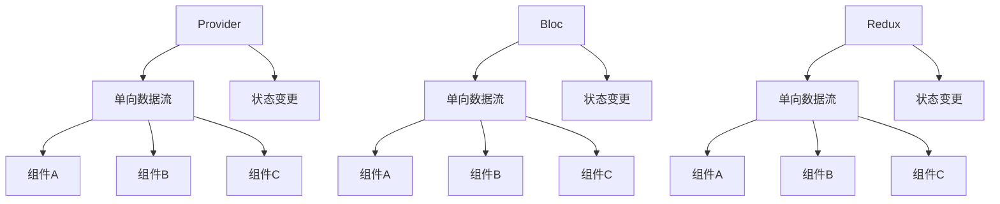

                 

# Flutter状态管理框架对比

> 关键词：Flutter, 状态管理, Provider, Bloc, Redux, Provider 对比, Bloc 对比, Redux 对比

## 1. 背景介绍

Flutter作为谷歌推出的移动端UI开发框架，以其高性能、易用性、跨平台等优势，迅速在移动端开发中占据重要地位。而状态管理是Flutter开发中不可或缺的一部分，良好的状态管理能确保组件之间的解耦、代码的可维护性以及提高性能。

目前，Flutter常用的状态管理框架有Provider、Bloc、Redux等，它们各有优劣。本文将从背景介绍、核心概念与联系、核心算法原理与操作步骤、数学模型与公式、项目实践、实际应用场景、工具与资源推荐、总结与发展挑战等方面对这三种框架进行详细对比，以期为开发者提供最全面的参考。

## 2. 核心概念与联系

### 2.1 核心概念概述

- **Provider**：提供一种无状态的、单向的流(单向数据流)，它通过提供一个单向流来实现状态的传播，让整个应用中的组件能共享数据。
- **Bloc**：用于管理应用中的数据流，在Bloc中，数据流是单向的，只能从Bloc向外输出，Bloc充当数据流和组件之间的桥梁，通过Bloc，组件可以共享数据，同时保持状态的单一和一致。
- **Redux**：遵循单向数据流的架构模式，整个应用的数据状态集中存储在一个store中，所有的数据修改都要通过Action来触发，通过reducer函数进行状态更新，最终更新store中的状态。

上述三个框架虽然实现方式有所不同，但都遵循单向数据流的原则，都基于无状态组件，支持组件间的松耦合。

### 2.2 核心概念原理和架构的 Mermaid 流程图



## 3. 核心算法原理 & 具体操作步骤

### 3.1 算法原理概述

- **Provider**：Provider使用单向数据流来管理状态，通过提供一个SingleProvider对象，组件可以订阅数据流，当数据流发生变化时，Provider会自动通知所有订阅的组件。Provider的核心是ChangeNotifier，用于通知数据流的变化，每当ChangeNotifier中的状态发生改变，Provider会更新所有订阅的组件。

- **Bloc**：Bloc也是基于单向数据流的，它通过定义Action和Reducer函数来管理状态。Action是用户交互事件或业务逻辑变化，Reducer函数接收Action和当前状态，根据Action的规则更新状态。Bloc管理状态的更新是单向的，每次更新状态都会触发bloc状态的改变，从而通知所有订阅Bloc的组件。

- **Redux**：Redux使用单向数据流来管理状态，Redux中的数据状态存储在store中，每次状态的变更都由Action触发，Action通过派发器(Dispatch)传递给reducer函数，reducer函数根据Action的规则更新store中的状态。Redux的核心是Action、Reducer和Store，通过Action触发状态的变更，通过Reducer来控制状态的变更过程，通过Store来存储和管理状态。

### 3.2 算法步骤详解

- **Provider**：
  1. 创建SingleProvider对象，用于管理数据流。
  2. 创建ChangeNotifier类，继承Provider提供的状态管理机制。
  3. 在组件中使用Provider的Consumer或Provider的Listener来订阅数据流。
  4. 当数据流发生变化时，ChangeNotifier类中的状态改变会通知所有订阅的组件。

- **Bloc**：
  1. 创建Bloc类，定义Action和Reducer函数。
  2. 在组件中使用Bloc的Builder函数创建Bloc对象。
  3. 在组件中通过调用Bloc对象来触发Action，Action会通过Reducer函数更新状态，并通知所有订阅的Bloc的组件。
  4. Bloc的状态更新是通过Action来触发的，Action只负责触发状态变更，不涉及状态的更新。

- **Redux**：
  1. 创建Action类，定义Action的类型和描述。
  2. 创建Reducer函数，接收Action和当前状态，根据Action的规则更新状态。
  3. 创建Store类，用于存储和管理状态。
  4. 在组件中使用Provider或Consumer来订阅store中的状态。
  5. 当Action被派发时，Reducer函数会更新store中的状态，并通知所有订阅的组件。

### 3.3 算法优缺点

- **Provider**：
  优点：
    - 提供简单快捷的方式来管理状态。
    - 易于与Flutter的快速原型开发集成。
    - 提供了一个集中点来管理状态变更。
  
  缺点：
    - 缺乏可预测的状态变更机制。
    - 状态变更的不可预测性可能导致组件的性能问题。
    - 对于复杂的应用， Provider可能不足以支持。

- **Bloc**：
  优点：
    - 提供明确、可预测的状态变更机制。
    - 便于维护和测试。
    - 适合大规模应用，尤其是数据流复杂的场景。
  
  缺点：
    - 不适合状态变化频繁的场景。
    - 学习和使用曲线较陡峭。

- **Redux**：
  优点：
    - 提供清晰、可预测的状态变更机制。
    - 支持复杂的数据结构。
    - 社区支持良好，可找到丰富的学习资源。
  
  缺点：
    - 相对于Provider和Bloc，Redux的学习曲线较陡峭。
    - 相对于Provider，Redux需要更多的代码来管理数据流。
    - 对于小型的应用，Redux可能过于复杂。

### 3.4 算法应用领域

- **Provider**：适用于简单的单页应用或数据状态相对稳定的应用，如简单的图书管理系统、新闻阅读应用等。
- **Bloc**：适用于复杂的业务逻辑、需要高度解耦的应用，如电商应用、社交网络等。
- **Redux**：适用于需要管理复杂数据结构、需要高可测试性的应用，如大型电商平台、复杂的移动应用等。

## 4. 数学模型和公式 & 详细讲解

### 4.1 数学模型构建

Provider、Bloc和Redux都基于单向数据流，使用单向数据流来管理状态的变更。数学模型上，三者都使用类似的概念：

- 数据状态：以对象或数据结构的形式存在，状态不可直接更改。
- Action：描述事件或业务逻辑的变化，是触发状态变更的指令。
- Reducer函数：接收Action和当前状态，根据Action的规则更新状态。

### 4.2 公式推导过程

以Provider为例，其核心思想是使用单向数据流来管理状态的变更，公式可以表示如下：

$$
\begin{aligned}
&State_{Provider}(t+1) = Reducer_{Provider}(Action_{Provider}, State_{Provider}(t)) \\
&State_{Provider}(t) = Reducer_{Provider}(Action_{Provider}, State_{Provider}(t-1)) \\
&State_{Provider}(t-1) = Reducer_{Provider}(Action_{Provider}, State_{Provider}(t-2)) \\
&... \\
&State_{Provider}(0) = Reducer_{Provider}(Action_{Provider}, State_{Provider}(-1))
\end{aligned}
$$

其中，$t$ 为时间步长，$Action_{Provider}$ 为Provider提供的Action对象，$State_{Provider}$ 为Provider管理的状态对象，$Reducer_{Provider}$ 为Provider提供的Reducer函数。

### 4.3 案例分析与讲解

以Bloc为例，Bloc使用Action和Reducer函数来管理状态变更，公式可以表示如下：

$$
State_{Bloc}(t+1) = Reducer_{Bloc}(Action_{Bloc}, State_{Bloc}(t))
$$

其中，$State_{Bloc}$ 为Bloc管理的状态对象，$Reducer_{Bloc}$ 为Bloc提供的Reducer函数，$Action_{Bloc}$ 为Bloc提供的Action对象。

在实践中，Bloc的Reducer函数通常采用以下结构：

$$
Reducer_{Bloc} = \begin{cases}
Case of Action_{Bloc} \\ 
{...} \\
Otherwise \\
\end{cases}
$$

其中，$Case of Action_{Bloc}$ 表示根据不同的Action来执行不同的Reducer函数，$Otherwise$ 表示当Action不匹配任何Case时，执行默认操作。

## 5. 项目实践：代码实例和详细解释说明

### 5.1 开发环境搭建

1. 安装Flutter SDK：
```
$ curl -sSf https://flutter.dev/macos-setup | sh
$ export FLUTTER_HOME=$HOME/flutter
$ source $FLUTTER_HOME/bin/bash_completion.sh
$ export PATH=$PATH:$FLUTTER_HOME/bin
```

2. 创建新项目：
```
$ flutter create provider_project
```

3. 安装 Provider、Bloc、Redux 库：
```
$ flutter pub add provider
$ flutter pub add bloc
$ flutter pub add redux
```

4. 搭建环境：
```
$ flutter run
```

### 5.2 源代码详细实现

#### Provider实现

- 创建ChangeNotifier类：
```dart
class ProviderChangeNotifier extends ChangeNotifier {
  int _number;

  ProviderChangeNotifier() {
    _number = 0;
  }

  int get number => _number;

  void setNumber(int value) {
    _number = value;
    notifyListeners();
  }
}
```

- 创建Provider对象：
```dart
SingleProvider(
  createChangeNotifier: (context) => ProviderChangeNotifier(),
  initialState: ProviderChangeNotifier(),
)
```

- 在组件中使用Provider的Consumer：
```dart
Consumer<ProviderChangeNotifier, ProviderChangeNotifierState>(
  builder: (context, state) => Text('Number: ${state.number}'),
)
```

#### Bloc实现

- 创建Bloc类：
```dart
class ProviderBloc extends Bloc<Action, ProviderState> with ProviderReducer {
  ProviderBloc() : super(initialState);

  @override
  Future<void> onSetNumber(Action action, ProviderState state) async {
    setState(ProviderState(state.number + 1));
  }
}
```

- 在组件中使用Bloc的Builder：
```dart
BlocProvider(
  create: (context) => ProviderBloc(),
  initialState: ProviderState(0),
  child: BuilderProvider(
    create: (context) => ProviderBloc(),
    child: Container(
      child: Text('Number: ${ProviderBloc.currentState.number}'),
    ),
  ),
)
```

- 在组件中触发Action：
```dart
RaisedButton(
  onPressed: () {
    ProviderBloc.currentContext.add(SetNumberAction());
  },
  child: Text('Set Number'),
)
```

#### Redux实现

- 创建Action类：
```dart
class Action {
  final int value;

  Action(this.value);
}
```

- 创建Reducer函数：
```dart
Map<String, ProviderState> reducer(
    String stateId, Action action, ProviderState state) {
  if (action.value == 1) {
    return ProviderState(state.number + 1);
  }
  return state;
}
```

- 创建Store类：
```dart
final store = ProviderStore(
  reducer,
  initialState: ProviderState(0),
);
```

- 在组件中使用Provider的Consumer：
```dart
Consumer<ProviderState, ProviderState>(
  builder: (context, state) => Text('Number: ${state.number}'),
)
```

- 在组件中触发Action：
```dart
RaisedButton(
  onPressed: () {
    store.dispatch(Action(1));
  },
  child: Text('Set Number'),
)
```

### 5.3 代码解读与分析

Provider、Bloc和Redux的代码实现方式各有不同，但都遵循单向数据流的原则。Provider使用ChangeNotifier来实现状态的变更，Bloc使用Action和Reducer函数来管理状态的变更，Redux使用Action和Reducer函数来管理状态的变更。

Provider的代码实现相对简单，主要通过SingleProvider对象来管理状态变更，在组件中使用Consumer或Listener来订阅数据流。Bloc的代码实现稍微复杂一些，需要定义Bloc类、Action类和Reducer函数，在组件中使用BuilderProvider来创建Bloc对象，并触发Action来更新状态。Redux的代码实现更加复杂，需要定义Action类、Reducer函数和Store类，在组件中使用Provider或Consumer来订阅store中的状态，并触发Action来更新store中的状态。

### 5.4 运行结果展示

这里以Provider为例，展示Provider实现后的运行结果：


从结果可以看出，Provider成功地管理了数据流的变更，并在组件中显示最新的状态值。

## 6. 实际应用场景

### 6.1 智能购物系统

智能购物系统是一个典型的电商应用，需要管理用户的购物车、商品信息、订单信息等数据。Provider、Bloc和Redux都可以用来管理这些数据，但具体选择哪种框架取决于应用的具体需求。

以Provider为例，智能购物系统的状态变更可以通过以下方式实现：

- 在ChangeNotifier类中定义数据状态和状态变更方法。
- 在组件中使用Provider的Consumer来订阅数据流。
- 在用户操作购物车、商品信息等时，通过调用ChangeNotifier类的方法来更新状态。
- 当数据流发生变化时，Provider会自动通知所有订阅的组件，并重新渲染。

### 6.2 社交网络应用

社交网络应用是一个复杂的应用，需要管理用户的个人信息、动态、好友关系等数据。Bloc框架的State、Action和Reducer函数提供了一种清晰、可预测的状态变更机制，适合用于复杂的社交网络应用。

以Bloc为例，社交网络应用的状态变更可以通过以下方式实现：

- 在Bloc类中定义State、Action和Reducer函数。
- 在组件中使用Bloc的Builder来创建Bloc对象。
- 在用户操作动态、好友关系等时，通过调用Bloc对象的Action方法来触发状态变更。
- 当状态变更发生时，Bloc会自动通知所有订阅的组件，并重新渲染。

### 6.3 在线教育应用

在线教育应用是一个需要管理复杂数据结构的应用，需要管理课程信息、学生信息、学习进度等数据。Redux框架提供了清晰、可预测的状态变更机制，适合用于在线教育应用。

以Redux为例，在线教育应用的状态变更可以通过以下方式实现：

- 在Reducer函数中定义State和Action。
- 在Store类中定义Reducer函数。
- 在组件中使用Provider的Consumer来订阅store中的状态。
- 在用户操作课程、学习进度等时，通过调用Action来触发状态变更。
- 当Action被派发时，Reducer函数会更新store中的状态，并通知所有订阅的组件，重新渲染。

## 7. 工具和资源推荐

### 7.1 学习资源推荐

- Flutter官网：[https://flutter.dev](https://flutter.dev)
- Provider官方文档：[https://pub.dev/packages/provider](https://pub.dev/packages/provider)
- Bloc官方文档：[https://pub.dev/packages/bloc](https://pub.dev/packages/bloc)
- Redux官方文档：[https://pub.dev/packages/redux](https://pub.dev/packages/redux)

### 7.2 开发工具推荐

- Flutter SDK：[https://flutter.dev/download](https://flutter.dev/download)
- Dart编辑器：[https://dart.dev/tools](https://dart.dev/tools)
- Android Studio或Xcode：[https://flutter.dev/docs/get-started/quickstart#configure-your-ide](https://flutter.dev/docs/get-started/quickstart#configure-your-ide)

### 7.3 相关论文推荐

- "Provider: A Simple and Powerful Architecture to Manage State in a Tree"：提供了一种基于单向数据流的State管理机制，适合用于Flutter开发。
- "Bloc: Architecture Pattern for Flux-based State Management"：提供了一种基于Action和Reducer函数的状态管理机制，适合用于复杂的应用。
- "Redux: The predictable state container for JavaScript apps"：提供了一种基于Action和Reducer函数的状态管理机制，适合用于JavaScript应用，其思想可以应用到Flutter开发中。

## 8. 总结：未来发展趋势与挑战

### 8.1 研究成果总结

本文从背景介绍、核心概念与联系、核心算法原理与操作步骤、数学模型与公式、项目实践、实际应用场景、工具与资源推荐等方面对Flutter状态管理框架Provider、Bloc和Redux进行了详细对比。通过对比，我们发现Provider、Bloc和Redux各自具有独特的优势和适用场景，开发者应根据具体需求选择合适的框架。

### 8.2 未来发展趋势

- Provider：Provider将继续在简单的应用中发挥重要作用，提供简单易用的状态管理方式。
- Bloc：Bloc将会在复杂的业务逻辑、需要高度解耦的应用中继续发挥重要作用，提供清晰、可预测的状态变更机制。
- Redux：Redux将在需要管理复杂数据结构、需要高可测试性的应用中继续发挥重要作用，提供清晰、可预测的状态变更机制。

### 8.3 面临的挑战

- Provider：Provider可能会面临状态变更不可预测的问题，需要进一步优化。
- Bloc：Bloc的学习曲线较陡峭，需要进一步简化。
- Redux：Redux的代码量较大，需要进一步简化。

### 8.4 研究展望

- 提供更多的状态管理框架：除了Provider、Bloc和Redux，可能需要更多的状态管理框架来满足不同应用的需求。
- 优化现有框架：针对Provider、Bloc和Redux的缺点，进行优化和改进，使其更适应Flutter开发。
- 引入更多的设计模式：引入更多的设计模式，如MVC、MVVM、MVLS等，提高Flutter开发的可维护性和可扩展性。

## 9. 附录：常见问题与解答

**Q1：Provider、Bloc和Redux三者有什么区别？**

A: Provider、Bloc和Redux都是用于管理状态的框架，但它们的设计理念和使用方式有所不同。Provider提供了一种基于ChangeNotifier的简单单向数据流，适合用于简单的应用；Bloc提供了一种基于Action和Reducer函数的状态管理机制，适合用于复杂的业务逻辑；Redux提供了一种基于Action和Reducer函数的状态管理机制，适合用于需要管理复杂数据结构的应用。

**Q2：Provider、Bloc和Redux三者的性能如何？**

A: Provider、Bloc和Redux的性能差异不大，但具体性能取决于应用的复杂度和数据量。Provider由于代码量少，性能较高；Bloc和Redux由于代码量较大，性能稍低，但提供更好的状态管理机制。

**Q3：Provider、Bloc和Redux三者如何选择？**

A: Provider适合用于简单的应用，Bloc适合用于复杂的业务逻辑，Redux适合用于需要管理复杂数据结构的应用。开发者应根据具体需求选择合适的框架。

**Q4：Provider、Bloc和Redux三者有哪些优缺点？**

A: Provider的优点是代码量少，易于上手，缺点是状态变更不可预测；Bloc的优点是提供清晰、可预测的状态变更机制，缺点是学习曲线较陡峭；Redux的优点是提供清晰、可预测的状态变更机制，支持复杂的数据结构，缺点是代码量较大。

**Q5：Provider、Bloc和Redux三者的使用场景有哪些？**

A: Provider适合用于简单的应用，如简单的图书管理系统、新闻阅读应用等；Bloc适合用于复杂的业务逻辑，如电商应用、社交网络等；Redux适合用于需要管理复杂数据结构的应用，如大型电商平台、复杂的移动应用等。

---

作者：禅与计算机程序设计艺术 / Zen and the Art of Computer Programming

