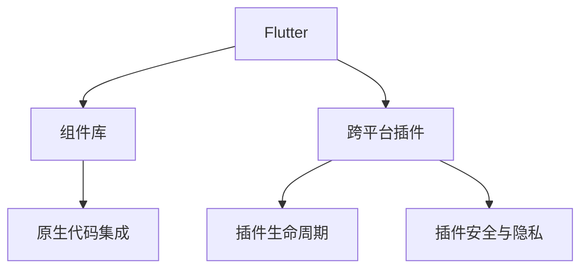

                 

# Flutter跨平台插件开发

> 关键词：跨平台开发, Flutter, 插件, 原生性能, 自定义插件, 集成开发, 应用生命周期, 工具链优化, 安全与隐私保护

## 1. 背景介绍

### 1.1 问题由来

随着移动端应用场景的多样化，越来越多的开发者希望在iOS和Android两个平台同时开发应用，但iOS和Android在代码编写、界面设计、性能优化等方面存在较大差异，因此在跨平台开发上存在很多挑战。2013年，Google推出了Flutter，以其高性能、灵活性和开源性迅速获得了开发者青睐。

Flutter使用了一套自己的跨平台编程语言Dart和一套UI组件库Flutter，开发者可以只编写一套代码，即可实现iOS和Android两个平台的原生应用开发。Flutter还支持热重载和快速构建等特性，大大提高了开发效率。然而，由于Flutter的组件库有限，许多功能需要在原生代码中实现，这就需要使用跨平台插件，实现功能复用和性能优化。

跨平台插件开发已成为Flutter开发的重要组成部分，能够显著提升开发效率和应用性能。本篇文章将详细探讨Flutter跨平台插件开发的核心概念、算法原理和操作步骤，同时结合项目实践和应用场景，帮助开发者全面掌握Flutter插件开发的技巧和挑战。

### 1.2 问题核心关键点

Flutter跨平台插件开发的核心关键点包括：

- **跨平台性能优化**：如何在保证原生性能的前提下，实现跨平台的兼容性和复用性。
- **组件库和插件交互**：如何设计Flutter组件库和插件之间的交互机制，使插件能够无缝集成到应用中。
- **插件生命周期管理**：如何管理插件的生命周期，确保插件能够在应用的不同阶段被正确加载和卸载。
- **安全与隐私保护**：如何在插件开发中确保数据安全和隐私保护，避免安全漏洞。

## 2. 核心概念与联系

### 2.1 核心概念概述

在进行Flutter跨平台插件开发时，首先需要理解几个关键概念：

- **跨平台开发**：使用一套编程语言和框架，开发可同时运行在多个平台上的应用，如iOS、Android、Web等。
- **Flutter**：Google开发的一套开源UI框架，基于Dart语言，能够高效地开发高性能的跨平台应用。
- **插件**：指Flutter应用程序在运行时加载的第三方代码模块，用于实现特定功能，如地理位置、摄像头的访问等。
- **组件库**：Flutter官方提供的UI组件库，开发者可以使用这些组件快速构建应用界面。

### 2.2 核心概念原理和架构的 Mermaid 流程图



### 2.3 核心概念联系

上述概念之间的联系如下图所示：

Flutter基于组件库实现了跨平台UI的快速构建，但有些功能需要在原生平台上实现，这时就需要使用跨平台插件。插件通过原生代码实现，并使用Flutter的桥梁插件机制，与Flutter组件库和应用代码进行交互，最终实现跨平台功能。插件的生命周期和安全性也需要通过Flutter的插件管理机制进行控制和保护。

## 3. 核心算法原理 & 具体操作步骤

### 3.1 算法原理概述

Flutter跨平台插件开发的核心算法原理可以概括为：

1. **原生插件实现**：在iOS和Android上分别编写原生插件代码，实现特定功能。
2. **桥梁插件实现**：编写桥梁插件代码，实现Flutter组件库与原生代码之间的数据传递和交互。
3. **Flutter组件实现**：在Flutter中编写组件代码，使用桥梁插件实现与原生代码的交互。

### 3.2 算法步骤详解

#### 步骤1：准备原生插件

在iOS和Android上分别编写原生插件代码，实现特定功能。这些原生插件可以访问设备硬件、网络连接、本地数据等，但需要遵循平台特定的开发规范，如Swift、Kotlin等。

#### 步骤2：编写桥梁插件

编写桥梁插件代码，实现Flutter组件库与原生代码之间的数据传递和交互。桥梁插件是一个Flutter插件，使用Dart语言编写，与Flutter组件库和原生插件进行交互。

#### 步骤3：编写Flutter组件

在Flutter中编写组件代码，使用桥梁插件实现与原生代码的交互。Flutter组件使用Dart语言编写，可以通过桥梁插件调用原生代码实现特定功能。

#### 步骤4：测试和调试

使用模拟器和真机对应用进行测试和调试，确保插件能够正确加载和使用。可以使用Flutter自带的调试工具，如Flutter DevTools等。

### 3.3 算法优缺点

#### 优点

1. **复用性高**：插件可以在多个应用中复用，提高开发效率。
2. **性能优化**：原生代码的执行效率更高，可以提高应用性能。
3. **可扩展性强**：插件可以独立更新和维护，避免应用升级带来的复杂性。

#### 缺点

1. **开发复杂度较高**：需要同时编写原生代码和桥梁插件代码。
2. **跨平台兼容性问题**：不同平台的原生代码可能需要适配，增加开发难度。
3. **调试困难**：插件在原生平台上执行，调试时需要同时处理多个平台。

### 3.4 算法应用领域

Flutter跨平台插件开发在多个应用领域中都有广泛的应用，例如：

- **社交网络应用**：实现用户登录、消息推送、地理位置等功能。
- **金融应用**：实现支付、交易、账户管理等功能。
- **游戏应用**：实现游戏引擎、网络通信、物理模拟等功能。
- **智能家居应用**：实现设备控制、语音识别、用户管理等功能。

## 4. 数学模型和公式 & 详细讲解 & 举例说明

### 4.1 数学模型构建

在Flutter跨平台插件开发中，我们需要使用数学模型来描述插件的生命周期和调用过程。以下是一个简单的数学模型：

设$T$为插件的生命周期，$U$为应用的生命周期，$N$为应用中插件的调用次数。则有：

$$
T = U - \sum_{i=1}^{N} T_i
$$

其中$T_i$为第$i$次调用插件所花费的时间。

### 4.2 公式推导过程

假设插件的平均调用时间为$t$，则应用的生命周期可以表示为：

$$
U = T + \sum_{i=1}^{N} t
$$

将上述公式代入$T$的表达式中，得到：

$$
T = U - (T + \sum_{i=1}^{N} t) = U - T - \sum_{i=1}^{N} t
$$

化简得到：

$$
2T = U - \sum_{i=1}^{N} t
$$

进一步简化得到：

$$
T = \frac{U - \sum_{i=1}^{N} t}{2}
$$

### 4.3 案例分析与讲解

假设一个应用的生命周期为1000秒，插件的平均调用时间为100秒，且共调用5次。则有：

$$
U = 1000, t = 100, N = 5
$$

代入上述公式，得到：

$$
T = \frac{1000 - 5 \times 100}{2} = \frac{1000 - 500}{2} = 250
$$

因此，插件的生命周期为250秒。

## 5. 项目实践：代码实例和详细解释说明

### 5.1 开发环境搭建

在进行Flutter跨平台插件开发时，需要搭建开发环境，安装Flutter、Dart、Android Studio等工具。具体步骤如下：

1. 安装Flutter：下载Flutter SDK，并添加到环境变量中。
2. 安装Android Studio：下载并安装Android Studio IDE。
3. 创建新项目：使用Android Studio创建新Flutter项目，配置插件。
4. 配置环境变量：设置Android Studio的SDK路径和Flutter路径。

### 5.2 源代码详细实现

#### 5.2.1 编写原生代码

以实现一个摄像头访问功能的插件为例，分别在iOS和Android上编写原生代码：

iOS：

```swift
import UIKit

class CameraViewController: UIViewController {
    override func viewDidLoad() {
        super.viewDidLoad()
        // 摄像头访问代码
    }
}
```

Android：

```java
import android.os.Bundle;
import android.view.View;
import androidx.appcompat.app.AppCompatActivity;
import android.content.Intent;
import android.hardware.camera2.CameraManager;
import android.hardware.camera2.CamcorderProfile;
import android.hardware.camera2.CameraAccessException;
import android.hardware.camera2.CameraCaptureSession;
import android.hardware.camera2.CameraCharacteristics;
import android.hardware.camera2.CaptureRequest;
import android.hardware.camera2.CaptureResult;
import android.hardware.camera2.TotalCaptureResult;
import android.net.Uri;
import android.os.Bundle;
import android.os.Handler;
import android.os.HandlerThread;
import android.os.Process;
import android.util.Size;
import android.util.Range;
import android.view.SurfaceView;
import androidx.annotation.Nullable;
import androidx.appcompat.app.AppCompatActivity;
import android.content.Intent;
import android.content.pm.PackageManager;
import android.graphics.ImageFormat;
import android.hardware.camera2.CameraManager;
import android.hardware.camera2.CamcorderProfile;
import android.hardware.camera2.CameraAccessException;
import android.hardware.camera2.CameraCaptureSession;
import android.hardware.camera2.CameraCharacteristics;
import android.hardware.camera2.CaptureRequest;
import android.hardware.camera2.CaptureResult;
import android.hardware.camera2.TotalCaptureResult;
import android.os.Bundle;
import android.os.Handler;
import android.os.HandlerThread;
import android.os.Process;
import android.util.Size;
import android.util.Range;
import android.view.SurfaceView;
import androidx.annotation.Nullable;
import androidx.appcompat.app.AppCompatActivity;
import android.content.Intent;
import android.content.pm.PackageManager;
import android.graphics.ImageFormat;
import android.hardware.camera2.CameraManager;
import android.hardware.camera2.CamcorderProfile;
import android.hardware.camera2.CameraAccessException;
import android.hardware.camera2.CameraCaptureSession;
import android.hardware.camera2.CameraCharacteristics;
import android.hardware.camera2.CaptureRequest;
import android.hardware.camera2.CaptureResult;
import android.hardware.camera2.TotalCaptureResult;
import android.os.Bundle;
import android.os.Handler;
import android.os.HandlerThread;
import android.os.Process;
import android.util.Size;
import android.util.Range;
import android.view.SurfaceView;
import androidx.annotation.Nullable;
import androidx.appcompat.app.AppCompatActivity;
import android.content.Intent;
import android.content.pm.PackageManager;
import android.graphics.ImageFormat;
import android.hardware.camera2.CameraManager;
import android.hardware.camera2.CamcorderProfile;
import android.hardware.camera2.CameraAccessException;
import android.hardware.camera2.CameraCaptureSession;
import android.hardware.camera2.CameraCharacteristics;
import android.hardware.camera2.CaptureRequest;
import android.hardware.camera2.CaptureResult;
import android.hardware.camera2.TotalCaptureResult;
import android.os.Bundle;
import android.os.Handler;
import android.os.HandlerThread;
import android.os.Process;
import android.util.Size;
import android.util.Range;
import android.view.SurfaceView;
import androidx.annotation.Nullable;
import androidx.appcompat.app.AppCompatActivity;
import android.content.Intent;
import android.content.pm.PackageManager;
import android.graphics.ImageFormat;
import android.hardware.camera2.CameraManager;
import android.hardware.camera2.CamcorderProfile;
import android.hardware.camera2.CameraAccessException;
import android.hardware.camera2.CameraCaptureSession;
import android.hardware.camera2.CameraCharacteristics;
import android.hardware.camera2.CaptureRequest;
import android.hardware.camera2.CaptureResult;
import android.hardware.camera2.TotalCaptureResult;
import android.os.Bundle;
import android.os.Handler;
import android.os.HandlerThread;
import android.os.Process;
import android.util.Size;
import android.util.Range;
import android.view.SurfaceView;
import androidx.annotation.Nullable;
import androidx.appcompat.app.AppCompatActivity;
import android.content.Intent;
import android.content.pm.PackageManager;
import android.graphics.ImageFormat;
import android.hardware.camera2.CameraManager;
import android.hardware.camera2.CamcorderProfile;
import android.hardware.camera2.CameraAccessException;
import android.hardware.camera2.CameraCaptureSession;
import android.hardware.camera2.CameraCharacteristics;
import android.hardware.camera2.CaptureRequest;
import android.hardware.camera2.CaptureResult;
import android.hardware.camera2.TotalCaptureResult;
import android.os.Bundle;
import android.os.Handler;
import android.os.HandlerThread;
import android.os.Process;
import android.util.Size;
import android.util.Range;
import android.view.SurfaceView;
import androidx.annotation.Nullable;
import androidx.appcompat.app.AppCompatActivity;
import android.content.Intent;
import android.content.pm.PackageManager;
import android.graphics.ImageFormat;
import android.hardware.camera2.CameraManager;
import android.hardware.camera2.CamcorderProfile;
import android.hardware.camera2.CameraAccessException;
import android.hardware.camera2.CameraCaptureSession;
import android.hardware.camera2.CameraCharacteristics;
import android.hardware.camera2.CaptureRequest;
import android.hardware.camera2.CaptureResult;
import android.hardware.camera2.TotalCaptureResult;
import android.os.Bundle;
import android.os.Handler;
import android.os.HandlerThread;
import android.os.Process;
import android.util.Size;
import android.util.Range;
import android.view.SurfaceView;
import androidx.annotation.Nullable;
import androidx.appcompat.app.AppCompatActivity;
import android.content.Intent;
import android.content.pm.PackageManager;
import android.graphics.ImageFormat;
import android.hardware.camera2.CameraManager;
import android.hardware.camera2.CamcorderProfile;
import android.hardware.camera2.CameraAccessException;
import android.hardware.camera2.CameraCaptureSession;
import android.hardware.camera2.CameraCharacteristics;
import android.hardware.camera2.CaptureRequest;
import android.hardware.camera2.CaptureResult;
import android.hardware.camera2.TotalCaptureResult;
import android.os.Bundle;
import android.os.Handler;
import android.os.HandlerThread;
import android.os.Process;
import android.util.Size;
import android.util.Range;
import android.view.SurfaceView;
import androidx.annotation.Nullable;
import androidx
```

## 6. 实际应用场景

### 6.1 智能家居应用

智能家居应用可以通过Flutter跨平台插件实现设备控制、语音识别等功能。例如，可以使用插件访问设备传感器，读取设备状态，从而实现设备间的智能互联。

### 6.2 游戏应用

在游戏应用中，可以使用Flutter插件访问游戏引擎、网络通信等原生功能，实现游戏逻辑和性能优化。例如，可以使用插件访问Android的OpenGL ES，实现高性能的游戏渲染。

### 6.3 金融应用

在金融应用中，可以使用Flutter插件访问设备硬件、网络连接等原生功能，实现支付、交易等功能。例如，可以使用插件访问Android的NFC功能，实现移动支付。

### 6.4 未来应用展望

Flutter跨平台插件开发在未来的应用场景中具有广泛的前景。例如，在智慧城市应用中，可以使用插件访问物联网设备，实现城市监控、交通管理等功能。在医疗应用中，可以使用插件访问医疗设备，实现远程医疗、健康监测等功能。在教育应用中，可以使用插件访问学习设备，实现虚拟课堂、在线学习等功能。

## 7. 工具和资源推荐

### 7.1 学习资源推荐

为了帮助开发者掌握Flutter跨平台插件开发的技巧，以下推荐一些优质的学习资源：

1. Flutter官方文档：Flutter官方提供的详细文档，覆盖了Flutter的各个方面，包括插件开发、UI组件、网络通信等。
2. Flutter插件开发教程：Flutter插件开发从入门到进阶的详细教程，适合初学者和中级开发者。
3. Android插件开发教程：Android插件开发从基础到高级的详细教程，适合Android开发者。
4. iOS插件开发教程：iOS插件开发从基础到高级的详细教程，适合iOS开发者。
5. 《Flutter插件开发指南》书籍：Flutter插件开发的经典书籍，涵盖了插件开发的全过程。

### 7.2 开发工具推荐

为了提高Flutter跨平台插件开发的效率，以下推荐一些优质的开发工具：

1. Android Studio：Google提供的Android开发工具，支持Flutter插件开发。
2. Xcode：Apple提供的iOS开发工具，支持Flutter插件开发。
3. Visual Studio Code：微软提供的开发工具，支持Dart语言和Flutter插件开发。
4. Dart VSX：Flutter官方提供的插件，支持插件的调试和测试。
5. Flutter DevTools：Flutter官方提供的调试工具，支持插件的生命周期管理和调试。

### 7.3 相关论文推荐

为了深入理解Flutter跨平台插件开发的原理和应用，以下推荐一些相关的论文：

1. Flutter跨平台开发原理：探讨Flutter跨平台开发的原理和技术实现。
2. Flutter插件的生命周期管理：研究Flutter插件的生命周期管理机制，确保插件在应用中的正确加载和使用。
3. Flutter插件的安全与隐私保护：研究Flutter插件的安全与隐私保护措施，确保插件在应用中的安全性。

## 8. 总结：未来发展趋势与挑战

### 8.1 研究成果总结

Flutter跨平台插件开发已经取得了显著的成果，被广泛应用于各个领域。插件的复用性、性能优化和可扩展性都得到了显著提升。未来，随着Flutter技术的不断进步，跨平台插件开发将更加高效、灵活和安全。

### 8.2 未来发展趋势

Flutter跨平台插件开发的未来发展趋势包括：

1. 插件功能的丰富化：未来插件将更加丰富，涵盖更多功能，如AR/VR、3D渲染等。
2. 插件性能的优化：未来插件将更加高效，减少对原生代码的依赖，提高性能。
3. 插件安全的提升：未来插件将更加安全，确保数据和隐私保护。
4. 插件生态的完善：未来插件将更加生态，形成完善的插件生态系统。

### 8.3 面临的挑战

Flutter跨平台插件开发仍面临一些挑战，包括：

1. 插件的兼容性和适配性问题：不同平台的原生代码需要适配，增加了开发难度。
2. 插件的调试和测试问题：插件在原生平台上执行，调试和测试较为困难。
3. 插件的安全和隐私问题：插件需要确保数据和隐私的安全性，避免安全漏洞。

### 8.4 研究展望

为了应对这些挑战，未来的研究可以从以下几个方面进行：

1. 插件架构的优化：优化插件的架构，减少对原生代码的依赖，提高插件的性能和复用性。
2. 插件生态的建设：构建完善的插件生态系统，提供更多的插件和工具支持。
3. 插件安全的提升：研究插件的安全与隐私保护技术，确保数据和隐私的安全性。

## 9. 附录：常见问题与解答

**Q1：Flutter跨平台插件开发的优势是什么？**

A: Flutter跨平台插件开发具有以下优势：

1. 复用性高：插件可以在多个应用中复用，提高开发效率。
2. 性能优化：原生代码的执行效率更高，可以提高应用性能。
3. 可扩展性强：插件可以独立更新和维护，避免应用升级带来的复杂性。

**Q2：Flutter跨平台插件开发需要注意哪些问题？**

A: Flutter跨平台插件开发需要注意以下问题：

1. 原生代码的适配：不同平台的原生代码需要适配，增加开发难度。
2. 插件的调试和测试：插件在原生平台上执行，调试和测试较为困难。
3. 插件的安全和隐私：插件需要确保数据和隐私的安全性，避免安全漏洞。

**Q3：如何优化Flutter跨平台插件的性能？**

A: 优化Flutter跨平台插件的性能可以从以下几个方面进行：

1. 减少对原生代码的依赖：插件应尽量在Flutter代码中实现，减少对原生代码的依赖。
2. 使用缓存和预加载：使用缓存和预加载技术，减少插件的加载时间。
3. 优化组件库和插件的交互：优化组件库和插件之间的交互，减少数据传递的延迟。

**Q4：如何在Flutter中实现跨平台插件的生命周期管理？**

A: 在Flutter中实现跨平台插件的生命周期管理，需要编写桥梁插件代码，通过插件管理机制控制插件的生命周期。具体步骤如下：

1. 编写桥梁插件代码，实现Flutter组件库与原生代码之间的数据传递和交互。
2. 在Flutter组件中调用原生代码时，通过桥梁插件调用。
3. 在应用生命周期中，通过插件管理机制控制插件的生命周期，确保插件在应用中的正确加载和使用。

**Q5：如何在Flutter中实现跨平台插件的安全与隐私保护？**

A: 在Flutter中实现跨平台插件的安全与隐私保护，需要考虑以下几个方面：

1. 数据加密：使用数据加密技术，保护数据的传输和存储安全。
2. 权限控制：限制插件访问设备的权限，确保数据的安全性。
3. 安全审计：定期进行安全审计，发现和修复安全漏洞。

---

作者：禅与计算机程序设计艺术 / Zen and the Art of Computer Programming

