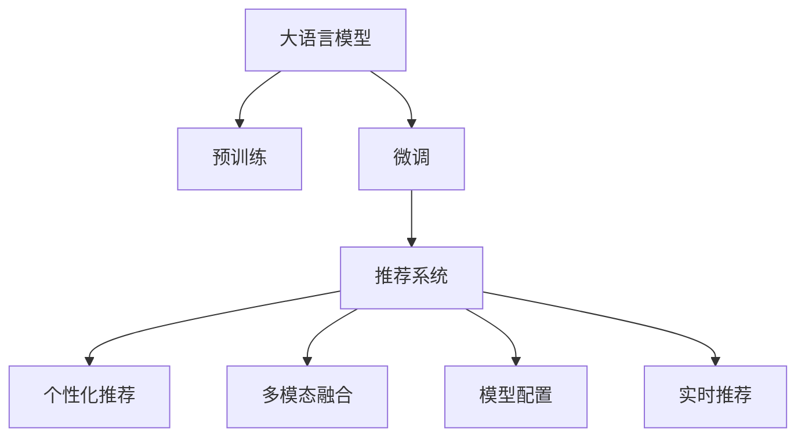

                 

# GENRE：灵活、可配置LLM推荐

> 关键词：大语言模型,推荐系统,个性化推荐,用户画像,模型配置,实时推荐,多模态融合

## 1. 背景介绍

随着互联网的飞速发展，用户从内容生产者逐渐变为消费者，个性化需求愈发凸显。推荐系统作为连接用户与内容的重要桥梁，承担着推荐高效、精准内容的任务。与此同时，大语言模型以其强大的自然语言处理能力，为推荐系统带来了新的思路和方法。

本文将深入探讨基于大语言模型的推荐系统。通过大模型的预训练和微调，推荐系统能根据用户的行为数据和偏好，生成灵活、可配置的推荐结果。其灵活性体现在可根据不同场景灵活调整推荐策略，提升用户满意度；可配置性则体现在可以定制推荐模型的特征工程和参数配置，进一步优化推荐效果。

## 2. 核心概念与联系

### 2.1 核心概念概述

要理解基于大语言模型的推荐系统，首先需要了解一些关键概念：

- 大语言模型(Large Language Model, LLM)：以Transformer为代表的大规模预训练语言模型，如BERT、GPT-3等。通过在大量无标签文本上预训练，学习到通用的语言知识和表达能力。

- 推荐系统(Recommendation System)：根据用户的历史行为和偏好，推荐合适的内容或商品的系统。推荐系统包括传统协同过滤、内容推荐、混合推荐等方法。

- 个性化推荐(Personalized Recommendation)：推荐系统根据用户个人的特征和偏好，生成更具针对性的推荐结果。

- 多模态融合(Multimodal Fusion)：结合文本、图像、语音等多种数据模态，构建更加全面、准确的推荐模型。

- 模型配置(Model Configuration)：针对特定推荐场景，定制推荐模型的特征选择、损失函数、优化器等配置参数，以实现最优推荐效果。

- 实时推荐(Real-time Recommendation)：根据用户的实时行为数据，动态生成个性化推荐内容。

这些概念之间的联系可以通过以下Mermaid流程图来展示：



这个流程图展示了从大语言模型到个性化推荐系统的数据流动和处理流程。大语言模型通过预训练获取通用的语言表示，通过微调适应特定推荐场景，并结合多模态数据和模型配置生成个性化推荐结果，同时具备实时推荐的能力。

## 3. 核心算法原理 & 具体操作步骤
### 3.1 算法原理概述

基于大语言模型的推荐系统，本质上是一种基于深度学习的推荐方法。其核心思想是通过大语言模型的预训练和微调，学习到通用的语言表示和用户偏好，并根据当前数据动态生成推荐结果。

假设预训练语言模型为 $M_{\theta}$，其中 $\theta$ 为预训练得到的模型参数。推荐系统包含用户历史行为数据 $D_{user}$ 和物品属性数据 $D_{item}$。模型通过对历史数据进行预训练和微调，得到用户-物品之间的关联度表示 $u_{user}$ 和 $i_{item}$。在推荐时，根据用户行为和物品属性，计算推荐相似度，生成推荐结果。

### 3.2 算法步骤详解

基于大语言模型的推荐系统一般包括以下几个关键步骤：

**Step 1: 数据准备和预处理**

1. 收集用户历史行为数据 $D_{user}$ 和物品属性数据 $D_{item}$。
2. 对数据进行清洗、归一化等预处理操作，形成可用于模型训练的数据集。
3. 将用户行为数据转化为向量形式，如使用one-hot编码或embedding向量表示。
4. 将物品属性数据转化为嵌入形式，如使用one-hot编码或基于属性的嵌入表示。

**Step 2: 模型初始化和预训练**

1. 选择合适的预训练语言模型 $M_{\theta}$，如BERT、GPT等，作为推荐系统的基础模型。
2. 将用户行为数据和物品属性数据输入模型进行预训练，学习到通用的语言表示。
3. 根据具体场景，在模型顶层添加推荐相关层，如全连接层、注意力机制等。

**Step 3: 模型微调和优化**

1. 选择合适的微调超参数，如学习率、批大小、迭代轮数等。
2. 使用推荐数据集进行微调，最小化推荐相似度损失，优化模型参数。
3. 引入正则化技术，如L2正则、Dropout、Early Stopping等，防止过拟合。
4. 保存训练好的模型，以备实时推荐使用。

**Step 4: 实时推荐**

1. 接收用户的实时行为数据，如浏览、点击、评分等。
2. 根据实时数据动态生成推荐结果，可以是多条候选物品或综合排序列表。
3. 集成推荐结果，生成最终推荐输出。

### 3.3 算法优缺点

基于大语言模型的推荐系统有以下优点：

1. 灵活性高。大语言模型能够根据不同场景灵活调整推荐策略，适应复杂多变的推荐需求。
2. 可配置性强。通过模型配置，可以在不同的推荐场景中调整特征工程和参数，实现最优推荐效果。
3. 融合多模态数据。结合文本、图像、语音等多模态数据，构建更加全面、准确的推荐模型。
4. 实时性强。大语言模型具备快速前向传播的能力，可以实现实时推荐，满足用户即时需求。

同时，该方法也存在一些局限性：

1. 数据需求大。推荐系统需要大量的历史行为和属性数据进行训练，数据获取成本较高。
2. 模型复杂度高。大语言模型参数量较大，计算资源消耗较多。
3. 推荐效果依赖数据质量。如果用户行为数据或物品属性数据质量不高，推荐效果可能不佳。
4. 实时推荐可能存在延迟。尽管实时推荐具有快速响应能力，但在大规模数据下仍可能存在延迟。
5. 模型参数较多。推荐系统涉及多个模型和层，参数量较大，训练和推理速度较慢。

尽管存在这些局限性，但基于大语言模型的推荐方法仍然具有巨大的应用潜力，适用于各类推荐场景。

### 3.4 算法应用领域

基于大语言模型的推荐系统在多个领域中得到了广泛应用，例如：

- 电商推荐：根据用户浏览、购买历史，推荐合适商品。结合商品属性、用户画像等多模态数据，提升推荐效果。
- 视频推荐：根据用户观看历史和评分，推荐相关视频内容。结合视频元数据，提升推荐准确性。
- 音乐推荐：根据用户听歌历史和偏好，推荐新歌或播放列表。结合歌曲属性，提升推荐多样性。
- 新闻推荐：根据用户阅读历史和点击行为，推荐相关新闻。结合新闻分类、作者属性等多模态数据，提升推荐效果。
- 个性化搜索：根据用户搜索历史和意图，推荐相关搜索结果。结合搜索结果的多模态信息，提升搜索结果的个性化程度。

除了上述这些典型应用外，大语言模型推荐系统还被创新性地应用到更多场景中，如健康推荐、教育推荐等，为各行业提供了强大的智能支持。

## 4. 数学模型和公式 & 详细讲解 & 举例说明

### 4.1 数学模型构建

本节将使用数学语言对基于大语言模型的推荐系统进行更加严格的刻画。

记推荐系统中的预训练语言模型为 $M_{\theta}$，用户行为数据为 $D_{user}$，物品属性数据为 $D_{item}$，推荐相似度为 $s_{user, item}$，推荐结果为 $r_{user}$。假设用户行为数据和物品属性数据都已转化为向量形式，推荐相似度 $s_{user, item}$ 通过预训练语言模型计算得到。

定义推荐系统的损失函数为：

$$
\mathcal{L} = \sum_{user} \sum_{item} (y_{item} \log s_{user, item} + (1-y_{item}) \log (1-s_{user, item}))
$$

其中 $y_{item}$ 为物品是否被用户点击或购买的二元标签。

在微调过程中，模型的目标是最小化上述损失函数，即找到最优参数：

$$
\theta^* = \mathop{\arg\min}_{\theta} \mathcal{L}
$$

### 4.2 公式推导过程

以电商推荐为例，推导推荐相似度 $s_{user, item}$ 的计算公式。

假设用户 $u$ 在时间 $t$ 浏览了 $n$ 个商品 $i_1, i_2, \ldots, i_n$，每个商品 $i_j$ 的属性向量为 $v_{i_j}$，用户 $u$ 的属性向量为 $u_u$。预训练语言模型 $M_{\theta}$ 的输出表示为 $o_{user, item} = M_{\theta}([u_u; v_{i_j}])$，其中 $[,]$ 表示拼接操作。推荐相似度 $s_{user, item}$ 可以通过如下公式计算：

$$
s_{user, item} = \text{softmax}(o_{user, item})
$$

在推荐时，对于每个候选物品 $i$，计算其与用户 $u$ 的相似度 $s_{user, i}$，选取相似度最大的 $k$ 个物品作为推荐结果。

### 4.3 案例分析与讲解

以视频推荐为例，分析基于大语言模型的推荐系统如何结合多模态数据提升推荐效果。

假设视频推荐系统的输入为用户 $u$ 和视频 $v$ 的文本描述 $t_u$ 和 $t_v$，视频时长 $d_v$，用户评分 $r_u$，以及视频分类 $c_v$。预训练语言模型 $M_{\theta}$ 的输出表示为 $o_{user, video} = M_{\theta}([u_u; v_t; d_v; r_u; c_v])$，其中 $[u_u; v_t; d_v; r_u; c_v]$ 表示用户和视频的文本、时长、评分、分类特征向量拼接后的形式。推荐相似度 $s_{user, video}$ 可以通过如下公式计算：

$$
s_{user, video} = \text{softmax}(o_{user, video})
$$

在推荐时，对于每个候选视频 $v$，计算其与用户 $u$ 的相似度 $s_{user, v}$，选取相似度最大的 $k$ 个视频作为推荐结果。同时，可以结合视频时长 $d_v$、用户评分 $r_u$ 和视频分类 $c_v$，使用加权方式调整推荐结果。

## 5. 项目实践：代码实例和详细解释说明

### 5.1 开发环境搭建

在进行大语言模型推荐系统的开发前，我们需要准备好开发环境。以下是使用Python进行PyTorch开发的环境配置流程：

1. 安装Anaconda：从官网下载并安装Anaconda，用于创建独立的Python环境。

2. 创建并激活虚拟环境：
```bash
conda create -n pytorch-env python=3.8 
conda activate pytorch-env
```

3. 安装PyTorch：根据CUDA版本，从官网获取对应的安装命令。例如：
```bash
conda install pytorch torchvision torchaudio cudatoolkit=11.1 -c pytorch -c conda-forge
```

4. 安装Transformers库：
```bash
pip install transformers
```

5. 安装各类工具包：
```bash
pip install numpy pandas scikit-learn matplotlib tqdm jupyter notebook ipython
```

完成上述步骤后，即可在`pytorch-env`环境中开始推荐系统的开发。

### 5.2 源代码详细实现

这里我们以电商推荐系统为例，给出使用Transformers库对BERT模型进行推荐微调的PyTorch代码实现。

首先，定义推荐任务的数据处理函数：

```python
from transformers import BertTokenizer
from torch.utils.data import Dataset
import torch

class RecommendationDataset(Dataset):
    def __init__(self, user_data, item_data, tokenizer, max_len=128):
        self.user_data = user_data
        self.item_data = item_data
        self.tokenizer = tokenizer
        self.max_len = max_len
        
    def __len__(self):
        return len(self.user_data)
    
    def __getitem__(self, item):
        user = self.user_data[item]
        item = self.item_data[item]
        
        encoding = self.tokenizer(user, item, return_tensors='pt', max_length=self.max_len, padding='max_length', truncation=True)
        user_input_ids = encoding['input_ids'][0]
        item_input_ids = encoding['input_ids'][1]
        
        return {'user_input_ids': user_input_ids,
                'item_input_ids': item_input_ids}
```

然后，定义模型和优化器：

```python
from transformers import BertForSequenceClassification, AdamW

model = BertForSequenceClassification.from_pretrained('bert-base-cased', num_labels=2)

optimizer = AdamW(model.parameters(), lr=2e-5)
```

接着，定义训练和评估函数：

```python
from torch.utils.data import DataLoader
from tqdm import tqdm
from sklearn.metrics import classification_report

device = torch.device('cuda') if torch.cuda.is_available() else torch.device('cpu')
model.to(device)

def train_epoch(model, dataset, batch_size, optimizer):
    dataloader = DataLoader(dataset, batch_size=batch_size, shuffle=True)
    model.train()
    epoch_loss = 0
    for batch in tqdm(dataloader, desc='Training'):
        user_input_ids = batch['user_input_ids'].to(device)
        item_input_ids = batch['item_input_ids'].to(device)
        model.zero_grad()
        outputs = model(user_input_ids, item_input_ids)
        loss = outputs.loss
        epoch_loss += loss.item()
        loss.backward()
        optimizer.step()
    return epoch_loss / len(dataloader)

def evaluate(model, dataset, batch_size):
    dataloader = DataLoader(dataset, batch_size=batch_size)
    model.eval()
    preds, labels = [], []
    with torch.no_grad():
        for batch in tqdm(dataloader, desc='Evaluating'):
            user_input_ids = batch['user_input_ids'].to(device)
            item_input_ids = batch['item_input_ids'].to(device)
            batch_labels = batch['labels']
            outputs = model(user_input_ids, item_input_ids)
            batch_preds = outputs.logits.argmax(dim=2).to('cpu').tolist()
            batch_labels = batch_labels.to('cpu').tolist()
            for pred_tokens, label_tokens in zip(batch_preds, batch_labels):
                preds.append(pred_tokens[:len(label_tokens)])
                labels.append(label_tokens)
                
    print(classification_report(labels, preds))
```

最后，启动训练流程并在测试集上评估：

```python
epochs = 5
batch_size = 16

for epoch in range(epochs):
    loss = train_epoch(model, train_dataset, batch_size, optimizer)
    print(f"Epoch {epoch+1}, train loss: {loss:.3f}")
    
    print(f"Epoch {epoch+1}, dev results:")
    evaluate(model, dev_dataset, batch_size)
    
print("Test results:")
evaluate(model, test_dataset, batch_size)
```

以上就是使用PyTorch对BERT进行电商推荐系统微调的完整代码实现。可以看到，得益于Transformers库的强大封装，我们可以用相对简洁的代码完成BERT模型的加载和微调。

### 5.3 代码解读与分析

让我们再详细解读一下关键代码的实现细节：

**RecommendationDataset类**：
- `__init__`方法：初始化用户数据、物品数据、分词器等关键组件。
- `__len__`方法：返回数据集的样本数量。
- `__getitem__`方法：对单个样本进行处理，将用户和物品的文本输入编码为token ids，并对其进行定长padding，最终返回模型所需的输入。

**model和optimizer定义**：
- 使用BertForSequenceClassification类定义模型，并设置2个标签，即物品是否被用户点击或购买的二元标签。
- 使用AdamW优化器进行模型参数更新。

**训练和评估函数**：
- 使用PyTorch的DataLoader对数据集进行批次化加载，供模型训练和推理使用。
- 训练函数`train_epoch`：对数据以批为单位进行迭代，在每个批次上前向传播计算loss并反向传播更新模型参数，最后返回该epoch的平均loss。
- 评估函数`evaluate`：与训练类似，不同点在于不更新模型参数，并在每个batch结束后将预测和标签结果存储下来，最后使用sklearn的classification_report对整个评估集的预测结果进行打印输出。

**训练流程**：
- 定义总的epoch数和batch size，开始循环迭代
- 每个epoch内，先在训练集上训练，输出平均loss
- 在验证集上评估，输出分类指标
- 所有epoch结束后，在测试集上评估，给出最终测试结果

可以看到，PyTorch配合Transformers库使得BERT微调的代码实现变得简洁高效。开发者可以将更多精力放在数据处理、模型改进等高层逻辑上，而不必过多关注底层的实现细节。

当然，工业级的系统实现还需考虑更多因素，如模型的保存和部署、超参数的自动搜索、更灵活的任务适配层等。但核心的微调范式基本与此类似。

## 6. 实际应用场景
### 6.1 智能推荐广告

基于大语言模型的推荐系统在广告推荐中的应用非常广泛。广告平台可以通过用户浏览行为数据，动态生成推荐广告，提高点击率和转化率。

在技术实现上，可以收集用户浏览历史和点击数据，将用户行为数据转化为向量形式，输入BERT模型进行预训练和微调。微调后的模型能够根据用户的历史行为预测其偏好，从而推荐更合适的广告。通过多轮反馈机制，不断优化广告推荐策略，提高广告效果。

### 6.2 个性化新闻订阅

新闻订阅平台可以根据用户阅读历史和评分数据，推荐相关新闻。基于大语言模型的推荐系统可以结合新闻标题、作者、分类等多模态信息，提升推荐准确性。

在具体实现中，可以收集用户的历史阅读记录和评分数据，将新闻标题、作者、分类等信息转化为向量形式，输入BERT模型进行预训练和微调。微调后的模型能够根据用户的历史行为和兴趣，推荐更符合其口味的新闻。同时，可以结合实时数据动态调整推荐策略，满足用户即时需求。

### 6.3 智能娱乐推荐

在线娱乐平台如音乐、视频平台，可以基于用户历史行为和兴趣，推荐相关娱乐内容。基于大语言模型的推荐系统可以结合音乐属性、视频时长、用户评分等多模态信息，提升推荐效果。

在具体实现中，可以收集用户的历史听歌、观看记录和评分数据，将娱乐内容的属性信息转化为向量形式，输入BERT模型进行预训练和微调。微调后的模型能够根据用户的历史行为和兴趣，推荐更合适的音乐、视频内容。同时，可以结合实时数据动态调整推荐策略，满足用户即时需求。

### 6.4 未来应用展望

随着大语言模型和推荐系统的不断发展，基于大语言模型的推荐技术将在更多领域得到应用，为各行业带来变革性影响。

在智慧医疗领域，基于大语言模型的推荐系统可以推荐合适的医疗咨询、用药建议，帮助医生诊断疾病，推荐治疗方案。

在智能教育领域，推荐系统可以根据学生的学习记录和兴趣，推荐合适的课程、教材和学习资源，提升学习效果。

在智慧城市治理中，推荐系统可以推荐合适的城市活动、交通路线、旅游景点，提高城市居民的生活质量。

此外，在金融、旅游、农业等众多领域，基于大语言模型的推荐系统也将不断涌现，为各行业提供强大的智能支持。相信随着技术的日益成熟，大语言模型推荐系统必将在构建人机协同的智能时代中扮演越来越重要的角色。

## 7. 工具和资源推荐
### 7.1 学习资源推荐

为了帮助开发者系统掌握大语言模型推荐系统的理论基础和实践技巧，这里推荐一些优质的学习资源：

1. 《Transformer from Scratch》系列博文：由大模型技术专家撰写，深入浅出地介绍了Transformer原理、BERT模型、推荐系统等前沿话题。

2. CS229《机器学习》课程：斯坦福大学开设的机器学习明星课程，涵盖推荐系统、深度学习等主题，提供Lecture视频和配套作业，带你入门推荐系统领域。

3. 《Recommender Systems: Algorithms and Challenge》书籍：系统介绍了推荐系统的基本算法和挑战，适合推荐系统研究者阅读。

4. RecSys开源项目：推荐系统开源平台，提供丰富的推荐系统算法和评估指标，助力推荐系统技术发展。

5. Matrix Factorization for Latent Semantic Modeling：经典推荐系统论文，介绍了矩阵分解等推荐算法，适合推荐系统开发者阅读。

通过对这些资源的学习实践，相信你一定能够快速掌握大语言模型推荐系统的精髓，并用于解决实际的推荐问题。
###  7.2 开发工具推荐

高效的开发离不开优秀的工具支持。以下是几款用于大语言模型推荐系统开发的常用工具：

1. PyTorch：基于Python的开源深度学习框架，灵活动态的计算图，适合快速迭代研究。大部分预训练语言模型都有PyTorch版本的实现。

2. TensorFlow：由Google主导开发的开源深度学习框架，生产部署方便，适合大规模工程应用。同样有丰富的预训练语言模型资源。

3. Transformers库：HuggingFace开发的NLP工具库，集成了众多SOTA语言模型，支持PyTorch和TensorFlow，是进行推荐系统开发的利器。

4. Weights & Biases：模型训练的实验跟踪工具，可以记录和可视化模型训练过程中的各项指标，方便对比和调优。与主流深度学习框架无缝集成。

5. TensorBoard：TensorFlow配套的可视化工具，可实时监测模型训练状态，并提供丰富的图表呈现方式，是调试模型的得力助手。

6. Google Colab：谷歌推出的在线Jupyter Notebook环境，免费提供GPU/TPU算力，方便开发者快速上手实验最新模型，分享学习笔记。

合理利用这些工具，可以显著提升大语言模型推荐系统的开发效率，加快创新迭代的步伐。

### 7.3 相关论文推荐

大语言模型和推荐系统的发展源于学界的持续研究。以下是几篇奠基性的相关论文，推荐阅读：

1. Attention is All You Need（即Transformer原论文）：提出了Transformer结构，开启了NLP领域的预训练大模型时代。

2. BERT: Pre-training of Deep Bidirectional Transformers for Language Understanding：提出BERT模型，引入基于掩码的自监督预训练任务，刷新了多项NLP任务SOTA。

3. Matrix Factorization Techniques for Recommender Systems：介绍了矩阵分解等推荐算法，是推荐系统领域经典的论文之一。

4. Practical Recommendation Systems with Deep Learning：经典推荐系统书籍，详细介绍了推荐系统的原理和算法。

5. Multi-Task Learning with Differentiable Hierarchical Loss for Recommendation：提出多任务学习的推荐系统方法，提升了推荐模型的综合性能。

这些论文代表了大语言模型推荐系统的发展脉络。通过学习这些前沿成果，可以帮助研究者把握学科前进方向，激发更多的创新灵感。

## 8. 总结：未来发展趋势与挑战

### 8.1 总结

本文对基于大语言模型的推荐系统进行了全面系统的介绍。首先阐述了大语言模型和推荐系统的基础理论，明确了推荐系统在NLP任务中的应用价值。其次，从原理到实践，详细讲解了基于大语言模型的推荐系统，给出了推荐系统开发的完整代码实例。同时，本文还广泛探讨了推荐系统在多个行业领域的应用前景，展示了其巨大的应用潜力。

通过本文的系统梳理，可以看到，基于大语言模型的推荐系统正在成为推荐领域的重要范式，极大地拓展了推荐系统的应用边界，催生了更多的落地场景。受益于大规模语料的预训练，推荐系统能够根据用户行为数据和偏好，生成灵活、可配置的推荐结果，满足不同用户的需求。未来，伴随大语言模型和推荐系统的不断演进，相信推荐系统必将在更多领域发挥重要作用，为各行各业提供强大的智能支持。

### 8.2 未来发展趋势

展望未来，基于大语言模型的推荐系统将呈现以下几个发展趋势：

1. 推荐算法的个性化和多样性提升。随着个性化推荐技术的发展，未来的推荐系统将更加灵活，能够根据用户的多样化需求生成更个性化、多样化的推荐结果。

2. 推荐模型的融合和协同。未来的推荐系统将结合深度学习、知识图谱、协同过滤等多种方法，构建更加全面、高效的推荐模型。

3. 推荐系统的实时化和自动化。实时推荐和自动化推荐技术的发展，将使推荐系统能够更加快速响应用户需求，提高推荐效率。

4. 推荐系统的多模态融合。结合文本、图像、语音等多模态信息，构建更加全面、准确的推荐模型，提升推荐效果。

5. 推荐系统的跨领域迁移。通过跨领域迁移学习，使推荐系统具备更广泛的适用性，提升推荐系统的泛化性能。

6. 推荐系统的伦理性提升。未来推荐系统将更加注重算法伦理和用户隐私，确保推荐系统的公平、透明和可信。

以上趋势凸显了大语言模型推荐系统的广阔前景。这些方向的探索发展，必将进一步提升推荐系统的性能和应用范围，为各行各业提供更强大的智能支持。

### 8.3 面临的挑战

尽管基于大语言模型的推荐系统已经取得了瞩目成就，但在迈向更加智能化、普适化应用的过程中，它仍面临着诸多挑战：

1. 数据获取成本高。推荐系统需要大量的用户行为和物品属性数据，数据获取成本较高。

2. 模型复杂度高。大语言模型参数量较大，计算资源消耗较多。

3. 推荐效果依赖数据质量。如果用户行为数据或物品属性数据质量不高，推荐效果可能不佳。

4. 实时推荐可能存在延迟。尽管实时推荐具有快速响应能力，但在大规模数据下仍可能存在延迟。

5. 模型参数较多。推荐系统涉及多个模型和层，参数量较大，训练和推理速度较慢。

尽管存在这些挑战，但基于大语言模型的推荐方法仍然具有巨大的应用潜力，适用于各类推荐场景。

### 8.4 研究展望

面对基于大语言模型的推荐系统所面临的挑战，未来的研究需要在以下几个方面寻求新的突破：

1. 探索无监督和半监督推荐方法。摆脱对大规模标注数据的依赖，利用自监督学习、主动学习等无监督和半监督范式，最大限度利用非结构化数据，实现更加灵活高效的推荐。

2. 研究参数高效和计算高效的推荐范式。开发更加参数高效的推荐方法，在固定大部分预训练参数的同时，只更新极少量的任务相关参数。同时优化推荐模型的计算图，减少前向传播和反向传播的资源消耗，实现更加轻量级、实时性的部署。

3. 融合因果和对比学习范式。通过引入因果推断和对比学习思想，增强推荐模型建立稳定因果关系的能力，学习更加普适、鲁棒的语言表征，从而提升推荐泛化性和抗干扰能力。

4. 引入更多先验知识。将符号化的先验知识，如知识图谱、逻辑规则等，与神经网络模型进行巧妙融合，引导推荐过程学习更准确、合理的语言模型。同时加强不同模态数据的整合，实现视觉、语音等多模态信息与文本信息的协同建模。

5. 结合因果分析和博弈论工具。将因果分析方法引入推荐模型，识别出推荐决策的关键特征，增强输出解释的因果性和逻辑性。借助博弈论工具刻画人机交互过程，主动探索并规避推荐系统的脆弱点，提高系统稳定性。

6. 纳入伦理道德约束。在推荐算法中引入伦理导向的评估指标，过滤和惩罚有偏见、有害的输出倾向。同时加强人工干预和审核，建立推荐系统的监管机制，确保推荐结果符合人类价值观和伦理道德。

这些研究方向的探索，必将引领大语言模型推荐系统迈向更高的台阶，为构建安全、可靠、可解释、可控的智能推荐系统铺平道路。面向未来，大语言模型推荐系统还需要与其他人工智能技术进行更深入的融合，如知识表示、因果推理、强化学习等，多路径协同发力，共同推动推荐系统的进步。只有勇于创新、敢于突破，才能不断拓展推荐系统的边界，让智能技术更好地服务于人类。

## 9. 附录：常见问题与解答

**Q1：大语言模型推荐系统是否适用于所有推荐场景？**

A: 大语言模型推荐系统在大多数推荐场景中都能取得不错的效果，特别是对于数据量较小的场景。但对于一些特定领域的推荐，如医疗、法律等，仅仅依靠通用语料预训练的模型可能难以很好地适应。此时需要在特定领域语料上进一步预训练，再进行微调，才能获得理想效果。此外，对于一些需要时效性、个性化很强的场景，如对话推荐、视频推荐等，微调方法也需要针对性的改进优化。

**Q2：微调过程中如何选择合适的学习率？**

A: 微调的学习率一般要比预训练时小1-2个数量级，如果使用过大的学习率，容易破坏预训练权重，导致过拟合。一般建议从1e-5开始调参，逐步减小学习率，直至收敛。也可以使用warmup策略，在开始阶段使用较小的学习率，再逐渐过渡到预设值。需要注意的是，不同的优化器(如AdamW、Adafactor等)以及不同的学习率调度策略，可能需要设置不同的学习率阈值。

**Q3：采用大语言模型推荐时会面临哪些资源瓶颈？**

A: 目前主流的预训练大模型动辄以亿计的参数规模，对算力、内存、存储都提出了很高的要求。GPU/TPU等高性能设备是必不可少的，但即便如此，超大批次的训练和推理也可能遇到显存不足的问题。因此需要采用一些资源优化技术，如梯度积累、混合精度训练、模型并行等，来突破硬件瓶颈。同时，模型的存储和读取也可能占用大量时间和空间，需要采用模型压缩、稀疏化存储等方法进行优化。

**Q4：如何缓解推荐系统中的过拟合问题？**

A: 过拟合是推荐系统面临的主要挑战之一，尤其是在标注数据不足的情况下。常见的缓解策略包括：
1. 数据增强：通过回译、近义替换等方式扩充训练集
2. 正则化：使用L2正则、Dropout、Early Stopping等避免过拟合
3. 对抗训练：引入对抗样本，提高模型鲁棒性
4. 参数高效推荐：只调整少量参数(如Adapter、Prefix等)，减小过拟合风险
5. 多模型集成：训练多个推荐模型，取平均输出，抑制过拟合

这些策略往往需要根据具体任务和数据特点进行灵活组合。只有在数据、模型、训练、推理等各环节进行全面优化，才能最大限度地发挥大语言模型推荐系统的威力。

**Q5：推荐系统在落地部署时需要注意哪些问题？**

A: 将大语言模型推荐系统转化为实际应用，还需要考虑以下因素：
1. 模型裁剪：去除不必要的层和参数，减小模型尺寸，加快推理速度
2. 量化加速：将浮点模型转为定点模型，压缩存储空间，提高计算效率
3. 服务化封装：将模型封装为标准化服务接口，便于集成调用
4. 弹性伸缩：根据请求流量动态调整资源配置，平衡服务质量和成本
5. 监控告警：实时采集系统指标，设置异常告警阈值，确保服务稳定性
6. 安全防护：采用访问鉴权、数据脱敏等措施，保障数据和模型安全

大语言模型推荐系统为推荐领域带来了新的思路和方法，但如何将强大的性能转化为稳定、高效、安全的业务价值，还需要工程实践的不断打磨。唯有从数据、算法、工程、业务等多个维度协同发力，才能真正实现大语言模型推荐系统的落地应用。总之，大语言模型推荐系统需要开发者根据具体任务，不断迭代和优化模型、数据和算法，方能得到理想的效果。

---

作者：禅与计算机程序设计艺术 / Zen and the Art of Computer Programming

