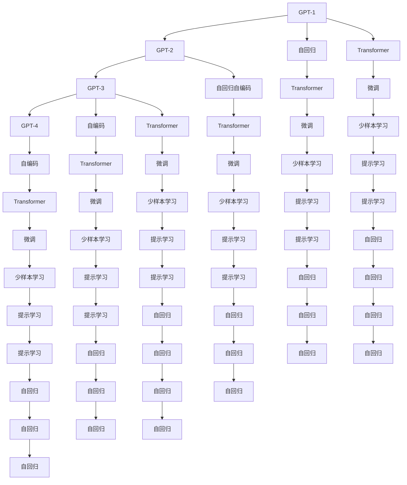

                 

# GPT-2到GPT-4：大语言模型的进化之路

> 关键词：大语言模型, GPT-2, GPT-3, GPT-4, 自然语言处理, 深度学习, 注意力机制, 自回归, 自编码

## 1. 背景介绍

### 1.1 问题由来

近年来，深度学习技术的迅猛发展极大地推动了自然语言处理(NLP)领域的研究进展，其中最引人注目的成果之一就是大规模预训练语言模型(如GPT系列)的问世。这些模型通过在海量无标签文本数据上进行预训练，学习到了丰富的语言知识和语义表示，能够生成自然流畅的文本、进行文本分类、问答、生成对话、翻译等多种自然语言任务，展现了惊人的智能表现。

但这些通用语言模型往往需要巨量的计算资源和数据进行预训练，且在大规模文本上预训练得到的模型通常需要微调才能适配特定领域的应用场景，无法直接应用于实际问题。因此，从GPT-2开始，研究者们不断探索如何优化模型架构、提升训练效率，并逐渐探索微调方法，以使这些大模型能更高效地应用于实际应用场景中。

### 1.2 问题核心关键点

大语言模型从GPT-2到GPT-4的发展过程，不仅体现了技术演进，更体现了对模型架构、训练方法、应用领域的深入探索和优化。

- **模型架构**：从自回归到自编码，再到自回归自编码的混合模型，模型架构的不断优化使得模型能够更好地利用并行计算，提升训练和推理效率。
- **训练效率**：通过并行计算、数据增强、对抗训练等技术手段，大幅提升训练效率，缩短模型训练时间。
- **应用领域**：从简单的文本生成任务到复杂的自然语言推理、对话生成、代码生成等任务，应用领域的不断拓展使得大语言模型在更多垂直领域取得了优异的表现。
- **微调方法**：从全参数微调到参数高效微调、零样本学习和提示学习等，微调方法的不断探索使得大模型能够更灵活地适应不同的任务需求。

本文将详细介绍大语言模型从GPT-2到GPT-4的演变过程，探讨其背后的核心算法和实际应用。

## 2. 核心概念与联系

### 2.1 核心概念概述

为更好地理解大语言模型的发展历程，我们首先介绍几个核心概念：

- **GPT系列**：GPT是Generative Pre-trained Transformer的缩写，指的是一系列基于Transformer架构的预训练语言模型，从GPT-1到GPT-4逐步迭代升级。
- **Transformer**：是一种基于注意力机制的神经网络架构，能够在处理长序列数据时保持较好的效果，并行计算能力优异。
- **自回归**：指模型通过前文预测后文，如GPT-1和GPT-2模型。
- **自编码**：指模型通过后文预测前文，如GPT-3和GPT-4模型。
- **微调**：在大模型基础上，针对特定任务进行有监督学习，优化模型在特定任务上的表现。
- **少样本学习**：在大模型基础上，通过精心设计的提示文本，在不进行标注数据的情况下，让模型直接输出任务结果。
- **提示学习**：通过修改输入文本，引导模型生成期望的输出，从而提升模型在特定任务上的表现。

这些核心概念之间的逻辑关系可以通过以下Mermaid流程图来展示：



这个流程图展示了从GPT-1到GPT-4的发展历程，以及模型架构、训练方法和应用领域的演变。

## 3. 核心算法原理 & 具体操作步骤
### 3.1 算法原理概述

大语言模型的核心算法原理主要体现在三个方面：模型架构、训练方法和应用场景。以下我们将详细介绍这三个方面的核心算法原理。

### 3.2 算法步骤详解

#### 3.2.1 GPT-2算法步骤详解

GPT-2模型的训练过程分为预训练和微调两个步骤。

**预训练**：
1. 收集大规模无标签文本数据，如英文维基百科、在线新闻等。
2. 使用自回归模型对文本进行预训练，优化模型参数，使其学习到通用的语言知识。
3. 将预训练得到的模型权重保存，作为微调的初始化参数。

**微调**：
1. 针对特定任务，如文本分类、对话生成等，收集少量标注数据。
2. 设计适当的任务适配层和损失函数，如线性分类器、交叉熵损失函数等。
3. 使用微调数据，对预训练模型进行有监督学习，优化任务适配层的参数。
4. 使用验证集评估模型性能，调整学习率等超参数。
5. 使用测试集评估最终模型性能，保存模型并部署。

#### 3.2.2 GPT-3算法步骤详解

GPT-3模型的训练过程与GPT-2类似，但在预训练阶段进行了改进，使用了更大的模型规模和更多的数据。

**预训练**：
1. 使用更大的模型规模和更多的数据进行预训练，学习更加丰富的语言知识。
2. 引入自编码任务，提高模型的泛化能力。
3. 使用更多的正则化技术，防止过拟合。

**微调**：
1. 在预训练模型基础上，进行特定的任务微调，如对话生成、文本摘要等。
2. 设计特定的任务适配层和损失函数。
3. 使用验证集评估模型性能，调整超参数。
4. 使用测试集评估最终模型性能，保存模型并部署。

#### 3.2.3 GPT-4算法步骤详解

GPT-4模型进一步改进了模型的架构和训练方法，引入了自回归自编码的混合架构，并使用了更多的训练技巧，如自适应学习率、自蒸馏等。

**预训练**：
1. 使用自回归自编码的混合架构进行预训练，提高模型的泛化能力。
2. 引入自蒸馏技术，提高模型训练效率。
3. 使用更多的正则化技术，防止过拟合。

**微调**：
1. 在预训练模型基础上，进行特定的任务微调，如文本生成、问答等。
2. 设计特定的任务适配层和损失函数。
3. 使用验证集评估模型性能，调整超参数。
4. 使用测试集评估最终模型性能，保存模型并部署。

### 3.3 算法优缺点

大语言模型的演进过程中，每一步都带来了新的优势和挑战。以下我们将详细介绍这些优缺点。

**优点**：
1. **泛化能力**：通过大规模预训练，模型具备了较强的泛化能力，能够适应多种自然语言处理任务。
2. **高效计算**：Transformer架构和自回归机制使得模型训练和推理效率大大提升。
3. **丰富知识**：通过微调，模型能够学习到特定领域的语言知识和语义表示，提升任务性能。
4. **灵活应用**：通过提示学习，模型能够在零样本和少样本情况下完成复杂任务，具有较强的灵活性。

**缺点**：
1. **计算资源需求高**：大规模模型需要大量的计算资源和存储空间。
2. **数据依赖性高**：模型性能高度依赖于数据质量和数据量，缺乏高质量标注数据时性能不佳。
3. **可解释性不足**：模型作为一个黑盒系统，难以解释其内部决策过程。
4. **安全性问题**：模型可能生成有害信息或造成误导性输出，影响社会安全和伦理道德。

### 3.4 算法应用领域

大语言模型在多个领域中得到了广泛的应用，以下列举几个典型的应用场景：

1. **文本生成**：自动生成新闻、小说、代码、对话等文本内容。
2. **文本分类**：对文本进行分类，如新闻分类、情感分析等。
3. **问答系统**：回答用户提出的自然语言问题。
4. **机器翻译**：将一种语言翻译成另一种语言。
5. **对话系统**：与用户进行自然语言对话，提升客服效率。
6. **摘要生成**：对长篇文本生成简短摘要。
7. **生成式写作**：辅助写作，生成创意、标题、简介等。

这些应用场景展示了大语言模型在NLP领域的强大潜力，也为未来的研究和发展指明了方向。

## 4. 数学模型和公式 & 详细讲解 & 举例说明
### 4.1 数学模型构建

大语言模型的数学模型构建主要包括以下几个关键部分：

1. **模型架构**：Transformer模型包含自注意力机制、残差连接、层归一化等组件。
2. **预训练目标**：自回归任务、自编码任务等。
3. **微调目标**：特定任务的目标函数和损失函数。

以下以GPT-2为例，介绍其数学模型的构建。

### 4.2 公式推导过程

GPT-2模型的核心公式为：

$$
\mathbf{x}_{t+1} = \sigma(\mathbf{W}^x\mathbf{x}_t + \mathbf{W}^x\mathbf{h}_t + \mathbf{b}^x)
$$

其中，$\sigma$为激活函数，$\mathbf{W}^x$为输入到输出的权重矩阵，$\mathbf{h}_t$为上下文向量，$\mathbf{b}^x$为偏置向量。

GPT-2模型的预训练目标为最大化自回归条件概率，即：

$$
\log P(\mathbf{x}) = \sum_{t=1}^{T} \log P(x_t | x_{<t})
$$

微调的目标函数为特定任务的损失函数，如交叉熵损失函数：

$$
\mathcal{L}(\theta) = -\frac{1}{N}\sum_{i=1}^N \sum_{j=1}^{T} y_{ij} \log P(x_{ij} | x_{<ij})
$$

其中，$y_{ij}$为标注数据，$T$为序列长度。

### 4.3 案例分析与讲解

以GPT-2模型为例，其微调过程分为两个步骤：

**预训练**：
1. 收集大规模无标签文本数据。
2. 使用自回归模型对文本进行预训练，优化模型参数。
3. 将预训练得到的模型权重保存，作为微调的初始化参数。

**微调**：
1. 针对特定任务，收集少量标注数据。
2. 设计适当的任务适配层和损失函数，如线性分类器、交叉熵损失函数等。
3. 使用微调数据，对预训练模型进行有监督学习，优化任务适配层的参数。
4. 使用验证集评估模型性能，调整学习率等超参数。
5. 使用测试集评估最终模型性能，保存模型并部署。

## 5. 项目实践：代码实例和详细解释说明
### 5.1 开发环境搭建

在进行大语言模型的实践前，我们需要准备好开发环境。以下是使用Python进行PyTorch开发的环境配置流程：

1. 安装Anaconda：从官网下载并安装Anaconda，用于创建独立的Python环境。

2. 创建并激活虚拟环境：
```bash
conda create -n pytorch-env python=3.8 
conda activate pytorch-env
```

3. 安装PyTorch：根据CUDA版本，从官网获取对应的安装命令。例如：
```bash
conda install pytorch torchvision torchaudio cudatoolkit=11.1 -c pytorch -c conda-forge
```

4. 安装Transformers库：
```bash
pip install transformers
```

5. 安装各类工具包：
```bash
pip install numpy pandas scikit-learn matplotlib tqdm jupyter notebook ipython
```

完成上述步骤后，即可在`pytorch-env`环境中开始大语言模型的实践。

### 5.2 源代码详细实现

下面我们以GPT-2模型为例，给出使用Transformers库进行微调的PyTorch代码实现。

首先，定义模型和优化器：

```python
from transformers import GPT2Tokenizer, GPT2LMHeadModel

model = GPT2LMHeadModel.from_pretrained('gpt2', output_attentions=True)

tokenizer = GPT2Tokenizer.from_pretrained('gpt2')
optimizer = AdamW(model.parameters(), lr=2e-5)
```

然后，定义训练和评估函数：

```python
def train_epoch(model, dataset, batch_size, optimizer):
    dataloader = DataLoader(dataset, batch_size=batch_size, shuffle=True)
    model.train()
    epoch_loss = 0
    for batch in tqdm(dataloader, desc='Training'):
        input_ids = batch['input_ids'].to(device)
        attention_mask = batch['attention_mask'].to(device)
        labels = batch['labels'].to(device)
        model.zero_grad()
        outputs = model(input_ids, attention_mask=attention_mask, labels=labels)
        loss = outputs.loss
        epoch_loss += loss.item()
        loss.backward()
        optimizer.step()
    return epoch_loss / len(dataloader)

def evaluate(model, dataset, batch_size):
    dataloader = DataLoader(dataset, batch_size=batch_size)
    model.eval()
    preds, labels = [], []
    with torch.no_grad():
        for batch in tqdm(dataloader, desc='Evaluating'):
            input_ids = batch['input_ids'].to(device)
            attention_mask = batch['attention_mask'].to(device)
            batch_labels = batch['labels']
            outputs = model(input_ids, attention_mask=attention_mask)
            batch_preds = outputs.logits.argmax(dim=2).to('cpu').tolist()
            batch_labels = batch_labels.to('cpu').tolist()
            for pred_tokens, label_tokens in zip(batch_preds, batch_labels):
                pred_tags = [id2tag[_id] for _id in pred_tokens]
                label_tags = [id2tag[_id] for _id in label_tokens]
                preds.append(pred_tags[:len(label_tags)])
                labels.append(label_tags)
                
    print(classification_report(labels, preds))
```

最后，启动训练流程并在测试集上评估：

```python
epochs = 5
batch_size = 16

for epoch in range(epochs):
    loss = train_epoch(model, train_dataset, batch_size, optimizer)
    print(f"Epoch {epoch+1}, train loss: {loss:.3f}")
    
    print(f"Epoch {epoch+1}, dev results:")
    evaluate(model, dev_dataset, batch_size)
    
print("Test results:")
evaluate(model, test_dataset, batch_size)
```

以上就是使用PyTorch对GPT-2模型进行微调的完整代码实现。可以看到，得益于Transformers库的强大封装，我们可以用相对简洁的代码完成GPT-2模型的加载和微调。

### 5.3 代码解读与分析

让我们再详细解读一下关键代码的实现细节：

**GPT2Tokenizer类**：
- `__init__`方法：初始化文本处理器和模型权重。
- `__len__`方法：返回数据集的样本数量。
- `__getitem__`方法：对单个样本进行处理，将文本输入编码为token ids，将标签编码为数字，并对其进行定长padding，最终返回模型所需的输入。

**模型和优化器**：
- 使用GPT-2模型和AdamW优化器。
- 设置模型参数的学习率为2e-5，以确保模型能够在微调过程中平稳收敛。

**训练和评估函数**：
- 使用PyTorch的DataLoader对数据集进行批次化加载，供模型训练和推理使用。
- 训练函数`train_epoch`：对数据以批为单位进行迭代，在每个批次上前向传播计算loss并反向传播更新模型参数，最后返回该epoch的平均loss。
- 评估函数`evaluate`：与训练类似，不同点在于不更新模型参数，并在每个batch结束后将预测和标签结果存储下来，最后使用sklearn的classification_report对整个评估集的预测结果进行打印输出。

**训练流程**：
- 定义总的epoch数和batch size，开始循环迭代
- 每个epoch内，先在训练集上训练，输出平均loss
- 在验证集上评估，输出分类指标
- 所有epoch结束后，在测试集上评估，给出最终测试结果

可以看到，PyTorch配合Transformers库使得GPT-2微调的代码实现变得简洁高效。开发者可以将更多精力放在数据处理、模型改进等高层逻辑上，而不必过多关注底层的实现细节。

当然，工业级的系统实现还需考虑更多因素，如模型的保存和部署、超参数的自动搜索、更灵活的任务适配层等。但核心的微调范式基本与此类似。

## 6. 实际应用场景
### 6.1 智能客服系统

基于大语言模型微调的对话技术，可以广泛应用于智能客服系统的构建。传统客服往往需要配备大量人力，高峰期响应缓慢，且一致性和专业性难以保证。而使用微调后的对话模型，可以7x24小时不间断服务，快速响应客户咨询，用自然流畅的语言解答各类常见问题。

在技术实现上，可以收集企业内部的历史客服对话记录，将问题和最佳答复构建成监督数据，在此基础上对预训练对话模型进行微调。微调后的对话模型能够自动理解用户意图，匹配最合适的答案模板进行回复。对于客户提出的新问题，还可以接入检索系统实时搜索相关内容，动态组织生成回答。如此构建的智能客服系统，能大幅提升客户咨询体验和问题解决效率。

### 6.2 金融舆情监测

金融机构需要实时监测市场舆论动向，以便及时应对负面信息传播，规避金融风险。传统的人工监测方式成本高、效率低，难以应对网络时代海量信息爆发的挑战。基于大语言模型微调的文本分类和情感分析技术，为金融舆情监测提供了新的解决方案。

具体而言，可以收集金融领域相关的新闻、报道、评论等文本数据，并对其进行主题标注和情感标注。在此基础上对预训练语言模型进行微调，使其能够自动判断文本属于何种主题，情感倾向是正面、中性还是负面。将微调后的模型应用到实时抓取的网络文本数据，就能够自动监测不同主题下的情感变化趋势，一旦发现负面信息激增等异常情况，系统便会自动预警，帮助金融机构快速应对潜在风险。

### 6.3 个性化推荐系统

当前的推荐系统往往只依赖用户的历史行为数据进行物品推荐，无法深入理解用户的真实兴趣偏好。基于大语言模型微调技术，个性化推荐系统可以更好地挖掘用户行为背后的语义信息，从而提供更精准、多样的推荐内容。

在实践中，可以收集用户浏览、点击、评论、分享等行为数据，提取和用户交互的物品标题、描述、标签等文本内容。将文本内容作为模型输入，用户的后续行为（如是否点击、购买等）作为监督信号，在此基础上微调预训练语言模型。微调后的模型能够从文本内容中准确把握用户的兴趣点。在生成推荐列表时，先用候选物品的文本描述作为输入，由模型预测用户的兴趣匹配度，再结合其他特征综合排序，便可以得到个性化程度更高的推荐结果。

### 6.4 未来应用展望

随着大语言模型微调技术的发展，其在更多领域中的应用前景将更加广阔。

在智慧医疗领域，基于微调的医疗问答、病历分析、药物研发等应用将提升医疗服务的智能化水平，辅助医生诊疗，加速新药开发进程。

在智能教育领域，微调技术可应用于作业批改、学情分析、知识推荐等方面，因材施教，促进教育公平，提高教学质量。

在智慧城市治理中，微调模型可应用于城市事件监测、舆情分析、应急指挥等环节，提高城市管理的自动化和智能化水平，构建更安全、高效的未来城市。

此外，在企业生产、社会治理、文娱传媒等众多领域，基于大语言模型微调的人工智能应用也将不断涌现，为经济社会发展注入新的动力。相信随着技术的日益成熟，微调方法将成为人工智能落地应用的重要范式，推动人工智能技术在垂直行业的规模化落地。

## 7. 工具和资源推荐
### 7.1 学习资源推荐

为了帮助开发者系统掌握大语言模型微调的理论基础和实践技巧，这里推荐一些优质的学习资源：

1. 《Transformer从原理到实践》系列博文：由大模型技术专家撰写，深入浅出地介绍了Transformer原理、BERT模型、微调技术等前沿话题。

2. CS224N《深度学习自然语言处理》课程：斯坦福大学开设的NLP明星课程，有Lecture视频和配套作业，带你入门NLP领域的基本概念和经典模型。

3. 《Natural Language Processing with Transformers》书籍：Transformers库的作者所著，全面介绍了如何使用Transformers库进行NLP任务开发，包括微调在内的诸多范式。

4. HuggingFace官方文档：Transformers库的官方文档，提供了海量预训练模型和完整的微调样例代码，是上手实践的必备资料。

5. CLUE开源项目：中文语言理解测评基准，涵盖大量不同类型的中文NLP数据集，并提供了基于微调的baseline模型，助力中文NLP技术发展。

通过对这些资源的学习实践，相信你一定能够快速掌握大语言模型微调的精髓，并用于解决实际的NLP问题。
###  7.2 开发工具推荐

高效的开发离不开优秀的工具支持。以下是几款用于大语言模型微调开发的常用工具：

1. PyTorch：基于Python的开源深度学习框架，灵活动态的计算图，适合快速迭代研究。大部分预训练语言模型都有PyTorch版本的实现。

2. TensorFlow：由Google主导开发的开源深度学习框架，生产部署方便，适合大规模工程应用。同样有丰富的预训练语言模型资源。

3. Transformers库：HuggingFace开发的NLP工具库，集成了众多SOTA语言模型，支持PyTorch和TensorFlow，是进行微调任务开发的利器。

4. Weights & Biases：模型训练的实验跟踪工具，可以记录和可视化模型训练过程中的各项指标，方便对比和调优。与主流深度学习框架无缝集成。

5. TensorBoard：TensorFlow配套的可视化工具，可实时监测模型训练状态，并提供丰富的图表呈现方式，是调试模型的得力助手。

6. Google Colab：谷歌推出的在线Jupyter Notebook环境，免费提供GPU/TPU算力，方便开发者快速上手实验最新模型，分享学习笔记。

合理利用这些工具，可以显著提升大语言模型微调任务的开发效率，加快创新迭代的步伐。

### 7.3 相关论文推荐

大语言模型和微调技术的发展源于学界的持续研究。以下是几篇奠基性的相关论文，推荐阅读：

1. Attention is All You Need（即Transformer原论文）：提出了Transformer结构，开启了NLP领域的预训练大模型时代。

2. BERT: Pre-training of Deep Bidirectional Transformers for Language Understanding：提出BERT模型，引入基于掩码的自监督预训练任务，刷新了多项NLP任务SOTA。

3. Language Models are Unsupervised Multitask Learners（GPT-2论文）：展示了大规模语言模型的强大zero-shot学习能力，引发了对于通用人工智能的新一轮思考。

4. Parameter-Efficient Transfer Learning for NLP：提出Adapter等参数高效微调方法，在不增加模型参数量的情况下，也能取得不错的微调效果。

5. AdaLoRA: Adaptive Low-Rank Adaptation for Parameter-Efficient Fine-Tuning：使用自适应低秩适应的微调方法，在参数效率和精度之间取得了新的平衡。

这些论文代表了大语言模型微调技术的发展脉络。通过学习这些前沿成果，可以帮助研究者把握学科前进方向，激发更多的创新灵感。

## 8. 总结：未来发展趋势与挑战

### 8.1 总结

本文对大语言模型从GPT-2到GPT-4的演变过程进行了全面系统的介绍。首先阐述了大语言模型和微调技术的研究背景和意义，明确了微调在拓展预训练模型应用、提升下游任务性能方面的独特价值。其次，从原理到实践，详细讲解了监督微调的数学原理和关键步骤，给出了微调任务开发的完整代码实例。同时，本文还广泛探讨了微调方法在智能客服、金融舆情、个性化推荐等多个行业领域的应用前景，展示了微调范式的巨大潜力。此外，本文精选了微调技术的各类学习资源，力求为读者提供全方位的技术指引。

通过本文的系统梳理，可以看到，大语言模型微调技术在NLP领域的应用越来越广泛，且其能力不断增强。得益于大规模语料的预训练和微调方法的不断优化，大语言模型在许多实际问题中表现出色，成为推动NLP技术进步的重要引擎。

### 8.2 未来发展趋势

展望未来，大语言模型微调技术将呈现以下几个发展趋势：

1. **模型规模持续增大**：随着算力成本的下降和数据规模的扩张，预训练语言模型的参数量还将持续增长。超大规模语言模型蕴含的丰富语言知识，有望支撑更加复杂多变的下游任务微调。

2. **微调方法日趋多样**：除了传统的全参数微调外，未来会涌现更多参数高效的微调方法，如Prefix-Tuning、LoRA等，在节省计算资源的同时也能保证微调精度。

3. **持续学习成为常态**：随着数据分布的不断变化，微调模型也需要持续学习新知识以保持性能。如何在不遗忘原有知识的同时，高效吸收新样本信息，将成为重要的研究课题。

4. **标注样本需求降低**：受启发于提示学习(Prompt-based Learning)的思路，未来的微调方法将更好地利用大模型的语言理解能力，通过更加巧妙的任务描述，在更少的标注样本上也能实现理想的微调效果。

5. **多模态微调崛起**：当前的微调主要聚焦于纯文本数据，未来会进一步拓展到图像、视频、语音等多模态数据微调。多模态信息的融合，将显著提升语言模型对现实世界的理解和建模能力。

6. **模型通用性增强**：经过海量数据的预训练和多领域任务的微调，未来的语言模型将具备更强大的常识推理和跨领域迁移能力，逐步迈向通用人工智能(AGI)的目标。

以上趋势凸显了大语言模型微调技术的广阔前景。这些方向的探索发展，必将进一步提升NLP系统的性能和应用范围，为人类认知智能的进化带来深远影响。

### 8.3 面临的挑战

尽管大语言模型微调技术已经取得了瞩目成就，但在迈向更加智能化、普适化应用的过程中，它仍面临着诸多挑战：

1. **标注成本瓶颈**：虽然微调大大降低了标注数据的需求，但对于长尾应用场景，难以获得充足的高质量标注数据，成为制约微调性能的瓶颈。如何进一步降低微调对标注样本的依赖，将是一大难题。

2. **模型鲁棒性不足**：当前微调模型面对域外数据时，泛化性能往往大打折扣。对于测试样本的微小扰动，微调模型的预测也容易发生波动。如何提高微调模型的鲁棒性，避免灾难性遗忘，还需要更多理论和实践的积累。

3. **推理效率有待提高**：大规模语言模型虽然精度高，但在实际部署时往往面临推理速度慢、内存占用大等效率问题。如何在保证性能的同时，简化模型结构，提升推理速度，优化资源占用，将是重要的优化方向。

4. **可解释性亟需加强**：当前微调模型更像是"黑盒"系统，难以解释其内部工作机制和决策逻辑。对于医疗、金融等高风险应用，算法的可解释性和可审计性尤为重要。如何赋予微调模型更强的可解释性，将是亟待攻克的难题。

5. **安全性问题**：预训练语言模型难免会学习到有偏见、有害的信息，通过微调传递到下游任务，产生误导性、歧视性的输出，影响社会安全和伦理道德。如何从数据和算法层面消除模型偏见，避免恶意用途，确保输出的安全性，也将是重要的研究课题。

6. **知识整合能力不足**：现有的微调模型往往局限于任务内数据，难以灵活吸收和运用更广泛的先验知识。如何让微调过程更好地与外部知识库、规则库等专家知识结合，形成更加全面、准确的信息整合能力，还有很大的想象空间。

正视微调面临的这些挑战，积极应对并寻求突破，将是大语言模型微调走向成熟的必由之路。相信随着学界和产业界的共同努力，这些挑战终将一一被克服，大语言模型微调必将在构建安全、可靠、可解释、可控的智能系统铺平道路。

### 8.4 研究展望

面对大语言模型微调所面临的挑战，未来的研究需要在以下几个方面寻求新的突破：

1. **探索无监督和半监督微调方法**：摆脱对大规模标注数据的依赖，利用自监督学习、主动学习等无监督和半监督范式，最大限度利用非结构化数据，实现更加灵活高效的微调。

2. **研究参数高效和计算高效的微调范式**：开发更加参数高效的微调方法，在固定大部分预训练参数的同时，只更新极少量的任务相关参数。同时优化微调模型的计算图，减少前向传播和反向传播的资源消耗，实现更加轻量级、实时性的部署。

3. **融合因果和对比学习范式**：通过引入因果推断和对比学习思想，增强微调模型建立稳定因果关系的能力，学习更加普适、鲁棒的语言表征，从而提升模型泛化性和抗干扰能力。

4. **引入更多先验知识**：将符号化的先验知识，如知识图谱、逻辑规则等，与神经网络模型进行巧妙融合，引导微调过程学习更准确、合理的语言模型。同时加强不同模态数据的整合，实现视觉、语音等多模态信息与文本信息的协同建模。

5. **结合因果分析和博弈论工具**：将因果分析方法引入微调模型，识别出模型决策的关键特征，增强输出解释的因果性和逻辑性。借助博弈论工具刻画人机交互过程，主动探索并规避模型的脆弱点，提高系统稳定性。

6. **纳入伦理道德约束**：在模型训练目标中引入伦理导向的评估指标，过滤和惩罚有偏见、有害的输出倾向。同时加强人工干预和审核，建立模型行为的监管机制，确保输出符合人类价值观和伦理道德。

这些研究方向的探索，必将引领大语言模型微调技术迈向更高的台阶，为构建安全、可靠、可解释、可控的智能系统铺平道路。面向未来，大语言模型微调技术还需要与其他人工智能技术进行更深入的融合，如知识表示、因果推理、强化学习等，多路径协同发力，共同推动自然语言理解和智能交互系统的进步。只有勇于创新、敢于突破，才能不断拓展语言模型的边界，让智能技术更好地造福人类社会。

## 9. 附录：常见问题与解答

**Q1：大语言模型微调是否适用于所有NLP任务？**

A: 大语言模型微调在大多数NLP任务上都能取得不错的效果，特别是对于数据量较小的任务。但对于一些特定领域的任务，如医学、法律等，仅仅依靠通用语料预训练的模型可能难以很好地适应。此时需要在特定领域语料上进一步预训练，再进行微调，才能获得理想效果。此外，对于一些需要时效性、个性化很强的任务，如对话、推荐等，微调方法也需要针对性的改进优化。

**Q2：微调过程中如何选择合适的学习率？**

A: 微调的学习率一般要比预训练时小1-2个数量级，如果使用过大的学习率，容易破坏预训练权重，导致过拟合。一般建议从1e-5开始调参，逐步减小学习率，直至收敛。也可以使用warmup策略，在开始阶段使用较小的学习率，再逐渐过渡到预设值。需要注意的是，不同的优化器(如AdamW、Adafactor等)以及不同的学习率调度策略，可能需要设置不同的学习率阈值。

**Q3：采用大模型微调时会面临哪些资源瓶颈？**

A: 目前主流的预训练大模型动辄以亿计的参数规模，对算力、内存、存储都提出了很高的要求。GPU/TPU等高性能设备是必不可少的，但即便如此，超大批次的训练和推理也可能遇到显存不足的问题。因此需要采用一些资源优化技术，如梯度积累、混合精度训练、模型并行等，来突破硬件瓶颈。同时，模型的存储和读取也可能占用大量时间和空间，需要采用模型压缩、稀疏化存储等方法进行优化。

**Q4：如何缓解微调过程中的过拟合问题？**

A: 过拟合是微调面临的主要挑战，尤其是在标注数据不足的情况下。常见的缓解策略包括：
1. 数据增强：通过回译、近义替换等方式扩充训练集
2. 正则化：使用L2正则、Dropout、Early Stopping等避免过拟合
3. 对抗训练：引入对抗样本，提高模型鲁棒性
4. 参数高效微调：只调整少量参数(如Adapter、Prefix等)，减小过拟合风险
5. 多模型集成：训练多个微调模型，取平均输出，抑制过拟合

这些策略往往需要根据具体任务和数据特点进行灵活组合。只有在数据、模型、训练、推理等各环节进行全面优化，才能最大限度地发挥大模型微调的威力。

**Q5：微调模型在落地部署时需要注意哪些问题？**

A: 将微调模型转化为实际应用，还需要考虑以下因素：
1. 模型裁剪：去除不必要的层和参数，减小模型尺寸，加快推理速度
2. 量化加速：将浮点模型转为定点模型，压缩存储空间，提高计算效率
3. 服务化封装：将模型封装为标准化服务接口，便于集成调用
4. 弹性伸缩：根据请求流量动态调整资源配置，平衡服务质量和成本
5. 监控告警：实时采集系统指标，设置异常告警阈值，确保服务稳定性
6. 安全防护：采用访问鉴权、数据脱敏等措施，保障数据和模型安全

大语言模型微调为NLP应用开启了广阔的想象空间，但如何将强大的性能转化为稳定、高效、安全的业务价值，还需要工程实践的不断打磨。唯有从数据、算法、工程、业务等多个维度协同发力，才能真正实现人工智能技术在垂直行业的规模化落地。总之，微调需要开发者根据具体任务，不断迭代和优化模型、数据和算法，方能得到理想的效果。

---

作者：禅与计算机程序设计艺术 / Zen and the Art of Computer Programming

