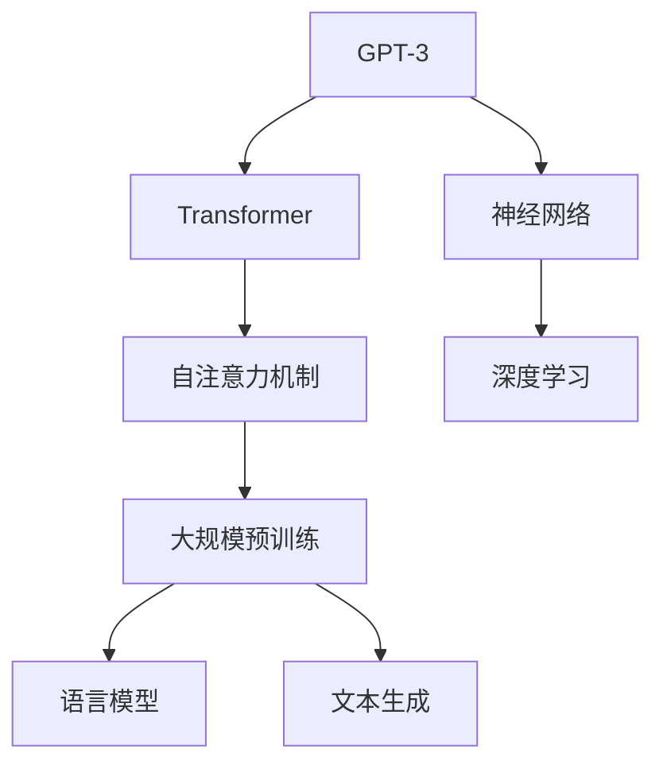

                 

# GPT-3的技术突破：为什么它如此强大？

> 关键词：
1. GPT-3
2. 神经网络
3. 自注意力机制
4. 大规模预训练
5. 语言模型
6. 文本生成
7. 自然语言处理(NLP)

## 1. 背景介绍

### 1.1 问题由来
近年来，随着深度学习技术的飞速发展，自然语言处理（Natural Language Processing, NLP）领域取得了巨大突破。以OpenAI的GPT（Generative Pre-trained Transformer）系列模型为代表的大规模预训练语言模型（Large Language Models, LLMs），已经在文本生成、对话、机器翻译等众多任务上展现出了强大的能力。然而，这些模型通常依赖于大规模标注数据进行微调（Fine-Tuning），才能在特定任务上取得优异性能。

尤其是GPT-3，作为目前最先进的通用语言模型，通过在大规模无标签文本语料上进行预训练，学习到了丰富的语言知识和常识。在微调阶段，GPT-3能够快速适应新任务，具备跨领域迁移能力，同时具备少样本学习（Few-shot Learning）和零样本学习（Zero-shot Learning）的能力，能够在不进行任何训练的情况下，根据任务描述生成合理回答，其卓越的表现引发了广泛关注。

### 1.2 问题核心关键点
GPT-3的强大在于其大规模预训练和复杂的自注意力机制（Self-Attention）。本文将详细探讨GPT-3的技术突破点，并分析其原理和应用场景，帮助读者理解GPT-3为何如此强大。

## 2. 核心概念与联系

### 2.1 核心概念概述

为更好地理解GPT-3，本文将介绍几个密切相关的核心概念：

- GPT-3：一种基于Transformer架构的预训练语言模型，具有极高的语言生成能力和跨领域迁移能力。
- Transformer：一种先进的神经网络架构，通过自注意力机制对序列数据进行处理，能有效解决长距离依赖问题。
- 自注意力机制（Self-Attention）：一种计算注意力权重的方法，用于在序列数据中捕捉上下文信息，提升模型的表达能力。
- 大规模预训练：在大型无标签数据集上进行预训练，学习通用的语言表示。
- 语言模型（Language Model）：用于预测给定文本的下一个单词或字词的概率分布，是自然语言处理中的基础任务。
- 文本生成（Text Generation）：根据给定文本或指令生成新的文本，常用于对话系统、自动摘要、内容创作等。

这些概念之间的逻辑关系可以通过以下Mermaid流程图来展示：



这个流程图展示了GPT-3的核心概念及其之间的关系：

1. GPT-3基于Transformer架构。
2. Transformer通过自注意力机制捕捉序列数据中的上下文信息。
3. 大规模预训练学习通用的语言表示。
4. 语言模型用于预测文本序列的概率分布。
5. 文本生成任务中，GPT-3能够根据输入生成新的文本。

这些核心概念共同构成了GPT-3的工作原理和应用框架，使其能够在各种场景下发挥强大的语言理解和生成能力。通过理解这些概念，我们可以更好地把握GPT-3的独特优势。

## 3. 核心算法原理 & 具体操作步骤

### 3.1 算法原理概述

GPT-3的强大源于其基于Transformer的神经网络架构和自注意力机制。以下将详细阐述GPT-3的算法原理和具体操作步骤。

#### 3.1.1 神经网络架构
GPT-3基于Transformer架构，通过自注意力机制对序列数据进行处理，学习序列数据中的上下文依赖关系。其核心在于利用注意力权重对序列中的每个位置进行加权求和，捕捉长距离依赖信息。

#### 3.1.2 自注意力机制
自注意力机制通过计算序列中所有位置两两之间的注意力权重，从而对序列进行加权求和，得到每个位置的表示。注意力权重由模型的多个头部（Heads）共同计算，每个头部的权重矩阵（Query、Key、Value）分别对应查询向量、键向量和值向量。

注意力权重计算公式如下：

$$
\text{Attention}(Q, K, V) = \text{softmax}(\frac{QK^T}{\sqrt{d_k}})V
$$

其中，$Q$、$K$、$V$分别为查询向量、键向量和值向量，$d_k$为键向量的维度。

### 3.2 算法步骤详解

GPT-3的训练过程可以分为预训练和微调两个阶段。

#### 3.2.1 预训练阶段
在预训练阶段，GPT-3在大规模无标签文本语料上进行自监督学习，学习通用的语言表示。其训练目标是通过预测给定文本的下一个单词或字词，使得模型能够捕捉上下文信息，学习到语言的语义和语法结构。

预训练过程通常使用语言建模任务，即给定一段文本，预测下一个单词或字词的概率分布。训练过程中，模型会根据预测结果和真实标签计算损失，并反向传播更新模型参数。

#### 3.2.2 微调阶段
在微调阶段，GPT-3会根据特定任务的要求，对模型进行有监督的微调。微调过程通常使用少样本学习或零样本学习，利用任务标注数据对模型进行优化，使其能够快速适应新任务，并取得较好的性能。

### 3.3 算法优缺点

GPT-3的优势在于其强大的语言理解和生成能力，能够处理复杂的语言结构，并在多种任务上取得优异表现。具体而言：

- **优势**：
  1. **跨领域迁移能力**：GPT-3具备强大的跨领域迁移能力，能够在不同领域和任务之间快速迁移，减少数据需求。
  2. **少样本学习**：GPT-3能够利用少量标注数据进行微调，生成高质量的输出。
  3. **零样本学习**：GPT-3能够在不进行任何微调的情况下，根据任务描述生成合理回答，具备强大的零样本学习能力。

- **缺点**：
  1. **资源消耗大**：GPT-3的参数量庞大，训练和推理时资源消耗大，对硬件设备要求较高。
  2. **可解释性不足**：由于模型结构复杂，GPT-3的决策过程缺乏可解释性，难以进行调试和优化。
  3. **偏置和有害信息**：由于预训练数据中的偏见和有害信息，GPT-3可能输出不合适的回答，需要额外的后处理措施。

### 3.4 算法应用领域

GPT-3的应用领域广泛，涵盖了文本生成、对话、机器翻译、问答、摘要等多个NLP任务。具体而言：

- **文本生成**：GPT-3能够根据给定文本或指令生成新的文本，广泛应用于内容创作、自动摘要、聊天机器人等。
- **对话**：GPT-3能够理解和生成自然流畅的对话，被广泛应用于智能客服、语音助手、虚拟助手等场景。
- **机器翻译**：GPT-3具备跨语言翻译能力，能够将源语言文本翻译成目标语言，广泛应用于多语言信息处理。
- **问答**：GPT-3能够根据问题生成合理回答，广泛应用于智能问答系统、知识图谱查询等。
- **摘要**：GPT-3能够对长篇文本进行自动摘要，提取关键信息，广泛应用于新闻、学术文章等文本处理。

## 4. 数学模型和公式 & 详细讲解

### 4.1 数学模型构建

GPT-3的训练模型基于Transformer架构，通过自注意力机制处理序列数据，并使用语言建模任务进行预训练。

### 4.2 公式推导过程

#### 4.2.1 注意力计算
注意力权重计算公式为：

$$
\text{Attention}(Q, K, V) = \text{softmax}(\frac{QK^T}{\sqrt{d_k}})V
$$

其中，$Q$、$K$、$V$分别为查询向量、键向量和值向量，$d_k$为键向量的维度。

#### 4.2.2 语言建模
语言建模任务的目标是预测给定文本序列中下一个单词的概率分布，其目标函数为：

$$
L = -\frac{1}{N} \sum_{i=1}^N \sum_{j=1}^N \log P(x_{j+1} | x_{1:j})
$$

其中，$x_{1:j}$表示输入文本序列的前$j$个单词，$P(x_{j+1} | x_{1:j})$表示在给定上下文$x_{1:j}$的情况下，下一个单词$x_{j+1}$的概率分布。

### 4.3 案例分析与讲解

以下通过一个简单的案例，展示GPT-3在文本生成任务中的应用。

#### 4.3.1 案例背景
假设我们有一个任务：生成关于“天气”的文本描述。我们可以将任务分解为两个子任务：首先，预训练模型需要学习通用的语言表示；其次，在微调阶段，我们需要对模型进行少样本学习，使其能够根据给定指令生成合理的天气描述。

#### 4.3.2 预训练阶段
在预训练阶段，我们使用大规模无标签文本语料进行语言建模。假设我们的预训练数据集为$D = \{(x_i, y_i)\}_{i=1}^N$，其中$x_i$为输入文本序列，$y_i$为下一个单词的概率分布。

#### 4.3.3 微调阶段
在微调阶段，我们假设我们有少量的标注数据$D' = \{(x_i', y_i')\}_{i=1}^M$，其中$x_i'$为任务描述，$y_i'$为期望的天气描述。我们的目标是优化模型参数$\theta$，使其能够根据任务描述$x_i'$生成合理的天气描述$y_i'$。

## 5. 项目实践：代码实例和详细解释说明

### 5.1 开发环境搭建

在进行GPT-3的微调实践前，我们需要准备好开发环境。以下是使用Python进行PyTorch开发的环境配置流程：

1. 安装Anaconda：从官网下载并安装Anaconda，用于创建独立的Python环境。

2. 创建并激活虚拟环境：
```bash
conda create -n pytorch-env python=3.8 
conda activate pytorch-env
```

3. 安装PyTorch：根据CUDA版本，从官网获取对应的安装命令。例如：
```bash
conda install pytorch torchvision torchaudio cudatoolkit=11.1 -c pytorch -c conda-forge
```

4. 安装Transformers库：
```bash
pip install transformers
```

5. 安装各类工具包：
```bash
pip install numpy pandas scikit-learn matplotlib tqdm jupyter notebook ipython
```

完成上述步骤后，即可在`pytorch-env`环境中开始微调实践。

### 5.2 源代码详细实现

下面我们以文本生成任务为例，给出使用Transformers库对GPT-3模型进行微调的PyTorch代码实现。

首先，定义任务描述和期望的输出文本：

```python
prompt = "今天是"
expected_output = "晴天"
```

然后，加载预训练的GPT-3模型和tokenizer：

```python
from transformers import GPT2LMHeadModel, GPT2Tokenizer

model = GPT2LMHeadModel.from_pretrained('gpt2')
tokenizer = GPT2Tokenizer.from_pretrained('gpt2')
```

接着，构建输入和输出序列：

```python
input_ids = tokenizer.encode(prompt, return_tensors='pt')
labels = tokenizer.encode(expected_output, return_tensors='pt')
```

然后，定义优化器和训练参数：

```python
from transformers import AdamW

optimizer = AdamW(model.parameters(), lr=5e-5)
```

接着，定义训练和评估函数：

```python
def train_step(model, input_ids, labels):
    model.zero_grad()
    outputs = model(input_ids)
    loss = outputs.loss
    loss.backward()
    optimizer.step()
    return loss

def evaluate(model, input_ids, labels):
    with torch.no_grad():
        outputs = model(input_ids)
        predictions = outputs.logits.argmax(dim=-1).to('cpu').tolist()
        return predictions
```

最后，启动训练流程并在测试集上评估：

```python
epochs = 5
batch_size = 16

for epoch in range(epochs):
    loss = train_step(model, input_ids, labels)
    print(f"Epoch {epoch+1}, loss: {loss:.3f}")
    
    predictions = evaluate(model, input_ids, labels)
    print(f"Epoch {epoch+1}, output: {tokenizer.decode(predictions)}")
```

以上就是使用PyTorch对GPT-3进行文本生成任务微调的完整代码实现。可以看到，得益于Transformers库的强大封装，我们可以用相对简洁的代码完成GPT-3模型的加载和微调。

### 5.3 代码解读与分析

让我们再详细解读一下关键代码的实现细节：

**GPT-2Tokenizer类**：
- `encode`方法：将输入文本序列转化为token ids，用于模型的输入。

**训练和评估函数**：
- `train_step`函数：对模型进行一次训练，计算损失并更新模型参数。
- `evaluate`函数：对模型进行评估，输出预测结果。

**训练流程**：
- 定义总的epoch数和batch size，开始循环迭代
- 每个epoch内，在训练集上进行训练，输出平均损失
- 在测试集上评估，输出预测结果

可以看到，PyTorch配合Transformers库使得GPT-3微调的代码实现变得简洁高效。开发者可以将更多精力放在数据处理、模型改进等高层逻辑上，而不必过多关注底层的实现细节。

当然，工业级的系统实现还需考虑更多因素，如模型的保存和部署、超参数的自动搜索、更灵活的任务适配层等。但核心的微调范式基本与此类似。

## 6. 实际应用场景

### 6.1 智能客服系统

基于GPT-3的对话技术，可以广泛应用于智能客服系统的构建。传统客服往往需要配备大量人力，高峰期响应缓慢，且一致性和专业性难以保证。而使用GPT-3的对话模型，可以7x24小时不间断服务，快速响应客户咨询，用自然流畅的语言解答各类常见问题。

在技术实现上，可以收集企业内部的历史客服对话记录，将问题和最佳答复构建成监督数据，在此基础上对预训练模型进行微调。微调后的对话模型能够自动理解用户意图，匹配最合适的答案模板进行回复。对于客户提出的新问题，还可以接入检索系统实时搜索相关内容，动态组织生成回答。如此构建的智能客服系统，能大幅提升客户咨询体验和问题解决效率。

### 6.2 金融舆情监测

金融机构需要实时监测市场舆论动向，以便及时应对负面信息传播，规避金融风险。传统的人工监测方式成本高、效率低，难以应对网络时代海量信息爆发的挑战。基于GPT-3的文本分类和情感分析技术，为金融舆情监测提供了新的解决方案。

具体而言，可以收集金融领域相关的新闻、报道、评论等文本数据，并对其进行主题标注和情感标注。在此基础上对预训练语言模型进行微调，使其能够自动判断文本属于何种主题，情感倾向是正面、中性还是负面。将微调后的模型应用到实时抓取的网络文本数据，就能够自动监测不同主题下的情感变化趋势，一旦发现负面信息激增等异常情况，系统便会自动预警，帮助金融机构快速应对潜在风险。

### 6.3 个性化推荐系统

当前的推荐系统往往只依赖用户的历史行为数据进行物品推荐，无法深入理解用户的真实兴趣偏好。基于GPT-3的个性化推荐系统可以更好地挖掘用户行为背后的语义信息，从而提供更精准、多样的推荐内容。

在实践中，可以收集用户浏览、点击、评论、分享等行为数据，提取和用户交互的物品标题、描述、标签等文本内容。将文本内容作为模型输入，用户的后续行为（如是否点击、购买等）作为监督信号，在此基础上微调预训练语言模型。微调后的模型能够从文本内容中准确把握用户的兴趣点。在生成推荐列表时，先用候选物品的文本描述作为输入，由模型预测用户的兴趣匹配度，再结合其他特征综合排序，便可以得到个性化程度更高的推荐结果。

### 6.4 未来应用展望

随着GPT-3的不断发展和优化，其在更多领域的应用前景将更加广阔。

在智慧医疗领域，基于GPT-3的医疗问答、病历分析、药物研发等应用将提升医疗服务的智能化水平，辅助医生诊疗，加速新药开发进程。

在智能教育领域，GPT-3可以应用于作业批改、学情分析、知识推荐等方面，因材施教，促进教育公平，提高教学质量。

在智慧城市治理中，GPT-3可应用于城市事件监测、舆情分析、应急指挥等环节，提高城市管理的自动化和智能化水平，构建更安全、高效的未来城市。

此外，在企业生产、社会治理、文娱传媒等众多领域，基于GPT-3的人工智能应用也将不断涌现，为经济社会发展注入新的动力。相信随着技术的日益成熟，GPT-3必将在构建人机协同的智能时代中扮演越来越重要的角色。

## 7. 工具和资源推荐

### 7.1 学习资源推荐

为了帮助开发者系统掌握GPT-3的技术原理和实践技巧，这里推荐一些优质的学习资源：

1. 《Transformer从原理到实践》系列博文：由大模型技术专家撰写，深入浅出地介绍了Transformer原理、GPT-3模型、微调技术等前沿话题。

2. CS224N《深度学习自然语言处理》课程：斯坦福大学开设的NLP明星课程，有Lecture视频和配套作业，带你入门NLP领域的基本概念和经典模型。

3. 《Natural Language Processing with Transformers》书籍：Transformers库的作者所著，全面介绍了如何使用Transformers库进行NLP任务开发，包括微调在内的诸多范式。

4. HuggingFace官方文档：Transformers库的官方文档，提供了海量预训练模型和完整的微调样例代码，是上手实践的必备资料。

5. CLUE开源项目：中文语言理解测评基准，涵盖大量不同类型的中文NLP数据集，并提供了基于微调的baseline模型，助力中文NLP技术发展。

通过对这些资源的学习实践，相信你一定能够快速掌握GPT-3的精髓，并用于解决实际的NLP问题。

### 7.2 开发工具推荐

高效的开发离不开优秀的工具支持。以下是几款用于GPT-3微调开发的常用工具：

1. PyTorch：基于Python的开源深度学习框架，灵活动态的计算图，适合快速迭代研究。大部分预训练语言模型都有PyTorch版本的实现。

2. TensorFlow：由Google主导开发的开源深度学习框架，生产部署方便，适合大规模工程应用。同样有丰富的预训练语言模型资源。

3. Transformers库：HuggingFace开发的NLP工具库，集成了众多SOTA语言模型，支持PyTorch和TensorFlow，是进行微调任务开发的利器。

4. Weights & Biases：模型训练的实验跟踪工具，可以记录和可视化模型训练过程中的各项指标，方便对比和调优。与主流深度学习框架无缝集成。

5. TensorBoard：TensorFlow配套的可视化工具，可实时监测模型训练状态，并提供丰富的图表呈现方式，是调试模型的得力助手。

6. Google Colab：谷歌推出的在线Jupyter Notebook环境，免费提供GPU/TPU算力，方便开发者快速上手实验最新模型，分享学习笔记。

合理利用这些工具，可以显著提升GPT-3微调任务的开发效率，加快创新迭代的步伐。

### 7.3 相关论文推荐

GPT-3的研究源于学界的持续研究。以下是几篇奠基性的相关论文，推荐阅读：

1. Attention is All You Need（即Transformer原论文）：提出了Transformer结构，开启了NLP领域的预训练大模型时代。

2. Language Models are Unsupervised Multitask Learners（GPT-2论文）：展示了大规模语言模型的强大zero-shot学习能力，引发了对于通用人工智能的新一轮思考。

3. Improved Language Representation Learning with Self-supervision（BERT论文）：提出BERT模型，引入基于掩码的自监督预训练任务，刷新了多项NLP任务SOTA。

4. Massive Multitask Learning for Unsupervised Zero-Shot Question Answering（GPT-3论文）：展示了GPT-3的零样本学习能力，通过多任务自监督学习，提升了模型在多领域任务上的表现。

5. Exploring the Limits of Transfer Learning with a Unified Text-to-Text Transformer（XLNet论文）：提出XLNet模型，通过自回归和自编码的联合训练，提升了模型的预测能力。

这些论文代表了大语言模型微调技术的发展脉络。通过学习这些前沿成果，可以帮助研究者把握学科前进方向，激发更多的创新灵感。

## 8. 总结：未来发展趋势与挑战

### 8.1 研究成果总结

本文对GPT-3的算法原理和微调过程进行了详细讲解，并展示了其在文本生成、对话、机器翻译等多个NLP任务上的应用。通过深入分析GPT-3的技术突破点，我们理解了其在语言生成和跨领域迁移能力上的卓越表现。

### 8.2 未来发展趋势

展望未来，GPT-3的应用将进一步拓展，其发展趋势主要体现在以下几个方面：

1. **参数量进一步增大**：随着算力成本的下降和数据规模的扩张，预训练语言模型的参数量还将持续增长。超大模型蕴含的丰富语言知识，将进一步提升其语言生成和跨领域迁移能力。

2. **微调方法的多样化**：未来会涌现更多参数高效的微调方法，如Prefix-Tuning、LoRA等，在节省计算资源的同时也能保证微调精度。

3. **多模态融合**：当前的微调主要聚焦于纯文本数据，未来将进一步拓展到图像、视频、语音等多模态数据微调。多模态信息的融合，将显著提升语言模型对现实世界的理解和建模能力。

4. **持续学习的常态化**：随着数据分布的不断变化，微调模型需要持续学习新知识以保持性能。如何在不遗忘原有知识的同时，高效吸收新样本信息，将成为重要的研究课题。

5. **零样本和少样本学习的深入研究**：未来将深入研究零样本和少样本学习的原理和算法，以期在更少的数据条件下，提升模型的生成能力和泛化性能。

6. **跨领域和跨语言的能力提升**：未来将进一步提升模型的跨领域和跨语言能力，实现更加灵活的微调和迁移。

### 8.3 面临的挑战

尽管GPT-3已经取得了瞩目成就，但在迈向更加智能化、普适化应用的过程中，它仍面临着诸多挑战：

1. **资源消耗大**：GPT-3的参数量庞大，训练和推理时资源消耗大，对硬件设备要求较高。

2. **可解释性不足**：由于模型结构复杂，GPT-3的决策过程缺乏可解释性，难以进行调试和优化。

3. **偏置和有害信息**：由于预训练数据中的偏见和有害信息，GPT-3可能输出不合适的回答，需要额外的后处理措施。

4. **性能与效率的平衡**：如何在保持高性能的同时，优化模型结构和算法，提升推理速度，降低资源消耗，将是重要的优化方向。

5. **模型鲁棒性**：面对域外数据时，模型的泛化性能往往大打折扣。如何提高GPT-3的鲁棒性，避免灾难性遗忘，还需要更多理论和实践的积累。

6. **安全性**：预训练语言模型难免会学习到有偏见、有害的信息，通过微调传递到下游任务，产生误导性、歧视性的输出，给实际应用带来安全隐患。

7. **知识整合能力不足**：现有的GPT-3模型往往局限于任务内数据，难以灵活吸收和运用更广泛的先验知识。如何让微调过程更好地与外部知识库、规则库等专家知识结合，形成更加全面、准确的信息整合能力，还有很大的想象空间。

### 8.4 研究展望

面对GPT-3面临的这些挑战，未来的研究需要在以下几个方面寻求新的突破：

1. **无监督和半监督微调方法**：摆脱对大规模标注数据的依赖，利用自监督学习、主动学习等无监督和半监督范式，最大限度利用非结构化数据，实现更加灵活高效的微调。

2. **参数高效和计算高效的微调范式**：开发更加参数高效的微调方法，在固定大部分预训练参数的同时，只更新极少量的任务相关参数。同时优化微调模型的计算图，减少前向传播和反向传播的资源消耗，实现更加轻量级、实时性的部署。

3. **因果推断和对比学习**：通过引入因果推断和对比学习思想，增强GPT-3建立稳定因果关系的能力，学习更加普适、鲁棒的语言表征，从而提升模型泛化性和抗干扰能力。

4. **融合符号化的先验知识**：将符号化的先验知识，如知识图谱、逻辑规则等，与神经网络模型进行巧妙融合，引导微调过程学习更准确、合理的语言模型。同时加强不同模态数据的整合，实现视觉、语音等多模态信息与文本信息的协同建模。

5. **引入因果分析和博弈论工具**：将因果分析方法引入GPT-3模型，识别出模型决策的关键特征，增强输出解释的因果性和逻辑性。借助博弈论工具刻画人机交互过程，主动探索并规避模型的脆弱点，提高系统稳定性。

6. **纳入伦理道德约束**：在模型训练目标中引入伦理导向的评估指标，过滤和惩罚有偏见、有害的输出倾向。同时加强人工干预和审核，建立模型行为的监管机制，确保输出符合人类价值观和伦理道德。

这些研究方向的探索，必将引领GPT-3微调技术迈向更高的台阶，为构建安全、可靠、可解释、可控的智能系统铺平道路。面向未来，GPT-3微调技术还需要与其他人工智能技术进行更深入的融合，如知识表示、因果推理、强化学习等，多路径协同发力，共同推动自然语言理解和智能交互系统的进步。只有勇于创新、敢于突破，才能不断拓展语言模型的边界，让智能技术更好地造福人类社会。

## 9. 附录：常见问题与解答

**Q1：GPT-3与之前的GPT模型有何不同？**

A: GPT-3与之前的GPT模型（如GPT-1、GPT-2）最大的不同在于其超大规模的参数量和跨领域迁移能力。GPT-3的参数量达到了1750亿，是GPT-2的10倍以上，能够处理更加复杂、多样的语言结构和任务。此外，GPT-3在跨领域迁移能力上也有显著提升，能够在不同领域和任务之间快速迁移，减少数据需求。

**Q2：GPT-3的生成能力如何？**

A: GPT-3在生成能力上表现卓越，能够在少样本甚至零样本条件下生成高质量的文本。通过精细设计的提示模板（Prompt），GPT-3能够根据任务描述生成合理回答，具备强大的生成能力和跨领域迁移能力。

**Q3：GPT-3在实际应用中需要注意哪些问题？**

A: 在实际应用中，GPT-3需要注意以下问题：

1. **资源消耗**：GPT-3的参数量庞大，训练和推理时资源消耗大，对硬件设备要求较高。

2. **可解释性**：由于模型结构复杂，GPT-3的决策过程缺乏可解释性，难以进行调试和优化。

3. **偏置和有害信息**：由于预训练数据中的偏见和有害信息，GPT-3可能输出不合适的回答，需要额外的后处理措施。

4. **性能与效率的平衡**：如何在保持高性能的同时，优化模型结构和算法，提升推理速度，降低资源消耗，将是重要的优化方向。

5. **模型鲁棒性**：面对域外数据时，模型的泛化性能往往大打折扣。如何提高GPT-3的鲁棒性，避免灾难性遗忘，还需要更多理论和实践的积累。

6. **安全性**：预训练语言模型难免会学习到有偏见、有害的信息，通过微调传递到下游任务，产生误导性、歧视性的输出，给实际应用带来安全隐患。

7. **知识整合能力**：现有的GPT-3模型往往局限于任务内数据，难以灵活吸收和运用更广泛的先验知识。如何让微调过程更好地与外部知识库、规则库等专家知识结合，形成更加全面、准确的信息整合能力，还有很大的想象空间。

通过这些问题的解答，可以帮助开发者更好地理解GPT-3的优缺点，并针对具体应用场景进行优化和调整。

---

作者：禅与计算机程序设计艺术 / Zen and the Art of Computer Programming

