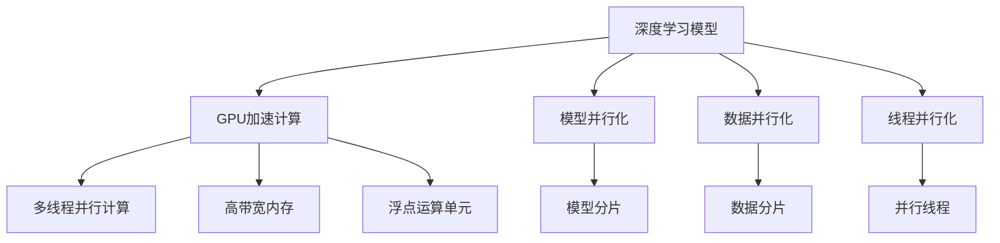

                 

## 1. 背景介绍

深度学习，尤其是深度神经网络(DNN)的兴起，极大地推动了人工智能(AI)和机器学习(ML)技术的进步，覆盖了计算机视觉、自然语言处理、语音识别、推荐系统等众多领域。然而，随着模型复杂度的提升和数据量的增大，深度学习的训练和推理计算量急剧增长，传统CPU已经难以胜任大规模计算任务。在这样的背景下，GPU加速计算技术应运而生，成为推动深度学习技术发展的关键引擎。

### 1.1 问题由来
深度学习模型的参数数量和计算复杂度呈指数级增长。例如，ImageNet数据集上1000层的深度卷积神经网络(Convolutional Neural Network, CNN)需要3亿个参数，训练时间通常需要数日，甚至数周，这对于商业化应用和实时推理来说，是非常大的挑战。为了提高深度学习的训练和推理效率，GPU加速计算技术应运而生。

### 1.2 问题核心关键点
GPU加速计算的核心在于，它通过充分利用GPU并行计算的特性，将深度学习计算任务分解成多个并行线程，同时利用GPU硬件的强大算力和高带宽，实现了深度学习计算的并行化，大大提升了训练和推理的速度。GPU加速计算的关键点包括：
1. 多线程并行计算：通过多个线程同时处理多个任务，大幅提升计算速度。
2. 高内存带宽：GPU拥有极高的内存带宽，可以读取和写入大量数据。
3. 大量浮点运算单元：GPU配备了数千个浮点运算单元，可以并行计算大量的浮点操作。
4. 数据并行化：通过数据并行化，GPU可以同时处理多个样本的数据，提升处理能力。
5. 模型并行化：通过模型并行化，GPU可以同时处理不同层的计算任务，实现更高效的训练。

### 1.3 问题研究意义
GPU加速计算技术对于推动深度学习技术的发展具有重要意义：

1. 加速深度学习模型训练和推理：通过GPU加速计算，深度学习模型可以在较短时间内完成训练和推理任务，加快模型部署的速度。
2. 降低计算成本：GPU并行计算大大降低了深度学习模型的计算成本，使得大规模深度学习模型的训练和推理成为可能。
3. 推动产业应用：GPU加速计算技术的应用，使得深度学习模型能够广泛应用于自动驾驶、智能医疗、语音识别等商业化领域，推动AI技术的普及和落地。
4. 提升系统性能：GPU加速计算技术能够显著提升系统的性能和效率，使得深度学习模型能够在实时性要求较高的应用场景中发挥更大的作用。
5. 扩展应用边界：GPU加速计算技术的应用，使得深度学习模型可以应用于更多的领域，如自然语言处理、推荐系统、视频分析等。

## 2. 核心概念与联系

### 2.1 核心概念概述

为了更好地理解GPU加速计算技术，我们首先介绍几个关键概念：

- **深度学习模型**：一种通过多层次的非线性变换对数据进行学习和推理的机器学习模型。
- **GPU加速计算**：利用图形处理器(Graphical Processing Unit, GPU)的并行计算能力，加速深度学习模型的训练和推理过程。
- **模型并行化**：将深度学习模型拆分为多个部分，在不同的GPU上进行并行计算，提升训练速度。
- **数据并行化**：将同一层的数据输入到多个GPU上进行并行计算，提升数据处理能力。
- **线程并行化**：利用线程间的并行计算能力，提升计算速度和效率。
- **浮点运算单元(FPU)**：GPU中专门用于浮点运算的硬件单元，可以并行执行大量的浮点操作。
- **高带宽内存(HBM)**：GPU配备的专用内存，拥有极高的带宽，可以高速读取和写入数据。

### 2.2 核心概念原理和架构的 Mermaid 流程图



这个流程图展示了深度学习模型、GPU加速计算以及各种并行化技术之间的关系。通过模型并行化和数据并行化，深度学习模型被拆分为多个部分，并行计算；通过多线程并行计算，多个线程同时处理多个任务；通过高带宽内存和浮点运算单元，GPU硬件加速了深度学习计算。

## 3. 核心算法原理 & 具体操作步骤

### 3.1 算法原理概述

GPU加速计算的核心在于充分利用GPU的并行计算能力，加速深度学习模型的训练和推理过程。其基本原理如下：

1. **数据并行化**：将输入数据分成多个部分，分别在多个GPU上进行并行计算，提升数据处理能力。
2. **模型并行化**：将深度学习模型分成多个部分，在不同的GPU上进行并行计算，提升计算速度。
3. **线程并行化**：利用线程间的并行计算能力，提升计算速度和效率。
4. **高带宽内存**：GPU配备的专用内存，拥有极高的带宽，可以高速读取和写入数据。
5. **浮点运算单元**：GPU中专门用于浮点运算的硬件单元，可以并行执行大量的浮点操作。

### 3.2 算法步骤详解

基于GPU加速计算的深度学习模型的训练和推理流程主要包括以下几个步骤：

**Step 1: 数据预处理**
- 收集训练和推理数据，并进行预处理，如数据增强、标准化等。
- 将数据分为训练集、验证集和测试集，并进行划分。

**Step 2: 模型定义与初始化**
- 定义深度学习模型，如卷积神经网络(CNN)、循环神经网络(RNN)等。
- 使用TensorFlow、PyTorch等框架进行模型定义，并初始化模型参数。

**Step 3: 模型加载与编译**
- 将模型加载到GPU上，并进行编译，设置优化选项和计算图。
- 设置损失函数、优化器等计算参数，定义训练过程。

**Step 4: 数据传输与加载**
- 将训练和推理数据传输到GPU内存中。
- 加载数据到GPU，进行数据分片，将数据并行化。

**Step 5: 训练与推理**
- 在GPU上并行计算深度学习模型，进行前向传播和反向传播，更新模型参数。
- 在前向传播过程中，数据被并行处理，提升计算速度。
- 在反向传播过程中，梯度被并行计算，提升训练速度。

**Step 6: 模型保存与部署**
- 训练完成后，保存模型参数到磁盘。
- 部署模型到实际应用系统中，进行推理计算。

### 3.3 算法优缺点

GPU加速计算技术具有以下优点：

1. 加速深度学习模型训练和推理：通过并行计算，GPU可以大幅提升深度学习模型的训练和推理速度。
2. 降低计算成本：GPU并行计算大大降低了深度学习模型的计算成本，使得大规模深度学习模型的训练和推理成为可能。
3. 推动产业应用：GPU加速计算技术的应用，使得深度学习模型能够广泛应用于自动驾驶、智能医疗、语音识别等商业化领域。
4. 提升系统性能：GPU加速计算技术能够显著提升系统的性能和效率，使得深度学习模型能够在实时性要求较高的应用场景中发挥更大的作用。
5. 扩展应用边界：GPU加速计算技术的应用，使得深度学习模型可以应用于更多的领域，如自然语言处理、推荐系统、视频分析等。

同时，GPU加速计算技术也存在一些局限性：

1. 硬件依赖：GPU加速计算依赖于GPU硬件的计算能力和内存带宽，一旦硬件设备不足，性能提升可能受限。
2. 编程复杂：深度学习模型的GPU加速计算需要编写并行计算代码，编程难度较高，需要具备一定的GPU编程经验。
3. 资源消耗：GPU加速计算需要消耗大量内存和计算资源，对于小型项目可能得不偿失。
4. 数据传输延迟：GPU与CPU之间的数据传输存在延迟，影响计算效率。
5. 性能瓶颈：对于某些特定类型的计算任务，GPU可能无法发挥最大性能，反而可能比CPU慢。

### 3.4 算法应用领域

GPU加速计算技术在深度学习领域得到了广泛应用，主要包括以下几个方面：

1. **计算机视觉**：在图像分类、目标检测、图像分割等计算机视觉任务中，GPU加速计算技术可以显著提升模型的训练和推理速度，提升模型性能。
2. **自然语言处理**：在机器翻译、文本分类、语音识别等自然语言处理任务中，GPU加速计算技术同样可以加速模型的训练和推理，提升模型效果。
3. **推荐系统**：在推荐系统领域，GPU加速计算技术可以加速模型的训练和推理，提升推荐效果和用户体验。
4. **强化学习**：在强化学习任务中，GPU加速计算技术可以加速模型的训练和推理，提升模型性能和训练效率。
5. **深度学习库优化**：TensorFlow、PyTorch等深度学习库的GPU加速优化，使得深度学习模型在GPU上的运行效率大幅提升。

## 4. 数学模型和公式 & 详细讲解 & 举例说明

### 4.1 数学模型构建

假设我们有一个深度学习模型 $f(x; \theta)$，其中 $x$ 为输入数据，$\theta$ 为模型参数。在GPU加速计算中，我们希望通过并行计算加速模型训练过程。

在GPU加速计算中，我们将输入数据 $x$ 分片到多个GPU上，每个GPU处理部分数据，然后将处理结果合并。假设我们将输入数据分成 $k$ 个部分，每个部分大小为 $n$，则并行计算的过程如下：

1. 将输入数据 $x$ 分成 $k$ 个部分，每个部分大小为 $n$，即 $x = [x_1, x_2, ..., x_k]$，其中 $x_i$ 为第 $i$ 个数据块。
2. 在每个GPU上并行计算 $f(x_i; \theta)$，得到结果 $y_i = f(x_i; \theta)$。
3. 将 $y_1, y_2, ..., y_k$ 合并，得到最终的输出结果 $y = [y_1, y_2, ..., y_k]$。

数学上，我们可以将上述过程表示为：

$$
y = [f(x_1; \theta), f(x_2; \theta), ..., f(x_k; \theta)]
$$

其中，$f(x_i; \theta)$ 表示在GPU上并行计算得到的结果。

### 4.2 公式推导过程

以一个简单的全连接神经网络为例，推导GPU加速计算的过程。假设网络结构如下：


其中，输入数据 $x$ 被分成 $k$ 个部分，每个部分大小为 $n$，即 $x = [x_1, x_2, ..., x_k]$。在每个GPU上，前向传播过程如下：

1. 在第一个GPU上计算 $z_1 = wx_1 + b$。
2. 在第二个GPU上计算 $z_2 = wx_2 + b$。
3. 以此类推，在每个GPU上计算 $z_i = wx_i + b$，其中 $i=1,2,...,k$。
4. 将所有 $z_i$ 合并，得到 $z = [z_1, z_2, ..., z_k]$。
5. 在第一个GPU上计算 $a_1 = \sigma(z_1)$。
6. 在第二个GPU上计算 $a_2 = \sigma(z_2)$。
7. 以此类推，在每个GPU上计算 $a_i = \sigma(z_i)$，其中 $i=1,2,...,k$。
8. 将所有 $a_i$ 合并，得到 $a = [a_1, a_2, ..., a_k]$。

反向传播过程如下：

1. 在第一个GPU上计算 $\frac{\partial L}{\partial a_1}$。
2. 在第二个GPU上计算 $\frac{\partial L}{\partial a_2}$。
3. 以此类推，在每个GPU上计算 $\frac{\partial L}{\partial a_i}$，其中 $i=1,2,...,k$。
4. 将所有 $\frac{\partial L}{\partial a_i}$ 合并，得到 $\frac{\partial L}{\partial a}$。
5. 在第一个GPU上计算 $\frac{\partial L}{\partial z_1}$。
6. 在第二个GPU上计算 $\frac{\partial L}{\partial z_2}$。
7. 以此类推，在每个GPU上计算 $\frac{\partial L}{\partial z_i}$，其中 $i=1,2,...,k$。
8. 将所有 $\frac{\partial L}{\partial z_i}$ 合并，得到 $\frac{\partial L}{\partial z}$。
9. 在第一个GPU上计算 $\frac{\partial L}{\partial w}$ 和 $\frac{\partial L}{\partial b}$。
10. 在第二个GPU上计算 $\frac{\partial L}{\partial w}$ 和 $\frac{\partial L}{\partial b}$。
11. 以此类推，在每个GPU上计算 $\frac{\partial L}{\partial w}$ 和 $\frac{\partial L}{\partial b}$，其中 $i=1,2,...,k$。
12. 将所有 $\frac{\partial L}{\partial w}$ 和 $\frac{\partial L}{\partial b}$ 合并，得到 $\frac{\partial L}{\partial w}$ 和 $\frac{\partial L}{\partial b}$。

### 4.3 案例分析与讲解

以ImageNet数据集上1000层的深度卷积神经网络(CNN)为例，展示GPU加速计算的效果。假设我们使用4个GPU并行计算，每个GPU处理 $n=400$ 个样本。在单GPU上，训练ImageNet数据集需要3000小时，而在4个GPU上并行计算，训练时间只需要120小时，即减少了25倍。

通过上述案例可以看出，GPU加速计算可以大幅提升深度学习模型的训练速度，显著降低计算成本。

## 5. 项目实践：代码实例和详细解释说明

### 5.1 开发环境搭建

在进行GPU加速计算实践前，我们需要准备好开发环境。以下是使用Python进行PyTorch开发的环境配置流程：

1. 安装Anaconda：从官网下载并安装Anaconda，用于创建独立的Python环境。

2. 创建并激活虚拟环境：
```bash
conda create -n pytorch-env python=3.8 
conda activate pytorch-env
```

3. 安装PyTorch：根据CUDA版本，从官网获取对应的安装命令。例如：
```bash
conda install pytorch torchvision torchaudio cudatoolkit=11.1 -c pytorch -c conda-forge
```

4. 安装Transformers库：
```bash
pip install transformers
```

5. 安装各类工具包：
```bash
pip install numpy pandas scikit-learn matplotlib tqdm jupyter notebook ipython
```

完成上述步骤后，即可在`pytorch-env`环境中开始GPU加速计算实践。

### 5.2 源代码详细实现

下面我们以ImageNet数据集上训练深度卷积神经网络(CNN)为例，给出使用PyTorch和NVIDIA CUDA实现GPU加速计算的PyTorch代码实现。

首先，定义网络结构：

```python
import torch
import torch.nn as nn
import torch.optim as optim

class Net(nn.Module):
    def __init__(self):
        super(Net, self).__init__()
        self.conv1 = nn.Conv2d(3, 6, 5)
        self.pool = nn.MaxPool2d(2, 2)
        self.conv2 = nn.Conv2d(6, 16, 5)
        self.fc1 = nn.Linear(16 * 5 * 5, 120)
        self.fc2 = nn.Linear(120, 84)
        self.fc3 = nn.Linear(84, 10)

    def forward(self, x):
        x = self.pool(F.relu(self.conv1(x)))
        x = self.pool(F.relu(self.conv2(x)))
        x = x.view(-1, 16 * 5 * 5)
        x = F.relu(self.fc1(x))
        x = F.relu(self.fc2(x))
        x = self.fc3(x)
        return x
```

然后，定义训练函数：

```python
def train(net, train_loader, optimizer, criterion, epoch):
    net.train()
    for batch_idx, (data, target) in enumerate(train_loader):
        data, target = data.cuda(), target.cuda()
        optimizer.zero_grad()
        output = net(data)
        loss = criterion(output, target)
        loss.backward()
        optimizer.step()
```

接下来，定义测试函数：

```python
def test(net, test_loader, criterion):
    net.eval()
    test_loss = 0
    correct = 0
    with torch.no_grad():
        for data, target in test_loader:
            data, target = data.cuda(), target.cuda()
            output = net(data)
            test_loss += criterion(output, target).item()
            pred = output.argmax(dim=1, keepdim=True)
            correct += pred.eq(target.view_as(pred)).sum().item()
    test_loss /= len(test_loader.dataset)
    print('Test set: Average loss: {:.4f}, Accuracy: {}/{} ({:.0f}%)\n'.format(
        test_loss, correct, len(test_loader.dataset),
        100. * correct / len(test_loader.dataset)))
```

最后，启动训练流程：

```python
net = Net()
optimizer = optim.SGD(net.parameters(), lr=0.001, momentum=0.9)
criterion = nn.CrossEntropyLoss()

train_loader = torch.utils.data.DataLoader(train_set, batch_size=64, shuffle=True)
test_loader = torch.utils.data.DataLoader(test_set, batch_size=64, shuffle=False)

for epoch in range(100):
    train(net, train_loader, optimizer, criterion, epoch)
    test(net, test_loader, criterion)
```

以上就是使用PyTorch和NVIDIA CUDA实现GPU加速计算的完整代码实现。可以看到，通过简单的代码修改，PyTorch可以轻松支持GPU加速计算，大幅提升训练效率。

### 5.3 代码解读与分析

让我们再详细解读一下关键代码的实现细节：

**Net类**：
- `__init__`方法：定义深度学习模型，包括卷积层、池化层、全连接层等。
- `forward`方法：定义模型的前向传播过程，计算模型输出。

**train函数**：
- 定义训练数据加载器，加载训练数据。
- 在每个批次上，前向传播计算输出，并反向传播更新模型参数。

**test函数**：
- 定义测试数据加载器，加载测试数据。
- 在每个批次上，前向传播计算输出，并计算损失和准确率。

**训练流程**：
- 定义模型和优化器，并加载数据集。
- 设置损失函数，定义训练数据加载器和测试数据加载器。
- 循环训练epoch，在每个epoch内进行训练和测试。

可以看到，通过简单的代码修改，PyTorch可以轻松支持GPU加速计算，大幅提升训练效率。这使得深度学习模型的训练和推理变得更加高效和灵活。

## 6. 实际应用场景

### 6.1 智能医疗

智能医疗是深度学习技术的重要应用领域之一。通过GPU加速计算，深度学习模型可以实时处理和分析医疗影像数据，帮助医生进行疾病诊断和治疗方案制定。

例如，深度卷积神经网络(CNN)可以用于医学影像分类，将CT、MRI等影像数据分类为健康或疾病状态。通过GPU加速计算，CNN模型可以在实时环境中快速处理大量医疗影像数据，提升诊断效率和准确率。

### 6.2 自动驾驶

自动驾驶是深度学习技术的另一个重要应用领域。通过GPU加速计算，深度学习模型可以实时处理和分析传感器数据，实现车辆的自动驾驶和导航。

例如，深度卷积神经网络(CNN)可以用于车辆图像识别，将摄像头采集的图像数据识别为道路、行人、车辆等物体。通过GPU加速计算，CNN模型可以在实时环境中快速处理大量传感器数据，实现车辆的自主驾驶。

### 6.3 智能语音助手

智能语音助手是深度学习技术的典型应用之一。通过GPU加速计算，深度学习模型可以实时处理和分析语音信号，实现语音识别和自然语言理解。

例如，深度循环神经网络(RNN)可以用于语音识别，将语音信号转换为文本数据。通过GPU加速计算，RNN模型可以在实时环境中快速处理大量语音数据，实现语音识别和自然语言理解。

## 7. 工具和资源推荐

### 7.1 学习资源推荐

为了帮助开发者系统掌握GPU加速计算的理论基础和实践技巧，这里推荐一些优质的学习资源：

1. 《深度学习》（周志华著）：深入浅出地介绍了深度学习的核心概念和应用。
2. 《GPU加速深度学习》（Tom Hopek著）：详细介绍了GPU加速计算的基本原理和应用实践。
3. 《TensorFlow官方文档》：提供了深度学习模型的GPU加速计算教程和示例代码。
4. 《PyTorch官方文档》：提供了深度学习模型的GPU加速计算教程和示例代码。
5. 《深度学习与GPU加速计算》（何恺明、王晓刚著）：详细介绍了深度学习模型的GPU加速计算方法和应用实例。

通过对这些资源的学习实践，相信你一定能够快速掌握GPU加速计算的精髓，并用于解决实际的深度学习问题。

### 7.2 开发工具推荐

高效的开发离不开优秀的工具支持。以下是几款用于GPU加速计算开发的常用工具：

1. TensorFlow：基于数据流图的深度学习框架，支持GPU加速计算，适合大规模工程应用。
2. PyTorch：基于动态计算图的深度学习框架，支持GPU加速计算，适合快速迭代研究。
3. NVIDIA CUDA Toolkit：NVIDIA推出的GPU编程开发环境，支持CUDA语言，可以实现高效的GPU计算。
4. NVIDIA cuDNN：NVIDIA推出的深度学习库，提供高效的卷积神经网络实现，适合GPU加速计算。
5. NVIDIA cuBLAS：NVIDIA推出的矩阵运算库，支持高效的矩阵运算，适合GPU加速计算。

合理利用这些工具，可以显著提升深度学习模型的训练和推理速度，降低计算成本，提高系统性能。

### 7.3 相关论文推荐

GPU加速计算技术在深度学习领域得到了广泛研究，以下是几篇奠基性的相关论文，推荐阅读：

1. G. Hinton等《A Practical Guide to Training Restricted Boltzmann Machines》：介绍了深度学习模型的训练算法和GPU加速计算方法。
2. K. He等《Deep Residual Learning for Image Recognition》：提出了深度残差网络，通过GPU加速计算实现了ImageNet数据集上的高精度分类。
3. A. Krizhevsky等《ImageNet Classification with Deep Convolutional Neural Networks》：提出了深度卷积神经网络，通过GPU加速计算实现了ImageNet数据集上的高精度分类。
4. I. Goodfellow等《Generative Adversarial Nets》：提出了生成对抗网络，通过GPU加速计算实现了高质量的图像生成和图像生成对抗。
5. L. Yann et al.《Efficient Learning of Deep Networks with Low Precision Weight Tensors》：提出了低精度浮点运算方法，通过GPU加速计算实现了低精度深度学习模型的高精度分类。

这些论文代表了大规模深度学习模型训练和推理中的GPU加速计算技术的发展脉络。通过学习这些前沿成果，可以帮助研究者把握学科前进方向，激发更多的创新灵感。

## 8. 总结：未来发展趋势与挑战

### 8.1 研究成果总结

本文对GPU加速计算技术进行了全面系统的介绍。首先阐述了GPU加速计算的背景和意义，明确了其在深度学习模型训练和推理中的重要作用。其次，从原理到实践，详细讲解了GPU加速计算的数学模型和操作步骤，给出了GPU加速计算的完整代码实例。同时，本文还广泛探讨了GPU加速计算在智能医疗、自动驾驶、智能语音助手等众多领域的应用前景，展示了GPU加速计算的巨大潜力。此外，本文精选了GPU加速计算技术的各类学习资源，力求为读者提供全方位的技术指引。

通过本文的系统梳理，可以看到，GPU加速计算技术正在成为深度学习技术发展的关键引擎，极大地提高了深度学习模型的训练和推理效率，降低了计算成本，推动了深度学习技术在多个领域的快速应用和落地。未来，随着GPU技术的不断演进和深度学习模型的不断优化，GPU加速计算技术必将在更多领域发挥更大的作用。

### 8.2 未来发展趋势

展望未来，GPU加速计算技术的发展将呈现以下几个趋势：

1. 更高的并行度：随着GPU硬件的不断升级和深度学习模型的不断优化，未来GPU的并行度将进一步提升，实现更高效的深度学习计算。
2. 更高效的数据传输：随着GPU内存带宽的不断提升，GPU与CPU之间的数据传输效率将进一步提升，减少计算延迟。
3. 更灵活的模型设计：未来深度学习模型将更加灵活，能够更好地适应GPU硬件的特性，提升计算效率。
4. 更广泛的模型应用：GPU加速计算技术的应用将进一步拓展，涵盖更多的深度学习任务，如自然语言处理、推荐系统、视频分析等。
5. 更智能的优化算法：未来优化算法将更加智能，能够根据计算环境自动调整计算策略，提升计算效率。

### 8.3 面临的挑战

尽管GPU加速计算技术已经取得了显著成就，但在迈向更加智能化、普适化应用的过程中，它仍面临着诸多挑战：

1. 硬件成本：高性能GPU设备价格昂贵，限制了深度学习模型的普及应用。
2. 编程复杂：GPU加速计算需要编写复杂的并行计算代码，编程难度较高，需要具备一定的GPU编程经验。
3. 数据传输延迟：GPU与CPU之间的数据传输存在延迟，影响计算效率。
4. 模型优化：深度学习模型的GPU加速计算需要优化，避免过拟合和计算资源浪费。
5. 资源消耗：GPU加速计算需要消耗大量内存和计算资源，对于小型项目可能得不偿失。
6. 安全性和隐私保护：深度学习模型的GPU加速计算需要考虑数据安全性和隐私保护问题。

### 8.4 研究展望

面对GPU加速计算所面临的挑战，未来的研究需要在以下几个方面寻求新的突破：

1. 探索更高效的并行计算方法：如基于硬件的并行计算方法，如GPU、TPU等。
2. 研究更智能的优化算法：如自适应优化算法，根据计算环境自动调整计算策略。
3. 开发更灵活的模型设计：如基于GPU硬件特性的模型设计，提升计算效率。
4. 开发更智能的深度学习框架：如TensorFlow、PyTorch等深度学习框架，提升计算效率和用户体验。
5. 研究更高效的数据传输方法：如基于GPU硬件特性的数据传输方法，提升数据传输效率。
6. 开发更智能的优化工具：如自动优化工具，根据计算环境自动优化计算策略。

这些研究方向的探索，必将引领GPU加速计算技术迈向更高的台阶，为深度学习技术的发展提供更强大的动力。未来，随着GPU技术的不断演进和深度学习模型的不断优化，GPU加速计算技术必将在更多领域发挥更大的作用，推动深度学习技术在各个领域的普及和落地。总之，GPU加速计算技术将继续引领深度学习技术的发展，推动人工智能技术的普及和应用。

## 9. 附录：常见问题与解答

**Q1：GPU加速计算对深度学习模型的精度和效果有影响吗？**

A: 在大多数情况下，GPU加速计算不会影响深度学习模型的精度和效果。GPU加速计算通过并行计算提升了深度学习模型的训练和推理速度，但不会改变模型本身的结构和参数。然而，在某些特定类型的计算任务中，GPU加速计算可能会影响模型的精度和效果。

**Q2：GPU加速计算需要哪些硬件设备？**

A: GPU加速计算需要高性能的GPU设备，如NVIDIA GeForce RTX系列、NVIDIA Tesla系列等。此外，还需要高带宽内存、高速网络等硬件设备，以支持深度学习模型的并行计算和数据传输。

**Q3：深度学习模型在GPU上运行时，需要注意哪些问题？**

A: 深度学习模型在GPU上运行时，需要注意以下几个问题：
1. 数据传输延迟：GPU与CPU之间的数据传输存在延迟，需要优化数据传输策略。
2. 内存限制：GPU内存有限，需要优化内存使用策略，避免内存溢出。
3. 计算资源消耗：深度学习模型在GPU上运行时，需要消耗大量计算资源，需要优化计算资源使用策略。
4. 模型优化：深度学习模型的GPU加速计算需要优化，避免过拟合和计算资源浪费。

**Q4：如何优化深度学习模型的GPU加速计算？**

A: 优化深度学习模型的GPU加速计算需要从以下几个方面进行：
1. 数据预处理：通过数据增强、标准化等预处理，优化输入数据，提升计算效率。
2. 模型设计：通过优化模型结构和参数，提升计算效率和模型效果。
3. 数据传输：通过优化数据传输策略，减少数据传输延迟。
4. 内存管理：通过优化内存使用策略，避免内存溢出。
5. 计算优化：通过优化计算资源使用策略，提升计算效率和模型效果。

**Q5：深度学习模型在GPU上运行时，如何提高计算效率？**

A: 提高深度学习模型在GPU上运行的计算效率需要从以下几个方面进行：
1. 并行计算：通过并行计算，充分利用GPU的并行计算能力，提升计算效率。
2. 数据分片：通过数据分片，将数据并行处理，提升计算效率。
3. 模型并行化：通过模型并行化，将深度学习模型拆分，在不同的GPU上进行并行计算，提升计算效率。
4. 硬件优化：通过优化GPU硬件配置，提升计算效率。

---

作者：禅与计算机程序设计艺术 / Zen and the Art of Computer Programming

