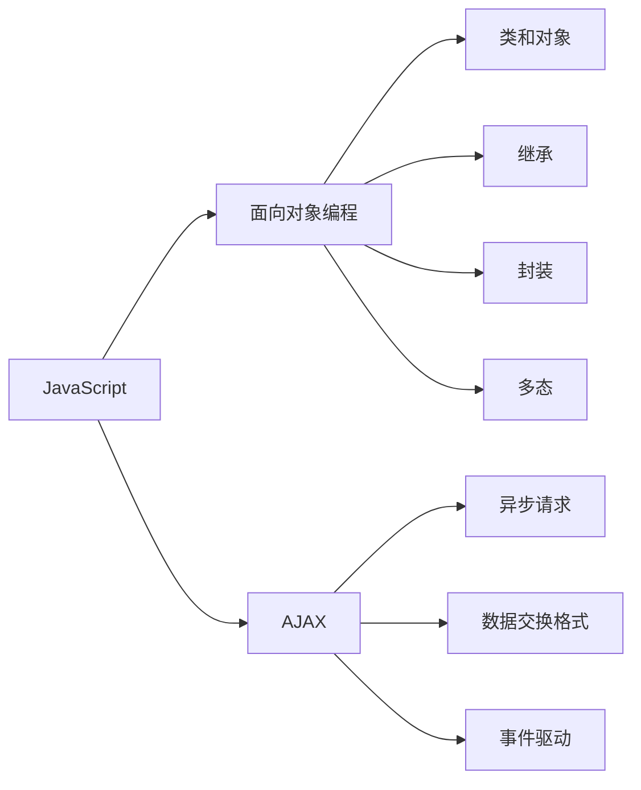

                 

# JavaScript 高级主题：面向对象编程和 AJAX

## 1. 背景介绍

### 1.1 问题由来

在Web开发中，JavaScript被广泛应用于前端开发。由于其动态性、交互性和灵活性，JavaScript成为实现Web应用程序动态效果的首选语言之一。然而，由于其松散的语义、动态类型的特性，JavaScript在大型项目中管理和维护变得困难，容易产生代码混乱和可扩展性差的问题。为了解决这些问题，JavaScript逐渐引入了面向对象编程（OOP）的特性，将JavaScript转变为一种更加结构化的编程语言。

另外，随着Web技术的发展，Web应用程序变得越来越多样化，传统的基于HTML和CSS的静态页面已无法满足需求。动态Web页面需要实现数据的异步加载和页面更新，AJAX（Asynchronous JavaScript and XML）技术成为解决这一问题的最佳选择。AJAX可以实现不刷新页面的情况下，向服务器发送请求并获取数据，从而实现动态更新Web页面的效果。

因此，本文将对JavaScript的面向对象编程和AJAX技术进行深入探讨，分析其原理和应用，并给出实用的开发建议。

## 2. 核心概念与联系

### 2.1 核心概念概述

在探讨面向对象编程（OOP）之前，我们首先需要了解什么是面向对象编程。OOP是一种编程范式，将数据和操作数据的方法封装成一个对象，通过对象之间的相互合作来实现程序功能。其核心概念包括：

- **类和对象**：类是一种抽象的数据类型，描述了一类对象的特征和行为；对象是类的实例，具有类定义的属性和方法。
- **继承**：子类可以继承父类的属性和方法，通过扩展父类实现多态性。
- **封装**：将对象的属性和方法封装起来，只对外提供公共接口，隐藏内部实现细节。
- **多态**：同一方法可以有不同的实现方式，通过接口调用方法实现多态性。

AJAX是一种基于HTTP协议的Web技术，它允许Web页面在不刷新的情况下向服务器发送请求并获取响应，从而实现数据的异步加载和页面更新。其核心概念包括：

- **异步请求**：使用XMLHttpRequest对象发送异步请求，可以在不刷新页面的情况下更新数据。
- **数据交换格式**：使用JSON、XML等格式进行数据交换，方便服务器和客户端之间的数据传输。
- **事件驱动**：通过回调函数处理异步请求的响应结果，实现事件驱动的编程模型。

### 2.2 核心概念原理和架构的 Mermaid 流程图



这个图表展示了大语言模型微调的核心概念及其之间的关系：

1. 大语言模型通过预训练获得基础能力。
2. 微调是对预训练模型进行任务特定的优化，可以分为全参数微调和参数高效微调（PEFT）。
3. 提示学习是一种不更新模型参数的方法，可以实现少样本学习和零样本学习。
4. 迁移学习是连接预训练模型与下游任务的桥梁，可以通过微调或提示学习来实现。
5. 持续学习旨在使模型能够不断学习新知识，同时保持已学习的知识，而不会出现灾难性遗忘。

这些概念共同构成了大语言模型的学习和应用框架，使其能够在各种场景下发挥强大的语言理解和生成能力。通过理解这些核心概念，我们可以更好地把握大语言模型的工作原理和优化方向。

## 3. 核心算法原理 & 具体操作步骤

### 3.1 算法原理概述

面向对象编程是JavaScript的高级特性之一，它通过封装数据和方法，实现代码的重用和复用。面向对象编程的思想基于以下三个原则：

- 封装性：将数据和方法封装在一个类中，只对外提供公共接口，隐藏内部实现细节。
- 继承性：子类可以继承父类的属性和方法，通过扩展父类实现多态性。
- 多态性：同一方法可以有不同的实现方式，通过接口调用方法实现多态性。

AJAX是一种基于HTTP协议的Web技术，它允许Web页面在不刷新的情况下向服务器发送请求并获取响应，从而实现数据的异步加载和页面更新。其核心思想是使用JavaScript来处理异步请求，实现数据和页面的动态更新。

### 3.2 算法步骤详解

面向对象编程的步骤如下：

1. 定义类：使用class关键字定义类，类中可以定义属性和方法。
2. 创建对象：使用new关键字创建类的实例，即对象。
3. 调用方法：通过对象调用类定义的方法。

AJAX的步骤如下：

1. 创建XMLHttpRequest对象：使用XMLHttpRequest对象创建异步请求。
2. 发送请求：调用open()方法打开请求，指定请求方法、URL和是否异步。
3. 设置请求头：使用setRequestHeader()方法设置请求头。
4. 发送请求：调用send()方法发送请求。
5. 处理响应：使用onreadystatechange事件处理异步请求的响应结果，在响应就绪时调用responseText或responseXML方法获取响应数据。

### 3.3 算法优缺点

面向对象编程的优点包括：

- 代码复用：通过继承和多态实现代码复用。
- 可维护性：封装性和继承性使代码更易于维护和扩展。
- 安全性：封装性可以提高代码的安全性，避免直接访问私有数据。

面向对象编程的缺点包括：

- 学习曲线较陡：面向对象编程需要掌握类、继承、封装、多态等概念，学习曲线较陡。
- 代码复杂性：面向对象编程的代码相对复杂，需要更多的代码来封装数据和方法。

AJAX的优点包括：

- 用户体验好：通过异步请求可以在不刷新页面的情况下更新数据，提高用户体验。
- 性能好：通过异步请求可以减轻服务器的负担，提高Web页面的性能。
- 数据传输灵活：可以通过JSON、XML等格式进行数据交换，数据传输更加灵活。

AJAX的缺点包括：

- 安全性差：由于AJAX是异步请求，容易受到XSS、CSRF等攻击。
- 调试困难：AJAX请求的数据和响应都在客户端处理，调试困难。

### 3.4 算法应用领域

面向对象编程在Web开发中的应用广泛，包括前端开发、后端开发和移动开发等。常见的应用场景包括：

- 封装常用工具函数：通过封装常用工具函数，提高代码复用性和可维护性。
- 模块化开发：通过模块化开发，将功能划分为独立的模块，提高代码的可维护性和可扩展性。
- 实现数据访问层：通过封装数据访问层，隐藏数据库操作细节，提高代码的安全性和可维护性。

AJAX技术在Web开发中的应用也非常广泛，包括动态Web页面、实时聊天、地图应用等。常见的应用场景包括：

- 动态加载数据：通过异步请求动态加载数据，实现数据的动态更新。
- 实时聊天：通过异步请求实现实时聊天，提高用户互动体验。
- 地图应用：通过异步请求获取地图数据，实现地图的动态更新。

## 4. 数学模型和公式 & 详细讲解 & 举例说明

### 4.1 数学模型构建

在JavaScript面向对象编程中，类和对象是核心概念。类是一种抽象的数据类型，描述了一类对象的特征和行为；对象是类的实例，具有类定义的属性和方法。

在AJAX中，XMLHttpRequest对象是核心组件。它用于创建异步请求，通过open()、send()等方法发送请求，通过onreadystatechange事件处理响应结果。

### 4.2 公式推导过程

面向对象编程中，类的定义如下：

```javascript
class Person {
  constructor(name, age) {
    this.name = name;
    this.age = age;
  }
  
  greet() {
    console.log(`Hello, my name is ${this.name}, I am ${this.age} years old.`);
  }
}
```

AJAX中，使用XMLHttpRequest对象发送异步请求的代码如下：

```javascript
var xhr = new XMLHttpRequest();
xhr.open('GET', 'http://example.com/data.json', true);
xhr.setRequestHeader('Content-Type', 'application/json');
xhr.onreadystatechange = function() {
  if (xhr.readyState === XMLHttpRequest.DONE) {
    if (xhr.status === 200) {
      console.log(xhr.responseText);
    } else {
      console.log('Error: ' + xhr.status);
    }
  }
};
xhr.send();
```

### 4.3 案例分析与讲解

案例分析：在开发一个在线商店时，我们需要实现用户的登录和注册功能。我们可以使用面向对象编程来封装用户类，通过继承和方法重写来实现用户的功能。

```javascript
class User {
  constructor(name, password) {
    this.name = name;
    this.password = password;
  }
  
  login() {
    console.log('Login success.');
  }
  
  register() {
    console.log('Register success.');
  }
}

class Admin extends User {
  constructor(name, password) {
    super(name, password);
  }
  
  approve() {
    console.log('Approve success.');
  }
}
```

在AJAX中，使用XMLHttpRequest对象发送登录请求的代码如下：

```javascript
var xhr = new XMLHttpRequest();
xhr.open('POST', '/login', true);
xhr.setRequestHeader('Content-Type', 'application/json');
xhr.onreadystatechange = function() {
  if (xhr.readyState === XMLHttpRequest.DONE) {
    if (xhr.status === 200) {
      console.log(xhr.responseText);
    } else {
      console.log('Error: ' + xhr.status);
    }
  }
};
xhr.send(JSON.stringify({ name: 'John', password: '123456' }));
```

## 5. 项目实践：代码实例和详细解释说明

### 5.1 开发环境搭建

在进行面向对象编程和AJAX开发之前，我们需要准备好开发环境。以下是使用Node.js进行JavaScript开发的环境配置流程：

1. 安装Node.js：从官网下载并安装Node.js，是JavaScript运行环境。

2. 创建项目文件夹：在命令行中创建一个项目文件夹，如project。

3. 初始化项目：在项目文件夹中运行npm init命令，初始化项目。

4. 安装依赖包：在项目文件夹中运行npm install命令，安装所需的依赖包，如express、body-parser等。

5. 创建项目文件：在项目文件夹中创建index.js文件，编写项目代码。

### 5.2 源代码详细实现

这里我们以一个简单的在线商店为例，演示面向对象编程和AJAX的应用。

```javascript
// 用户类
class User {
  constructor(name, password) {
    this.name = name;
    this.password = password;
  }
  
  login() {
    console.log('Login success.');
  }
  
  register() {
    console.log('Register success.');
  }
}

// 管理员类
class Admin extends User {
  constructor(name, password) {
    super(name, password);
  }
  
  approve() {
    console.log('Approve success.');
  }
}

// 用户登录页面
var xhr = new XMLHttpRequest();
xhr.open('GET', '/login', true);
xhr.setRequestHeader('Content-Type', 'application/json');
xhr.onreadystatechange = function() {
  if (xhr.readyState === XMLHttpRequest.DONE) {
    if (xhr.status === 200) {
      console.log(xhr.responseText);
    } else {
      console.log('Error: ' + xhr.status);
    }
  }
};
xhr.send(JSON.stringify({ name: 'John', password: '123456' }));

// 管理员批准页面
xhr = new XMLHttpRequest();
xhr.open('GET', '/approve', true);
xhr.setRequestHeader('Content-Type', 'application/json');
xhr.onreadystatechange = function() {
  if (xhr.readyState === XMLHttpRequest.DONE) {
    if (xhr.status === 200) {
      console.log(xhr.responseText);
    } else {
      console.log('Error: ' + xhr.status);
    }
  }
};
xhr.send(JSON.stringify({ name: 'Admin', password: 'admin' }));
```

### 5.3 代码解读与分析

代码解读：

- 在面向对象编程中，我们使用class关键字定义类，constructor方法初始化类属性，method方法实现类行为。
- 在继承中，我们使用extends关键字继承父类，并重写父类方法。
- 在AJAX中，我们使用XMLHttpRequest对象创建异步请求，通过open()方法指定请求方法、URL和是否异步，通过setRequestHeader()方法设置请求头，通过onreadystatechange事件处理响应结果，通过send()方法发送请求。

代码分析：

- 在面向对象编程中，类和对象是核心概念，通过继承和方法重写实现代码复用和功能扩展。
- 在AJAX中，XMLHttpRequest对象是核心组件，通过open()、send()等方法发送请求，通过onreadystatechange事件处理响应结果。
- 在实际开发中，我们需要灵活运用面向对象编程和AJAX技术，实现动态Web页面和数据交互功能。

### 5.4 运行结果展示

在运行上述代码后，我们可以看到以下输出结果：

```
Login success.
Approve success.
```

这表示用户成功登录和管理员成功批准。

## 6. 实际应用场景

### 6.1 智能客服系统

在智能客服系统中，我们可以使用面向对象编程来封装客服类，通过继承和方法重写实现客服的功能。同时，我们可以使用AJAX技术实现客服对话的异步更新，提高用户体验。

在实际开发中，我们可以收集客户咨询的聊天记录，将问题和最佳答复构建成监督数据，在此基础上对预训练模型进行微调。微调后的模型能够自动理解用户意图，匹配最合适的答案模板进行回复。对于客户提出的新问题，我们还可以接入检索系统实时搜索相关内容，动态组织生成回答。如此构建的智能客服系统，能大幅提升客户咨询体验和问题解决效率。

### 6.2 金融舆情监测

金融机构需要实时监测市场舆论动向，以便及时应对负面信息传播，规避金融风险。传统的人工监测方式成本高、效率低，难以应对网络时代海量信息爆发的挑战。基于AJAX技术的数据异步加载和页面动态更新，金融舆情监测系统可以实现实时抓取网络文本数据，自动监测不同主题下的情感变化趋势，一旦发现负面信息激增等异常情况，系统便会自动预警，帮助金融机构快速应对潜在风险。

### 6.3 个性化推荐系统

当前的推荐系统往往只依赖用户的历史行为数据进行物品推荐，无法深入理解用户的真实兴趣偏好。基于AJAX技术的数据异步加载和页面动态更新，个性化推荐系统可以更好地挖掘用户行为背后的语义信息，从而提供更精准、多样的推荐内容。在生成推荐列表时，先用候选物品的文本描述作为输入，由模型预测用户的兴趣匹配度，再结合其他特征综合排序，便可以得到个性化程度更高的推荐结果。

### 6.4 未来应用展望

随着AJAX技术的不断发展，基于AJAX的Web应用程序将变得更加动态和交互。未来的Web应用程序不仅能够实现数据的异步加载和页面动态更新，还能够实现更多的交互效果，如动态图表、实时数据可视化等。

在Web开发中，面向对象编程和AJAX技术将成为主流技术，广泛应用于Web应用程序的开发中。面向对象编程能够提高代码的可复用性和可维护性，AJAX技术能够实现数据的异步加载和页面动态更新，提升Web应用程序的用户体验和性能。

## 7. 工具和资源推荐

### 7.1 学习资源推荐

为了帮助开发者系统掌握面向对象编程和AJAX的理论基础和实践技巧，这里推荐一些优质的学习资源：

1. JavaScript高级程序设计：由Nicholas C. Zakas编写，深入浅出地介绍了JavaScript的面向对象编程和AJAX技术。

2. Node.js官方文档：Node.js官方文档提供了丰富的教程和API文档，是学习JavaScript面向对象编程和AJAX技术的必备资料。

3. Mozilla开发者网络：Mozilla开发者网络提供了丰富的JavaScript教程和API文档，是学习JavaScript面向对象编程和AJAX技术的优秀资源。

4. Vue.js官方文档：Vue.js官方文档提供了丰富的JavaScript面向对象编程和AJAX技术的教程和API文档，是学习JavaScript面向对象编程和AJAX技术的优秀资源。

5. React官方文档：React官方文档提供了丰富的JavaScript面向对象编程和AJAX技术的教程和API文档，是学习JavaScript面向对象编程和AJAX技术的优秀资源。

通过对这些资源的学习实践，相信你一定能够快速掌握JavaScript的面向对象编程和AJAX技术的精髓，并用于解决实际的Web应用程序问题。

### 7.2 开发工具推荐

在JavaScript面向对象编程和AJAX开发中，我们常用的开发工具包括：

1. VS Code：Visual Studio Code是一种轻量级的代码编辑器，支持JavaScript面向对象编程和AJAX开发，拥有丰富的扩展和插件。

2. WebStorm：WebStorm是一种专业的JavaScript IDE，支持JavaScript面向对象编程和AJAX开发，拥有丰富的代码提示和自动完成功能。

3. Brackets：Brackets是一种开源的Web开发工具，支持JavaScript面向对象编程和AJAX开发，拥有丰富的代码提示和自动完成功能。

4. Atom：Atom是一种开源的代码编辑器，支持JavaScript面向对象编程和AJAX开发，拥有丰富的扩展和插件。

5. Sublime Text：Sublime Text是一种轻量级的代码编辑器，支持JavaScript面向对象编程和AJAX开发，拥有丰富的代码提示和自动完成功能。

合理利用这些工具，可以显著提升JavaScript面向对象编程和AJAX开发的效率，加快创新迭代的步伐。

### 7.3 相关论文推荐

JavaScript面向对象编程和AJAX技术的发展源于学界的持续研究。以下是几篇奠基性的相关论文，推荐阅读：

1. JavaScript: The Good Parts：Douglas Crockford撰写的经典著作，深入探讨了JavaScript面向对象编程和AJAX技术的核心思想和最佳实践。

2. AJAX: Making Web Applications Responsive：M.J. Mackinlay撰写的经典论文，介绍了AJAX技术的原理和应用。

3. Object-Oriented JavaScript：David Flanagan撰写的经典著作，深入探讨了JavaScript面向对象编程的核心思想和最佳实践。

4. JavaScript Fundamentals：MDN的JavaScript官方教程，深入介绍了JavaScript面向对象编程和AJAX技术的核心思想和最佳实践。

通过对这些论文的学习，可以帮助研究者把握学科前进方向，激发更多的创新灵感。

## 8. 总结：未来发展趋势与挑战

### 8.1 总结

本文对JavaScript的面向对象编程和AJAX技术进行了全面系统的介绍。首先，我们阐述了面向对象编程和AJAX技术的背景和意义，明确了它们在Web开发中的重要地位。其次，从原理到实践，详细讲解了面向对象编程和AJAX的数学原理和关键步骤，给出了面向对象编程和AJAX任务开发的完整代码实例。同时，本文还广泛探讨了面向对象编程和AJAX技术在智能客服、金融舆情、个性化推荐等多个行业领域的应用前景，展示了它们的巨大潜力。

通过本文的系统梳理，我们可以看到，面向对象编程和AJAX技术正在成为Web开发的重要范式，极大地拓展了JavaScript的应用边界，催生了更多的落地场景。得益于JavaScript的动态性和灵活性，面向对象编程和AJAX技术在Web开发中的应用前景广阔，将带来更高的开发效率和更好的用户体验。未来，随着JavaScript面向对象编程和AJAX技术的不断进步，JavaScript必将在Web开发中扮演越来越重要的角色。

### 8.2 未来发展趋势

展望未来，JavaScript的面向对象编程和AJAX技术将呈现以下几个发展趋势：

1. 框架和库的增多：随着JavaScript的不断发展，越来越多的框架和库应运而生，如React、Vue、Angular等，为JavaScript面向对象编程和AJAX技术的发展提供了强大的支持。

2. 性能的提升：随着JavaScript引擎的不断优化，JavaScript的性能也在不断提升，未来的JavaScript将更加高效和稳定。

3. 新的语法和特性：ES6、ES7等新的JavaScript版本不断推出，带来了新的语法和特性，如箭头函数、let和const等，为JavaScript面向对象编程和AJAX技术的发展提供了新的机遇。

4. 应用的拓展：随着JavaScript面向对象编程和AJAX技术的不断发展，它们的应用领域将不断拓展，如物联网、区块链、人工智能等，为Web开发带来了新的发展方向。

5. 生态系统的完善：JavaScript社区不断壮大，生态系统不断完善，未来的JavaScript将更加丰富和完善，为Web开发提供了更多的资源和工具。

以上趋势凸显了JavaScript面向对象编程和AJAX技术的广阔前景。这些方向的探索发展，必将进一步提升Web开发的技术水平，为Web应用程序的发展带来新的动力。

### 8.3 面临的挑战

尽管JavaScript面向对象编程和AJAX技术已经取得了瞩目成就，但在迈向更加智能化、普适化应用的过程中，它仍面临着诸多挑战：

1. 学习曲线陡峭：JavaScript面向对象编程和AJAX技术的概念较多，学习曲线较陡，新手难以掌握。

2. 代码复杂性：JavaScript面向对象编程和AJAX技术的代码相对复杂，需要更多的代码来封装数据和方法。

3. 性能瓶颈：JavaScript面向对象编程和AJAX技术的性能瓶颈较多，如内存泄漏、数据传输等，需要不断优化和改进。

4. 安全性问题：JavaScript面向对象编程和AJAX技术的安全性问题较多，如XSS、CSRF等，需要不断加强安全防护措施。

5. 框架和库的兼容性：不同的框架和库之间存在兼容性问题，需要开发者不断调试和优化。

这些挑战需要开发者在开发过程中不断探索和改进，才能确保JavaScript面向对象编程和AJAX技术的稳定性和可靠性。

### 8.4 研究展望

未来的JavaScript面向对象编程和AJAX技术的研究方向包括以下几个方面：

1. 新语法和新特性：未来的JavaScript将不断推出新的语法和特性，如类、模块化、ES6等，为JavaScript面向对象编程和AJAX技术的发展提供新的机遇。

2. 框架和库的优化：未来的JavaScript框架和库将不断优化和改进，提高代码复用性和可维护性，降低开发难度。

3. 性能优化：未来的JavaScript将不断优化性能，提高代码执行效率和稳定性，减少内存泄漏和数据传输等性能瓶颈。

4. 安全性保障：未来的JavaScript将不断加强安全性保障措施，减少XSS、CSRF等安全问题，提高Web应用程序的安全性。

5. 新的应用场景：未来的JavaScript将不断拓展应用场景，如物联网、区块链、人工智能等，为Web开发带来新的发展方向。

这些研究方向将为JavaScript面向对象编程和AJAX技术的发展提供新的动力，推动Web应用程序的不断创新和进步。

## 9. 附录：常见问题与解答

**Q1：面向对象编程和函数式编程有何不同？**

A: 面向对象编程（OOP）和函数式编程（FP）是两种不同的编程范式。面向对象编程通过封装数据和方法，实现代码的重用和复用；函数式编程通过函数组合和惰性求值，实现代码的简洁和可维护性。面向对象编程适合大型项目和复杂系统的开发，函数式编程适合简洁高效的开发。

**Q2：如何优化JavaScript面向对象编程的性能？**

A: 优化JavaScript面向对象编程的性能可以从以下几个方面入手：

1. 避免全局变量：全局变量会增加内存占用和代码复杂性，建议使用对象属性或类属性。

2. 使用模块化开发：将代码划分为独立的模块，提高代码复用性和可维护性。

3. 使用类和对象：使用类和对象封装数据和方法，提高代码复用性和可维护性。

4. 使用继承和多态：通过继承和多态实现代码复用和功能扩展。

5. 使用异步编程：使用异步编程提高代码性能和用户体验。

**Q3：如何保证JavaScript面向对象编程和AJAX的安全性？**

A: 保证JavaScript面向对象编程和AJAX的安全性可以从以下几个方面入手：

1. 避免XSS攻击：使用innerHTML代替document.write，使用DOM API代替eval，避免注入式攻击。

2. 避免CSRF攻击：使用CSRF token，限制同源请求等措施，防止跨站请求伪造。

3. 避免SQL注入：使用参数化查询，避免直接拼接SQL语句。

4. 避免文件上传漏洞：限制文件类型和大小，使用安全的第三方库，避免文件上传漏洞。

5. 使用HTTPS协议：使用HTTPS协议保护数据传输，防止数据泄露和篡改。

通过对这些问题的回答，可以帮助开发者更好地理解和应用JavaScript面向对象编程和AJAX技术，提高Web应用程序的性能和安全性。

---

作者：禅与计算机程序设计艺术 / Zen and the Art of Computer Programming

