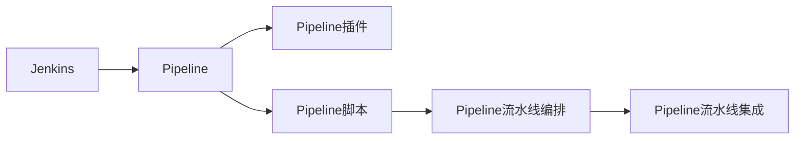

                 

# Jenkins Pipeline脚本开发

## 1. 背景介绍

### 1.1 问题由来
在当今的DevOps环境下，持续集成和持续部署（CI/CD）成为了软件开发流程中的重要一环。自动化流水线的构建和维护，是确保代码质量、提升部署效率的关键。然而，传统的脚本化流水线编写方式繁琐、维护困难，特别是在代码量逐渐增大、流程日益复杂的今天，人工操作已难以满足需求。Jenkins Pipeline作为一种声明式流水线构建工具，通过脚本化的方式，自动化的执行任务，极大地提高了开发效率和流水线维护的便利性。

### 1.2 问题核心关键点
Jenkins Pipeline的开发主要涉及以下几个关键点：
- **Pipeline脚本设计**：Jenkins Pipeline通过脚本来定义流水线的执行过程，包括源码获取、构建、测试、部署等环节。
- **Pipeline插件使用**：Jenkins Pipeline支持多种插件，用于处理各种自动化任务，如Docker、Kubernetes等。
- **Pipeline流水线编排**：通过Pipeline脚本对流水线进行编排，实现任务的串行、并行执行，提升流水线执行效率。
- **Pipeline流水线集成**：Jenkins Pipeline可以与其他工具无缝集成，如SonarQube、Jira、Slack等，支持多样化的开发场景。

### 1.3 问题研究意义
Jenkins Pipeline的开发在DevOps实践中的应用广泛，对于提升软件开发效率、降低维护成本、保证代码质量具有重要意义：
- **自动化流水线构建**：通过脚本自动化构建、测试和部署，减少人工操作，降低人为错误。
- **提升开发效率**：Pipeline脚本的模块化设计，使得代码复用率大大提高，开发效率显著提升。
- **保证代码质量**：Pipeline流水线的自动化测试和部署机制，确保每次代码提交都通过严格的质量保障流程。
- **强化持续集成**：通过Pipeline的持续集成机制，可以快速响应变更，持续优化产品质量。

## 2. 核心概念与联系

### 2.1 核心概念概述

为更好地理解Jenkins Pipeline的开发过程，本节将介绍几个关键概念及其相互关系：

- **Jenkins**：持续集成和持续部署的核心平台，提供可视化管理界面和丰富的插件支持。
- **Pipeline**：通过Groovy脚本定义流水线执行任务的机制，包括代码源管理、构建过程、测试机制、部署操作等。
- **Pipeline插件**：Jenkins Pipeline内置的多种插件，用于处理构建、测试、部署等任务，支持多样化的开发场景。
- **Pipeline脚本**：定义Pipeline流水线的Groovy脚本，包括任务的编排、条件判断、异常处理等。
- **Pipeline流水线编排**：对Pipeline脚本的执行顺序、依赖关系进行编排，实现任务的串行、并行执行。
- **Pipeline流水线集成**：将Pipeline与其他工具如SonarQube、Jira、Slack等集成，形成完整的开发生态。

这些概念之间的逻辑关系可以通过以下Mermaid流程图来展示：



这个流程图展示了Jenkins Pipeline的核心概念及其之间的关系：

1. Jenkins作为持续集成和部署的核心平台，提供丰富的插件支持。
2. Pipeline通过Groovy脚本定义流水线执行任务，具有模块化和可重用性。
3. Pipeline插件支持多种自动化任务，提升开发效率。
4. Pipeline脚本通过编排实现任务的串行和并行执行。
5. Pipeline流水线集成支持与其他工具的无缝对接，形成完整的开发生态。

## 3. 核心算法原理 & 具体操作步骤
### 3.1 算法原理概述

Jenkins Pipeline的开发主要基于声明式编程范式，通过Groovy脚本定义流水线执行任务。其核心思想是通过脚本的逻辑组合，实现自动化流水线的构建和执行。

Pipeline脚本由三个核心部分组成：
- **步骤(Step)**：定义每个任务的具体操作，如源码拉取、构建、测试、部署等。
- **阶段(Stage)**：将多个步骤组织成逻辑单元，增强流水线的可读性和可维护性。
- **分支分支(Job)**：定义整个流水线的执行流程，包括源码管理、构建、测试、部署等环节。

通过步骤、阶段、分支的分层设计，Pipeline实现了任务的自动化编排和执行，提升了开发效率和流水线维护的便利性。

### 3.2 算法步骤详解

Jenkins Pipeline的开发一般包括以下几个关键步骤：

**Step 1: 准备Jenkins环境和Pipeline插件**
- 安装Jenkins环境，并配置好必要的插件，如Pipeline插件、Docker插件、Kubernetes插件等。

**Step 2: 编写Pipeline脚本**
- 定义Pipeline脚本，包括源码管理、构建过程、测试机制、部署操作等。
- 使用`stage`定义流水线的不同阶段，每个阶段包含多个`step`任务。
- 使用条件判断、异常处理等机制，提升Pipeline脚本的可读性和鲁棒性。

**Step 3: 配置Pipeline流水线**
- 在Jenkins项目中创建Pipeline配置项，上传Pipeline脚本。
- 配置Pipeline流水线的参数，如触发方式、分支、构建策略等。
- 保存并触发Pipeline流水线，观察执行结果。

**Step 4: 优化Pipeline脚本**
- 根据执行结果和反馈信息，逐步优化Pipeline脚本，提升其性能和可维护性。
- 使用Pipeline流水线的自动化反馈机制，持续改进开发流程。

### 3.3 算法优缺点

Jenkins Pipeline的开发具有以下优点：
- **声明式编程**：通过Groovy脚本定义流水线执行任务，提升代码的可读性和可维护性。
- **模块化和可重用性**：Pipeline脚本通过步骤、阶段、分支的分层设计，实现任务的自动化编排和执行。
- **插件支持**：Jenkins Pipeline支持多种插件，可以处理各种自动化任务，如Docker、Kubernetes等。
- **自动化构建和部署**：Pipeline脚本的自动化构建和部署机制，提升开发效率，减少人为错误。

同时，该方法也存在一定的局限性：
- **学习成本高**：需要掌握Groovy脚本和Jenkins平台的知识，对于初学者门槛较高。
- **执行效率有限**：Pipeline脚本的执行效率相对较低，在大规模项目上可能会面临性能瓶颈。
- **依赖Jenkins**：Pipeline开发和执行依赖Jenkins平台，在异构环境下的适应性有待提高。

尽管存在这些局限性，但Jenkins Pipeline仍是大规模自动化流水线构建和维护的主流工具。未来相关研究的重点在于如何进一步降低Pipeline脚本的开发难度，提高其执行效率，提升在异构环境下的适应性。

### 3.4 算法应用领域

Jenkins Pipeline的开发在DevOps实践中的应用广泛，主要包括以下几个领域：

- **持续集成和持续部署**：通过Pipeline脚本自动构建、测试和部署，提升开发效率，降低人为错误。
- **自动化测试**：通过Pipeline脚本自动化执行测试任务，快速响应变更，保证代码质量。
- **容器化部署**：通过Pipeline脚本集成Docker、Kubernetes等工具，实现容器化应用的自动化部署。
- **云平台集成**：通过Pipeline脚本集成云平台服务，如AWS、Azure、Google Cloud等，提升云资源的使用效率。
- **自动化监控**：通过Pipeline脚本集成监控工具如Prometheus、Grafana等，实时监控系统状态，保证应用稳定运行。

除了以上这些经典应用外，Jenkins Pipeline还被创新性地应用到更多场景中，如自动文档生成、自动化报告生成、自动化数据处理等，为DevOps技术的发展提供了新的方向。

## 4. 数学模型和公式 & 详细讲解 & 举例说明

### 4.1 数学模型构建

本节将使用数学语言对Jenkins Pipeline的开发过程进行更加严格的刻画。

记Jenkins Pipeline流水线的执行过程为 $S$，包括源码管理、构建、测试、部署等环节。假设每个环节的执行时间为 $t_i$，$i \in [1, n]$。其中 $t_1$ 为源码管理，$t_2$ 为构建，$t_3$ 为测试，$t_4$ 为部署。

定义每个任务的执行时间 $t_i$，$i \in [1, n]$。则在流水线总时间 $T$ 的定义为：

$$
T = \sum_{i=1}^n t_i
$$

定义流水线并行度 $P$，即同时执行的任务数。流水线并行度越大，流水线的执行效率越高。

流水线的执行顺序由Pipeline脚本定义，分为串行和并行两种执行方式。

- 串行执行：任务按照定义顺序依次执行，每个任务完成后再执行下一个任务。此时流水线的总执行时间为 $T = \sum_{i=1}^n t_i$。
- 并行执行：部分任务可以同时执行，提高流水线的执行效率。此时流水线的总执行时间为 $T = \max(\sum_{i=1}^k t_i, \sum_{j=k+1}^n t_j)$，其中 $k$ 为并行执行的任务数。

### 4.2 公式推导过程

以下我们以简单的持续集成流程为例，推导 Pipeline 流水线的执行时间公式。

假设持续集成流程包括源码拉取、构建、测试三个步骤，每个步骤的执行时间分别为 $t_1$、$t_2$、$t_3$。假设任务间为串行执行，则流水线的总执行时间为：

$$
T = t_1 + t_2 + t_3
$$

若任务间为并行执行，则流水线的总执行时间为：

$$
T = \max(t_1, t_2 + t_3)
$$

对于更复杂的流水线任务，可以通过添加步骤、阶段、分支等方式，进行更精细的编排，提升流水线的执行效率。

### 4.3 案例分析与讲解

下面以实际案例，展示如何使用Pipeline脚本实现持续集成和持续部署流程。

假设有一个Web应用项目，包括源码拉取、构建、测试、部署等环节。Pipeline脚本定义如下：

```groovy
pipeline {
    agent any
    stages {
        stage('源码拉取') {
            steps {
                withGithub {
                    fetch SCM
                }
            }
        }
        stage('构建') {
            steps {
                sh 'mvn clean install'
            }
        }
        stage('测试') {
            steps {
                sh 'mvn test'
            }
        }
        stage('部署') {
            steps {
                withGithub {
                    publish SCM
                }
            }
        }
    }
}
```

该Pipeline脚本定义了源码拉取、构建、测试、部署四个步骤，每个步骤的具体操作由命令实现。在Jenkins项目中配置Pipeline脚本后，Jenkins将自动执行该流水线流程，实现持续集成和持续部署。

## 5. 项目实践：代码实例和详细解释说明
### 5.1 开发环境搭建

在进行Pipeline脚本开发前，我们需要准备好开发环境。以下是使用Jenkins和Groovy进行Pipeline开发的环境配置流程：

1. 安装Jenkins环境，并确保Groovy插件已安装。
2. 在Jenkins中创建一个新的Pipeline项目。
3. 上传Pipeline脚本文件，配置项目参数。
4. 保存并触发Pipeline流水线，观察执行结果。

完成上述步骤后，即可在Jenkins环境中开始Pipeline脚本的开发。

### 5.2 源代码详细实现

这里我们以Jenkins Pipeline的持续集成和持续部署为例，展示Pipeline脚本的编写和执行。

首先，创建一个Pipeline项目，并上传Pipeline脚本：

```groovy
pipeline {
    agent any
    stages {
        stage('源码拉取') {
            steps {
                withGithub {
                    fetch SCM
                }
            }
        }
        stage('构建') {
            steps {
                sh 'mvn clean install'
            }
        }
        stage('测试') {
            steps {
                sh 'mvn test'
            }
        }
        stage('部署') {
            steps {
                withGithub {
                    publish SCM
                }
            }
        }
    }
}
```

该Pipeline脚本定义了源码拉取、构建、测试、部署四个步骤，每个步骤的具体操作由命令实现。

其次，在Jenkins中配置Pipeline项目的参数，包括源码管理、构建策略、分支触发等：

```properties
GITHUB_USER=myuser
GITHUB_REPO=myrepo
JENKINS_URL=http://jenkins.example.com
```

完成上述步骤后，即可在Jenkins环境中测试Pipeline脚本的执行效果。

### 5.3 代码解读与分析

让我们再详细解读一下关键代码的实现细节：

**Pipeline脚本**：
- `pipeline`：定义Pipeline脚本的顶层语句，声明脚本为Pipeline脚本。
- `agent any`：定义Pipeline脚本的执行环境，可以是本地机器、远程机器等。
- `stages`：定义Pipeline流水线的阶段，每个阶段包含多个步骤。
- `withGithub`：定义Github客户端，用于源码管理和部署操作。
- `fetch SCM`：拉取Github仓库代码到本地。
- `publish SCM`：将本地代码推送到Github仓库。

**Pipeline参数配置**：
- `GITHUB_USER`：定义Github的用户名。
- `GITHUB_REPO`：定义Github的仓库名。
- `JENKINS_URL`：定义Jenkins的URL地址。

**Pipeline执行过程**：
- 首先，Pipeline脚本定义了四个步骤：源码拉取、构建、测试、部署。
- 在每个步骤中，通过`sh`命令执行具体的操作。
- 每个步骤的执行顺序按照定义顺序依次执行，每个任务完成后再执行下一个任务。
- 通过配置Github客户端，Pipeline脚本实现了源码拉取和部署操作。
- 通过Jenkins配置参数，Pipeline脚本可以自动触发流水线执行。

可以看出，Pipeline脚本通过声明式编程的方式，定义了流水线的执行过程，实现了持续集成和持续部署的自动化构建和部署。

## 6. 实际应用场景
### 6.1 持续集成和持续部署
Jenkins Pipeline在持续集成和持续部署中具有广泛的应用。传统的手工构建和部署流程繁琐、易出错，通过Pipeline脚本自动化执行，可以快速响应代码变更，提升开发效率。

在技术实现上，Pipeline脚本可以将源码拉取、构建、测试、部署等环节自动化，形成完整的持续集成和持续部署流程。例如，在Web应用开发中，每次代码提交后，Pipeline脚本自动拉取最新代码、构建应用、运行测试用例、部署到生产环境，确保新代码的质量和稳定性。

### 6.2 自动化测试
自动化测试是软件质量保证的重要环节。Jenkins Pipeline通过Pipeline脚本定义自动化测试任务，可以实现对代码的持续测试和覆盖。

在技术实现上，Pipeline脚本可以定义多个测试场景，自动执行测试用例，生成测试报告，并根据测试结果进行自动化部署。例如，在移动应用开发中，Pipeline脚本可以自动化执行UI测试、性能测试、安全测试等，确保应用的稳定性和安全性。

### 6.3 容器化部署
容器化部署是现代软件开发中的重要趋势。Jenkins Pipeline通过Pipeline脚本集成Docker、Kubernetes等工具，可以实现容器化应用的自动化部署。

在技术实现上，Pipeline脚本可以定义容器镜像的构建、发布、部署等操作，实现容器化应用的持续集成和持续部署。例如，在微服务架构中，Pipeline脚本可以自动化构建Docker镜像，并自动部署到Kubernetes集群中，确保应用的稳定运行和快速扩展。

### 6.4 云平台集成
Jenkins Pipeline支持与各种云平台的无缝集成，可以提升云资源的使用效率，实现云平台的自动化部署和管理。

在技术实现上，Pipeline脚本可以集成AWS、Azure、Google Cloud等云平台服务，实现云资源的自动化部署和管理。例如，在公有云应用开发中，Pipeline脚本可以自动化部署云服务器、负载均衡器、数据库等资源，确保应用的稳定运行和高效扩展。

### 6.5 自动化监控
Jenkins Pipeline可以与监控工具如Prometheus、Grafana等集成，实现系统的自动化监控和报警。

在技术实现上，Pipeline脚本可以定时采集系统指标，生成监控图表，并根据监控结果进行自动化报警。例如，在应用监控中，Pipeline脚本可以自动采集系统CPU、内存、网络等指标，并根据指标异常进行自动化报警，确保系统的稳定运行。

## 7. 工具和资源推荐
### 7.1 学习资源推荐

为了帮助开发者系统掌握Jenkins Pipeline的开发过程，这里推荐一些优质的学习资源：

1. Jenkins Pipeline官方文档：Jenkins官网提供的Pipeline官方文档，详细介绍了Pipeline脚本的语法和用法，是入门Pipeline脚本开发的最佳资源。
2. Pipeline实战教程：由Jenkins社区开发的Pipeline实战教程，通过实际案例讲解Pipeline脚本的开发流程和技巧。
3. Pipeline深度剖析：由Jenkins社区开发的Pipeline深度剖析文章，详细分析了Pipeline脚本的设计和优化技巧。
4. Pipeline开发最佳实践：由Jenkins社区和行业专家分享的Pipeline开发最佳实践，涵盖Pipeline脚本的各个环节。

通过对这些资源的学习实践，相信你一定能够快速掌握Jenkins Pipeline的精髓，并用于解决实际的开发问题。
###  7.2 开发工具推荐

高效的开发离不开优秀的工具支持。以下是几款用于Pipeline脚本开发的常用工具：

1. Jenkins：持续集成和持续部署的核心平台，支持Pipeline脚本的自动化构建和部署。
2. GitLab CI/CD：提供Pipeline脚本的CI/CD解决方案，支持与GitLab无缝集成。
3. GitLab Pipeline：GitLab社区提供的Pipeline脚本的开发工具，支持自动化构建和部署。
4. GitLab Pipeline Plugin：GitLab插件，提供Pipeline脚本的可视化配置和管理。
5. Jenkins Pipeline Plugin：Jenkins插件，提供Pipeline脚本的扩展和优化。

合理利用这些工具，可以显著提升Pipeline脚本的开发效率，加快创新迭代的步伐。

### 7.3 相关论文推荐

Jenkins Pipeline的开发源于学界的持续研究。以下是几篇奠基性的相关论文，推荐阅读：

1. "Jenkins Pipeline: Persistent Microservices In Stylish-Pipe"：Jenkins Pipeline的创始团队介绍Pipeline的起源和设计理念。
2. "Continuous Deployment Pipeline Automation"：讲解如何使用Pipeline脚本实现持续部署的自动化流程。
3. "Pipeline as Code: Unleashing Continuous Pipeline Automation"：介绍Pipeline脚本的自动化配置和管理机制。
4. "Pipeline as Code in the DevOps World"：分析Pipeline脚本在DevOps中的应用和优势。
5. "Pipeline as Code in GitHub"：探讨Pipeline脚本在GitHub上的应用和优化技巧。

这些论文代表了大语言模型微调技术的发展脉络。通过学习这些前沿成果，可以帮助研究者把握学科前进方向，激发更多的创新灵感。

## 8. 总结：未来发展趋势与挑战

### 8.1 总结

本文对Jenkins Pipeline的开发过程进行了全面系统的介绍。首先阐述了Pipeline脚本的开发背景和意义，明确了Pipeline在持续集成和持续部署中的独特价值。其次，从原理到实践，详细讲解了Pipeline的数学模型和关键步骤，给出了Pipeline脚本开发的完整代码实例。同时，本文还广泛探讨了Pipeline脚本在持续集成、自动化测试、容器化部署、云平台集成、自动化监控等多个领域的应用前景，展示了Pipeline脚本的巨大潜力。此外，本文精选了Pipeline脚本的学习资源，力求为读者提供全方位的技术指引。

通过本文的系统梳理，可以看到，Jenkins Pipeline脚本开发在持续集成和持续部署中具有重要地位，极大地提升了软件开发效率，降低了维护成本，保证了代码质量。未来，伴随Pipeline脚本的持续演进和优化，其将进一步提升DevOps技术的自动化水平，为软件开发的数字化转型提供坚实基础。

### 8.2 未来发展趋势

展望未来，Jenkins Pipeline脚本开发将呈现以下几个发展趋势：

1. **声明式编程的普及**：随着DevOps实践的推广，声明式编程范式将成为主流。通过Pipeline脚本的声明式编程，可以提升代码的可读性和可维护性，降低开发难度。
2. **微服务架构的融合**：Pipeline脚本与微服务架构的无缝集成，可以提升微服务应用的自动化部署和管理效率，确保应用的稳定运行。
3. **云平台的深入集成**：Pipeline脚本与云平台的深度集成，可以提升云资源的使用效率，实现云平台的自动化部署和管理。
4. **自动化监控和报警**：Pipeline脚本与监控工具的集成，可以实现系统的自动化监控和报警，确保应用的稳定运行。
5. **持续学习和优化**：Pipeline脚本的持续学习和优化机制，可以提升开发效率和流水线执行效率，确保系统的高效运行。

以上趋势凸显了Jenkins Pipeline脚本开发的广阔前景。这些方向的探索发展，必将进一步提升DevOps技术的自动化水平，为软件开发的数字化转型提供坚实基础。

### 8.3 面临的挑战

尽管Jenkins Pipeline脚本开发已经取得了瞩目成就，但在迈向更加智能化、普适化应用的过程中，它仍面临着诸多挑战：

1. **学习成本高**：需要掌握Pipeline脚本和Jenkins平台的知识，对于初学者门槛较高。
2. **执行效率有限**：Pipeline脚本的执行效率相对较低，在大规模项目上可能会面临性能瓶颈。
3. **依赖Jenkins**：Pipeline脚本开发和执行依赖Jenkins平台，在异构环境下的适应性有待提高。
4. **数据管理复杂**：Pipeline脚本涉及源码管理、构建、测试、部署等多个环节，数据管理的复杂性较高。
5. **安全性有待保障**：Pipeline脚本的自动化构建和部署机制，可能面临安全性风险，需要进行严格的权限控制和管理。

尽管存在这些挑战，但Jenkins Pipeline脚本开发仍是大规模自动化流水线构建和维护的主流工具。未来相关研究的重点在于如何进一步降低Pipeline脚本的开发难度，提高其执行效率，提升在异构环境下的适应性，并加强数据管理和安全性保障。

### 8.4 研究展望

面对Jenkins Pipeline脚本开发所面临的种种挑战，未来的研究需要在以下几个方面寻求新的突破：

1. **简化Pipeline脚本的编写**：通过语法糖、模板引擎等技术，简化Pipeline脚本的编写，提升开发效率。
2. **优化Pipeline脚本的执行效率**：通过脚本优化、并行执行等技术，提升Pipeline脚本的执行效率，适应大规模项目的需求。
3. **提升Pipeline脚本的适应性**：通过与云平台、容器化工具等无缝集成，提升Pipeline脚本的适应性，支持多样化的开发场景。
4. **加强Pipeline脚本的数据管理**：通过数据仓库、版本控制等技术，加强Pipeline脚本的数据管理，确保数据的准确性和一致性。
5. **保障Pipeline脚本的安全性**：通过权限控制、加密传输等技术，保障Pipeline脚本的安全性，确保系统的高效运行。

这些研究方向的研究突破，将进一步提升Jenkins Pipeline脚本开发的自动化水平，为软件开发的数字化转型提供坚实基础。总之，Jenkins Pipeline脚本开发需要从代码编写、执行效率、数据管理、安全性等多个维度协同发力，才能真正实现自动化流水线的构建和维护。

## 9. 附录：常见问题与解答

**Q1：Jenkins Pipeline的优点是什么？**

A: Jenkins Pipeline具有以下几个优点：
1. 声明式编程：通过Groovy脚本定义流水线执行任务，提升代码的可读性和可维护性。
2. 模块化和可重用性：Pipeline脚本通过步骤、阶段、分支的分层设计，实现任务的自动化编排和执行。
3. 插件支持：Jenkins Pipeline支持多种插件，可以处理各种自动化任务，如Docker、Kubernetes等。
4. 自动化构建和部署：Pipeline脚本的自动化构建和部署机制，提升开发效率，减少人为错误。

**Q2：如何配置Jenkins Pipeline参数？**

A: Jenkins Pipeline的参数配置包括：
1. 源码管理：定义GitHub、GitLab等源码管理工具的访问权限。
2. 构建策略：定义流水线的触发方式、分支、构建标签等。
3. 构建参数：定义流水线执行的构建参数，如构建命令、构建标签等。
4. 测试参数：定义流水线执行的测试参数，如测试命令、测试标签等。
5. 部署参数：定义流水线执行的部署参数，如部署命令、部署标签等。

通过配置这些参数，可以控制Pipeline脚本的执行流程，确保流水线的稳定运行。

**Q3：如何优化Jenkins Pipeline的执行效率？**

A: Jenkins Pipeline的执行效率可以通过以下几种方式进行优化：
1. 并行执行：将任务拆分为多个并行执行的子任务，提升流水线执行效率。
2. 脚本优化：通过代码优化、缓存机制等技术，提升Pipeline脚本的执行效率。
3. 分布式执行：将Pipeline脚本的执行任务分配到多个节点上，提升执行效率。
4. 数据缓存：通过数据缓存机制，减少数据获取时间，提升流水线执行效率。
5. 异步任务：通过异步任务机制，减少任务等待时间，提升流水线执行效率。

通过以上优化方式，可以显著提升Jenkins Pipeline的执行效率，适应大规模项目的需求。

**Q4：如何保证Jenkins Pipeline的安全性？**

A: Jenkins Pipeline的安全性可以通过以下几种方式进行保障：
1. 权限控制：通过Jenkins的用户和权限管理机制，保障Pipeline脚本的执行权限。
2. 加密传输：通过HTTPS、SSH等安全协议，保障数据传输的安全性。
3. 代码审查：通过代码审查机制，检测Pipeline脚本中的安全漏洞。
4. 异常处理：通过异常处理机制，保障Pipeline脚本的稳定性和鲁棒性。
5. 日志记录：通过日志记录机制，检测Pipeline脚本的执行状态和异常情况。

通过以上措施，可以保障Jenkins Pipeline的安全性，确保流水线的稳定运行。

**Q5：Jenkins Pipeline如何实现持续集成和持续部署？**

A: Jenkins Pipeline通过Pipeline脚本实现持续集成和持续部署，具体流程如下：
1. 每次代码提交后，Pipeline脚本自动拉取最新代码到本地。
2. Pipeline脚本自动构建应用，执行测试用例，生成测试报告。
3. Pipeline脚本根据测试结果，自动部署应用到生产环境。
4. Pipeline脚本实时监控系统状态，发现异常及时报警。
5. Jenkins Pipeline根据配置参数，自动触发流水线执行，实现持续集成和持续部署。

通过以上流程，Jenkins Pipeline可以实现自动化构建和部署，提升开发效率，确保代码质量。

---

作者：禅与计算机程序设计艺术 / Zen and the Art of Computer Programming

